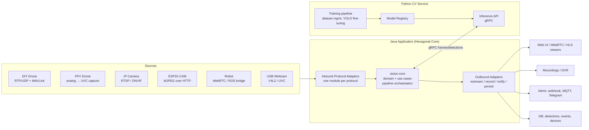

# Vision — Multi-Protocol Computer Vision & Streaming Platform

A modular platform that ingests video/telemetry from heterogeneous devices (DIY drones, FPV drones, IP cameras, ESP32-CAM, robots), runs computer vision on the frames (trainable object detection in Python), overlays CV judgements + telemetry on the video, and re-streams / records / alerts.

**Design principles:** Hexagonal (ports & adapters), SOLID, DRY, KISS. The core never knows *which* protocol or device a frame came from, and never knows *how* CV inference is implemented. Everything device- or protocol-specific lives in an adapter behind a port.

---

## 1. High-Level Architecture



### Why Java core + Python CV

| Concern | Choice | Reason |
|---|---|---|
| Protocol handling, orchestration, APIs | Java (Spring Boot) | Strong typing, concurrency (virtual threads), ecosystem for RTSP/WebRTC/MQTT |
| CV inference & training | Python | Ultralytics/PyTorch/OpenCV ecosystem is unmatched; models are trained where they're served |
| Boundary | gRPC (protobuf) | Binary-efficient for frames, streaming-native, contract-first (single `.proto` = single source of truth, DRY) |

The CV service is **replaceable**: the core only sees a `DetectionPort`. Later an ONNX-in-JVM adapter can implement the same port for edge deployments without Python.

---

## 2. Module Layout (Maven multi-module)

```
vision/                                  (parent pom, dependency management)
├── vision-domain/                       Pure domain model. NO framework deps, no Spring.
│   ├── model/        Device, StreamDescriptor, VideoFrame, Telemetry,
│   │                 Detection, BoundingBox, TrackedObject, AnnotatedFrame, Event
│   └── port/
│       ├── in/       (driving)  StartStreamUseCase, StopStreamUseCase,
│       │             RegisterDeviceUseCase, TrainModelUseCase, QueryDetectionsUseCase
│       └── out/      (driven)   VideoSourcePort, DetectionPort, OverlayPort,
│                     StreamPublisherPort, RecordingPort, EventPublisherPort,
│                     DeviceRepositoryPort, TelemetrySourcePort, ModelRegistryPort
│
├── vision-application/                  Use-case implementations (services), pipeline
│   │                                    orchestration, backpressure/frame-skip policy.
│   │                                    Depends ONLY on vision-domain.
│   └── pipeline/     StreamPipeline: source → decode → sample → detect →
│                     track → overlay → fan-out (publish/record/events)
│
├── adapters/
│   ├── adapter-rtsp/                    RTSP/RTP ingest (IP cams, some drones) — JavaCV/FFmpeg
│   ├── adapter-mjpeg/                   HTTP-MJPEG ingest (ESP32-CAM) + ESP32 control API client
│   ├── adapter-usb/                     UVC/V4L2 capture (webcams, analog FPV via capture dongle)
│   ├── adapter-webrtc/                  WebRTC ingest + egress (robots, browsers)
│   ├── adapter-udp-raw/                 Raw H.264/H.265 over UDP/RTP (DIY drone links)
│   ├── adapter-mavlink/                 MAVLink telemetry (GPS, attitude, battery) → TelemetrySourcePort
│   ├── adapter-onvif/                   ONVIF discovery + PTZ control
│   ├── adapter-cv-grpc/                 gRPC client → Python CV service (implements DetectionPort,
│   │                                    ModelRegistryPort). Owns the .proto contract.
│   ├── adapter-overlay/                 Frame annotation: boxes, labels, confidence, OSD telemetry
│   │                                    (Java2D/JavaCV) — implements OverlayPort
│   ├── adapter-publish-hls/             HLS/LL-HLS egress for browser viewing
│   ├── adapter-recording/               Segmented MP4 recording, retention policy
│   ├── adapter-persistence/             JPA/Postgres: devices, detections, events
│   └── adapter-notify/                  Webhook / MQTT / Telegram alert publishers
│
├── vision-api/                          Driving adapters: REST + WebSocket (control plane,
│   │                                    live detection feed, device management)
│   └── openapi.yaml                     Contract-first REST spec
│
├── vision-app/                          Spring Boot assembly: wiring, config, profiles.
│                                        The ONLY module that knows about all adapters.
│
└── cv-service/                          Python (not a Maven module; own repo dir)
    ├── proto/                           Symlink/copy of shared .proto
    ├── inference/                       gRPC server, YOLO (ultralytics), batching
    ├── training/                        Dataset ingest, augmentation, fine-tune jobs
    ├── registry/                        Model versions, metrics, promotion (staging→prod)
    └── Dockerfile                       CUDA + CPU variants
```

**Dependency rule (enforced with ArchUnit tests):**
`vision-domain` ← `vision-application` ← adapters ← `vision-app`. Nothing points outward. Adapters never depend on each other — shared needs go into a port or the domain.

---

## 3. Core Domain Concepts

| Concept | Description |
|---|---|
| `Device` | Registered source: id, type (DRONE, FPV, IP_CAM, ESP32, ROBOT), capabilities (video, telemetry, PTZ), connection descriptor |
| `StreamDescriptor` | Protocol-agnostic "how to get frames": URI + codec hints. Produced by device registration/discovery |
| `VideoFrame` | Timestamped decoded frame (or passthrough encoded packet) + source id |
| `Telemetry` | GPS, altitude, attitude, battery, RSSI — merged into the pipeline by timestamp |
| `Detection` | Class label, confidence, bounding box, model version |
| `TrackedObject` | Detection + stable track id across frames (tracking done core-side or CV-side) |
| `AnnotatedFrame` | Frame + rendered overlay (detections, OSD telemetry) |
| `Event` | Semantic occurrence: "person entered zone", "object of class X detected ≥N sec", "device offline" |
| `PipelineConfig` | Per-stream settings: target FPS for inference (sample rate), model id, confidence threshold, zones of interest |

### The Stream Pipeline (heart of the application layer)

```
VideoSourcePort ──frames──▶ Sampler ──every Nth──▶ DetectionPort (async)
      │                                                  │
      │ (all frames)                                     ▼ detections
      └────────────▶ OverlayPort ◀── latest detections + Telemetry
                          │
                          ▼ annotated frames
              ┌───────────┼──────────────┐
              ▼           ▼              ▼
    StreamPublisherPort RecordingPort  EventPublisherPort
```

Key policies (application layer, protocol-agnostic — KISS):
- **Frame sampling:** inference runs at e.g. 5–10 FPS while video passes through at full FPS; detections are interpolated onto intermediate frames by the tracker.
- **Backpressure:** if CV is slow, drop inference candidates (latest-wins), never block the video path.
- **Isolation:** one stream's failure never affects another (supervised pipeline per stream, virtual threads).

---

## 4. Python CV Service

### Inference (serving)
- gRPC bidirectional streaming: `DetectStream(stream FrameRequest) returns (stream DetectionResponse)` — avoids per-frame connection overhead.
- Ultralytics YOLO (v8/11) as default detector; pluggable model backends (classification, segmentation, OCR later).
- Batching across streams when GPU present; CPU fallback with smaller models (yolo*n*).
- Model hot-swap: core requests model by id/version; service loads from registry.

### Training ("train on different photos to search for different objects")
1. **Dataset management:** upload labeled images (or label in-app later), organized per target class; auto-split train/val; augmentation.
2. **Fine-tuning jobs:** start from a pretrained YOLO checkpoint, fine-tune on the custom dataset; async job with progress reporting (loss, mAP) streamed back to the Java control plane via gRPC.
3. **Registry & promotion:** each trained model gets a version + eval metrics; user promotes a model to a device/stream; rollback is switching versions.
4. **Feedback loop (later):** low-confidence or user-flagged frames land in a review queue → labeled → next training round.

### Contract (single `.proto`, shared)
```
service Inference   { rpc DetectStream(stream FrameRequest) returns (stream DetectionResponse); }
service Training    { rpc StartTraining(TrainingJobSpec) returns (stream TrainingProgress);
                      rpc ListModels(Empty) returns (ModelList);
                      rpc PromoteModel(ModelRef) returns (Ack); }
```

---

## 5. Protocol / Device Matrix

| Device | Video ingest | Control/telemetry | Adapter modules |
|---|---|---|---|
| IP camera | RTSP (H.264/H.265) | ONVIF (discovery, PTZ) | `adapter-rtsp`, `adapter-onvif` |
| ESP32-CAM | HTTP MJPEG / snapshot | HTTP REST (resolution, flash, etc.) | `adapter-mjpeg` |
| DIY drone (RPi/companion) | RTP/UDP H.264, RTSP | MAVLink over UDP/serial | `adapter-udp-raw` or `adapter-rtsp`, `adapter-mavlink` |
| FPV drone (analog) | Capture dongle → UVC | — (optionally crossfire/ELRS later) | `adapter-usb` |
| FPV drone (digital, e.g. DJI/OpenIPC) | RTSP/UDP from ground station | — | `adapter-rtsp` / `adapter-udp-raw` |
| Robot | WebRTC, or RTSP; ROS2 bridge later | MQTT / WebSocket | `adapter-webrtc`, (`adapter-ros2` future) |
| USB webcam | UVC/V4L2 | — | `adapter-usb` |

Every ingest adapter implements the same two-method port (KISS):
```java
interface VideoSourcePort {
    Flow.Publisher<VideoFrame> open(StreamDescriptor descriptor);
    void close(StreamDescriptor descriptor);
}
```
Adding a new protocol = new module implementing this port + a Spring auto-config. No core changes (Open/Closed).

---

## 6. Technology Choices

| Area | Choice | Notes |
|---|---|---|
| Java | 21, virtual threads | one pipeline per stream, cheap concurrency |
| Framework | Spring Boot 4.x (already in pom) | wiring/config only in `vision-app`; domain stays framework-free |
| Video decode/encode | JavaCV (FFmpeg bindings) | covers RTSP, UDP, MJPEG, UVC, muxing — one dependency for many adapters |
| Java↔Python | gRPC + protobuf | frame streaming, training control |
| WebRTC | Pion-based gateway or Janus/mediamtx sidecar | evaluate in Phase 4; don't hand-roll ICE/DTLS |
| MAVLink | dronefleet/mavlink (Java) | typed message dialect support |
| Persistence | PostgreSQL + JPA | detections, events, devices; TimescaleDB optional later |
| Messaging (internal) | Spring events → later MQTT/Kafka if scaling out | start simple (KISS) |
| Python CV | ultralytics, OpenCV, PyTorch | ONNX export path for future in-JVM inference |
| Packaging | Docker Compose (app + cv-service + postgres + mediamtx) | k8s later if needed |
| Frontend (thin) | Single-page UI: device list, live view (HLS/WebRTC), detection overlay toggle, training UI | keep minimal initially |

---

## 7. Roadmap

### Phase 0 — Skeleton & contracts *(foundation)*
- [ ] Convert to Maven multi-module per layout above (empty modules, parent dependencyManagement).
- [ ] `vision-domain`: model records + port interfaces.
- [ ] Shared `.proto` for CV contract; codegen wired for Java and Python.
- [ ] ArchUnit tests enforcing the dependency rule.
- [ ] Docker Compose skeleton; CI build.

### Phase 1 — First light: one source, end to end *(vertical slice)*
- [ ] `adapter-rtsp` ingest (works for IP cams and most drone companions — broadest value first).
- [ ] `StreamPipeline` in `vision-application` (passthrough, no CV yet).
- [ ] `adapter-publish-hls` egress + minimal web page showing live video.
- [ ] `vision-api`: register device, start/stop stream (REST).
- **Milestone: open an RTSP camera in the browser through the platform.**

### Phase 2 — CV core *(the point of the project)*
- [ ] Python `cv-service` inference server with pretrained YOLO (COCO classes).
- [ ] `adapter-cv-grpc` implementing `DetectionPort`; sampling + backpressure policy.
- [ ] `adapter-overlay`: boxes/labels/confidence burned into frames.
- [ ] Detections persisted (`adapter-persistence`) + live detection feed over WebSocket.
- **Milestone: browser shows live video with detection overlays; detections queryable.**

### Phase 3 — Training pipeline *(custom objects)*
- [ ] Dataset upload & management API (per-class photo sets).
- [ ] Training jobs (fine-tune YOLO), progress streaming to UI.
- [ ] Model registry + per-stream model selection, hot-swap.
- **Milestone: user uploads photos of a custom object, trains, and the live stream detects it.**

### Phase 4 — More devices & telemetry
- [ ] `adapter-mjpeg` (ESP32-CAM) + ESP32 control client.
- [ ] `adapter-usb` (webcams + analog FPV capture dongles).
- [ ] `adapter-mavlink` telemetry; OSD overlay (GPS, alt, battery) merged with CV overlay.
- [ ] `adapter-udp-raw` for low-latency drone links.
- [ ] `adapter-onvif` discovery; mDNS discovery for ESP32.
- **Milestone: drone flight with combined OSD + object detection view.**

### Phase 5 — Events, recording, alerting
- [ ] Event rules engine: zones, class filters, dwell time ("person in zone > 5 s").
- [ ] `adapter-recording`: continuous + event-triggered clips, retention.
- [ ] `adapter-notify`: webhook, MQTT, Telegram.
- **Milestone: platform acts on what it sees.**

### Phase 6 — Low latency & scale
- [ ] `adapter-webrtc` egress (sub-second viewing) and ingest (robots).
- [ ] Object tracking (ByteTrack/OC-SORT) for stable ids + interpolation.
- [ ] Multi-instance: externalize state, MQTT/Kafka event bus, CV service horizontal scaling.
- [ ] Metrics/observability: per-stream FPS, inference latency, drop rate (Micrometer + Grafana).

---

## 8. Ideas Backlog (beyond the roadmap)

- **In-app labeling tool** — draw boxes on captured frames; feeds the training loop directly.
- **Geolocation of detections** — project bounding box + drone GPS/attitude/camera intrinsics onto map coordinates; show detections on a map.
- **Edge mode** — ONNX Runtime adapter implementing `DetectionPort` in-JVM for a single-binary deployment on a companion computer (no Python).
- **PTZ auto-tracking** — ONVIF PTZ follows a selected tracked object.
- **Multi-camera fusion** — same object id across overlapping cameras.
- **Segmentation / pose / OCR backends** — same `DetectionPort` family, richer outputs (license plates, human pose for robotics).
- **ROS 2 bridge adapter** — robots publish images/subscribe to detections as ROS topics.
- **Stream health watchdog** — auto-reconnect, device-offline events, uptime stats.
- **Audio channel** — sound detection (e.g., drone motor anomaly) as a parallel analysis port.
- **Simulation source adapter** — file/loop playback implementing `VideoSourcePort` for testing and demos without hardware (build this early; it makes every phase testable).

---

## 9. Risks & Mitigations

| Risk | Mitigation |
|---|---|
| Latency: Java decode → gRPC → Python → back | Stream frames as JPEG/raw at reduced inference resolution; measure early (Phase 2 exit criterion: < 150 ms detect round-trip on CPU) |
| WebRTC complexity | Use mediamtx/Janus sidecar rather than implementing the stack |
| GPU availability varies | CPU-first defaults (nano models, low sample FPS); GPU as acceleration, not requirement |
| Adapter sprawl | Strict port contracts + a conformance test-kit module every ingest adapter must pass |
| Training UX scope creep | Phase 3 = folder-per-class upload only; labeling tool stays in backlog |

---

## 10. Testing Strategy

- **Domain/application:** plain JUnit, no Spring context; ports mocked.
- **Adapter conformance kit:** shared test suite (`vision-adapter-tck`) run against every `VideoSourcePort` implementation using the simulation source and container fixtures (e.g., an RTSP server container serving a test file).
- **Contract tests:** proto-driven tests both sides of the gRPC boundary; OpenAPI contract tests for REST.
- **E2E:** Docker Compose profile with simulated sources → assert detections appear via API.
- **ArchUnit:** dependency-rule enforcement in CI.
