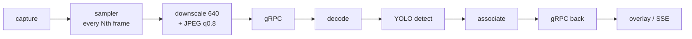

# CV rate, latency and confidence budget for drones — decomposition vs. implementation

**Status:** analysis, 2026-08-12. Companion to `docs/conclusions/TRACKING-REVIEW.md` (which asked
*why do we lose the subject* qualitatively); this one asks **at what rate, latency and confidence
the four CV jobs actually need to run**, derives the numbers, and compares them to what runs today.

**What "today" means.** `master` is at `a7a60ca`, which is **V1 tracking**. The `feat/tracking-v2`
merge (`bb8a6b3`) was made and then reset out (`master@{1}` in the reflog). Everything in the
"implemented" column below is V1 unless marked otherwise.

---

## 1. The premise: CV on a drone is four jobs, not one

They want opposite settings. Today they share one `confidenceThreshold`, one `inferenceFps`,
one `maxAgeFrames`.

| Job | Rate needed | Confidence | Latency tolerance | What failure costs | Metric |
|---|---|---|---|---|---|
| **Search** — is anything there? | **2–5 Hz** | **low, 0.20–0.25** — recall-first | 300–500 ms | a missed target | P(detect)/pass, time-to-first |
| **Hold** — don't lose it | **25–30 Hz** raw, or 10 Hz *compensated* | **near-zero floor, conditioned on the prediction** | **< 50 ms** | identity break → operator re-acquires manually | IDSW, track lifetime, MT/ML |
| **Geolocate** — where is it | 1–5 Hz | **high, 0.5+** | 200 ms | a false mark pollutes the COP | timestamp↔telemetry alignment |
| **Guide** — gimbal/velocity (gated) | ≥ 20 Hz | n/a | **total loop delay is the whole spec** | oscillation / runaway | phase margin |

Two consequences fall straight out, and both are structural:

1. **Search wants a low threshold; geolocation wants a high one.** One number cannot serve both.
2. **Hold does not want a *threshold* at all** — it wants *evidence conditioned on a prior*. A 0.15
   box sitting on the predicted position is strong evidence; the same 0.15 box in open field is
   noise. Any single global cut throws away the first along with the second.

## 2. The physics: on a drone, the camera moves faster than the target

Assumptions: **640 px** wide at the detector (`GrpcCvSettings.MAX_DETECT_WIDTH = 640`), **60° HFOV**
→ **10.7 px/deg**. Narrower FOV makes every number below *worse*, proportionally.

**Ego-motion (yaw) → pixels of displacement per frame**

| yaw rate | px/s | @10 fps (ASSOCIATE default) | @15 fps (FOLLOW) | @30 fps |
|---|---|---|---|---|
| 10°/s gentle | 107 | 10.7 | 7.1 | 3.6 |
| **30°/s normal search** | 320 | **32.0** | 21.3 | 10.7 |
| 60°/s | 640 | 64.0 | 42.7 | 21.3 |
| 90°/s aggressive | 960 | 96.0 | 64.0 | 32.0 |

**Target motion, for contrast** — a 15 m/s vehicle:

| slant range | ground width in frame | px/m | px/frame @10 fps |
|---|---|---|---|
| 100 m | 115 m | 5.54 | 8.3 |
| 200 m | 231 m | 2.77 | **4.2** |
| 400 m | 462 m | 1.39 | 2.1 |

> **The central number: at 30°/s yaw the camera moves the target 32 px/frame; the target's own
> motion contributes 4 px. Ego-motion is ~8× the target term.** Tracking a drone's video is
> mostly a camera-motion problem wearing a target-motion costume.

**The association budget.** For two boxes of width `w` displaced by `d`, `IoU = (w−d)/(w+d)`,
so the gate fails past `d = w·(1−t)/(1+t)`:

| box size | ByteTrack gate (`match_thresh 0.8` → IoU ≥ 0.20) | FOLLOW re-anchor (IoU ≥ 0.30) |
|---|---|---|
| **20 px** (distant target — the common case) | **13.3 px** | 10.8 px |
| 40 px | 26.7 px | 21.5 px |
| 80 px | 53.3 px | 43.1 px |

### The failure, stated as an inequality

> A **20 px** target, at **10 fps**, under **30°/s** yaw, moves **32 px** between frames against a
> **13 px** association budget. **32 > 13.** The track breaks — with no occlusion, no clutter and
> no target motion whatsoever. Just the drone turning.

That is your "it loses the subject", and it is arithmetic, not tuning. The same target survives at
30 fps (10.7 px < 13.3 px) *or* at 10 fps with ego-motion compensation (32 px of known camera
motion subtracted leaves the 4 px target term). **Rate and compensation are substitutes** — you
need one of them, and today we have neither.

## 3. The latency budget

| stage | cost | source |
|---|---|---|
| sampling wait @10 fps | 0–100 ms, mean 50 | `inferenceFps=10` |
| downscale + JPEG encode (Java2D) | ~3–8 ms | estimated |
| network out | ~1 ms LAN / 20–60 ms radio | estimated |
| cv-service JPEG decode | 0.6–2.1 ms | measured, MODULE.md |
| `yolo26n` detect @imgsz 416 | **22.8 ms** | measured |
| ( `orion12l` instead ) | **~343 ms** | measured |
| associate | 0.78 ms | measured |
| network back + publish | ~11–40 ms | estimated |

**Estimate at the time of writing: ~90 ms mean box age on a LAN, ~240 ms worst case.**

### Measured, 2026-08-12 — and the estimate was optimistic

`PipelineLatencyWindow` now exists, so these are readings rather than arithmetic. Localhost,
`yolo26n.pt` @ imgsz 416, synthetic `sim` source, `ASSOCIATE`/`cost`, `inferenceFps=10`, 162 samples:

| figure | measured |
|---|---|
| round trip p50 | **53.8 ms** |
| round trip p95 | **76.5 ms** |
| round trip max | **370.4 ms** |
| update interval p50 | **131.9 ms** |
| **effective fps** | **7.58** (configured: 10) |
| **worst box age** | **208.4 ms** |
| cv-service self-reported `inference_millis` p50 | **29 ms** |

Three things fall out, none of which were visible before:

1. **The number the system used to report understates what an operator sees by ~7×.**
   `inferenceLatency` said **29 ms**. The box on screen is up to **208 ms** old.
2. **Roughly half the round trip is not inference.** 53.8 ms round trip against 29 ms of
   inference leaves **~25 ms** of JPEG encode + gRPC + decode — *on loopback, with no network at
   all*. Over a radio link that term grows and the inference term does not.
3. **The stream does not run at the rate it is configured to.** `effectiveFps` is **7.58**, not 10,
   and the update interval is **132 ms**, not 100. In-flight bounding (`maxInFlightInferences=2`)
   against a 54 ms round trip caps throughput below the requested rate — so the configured
   `inferenceFps` is an upper bound the pipeline silently misses by 24%.

Converted through §2 at 30°/s yaw, 208 ms of box age is **67 px** of lag on a 640 px frame — 10% of
frame width, on the most favourable deployment there is.

> This was the same failure `TRACKING-REVIEW.md` found for accuracy ("nothing measures it, so the
> complaint is unfalsifiable"), repeated one axis over. V2 built `tools/trackeval` and closed the
> accuracy half; the latency half is now closed too, and the first thing it did was prove the
> estimate above too generous.

## 4. What we actually implement

| Need | Implemented | Verdict |
|---|---|---|
| Split search rate from hold rate | FOLLOW duty-cycles detector to 1-in-30, tracker every frame | ✅ **the right mechanism** |
| …engaged automatically | **No** — requires an operator click (`tracking.lock`) | ❌ never engages on its own |
| …for more than one object | **No** — `follow_top_k` = 1 | ❌ |
| Hold rate ≥ target dynamics | Fixed 10 fps (ASSOCIATE) / 15 fps (FOLLOW), `followFps` chosen for **bandwidth** (~1.2 MB/s), never for motion | ❌ rate is decoupled from physics |
| Ego-motion compensation | **None on master.** V2 has `flow` + `pose` (unmerged) | ❌ → V2 |
| `CameraPose` from telemetry | On the wire, **never populated** — MAVLink attitude is already in the system | ❌ both |
| Separate acquisition vs. continuation confidence | **One `confidenceThreshold`=0.4**, applied at `model.predict(conf=)` | ❌ see below |
| Coast predicts forward | **Freezes the box.** `velocity_x/y` computed in `track.py:194`, never read | ❌ → V2 (`predict.py`) |
| Object memory across occlusion | **None** — occlusion past `max_age` = new id | ❌ → V2 (`memory.py`) |
| End-to-end latency instrument | **None** | ❌ both |

### The confidence finding

`ByteTrackEngine` is configured `track_high_thresh=0.25`, **`track_low_thresh=0.1`** — ByteTrack's
whole premise is a *second association pass over low-score boxes*, which is what carries identity
through partial occlusion and motion blur.

But the threshold is applied **upstream, in the detector**: `servicers.py` passes
`confidence_threshold` into `YoloDetector.detect()` → `model.predict(conf=0.4)`. **No box below
0.4 is ever created.** The associator's low-score branch is unreachable in our deployment — we
pay for ByteTrack and run half of it.

> Fixing this is cheap and is *not* in V2: detect at a low floor (0.15–0.2), let the associator use
> the weak boxes for continuation, and apply the operator's 0.4 as a **presentation/event filter**
> on confirmed tracks. Recall goes up, the operator's screen does not get noisier.

### Measured, 2026-08-12 — the confidence split

`tools/trackeval` could not judge this: it gave every synthetic detection a flat `confidence = 0.9`,
so the low-confidence regime the split exists for was invisible. `--confidence-floor` /
`--detect-threshold` now model falling confidence with apparent size and the threshold the detector
runs at. On `small_target` (a 0.035-extent object, 35% of `reliable_size` → **modelled confidence
0.380**):

| detector threshold | MT | ML | track lifetime | outcome |
|---|---|---|---|---|
| **0.40** — where the operator's threshold used to land | 0 | **1** | n/a | **never tracked at all** |
| **0.15** — `CV_DETECT_FLOOR` | **1** | 0 | **78 / 80 frames**, 2 gaps, 100% recovered | tracked |

Same in `FOLLOW`: `ML=1` at 0.40, `MT=1` with an **80/80** lifetime at 0.15. Every other scenario is
unchanged, because only `small_target` models degrading confidence.

Two honest limits. The harness models the half of the change that decides *which boxes reach the
associator*, not the response filter (`_reportable`) — that half has unit tests only. And `0.25`
scores identically to `0.15` here, because 0.380 clears both: the case for `0.15` specifically is
that it sits below the associators' `high_confidence = 0.25` split, which is what makes the
two-stage match non-trivial, and **this scenario does not demonstrate that**.

## 5. Ranked gaps

| # | Gap | Status |
|---|---|---|
| 1 | Hold rate fixed at 10/15 fps, never derived from motion | **open** — next, and now measurable |
| 2 | No ego-motion compensation | **done** — V2 merged (`flow`/`pose`) |
| 3 | `CameraPose` never populated | **done** — yaw-only; see the defect below |
| 4 | One confidence for acquisition + continuation | **done + measured** (§4) |
| 5 | Coast freezes instead of predicting | **done** — V2 merged (`predict.py`) |
| 6 | No object memory across occlusion | **done** — V2 merged (`memory.py`) |
| 7 | FOLLOW is one target, human-triggered | **open** |
| 8 | No end-to-end latency measurement | **done + measured** (§3) |
| 9 | Tracker runs across the network | **open** — architectural, separate programme |

### The defect the measurement found

Gap 3 shipped with unit tests green and did **nothing** in a running app: `DefaultStreamService`
built its telemetry supplier only when an `OverlayPort` was present, because the telemetry OSD was
its only consumer when that code was written. A deployment with a configured field of view and no
overlay therefore sent **zero** `CameraPose` messages.

No test could see it. `StreamPipelineTest` injects the supplier directly — *including* the test
asserting that turning the telemetry OSD off must not disable compensation, which passes precisely
because it never exercises the construction one layer up. It was found by pointing the app at a
probe server and reading what actually arrived on the wire, and it is the fifth instance of this
repo's recurring failure mode: **mechanism right, tests green, outcome wrong.**

## 6. What was done, and what is next

Steps 1–4 of the original recommendation are done and merged (`56c7354`), measure-first as planned:
V2 re-merged, then the latency instrument, then `CameraPose`, then the confidence split — each with
its outcome checked by running the real path rather than by reading a green suite.

**Next, in order:**

1. **Adaptive rate (gap 1).** Now unblocked in both senses: pose gives predicted px/frame, and
   `PipelineLatency` gives the feedback signal. The principled form of "spend resources not to lose
   it" — raise the sample rate only when displacement approaches the association budget of §2.
   The measurement already argues for it: `effectiveFps` is 7.58 against a configured 10, so the
   rate control loop currently has no idea what it is actually achieving.
2. **Shrink the ~25 ms of non-inference round trip.** On loopback it is half the round trip and it
   is pure overhead: JPEG encode on the Java side, decode on the Python side. A BGR24 path for
   local deployments, or a smaller `detectWidth`, both target it directly.
3. **Decode `motion_engine_id` Java-side.** V2 added the wire field and nothing reads it, so which
   compensator served a frame is invisible from the operator's side — the same "built but not
   surfaced" shape that made `CameraPose` dead for a release.
4. **Per-asset field of view.** `camera-hfov-degrees` is one value per instance; a deployment
   mixing lenses needs it on the asset.
5. **MAVLink `ATTITUDE`.** Yaw-only captures the dominant term; pitch/roll would complete it, and
   the decoder does not exist yet.

Gap 7 (auto-promote to FOLLOW, multi-target) and gap 9 (tracker on-board, next to the camera) remain
open and are design work, not fixes. The existing portability invariants (P1/P2/P3) were written for
gap 9 — but it is a separate programme.
