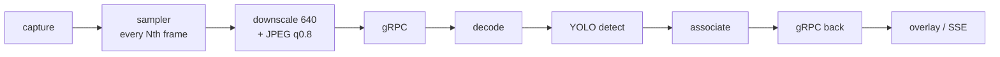

# CV rate, latency and confidence budget for drones — decomposition vs. implementation

**Status:** analysis, 2026-08-12. Companion to `docs/conclusions/TRACKING-REVIEW.md` (which asked
*why do we lose the subject* qualitatively); this one asks **at what rate, latency and confidence
the four CV jobs actually need to run**, derives the numbers, and compares them to what runs today.

**What "today" means.** `master` is at `a7a60ca`, which is **V1 tracking**. The `feat/tracking-v2`
merge (`bb8a6b3`) was made and then reset out (`master@{1}` in the reflog). Everything in the
"implemented" column below is V1 unless marked otherwise.

---

## 1. The premise: CV on a drone is four jobs, not one

They want opposite settings. Today they share one `confidenceThreshold`, one `inferenceFps`,
one `maxAgeFrames`.

| Job | Rate needed | Confidence | Latency tolerance | What failure costs | Metric |
|---|---|---|---|---|---|
| **Search** — is anything there? | **2–5 Hz** | **low, 0.20–0.25** — recall-first | 300–500 ms | a missed target | P(detect)/pass, time-to-first |
| **Hold** — don't lose it | **25–30 Hz** raw, or 10 Hz *compensated* | **near-zero floor, conditioned on the prediction** | **< 50 ms** | identity break → operator re-acquires manually | IDSW, track lifetime, MT/ML |
| **Geolocate** — where is it | 1–5 Hz | **high, 0.5+** | 200 ms | a false mark pollutes the COP | timestamp↔telemetry alignment |
| **Guide** — gimbal/velocity (gated) | ≥ 20 Hz | n/a | **total loop delay is the whole spec** | oscillation / runaway | phase margin |

Two consequences fall straight out, and both are structural:

1. **Search wants a low threshold; geolocation wants a high one.** One number cannot serve both.
2. **Hold does not want a *threshold* at all** — it wants *evidence conditioned on a prior*. A 0.15
   box sitting on the predicted position is strong evidence; the same 0.15 box in open field is
   noise. Any single global cut throws away the first along with the second.

## 2. The physics: on a drone, the camera moves faster than the target

Assumptions: **640 px** wide at the detector (`GrpcCvSettings.MAX_DETECT_WIDTH = 640`), **60° HFOV**
→ **10.7 px/deg**. Narrower FOV makes every number below *worse*, proportionally.

**Ego-motion (yaw) → pixels of displacement per frame**

| yaw rate | px/s | @10 fps (ASSOCIATE default) | @15 fps (FOLLOW) | @30 fps |
|---|---|---|---|---|
| 10°/s gentle | 107 | 10.7 | 7.1 | 3.6 |
| **30°/s normal search** | 320 | **32.0** | 21.3 | 10.7 |
| 60°/s | 640 | 64.0 | 42.7 | 21.3 |
| 90°/s aggressive | 960 | 96.0 | 64.0 | 32.0 |

**Target motion, for contrast** — a 15 m/s vehicle:

| slant range | ground width in frame | px/m | px/frame @10 fps |
|---|---|---|---|
| 100 m | 115 m | 5.54 | 8.3 |
| 200 m | 231 m | 2.77 | **4.2** |
| 400 m | 462 m | 1.39 | 2.1 |

> **The central number: at 30°/s yaw the camera moves the target 32 px/frame; the target's own
> motion contributes 4 px. Ego-motion is ~8× the target term.** Tracking a drone's video is
> mostly a camera-motion problem wearing a target-motion costume.

**The association budget.** For two boxes of width `w` displaced by `d`, `IoU = (w−d)/(w+d)`,
so the gate fails past `d = w·(1−t)/(1+t)`:

| box size | ByteTrack gate (`match_thresh 0.8` → IoU ≥ 0.20) | FOLLOW re-anchor (IoU ≥ 0.30) |
|---|---|---|
| **20 px** (distant target — the common case) | **13.3 px** | 10.8 px |
| 40 px | 26.7 px | 21.5 px |
| 80 px | 53.3 px | 43.1 px |

### The failure, stated as an inequality

> A **20 px** target, at **10 fps**, under **30°/s** yaw, moves **32 px** between frames against a
> **13 px** association budget. **32 > 13.** The track breaks — with no occlusion, no clutter and
> no target motion whatsoever. Just the drone turning.

That is your "it loses the subject", and it is arithmetic, not tuning. The same target survives at
30 fps (10.7 px < 13.3 px) *or* at 10 fps with ego-motion compensation (32 px of known camera
motion subtracted leaves the 4 px target term). **Rate and compensation are substitutes** — you
need one of them, and today we have neither.

## 3. The latency budget

| stage | cost | source |
|---|---|---|
| sampling wait @10 fps | **0–100 ms, mean 50** | `inferenceFps=10` |
| downscale + JPEG encode (Java2D) | ~3–8 ms | **estimated, never measured** |
| network out | ~1 ms LAN / 20–60 ms radio | **never measured** |
| cv-service JPEG decode | 0.6–2.1 ms | measured, MODULE.md |
| `yolo26n` detect @imgsz 416 | **22.8 ms** | measured |
| ( `orion12l` instead ) | **~343 ms** | measured |
| associate | 0.78 ms | measured |
| network back + publish | ~11–40 ms | **never measured** |

**Mean box age ≈ 90 ms on a LAN with `yolo26n`; ~240 ms worst case** (the box then sits on screen
ageing for the full 100 ms sample interval). Over a radio link, or with `orion12l`, add 100–350 ms.

Converted through §2 at 30°/s yaw: **90 ms = 29 px of lag, 240 ms = 77 px** — 12% of frame width.
That is a visibly trailing box, and it is exactly what you are seeing.

### Finding: nothing in the system measures this

`DetectionResult.inferenceLatency` is `response.getInferenceMillis()` — **cv-service's own compute
time**, not the round trip. `tracker_millis` likewise. The wire echoes `timestamp_millis`, so
capture→available is *derivable* and never derived. Every latency number in the repo is a
per-stage server cost.

> This is the same failure `TRACKING-REVIEW.md` found for accuracy ("nothing measures it, so the
> complaint is unfalsifiable"), repeated one axis over. V2 built `tools/trackeval` and closed the
> accuracy half. **The latency half is still open, and it is the half you are complaining about.**

## 4. What we actually implement

| Need | Implemented | Verdict |
|---|---|---|
| Split search rate from hold rate | FOLLOW duty-cycles detector to 1-in-30, tracker every frame | ✅ **the right mechanism** |
| …engaged automatically | **No** — requires an operator click (`tracking.lock`) | ❌ never engages on its own |
| …for more than one object | **No** — `follow_top_k` = 1 | ❌ |
| Hold rate ≥ target dynamics | Fixed 10 fps (ASSOCIATE) / 15 fps (FOLLOW), `followFps` chosen for **bandwidth** (~1.2 MB/s), never for motion | ❌ rate is decoupled from physics |
| Ego-motion compensation | **None on master.** V2 has `flow` + `pose` (unmerged) | ❌ → V2 |
| `CameraPose` from telemetry | On the wire, **never populated** — MAVLink attitude is already in the system | ❌ both |
| Separate acquisition vs. continuation confidence | **One `confidenceThreshold`=0.4**, applied at `model.predict(conf=)` | ❌ see below |
| Coast predicts forward | **Freezes the box.** `velocity_x/y` computed in `track.py:194`, never read | ❌ → V2 (`predict.py`) |
| Object memory across occlusion | **None** — occlusion past `max_age` = new id | ❌ → V2 (`memory.py`) |
| End-to-end latency instrument | **None** | ❌ both |

### The confidence finding

`ByteTrackEngine` is configured `track_high_thresh=0.25`, **`track_low_thresh=0.1`** — ByteTrack's
whole premise is a *second association pass over low-score boxes*, which is what carries identity
through partial occlusion and motion blur.

But the threshold is applied **upstream, in the detector**: `servicers.py` passes
`confidence_threshold` into `YoloDetector.detect()` → `model.predict(conf=0.4)`. **No box below
0.4 is ever created.** The associator's low-score branch is unreachable in our deployment — we
pay for ByteTrack and run half of it.

> Fixing this is cheap and is *not* in V2: detect at a low floor (0.15–0.2), let the associator use
> the weak boxes for continuation, and apply the operator's 0.4 as a **presentation/event filter**
> on confirmed tracks. Recall goes up, the operator's screen does not get noisier.

## 5. Ranked gaps

| # | Gap | Fixed by V2? | Cost |
|---|---|---|---|
| 1 | Hold rate fixed at 10/15 fps, never derived from motion | **No** | design |
| 2 | No ego-motion compensation — the dominant error term | **Yes** (`flow`/`pose`) | merge V2 |
| 3 | `CameraPose` never populated; IMU knows exactly what `flow` estimates badly | **No** | **~8 lines Java** |
| 4 | One confidence for acquisition + continuation; ByteTrack's low pass dead | **No** | small |
| 5 | Coast freezes instead of predicting; velocity computed, never read | **Yes** (`predict.py`) | merge V2 |
| 6 | No object memory across occlusion | **Yes** (`memory.py`) | merge V2 |
| 7 | FOLLOW is one target, human-triggered — never auto-promotes | **No** | design |
| 8 | No end-to-end latency measurement anywhere | **No** | small |
| 9 | Tracker runs across the network; transport costs 30–100× the tracker | **No** | architectural |

## 6. Recommendation

**Order matters — measure first, or you will tune blind.**

1. **Re-merge V2.** Gaps 2, 5, 6 are already built, tested (704 tests) and scored. Resetting it out
   left the three cheapest wins on the floor.
2. **Instrument latency** (gap 8). Derive capture→available from the echoed `timestamp_millis`,
   report it beside `inferenceLatency`, surface it in the flow strip. Until this exists, "delayed"
   stays an opinion.
3. **Populate `CameraPose`** (gap 3) — ~8 lines, turns on `pose` compensation *and* pays for S2
   geolocation. Highest value per line in the whole list.
4. **Split the confidence** (gap 4) — detect low, filter at presentation.
5. **Then** make the rate adaptive (gap 1): with pose available, compute predicted px/frame and
   raise the sample rate only when displacement approaches the association budget. This is the
   principled version of "spend resources not to lose it" — spend them *when the geometry says
   you're about to*.

Gap 9 (tracker on-board, next to the camera) is the real end state and the existing portability
invariants (P1/P2/P3) were written for it — but it is a separate program, not a fix.
