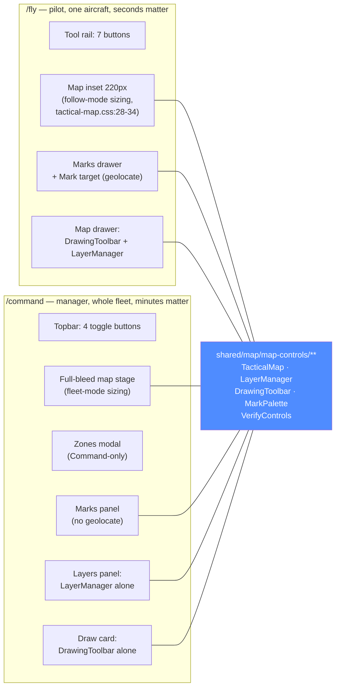

# MAP-UX-RESEARCH — two maps, one shared toolbox, and where the seams show

Status: **research / design proposal** (2026-08-16). Design only — no product code in this task.
Subject: the two map surfaces the product owner named — the Fly cockpit's map inset
(`station/vision-web/src/app/features/fly/cockpit.html`, `shared/map/tactical-map/**`,
`features/fly/marks-panel.*`) and Command's map-first dashboard
(`features/command/command.html`, `features/command/zones-panel.*`, `features/command/marks-panel.*`,
`features/command/asset-panel.*`) — plus the chrome shared between them
(`shared/map/map-controls/{layer-manager,drawing-toolbar,mark-palette,verify-controls}.*`). The
owner's verbatim complaint: *"Map in /fly and map in command. Buttons colours, Buttons itself,
settings — are overwhelming too."*

Grounding: every claim below cites the file and line actually read. Prior art this builds on rather
than repeats: `docs/conclusions/UX-SIMPLIFY-REVIEW.md` (F4 already named the Fly tool-rail as
creeping; this document finds it crept back), `docs/plans/active/CV-UX-RESEARCH.md` (this
document's structure and rigour), `.claude/skills/frontend-style/SKILL.md` +
`docs/plans/done/STYLE-TOKENS-PLAN.md` + `docs/plans/done/VISUAL-REFRESH-PLAN.md` (the colour rules
judged against in §4). No wire contract is touched by anything proposed; §9 states plainly that
nothing here needs a backend change.

---

## 1. Diagnosis — what is actually wrong

### 1.1 The headline finding: two buttons named "Layers", both on screen at once

On **both** surfaces, two separate controls are labeled "Layers" and do two different things,
visible simultaneously:

| Surface | Control A: "Layers" | Control B: also "Layers" |
|---|---|---|
| **Fly** | Map inset's own corner toggle — `<span class="chrome-toggle-label">Layers</span>` (`shared/map/tactical-map/tactical-map.html:15`) — opens a small floating panel: an eye-toggle per built-in/data layer plus a 4-button basemap picker (`tactical-map.html:18-74`) | Tool-rail button `aria-label="Map layers and drawing"`, icon `layers` (`features/fly/cockpit.html:366-372`) — opens the "Map" drawer: the full `<vision-drawing-toolbar>` *and* `<vision-layer-manager>` (create/rename/delete/grants) stacked in one side panel (`cockpit.html:234-243`) |
| **Command** | Same map-inset corner toggle, same component, same label (`tactical-map.html:15`, reused verbatim — `command.html:145-167` passes no `layout`/relabeling input) | Topbar button, literal text `Layers ({{ facade.layers.layers().length }})` (`features/command/command.html:17-19`) — opens `<vision-layer-manager>` alone in a side panel (`command.html:56-59`) |

Both are the word "Layers"; both are reachable at the same time; they open different UIs with
overlapping but not identical content (the map's own panel toggles *visibility* of what's already
plotted, the drawer/topbar version *manages* who can write to a shared layer and create new ones).
This is the same shape as `UX-SIMPLIFY-REVIEW.md`'s F1 ("`/command` is linked 3× … every duplicate
is an 'are these different?' tax") applied one level down, inside a single screen instead of across
the nav. It is a plausible, concrete reading of "settings are overwhelming": not that any one panel
is wrong, but that the same word points at two different things a few centimeters apart.

### 1.2 The Fly tool-rail: F4 said 7, the fix relabeled rather than removed one

`UX-SIMPLIFY-REVIEW.md:56-61` (F4, filed 2026-08-01) counted **7 drawers**: `flight · rc · cv ·
detections · marks · layers · help`, and recommended grouping by job or collapsing the less-used
ones. `cockpit.html:291-308`'s own comment claims this was resolved: *"`layers` folded into `cv` …
so the rail is down to 6) — frozen ids … flight · rc · cv · detections · marks · help"* — but that
enumeration **omits `map`**, which is still in the type (`features/fly/fly-logic.ts:123`:
`export type ToolRailPanelId = 'flight' | 'rc' | 'cv' | 'detections' | 'marks' | 'map' | 'help'`)
and still renders as its own rail button (`cockpit.html:366-372`). What actually happened: the *old*
`layers` drawer (a detection-boxes-rendering-mode toggle, unrelated to the tactical map) was merged
into `cv` — a real reduction — but `docs/plans/done/MAP-REWORK-PLAN.md` §5.2 then added a *new* `map`
drawer (layers + drawing) back in the same wave. Net count today, with a live stream and full
command rights (the common piloting case): **7 rail buttons**, identical to what F4 flagged,
wearing a comment that says 6. The grouping-by-job half of F4's fix *did* ship (`Control` / `Vision`
/ `Situational` / `Help`, `cockpit.html:309-385`) and is worth keeping — the count regression is the
open half.

The rail is otherwise disciplined: every button is `vision-icon-button` with a required `label`
(`shared/ui/icon-button.ts:102-103`), `variant="hud"` uniformly (no colour differentiates one group
from another — grouping is carried entirely by the `--hairline` divider, `cockpit.css:172-176`), and
the team's own comment explicitly rejects a "more" overflow here on safety-of-flight grounds
(`cockpit.html:296-298`: *"a thin `--hairline` divider … stands in for a text label … no 'more'
overflow — F4 explicitly rules that out on a safety-of-flight screen"*). Any wave below that touches
the rail must respect that constraint — the lever for Fly is what is *inside* each drawer, not
collapsing the rail itself.

### 1.3 One control with no visible affordance at all

The map inset's own on/off state (`CockpitFacade.mapVisible`, default persisted `true`,
`features/fly/cockpit-facade.ts:340,690-691`) has **no button anywhere in the template** — it is
toggled only by the keyboard shortcut `M` (`features/fly/cockpit.ts:208-211`), discoverable solely
by opening the Help drawer (`cockpit.html:259-261`: `<dt>M</dt><dd>Toggle the map inset</dd>`). A
first-time pilot who wants to hide the map to see more video has no on-screen way to find out how,
short of reading the shortcuts list. This is the inverse problem from §1.1/1.2 — not too many
buttons, but a control that is real, persisted, and invisible.

### 1.4 Full control inventory — "at rest" (drawers/dialogs closed)

The same counting discipline `CV-UX-RESEARCH.md` §1 used (a flat count of what's on screen, not
per-row repeats): every interactive element rendered with **no drawer open**, in the common case
(live stream, full command rights on Fly; an asset selected on Command).

**Fly — 15 controls at rest**, cockpit surface + visible map inset:

| # | Control | File:line | Mid-flight, can a pilot act on it in one glance? |
|---|---|---|---|
| 1 | Exit ‹ | `cockpit.html:68-70` | yes |
| 2 | Drone switcher | `cockpit.html:78-85` | yes — the primary "which aircraft" act |
| 3 | Bring home (conditional) | `cockpit.html:95-100` | yes — named, gated, one-shot |
| 4 | Rail: Flight controls | `cockpit.html:312-318` | yes |
| 5 | Rail: Controller (RC) | `cockpit.html:321-327` | yes |
| 6 | Rail: Detection controls + off-dot | `cockpit.html:333-344` | yes (opens the panel `CV-UX-RESEARCH.md` already covers) |
| 7 | Rail: Detections strip | `cockpit.html:346-354` | yes |
| 8 | Rail: Marks | `cockpit.html:359-365` | yes |
| 9 | Rail: Map layers and drawing | `cockpit.html:366-372` | **ambiguous** — see §1.1, its own icon says "layers" and so does the inset's corner button 2 cm away |
| 10 | Rail: Help | `cockpit.html:377-383` | yes, but it is reference, correctly last |
| 11 | Map inset: Layers toggle | `tactical-map.html:6-16` | **no** — a pilot cannot tell from the glyph alone that this is a *different* Layers than #9 |
| 12 | Map inset: Follow/Following | `tactical-map.html:80-89` | yes |
| 13 | Map inset: Expand/Collapse | `tactical-map.html:90-92` | yes |
| 14 | Map inset: Legend toggle | `tactical-map.html:157-167` | yes |
| 15 | Start/Stop stream (+ Replay link) | `cockpit.html:388-412` | yes — the primary act |

Plus the map-inset visibility toggle itself (§1.3), which is a real, persisted control with **zero**
on-screen representation — not countable as an "at rest" button because there is nothing to count.

**Command — 16 controls at rest** (an asset selected, the common working state):

| # | Control | File:line |
|---|---|---|
| 1 | Zones (N) | `command.html:11-13` |
| 2 | Marks (N) | `command.html:14-16` |
| 3 | Layers (N) | `command.html:17-19` |
| 4 | Draw | `command.html:20-28` |
| 5 | Include archived checkbox | `command.html:29-36` |
| 6 | Asset rail collapse chevron | `command.html:116-124` |
| 7 | Map: Layers toggle | `tactical-map.html:6-16` (same component as Fly's #11) |
| 8 | Map: Recenter/Auto-fit | `tactical-map.html:93-103` (non-follow variant) |
| 9 | Map: Legend toggle | `tactical-map.html:157-167` |
| 10 | Panel collapse chevron | `command.html:179-188` |
| 11 | Asset panel: Close × | `features/command/asset-panel.html:7` |
| 12–14 | Asset panel: Status/Telemetry/Video tabs | `asset-panel.html:10-20` |
| 15 | Asset panel: Watch live | `asset-panel.html:131` |
| 16 | Asset panel: Details | `asset-panel.html:132` |

(Bring home, #17, is conditional on `canBringHome()`.) Command's asset **rail rows** (N, data-driven)
sit outside this count — they are a list, the equivalent of table rows, not settings.

Both surfaces land in the same 15–16 range "at rest" — the overwhelm is not lopsided toward one
screen.

### 1.5 What is inside the shared drawers, once opened

These are identical components on both hosts (`layout` input only changes CSS, not content —
`shared/map/map-controls/drawing-toolbar.ts:43`), so counted once:

- **Drawing toolbar**: 4 mode buttons (Line/Polygon/Arrow/Text, `DRAW_KINDS`,
  `core/map-data/drawings-logic.ts:66`) + Stop drawing (conditional) + 5 colour swatches
  (`drawing-toolbar.html:30-43`) + a conditional selected-drawing editor (label input, 5 recolour
  swatches, Deselect, Delete — `drawing-toolbar.html:47-84`). **10 fixed controls**, before any
  drawing exists to select.
- **Mark palette**: 5 kind buttons × 4 affiliation buttons presented as **two rows of buttons (5+4
  = 9)**, deliberately not a 20-cell grid (`shared/map/map-controls/mark-palette.ts:33-38` — this
  is a documented, good decision, not a finding against it) + a layer `<select>` + label/note inputs
  + Save/Cancel, or a single "Place mark" arm button at rest. **~10 fixed controls** once armed.
- **Layer manager**: New-layer trigger → create form (name input, Personal/Team segmented, team
  select, Create/Cancel) + per-layer Access/Rename/Delete (only on rows the server resolved MANAGE,
  `layer-manager.html:102-111`, correctly hidden otherwise) + a grants editor (Person/Team segmented,
  subject select, level select, Add, per-grant select+Remove, Save/Cancel —
  `layer-manager.html:128-208`). **The single densest control cluster on either map surface** — a
  full access-control admin UI, not a viewing control.
- **Marks list** (per surface): a filter chip + per-mark row (select, and up to 4 buttons —
  Confirm/Edit/Clear/Delete, `features/fly/marks-panel.html:65-72` /
  `features/command/marks-panel.html:55-61`) + on selection, verify controls (Confirm/Reject/
  Promote, `shared/map/map-controls/verify-controls.html:7-28`, Promote gated on `canPromote()`).
  Fly's version adds one Fly-only control the Command version does not have: **"Mark target"**, a
  one-click geolocate-from-drone-nose button (`features/fly/marks-panel.html:7-14`) — correctly
  absent from Command, which has no single aircraft to point.

None of this is wrong in isolation — every gate cited above (`canManage`, `canPromote`,
`canCreateTeamLayer`) is server-resolved-access-driven, not a client role guess, exactly the
degrade-honestly rule this app holds itself to elsewhere. The overwhelm is that the **full
admin-grade layer manager** — create/rename/delete/grants, four selects, two segmented controls —
is one tool-rail click away inside the same cockpit a pilot uses to fly, competing for the same
drawer as the thing a pilot might actually reach for mid-flight (drop a mark). See §3.

---

## 2. The operator's real tasks, ranked

**Fly (pilot, mid-flight, seconds matter):**

1. Fly the aircraft — not this document's concern, but it is why every other control here is
   competing for attention against the one that matters.
2. Know where the aircraft is relative to terrain/boundaries — the map inset itself, at rest.
3. Drop a mark on something seen right now ("Mark target" geolocate, or click-to-place) — occasional,
   must be fast.
4. Toggle the map inset on/off to reclaim video space — occasional; **currently has no visible
   control** (§1.3).
5. Check a zone hasn't been breached — passive; the failsafe banner already surfaces a breach
   without the pilot opening anything (`cockpit.html:18-22`, out of this map's controls entirely).

Set-once / between-flights (calm hands):

6. Pick a basemap for lighting/terrain conditions.
7. See who else marked what (the legend, the marks list).

Not a pilot's task at all, misplaced if reachable mid-flight:

8. Create a team layer, grant a teammate access to it, rename/delete a layer — an org/fleet
   administration task, not a flying one (§3).

**Command (manager, planning + monitoring, minutes matter, multiple aircraft):**

1. See the whole fleet's state at a glance — the map + asset rail, at rest.
2. Triage: which asset needs attention right now — rail row severity + map marker colour, at rest.
3. Author a geofence before a flight — the Zones modal, deliberately a focused dialog (§3).
4. Manage who can see/edit a shared layer — the Layers panel; this **is** the right home for it.
5. Drop/annotate a mark for the team — the Marks panel, occasional.
6. Draw a boundary/arrow to brief a flight — the Draw toolbar, occasional.
7. Watch one asset's video without leaving the fleet view — the asset panel's Video tab.

The two lists barely overlap past "see the map and drop a mark." Task 8 on Fly's list and task 4 on
Command's list are **the same UI** (`<vision-layer-manager>`) reached from a mid-flight drawer on one
host and a calm planning screen on the other.

---

## 3. Two products, one shared toolbox



**Correctly Fly-only:** Start/Stop stream, Flight/RC controls, Follow/Expand camera modes, "Mark
target" geolocate. These need one aircraft in frame and make no sense fleet-wide.

**Correctly Command-only:** the asset rail, fleet Recenter/Auto-fit, and the Zones modal — geofence
*authoring* is a pre-flight planning task with a full backdrop dialog
(`features/command/zones-panel.html:1`, `role="dialog" aria-modal="true"`) precisely because it
should not be interruptible by an accidental map click, which a mid-flight cockpit would never want
to block.

**Shared and correctly so:** `MarkPalette`/marks list, `DrawingToolbar`, the map's own legend and
basemap picker. Annotating the shared tactical picture is legitimately "any in-scope viewer," on
either screen (`cockpit.html:245-247`'s own comment states this explicitly), and the two hosts
already diverge appropriately for it — Fly gets "Mark target," Command doesn't.

**Shared and mis-weighted: `LayerManager`.** Command's Layers panel is the right home for
create/rename/delete/grants — it is a manager's tool, reached deliberately, not fighting for space
with anything time-critical. Fly's Map drawer stacks the *identical* component underneath the
drawing toolbar (`cockpit.html:239-241`). For a plain pilot with no MANAGE grant anywhere, this
mostly self-hides (rename/delete/grants render only per-row on `canManage(layer)`,
`layer-manager.ts:74` / `layer-manager.html:102`) — but the **create-layer form and the full layer
list still render unconditionally** regardless of role, and any pilot who also happens to manage
their team's default layer (a normal shape for a small crew) gets the full grants editor — two
segmented controls, two selects, an Add button, a per-grant row with its own select+Remove — open in
the same 320px drawer as the thing they actually reached for mid-flight. This is the single clearest
instance of "wrong surface" on either map: not a bug, a placement.

---

## 4. Button colours, judged against the design tokens

**`.btn` / `.chip` / `.dot` themselves: clean.** A pass over every button in scope — the mark
palette, drawing toolbar, layer manager, zones panel, asset panel, marks panels — turns up no raw
hex, no ad-hoc colour, and consistent semantics: `.btn.danger`/`.danger-action` red only for
Delete/Reject-adjacent destructive acts (`geofence-zone-dialog` has none; the destructive acts are
`zones-panel.html:47` Delete, `drawing-toolbar.html:75` Delete, `layer-manager.html:109` Delete,
`marks-panel.html:71` Delete — all `.danger-action` or `.btn.danger`, none plain `.btn`), `.chip`'s
`accent`/`ok`/`warn`/`danger` variants used for exactly the state they name (zone kind
`chip[class.danger]="KEEP_OUT"` / `[class.accent]="KEEP_IN"`, `zones-panel.html:24-26`; asset
severity `severity-chip[class.danger]="critical"` / `[class.warn]="warning"`,
`command.html:104-106`; failsafe `fs-chip`, `command.html:100` — this app's *own* colour rule from
`frontend-style` §3: "status colours mean state, nothing else"). Mark affiliation colour is the one
deliberately expanded palette (blue/red/green/amber = friendly/hostile/neutral/unknown,
`tactical-map.css:356-361`, documented as APP-6-inspired symbology) — and it correctly pairs colour
with *shape* (rounded/diamond/square/quatrefoil) so it never depends on colour alone
(`tactical-map.css:360-361`). This part of the owner's complaint does not hold up against the actual
`.btn`/`.chip` usage: it is disciplined, on both maps.

**Where colour actually drifts: the Leaflet-native paint layer**, which cannot consume CSS custom
properties (`tactical-map-logic.ts:430-436`'s own comment states the constraint correctly: *"Leaflet
writes path colours as SVG presentation attributes, which do not resolve `var(--token)`"* — a real
platform limit, not a shortcut). The literals chosen to work around it have quietly drifted from the
token system they claim to mirror, in three concrete, checkable ways:

1. **They mirror the *dark* theme only, and light is now the default.** `TRAIL_COLOR = '#4f8cff'`
   (`tactical-map-logic.ts:438`) and `KEEP_IN_COLOR = '#4f8cff'`
   (`core/geofence/geofence-logic.ts:90`) exactly equal `--blue-500` — which is `--color-info`'s
   **dark**-theme value (`styles.css:84,329`). The **light**-theme (default,
   `styles.css:4`'s own header: *"light is the default theme"*) value of `--color-info` is
   `--blue-600` = `#2e6bcf` (`styles.css:139,199`) — a different, less saturated blue. So on the
   default light theme, the drone trail, every "accent"/"info"-toned drawing, and every keep-in
   zone boundary render in the *dark* theme's blue, not the one the rest of the (redesigned, light)
   chrome around them uses. The comment at `geofence-logic.ts:89` even names the **pre-migration**
   token (`--accent`, not today's `--color-info`) — a stale reference from before the two-theme
   split (`VISUAL-REFRESH-PLAN.md`) that nobody updated when the colour itself froze.
2. **The drawing toolbar's own "danger" swatch matches no token at all.** `KEEP_OUT_COLOR =
   '#ff5d5d'` (`geofence-logic.ts:88`) does exactly equal dark `--red-500`/`--color-danger`
   (correct, if theme-frozen, per point 1) — but `DRAWING_COLORS.danger = '#e5484d'`
   (`tactical-map-logic.ts:443`) is neither `--red-500` (`#ff5d5d`) nor light `--red-600`
   (`#c9333f`, `styles.css:150`) nor anything else in the tier-1 ramp. Same for `warn: '#f5a524'`
   (`tactical-map-logic.ts:444` — matches neither `--amber-500` `#ffb340` nor `--amber-600`
   `#b26a00`) and `success: '#30a46c'` (line 445 — matches neither `--green-500` `#37c977` nor
   `--green-600` `#1f7f4c`). Three of the drawing toolbar's five colour swatches are an orphaned,
   unrelated palette (`tactical-map-logic.ts:434`'s own comment claims *"every literal below mirrors a
   `src/styles.css` tier-2 token"* — true for 2 of 6, not for the rest). A pilot picking "danger" red
   for a drawn line gets a visibly different red than a "keep-out" zone boundary two clicks away, on
   the same map.
3. **A genuine semantic contradiction, not just a drift.** The Fly cockpit deliberately treats
   "detection is off" as a *normal*, non-alarming state — the video-stage notice for it is
   explicitly a neutral pill, "never the amber `.notice`... reserved for a genuine problem"
   (`cockpit.html:42-49`'s own comment). The tool-rail's small indicator dot for the identical
   state, 200px away on the same screen, is `background: var(--color-danger)` — red
   (`cockpit.css:186-194`, comment: *"the CV rail button's own 'detection is off' tell"*). One
   surface says "this is fine" in a neutral tone; the other says "this is bad" in the app's one
   alarm colour, for the same fact. This is map-adjacent (the `cv` rail button sits directly beside
   the `map` rail button) and is exactly the kind of thing that reads as "colours are overwhelming"
   even though each individual use, read in isolation, looks intentional.

**"Video surfaces always dark" check:** the map inset lives inside the cockpit's `.surface-dark`
root (`cockpit.html:17`) and correctly never introduces `--hud-*`/`--scrim*` on any of its own
*panel* chrome (`tactical-map.css`, `drawing-toolbar.css`, `layer-manager.css` grep clean).
Command's map sits on an ordinary themed page, and its overlay chrome is correctly `--panel-raised`
+ `--border` + `--shadow` cards, never `--hud-*` — the drawing toolbar's own doc comment states the
rule and follows it (`drawing-toolbar.css:9-12`: *"never `--hud-*`, which is only legal inside a
`.surface-dark` video enclave"*). The one place a `.surface-dark`-only token *does* appear on a
themed page is the two map-owned modals' backdrop scrim — `background: var(--hud-bg-strong)` in
both `features/command/zones-panel.css:13` and `features/command/geofence-zone-dialog.css:13` — but
this is not a map-specific slip: it is the exact line `shared/ui/confirm-dialog.css:13` uses for
*every* modal backdrop in the app, map or not, so a reviewer would reasonably read it as an
established (if not literally spelled out in frontend-style §2) app-wide convention for dimming
layers specifically, rather than something these two map dialogs got wrong on their own. Flagged for
completeness, not filed as a wave below — fixing it, if it needs fixing, is a `shared/ui` job, not a
map job. Net: both surfaces pass the rule that matters (panel/control chrome never fakes a HUD look
on a themed page); the Leaflet paint-layer drift in points 1–3 above is the real, map-specific
defect.

---

## 5. What to delete

1. **The map inset's own floating "Layers" panel, on both hosts.** Its content (visibility toggles
   for built-in/data layers, the basemap picker) is real and worth keeping, but as a *second*,
   differently-scoped "Layers" surface sitting a few centimeters from the first (§1.1), it is the
   single cheapest deletion available: fold the eye-toggle rows and the basemap picker into the
   existing Map/Layers drawer (which already exists on both hosts) and relabel the map's own corner
   button to something that cannot be confused with it — "Basemap", or drop the standalone button
   and make the legend's own panel carry a basemap row. Either reading removes one whole floating
   panel and one duplicate label, changes nothing about what a viewer can still do.
2. **The create-layer form's unconditional visibility inside Fly's Map drawer.** Not a delete of the
   capability — Command keeps it in full — but the create-a-new-layer flow (name input, Personal/
   Team segmented, team select, Create/Cancel) has no reason to render by default inside a mid-flight
   drawer for a pilot who is not managing anything. Gate its visibility the same way rename/delete
   already are (`canManage`-shaped), or move it behind one more disclosure step specific to the Fly
   host only.
3. **The rail's red "detection off" dot.** Recolour (not remove) to match the honest neutral framing
   the stage notice already uses for the same state (§4 point 3) — a one-line CSS change, but it
   removes a real, current contradiction rather than adding a new control to explain it.

Deliberately **not** proposed for deletion: the mark kind × affiliation two-row picker (9 buttons,
already the result of a documented anti-slop decision, `mark-palette.ts:33-38`); the 4-basemap
picker (four real, different data sources — the same "roster size is a deploy-config problem, not a
panel problem" logic `CV-UX-RESEARCH.md` §5 applied to the model roster); the Zones modal's own
weight (geofence authoring is legitimately the one map task that should demand full attention); any
of the tool-rail's 7 buttons (§1.2 — the safety-of-flight "no overflow" rule already on record rules
this out; the fix is what is behind each button, not the button count).

---

## 6. Proposed layout sketches

**Fly — Map drawer, after §5's fold:**

```
┌─ Map ─────────────────────────────────── ✕ ─┐
│  Draw   [Line][Polygon][Arrow][Text]   Stop  │
│  Colour ●●●●●                                │
│                                              │
│  Show on map                                 │
│  [eye] Assets (1)        [eye] Zones (2)     │
│  [eye] Recon east — Team (4 marks)           │
│  Basemap  [Standard][Night][Relief][Sat]     │
│                                              │
│  ▸ Manage layers            (only if you     │  ← collapsed unless canManage()
│    manage at least one)     manage one       │    is true for at least one row
└────────────────────────────────────────────┘
```

**Command — the two "Layers" buttons resolved to one:**

```
Topbar:  [Zones (2)] [Marks (7)] [Layers (3)] [Draw]  ← the one entry point

Map corner (no longer says "Layers"):
┌─ Basemap ──┐
│ [Standard] │
│ [Night]    │
│ [Relief]   │
│ [Satellite]│
└────────────┘
```

---

## 7. Waves — ranked, disjoint, estimated

All waves are **pure frontend** (vision-web); each ends with `npm test` + `npx tsc --noEmit` + prod
build green and `station/vision-web/MODULE.md` updated. No wave touches the wire contract (§9).

| Wave | What | Size | Files (disjoint) |
|---|---|---|---|
| **M1 — kill the duplicate "Layers" label** | Fold the map inset's eye-toggle rows + basemap picker into the existing Map/Layers drawer content on both hosts; relabel or remove the map-corner button per §6's sketch | **M** | `shared/map/tactical-map/{tactical-map.html,tactical-map.ts,tactical-map.css}`, `shared/map/map-controls/layer-manager.{html,ts}` |
| **M2 — gate the create-layer form on Fly** | Fly's Map drawer only: hide the "New layer" trigger/form unless the viewer already manages ≥1 layer or has no layer at all to contribute to (mirrors the existing `canManage`/`noWritableLayer` computed pattern already in this file) | **S** | `shared/map/map-controls/layer-manager.{ts,html}` (a Fly-only input flag), `features/fly/cockpit.html` |
| **M3 — fix the detection-off dot colour** | Recolour `.rail-dot` from `--color-danger` to a neutral tone matching the stage notice's own framing (§4 point 3) | **XS** | `features/fly/cockpit.css` |
| **M4 — re-derive the Leaflet paint-layer literals from the live theme** | Replace the frozen dark-only hex in `TRAIL_COLOR`/`DRAWING_COLORS`/`KEEP_IN_COLOR`/`KEEP_OUT_COLOR` with values read from `getComputedStyle` against the *current* theme (light default / dark / `.surface-dark`) at construction time, so a drawn line matches its own token in whichever theme is active instead of being frozen to the pre-VISUAL-REFRESH dark values; while touching this, replace the three orphaned drawing-toolbar hex values (`danger`/`warn`/`success`) with the values that actually match the current tier-1 ramp | **M** | `shared/map/tactical-map/tactical-map-logic.{ts,spec.ts}`, `core/geofence/geofence-logic.{ts,spec.ts}` |
| **M5 — a visible map-inset toggle on Fly** | Give `mapVisible` an on-screen affordance (a small icon-button near the inset or folded into an existing corner) so `M` is a shortcut for a discoverable control, not the only way in (§1.3) | **S** | `features/fly/cockpit.html`, `features/fly/cockpit.css` |
| **M6 — Command's Zones/Marks/Layers/Draw topbar: name check** | Once M1 ships, re-read the topbar row for any remaining ambiguous pairing (e.g. "Draw" vs the Layer manager's own per-drawing edit) and tighten copy; low-risk polish, sequenced last so it is judged against the post-M1 screen, not today's | **XS** | `features/command/command.html` |

Sequencing: **M1 first** (it is the finding with the most relief for the least risk — a rename/fold,
no capability lost). **M3** is independent and trivial — ship it any time, even standalone. **M2**
depends on nothing but is Fly-only, parallel-safe with M1 once M1's drawer-content move lands (same
files, sequence after). **M4** is the only wave that touches non-Angular colour logic (pure
`*-logic.ts` functions with existing `.spec.ts` siblings) — independent of the others, can run in
parallel. **M5** is independent. **M6** is last on purpose.

---

## 8. What I deliberately did not propose

- **Removing a tool-rail button, or adding a "more" overflow to Fly's rail.** The team already
  decided against this specifically for the safety-of-flight reason quoted in §1.2
  (`cockpit.html:296-298`). Nothing here contradicts that; M1/M2 work *inside* the `map` drawer, not
  on the rail's own button count.
- **Merging the mark kind/affiliation picker into one control.** Already the outcome of a considered
  anti-slop decision (`mark-palette.ts:33-38`); revisiting it would be re-litigating a settled call
  with no new evidence.
- **Collapsing the Zones modal into a drawer to match Marks/Layers/Draw.** The three non-blocking
  drawers all exist specifically so map clicks still reach the map underneath while they're open —
  Zones is a full backdrop deliberately, because geofence authoring is a focused task that *should*
  block accidental clicks. Making it consistent with the others would remove a property it needs.
- **A new mid-flight "who is flying" control.** `docs/conclusions/OPS-UX-REVIEW.md` §A2/§A3 already
  names the deeper "nobody owns control of an aircraft" / "no observer role" problem — real, but a
  role/authority change touching the backend, out of this document's pure-frontend, map-chrome scope.
- **Rewriting the affiliation/mark-symbol colour scheme.** It is the one part of §4 already correct
  by design (colour + shape, theme-aware, documented) — untouched.
- **A shared "MapChrome" super-component that unifies Fly's and Command's map hosts into one.** The
  two are legitimately different products (§3) with different sizing contracts
  (`tactical-map.css:1-9`'s own header names this deliberately: "two sizing contracts, one per
  mode"); forcing one host component would re-introduce the coupling the current split correctly
  avoids. The fix is in what each host *shows* from the shared toolbox, not in merging the hosts.

---

## 9. Backend changes required

**None.** Every wave in §7 is reachable against the frontend alone: M1/M2/M5/M6 are template/
component restructuring with existing data; M3 is a CSS token swap; M4 reads the *already-served*
theme tokens at draw time instead of hardcoding a stale snapshot of them — no new endpoint, no wire
change, nothing in `core/api/vision-api.ts` or `models.ts` is touched by anything proposed here.
