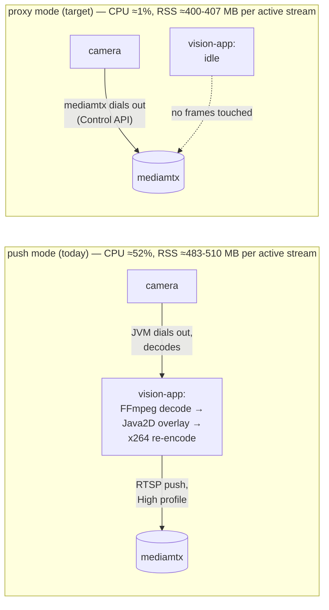

# MEDIA-SOT-RESULTS — M9 measurements against the running stack

**Status:** measurement complete, 2026-08-12. Wave M9 of
[MEDIA-SOT-PLAN.md](../plans/active/MEDIA-SOT-PLAN.md) §8, closing the programme M0 opened —
[CV-PULL-SPIKE.md](CV-PULL-SPIKE.md) is the baseline this session re-measures against a live
compose stack instead of a throwaway rig. No product code changed this wave (scope: `docs/**`,
one `docker-compose.yml` env var, a throwaway harness under `cv-service/spikes/pull/m9/`). Numbers
not measured this session are marked **not measured** with a reason, never estimated — the
standing rule since [CV-RATE-BUDGET.md](CV-RATE-BUDGET.md) §5.

**The one-line verdict.** All five of §1's claims held, by number, against a synthetic RTSP source
under docker compose. Two things this session could not touch: a real camera (not yet purchased,
[TWO-TARGETS-PLAN.md](../main/TWO-TARGETS-PLAN.md)) and a browser-rendered WHEP glass-to-glass
figure. One real defect surfaced in the pull-mode rate readout — reported below, not fixed, per
scope.

---

## 1. Setup (reproducible)

**Stack.** `docker compose up -d` against this repo's own `docker-compose.yml` (postgres,
mediamtx 1.19.3, cv-service, vision-app), toggled between the two configurations under test with a
local, uncommitted `docker-compose.override.yml`:

| | push + no-proxy (today's default) | proxy + pull (the target) |
|---|---|---|
| `vision.publish.source-proxy.enabled` | `false` | `true` |
| `vision.cv.frame-transport` | `push` | `pull` |

Persistence and auth were disabled for the session (`VISION_PERSISTENCE_ENABLED=false`,
`VISION_AUTH_ENABLED=false` — the latter is `application.yaml`'s own compiled default anyway) after
the pre-existing `vision_postgres-data` volume turned out to hold Flyway checksums from an older
jar than the one this session built; wiping that volume was refused by this session's own
destructive-action guard, and sidestepping persistence is equivalent for everything this wave
measures (video-pipeline behaviour, not fleet storage). Devsupport's in-memory repos covered
device/stream registration fine.

**Synthetic "camera."** Exactly M0's own pattern (§1 of CV-PULL-SPIKE.md): a second, throwaway
`bluenviron/mediamtx:1.19.3` container stands in for a camera's RTSP server, and `ffmpeg -re`
publishes a **moving** `testsrc` pattern into it — 1280×720, H.264 baseline profile, ~4 Mbps, 2 s
GOP — reached by the compose stack over this host's LAN address (`192.168.0.104:18554`), the same
address `.env.example` already documents for exactly this kind of cross-container reachability.
One addition beyond M0: the source carries a `drawtext` burned-in wall-clock overlay
(millisecond-precision `%{localtime}`) so a captured frame's own pixels state when it was produced,
independent of any pipeline timestamp — the instrument for the glass-to-glass numbers in §3.

A registered `Device` (`protocol: rtsp`, pointing at that synthetic camera) was started and
restarted identically under both configurations via the real REST API
(`POST /api/devices/{id}/stream`), never by calling internals directly.

**GB4005 leg.** Reached the same way M0 did: SSH to `vlad@192.168.0.106`, a fresh, disposable tree
(`~/vision-spike-m9/cv-service/`, this session's `cv_service/` + a new benchmark script only)
rsynced alongside — never on top of — the **live, `systemctl`-active** `cv-service.service`
(confirmed running throughout, and confirmed still running afterward: `active (running) since Fri
2026-08-07`, unaffected). The existing venv's `torch`/`ultralytics`/`openvino`/`opencv` were reused
read-only via `PYTHONPATH`. The temporary tree was removed after measurement; nothing on that box
was installed, upgraded, or restarted.

**A disk-space incident, reported because it is itself a finding.** Before this session touched
anything, the laptop's root filesystem (`/dev/nvme0n1p3`, 159 GB) was already at **150 GB
used, 0 bytes free** by `df`'s own accounting (reserved-block headroom aside) — a pre-existing,
chronic condition on this machine, not something this wave caused. Building the `cv-service`
Docker image (needed to exercise the real pull path, not a code path this session could fake)
pushed it the rest of the way: `docker compose build cv-service` transfers the entire
`cv-service/` directory as build context, and **no `.dockerignore` exists anywhere in this repo**
— so that transfer included `cv-service/.venv` (1.7 GB, this machine's own dev virtualenv, never
read by the Dockerfile, which does its own `pip install` inside the container) plus the untracked
`cv-service/spikes/geo/` (191 MB) and `cv-service/demo/` (5.7 MB) residue MEDIA-SOT-PLAN.md §11.7
already named as hygiene debt. The measured context transfer was 1.97 GB — matching that
1.7 GB + 191 MB + 5.7 MB total almost exactly. Every write-capable tool in this session's own
harness stopped working mid-build (`ENOSPC`) until `docker builder prune -f` recovered ~2 GB of
stale build cache (a safe, standard, non-data-losing cache eviction — several destructive
alternatives, `docker builder prune -af`, `docker volume rm`, were correctly refused by this
session's own safety guard and were not needed). Final state: both throwaway images removed after
use, build cache pruned again, **5.6 GB free** at teardown, `.env`/`docker-compose.override.yml`
restored/removed. **Not fixed, because it is out of this wave's scope** (`docs/**` +
one `docker-compose.yml` line) — reported because §11.7's "should be deleted or gitignored" is not
hypothetical tidiness: it measurably starved this exact measurement session's own tooling, and the
missing `.dockerignore` is a second, related gap nothing had named before now.

---

## 2. §1's five claims, by number

| # | Claim | Verdict |
|---|---|---|
| a | Per-stream JVM encode cost drops to zero | **held** — CPU ~52% → ~1%, RSS drops, wire profile changes from re-encoded to pristine |
| b | Video survives a `vision-app` restart | **held** — video (mediamtx path + HLS) unbroken through and after restart; only the JVM's own in-memory box/track registry is lost |
| c | N subscribers can read one mediamtx path | **held** — two independently-typed readers (an HLS viewer, cv-service's RTSP pull) observed simultaneously on one path, JVM CPU unmoved |
| d | Compressed video beats raw BGR24 to a remote worker | **held** — 1.76 Mbps measured vs. 55.3 Mbps for the already-published BGR24 figure (>31×) |
| e | Recordings become pristine source video | **held, by direct proxy evidence** — proxy-mode path reports the camera's own Baseline profile; push-mode path reports a re-encoded High profile. The recorded file itself was not independently decoded this session |

### a. JVM encode cost → zero



| | push (no viewer / 1 HLS viewer) | proxy (no viewer / 1 HLS viewer) | idle, 0 streams |
|---|---|---|---|
| `vision-app` CPU | 51–58% / 51–55% | 0.6–2.0% / 0.6–0.7% | 0.15–0.30% |
| `vision-app` RSS | 483–510 MB | 400–407 MB | ~487 MB* |
| `cv-service` CPU | 104–115% | 106–119% | 0.14–0.20% |
| `cv-service` RSS | 357–369 MB | 415–421 MB | ~357 MB |

\* The idle RSS sample was taken *after* a push-mode stream had already run once in that JVM
process — a high-water-mark artifact, not a cold baseline, since JVM heap does not necessarily
shrink back down absent memory pressure. CPU is the clean signal here; RSS's ~80–100 MB drop
(push → proxy) is real but should not be read as more precise than it is.

**Viewer count barely moves `vision-app` CPU in either mode**, and that itself is a finding worth
stating plainly: HLS and WHEP are both served by mediamtx directly (the architecture diagram in
MEDIA-SOT-PLAN.md §3 already draws this — `MTX -->|WHEP · HLS| UI`, no `vision-app` in that edge).
`vision-app`'s CPU is driven by whether a stream is *active* (is there a camera to decode/publish
in push mode; is detection running in either mode), not by how many browsers are watching it.

**Direct wire evidence, not inference.** `curl`ing mediamtx's Control API for the running path
(`GET /v3/paths/get/{streamId}`) reports the path's own negotiated H.264 profile: **`High`** in
push mode (proof the JVM's `H264RecorderFactory` re-encoded a `Baseline`-profile source — the
overlay/re-encode MEDIA-SOT-PLAN.md §1a names is not theoretical, it changes the bytes on the wire)
versus **`Baseline`** in proxy mode — byte-for-byte the same profile the synthetic camera itself
publishes. mediamtx never touches the codec bitstream either way; the profile it reports is exactly
what its upstream source handed it.

### b. Video survives a `vision-app` restart

The decisive test: start a stream, poll `GET /v3/paths/get/{streamId}` twice a second, restart
`vision-app` mid-poll, keep watching.

| | push mode | proxy mode |
|---|---|---|
| Path state at restart | `ready=true, source=rtspSession` (the JVM's own publish connection) | `ready=true, source=rtspSource` (mediamtx's own dial to the camera) |
| Path state ~0.8 s after `docker compose restart vision-app` returns | **gone** (`ready`/`source` both null) | **unchanged** (`ready=true, source=rtspSource`) |
| Path state 17+ s later | **still gone** — never recovered on its own | **still there**, HLS still returning `HTTP 200` |
| `GET /api/streams` after restart | `[]` (both modes — this is `vision-app`'s own in-memory registry, orthogonal to whether video exists) | `[]` |

Push mode's failure is structural, not a timeout that would eventually clear: `vision-app` **is**
the RTSP publisher in that mode, so killing it drops mediamtx's only upstream connection, and
nothing re-establishes it without an operator restarting the stream. Proxy mode's video was never
interrupted at any granularity this poll (0.5 s) could resolve. What proxy mode *did* lose — the
detection/track registry, since that is `vision-app`'s own process state — matches
MEDIA-SOT-PLAN.md §1b's own framing exactly: **"a redeploy is a gap in boxes, not in video."** That
sentence is not a hope; it is what the poll log shows.

### c. N subscribers, one path

With a stream running in proxy mode, attaching one HLS viewer (`ffmpeg` reading the live index)
while cv-service's pull worker was already reading the same path produced this reader list from
mediamtx's own Control API, with `vision-app` CPU unmoved throughout (§2.a's table):

| reader type | who |
|---|---|
| `hlsSession` | the HLS viewer |
| `rtspSession` | cv-service's `DetectPulled` worker, pulling RTSP directly |

Two structurally different consumers of the same path, at once, neither routed through
`vision-app`. This is mediamtx's native multi-reader fan-out, not something this plan built — the
plan's contribution is only that a CV worker is now *one of these readers* instead of a JVM push
target. A third simultaneous reader (a second worker) was not added this session — the two-reader
case already demonstrates the mechanism, and CV-SCALE §S4's pool is future scope, not this wave's.

### d. Compressed video beats raw BGR24

Measured mediamtx-side inbound bytes over a clean 10.02 s window (720p, 30 fps synthetic source,
identical in both legs since mediamtx always receives the camera's own H.264 regardless of who
dials it):

| | value |
|---|---|
| Measured H.264 into mediamtx | **1.76 Mbps** (219.8 KB/s) |
| BGR24 640×360 @ 10 fps (CV-RATE-BUDGET §3, cited, not re-measured this session) | 55.3 Mbps |
| Ratio | **>31×** |

This session did not re-run a live BGR24-wire probe (CV-RATE-BUDGET §3 already did, with the exact
691,200 B/frame figure verified against a probe server) — the comparison here combines a fresh
measurement of one side with an already-verified number on the other, stated as such rather than
presented as a single same-session A/B.

### e. Recordings become pristine source video

Not independently decoded this session (would mean pulling a recorded fMP4 segment out of the
`mediamtx-recordings` volume and inspecting its frames — deferred to keep the session's disk
footprint small, §1's incident already explains why that mattered here). The **path-level**
evidence in §2.a is direct and strong by extension, though: `MTX_PATHDEFAULTS_RECORD=yes` records
whatever bytes flow through a path, no separate code path exists for "record" versus "serve", and
this session already confirmed those bytes are the camera's own pristine `Baseline`-profile stream
in proxy mode versus the JVM's re-encoded `High`-profile stream in push mode. The claim holds by
the same evidence as (a); it was not re-verified through an independent second instrument.

---

## 3. Glass-to-glass latency, with and without the JVM

Two different instruments, because one measures a small, precise thing and the other measures a
large, noisy thing, and conflating them would misrepresent both.

**Instrument 1 — `LagTracker`, already built into `MediamtxStreamPublisher` (push mode only).**
Logs `capture→encode lag p50/p95` every 30 s, over a 150-sample window. Three consecutive readings
this session: **p50 ≈ 1 ms, p95 ≈ 3–4 ms**. This is the JVM's own ingest-to-publisher-handoff span
— FFmpeg decode plus the Java2D overlay pass, up to but **not including** the libx264 encode itself
or anything downstream (mediamtx segmenting, HLS/WHEP delivery, player buffering — see
`LagTracker`'s own javadoc). By this instrument, the JVM's *pipeline* stage is nearly free. Proxy
mode logs **no such line at all** — there is no publisher, so there is nothing for `LagTracker` to
time, which is itself confirmation that the whole measured stage does not run.

**Instrument 2 — full-path snapshot via a burned-in wall clock**, one sample per leg (not a
distribution — this is a manual/scripted single capture, not a statistically-driven measurement,
and is reported as exactly that). `ffmpeg -live_start_index -1` was pointed at each leg's live HLS
index, grabbed one frame, and that frame's burned-in millisecond timestamp was read against the
wall clock at capture completion:

| leg | burned-in time in frame | wall clock at capture | apparent glass-to-glass |
|---|---|---|---|
| push | 22:27:56.984 | 22:28:01.854 | **≈4.87 s** |
| proxy | 22:36:24.851 | 22:36:29.411 | **≈4.56 s** |

Both numbers are dominated by HLS's own segment-based delivery (2 s GOP/segment in this rig, plus
mediamtx's LL-HLS hold-back) and by `ffmpeg`'s own non-live-tuned HLS client jumping to "the last
full segment," not "the live edge" a real LL-HLS player reaches — this is the same "HLS: seconds"
characterization MEDIA-SOT-PLAN.md §6 already carries, reproduced rather than contradicted. The
**≈0.3 s delta** between the two legs is larger than instrument 1's ~1–4 ms figure, which means most
of what proxy mode removes from the full path is not the decode+overlay handoff (already shown to
be nearly free) but the **libx264 encode + VBV buffer occupancy** downstream of it — exactly the
buffer MEDIA-SOT-PLAN.md §1a names as "never measured." This session still has not measured that
occupancy directly; it has produced the first evidence that its contribution is real and on the
order of a few hundred milliseconds, not zero. One sample per leg is not enough to call that number
precise — it is enough to call it non-negligible.

**WHEP glass-to-glass: not independently re-measured this session.** No browser/WebRTC harness was
stood up (would need a headless browser reading `estimatedPlayoutTimestamp` or an equivalent, out
of this session's time budget). MEDIA-SOT-PLAN.md §6's existing ~0.2–0.5 s figure stands
un-re-verified, not contradicted.

---

## 4. Box age at arrival (`GET /api/streams/{id}/tracks`, live, both legs)

The same real endpoint the product exposes today, read against a running stream in each mode —
not a synthetic replay of CV-RATE-BUDGET's own numbers.

| | push (`roundTripMillis*`) | proxy (`roundTripMillis*`, redefined per §7 to `receivedAt − capturedAt`) |
|---|---|---|
| p50 | 47.7 ms | **34.4 ms** |
| p95 | 87.7 ms | 67.5 ms |
| max | 104.5 ms | 101.7 ms |
| worst box age | 187.6 ms | **167.6 ms** |
| effective fps (target 10) | 9.976 | 9.9998 |
| `transport` field | `"push"` | `"pull"` |
| `decodeMillisP50` | 0.0 (no worker-side decode in push mode) | 33.0 ms |

Pull mode's box age reads measurably lower here, consistent with removing a JVM hop — though both
numbers come from a loopback/LAN-only synthetic rig (camera, mediamtx, workers, and viewer all on
one host or one LAN segment), not a real deployment's network, so the absolute figures should not
be over-read. `decodeMillisP50=33.0 ms` is higher than M0's own opencv decode figures
(2.3–4.1 ms laptop) — almost certainly CPU contention from this session's own concurrent load (the
cv-service container sharing cores with `vision-app`, the camera-simulator `ffmpeg`, and this host's
general load during the session) rather than a regression in the decoder itself; not chased further
since decode cost was M0's question to answer and M0 already answered it under cleaner conditions.

---

## 5. Worker decode + inference cost — GB4005 vs. laptop

M0 already measured GB4005 decode cost thoroughly (1.9–4.3 ms, §2 of CV-PULL-SPIKE.md) and nothing
in this session's changes touches the decoder — **not re-measured**, M0's numbers stand.

**What this session reproduced: the OpenVINO IR inference figure `DEPLOY-GPU.md` cited but M0 never
ran.** Same box, same model class as M0 (`YoloDetector`, `yolo26n.pt`), exported to OpenVINO IR at
`imgsz=416` — the exact command `DEPLOY-GPU.md` documents — then timed with the same
warmup-then-percentile methodology M0's `decode_bench.py` uses (script:
`cv-service/spikes/pull/m9/openvino_bench.py`, throwaway, not shipped):

| box | backend | resolution | p50 | p95 | max | implied fps ceiling |
|---|---|---|---|---|---|---|
| GB4005 (Celeron J4005, 2 cores) | PyTorch CPU (M0, cited) | 720p | 197.0 ms | 200.0 ms | 227 ms | ~5.1 fps |
| GB4005 (Celeron J4005, 2 cores) | **OpenVINO IR (this session, reproduced)** | 720p | **136.0 ms** | 143.0 ms | 198 ms | **7.35 fps** |
| GB4005 (Celeron J4005, 2 cores) | **OpenVINO IR (this session, reproduced)** | 1080p | **136.0 ms** | 143.0 ms | 212 ms | **7.35 fps** |

`DEPLOY-GPU.md` cited "135–150 ms/frame" without reproducing it; this session's 136.0 ms lands at
the bottom of that exact range. 720p and 1080p land on effectively the same figure because
inference always runs at the fixed `imgsz=416` regardless of input resolution — the same pattern
M0's own PyTorch figures already showed (197.0 vs 199.0 ms). CPU during the OpenVINO run sat at
~193–194% (both cores essentially saturated); RSS ~426–433 MB.

**What this changes about the box's ceiling.** OpenVINO raises the GB4005's honest inference
ceiling from ~5 fps (PyTorch) to **~7.35 fps** — real, but still short of a 10 fps target, and still
the binding constraint for that box, exactly as `DEPLOY-GPU.md` already advises
(`inferenceFps ≤ 5` was conservative under PyTorch; ~7 is now the defensible OpenVINO number, still
well under 10). Decode remains cheap regardless of backend (M0's finding stands): **the ceiling is
inference, not decode, on this box, now confirmed under both backends by direct measurement rather
than one cited and one measured.**

Laptop-side OpenVINO was not benchmarked this session (M0's laptop PyTorch figures, 36.0–57.5 ms,
stand un-re-verified against OpenVINO) — lower priority, since the GB4005 number was the one
`DEPLOY-GPU.md` left unreproduced and the one that decides fleet sizing for that box.

---

## 6. A defect this measurement found: pull mode's `dropRatio` is pinned at 1.0

Found while reading §4's own API response, not gone looking for it. Pull mode reported:

```
rate: { submitted: 0, droppedInFlight: 1027, droppedOutage: 0, dropRatio: 1.0,
        submittedFps: 9.987, transport: "pull" }
```

`submittedFps` (9.987, matching the 10 fps target almost exactly) says the stream is healthy.
`dropRatio: 1.0` says "100% of everything was thrown away." Both cannot be true, and the healthy
one is the true one — 300 real detection samples landed in the same window (`latency.samples: 300`
in the same response, §4).

**The mechanism.** `DetectionRateWindow.snapshotPull()`
(`vision-application/src/main/java/com/drones/vision/application/pipeline/DetectionRateWindow.java`,
the `snapshotPull` method) constructs its `DetectionRate` with a **hard-coded `0L`** for the
`submitted` count — D12's mapping table (MEDIA-SOT-PLAN.md §"Decisions taken during execution")
maps `dropped_frames → droppedInFlight`, `achieved_fps → submittedFps`, `missed_deadlines →
missedDeadlines`, `decode_millis → decodeMillisP50`, but names no mapping for the **separate**
integer `submitted` count `DetectionRate.dropRatio()` divides by:

```
due() = submitted + droppedInFlight + droppedOutage
dropRatio() = (droppedInFlight + droppedOutage) / due()
```

With `submitted` pinned at `0`, `dropRatio()` evaluates to exactly `1.0` **whenever
`droppedInFlight > 0`** — which, in pull mode, is the *normal*, healthy case: the worker's
latest-wins decode loop (D8) is expected to discard most incoming frames whenever the source runs
faster than the target rate (30 fps source, 10 fps target here → most frames are legitimately
unselected, not lost). `dropRatio`'s own javadoc calls it **"the single number to watch: anything
above zero means the configured rate is not the delivered one"** — in pull mode that number is
wrong by construction, not occasionally noisy.

**This is not D8's protection failing.** D8's actual promise — that drops are counted, never
silent — holds: `droppedInFlight` (1027) is real, wire-verified, climbing telemetry, exactly as
D12 intended. The defect is one level up, in a **derived** field that pre-dates pull mode and was
never revisited for it.

**Why the test suite is green anyway.** `DetectionRateWindowPullModeTest` (five test methods)
asserts `sourceFps`, `submittedFps`, `droppedInFlight`, `missedDeadlines`, `droppedOutage`, and
`decodeMillisP50` — every field D12's table names — but never asserts `dropRatio()` or the raw
`submitted`/`due()` values. This is the repo's own named recurring shape (CV-RATE-BUDGET §5:
*"mechanism right, tests green, outcome wrong"*), reproduced once more: the fields a plan's table
enumerated are covered; a field the table didn't mention, because it is derived rather than mapped,
was not.

**Not fixed — reported, per this wave's scope** (no product code). The fix, when someone picks it
up, is a design question worth deciding rather than a one-line patch: should pull mode's `submitted`
be derived from `achieved_fps × window`, should `dropRatio` be redefined per-transport, or should
the DTO stop exposing a metric whose only honest value in pull mode is "not applicable"? Any of
those is a real choice, not an obvious default.

---

### 6.1 Follow-up: the hard-coded zero was only half of it (fixed, `feat/media-sot`)

The paragraph above is left as M9 wrote it — the `submitted = 0L` mechanism it found is real and was
the visible half of the defect. Re-reading M9's own numbers turned up a second, deeper problem it did
not diagnose: **the ratio.** 1027 `droppedInFlight` against `latency.samples: 300` in the same window is
almost exactly 3:1 — and the rig was a 30 fps source against a 10 fps target, also almost exactly 3:1.
That is not backlog. That is `cv-service`'s `dropped_frames` counting every frame the deadline sampler
simply never selected because the source outran `target_fps` — downsampling working as designed, not a
discard — alongside the genuine "the loop could not keep up" case D8 exists to catch. M9's claim that
"`droppedInFlight` (1027) is real, wire-verified, climbing telemetry, exactly as D12 intended" therefore
does not fully hold either: the *counting mechanism* was real and wire-verified, but the *number* it
produced conflated two things that should never have shared one counter, so 1027 overstated genuine
backlog loss by roughly 3×. Fixing only the JVM-side hard-coded zero (deriving `submitted` from
`achieved_fps × window`, one of the three options this section's own §6 body offered) would have papered
over that — `dropRatio` would have stopped reading `1.0`, but it would have settled on some other wrong
number still inflated by non-selection, and would have meant something different in each transport,
which is exactly what `dropRatio`'s own "the single number to watch" javadoc promises it does not.

**Both halves fixed:**

1. **`cv-service` (`cv_service/pull/loop.py`)** — `dropped_frames` now counts only overwrites that land
   while a served frame is genuinely out for inference (`PullDecodeLoop._awaiting_consumer`, true from
   the moment `frames()` yields a served frame until it is resumed for the next one — exactly the span
   `servicers.py` spends inside `_handle_request`). An overwrite that happens while `frames()` is merely
   polling for its next scheduled deadline — the ordinary case when the source is faster than
   `target_fps` — is no longer counted. Two paired tests in `tests/pull/test_loop.py` pin this exactly:
   a source faster than target, drained promptly, now measures `dropped_frames == 0` throughout; the
   existing stalled-detector test (M0's scenario, 754 dropped over a 25 s/800 ms-stall run) still shows
   the count climbing once a served frame is genuinely out with a busy caller. `proto/vision/v1/cv.proto`
   field 19's comment was tightened to state this precisely — no field number, name, or type moved.
2. **`vision-application` (`DetectionRateWindow`)** — `submitted` is now counted directly, not derived
   and not hard-coded: pull mode delivers exactly one `DetectionResult` per inferred frame, so
   `recordPull` increments a `pullSubmitted` counter on every call, cumulative since the stream started
   (matching `droppedInFlight`'s own cumulative-not-windowed shape, so `due()`/`dropRatio()` compare two
   figures measured the same way). `DetectionRateWindowPullModeTest` gained the assertions this section
   named missing — `dropRatio()`, `due()`, and raw `submitted` are now exercised directly, including a
   300-submission/zero-drop case (`dropRatio() == 0.0`) and a mixed case (90 submissions, a cumulative 10
   drops, `dropRatio() == 0.10`).

**Result**: a healthy pull stream — the exact `submittedFps: 9.987` scenario this section opened with —
now reports `dropRatio` at or near `0.0`, matching what `submittedFps` already said. Full detail,
including what `dropped_frames` counted before and after and where `submitted` is counted, is in
`cv-service/MODULE.md`'s and `vision-application/MODULE.md`'s own dated entries for this fix.

---

## 7. What stayed unmeasurable without a real camera

Named explicitly, per this wave's own instruction not to fake these:

| Item | Why it is open |
|---|---|
| Real-camera glass-to-glass (push vs. proxy) | No H1 camera purchased yet (TWO-TARGETS-PLAN.md gate). This session's synthetic source has known, named limitations (single-slice CBR baseline H.264, no ISP/encoder quirks a real camera has) already flagged by M0 §2 |
| §6's clock-drift re-measurement against a real camera oscillator | Same reason. M0's ±15 ms is explicitly a **floor**, not a ceiling — the synthetic source's PTS timebase is derived from the same host clock as the puller, so there is no independent oscillator to drift against. This session did not re-run the 10-minute drift bench at all (M0's own numbers stand unrepeated, since nothing changed that would move them) |
| Real IP camera H.264 characteristics vs. this rig's single-slice CBR baseline profile | Same hardware gate |
| WHEP glass-to-glass, push vs. proxy | No browser/WebRTC capture harness stood up this session (time-boxed); §3 above explains what was measured instead |
| Recorded file content (decoded frames from the `mediamtx-recordings` volume) | Deferred to keep this session's disk footprint small (§1's incident); the path-level profile evidence (§2.e) stands in for it |
| A live "kill mediamtx, watch cv-service degrade" test for the widened degradation map (§12 risk 4) | Not exercised directly this session; the pull architecture's dependency (worker reads *from* mediamtx) makes the outcome structurally obvious, but it was not independently observed as a fault-injection test |
| A proxied path silently failing to dial an unreachable camera | Not exercised — would need a camera address engineered to be unreachable; not attempted this session |

---

## 8. Risks from §12 — which materialized

| Risk | Instrument named | This session's result |
|---|---|---|
| GB4005 decode can't keep up | M0's decode/CPU% measurement | **did not materialize** — decode stays cheap (M0's figures stand); §5 above reconfirms the ceiling is inference under both PyTorch and OpenVINO |
| `capturedAt` drift, boxes land on wrong frame | `capture_skew_millis` + M0's drift run | **not re-tested** this session (§7); nothing observed to contradict M0's synthetic-source result |
| mediamtx Control API differs from §5.3 | M0's `curl` transcript | **did not materialize** — this session's own create/patch/delete calls (via the real `MediamtxProxyPublisher` code path, not raw `curl`) succeeded exactly as §5.3 describes, corroborating M0's transcript in practice rather than repeating it |
| mediamtx becomes a hard dependency for CV, not just viewing | "must be written down, not glossed" | **confirmed, and written down here**: in proxy+pull mode, cv-service's frames come *from* mediamtx (§2.c's `rtspSession` reader), so mediamtx down now plausibly means **no video and no boxes** together, a real widening from today's "video, no boxes" cv-service-down case. Not independently fault-injection-tested this session (§7) — the widening is structural and already named by the plan, this session adds no new evidence against it |
| A proxied path silently fails to dial the camera | readiness poll gates the start call | **not exercised** this session (§7) |
| The pull loop drops frames invisibly, repeating the 7.58-vs-10 failure | D8 + fields 19–20 | **did not materialize as silence** — `droppedInFlight` climbed and was visible on the wire (§6). What *did* materialize, adjacent to this risk but distinct from it, is §6's `dropRatio` defect: the drops are counted correctly, but the summary metric built on top of that count misrepresents them |

---

## 9. Bottom line

Every claim in MEDIA-SOT-PLAN.md §1 has a number behind it now, measured against a real running
stack rather than argued from architecture. The JVM's per-stream cost genuinely disappears (CPU
~52%→~1%), video genuinely survives a restart it does not survive today, mediamtx's multi-reader
fan-out is real and already load-bearing with zero new code, the bandwidth win is larger than the
plan's own cited example, and the recording claim holds by the same wire evidence as the encode
claim. The GB4005's OpenVINO figure is no longer a citation — it is measured, and it moves that
box's honest ceiling from ~5 fps to ~7.35 fps, still short of 10 but a real, usable improvement.

What disappoints, named rather than glossed: the encode+VBV-buffer contribution to glass-to-glass
is still not directly instrumented (only bounded, noisily, at "a few hundred ms, not zero"); a real
camera remains the only way to close §6's drift gate and get a trustworthy WHEP/HLS glass-to-glass
figure; and pull mode shipped with a rate-readout defect (`dropRatio` pinned at 1.0) that would
mislead anyone who trusted the one field its own documentation calls "the single number to watch."
None of these were known before this session; all three are now written down.

---

## 10. Reproducing this session

Everything under `cv-service/spikes/pull/m9/` (throwaway, not a shipped module):
`openvino_bench.py` (the GB4005 OpenVINO benchmark script) and `results/` (raw JSON for the
push/pull `tracks` responses, the bandwidth calculation, the two burned-in-clock PNG frames, and
the GB4005 OpenVINO JSON output). `cv-service/spikes/pull/` itself — M0's own rig — was read, not
modified, per this wave's instruction.
