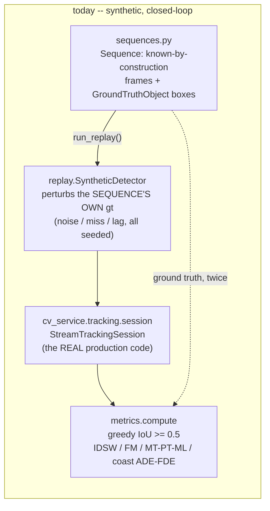
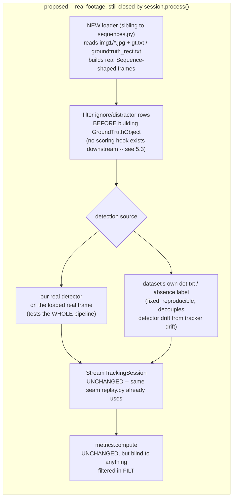

# Tracking benchmarks — escaping the synthetic-only scoreboard

**Status:** research, 2026-08-14. Answers one question: *what public, ground-truthed,
per-frame video benchmarks could `tools/trackeval/` be pointed at, so tracker variants get
judged against footage we didn't write ourselves?* No code changed — see
`cv-service/tools/trackeval/README.md`/`BASELINE.md` for the harness this document is
scoping an extension to, and `docs/conclusions/TRACKING-REVIEW.md` /
`docs/plans/active/TRACKING-V3-PLAN.md` for why the harness exists at all.

**Verdict up front.** Every scenario in `sequences.py` today is generated by the same code
that grades it — deterministic, known-by-construction, and structurally unable to surprise
us. A handful of real, license-clean sequences from **VisDrone-MOT** (aerial — the axis that
matters most), **MOT20** (extreme crowd/occlusion), and **DanceTrack** (fast, uniform-appearance
identity swap) close that gap for well under the "a few GB" budget. The harder problem
is not finding footage — it's that our replay driver's synthetic detector *is* the ground
truth with noise sprinkled on, so reusing it unmodified against real footage would
silently reintroduce the exact circularity this whole exercise exists to escape (§5.2).

---

## 1. Why this matters, briefly

`tools/trackeval/sequences.py`'s own docstring is explicit about the limitation: "no camera
in this repo... ground truth has to be known BY CONSTRUCTION." That's a deliberate,
reasonable design (see `recording.py`'s docstring, reason 3) — but it means every number in
`BASELINE.md` describes how our tracker performs against **our own generator's idea of
what hard looks like**. A generator cannot produce compression artefacts it doesn't model,
motion blur it doesn't render, or a real detector's real confidence distribution. Public
benchmarks exist precisely to be an adversary nobody on this team designed.

---

## 2. Axis coverage matrix

Checked datasets only — not exhaustive of everything in the field, but everything the brief
named plus what turned up newer than 2024. `~` = present but weaker/unverified fit. Blank =
not covered or not applicable.

| Dataset | Fast motion | Slow/static | Low quality | Occlusion/crossing | Small/tiny | **Aerial/UAV** | Ego-motion/pan | Telemetry |
|---|:-:|:-:|:-:|:-:|:-:|:-:|:-:|:-:|
| **VisDrone-MOT** | ~ | ~ | ~ (real compression) | Y | Y | **Y** | Y | — |
| **VisDrone-SOT** | ~ | ~ | ~ | ~ | Y | **Y** | Y | — |
| UAVDT (MOT+SOT) | ~ | ~ | ~ | Y | Y | **Y** | Y | — |
| UAV123 (SOT) | Y | Y | ~ (some low-res clips) | ~ | Y | **Y** | Y | — |
| UAVDark135 / DarkTrack2021 | ~ | ~ | **Y (night/low-light)** | ~ | ~ | **Y** | Y | — |
| Anti-UAV410 (thermal) | Y | ~ | **Y (thermal, night)** | ~ | **Y (tiny)** | (target, not viewpoint) | — | — |
| WebUAV-3M | Y | Y | ~ | Y | Y | **Y** | Y | — |
| MOT17 | ~ | ~ | ~ | Y | ~ | — | ~ (4/7 seqs moving cam) | — |
| MOT20 | ~ | ~ | ~ | **Y (extreme)** | ~ | — | — | — |
| DanceTrack | **Y** | ~ | ~ | Y (uniform appearance) | ~ | — | ~ | — |
| SportsMOT | **Y** | ~ | ~ | Y | ~ | — | Y (broadcast pan) | — |
| GOT-10k | Y | Y | ~ | ~ (absence/cover labels) | Y | ~ | ~ | — |
| LaSOT | ~ | **Y (long, slow)** | ~ | Y (full-occl/OOV flags) | ~ | — | ~ | — |
| OTB-100 | ~ | ~ | ~ | Y | ~ | — | ~ | — |
| VOT (VOTS2026 etc.) | Y | Y | Y | Y | Y | ~ | Y | — |
| KITTI tracking | ~ | ~ | ~ | Y | ~ | — | **Y (car-mounted)** | **~ (ego GPS/IMU, not per-target)** |
| BDD100K MOT | ~ | ~ | **Y (weather/night)** | Y | ~ | — | Y (car-mounted) | — |
| TAO | Y | Y | ~ | ~ | ~ | ~ (includes LaSOT/UAV clips) | ~ | — |
| AnimalTrack | ~ | ~ | ~ | Y | ~ | — | ~ | — |

**No dataset found carries per-frame camera pose (yaw/pitch/roll/HFOV) or GPS alongside
target bounding boxes.** The closest thing is KITTI tracking's separate `oxts` GPS/IMU log —
that's the *ego-vehicle's* pose, useful in the same spirit as our `CameraPose`, but paired
with a car-mounted, ground-level, non-aerial camera, not a gimbal. This is a genuine, stated
gap: nothing here can validate visual-geolocation math end-to-end against real telemetry.

---

## 3. Dataset dossiers

### 3.1 Aerial / UAV (the axis to weight highest)

**VisDrone-MOT** (`VisDrone/VisDrone-Dataset`, AISKYEYE lab, Tianjin University) —
[GitHub](https://github.com/VisDrone/VisDrone-Dataset) ·
[project site](http://aiskyeye.com/) · [HF mirror](https://huggingface.co/datasets/Voxel51/visdrone-mot)

- **Licence — CC BY-NC-SA 3.0, verified** on the project's own
  [data-protection page](http://aiskyeye.com/data-protection/) and corroborated by
  [Ultralytics' docs](https://docs.ultralytics.com/datasets/detect/visdrone). Non-commercial,
  attribution, share-alike. **Gate, not footnote:** "internal engineering evaluation" of a
  tracker that ships in a commercial product sits in the grey zone every CC-NC licence does —
  reasonable for an offline A/B harness, worth a second look before anything derived from it
  (weights, thresholds tuned against it) ships. Not legal advice.
- **Size** — official task zips: MOT train 7.53 GB / val 1.48 GB / test-dev 2.14 GB /
  test-challenge 2.70 GB (BaiduYun/GoogleDrive, whole-zip only, no confirmed per-sequence
  download). **The `Voxel51/visdrone-mot` Hugging Face mirror's val split is 1.74 GB and is
  FiftyOne-filterable by `scene_id`** — the practical way to fetch 1-2 sequences without the
  full 7.53 GB blob. SOT task is separately hosted and larger (train alone is 7.78+12.59 GB) —
  skip it; the MOT task's per-frame boxes already cover small/tiny and multi-class.
- **Format** — `gt.txt`: `frame_index,target_id,bbox_left,bbox_top,bbox_width,bbox_height,score,object_category,truncation,occlusion`,
  pixel coordinates. `object_category`: 0=ignored region, 1=pedestrian, 2=people, 3=bicycle,
  4=car, 5=van, 6=truck, 7=tricycle, 8=awning-tricycle, 9=bus, 10=motor, 11=others.
  `score` doubles as the "should this box be scored" flag (see §5.3). 56 train / 7 val / 33
  test sequences, resolution up to ~1500×1000, variable fps.
- **Axes** — genuinely aerial (drone-mounted, both hovering and panning shots), real crowd
  density, real occlusion (buildings, other vehicles), tiny pedestrians at range, 10-class
  distractor taxonomy. Named example: `uav0000137_00458_v` (train-set naming convention,
  confirmed to exist; **which exact clip best isolates "fast pan" vs "near-static hover"
  was not verified this session** — inspect thumbnails at fetch time rather than trust a
  named pick here).
- **Telemetry** — none.

**UAVDT** (MOT + SOT + DET) —
[project site](https://sites.google.com/view/grli-uavdt) · [paper](https://arxiv.org/pdf/1804.00518)

- **Licence — weaker than VisDrone's, flagged as a risk.** The only statement found is
  "This dataset is for research purpose only" on the project site — no formal CC/BSD-style
  terms, no explicit redistribution clause either way. Treat as research-only until a
  clearer statement turns up; do not assume it clears an internal-engineering bar VisDrone's
  explicit CC BY-NC-SA already does.
- **Size** — 100 sequences, ~80,000 annotated frames, 1080×540 @ 30 fps, ~2,700 vehicles,
  0.84M boxes. **Total GB not confirmed** — Google-Drive-hosted, no size shown on the
  project page as fetched.
- **Format** — vehicle-category + occlusion/out-of-view attribute labels via a `vatic`-tool
  export; exact column layout not independently confirmed this session (referenced only via
  a downloadable toolkit this session didn't open).
- **Axes** — aerial, vehicle-scale small targets, occlusion, moderate ego-motion. Given the
  licence gap and unconfirmed format, **rank below VisDrone for a first cut.**

**UAV123** (SOT) —
[official page](https://ivul.kaust.edu.sa/Pages/Dataset-UAV123.aspx) (404 at fetch time —
**could not independently verify licence, size, or exact format this session**) ·
mirrored on [Kaggle](https://www.kaggle.com/datasets/galaxythereal/uav123-tracking-dataset),
[OpenDataLab](https://opendatalab.com/OpenDataLab/UAV123), Graviti.

- **Licence — UNVERIFIED.** Widely used academically with no licence statement this session
  could locate at the source. Flagging explicitly rather than assuming a permissive stance.
- **Size/format** — 123 sequences (91 real + synthetic), >110K frames, `anno/<seq>.txt` per
  sequence as `x,y,w,h` pixels, `NaN` rows for out-of-view frames (maps cleanly to our
  `GroundTruthObject.visible=False` — see §5.3). Includes UAV20L for long-term tracking (the
  **slow/near-static, long-duration** angle, aerial, which almost nothing else in this table
  offers at once).
- **Axes** — the single best "aerial SOT, real fast pursuit + slow loiter + some low-res
  clips" candidate found, undercut only by the unverified licence — **use only after
  confirming terms directly**, not on this document's say-so.

**UAVDark135 / DarkTrack2021** (low-light UAV SOT) —
[UAVDark135](https://github.com/vision4robotics/ADTrack_v2) ·
[DarkTrack2021](https://github.com/vision4robotics/SCT)

- **Licence — UNVERIFIED** this session (vision4robotics org, academic lab, no licence text
  located). This is the only real candidate found for "**aerial + genuinely low-light**"
  simultaneously (UAVDark135: 125K+ frames; DarkTrack2021: 110 sequences, 100K+ frames,
  night UAV footage) — worth chasing down licence terms specifically *because* nothing else
  in this survey covers that combination.
- **Format/size** — not independently confirmed this session (SOT-style `groundtruth_rect.txt`
  is the norm for this lab's other benchmarks but not individually confirmed here).

**Anti-UAV410** (thermal, drone-as-target) —
[GitHub](https://github.com/HwangBo94/Anti-UAV410)

- **Not an aerial-*viewpoint* dataset** — a ground/gimbal thermal camera tracking a drone
  target, i.e. it exercises "tiny + fast + low-light(thermal)" but not our own ego-motion
  compensation (the camera here is largely static, watching the sky). Useful for the
  tiny/thermal-quality axis, not the ego-motion one.
- **Licence — UNVERIFIED**; GitHub README states citation expectations, not formal terms.
  The *original* `ZhaoJ9014/Anti-UAV` repo states MIT on the repository, but that almost
  certainly covers the toolkit code, not unambiguously the externally-hosted video content —
  treat as unresolved, not as "MIT."
- **Format** — 410 videos, 438K+ boxes, 150K core annotated frames, 25 fps, day+night,
  `IR_label.json` per split with 10 named attributes including `Fast Motion`, `Tiny Size`,
  `Occlusion` — genuinely useful attribute metadata if the licence clears.

**WebUAV-3M** — [GitHub](https://github.com/983632847/WebUAV-3M)

- **Licence — CC BY-NC-SA 4.0, verified.** Clean, matches VisDrone's family.
- **Size — wrong shape for this budget.** 4,500 videos / 3.3M frames; even the small
  "adversarial-examples" subset alone is 186 GB. **Excluded from the shortlist purely on
  size** — everything it covers, VisDrone covers at 1/100th the download.

### 3.2 Ground-level MOT (cheap, well-documented, standard-format anchor)

**MOT17 / MOT20** — [motchallenge.net](https://motchallenge.net/)

- **Licence — CC BY-NC-SA 3.0**, corroborated across multiple independent summaries of the
  MOTChallenge terms; **the primary `motchallenge.net/instructions/` page itself could not
  be fetched this session** (connection errors) — treat the licence as *well-corroborated*,
  not *primary-source-confirmed*.
- **Size** — MOT17.zip ≈ 5.46 GB (confirmed by two independent sources) for the **whole**
  train+test bundle — MOT17 triples image storage across its DPM/FRCNN/SDP detection
  variants sharing the same frames, which is most of why it's that large for only 7 train
  sequences. **No confirmed per-sequence download** — the standard distribution is one zip;
  fetching "just one sequence" means downloading the zip once and discarding the rest
  locally, not a smaller network transfer. MOT20's zip size was **not confirmed** this
  session; MOT20 has fewer sequences (8 total) but far denser crowds — extrapolate with
  caution, budget a few GB.
- **Format** — `gt.txt`: `frame,id,bb_left,bb_top,bb_width,bb_height,conf,class,visibility`
  (pixel), one file per sequence, `seqinfo.ini` gives fps/resolution/length per sequence —
  exactly the per-sequence metadata a loader needs (see §5.3).
- **Named pick — `MOT20-01`**: 1,920×1,080, 25 fps, 429 frames (~17 s), 26,647 boxes, a
  **crowded indoor train station** — the smallest MOT20 sequence by frame count and a real,
  extreme-density stand-in for our synthetic `clutter`/`crowd_recall`. Verified via
  independent source summaries of the MOT20 paper's own sequence table, not the raw zip.
- **Axes** — occlusion (real, not scripted), crowd density up to a mean 246 pedestrians/frame
  across MOT20 as a whole, 4 of MOT17's 7 sequences use a moving camera (a ground-level
  ego-motion stand-in, weaker than a drone pan but real).

**DanceTrack** — [GitHub](https://github.com/DanceTrack/DanceTrack) ·
[project site](https://dancetrack.github.io/)

- **Licence — layered, verified.** Annotations: CC BY 4.0. Video content: "available for
  non-commercial research purposes only" (source material pulled from the internet, DanceTrack's
  own maintainers disclaim responsibility for it). Code: MIT. **Read as CC BY-NC** in
  practice for the thing you'd actually download (video + boxes together).
- **Size — not confirmed** this session (no GB figure located); mitigated by per-sequence
  folder structure (`dancetrack0001/`, `img1/`, `gt/gt.txt`, `seqinfo.ini`) mirrored on
  Hugging Face, which supports fetching individual sequence folders via
  `huggingface_hub`'s pattern-matched download rather than one monolithic archive — a real,
  practical advantage over the MOT-family Google-Drive zips.
- **Format** — `gt.txt`: `frame,id,bb_left,bb_top,bb_width,bb_height,1,1,1` — single class
  (person), every box fully considered (no MOT-style ignore/distractor rows to filter, which
  simplifies a first adapter pass).
- **Axes** — this is the closest real-world analog to our own `crossing_similar` and
  `tiny_fast` scenarios: dancers in near-identical uniform costume, moving fast and
  non-linearly, crossing constantly — appearance is deliberately uninformative, exactly the
  condition `BASELINE.md` §2 says makes our own synthetic pair swap fragmentation instead of
  identity. **This is the sharpest real-footage test of wave C3's histogram appearance model
  and wave C4's dormant gallery that this survey found**, at a fraction of VisDrone's
  download cost.

**SportsMOT** — [GitHub](https://github.com/MCG-NJU/SportsMOT)

- **Licence — NOT independently confirmed this session** (only that the repo exists and
  organizes data "in the form of MOT Challenge 17" — MOT-family projects often but not
  always inherit the CC BY-NC-SA convention; do not assume it without checking the repo's
  own LICENSE file first).
- **Size/format** — 240 clips, ~495 frames/clip average (19.8 s), 720p, 25 fps, MOT-format
  `gt.txt`. Fast broadcast-camera pan during play is a real, non-aerial ego-motion source.
- **Axes** — fast player motion, broadcast-camera pan, moderate occlusion/crowding. Ranked
  below DanceTrack here mainly because of the unconfirmed licence, not the content fit.

### 3.3 Generic single-object tracking (SOT)

**GOT-10k** — [official site](http://got-10k.aitestunion.com/) ·
[toolkit](https://github.com/got-10k/toolkit)

- **Licence — CC BY-NC-SA 4.0, verified** (corroborated across the toolkit ecosystem and
  independent summaries; the official downloads page itself returned a connection error
  this session, so treat as corroborated, not primary-fetched).
- **Size** — >10,000 segments, 1.5M boxes; **total/per-split GB not confirmed** this
  session, but the site is structured by split (train/val/test) and GOT-10k sequences are
  short (comparable to OTB-length clips, not LaSOT's multi-thousand-frame epics) — a
  handful of test-set sequences should be tens to low hundreds of MB, not GB-scale.
- **Format** — `groundtruth.txt` (`xmin,ymin,width,height`, pixel) **plus** `cover.label`
  (0-8 visibility-ratio levels), `absence.label` (binary present/absent), `cut_by_image.label`
  (binary), `meta_info.ini` (object/motion class, source URL). **This is the one dataset in
  the whole survey that ships an explicit per-frame "don't score this" signal
  (`absence.label`) in a form that maps almost directly onto extending `GroundTruthObject`
  with a `visible`/`scorable` split** — see §5.3.
- **Axes** — huge motion-class diversity by design (the paper's whole pitch is diversity),
  useful for **slow/near-static** and **small-target** coverage with a licence this survey
  actually trusts, at the cost of not being aerial.

**LaSOT** — [official site](https://vision.cs.stonybrook.edu/~lasot/) ·
[HF mirror](https://huggingface.co/datasets/l-lt/LaSOT)

- **Licence — UNVERIFIED.** Neither the official Stony Brook page nor the Hugging Face
  mirror state one in what this session could fetch. Widely used academically; **do not
  treat that as a licence.**
- **Size — 248 GB total, but downloadable by category** (70 categories × 20 sequences,
  each category a separate archive on OneDrive/Baidu/HF) — one category is plausibly a few
  GB, one or two individual sequences within it smaller still. The per-category split is
  the only thing that makes LaSOT budget-feasible at all.
- **Format** — `groundtruth.txt` (`x,y,w,h` pixel) plus separate **full-occlusion** and
  **out-of-view** per-frame binary flag files — another dataset with a native ignore-style
  signal (see §5.3), and the best-documented **slow/very-long-duration** SOT sequences found
  (avg. ~2,500 frames / 83 s per video) — the single strongest "does identity survive minutes
  of near-static loitering" candidate in this table, gated entirely on the unresolved
  licence.

**OTB-100** — historically used as *the* classic SOT benchmark.

- **Licence — UNVERIFIED, and structurally the riskiest in this table.** OTB's own videos
  are a "collage" assembled from earlier trackers' own clips (much like VOT's raw
  sequences, see below) with no single, clean rights holder this session could confirm.
  **Do not use for anything beyond quick local sanity-checking without separately verifying
  provenance per clip.**

**VOT challenge series** (VOTS2026 etc.) — [votchallenge.net](https://www.votchallenge.net/)

- **Licence — explicitly murky, by the organizers' own description**: "the raw sequences do
  not have any specific license, as they are a collage of Internet collections, previously
  existing datasets, and personal archives, while the annotations could have a license."
  That is about as direct a **do-not-assume-clearance** signal as a benchmark can give.
  Skip for anything beyond exploratory local use unless a specific sequence's provenance is
  separately confirmed.
- **Size/format** — LTB-50 (long-term track): 50 sequences, 215,294 frames, mixed resolutions,
  `groundtruth.txt` per sequence (axis-aligned or rotated rect depending on challenge year).

### 3.4 Adjacent (driving/animal) — mentioned for completeness, not shortlisted

- **KITTI tracking** — CC BY-NC-SA 3.0, `label_02` 17-column format (frame, track_id, type,
  truncated, occluded, alpha, 2D bbox ×4, 3D dims ×3, location ×3, rotation_y), 21 train / 29
  test sequences, image download gated behind registration/login, labels alone only 9 MB.
  **The one dataset in this whole survey that ships genuine per-sequence telemetry (GPS/IMU
  `oxts` logs, 8 MB)** — but it's the *ego-vehicle's* pose on a car, not a gimbal's, and the
  viewpoint is street-level, not aerial. Relevant if the geolocation work ever wants a
  telemetry-shaped fixture to test plumbing against, irrelevant to the tracking-accuracy ask.
- **BDD100K MOT** — **BSD licence, the most permissive found in this entire survey**,
  verified. 2,000 videos, ~400K frames @ 5 fps annotated, 8 categories, diverse weather/night
  — the best **real low-light/weather-diversity** candidate that isn't gated by an NC clause,
  but ground-level dashcam, not aerial, and its own JSON schema (not MOT `gt.txt`) needs a
  bespoke parser.
- **TAO** — MIT-licensed toolkit, but built by re-using clips from AVA/HACS/LaSOT/BDD/etc.,
  each with its own separate terms-of-use gate — a licence **patchwork**, not a clean single
  grant, and >300 GB. Excluded on both complexity and size.
- **AnimalTrack** — CC BY 4.0 annotations, non-commercial. Off-axis for a drone product
  (targets are animals, not the drone-relevant vehicle/person/UAV classes) — mentioned only
  because the brief named it; not recommended.

---

## 4. Recommendation — a minimal concrete subset

**Ranked shortlist, ~3-4 GB total (see per-line caveats — not every figure below is a
confirmed download, flagged where estimated):**

| # | Dataset | Sequence(s) | Est. size | Axes it uniquely covers here | Licence |
|---|---|---|---|---|---|
| 1 | VisDrone-MOT (val split, HF mirror) | 2 sequences, picked at fetch time for one near-static/hover clip + one fast-pan clip | ~1.7 GB (whole val split; per-scene fetch may be smaller) | **aerial viewpoint, ego-motion/pan, crowd/clutter, occlusion, small/tiny multi-class targets** | CC BY-NC-SA 3.0 (verified) |
| 2 | MOT20 | `MOT20-01` | full zip required, GB unconfirmed but the sequence itself is only 429 frames | extreme real-world occlusion/clutter, a scale synthetic `crowd_recall` doesn't attempt | CC BY-NC-SA 3.0 (verified) |
| 3 | DanceTrack | `dancetrack0001` + one more from the 40 public-annotation training clips | est. low hundreds of MB per sequence (unconfirmed) | **fast, non-linear motion + identical-appearance crossing** — the real-footage twin of `crossing_similar`/`tiny_fast` | CC BY 4.0 annotations / non-commercial video (verified, layered) |
| 4 *(optional)* | GOT-10k | 2 test-set sequences: one long/slow, one small/fast | est. low hundreds of MB | slow/near-static coverage with a native `absence.label` ignore signal, licence-clean fallback for the aerial-SOT axis VisDrone doesn't fully reach | CC BY-NC-SA 4.0 (verified) |

**Why this combination and not a different one:**

- **Aerial gets the most weight, per the brief, and VisDrone is the only aerial dataset in
  this survey with both a *verified* licence and a documented small-subset path (the HF
  mirror).** UAVDT/UAV123/UAVDark135 all cover parts of the aerial space better in one
  dimension or another (UAV123 for long-duration loiter, UAVDark135 for genuine low-light)
  but every one of them has an unverified or explicitly weaker licence — worth chasing down
  separately, not worth blocking a first cut on.
- **MOT20-01 buys real, extreme-density occlusion cheaply and on a licence this survey
  trusts**, filling the "clutter"/"occlusion" axes with something harder than any synthetic
  scenario currently attempts, at the cost of one dataset-family's worth of Google-Drive zip
  (unavoidable — no per-sequence host was found for the MOT family).
- **DanceTrack is the best-matched real-world analog to two of our five hardest existing
  synthetic scenarios** (`crossing_similar`, `tiny_fast`) — appearance-uninformative,
  fast, non-linear — and is the cheapest, cleanest-licenced, easiest-to-partially-fetch
  dataset in the whole survey. It is not aerial, which is the one thing keeping it at #3
  rather than #1.
- **GOT-10k is marked optional** because it's the least aerial-relevant of the four, included
  only because nothing license-clean in this survey covers "slow/near-static" as directly,
  and because its `absence.label` is the cleanest existing precedent for the ignore-region
  extension §5.3 below describes.

**What this shortlist deliberately does NOT solve:** genuine low-light/thermal aerial
footage (UAVDark135/Anti-UAV410, both licence-unverified) and telemetry-paired footage
(nothing found carries both). Both are real gaps, not oversights — flagged, not silently
dropped.

---

## 5. How this plugs into `tools/trackeval/`

### 5.1 What exists today

The loop closes on itself: the thing that grades the tracker and the thing that feeds it
both derive from the same generator call. `replay.py`'s own docstring defends this choice
for the synthetic scenarios (isolating "did the tracker keep it" from "did a model see it")
— but it means the exact same wiring, pointed at a real dataset's ground truth instead of a
synthetic one, would still not be testing a real detector's real failure modes; it would
just be perturbed truth with a different source of truth underneath.

### 5.2 What a real-footage adapter needs to be, structurally

**The one-line summary: `StreamTrackingSession` itself needs nothing new — `replay.py`
already proves real production code can be driven by a harness. What's missing is
everything upstream of it:** a loader that turns a benchmark's on-disk shape into
`Sequence`-shaped data, and an honest choice about what plays the role `SyntheticDetector`
plays today.

### 5.3 The impedance mismatches, concretely

- **Coordinate normalization.** `cv_service.tracking.engines.base.Box` is normalized
  `[0, 1]`, top-left origin — "the least cv-service can emit that every sink can use with
  only its own local knowledge" (`base.py`'s own docstring). Every benchmark surveyed here
  stores **pixel** coordinates instead (`gt.txt`'s `bb_left,bb_top,bb_width,bb_height`;
  `groundtruth_rect.txt`'s `x,y,w,h`). Converting is a division by the sequence's own
  `(width, height)` — trivial per box, but **not a global constant the way
  `sequences.FRAME_WIDTH=320`/`FRAME_HEIGHT=240` is today**: MOT17 alone mixes 1920×1080 and
  640×480 sequences, and UAV123/GOT-10k/OTB don't always state resolution in a metadata file
  the way MOT's `seqinfo.ini` does — some need it read off the first decoded frame instead.
- **No ignore-region / distractor concept exists in `metrics.py` at all.** VisDrone-MOT's
  `object_category=0` ("ignored region"), MOT-family `conf`/`score` "consider" columns, and
  GOT-10k's `absence.label`/LaSOT's occlusion-flag files all encode, in different shapes,
  the same idea the MOT literature calls "do not score this" — and today's
  `GroundTruthObject(gt_id, label, box, visible)` has no field for it.
  `metrics.compute`'s ASSOCIATE path scores `sequence.gt_ids`, i.e. **every** id the
  `Sequence` ever declares, unconditionally. Two options, not one right answer: (a) filter
  these rows out entirely at load time in the new loader (simplest, loses the ability to
  test against a real distractor the way `crossing_similar` synthesizes one) or (b) extend
  `GroundTruthObject` with a `scorable: bool` (or reuse `visible` more broadly) and thread it
  through `metrics.py`'s greedy matcher so a distractor can sit in-frame without being scored
  as a missed/extra target — a real, scoped change to `metrics.py`, not something a loader
  alone can paper over. **This is the sharpest mismatch found in this whole survey** — get
  it wrong and every occlusion/crowd number the adapter produces is quietly corrupted by
  scoring boxes the benchmark itself says don't count.
- **Class/label handling is a pre-existing asymmetry, not a new one.** `sequences.py` uses
  one constant label (`OBJECT_LABEL = "object"`) everywhere; `metrics.py`'s greedy IoU
  matcher does not filter by label at all. Production `assign.py` DOES weight label
  compatibility in its cost function (`_labels_compatible`) — so the harness's metrics layer
  is already slightly more permissive than the tracker it's grading, a fact the synthetic
  scenarios never surface because they only ever have one label. A multi-class real dataset
  (VisDrone's 10 categories) will surface it immediately. Simplest fix: restrict the adapter
  to one class per sequence at first (matches today's harness exactly); class-aware matching
  is a separate, larger change to `metrics.py` if ever needed.
- **Frame delivery generalizes, but per-sequence fps/resolution can't be assumed.**
  `replay.run_replay` synthesizes `now_millis = frame.index * (1000 / sequence.fps)` and
  calls `session.process(now_millis=..., detect=..., frame=lambda: image, ...)` once per
  frame — this pattern works unchanged for real footage as long as the loader knows each
  sequence's own true fps (stated explicitly in MOT's `seqinfo.ini`; not always stated for
  UAV123/GOT-10k/OTB, which may need it sourced from each dataset's own meta file rather
  than assumed).
- **`recording.py` is the wrong vehicle for this, despite looking like "the real-footage
  path already exists."** It is deliberately, permanently pixel-free (the module's own
  docstring gives three reasons) and forces `motion_engine_id`/`appearance_engine_id` to
  `"off"` — so it can only ever exercise the identity core (`predict`/`assign`/`history`/
  `reupdate`/`memory`/`pose_gmc`), never FOLLOW's `lk`/`ncc` or ASSOCIATE's `flow`/
  `histogram` compensators. Those pixel-consuming halves are exactly what real footage is
  most valuable for stressing (does `histogram` actually help against real clutter? does
  `flow`'s GMC actually hold under real camera shake and compression?). The natural seam for
  a real-footage adapter is a new loader that still funnels into `replay.run_replay` (or a
  close sibling), carrying real decoded frames — not `recording.py`.
- **The detector-source decision is the deepest structural fork, and it's a genuine choice,
  not a default to reuse.** `run_replay`'s `SyntheticDetector` perturbs the **same**
  sequence's own ground truth — feeding it a real dataset's ground truth would reproduce the
  exact circularity this document exists to escape, just with real pixels sitting unused
  behind it. Two honest alternatives: **(a)** run cv-service's actual detector on the loaded
  real frame every step — tests the whole pipeline end-to-end, needs a real inference
  environment (GPU or the GB4005 OpenVINO box), and re-entangles "did the model see it" with
  "did the tracker keep it" exactly the way `replay.py`'s own docstring argues against for
  the synthetic case (except now that's the point — a real detector's real failure modes are
  precisely what synthetic can't produce); or **(b)** feed the benchmark's own bundled
  detections (MOT17's DPM/FRCNN/SDP `det.txt`) or absence signal (GOT-10k) as a realistic,
  imperfect, but fixed and reproducible stream, decoupling tracker-logic regressions from
  whatever cv-service's detector happens to be tuned to this week — the same argument
  `replay.py`'s docstring already makes, just with a real noise source instead of a modeled
  one. **Scoping this document stops at naming the fork; picking (a), (b), or both is a
  design decision for whoever builds the adapter, not a research finding.**
- **Metrics are not leaderboard-comparable, and that's fine.** `metrics.py`'s own docstring
  already documents the greedy-vs-Hungarian trade-off against the *production* `assign.py`.
  It also means numbers from this harness are not comparable to published SOTA numbers on
  MOT17/MOT20/etc., which use Hungarian matching plus HOTA/IDF1 via the actual `TrackEval`
  tool (`JonathonLuiten/TrackEval` — an unrelated project that happens to share this
  package's name). The goal stays what the brief stated: compare our own tracker variants to
  each other on real footage, not chase a public leaderboard rank.
- **Scale is a real but tractable concern.** `run_replay` materializes every frame's pixel
  array in the `Sequence.frames` tuple up front; synthetic sequences are tiny (50-150
  cheaply-rendered frames), a handful of real sequences at hundreds-to-low-thousands of
  frames of decoded JPEGs is a bigger memory/IO footprint but still well within a single
  process at the "a few thousand frames total" scale this shortlist implies. A
  streaming/lazy loader (matching `sequences.py`'s own "lazy numpy" discipline) would be a
  better long-term shape than pre-materializing everything, but is an efficiency choice, not
  a blocker.

---

## 6. What's unverified — read before trusting a number above

Explicitly flagged rather than guessed, per this document's own brief:

- **Licences NOT independently confirmed at the primary source**: UAV123, LaSOT, OTB-100,
  SportsMOT, UAVDT (beyond "research purpose only"), UAVDark135/DarkTrack2021, Anti-UAV410,
  Anti-UAV (original, MIT claim likely code-only).
- **Licences corroborated by multiple independent secondary summaries but not fetched from
  the primary source directly this session** (connection errors): MOT17/MOT20's
  `motchallenge.net/instructions/` page, GOT-10k's own downloads page.
- **Download sizes not confirmed**: UAVDT, UAV123, MOT20 (full zip), DanceTrack,
  SportsMOT, GOT-10k (per-split), UAVDark135/DarkTrack2021, Anti-UAV410, VOT LTB-50.
- **Exact sequence-to-axis mapping inside VisDrone-MOT** (which named clip is the
  best near-static one, which is the best fast-pan one) — the naming convention and one
  example ID (`uav0000137_00458_v`) were confirmed to exist; matching specific clips to
  specific axes was not done by inspecting footage this session.
- **UAVDT's exact annotation column layout** — referenced via a toolkit this session did not
  open.

---

## Sources

- [VisDrone-Dataset (GitHub)](https://github.com/VisDrone/VisDrone-Dataset)
- [VisDrone data-protection / licence page](http://aiskyeye.com/data-protection/)
- [VisDrone2018-MOT-toolkit README](https://github.com/VisDrone/VisDrone2018-MOT-toolkit)
- [VisDrone2018-SOT-toolkit](https://github.com/VisDrone/VisDrone2018-SOT-toolkit)
- [Voxel51/visdrone-mot (Hugging Face)](https://huggingface.co/datasets/Voxel51/visdrone-mot)
- [Ultralytics VisDrone docs](https://docs.ultralytics.com/datasets/detect/visdrone)
- [UAVDT project site](https://sites.google.com/view/grli-uavdt)
- [UAVDT paper (arXiv)](https://arxiv.org/pdf/1804.00518)
- [UAV123 official page (404 at fetch time)](https://ivul.kaust.edu.sa/Pages/Dataset-UAV123.aspx)
- [UAV123 on Kaggle](https://www.kaggle.com/datasets/galaxythereal/uav123-tracking-dataset)
- [UAVDark135 / ADTrack_v2 (GitHub)](https://github.com/vision4robotics/ADTrack_v2)
- [DarkTrack2021 / SCT (GitHub)](https://github.com/vision4robotics/SCT)
- [Anti-UAV (original, GitHub)](https://github.com/ZhaoJ9014/Anti-UAV)
- [Anti-UAV410 (GitHub)](https://github.com/HwangBo94/Anti-UAV410)
- [WebUAV-3M (GitHub)](https://github.com/983632847/WebUAV-3M)
- [WebUAV-3M paper (arXiv)](https://arxiv.org/pdf/2201.07425)
- [MOT Challenge](https://motchallenge.net/)
- [MOT20 paper (ResearchGate)](https://www.researchgate.net/publication/340094657_MOT20_A_benchmark_for_multi_object_tracking_in_crowded_scenes)
- [TrackEval MOTChallenge-format docs (JonathonLuiten/TrackEval)](https://github.com/JonathonLuiten/TrackEval/blob/master/docs/MOTChallenge-format.txt)
- [DanceTrack (GitHub)](https://github.com/DanceTrack/DanceTrack)
- [DanceTrack project site](https://dancetrack.github.io/)
- [SportsMOT (GitHub)](https://github.com/MCG-NJU/SportsMOT)
- [GOT-10k official site](http://got-10k.aitestunion.com/)
- [GOT-10k toolkit (GitHub)](https://github.com/got-10k/toolkit)
- [LaSOT official site](https://vision.cs.stonybrook.edu/~lasot/)
- [LaSOT on Hugging Face](https://huggingface.co/datasets/l-lt/LaSOT)
- [VOT Challenge](https://www.votchallenge.net/)
- [KITTI tracking benchmark](https://www.cvlibs.net/datasets/kitti/eval_tracking.php)
- [BDD100K download docs](https://doc.bdd100k.com/download.html)
- [TAO dataset (GitHub)](https://github.com/tao-dataset/tao)
- [AnimalTrack project site](https://hengfan2010.github.io/projects/AnimalTrack/)
- [AnimalTrack paper (arXiv)](https://arxiv.org/pdf/2205.00158)

**Internal, read before building anything against this survey:**
`cv-service/tools/trackeval/README.md`, `cv-service/tools/trackeval/BASELINE.md`,
`cv-service/tools/trackeval/sequences.py`, `cv-service/tools/trackeval/replay.py`,
`cv-service/tools/trackeval/metrics.py`, `cv-service/tools/trackeval/recording.py`,
`docs/conclusions/TRACKING-REVIEW.md`, `docs/plans/active/TRACKING-V3-PLAN.md`.
