# Raising recovery rate and cutting identity switches — a literature ranking against our own numbers

**Research only. No code, no product edits.** Grounded in `docs/conclusions/TRACKING-BENCHMARK-RESULTS.md`
(our MOT17 measurement), `docs/plans/active/TRACKING-V3-PLAN.md` (what ships, what's planned as V4/V5/V7/V8,
and decisions E1–E12), and `cv-service/MODULE.md`. Every number below was checked against a primary source
during this research pass; where a number could not be verified, that is stated rather than repeated.

---

## 0. The one-paragraph answer

Our gap to `bytetrack` (IDSW 6075 vs ~2349, recovery 56.7% vs 73–78%, §3 of the benchmark) is not a missing
exotic algorithm. Every mechanism the literature credits with the largest identity gains is **already shipped
or already planned** in `TRACKING-V3-PLAN.md` — the shortfall is that one shipped piece (ORU) is currently
net-negative because it lacks a same-object check before it reconstructs a gap, and two planned pieces (V5's
confidence-adaptive noise, V4's momentum) that most directly address detector-noise-driven identity churn
have not been built yet. Nothing found in this pass justifies going outside **L1 — pure arithmetic on box
coordinates** for the three highest-value fixes. The single biggest lever anyone has ever measured for
identity on a moving camera — camera-motion compensation — we already have for free from telemetry, which
the published trackers do not; that comparison is made explicit in §6.

**The three things to do first**, all L1, all cheap, all directly evidenced by our own numbers:

1. **Give ORU a same-object check before it interpolates** (§2.1) — not a tighter velocity bound (already
   tried, §4b of the benchmark; helped but did not fix it), but the bracket-identity test OC-SORT's own OCR
   module implies and our benchmark independently converged on.
2. **Ship wave V5** (confidence-adaptive velocity blend / gate widening) — the mechanism the literature
   (NSA-Kalman, Hybrid-SORT) most directly credits with taming detector-noise-driven velocity whipsaw, which
   is the most likely explanation for why `cost` already has ByteTrack's two-stage insight and still loses
   to it (§5).
3. **Gate ORU on scene density and retune lifecycle defaults for our actual regime** (sparse targets,
   persistent ego-motion) instead of MOT17's regime (dense, mostly static camera) — already proven by §4b's
   own density split (ORU: 0 of 7 wins in dense scenes, its only wins in sparse ego-motion scenes), and the
   cheapest of the three to ship.

---

## 1. How to read the ranked list

Every row answers, in order: **can it run on the airframe (L1), and does the evidence hold on footage like
ours (sparse, aerial, small/fast targets) or only on crowded ground-level pedestrians?** A technique that
needs an appearance embedding, a learned model, or a GPU is real evidence about where tracking-by-detection
is heading, but it cannot help the relay — so it is ranked below arithmetic that helps less in the literature
but runs everywhere we do.

```mermaid
flowchart LR
  subgraph L1["L1 RELAY — pure stdlib, ~13 MiB, runs on the airframe"]
    direction TB
    A1["Bracket-identity check for ORU<br/><i>NEW — this research</i>"]
    A2["V5: confidence-adaptive noise<br/><i>planned, unbuilt</i>"]
    A3["V4: OCM momentum<br/><i>planned, unbuilt</i>"]
    A4["V4: Hybrid-SORT weak cues<br/><i>planned, unbuilt</i>"]
    A5["Density-gated ORU + lifecycle retune<br/><i>config only</i>"]
    A6["C-BIoU cascaded buffered matching<br/><i>NEW — not yet planned</i>"]
    A7["Telemetry CMC<br/><i>already shipped</i>"]
  end
  subgraph L2["L2 FILL — +cv2"]
    B1["OAS occlusion offset (box part)<br/><i>planned as V4, reclassified</i>"]
  end
  subgraph L3["L3 DETECT — +ultralytics, bytetrack selectable"]
    C1["VitTrack/NanoTrack SOT<br/><i>planned as V8</i>"]
  end
  subgraph L4["L4 IDENTIFY — +ReID"]
    D1["Learned appearance / AMOT-style fusion<br/><i>planned as V7</i>"]
    D2["MotionTrack / DroneMOT learned re-assoc<br/><i>not planned — needs GPU</i>"]
  end
  L1 --> L2 --> L3 --> L4
```

---

## 2. The ranked shortlist

Ordered by lowest runnable level, then by evidence strength within a level.

### 2.1 — Give ORU a bracket-identity check before it interpolates

| field | detail |
|---|---|
| **what it is** | Before `reupdate()` reconstructs a gap from the two real observations that bracket it, test that the two observations are plausibly the *same object* — e.g. does the earlier observation's own forward-predicted box (via `predict.py`, warped through `history_transform` exactly as ORU already does) land near enough to the later one to pass the same IoU/motion-plausibility gate a normal re-anchor would need to clear? If not, refuse the reconstruction (return `None`, the same "no honest answer" contract the velocity guard already uses) rather than interpolate between two different objects. |
| **lowest level it runs at** | **L1.** It is arithmetic on the same box coordinates ORU already reads — an IoU or a motion-plausibility test against a predicted box, nothing pixels or matrices need. |
| **expected effect** | Not independently published — this is a generalization of OC-SORT's own OCR module (the second bracketing candidate on a failed re-anchor) applied backward as a *guard* rather than forward as a *fallback*. Our own evidence is the strongest signal available: `TRACKING-BENCHMARK-RESULTS.md` §4b measured that the velocity-only guard already shipped recovered 93 IDSW (951→346 implausible velocities) but left ORU net **+377 IDSW** worse than not running it at all, and diagnosed the residual as exactly this — "ORU never checks that its two bracketing observations are the same object." That diagnosis, not a paper, is the evidence this fix targets a real, measured defect. |
| **cost** | One IoU-or-distance test per re-anchor event, using data ORU already has in scope (the predicted box at `t₂` from the `t₁` observation). No new dependency. |
| **evidence** | Primary evidence is our own `docs/conclusions/TRACKING-BENCHMARK-RESULTS.md` §4/§8, item 3 ("The real ORU fix is a bracket-identity check, not a tighter velocity bound. ... That is a wave, not a patch."). Literature analog: OC-SORT (arXiv:2203.14360, CVPR'23) §OCR — verified via ar5iv rendering: MOT17-val ablation table shows baseline 64.9 → +ORU 66.3 HOTA in the *clean, single-object-per-bracket* regime the paper's own scenarios guarantee; our benchmark is the first evidence of what happens when that guarantee doesn't hold (a crowd), and it is exactly the regression case OCR's existence implies the authors anticipated for re-anchoring, generalized here to the interpolation step itself. |
| **our fit** | Directly closes the finding in `TRACKING-BENCHMARK-RESULTS.md` §8 item 3. Does not conflict with any V3 non-goal (§7) — it is a guard on an existing L1 mechanism, not a new subsystem, real Kalman filter, or appearance dependency. |

### 2.2 — Ship V5: confidence-adaptive velocity blend / gate widening

| field | detail |
|---|---|
| **what it is** | Translate NSA-Kalman's principle (`R̃ = (1−c)·R_base` — a low-confidence detection barely moves the filter's state) onto the two constants `cost`/`track.py` actually own: how much a new observation moves the stored velocity estimate, and how wide the re-anchor gate opens as a track ages. Already decided as **E2** in `TRACKING-V3-PLAN.md` — not new research, but unbuilt (V5 in §6's wave table). |
| **lowest level it runs at** | **L1.** Both targets are existing scalar fields; this is arithmetic on a blend weight, no covariance matrix required. |
| **expected effect** | Isolated ablation of the *exact* NSA-Kalman mechanism, StrongSORT (arXiv:2202.13514): **+0.4 HOTA on MOT17-val, with no reported MOTA/IDF1 movement** — i.e. it improves positional accuracy, not headline identity counts, when measured alone. Folded into BoT-SORT's full ladder (arXiv:2206.14651, verified via the paper's own Table 1) the step that includes the confidence-weighted Kalman-filter change (their "+KF" row) moves HOTA only 67.88→68.12 (**+0.24**) — smaller than camera-motion compensation's own step in the same ladder (68.12→69.06, **+0.94**, see §6). **Read honestly: this is the smallest single lever in this whole list when isolated in the literature.** Its case for going first anyway is that it is free (E2 already designed it, nothing to invent) and it is the most plausible mechanism for the specific failure mode our benchmark shows — a constant-velocity estimate whipsawed by noisy, low-confidence real-world detections, which MOT17's own weak detectors (DPM especially, 7.9 dets/frame retained) supply in quantity. |
| **cost** | A blend-weight computation per observation and a gate-width computation per track-age — both already scalar math `track.py`/`assign.py` perform every frame. |
| **evidence** | StrongSORT arXiv:2202.13514 (isolated ablation, verified). BoT-SORT arXiv:2206.14651 Table 1 (ladder context, verified via full-text fetch — see §6 for the complete table). Both are pedestrian/MOT17 measurements; **not verified on aerial or small/fast-target footage**, and E9's own caution (arXiv:2509.18451, verified: 3–4× higher position error on small fast tiny objects than standard benchmarks) applies squarely here — the mechanism could matter more or less on our targets than on MOT17, and only our own harness on real footage will say which. |
| **our fit** | Already decided (E2), zero new design. Directly answers the open question in `TRACKING-BENCHMARK-RESULTS.md` §8 item 5 ("Decide deliberately whether V2/V3/V6 should reach `bytetrack`") by strengthening the one associator that *can* reach every level. |

### 2.3 — Density-gate ORU and retune lifecycle defaults for the deployment regime

| field | detail |
|---|---|
| **what it is** | Two changes, one commit: (a) disable or down-weight ORU by default above a measured detections/frame threshold, since §4b's density split showed it improved **0 of 7** scenes at ≥10 dets/frame and its only real wins were in sparse, ego-motion-dominated scenes; (b) retune `max_age_frames`/`min_hits`/gate thresholds against scenarios that resemble our deployment (few targets, moving camera) instead of leaving MOT17-shaped defaults in place by default. |
| **lowest level it runs at** | **L1.** Pure configuration — no new code path, no new dependency. |
| **expected effect** | From our own data: guarding ORU by density alone would have avoided the **+320 net IDSW** the ≥10 dets/frame half of the benchmark cost (§4b), while keeping the **−51/−38** wins on `MOT17-13`, the moving-camera scene — which the benchmark itself calls "also the regime a drone flies in." Literature backs lifecycle tuning as a lever generically (max_age/min_hits/min_IoU sensitivity studies on head-tracking and thermal-pedestrian benchmarks move IDF1 by several points from configuration alone — Akash's SORT ablation and the PBVS thermal-MOT ablation, both general web sources, not peer-reviewed papers; **treat as directional, not a hard number**, since neither is a benchmark-graded publication) but no paper measured *our* density regime, which is why our own harness — not a citation — is the authority here. |
| **cost** | Zero — configuration change plus (optionally) new `tools/trackeval` scenarios at aerial-like sparsity, which V0 already built the harness to add. |
| **evidence** | Primary: `TRACKING-BENCHMARK-RESULTS.md` §4b's density table (verified, our own measurement). Secondary, directional only: general MOT lifecycle-sensitivity discussions (not independently reproduced here, flagged as unverified-strength evidence per instruction). |
| **our fit** | Directly implements recommendation #2 of `TRACKING-BENCHMARK-RESULTS.md` §8 ("Gate ORU on scene density, or default it off... this is a defaults question, not a delete question"). No non-goal conflict. |

### 2.4 — OC-SORT's OCM (momentum-consistency term)

| field | detail |
|---|---|
| **what it is** | A cost term that penalizes an association whose implied direction disagrees with the track's recent real (not predicted) direction of travel — computed from the angle between two real historical observations, never from the drifting state estimate. Already named as wave **V4** in `TRACKING-V3-PLAN.md` §6, unbuilt. |
| **lowest level it runs at** | **L1.** Two 2-D vectors and an angle/cosine — arithmetic, no matrix inversion. |
| **expected effect** | Verified directly from the OC-SORT paper's own ablation table (fetched and cross-checked via ar5iv): on **DanceTrack-val** (dominated by non-linear, fast, unpredictable motion), ORU+OCM jumps HOTA **47.8 → 52.1** (baseline → ORU alone is only 48.5, so OCM alone contributes roughly **3.6 of the 4.3-point combined gain** — the paper does not isolate OCM from ORU+OCM in one row, so this is read off the delta, not a directly labeled ablation row). On **MOT17-val**, the same combination moves HOTA only **66.3 → 66.4** (**+0.1**) — the paper states outright: *"OCM only shows good help on DanceTrack dataset where object motion is more complicated."* **This is a motion-regime-dependent technique, verified as such by the authors themselves, not inferred by us.** |
| **cost** | Near-zero; OC-SORT's own paper reports the *whole* pipeline (OCM included) at 700+/793 fps on one CPU core — but this is a system-level number, not isolated to OCM, and the paper does not report OCM's cost separately (verified: no per-module fps breakdown exists in the source). |
| **evidence** | OC-SORT, arXiv:2203.14360 (CVPR'23), Table 5, verified via ar5iv full-text render. DanceTrack-style non-linear motion is a plausible proxy for a gimbal-relative target changing apparent direction under camera manoeuvring, but it is still a ground-level, human-scale benchmark — **not verified on aerial footage**. |
| **our fit** | Matches plan §6's V4 scope exactly; §8's evidence table entry for V4/OCM ("DanceTrack-val 48.5 → 52.1 HOTA") is **confirmed accurate** by this research pass — the plan's own citation checks out precisely against the primary source. |

### 2.5 — Hybrid-SORT's weak cues (confidence, height, direction)

| field | detail |
|---|---|
| **what it is** | Add detection confidence, box height, and velocity direction as additional low-weight terms in the assignment cost — each individually weak, together enough to break ties IoU and appearance cannot. Training-free, plug-and-play into an existing cost matrix. Already named as wave **V4**. |
| **lowest level it runs at** | **L1.** All three are scalar box/detection properties; no learned component. |
| **expected effect** | Confirmed real and training-free via primary source (AAAI'24 proceedings + arXiv:2308.00783): "significant and consistent improvements... applying the method to 5 different representative trackers," with the paper's own framing that gains are **largest on occlusion and non-linear-motion cases** — the same regime OCM targets, for a related but distinct reason (weak cues resolve *ambiguous ties*, OCM corrects *drifted direction*). **Exact HOTA/IDSW delta numbers were not independently re-extracted from the paper's tables in this pass** — the abstract-level claim is verified real; the magnitude is not independently reproduced here, flagged rather than repeated. |
| **cost** | Three extra scalar terms per cost-matrix cell; no new dependency. |
| **evidence** | Hybrid-SORT, arXiv:2308.00783 (AAAI'24), existence and mechanism verified. Ground-level pedestrian/dance benchmarks (MOT17, MOT20, DanceTrack) — **not aerial**. |
| **our fit** | Matches plan §6 V4 scope. Complements 2.4 rather than duplicating it. |

### 2.6 — C-BIoU: cascaded buffered IoU matching *(not currently in the plan)*

| field | detail |
|---|---|
| **what it is** | Instead of trusting a single predicted box for IoU matching, expand the matching space with a small buffer around both the predicted track box and the detection, match on that; anything still unmatched gets a second pass with a larger buffer. Cheap insurance against exactly the case our benchmark's ego-motion/occlusion scenarios exercise — a wide but plausible displacement that a tight IoU gate would reject outright. |
| **lowest level it runs at** | **L1.** Two IoU passes with different fixed expansion constants — pure box arithmetic, cheaper than a cost-matrix reweighting since it needs no new signal, only a wider test. |
| **expected effect** | The paper (arXiv:2211.14317) reports state-of-the-art results on datasets with irregular motion and near-identical appearance (DanceTrack-class problems) and was the dominant component of 2nd-place CVPR'22/ECCV'22 challenge solutions. **Could not independently verify the exact IDSW/HOTA delta numbers in this pass** (the fetched abstract does not carry the ablation table, and full-text extraction did not return it) — flagged, not repeated as fact. |
| **cost** | Two IoU computations instead of one, both O(candidates × targets) exactly like the existing single pass — negligible against `assign.py`'s current cost. |
| **evidence** | arXiv:2211.14317, existence and mechanism verified via abstract; magnitude unverified. Buffer-size sensitivity not independently checked. |
| **our fit** | **Not named anywhere in TRACKING-V3-PLAN.md.** Directly relevant to our own finding that `min_iou=0.0` — a permissive gate chosen specifically to admit ego-motion-warped candidates — is also plausibly what lets `cost` mismatch in a crowd (MODULE.md's own "clutter" ROI-rescue finding: "a crop several times a candidate's own size can admit a NEIGHBOURING, similarly-appearing object into contention, and nothing about the permissive gate refuses it"). A staged small-buffer/large-buffer test is a structured alternative to one uniformly loose gate, and is worth an ablation in `tools/trackeval` before or alongside V4/V5. |

### 2.7 — BoostTrack: Mahalanobis distance + shape similarity + soft confidence boosting

| field | detail |
|---|---|
| **what it is** | Augments IoU with a Mahalanobis-distance term (box-state deviation weighted by an estimated covariance) and a box-shape-similarity term, plus a scheme for "boosting" the confidence of low-score detections likely to correspond to real, already-tracked objects. |
| **lowest level it runs at** | **L1 in principle** — Mahalanobis distance on a small, fixed-dimension box-state vector has a closed form that does not require `numpy` (the platform's own `assign.py` already hand-rolls a stdlib Hungarian solver in the same spirit). The published reference implementation likely uses `numpy`/`scipy`, which is an implementation choice, not a mathematical requirement. |
| **expected effect** | Published as ranking first among online methods by HOTA on the MOT Challenge MOT17/MOT20 leaderboards when appearance similarity is included (BoostTrack+/++ line) — **the base, appearance-free BoostTrack's isolated numeric HOTA/IDSW deltas were not independently re-verified in this pass**; only the mechanism and the "outperforms... on MOT17 and MOT20" claim were confirmed from secondary sources (Springer/ACM listing), not the primary ablation table. Flagged as directionally credible, not numerically verified here. |
| **cost** | One Mahalanobis-distance and one shape-ratio computation per cost-matrix cell — same order as the existing IoU term. |
| **evidence** | Stanojevic & Todorovic, *Machine Vision and Applications* (2024); could not locate a clean arXiv preprint ID during this pass, so citation is by journal DOI, not arXiv — noted as a minor provenance gap. |
| **our fit** | Not in the plan. Lower priority than 2.1–2.6 because its numeric evidence is the least independently verified item on this list — worth a look only after the higher-confidence items are measured. |

### 2.8 — Telemetry-based camera-motion compensation *(already shipped — confirmation, not a new recommendation)*

Covered in full in §6 because the research task calls it out explicitly. Short version: this is, by a wide
margin, the mechanism the literature credits with the largest identity gains on a moving camera, and we
already have it essentially for free. Nothing here changes what to build; it changes how much confidence to
place in what is already built.

---

### 2.9 — Items ranked lower: L2–L4, mostly already-planned, one re-classification worth flagging

| # | technique | lowest level | our plan status | one-line verdict |
|---|---|---|---|---|
| a | **UCMCTrack** ground-plane association (E6) | **Reclassified: plausibly L1 for us**, not L2/L3 as the generic case implies — see §2.9.1 | Deferred to a future V4 of the visual-geo line | Right call to defer (needs S2 calibration), but the compute-level objection understates our advantage — worth revisiting sooner than "eventually" |
| b | **OAS** occlusion-aware cost offset (V4) | **Split: L1 for OAO/BAM, L2+/GPU for the published occlusion detector (GM)** | Named as L1 in plan §6 | **The plan's L1 tag does not hold for OAS as published** — see §7 |
| c | **PD-SORT** pseudo-depth + DVIoU (E5) | N/A — rejected regardless of level | Correctly rejected (E5) | Confirmed correct, and for a sharper reason than the plan states — see §7 |
| d | **VitTrack/NanoTrack** DNN single-object tracker (E10, V8) | L3 (needs OpenCV DNN + model asset) | Planned, offered not defaulted | Confirmed: NanoTrackV2 ~30 fps on a Pi 4 CPU, 1.9 MB model — real, but not L1 |
| e | **Appearance/ReID** weighting (E7, V7) | L4 | Planned, level-gated, deliberately undecided by design (E7) | AMOT (VisDrone/UAVDT) evidence for "appearance matters more on real UAV footage" reconfirmed — see §2.9.2 |
| f | **MotionTrack** learned long-term motion re-association | L4 (needs a trained "Refind Module") | Not planned | Real mechanism for exactly our research question (motion-only re-association after a gap) but it is *learned*, not arithmetic — cannot run at L1 |
| g | **DroneMOT / HDST-GNN / MOSAIC-Tracker** — UAV-specific SOTA (2024–2026) | L4/L5 (attention/GNN, GPU) | Not planned | Confirms the ceiling of what's achievable, not a source of L1 ideas — see §8 |

#### 2.9.1 — UCMCTrack, re-examined

The generic objection to ground-plane tracking is calibration: UCMCTrack's own authors state camera
intrinsics/extrinsics for MOT17/MOT20/DanceTrack "are not publicly accessible" and had to be manually
estimated, and their own sensitivity analysis (their Figure 4c, described via secondary extraction) shows
"performance notably degrades" under camera-parameter error — this is why E6 calls it "coupled to
geolocation accuracy." **But we are not the generic case**: `pose_gmc.py` already turns telemetry attitude
into an image transform every frame, for free, and a full ground-plane projection needs the same inputs
(camera attitude, a known or assumed altitude/ground-plane distance) plus one additional homography step —
arithmetic on small matrices, not `cv2`/`numpy`. The compute argument for keeping it off L1 is weaker for us
than the generic literature case; the real blocker is what E6 already says (needs the S2 fixed-camera
geolocation path for a trustworthy ground-plane assumption), which is a data-availability question, not a
compute-tier one. **Recommendation: when S2 lands, re-open this as a possible L1 candidate, not an L3+ one.**

The ablation UCMCTrack's own paper reports (Table 5, verified via full-text fetch) separates ground-plane
association from added frame-by-frame CMC cleanly: **baseline 68.43 HOTA / 77.10 IDF1 → ground-plane alone
71.96 HOTA / 82.20 IDF1 (+3.53 HOTA / +5.1 IDF1) → +CMC 72.97 HOTA / 84.05 IDF1 (+1.01 HOTA / +1.85 IDF1
more)**. The ground-plane model itself is the larger of the two terms.

#### 2.9.2 — Appearance on real UAV footage: the disagreement, re-checked

AMOT (arXiv:2508.01730, verified via full-text fetch) reports IDF1 61.4% on a fused VisDrone2019/UAVDT/VT-MOT-UAV
suite against OC-SORT's 50.4% and ByteTrack's 37.0% — a large gap, and it is a *appearance-guided motion*
method (an Appearance-Motion Consistency matrix, not pure appearance re-ID), still requiring learned features
and therefore L4. This is consistent with E7's framing: the disagreement between Deep OC-SORT's ablation
(CMC dominates on moving cameras, MOT17/DanceTrack) and AMOT's result (appearance dominates on real UAV data)
is real and not resolved by more reading — both are correctly measured, on genuinely different distributions.
Nothing found in this pass moves E7's "leave it to our own harness" call.

---

## 3. What "already shipped" is worth, restated plainly

`TRACKING-V3-PLAN.md` §1's table claims the literature's top recommendations are mostly already in the tree.
This research pass does not find anything to add to that table that isn't already named somewhere in §6's
wave list, **except** the bracket-identity check (§2.1, genuinely new) and C-BIoU-style cascaded matching
(§2.6, a plausible alternative to the current single permissive gate). Everything else found in 2024–2026
literature that would matter is either already-planned-but-unbuilt (V4/V5/V7/V8) or requires more compute
than L1 offers and is correctly deferred.

---

## 4. Why ByteTrack's low-confidence second stage works, and whether it's reproducible in `cost`

**The mechanism, confirmed from the primary source** (ByteTrack, arXiv:2110.06864): detections below the
high-confidence threshold are not discarded before matching, as most trackers of its era did. They are
matched, IoU-only, against tracks left unmatched by the high-confidence pass. A real object under partial
occlusion or motion blur often produces a low-confidence box rather than no box at all — discarding those
boxes outright throws away exactly the evidence that would have kept the identity alive through the hard
part, while background clutter rarely produces a box that overlaps an existing, moving track well enough to
win that second pass. The two-stage split is therefore a **cheap filter that recovers signal without
recovering noise**, because the *gate* for the second stage (IoU against a real track) does the noise
rejection that the confidence threshold alone cannot.

**We already have this insight in `cost`.** `TRACKING-V3-PLAN.md` §1 records it: `assign.py` splits targets
on `AssignGates.high_confidence`, matching the same `_TRACK_HIGH_THRESH`-style split ByteTrack popularized.
The benchmark result (`cost` IDSW 6075 vs `bytetrack` ~2349, both real DPM/FRCNN/SDP detectors) is measured
**with this already in place** — so the two-stage insight is not the explanation for the gap.

**What's more likely, read against this research pass's own findings:**

1. **Noise handling on the motion side, not the association side.** `cost`'s constant-velocity model, without
   V5's confidence-adaptive blend, updates its velocity estimate from every real observation with equal
   trust — including the DPM detector's own noisy, low-confidence boxes MOT17 supplies in quantity
   (7.9 dets/frame retained, the lowest-quality detector in the benchmark, also the one with the worst `cost`
   IDSW: 2645). NSA-Kalman/Hybrid-SORT's whole motivation is exactly this failure mode. This is §2.2's case
   for going first.
2. **The permissive gate (`min_iou=0.0`) is tuned for a different regime than MOT17's.** It exists,
   correctly, to admit ego-motion-warped candidates after a stall — but on a crowded pedestrian scene it also
   admits neighboring objects a tighter gate would reject, which `cv-service/MODULE.md`'s own "clutter"
   ROI-rescue finding already demonstrates for a related code path ("a crop several times a candidate's own
   size can admit a NEIGHBOURING, similarly-appearing object into contention, and nothing about the
   permissive gate refuses it"). This is §2.3's and §2.6's case.
3. **What the evidence rules out as the explanation:** a missing "real" Kalman filter is *not* the obvious
   answer. BoT-SORT's own ablation (verified, §6) shows its Kalman-filter-state change alone moves HOTA only
   67.88→68.12 — a smaller step than camera-motion compensation in the same ladder. E1's rejection of a
   full Kalman filter, on the grounds that OC-SORT's own ablation showed a richer local model (GPR) losing to
   plain constant-velocity, is reinforced rather than undermined by this research: **GPR actually scored
   below the no-reconstruction baseline** (63.1 HOTA vs. baseline 64.9, verified via the paper's own Table 6)
   — a stronger statement than "GPR is worse," it is "attempting a richer local model here actively hurts."

**Conclusion for this question specifically**: the two-stage low-confidence insight is reproducible and
already reproduced; it is not the lever left to pull. The noise-handling lever (V5) and the gate-permissiveness
lever (§2.3/§2.6) are.

---

## 5. Track lifecycle policy

Cheap, easy to overlook, and the research task is right to flag it. Two separable questions:

**Is lifecycle tuning generically a large lever?** Directionally yes — general SORT-family sensitivity
discussions describe `max_age`/`min_hits`/`min_IoU` moving identity-adjacent metrics by several points from
configuration changes alone. **This claim is not independently reproduced against a peer-reviewed ablation
table in this research pass** — the sources found (a personal blog post and a thermal-pedestrian benchmark
paper's own relinking-strategy ablation, IDF1 82.25→84.93) are real but not a controlled max_age/min_hits
sweep on a benchmark comparable to ours. Flagged as directional, not as a number to plan against.

**Is it a large lever *for us, specifically*?** This is where §4b of our own benchmark is authoritative and
the literature is not: our own measurement already shows a policy question (should ORU run at all, in which
density regime) moving IDSW by hundreds of switches, on our own footage-adjacent data, with our own tracker.
No published lifecycle ablation is on aerial, sparse-target, ego-motion footage, so ours is the only evidence
that actually applies. **This is the strongest argument in the entire research pass for prioritizing our own
harness over any citation** — restated from a different angle than E9's original caution, but the same
conclusion.

**Concretely:** §2.3 is the lifecycle-policy recommendation, and it is ranked #3 specifically because the
evidence for it is ours, not borrowed.

---

## 6. Camera-motion compensation: is the literature's benefit recoverable from telemetry alone?

**Short answer: yes, and by more than any single other lever measured in this research pass.**

Every camera-motion-compensation ablation independently found in this research credits CMC as the largest or
near-largest single step in its ladder:

| source | ladder step | delta |
|---|---|---|
| BoT-SORT (arXiv:2206.14651, Table 1, verified) | Kalman-filter fix → **+CMC** | HOTA 68.12 → **69.06 (+0.94)**, IDF1 79.89 → **81.51 (+1.62)** — the single largest step in their five-row ladder |
| Deep OC-SORT (arXiv:2302.11813) ablation, per its own paper's framing (secondary-source confirmed, not independently re-extracted from the table) | static-camera MOT17/20 → moving-camera DanceTrack | CMC's own contribution scales from **+0.46/+0.75 HOTA** on largely-static cameras to **+4.96 HOTA** on DanceTrack's moving camera — "value scales with camera motion," already recorded accurately in plan §8 (E0) and reconfirmed here |
| UCMCTrack (arXiv:2312.08952, Table 5, verified) | ground-plane baseline → **+frame-by-frame CMC** | HOTA 71.96 → **72.97 (+1.01)**, on top of the ground-plane model's own larger +3.53 |

**All three of these are image-based CMC** — ECC/optical-flow/RANSAC-affine estimation from pixels, each
paying a per-frame compute cost and each vulnerable to the same failure modes our own `flow_gmc.py` already
documents (a blank wall, or a moving subject filling the frame, degrades to `IDENTITY`). Our telemetry-based
`pose_gmc.py` is pure trigonometry from yaw/pitch/roll — no pixels, no RANSAC, no degrade-on-blank-scene
failure mode, and (per `TRACKING-V3-PLAN.md` §5.1) effectively free at every capability level. The literature
does not measure telemetry-only CMC directly (every paper found compensates from images, because none of
these trackers are built for a platform that has an IMU to read), so **the exact magnitude of "CMC from
telemetry alone" is not a number this research can hand over — no paper measures it.** What the literature
does establish is the *ceiling*: CMC's value is large and scales with how much the camera actually moves,
which is a floor-to-ceiling description of a drone's own flight envelope. `TRACKING-V3-PLAN.md` §1 already
states this is "the single most valuable thing... for a moving camera and the cheapest to run" — this
research adds the magnitude evidence (the table above) behind that claim, and finds nothing to weaken it.

**One caveat worth stating precisely, because §4.1b of the plan already lives in this exact territory**:
telemetry CMC compensates *camera rotation/translation*, which is what yaw/pitch/roll trigonometry can
express. It does not compensate for detector/estimator noise, nor for genuine 3-D parallax from camera
*translation* past a nearby object (a first-order approximation, per the plan's own "roll → rotation, both
first-order" language) — image-based CMC and telemetry CMC are not measuring the identical correction, only
overlapping heavily for the yaw/pitch-dominated case a fixed-wing search pattern or a hovering gimbal produces
most of the time. Where they diverge (close-range parallax, e.g. an asset passing near the camera rather than
far below it) is untested by both the cited papers and our own benchmark (§7 of the benchmark doc: "No
pixels... FOLLOW... has never been tested on real footage").

---

## 7. What the literature suggests dropping or revising from V4/V5/V7/V8

**OAS (wave V4) should not be built as literally specified.** `TRACKING-V3-PLAN.md` §6 tags it **L1**. The
primary source (arXiv:2603.06034, fetched in full) shows this does not hold for the published mechanism: the
Occlusion-Aware Module's occlusion coefficient comes from a "Gaussian Map" computed in pixel space over the
full image dimensions, and the paper's own reported cost (24.56 ms/frame including BAM's own +3.81 ms,
measured on an NVIDIA V100) is a GPU number, not a stdlib one. The two downstream terms that *consume* the
occlusion coefficient (OAO and BAM) are pure box/IoU arithmetic and genuinely L1, but the module that
*produces* the signal they need is not, as published. Two honest options, not a drop-and-forget: (a) scope
V4's OAS item down to just OAO/BAM and design our own L1-cheap occlusion-proxy signal to feed them (a real
design task, not a port), or (b) drop OAS from V4 and rely on OCM + Hybrid-SORT's weak cues instead, both of
which are confirmed real L1 mechanisms without this gap. **There is a second, independent reason to be
cautious about OAS regardless of level**: its own authors state the framework's association performance
*decreases* for airborne (non-ground-plane) objects — a caution that lands close to home for a
downward-looking drone camera, even though our targets are not literally jumping pedestrians.

**PD-SORT (already rejected as E5) — the rejection is confirmed, and for a more precise reason than the plan
states.** The plan's own E5 describes PD-SORT's pseudo-depth as "box scale as a depth proxy." The primary
source (arXiv:2501.11288, fetched in full) shows the actual formula is `pd = 2·IMG_h − Y_b` — **vertical
position of the box's bottom edge in the frame**, not box scale — under the explicit stated assumption that
"the image capture device is above the ground plane and all objects in the scene are on the same plane." For
a horizon-having camera, "lower in frame = closer" is a real depth cue. For a nadir or steeply-downward drone
camera, the frame's vertical axis carries no such relationship to depth at all — every object in frame is
already "on the ground," at whatever altitude the drone happens to be, and vertical position in frame reduces
to lateral position on the ground, not depth. **This makes E5's rejection correct for a sharper, more direct
reason than "box scale is confounded by altitude" — the pseudo-depth formula's own defining assumption is
false by construction for our camera geometry, not merely noisy.** Worth updating §7's E5 citation with this
precision if the plan is revised.

**UCMCTrack (E6, deferred)** — the deferral itself is correct, but see §2.9.1: the compute-level reasoning
for deferring it can be relaxed once S2 exists. Not a "don't build," a "the gate is data availability, not
compute tier, and worth re-examining sooner."

**Everything else in V4/V5/V7/V8 (OCM, Hybrid-SORT's weak cues, NSA-Kalman-translated, VitTrack/NanoTrack,
appearance/ReID) is supported by primary sources found in this pass, with the caveats on evidence-transfer
recorded per item in §2.**

---

## 8. What the state of the art needs that we structurally cannot give it at L1

Worth naming plainly rather than silently excluding: 2024–2026 UAV-specific SOTA (DroneMOT,
arXiv:2407.09051; HDST-GNN, VisDrone2019 — 81% IDSW reduction under oracle detection, 49% relative to SORT
under realistic detection, per a 2026 secondary source, not independently re-verified against the primary
paper in this pass; MOSAIC-Tracker, 2025) is uniformly built on learned attention/graph/appearance modules
requiring GPU inference. This is the actual ceiling the literature has reached for exactly our problem
(aerial, small, occluded targets) — and it confirms, rather than contradicts, the plan's own L4/L5 gating of
appearance and learned re-identification. **None of it is a source of new L1 ideas**; it is evidence that the
hard version of this problem is not solved by arithmetic anywhere in the literature, which is a reason to keep
investing in L1's cheap wins (they are real, just bounded) while treating L4 as the tier where the genuinely
hard cases eventually get solved, on hardware that can afford it (the GB4005 box, `docs/GB4005…`).

---

## 9. Sources

Every arXiv paper below was fetched (abstract, full HTML, or PDF) during this research pass and the specific
claim attributed to it was checked against that fetch, not reproduced from a search snippet alone, except
where a row explicitly says otherwise.

| topic | source |
|---|---|
| OC-SORT (ORU/OCM/OCR, ablation tables, GPR-vs-linear) | [arXiv:2203.14360](https://arxiv.org/abs/2203.14360) — Cao et al., CVPR'23 |
| ByteTrack (two-stage low-confidence association) | [arXiv:2110.06864](https://arxiv.org/abs/2110.06864) — Zhang et al., ECCV'22 |
| BoT-SORT (Kalman-filter fix, CMC, NSA-Kalman ladder) | [arXiv:2206.14651](https://arxiv.org/abs/2206.14651) — Aharon, Orfaig, Bobrovsky |
| StrongSORT (NSA-Kalman, isolated ablation) | [arXiv:2202.13514](https://arxiv.org/abs/2202.13514) — Du et al. |
| Hybrid-SORT (weak cues: confidence, height, direction) | [arXiv:2308.00783](https://arxiv.org/abs/2308.00783) — Yang et al., AAAI'24 |
| UCMCTrack (ground-plane association, uniform CMC) | [arXiv:2312.08952](https://arxiv.org/abs/2312.08952) — Yi et al., AAAI'24 |
| PD-SORT (pseudo-depth, DVIoU) | [arXiv:2501.11288](https://arxiv.org/abs/2501.11288) |
| Deep OC-SORT (CMC/DA/AW ablation) | [arXiv:2302.11813](https://arxiv.org/abs/2302.11813) — Maggiolino et al. |
| OAS / Occlusion-Aware SORT | [arXiv:2603.06034](https://arxiv.org/abs/2603.06034) — Li, Ma, Shen, Chen, Chen |
| C-BIoU (cascaded buffered IoU) | [arXiv:2211.14317](https://arxiv.org/abs/2211.14317) |
| BoostTrack (Mahalanobis + shape similarity) | Stanojevic & Todorovic, *Machine Vision and Applications* (2024) — no arXiv ID located in this pass |
| MotionTrack (learned long-term motion re-association) | [arXiv:2303.10404](https://arxiv.org/abs/2303.10404) — Qin et al., CVPR'23 |
| AMOT (appearance-guided motion modeling, VisDrone/UAVDT) | [arXiv:2508.01730](https://arxiv.org/abs/2508.01730) |
| DroneMOT (drone+object simultaneous motion) | [arXiv:2407.09051](https://arxiv.org/abs/2407.09051) |
| Kalman-filter position-error study on fast/tiny targets (E9 support) | [arXiv:2509.18451](https://arxiv.org/abs/2509.18451) |
| HDST-GNN VisDrone IDSW reduction (secondary source, not independently re-verified against a primary paper) | search-engine summary only, flagged unverified |
| Offline Tracking with Object Permanence (checked, ruled not applicable — offline, needs a lane-map prior) | [arXiv:2310.01288](https://arxiv.org/abs/2310.01288) |
| Our own measurements | `docs/conclusions/TRACKING-BENCHMARK-RESULTS.md`, `docs/plans/active/TRACKING-V3-PLAN.md`, `cv-service/MODULE.md` |

**Where this document could not verify a number, it says so in the relevant row rather than repeating an
unverified figure** — the C-BIoU and BoostTrack rows (§2.6, §2.7) and the HDST-GNN figure (§8) are the three
places this applies.
