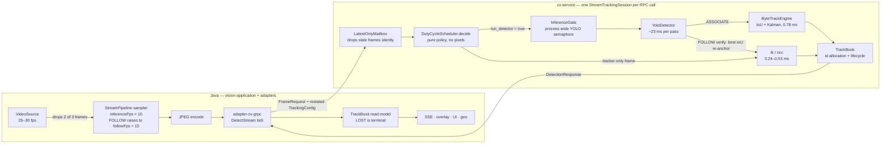
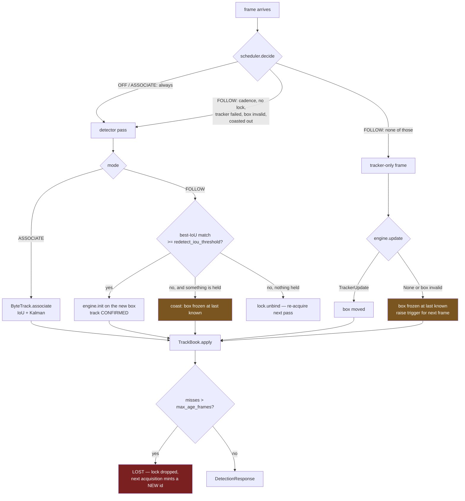
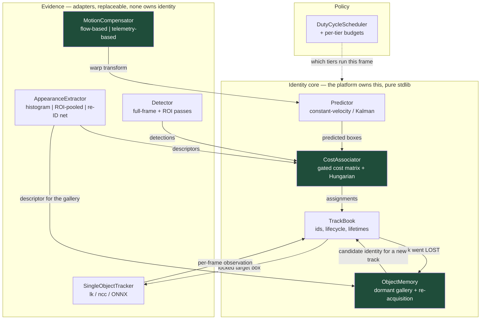
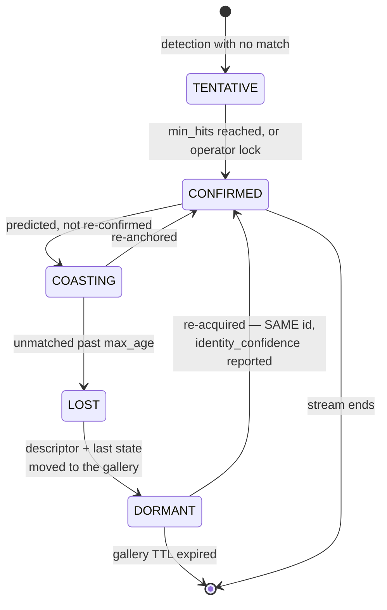
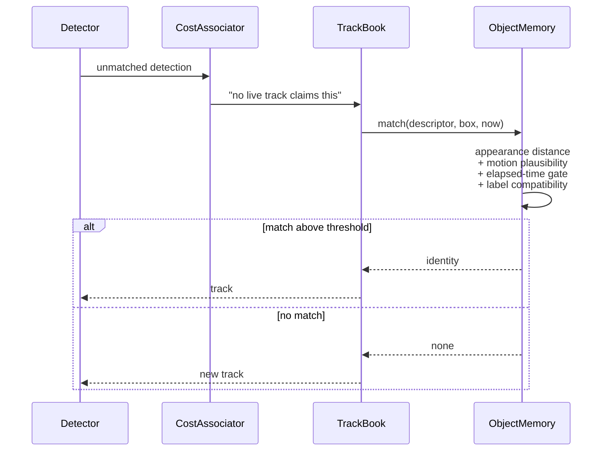

# TRACKING-REVIEW — why cv-service loses the subject, and the architecture that fixes it

**Scope:** `cv-service/` as it stands on `feat/domain-separation`, plus the Java tiers that feed and
consume it (`StreamPipeline`, `adapter-cv-grpc`, `vision-application`'s `TrackBook`).
**Reviewed against:** `cv-service/MODULE.md`, `docs/plans/done/TRACKING-PLAN.md`,
`docs/extracts/TRACKING-ORCHESTRATION.md`, and the source.
**Verdict up front:** the *engineering* is strong — the seams, the degradation ladder, the
stdlib/pixel split, the duty cycle are all better than most production CV code. The *architecture of
identity* is the problem. Track identity today is a by-product of frame-to-frame box overlap. There
is no representation of an object anywhere in the system, so there is nothing that can remember one.

---

## 1. The pipeline as it is today



Two things to notice in that picture, because both are load-bearing for everything below:

1. **The cheap loop is starved and the expensive loop is fed.** The 0.3 ms tracker sees at most
   10–15 fps, because the Java side samples *before* the wire. The 23 ms detector sees every frame
   that arrives. That is exactly backwards from what a duty cycle wants.
2. **Everything that decides identity is inside one third-party object.** `ByteTrackEngine` holds
   its own tracks, its own Kalman filters and its own matching. `TrackBook` runs *downstream* of it
   and only renames what it is handed. There is no seam through which appearance, telemetry, motion
   compensation or memory could participate in the decision.

### The per-frame decision, and where identity is thrown away



The red and amber nodes are where the operator's complaint lives.

---

## 2. What is genuinely good, and must survive any rework

Stated plainly so a rewrite does not throw it away:

- **The duty cycle works and the numbers are real.** 30× fewer detector passes, 22.9× less CPU in
  FOLLOW, measured off the response's own fields rather than `htop`.
- **The layering is correct.** Pure-stdlib policy (`scheduler`, `track`, `lock`, `params`), pixels
  confined to `engines/`, `cv_pb2` confined to `grpc/servicers.py`. This is what makes every change
  below *possible* — the seams already exist even where the abstractions do not.
- **`TrackBook` already owns id allocation**, not the engine. That single decision is what makes
  inverting the association dependency (§4.3) a refactor rather than a rewrite.
- **The gate discipline** — the tracker path structurally cannot acquire `InferenceGate`.
- **Degradation never kills a stream.** FOLLOW → ASSOCIATE → OFF, logged once, never raised.
- **The wire is honest**: `detector_ran`, `detector_reason`, `source`, `track_state` mean a remote
  operator can diagnose without shell access to a flying box.

---

## 3. Why it loses the subject

Findings ordered by how much of the complaint each one explains.

### A. The input is too slow, and blind to the camera's own motion

| # | Finding | Evidence |
|---|---|---|
| A1 | **Association runs at 10 fps on a moving platform.** A drone yawing at 30°/s with a 60° horizontal FOV shifts the whole image by half a frame width in 1 s — i.e. ~5 % of frame width *per sampled frame gap*, and far more during a slew or a gimbal step. A target smaller than that displacement has **zero IoU** with its own previous box, so ByteTrack's first stage cannot match it and it is reborn with a new id. | `PipelineConfig.defaults()` → `inferenceFps = 10`; sampling happens in `StreamPipeline`, before the wire |
| A2 | **Nothing anywhere compensates for ego-motion.** No global motion estimate, no homography, no telemetry. The Kalman filter inside ByteTrack models *object* velocity in image space, so every camera movement is charged to the object as if it had moved. | no GMC in `engines/`; `FrameRequest` carries no pose |
| A3 | **The telemetry that would fix it is already in the building, on the wrong side of the wire.** Attitude, AGL and depression angle are available Java-side (`UsageTracker#latestTelemetry`, `GeoProjection`, `GeolocateSpec`) and are never sent to cv-service. | `vision-application/.../map/application/mark/GeolocateSpec.java` |

A1+A2 together are, in my judgement, **the largest single cause of id churn on real drone footage**,
and the T8 measurement cannot see them: it panned a crop window across one still photograph, which
is a perfectly smooth, blur-free, exposure-stable ego-motion — the easiest possible case.

### B. There is no representation of an object, so nothing can remember one

| # | Finding | Evidence |
|---|---|---|
| B1 | **No appearance model exists at any layer.** Identity is decided purely by box geometry. Two people crossing, or a car passing another car, is an unresolvable ambiguity for an IoU matcher — the classic id-swap. | `bytetrack.py` |
| B2 | **Class is deliberately discarded before association** — every detection is fed as class 0. Sound reasoning for composite mode, but it also means a `person` may inherit a `truck`'s track. | `engines/bytetrack.py:210` |
| B3 | **A LOST track is unrecoverable by construction.** `_follow_key()` returns `follow:{lock.generation}`, so a re-acquisition after a release always mints a *new* book key and therefore a *new* id. | `session.py:393` |
| B4 | **Expiry is a frame counter, not a memory policy.** Tracks are deleted at `misses > max_age_frames × 2` and nothing is retained. There is no gallery, no descriptor, no last-known-position. | `track.py:230` |
| B5 | **Session state lives in the RPC call.** One `StreamTrackingSession` per `DetectStream` invocation — an RF link blip, a reconnect, a worker restart resets every id in the scene to 1. On a drone link that is not an edge case. | `servicers.py`, `DetectStream` |
| B6 | **The Java book is amnesiac too** — `LOST` is terminal, dropped immediately, deliberately ("recognising a dead track would be association by another name"). Correct *given* that association is cv-service's job; it means there is no second chance anywhere. | `vision-application/.../pipeline/TrackBook.java` |
| B7 | **`max_age_frames` means two different things.** In FOLLOW, `misses` only advances on a *verify pass*, so at the default 2 s cadence `max_age_frames = 30` is **60 seconds**, not 30 frames. In ASSOCIATE it is 30 frames = 3 s. Same knob, 20× different meaning. | `track.py:206`, `scheduler.py` trigger (e) |

**B is the direct answer to "remembering of objects": there is nothing to remember with.** A track is
a row that exists only while boxes keep overlapping, and is deleted when they stop.

### C. The single-target loop degrades worse than it needs to

| # | Finding | Evidence |
|---|---|---|
| C1 | **A lost tracker freezes the box instead of predicting it.** `Track` computes `velocity_x/velocity_y` every frame and *nothing ever reads them*. When the tracker fails or the box goes invalid, the session holds the last known box — so during the occlusion the box sits still while the object keeps moving, and the verify pass that follows measures IoU against a stale position and fails to re-anchor. The freeze is what *causes* the subsequent re-anchor failure. | `track.py:194` computes; `session.py:340,349` freeze |
| C2 | **`TrackerUpdate.confidence` is computed by both engines, documented as scheduler trigger (b) — "the earliest honest signal that the scheduler should spend a verify pass" — and never read.** Trigger (b) fires only on a hard `None`. The early-warning signal the design describes is wired at the producer end only. | `lk.py:137`, `ncc.py:99`; `session.py:348` tests only `is None` / `not valid` |
| C3 | **LK never re-seeds its corner set.** `goodFeaturesToTrack` runs once in `init`; `update` only ever *culls* survivors. The corner count decays monotonically to the 4-corner floor and the engine dies — its survival depends entirely on the next verify pass re-`init`-ing it. There is also no forward–backward error check, so corners that jump onto an occluder are silently trusted and the box walks off the target. | `lk.py:67–137` |
| C4 | **NCC's template and box size are fixed at `init`.** No scale adaptation at all: a target approaching the camera keeps its original pixel size until a verify pass corrects it. | `ncc.py` |
| C5 | **After a stall, the session stops calling the engine entirely** and coasts on a frozen box until LOST. Deliberate (it avoids a collapse into per-frame detection) but it means the *only* recovery path is a full-frame detector pass finding the target at the frozen position. | `session.py:340` |
| C6 | **FOLLOW is scene-blind between verify passes.** `_follow_predict` returns exactly one box. For ~29 of every 30 frames the operator's display holds one target and *nothing else* — no other vehicles, no other people. Situational awareness is traded for CPU, and there is nothing to reason against when the target is occluded ("it went behind that truck"). | `session.py:307` |

### D. Failure handling discards more than the failure cost

| # | Finding | Evidence |
|---|---|---|
| D1 | **One engine exception retires every track in the stream.** `_reset_engine` calls `forget_keys()`, clearing the whole book. A transient OpenCV error on one target renumbers the entire scene. | `session.py:470` |
| D2 | Same for any config change touching mode / engine / `max_age_frames` — `_release_engine` → `forget_keys()`. An operator switching engines loses every id. | `session.py:478` |

### E. Nothing in the repo measures the thing being complained about

Every number in `MODULE.md` is a **cost** number — milliseconds, CPU percent, duty ratio. There is
no accuracy metric anywhere: no id-switch count, no fragmentation, no re-acquisition rate, no MOTA
or IDF1, no recorded sequence to replay. The T8 evidence is one panned still photograph with a drawn
rectangle for an occluder.

**This is the finding that gates all the others.** "Tracking loses the subject" is currently an
observation that cannot be reproduced, quantified, or proven fixed. Any change proposed below is an
opinion until there is a harness that scores it.

---

## 4. The architecture

### 4.1 The one-sentence root cause

> Identity is currently a *side effect* of frame adjacency computed inside a third-party engine.
> It needs to be a *first-class domain object* the platform owns, with the engines demoted to
> evidence providers that contribute to a decision they no longer make.

That is the same inversion the rest of this repo already applies everywhere else: ports and
adapters, IoC, the high-level service orchestrating dumb specialised ones. Tracking is the one
place where a library still owns the domain.

### 4.2 Target shape



Green nodes are new. Everything else already exists and keeps its charter.

### 4.3 Invert the association dependency

Today: `Associator.associate(detections, now) -> Observations` — the engine holds the tracks.
Proposed: the core holds the tracks and asks for a *matching*.

```
CostAssociator.assign(
    tracks:     Sequence[PredictedTrack],   # already warped into this frame by GMC
    detections: Sequence[Detection],
) -> Assignment                              # matched pairs, unmatched tracks, unmatched detections
```

with a cost that every tier can contribute to:

```
cost(track, det) = w_iou · (1 − IoU(warp(predict(track)), det))
                 + w_app · appearance_distance(track.descriptor, det.descriptor)
                 + w_lab · label_penalty(track.label, det.label)

gated by a motion gate (Mahalanobis on the predicted state) and an appearance gate,
solved by Hungarian, in ByteTrack's two stages (high-confidence first, then low).
```

ByteTrack stays in the registry as the no-appearance, no-GMC implementation — the honest baseline
and the fallback when nothing else is constructible. Its removal is never forced.

**Why this specific change is the keystone:** every other improvement the operator wants
(appearance, telemetry, memory, motion compensation) is an *input to the association decision*.
Until the platform owns that decision, none of them has anywhere to plug in.

### 4.4 ObjectMemory — the "remembering" tier



`DORMANT` is the new state and the whole point. A dormant entry holds:

- the **track id** (so recovery returns the operator's `#7`, not a new number),
- an **appearance descriptor** — an EMA plus a small gallery of the K best crops, K bounded,
- the **kinematic state** at loss: last box, velocity, and last-known ground position once S2 lands,
- **provenance**: first seen, last seen, times lost, times recovered.

Every track birth is tested against the gallery before an id is allocated:



Three properties fall out that the current design cannot express:

- **Occlusion of arbitrary length.** Today the ceiling is `max_age_frames`; with a gallery it is a
  time TTL measured in tens of seconds.
- **Out-of-frame excursion.** The drone pans away and pans back — the single most common way a
  target is "lost" in practice, and today a guaranteed new id.
- **Honest UI.** `identity_confidence` on the wire means the cockpit can say
  "#7, re-acquired, 82 %" instead of silently asserting or silently renumbering. That matches the
  honest-UI doctrine already established by `detector_ran` and the dashed COASTING box.

**Memory tiers, to keep it bounded and to make cross-sensor fusion reachable later:**

| Tier | Where | Scope | Lifetime | Purpose |
|---|---|---|---|---|
| Hot | cv-service session | live tracks | frames | association |
| Warm | cv-service `ObjectMemory` | dormant gallery, capped per stream | seconds–minutes | re-acquisition |
| Cool | vision-application, per asset/mission | identities across stream restarts | mission | survives reconnect, worker moves |
| Cold | Postgres / JetStream events | trajectories | forever | replay, cross-sensor fusion (C12), after-action |

Only Hot and Warm are needed for the operator's complaint. Cool is what makes B5 (reconnect
amnesia) go away. Cold is already anticipated by DOMAIN-SEPARATION's JetStream.

### 4.5 Ego-motion compensation — the drone-native lever

Two implementations behind one port, chosen by what the deployment actually has:

| Implementation | Input | Cost | Notes |
|---|---|---|---|
| `FlowMotionCompensator` | previous + current grey frame, sparse features on the *background* | ~1–2 ms | works anywhere, including a fixed camera or a file; the standard BoT-SORT GMC approach |
| `TelemetryMotionCompensator` | camera attitude delta + FOV | ~0 ms, no pixels | needs pose on the wire; exact for rotation, which is the dominant term for a gimballed drone |

This requires the one wire change worth making early: an optional `CameraPose` block on
`FrameRequest` (yaw / pitch / roll / FOV / AGL / pose timestamp). It is proto3-additive, and it is
**the same data S2 fixed-camera geolocation needs** — so it is paid for once and used twice.

This is also the piece with genuine competitive value. A generic tracker sees pixels. This platform
has synchronised attitude, gimbal angle and video on the same box, and currently throws two of the
three away. That is a moat-shaped asset sitting unused.

### 4.6 Detection recall — the other half of the complaint

"The detection cannot detect the subject" is a separate failure from association, and it has a
cheap, standard fix the current design has no place for:

- **ROI re-detection.** When a track is coasting, run the detector on a crop around the *predicted*
  box, at native resolution. For a small or distant target this is both **cheaper** than a full
  frame and **far more sensitive** — the target occupies a large fraction of the model's input
  instead of a handful of pixels after downscaling to `imgsz=416`. This is the single highest-value
  detection change for drone altitude.
- **Two-threshold policy.** A high threshold to *birth* a track, a lower one to *sustain* one.
  ByteTrack applies this idea internally to its own candidates; it is not applied at the detector
  request level, where it would actually recover the 0.24-confidence target.

### 4.7 Scalability

The current shape is already sound where it counts (per-stream sessions, per-stream engines, one
process-wide detector gate). Four additions:

1. **Session registry keyed by `stream_id`**, not by RPC call, with a grace window on disconnect.
   Fixes B5 and costs almost nothing.
2. **Separate budgets per tier.** One semaphore for detector passes (exists), one for appearance
   extraction, one for SOT instances per stream. A 1 ms descriptor must never queue behind a 343 ms
   `orion12l` pass — the same reasoning that already keeps the tracker off `InferenceGate`.
3. **Hard caps on memory**: K descriptors per identity, N dormant identities per stream, time TTL.
   Bounded by construction, so an 8-hour flight cannot grow the process.
4. **Placement stays blind.** Everything above lives in cv-service, which already runs onboard
   unchanged. Telemetry compensation makes the onboard case *better*, not harder — that is where
   the pose data is freshest.

Rough per-frame budget at 30 fps, one stream, on the measured CPU numbers:

| Tier | Per frame | Runs on |
|---|---|---|
| decode | 0.6–2.1 ms | every frame |
| GMC (flow) | ~1–2 ms | every frame |
| GMC (telemetry) | ~0 ms | every frame |
| predict + cost + Hungarian | < 1 ms | detector frames |
| appearance, histogram | ~0.2 ms/object | detector frames |
| appearance, ROI-pooled | ~0 ms extra | detector frames (reuses the pass) |
| SOT update | 0.24–0.53 ms/target | tracker frames |
| detector pass | 23 ms (`yolo26n`) | duty-cycled |

The identity core is affordable at full frame rate. **The detector is, and remains, the only
expensive thing** — which is exactly what the duty cycle was built for.

---

## 5. Sequencing

Ordered by value ÷ cost, not by architectural tidiness. Each step ends provable by the step before it.

| Wave | What | Why it is here | Rough size |
|---|---|---|---|
| **W0** | **Evaluation harness + frame recorder.** Record raw frames + responses per stream; replay through the real session offline; report id-switches, fragmentation, re-acquisition rate, mean track lifetime alongside the existing cost numbers. | Nothing below can be judged without it, and every real-world failure becomes a permanent regression fixture. This is the flywheel. | S |
| **W1** | **Correctness fixes inside the current design.** Predict-on-coast instead of freeze (C1); wire `TrackerUpdate.confidence` into trigger (b) (C2); re-seed LK corners + forward–backward check (C3); stop `forget_keys()` on a single engine raise (D1); make LOST time-based and fix the `max_age_frames` double meaning (B7). | No new concepts, no new dependencies, no wire change. Meaningful recovery of "loses the subject" on its own. | S–M |
| **W2** | **Ego-motion compensation.** `MotionCompensator` port + flow implementation; `CameraPose` on `FrameRequest`; telemetry implementation. | Largest single win on real drone footage, and pays for S2 geolocation at the same time. | M |
| **W3** | **Invert association.** Core owns the assignment; `CostAssociator` with gated cost matrix; ByteTrack retained as an engine. | The keystone — creates the seam everything else plugs into. | M |
| **W4** | **Appearance descriptors.** Port + histogram implementation first, then ROI-pooled backbone features, then optional OpenVINO re-ID. | Kills id-swaps on crossing targets; supplies the gallery. | M |
| **W5** | **ObjectMemory + DORMANT + re-acquisition.** New wire fields `identity_confidence`, `recovered`, `dormant_millis`. | The operator-visible "it remembers" feature. | M |
| **W6** | **Multi-target FOLLOW + per-tier budgets.** K SOT instances, locked target first. | Removes scene blindness (C6) while keeping the CPU win. | M |
| **W7** | **Session registry by `stream_id`; warm identity tier in vision-application.** | Identity survives reconnect and worker moves. | M |
| **W8** | **ROI re-detection + two-threshold policy.** | Detection recall for small/distant targets. | S–M |

W0 and W1 are worth doing regardless of whether the rest is ever built.

---

## 6. What not to do

- **Do not reimplement association from scratch.** Hungarian + gating + two-stage is well-trodden;
  the value is in owning the *cost inputs*, not the solver.
- **Do not put re-ID or memory in the Java side.** It is pixels; it belongs where the pixels are,
  and cv-service must stay the deployable, placement-blind unit that can fly.
- **Do not write to the database per frame.** The cold tier is an event stream, not a row per box.
- **Do not adopt a heavyweight re-ID network first.** Ship the histogram, measure with W0, and only
  buy the network if the harness says the cheap descriptor is the limit.
- **Do not delete the duty cycle.** It is the reason this runs on a companion computer at all.

---

## 7. Open decisions for the operator

1. **Frame rate to cv-service in ASSOCIATE.** Raising it from 10 fps toward 20–25 makes association
   dramatically easier and costs bandwidth plus detector passes — unless the detector is
   duty-cycled in ASSOCIATE too, which is a policy change the scheduler is already shaped for.
2. **`CameraPose` on the wire now or later.** Doing it in W2 pays for S2 as well; deferring it
   forces the flow-based GMC to carry the whole ego-motion story.
3. **How honest to be about recovery in the UI.** Reporting `identity_confidence` is more truthful
   and more complex than silently reusing the id.
4. **Whether re-acquisition may cross streams** (two cameras, same object). That is C12 and needs
   the Cool tier plus geolocation; worth naming as a target now so W5's descriptor format does not
   have to change later.

---

*Written 2026-08-11 against `feat/domain-separation`. Review only — no code changed. The
implementation plan, if these directions are accepted, is a separate authored spec.*
