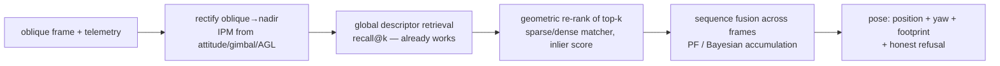
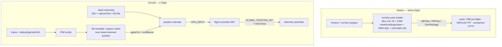

# VISUAL-GEO-RESEARCH — camera ↔ satellite/aerial geolocation: approaches, evidence, and the two sub-ways

Date: 2026-08-19. Author role: architecture synthesis (no code).

This is the index and synthesis over six research reports in `docs/conclusions/visual-geo-research/`.
Read this file first; open a report only for the references behind a claim.

| # | Report | What it holds | Size |
|---|---|---|---|
| 00 | [existing-state](visual-geo-research/00-existing-state.md) | what `feat/visual-geo` built, measured, and already surveyed; failure analysis; reusable pieces | 412 lines |
| 01 | [master-geo-stack](visual-geo-research/01-master-geo-stack.md) | telemetry model, `GeoProjection`, S2 fixed-camera lesson, missions, compute reality, extension points, CLAUDE.md constraints | 405 lines |
| 10 | [classical-registration](visual-geo-research/10-classical-registration.md) | the two seed papers, photogrammetric/template/TRN tradition, DEM sources, onboard vs station feasibility — 44 refs | 567 lines |
| 11 | [deep-crossview-vpr](visual-geo-research/11-deep-crossview-vpr.md) | UAV↔satellite deep retrieval, re-ranking, datasets, "fixing top-1" evidence — 64 refs | 353 lines |
| 12 | [light-onboard](visual-geo-research/12-light-onboard.md) | products, flight-stack hooks, compute budgets, map-pack formats + licensing, 3 light architectures — 86 refs | 505 lines |
| 13 | [heavy-server](visual-geo-research/13-heavy-server.md) | dense matchers on OpenVINO, SfM/ortho pipelines, factor-graph fusion, data services, 3 heavy architectures + correction design — 76 refs | 460 lines |

~270 distinct external references in total, each with URL, venue/year and a one-line verdict.

---

## 1. Why the branch "is not working" — the diagnosis the research confirms

The parked branch (`feat/visual-geo`, 19 commits, 57k lines) does **global-descriptor retrieval**
(AnyLoc/DINOv2-class) of an oblique drone frame against Esri z17 satellite tiles. Its own
measurements (00 §2, §4):

| Fact | Number | Consequence |
|---|---|---|
| Correct tile in top-5 | 0.87–1.00 | the descriptor *finds* the neighbourhood |
| Correct tile top-1 | 0/12 real-video frames, median rank 14 of ~40 | it cannot pick the winner |
| Confident wrong fixes | 0 | the abstention/gating machinery is sound |
| Root cause (falsified alternatives) | **sensor/domain gap** (consumer camera frame vs orthorectified tile), *not* viewing angle (`corr(pitch, matches) ≈ 0`) | fixing "angles" alone will not fix ranking |
| Dangerous class | along-linear-feature *aliasing* (windbreaks, field roads) — a one-tile diagonal slide with believable inliers | needs a structural counter (sequence, OSM, DEM), not a better threshold |
| Unresolved | sequence-localizer *false convergence* on a systematically biased similarity field (§12.14) | any sequence filter needs a diversity/calibration gate |

The literature (11 §4) says the field solves precisely this symptom with a **coarse-to-fine pipeline**,
never with retrieval alone:

Every box except the first exists on the branch as a built-but-unwired slice (00 §6): Slice R
(rectification), Slice P (RoMa loop + consensus), `SequenceLocalizer` (PF, gate PASSED 63/63),
homography pose (Wave 6a). **The branch's problem is pipeline order and wiring, not a missing
algorithm**: rectification and verification were never put *in front of* the ranking decision in
`LocalizeStream`, and the one measured lead (RoMa on the rectified frame, 00 §4 last bullet) was
never swept systematically. Fine-tuning a cross-view descriptor (Sample4Geo/GeoDTR+ style, lever D in
11 §4.1) is the expensive fallback, not the first move.

Two further facts that reframe the whole effort:

- **No public benchmark covers our regime** (oblique, 50–150 m AGL, homogeneous fields, discrete tile
  gallery, consumer camera). Every "meter-level" result in 11 §4.3 assumes near-nadir, or
  orthorectification, or multi-frame fusion. We must build and keep our own eval set; recall@k is the
  wrong headline metric — report metres and **false-fix rate** (11 §4.3, VIGOR precedent).
- **Seed paper 2 (arXiv 2407.14910) is ground-level smartphone VPR** (SIFT panoramas + VGG16 junction
  classifier + DFS over an OSM road graph), not UAV↔ortho (10 §1.2). Its one transferable idea —
  road-graph topology as a localisation prior — lands in the light tier below. Seed paper 1 (Shukla
  et al., ISPRS 2014) is the classical template: SURF+RANSAC to the satellite once, then frame-to-frame
  registration, few-metre accuracy (10 §1.1).

---

## 2. The two sub-ways — recommended shapes

Both tiers share one law the project already paid for: **an ungated matcher produces confident-wrong
fixes; a gated one refuses**. Every candidate below inherits the shipped gating discipline
(match/inlier count thresholds, self-calibration never-accept, residual ceiling at *every* N — the S2
N=2 lesson in 01 §3.1).

### 2.1 LIGHT — onboard, mission corridor + roads preloaded, cheap correction

Ranked candidates (12 §6); the recommendation is **Candidate 1 with Candidate 3's vector layer as
the aliasing counter**:

| Rank | Architecture | Accuracy evidence | Compute class | Integration effort | Named risk (our own measured one) |
|---|---|---|---|---|---|
| 1 | Dead-reckon (optical flow / VIO-lite) + **periodic tile/template correction** (NCC / ORB / XFeat on the rectified frame vs corridor tiles) → `GPS_INPUT` to FC. Honeywell VAN / SPRIN-D-winner / classic TRN pattern | few-metre when it fires (10 §5a); bounded by drift between fixes | RK3588, Pi 5 + Hailo-8L, Orin Nano | **lowest** — `GPS_INPUT` is a standard ArduPilot path; `mavlink-core` FTP settings already exist | aliased/homogeneous tile → must carry the §12.12/§12.13 gating or it regresses |
| 2 | Continuous VIO (OpenVINS/Basalt) + periodic foundation-model retrieval, confidence-fused (SatLoc/FoundLoc pattern) | SatLoc <15 m, >90 % coverage, >2 Hz on 6 TFLOPS; FoundLoc <20 m avg | Orin Nano/NX | highest — needs `VISION_POSITION_ESTIMATE` + a fusion layer we don't have | retrieval ranking on consumer-camera oblique frames is exactly what failed on the branch; needs a geometric second stage |
| 3 | OSM-vector / semantic road-network matching (OrienterNet / VecMapLocNet pattern) | sub-metre ground-level only; aerial accuracy unpublished; 25 ms on Orin | cheapest steady-state once the segmenter runs | medium — needs OSM extract + segmentation model in the pack | structural absence of signal where OSM is empty (our `btn-road-x` region has zero mapped highways) |

Shape of the light tier:

Design notes that the research fixes, not opinions:

- **Pack contents and licensing** (12 §4): Google/Bing forbid offline caching outright; Esri needs the
  *"World Imagery (for Export)"* layer; the only unambiguously free global sources are Sentinel-2/EOX
  cloudless (10 m — coarse fallback), OSM vectors (ODbL) and OpenAerialMap where it exists; Ukrainian
  national ortho via `nsdi.gov.ua` needs a terms check. Multi-date references (branch's
  `WaybackTileSource`) belong in the pack too. Sizes: z17 ≈ 3–6 MB/km² of corridor (12 §4b).
- **Attach point in our stack** (01 §4.2): the MISSIONS-PLAN upload flow (M1/M2/M5–M6) is where a
  "corridor pack" becomes a station artefact pushed alongside the mission; nothing is built yet.
- **Reporting the fix back**: `Telemetry.extra` key convention (frozen on the branch, 00 §7a) is the
  zero-cost RX path; decoding `GPS_INPUT`/`VISION_POSITION_ESTIMATE` is not implemented anywhere
  (01 §7). Feeding a fix *into* the FC is command-TX class and stays operator-gated (01 §5.3).
- **Reusable from the branch** (00 §7a): `rectify.py` (pure cv2/numpy), homography-pose math,
  `GeoProjection.destinationPoint` dead-reckoning primitive, Slice A precompute.

### 2.2 HEAVY — station-side, most accurate, corrects the telemetry track

Ranked candidates (13 §7a):

| Rank | Architecture | Matching | Fusion | Accuracy / robustness | Runs today? |
|---|---|---|---|---|---|
| A — ship first | **Sparse-robust near-real-time** | XFeat + LightGlue (both ONNX/OpenVINO) on the DEM-rectified frame vs ortho | GTSAM-style sliding window, Huber/DCS robust kernels | moderate; good on roads/buildings, brittle on bare fields/forest | **yes** on GB4005 (Intel, no CUDA) |
| B — the heavy pass | **Cross-modal dense, post-flight** | RoMa v2 / EfficientLoFTR, MatchAnything-style cross-modal pretraining | same graph, batch smoothing forward+backward | highest; targets the oblique↔nadir domain gap directly | GPU-class; no verified OpenVINO port → batch/post-flight until a GPU host exists |
| C — research bet | Feed-forward geometry (MASt3R / VGGT / MapAnything) + self-calibration of boresight | one strong pose factor | potentially highest, **unvalidated cross-modally**; MASt3R is CC BY-NC-SA | 2027 horizon |

Telemetry-correction design (13 §7b), grounded in shipped contracts (01 §1–§3):

| Corrected quantity | Source of correction | Gate |
|---|---|---|
| lat/lon | DEM ray-cast + ortho registration fix | matcher inlier ratio + robust residual in the graph |
| yaw/heading | rotation of image-to-map registration | min-baseline / consecutive-agreement before trusting |
| AGL | DEM elevation at matched ground point vs `Telemetry.aglMeters` | terrain-uncertainty-scaled threshold; disagreement downweights the fix |
| boresight/gimbal offset | slowly-varying calibration node (GeoCalib/DroidCalib-style self-calibration) | never trusted blindly from #285/#265 |

Publication: a **parallel, versioned corrected-track stream** (never overwriting raw MAVLink), carrying
covariance and a **divergence alarm** (raw vs corrected > Nσ for M fixes ⇒ spoofing/drift/fault).
Persistence follows the S2 `projected_track_points` high-volume precedent; the fusion seam
(`PositionFix`/`PositionFusion`/`FixOrigin`) exists **only on the parked branch** and must be ported or
rebuilt narrower in `vision-flight` (aircraft's own position — a context decision, 01 §7).

Reusable from the branch (00 §7b): `precise.py` consensus machinery, `SequenceLocalizer` PF (with the
false-convergence gate still to design), `osm_fingerprint.py` (the one lever proven against
along-road aliasing), `WaybackTileSource`, the region-ingestion pipeline.

### 2.3 What the two tiers share

| Concern | Decision the research supports |
|---|---|
| Reference imagery | multi-vendor by design — Maxar revoked Ukraine access in 2025 (13 §5a); Esri-for-Export + Wayback multi-date + Sentinel/EOX fallback + OSM + Copernicus DEM GLO-30 |
| Rectify first | IPM from attitude/gimbal/AGL before any matching (10, 11 lever B, 13 §7a) — cheapest single win, already measured 0/71→43/71 on the branch |
| Honest refusal | match-count/inlier gating + never-accept calibration, residual ceiling at every N |
| Evaluation | our own oblique 50–150 m set, metres + false-fix rate, sequence not stills; the branch's Pexels video and Pozniaky region are the seed |
| Light ↔ heavy hand-off | the heavy tier validates the light tier's fixes post-flight and emits the divergence alarm; the light tier consumes the same pack format the heavy tier's tile ingestion produces |

---

## 3. Decisions for the user (before any build)

1. **Tier order.** Heavy-A first (runs on owned hardware, reuses the most branch code, produces the
   eval harness the light tier needs) — or light-1 first (hardware purchase, FC integration, field
   test)? Recommendation: heavy-A first; it is the instrument that measures everything else.
2. **Branch strategy.** Port the fusion seam (`PositionFix`/`PositionFusion`) + Slice R/P +
   `SequenceLocalizer` out of `feat/visual-geo` as targeted extractions, or revive the branch? The
   memory decision (2026-08-11) was "park, harvest selectively"; nothing here reverses it.
3. **Reference data licensing** for a fielded pack: Esri-for-Export agreement vs open-only
   (10 m + OSM); and whether to ask `nsdi.gov.ua` for terms.
4. **Onboard hardware class** for the light tier: RK3588 / Orin Nano — drives matcher choice (XFeat vs
   NCC vs LightGlue) — ties to `HARDWARE-BUYLIST.md`.
5. **GPU host** for heavy-B: accept post-flight-only until one exists, or budget one now.

## 4. Open questions the research could not close

- No measured OpenVINO latency for XFeat/LightGlue/RoMa on the actual GB4005 (13 Q1).
- No cross-modal benchmark on real oblique-drone-vs-satellite pairs anywhere (11 Q1, 13 Q2).
- Sequence-filter false-convergence gate: candidates listed (00 §6), none designed.
- MAVLink FTP real throughput for pack push; PX4 tolerance of low-rate external fixes (12 OQ).
- Fielded-product accuracy: only 2 of 21 surveyed products publish a reproducible number
  (Palantir VNav ~7 m / 2.7 km; SPRIN-D ICRA paper) — the rest is marketing (12 §1).

## 5. Suggested next step (architecture only)

Author `docs/plans/done/VISUAL-GEO-V2-PLAN.md` with a frozen contract for (a) the corrected-track
stream + divergence alarm in `vision-flight`, (b) the corridor-pack artefact attached to MISSIONS, and
(c) an evaluation protocol in metres/false-fix-rate; waves: H1 eval harness + rectify-first re-rank on
the branch's real video, H2 heavy-A on OpenVINO, H3 corrected-track publication, L1 pack builder,
L2 onboard candidate-1 on the chosen board, L3 `GPS_INPUT` field test (operator-gated).
