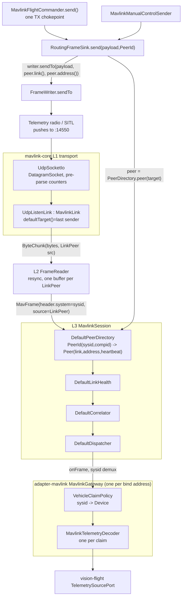

# Platform link-layer audit — where a `Carrier` seam would sit

Code-grounded audit for a generic link over interchangeable carriers (Wi-Fi/UDP today, nRF24-behind-
Arduino/USB wanted as "the main way," direct serial/USB, later LoRa/ELRS). Every claim cites
`file:line` as of branch `chore/agent-context-diet-2`. No builds were run.

## Today's inbound + outbound path



## A. Platform side (Java)

### A1. Inbound: where "datagram from X" becomes "message from vehicle N"

| Step | Class:line | What happens |
|---|---|---|
| Socket receive | `UdpSocketIo.poll` — `drone-link/mavlink-core/.../transport/UdpSocketIo.java:47-61` | Builds `LinkPeer(host,port)` from the datagram (line 59), before anything MAVLink-aware runs |
| Listen link's own default | `UdpListenLink.poll` — `.../transport/UdpListenLink.java:47-54` | `lastLearnedPeer = chunk.source()` (line 51) — "most recent sender," a convenience default, not a routing table |
| Resync + decode | `FrameReader.offer` — `.../codec/FrameReader.java` (one `ResyncBuffer` per `LinkPeer`, mavlink-core MODULE.md:112) | Produces `MavFrame(header, payload, link, source, receivedAt)`; `header.system()` is the wire sysid |
| **Identity transform** | `DefaultPeerDirectory.recordFrame` — `.../session/DefaultPeerDirectory.java:76-89` | `PeerId id = new PeerId(frame.header().system(), frame.header().component())` (line 77) — this line turns "bytes from address X" into "vehicle sysid N." `Peer` then carries `id` and `address` (`frame.source()`) as two separate fields (line 85) |
| Address-flap warning | `DefaultPeerDirectory.warnOnAddressFlap` — same file:102-120 | Logs when one `PeerId` is heard from two `LinkPeer`s inside 3s — the only place a two-transmitter conflict on one sysid is noticed |
| Fixed per-frame order | `MavlinkSession.onFrame` — `.../session/MavlinkSession.java:191-196` | `peerDirectory → linkHealth → correlator → dispatcher`, always |
| Project demux, sysid only | `MavlinkGateway.onFrame` — `drone-link/mavlink/.../MavlinkGateway.java:424-434` | `resolve(sysid)`, never source address — deliberate, since one companion computer can relay several vehicles (class javadoc lines 80-85) |
| Decode | `VehicleRegistration.decoder.accept` via `MavlinkGateway.java:429` | One `MavlinkTelemetryDecoder` per claim, never shared |

**Is the peer address stored/used for identity or reply routing?** Yes for replies, never for
identity. `Peer.address()` (a `LinkPeer`) is stored per `PeerId` (`DefaultPeerDirectory.java:85`) and
is exactly what `RoutingFrameSink.send` resolves against for outbound (`.../session/RoutingFrameSink.java:44-56`).
`LinkPeer`'s own javadoc states the split explicitly: *"deliberately not a MAVLink identity... NAT
can move the observed address between packets from the very same system"* (`.../transport/LinkPeer.java:6-11`).
**Vehicle identity in mavlink-core is already carrier/address-independent** — the biggest fact
already in place for a carrier abstraction.

### A2. Outbound: is there one chokepoint?

| Class | Chokepoint | Resolves via |
|---|---|---|
| `MavlinkFlightCommander` | private `send(...)` — `drone-link/mavlink/.../MavlinkFlightCommander.java:437-471` | Builds `PeerId` from sysid (line 445), `gateway.sink()`/`correlator()` (443-446), `CommandService.sendLong` |
| `MavlinkManualControlSender` | `engage(Device)` — `.../MavlinkManualControlSender.java:117-138` | Same `PeerId` (line 129), `ManualControlService` on `gateway.sink()`/`peers()` (130) |
| Parameter/interval/capability | `MavlinkVehicleConfigurator`, `MavlinkStreamNegotiator`, `MavlinkConnectRemediator` | Each builds its own service on the same `gateway.sink()`/`correlator()` pair |

Every one of those converges on **one real chokepoint**: `RoutingFrameSink.send(Object, PeerId)`
(`.../session/RoutingFrameSink.java:44-56`) resolves `PeerDirectory.peer(target)` and calls
`FrameWriter.sendTo(payload, peer.link(), peer.address())` (`.../codec/FrameWriter.java:110-113`).
No caller ever picks a socket or address itself — **the send side is already carrier-neutral above
`FrameWriter`**, which finally calls `MavlinkLink.send(byte[], LinkPeer)`, an interface method with
no protocol-specific argument.

### A3. Link identity + death signal

| Concept | Real or inferred? | Class:line |
|---|---|---|
| Reader-thread death → `onLinkFailure` | Real (FLEET-RADIO R4/F7) | `MavlinkSession.onLinkFailure` (`.../session/MavlinkSession.java:169-171`), fired from `LinkRuntime.runLoop`'s `catch (IOException e)` (240-248), never for an intentional close |
| Per-vehicle health | Real, but traffic-derived, not radio-derived | `DefaultLinkHealth` — `Health(peerId, connected, lastHeard, received, lost, dropRate)` (mavlink-core MODULE.md:61); `dropRate` = sequence-number gaps on decoded frames |
| Gateway-level failure propagation | Real | `MavlinkGateway` wires `session.onLinkFailure(...)` at construction (`.../MavlinkGateway.java:190`); `handleLinkFailure` (365-369) closes every publisher exceptionally |
| "Vehicle is gone" | **Inference**, not a signal | `VehicleClaimPolicy.isSilent` (`.../VehicleClaimPolicy.java:234-240`) — `now - lastHeard > silenceWindowMillis`; `PeerDirectory` never evicts a once-known peer |
| `vision.mavlink.link-failure-grace` | Configured but inert | `MavlinkSettings.LinkStatus.failureGrace` (mavlink MODULE.md:342-347) — documented "no production runtime branch" |

**Link QUALITY (RSSI/LQ/RADIO_STATUS)?** None. `grep -rniE "RADIO_STATUS|\brssi\b" drone-link/
contexts/ station/` (excluding tests) finds exactly one hit: `MavlinkTelemetryDecoder` maps
`RC_CHANNELS(_RAW).rssi` into `FlightState.rssiPercent` (`drone-link/mavlink/.../MavlinkTelemetryDecoder.java:242,244`)
— the **RC receiver's** signal, reported by the autopilot, not the telemetry/command link's own
quality. `RADIO_STATUS` (#109, what a SiK/3DR-style radio modem itself emits) has zero references
anywhere in `drone-link/` or `contexts/`. **There is no ground-radio link-quality concept anywhere in
the platform** — only connected/not-connected and a sequence-gap `dropRate`.

### A4. Serial transport in Java: none

`grep -rniE "jSerialComm|jssc|SerialPort|/dev/tty|serial" drone-link/ video-input/
device-discovery/` returns zero implementation hits — only two doc placeholders: `MavlinkLink`'s
javadoc *"UDP socket, TCP connection, eventually serial"* (`.../transport/MavlinkLink.java:9,35`) and
`LinkPeer.NONE`'s *"e.g. a future serial link"* (`.../transport/LinkPeer.java:17`). No `pom.xml`
under those trees references a serial library. Serial is a documented intent, not code.

### A5. Where a `Carrier`/`GroundRadio` port belongs

**mavlink-core's L1 (`com.drones.mavlink.transport`) is already the seam, and it is already
carrier-agnostic.** `MavlinkLink` (`.../transport/MavlinkLink.java:28-80`) has no UDP-specific
method — `poll`/`send`/`defaultTarget`/`close`, all byte-oriented. `TcpClientLink` already proves the
"one fixed peer, `target` argument unused" shape a serial link needs (`.../transport/TcpClientLink.java:83-90`,
own javadoc line 23-25: *"a TCP client link has exactly one possible destination"*) — it is the
template to copy, not `UdpListenLink`.

**What would not need to change:** `MavlinkSession` (L3), `FrameReader`/`FrameWriter` (L2), and
every L4 service (`CommandService`, `ManualControlService`, ...) touch only `MavlinkLink`/
`ByteChunk`/`LinkPeer`, never `DatagramSocket`. The same session/codec stack runs unchanged over a
serial byte stream the moment a `MavlinkLink` implementation exists for it. Further,
`MavlinkSession.addLink` already supports **several simultaneously registered links** on one session
(`.../session/MavlinkSession.java:90-104`), all feeding one `PeerDirectory`/`Correlator`/`Dispatcher`
— whichever link last heard a `PeerId` is the one `RoutingFrameSink` replies on. **Cross-carrier
roaming for one vehicle is already representable at L3, with zero mavlink-core changes.**

**What needs a new class:** a `MavlinkLink` implementation for the real byte transport (e.g.
`SerialMavlinkLink`, modelled on `TcpClientLink`). Serial I/O needs a third-party library (no JDK
native API); this should **not** go inside `mavlink-core`, whose frozen contract is "one third-party
dependency: `io.dronefleet.mavlink:mavlink`" (mavlink-core MODULE.md:3-5, D2). Since `MavlinkLink` is
a public interface, the implementation can live in a **new sibling adapter module** and hand
mavlink-core a plain `MavlinkLink` — mavlink-core never needs to know the serial library exists.

**The real blocker is entirely in `adapter-mavlink`:**
- `MavlinkGateway`'s production constructor hardcodes `new UdpListenLink(bindHost, port)`
  (`drone-link/mavlink/.../MavlinkGateway.java:170-172`) even though its field is already typed
  `private final MavlinkLink link;` (line 142).
- `MavlinkTelemetrySource` accepts only `udp://host:port` (`SCHEME_UDP` check, `.../MavlinkTelemetrySource.java:88-89,134`)
  — a serial radio has no host/port to name.
- `MavlinkGateway.CommandTarget.sourceAddress()` is `InetSocketAddress`, not the carrier-neutral
  `LinkPeer` (`.../MavlinkGateway.java:480`), built in `VehicleClaimPolicy.factsFor`
  (`.../VehicleClaimPolicy.java:276`) via `new InetSocketAddress(peer.address().host(), ...)`
  — meaningless for a serial peer.
- One gateway = one link = one `VehicleClaimPolicy`/`PeerDirectory`. "One asset via several TX" needs
  either (a) one gateway registering several links on its one session (cheapest, mechanically
  supported today), or (b) a fleet-level merge across today's per-bind-address gateways — currently
  absent policy, since claim state is strictly 1:1 with one gateway.

### A6. Vehicle identity vs. address

- **Live-claim identity is sysid-only**, at a fixed autopilot component id: `VehicleClaimPolicy`
  queries `(sysid, TARGET_COMPONENT_AUTOPILOT=1)` (`.../VehicleClaimPolicy.java:264-266`,
  `MavlinkFlightCommander.java:166`). Pinned via `StreamDescriptor.options["sysid"]`
  (`.../MavlinkTelemetrySource.java:93,146,392-403`); unpinned claims first-unclaimed-wins,
  re-electing after 30s silence (`VehicleClaimPolicy.claim`, lines 209-231).
- **Discovery-layer identity is address-based** — this is where a different carrier breaks:
  `DiscoveryCandidate.identityKey = method + "|" + address` (+ `"|sysid=" + n`)
  (`docs/plans/active/ZERO-CONFIG-ONBOARDING-CONTEXT.md:266-272`). A vehicle appearing on a
  **different carrier** (a new bind address) is recorded as a brand-new, unrelated candidate — no
  cross-carrier "same physical vehicle" concept exists above the live sysid claim. A registered
  `Device` is likewise bound to exactly one `StreamDescriptor.uri()`; nothing models "reachable via N
  descriptors."
- **Same carrier, moved address (NAT/DHCP)**: handled gracefully — `Peer.address()` is just
  overwritten (`DefaultPeerDirectory.java:85`); `warnOnAddressFlap` only logs a same-sysid two-address
  conflict inside 3s and treats a slower move as a benign reconnect.
- **Is sysid the only identity?** For live routing, yes. MAVLink's hardware UID
  (`AUTOPILOT_VERSION.uid`/`uid2`) is decoded by the wire library but **never extracted or persisted**
  anywhere in this codebase: `CapabilityReport` exposes `firmwareVersion`/`maturity`/`capabilities`/
  `boardVersion`/`vendorId`/`productId`/`raw` but no `uid` field
  (`drone-link/mavlink-core/.../service/CapabilityReport.java:26-27`); `grep -rn "\buid\b|uid2"
  drone-link/` outside comments returns nothing. The drone-onboarding "passport" (O11-O14,
  `docs/plans/active/DRONE-ONBOARDING-PLAN.md:641`) is a **parameter-drift** snapshot per flight, not
  a hardware-identity record — unrelated to the MAVLink UID. **A carrier/address-independent hardware
  identity is not read, stored, or designed for anywhere today** — the cleanest fix for "identity must
  not depend on IP/port" if the UID proves reliable across the real fleet's firmware.

## B. Firmware side (`~/Arduino/ardupoilot-start`)

### B1. Existing seam

```
VehicleController -> ICommandLink   -> MavlinkUdpLink -> IMavlinkCodec -> MavlinkV2Codec
                                        MavlinkUdpLink -> INetworkLink  -> WifiNetworkLink
```
(`README.md:184-190`)

| Interface | File:line | Role | Carrier-agnostic? |
|---|---|---|---|
| `ICommandLink` | `ICommandLink.h:9` | Protocol adapter seam. Own doc: *"deliberately protocol-agnostic... a serial or test-double link can be swapped in without touching the controller"* (lines 4-8) | Yes — no Wi-Fi/UDP concept in its signature |
| `INetworkLink` | `INetworkLink.h:6` | Own doc: *"Abstraction over the IP-layer carrier"* (line 4) — `connected()`, `rssiDbm()`, `reconnect()`, `localAddress()` | **No** — explicitly IP-layer; `rssiDbm()`/`localAddress()` have no nRF24/UART analog |
| `IMavlinkCodec` | `IMavlinkCodec.h:21` | Framing/CRC, own doc: *"no knowledge of UDP or of any particular message's meaning"* (line 17) | Yes — mirrors mavlink-core's `FrameReader`/`FrameWriter` role |

`ICommandLink` ≈ the Java L4/L5 boundary; `INetworkLink`+`IMavlinkCodec` ≈ mavlink-core's L1/L2. The
mismatch: `INetworkLink` was written IP-first, where Java's `MavlinkLink` was written byte-first —
the Java abstraction is the closer match to a real multi-carrier design.

### B2. What is Wi-Fi-specific inside `MavlinkUdpLink`

`MavlinkUdpLink` (`MavlinkUdpLink.h:39`) is both the protocol adapter *and* the UDP transport in one
class (unlike Java, which splits these across two modules):
- **Addressing baked into fields**: `IPAddress peerIp_`/`uint16_t peerPort_` (`MavlinkUdpLink.h:237-241`),
  `WiFiUDP socket_` (line 230) — not behind an opaque peer handle.
- **Transmit-first-to-fixed-host, then learn reply address (not broadcast)**: *"UDP CLIENT that
  becomes a UDP SERVER... transmits first — to the configured `peerHost` — and the app learns our
  address from the first frame"* (`MavlinkUdpLink.h:16-23`). This is unicast-to-a-configured-host,
  distinct from the "broadcast-until-heard" language used for the still-unbuilt Z6 firmware wave
  (`docs/plans/active/ZERO-CONFIG-ONBOARDING-CONTEXT.md:229`).
- **`learnPeer()`** (`MavlinkUdpLink.cpp:784-798`) adopts `socket_.remoteIP()/remotePort()` on every
  decoded frame — the IP-side analog of Java's `UdpListenLink.defaultTarget()`, but ad hoc inline
  rather than behind a `LinkPeer`-shaped type.
- **First-peer command gate** `acceptCommandSource()` (`MavlinkUdpLink.cpp:800-843`) — keyed on
  `IPAddress`/port directly; see B4.
- `INetworkLink::rssiDbm()`/`localAddress()` (`INetworkLink.h:16,34`) are Wi-Fi-association concepts
  with no nRF24/UART equivalent.

### B3. What a second carrier needs

`ICommandLink` needs no change. `INetworkLink` should become a **generic byte-stream carrier**:
- Drop or default-stub `rssiDbm()`/`localAddress()` (as `reconnect()` is already defaulted,
  `INetworkLink.h:25`) so a UART/SPI carrier can implement it honestly.
- `MavlinkUdpLink` should stop owning `WiFiUDP`/`IPAddress` directly and split into (a) a transport
  behind a byte-oriented seam and (b) the existing protocol/parameter/command logic — the firmware
  mirror of Java's `MavlinkGateway` hardcoding `UdpListenLink`.
- `acceptCommandSource`'s incumbent tracking is keyed on `IPAddress`+port
  (`MavlinkUdpLink.cpp:801-802,809-835`); a byte-stream carrier with no inherent address needs this
  replaced by carrier identity (which `INetworkLink` instance) plus, if one carrier multiplexes
  several senders (e.g. one nRF24 pipe), a carrier-supplied sender tag — unresolved in principle,
  not just in code (see B4).

**Network-bound config**: `WifiConfig{ssid,password,hostname,retryIntervalMs}` +
`LinkConfig{peerHost,peerPort,localPort,systemId,componentId,gcsSystemId,gcsComponentId}`
(`Config.h:147-167`) — all **compile-time literals** in `Config.cpp`: `ssid="2G_"`,
`password="d763fe6c@VT"` (lines 91-92), `peerHost="192.168.0.104" // <-- CHANGE ME` (line 103). No
runtime provisioning exists (`grep -n "Improv\|BLE\|provisio"` across the tree finds nothing
relevant) — Improv-based provisioning is a named but unbuilt future item (Z6,
`ZERO-CONFIG-ONBOARDING-CONTEXT.md:229`). `ParameterStore` exposes only `MAV_SYSID`
(`ParameterStore.cpp:54`) from `LinkConfig` over MAVLink — nothing Wi-Fi-related is remotely settable.

**Boot sequence with no Wi-Fi**: `setup()` calls `network.begin()` then unconditionally
`controller.begin() -> link_.begin()` (`ardupoilot-start.ino:84-97`, `VehicleController.cpp:22`).
`MavlinkUdpLink::begin()` returns `false` immediately if `!network_.connected()`
(`MavlinkUdpLink.cpp:172`) — socket never binds, nothing retries synchronously. In `loop()`,
`network.poll()` drives Wi-Fi's own non-blocking reconnect and `MavlinkUdpLink::poll` retries
`begin()` every tick once connected (`MavlinkUdpLink.cpp:220`). Net effect: a Wi-Fi-absent boot is
not fatal — the rover stays disarmed-and-waiting forever, motors stopped, LED off
(`ardupoilot-start.ino:146-152`) — but there is **no fallback carrier**: a Wi-Fi outage is a total
command outage today.

### B4. First-peer gate, and what "many TX / roaming" needs

Mechanism (`MavlinkUdpLink.cpp:800-843`, header doc `MavlinkUdpLink.h:92-115`):
- First address to send a COMMAND-class frame (`RC_CHANNELS_OVERRIDE`/`COMMAND_LONG`) becomes
  `commandSourceIp_/Port_` (lines 809-816); each further COMMAND from it refreshes
  `lastCommandSourceActivityMs_` (818-821).
- A different address may take over only once the incumbent has been silent for
  `timing_.commandTimeoutMs` — the same constant the stream-stall failsafe uses, reused deliberately
  (lines 823-835, header doc 104-109).
- Explicitly **not authentication** — *"no signing, so this is an IP-source check, not
  authentication"* (`MavlinkUdpLink.h:99-100`; R4-firmware-audit finding 4's cheap half).
- Deliberately separate from `learnPeer()`'s reply address, so a louder second transmitter cannot
  steal command authority via the telemetry path alone (`MavlinkUdpLink.h:96-103`).

**"Many TX / roaming between carriers" would require** the firmware to answer three things it has no
concept of today:
1. **Cross-carrier sender identity** — `IPAddress`/port has no UART/nRF24 analog; needs a carrier tag
   or per-message sender id before `acceptCommandSource` can generalize past one `INetworkLink`.
2. **Which carrier is authoritative when two are live** — the silence-then-handover rule generalizes
   to "silent on carrier A hands to carrier B" only if each carrier tracks its own activity clock;
   today there is exactly one such clock for exactly one carrier.
3. **No authentication exists on any carrier** — a second carrier does not worsen this but does not
   fix it either; already a documented, accepted gap (R4-firmware-audit finding 4), not something to
   silently paper over while adding carriers.

## Minimum seam — concrete list (no code)

**Platform (Java)**
1. New `MavlinkLink` implementation for the physical carrier (modelled on `TcpClientLink`) in a new
   sibling adapter module — zero `mavlink-core` changes needed.
2. Widen `MavlinkGateway`'s construction to register one **or more** `MavlinkLink`s on its single
   `MavlinkSession` (mechanism already exists via `MavlinkSession.addLink`; only `MavlinkGateway`'s
   own single-`link` field/constructor needs to change — its package-private test-seam constructor at
   `MavlinkGateway.java:182` is the template).
3. Replace the `udp://host:port`-only `StreamDescriptor` assumption in `MavlinkTelemetrySource`/
   `MavlinkSettings` with a carrier-tagged descriptor (new scheme, or an options-map key like the
   existing `sysid` pin).
4. Change `MavlinkGateway.CommandTarget.sourceAddress()` and `VehicleClaimPolicy.factsFor` from
   `InetSocketAddress` to `LinkPeer` (or `Optional<LinkPeer>`) — `InetSocketAddress` cannot represent
   a serial peer.
5. Decide the cross-carrier identity question: either extract/persist `AUTOPILOT_VERSION.uid`/`uid2`
   as a carrier-independent hardware identity (currently unread anywhere, §A6), or accept identity
   stays sysid-scoped-per-gateway and add an explicit "these N descriptors are one asset" binding at
   the `Device`/warehouse level. A real design decision, not a mechanical refactor.
6. If (5) picks the UID route, update the Discovery Inbox's address-based `identityKey`
   (`ZERO-CONFIG-ONBOARDING-CONTEXT.md:267-268`) — otherwise every new carrier for an already-known
   vehicle keeps surfacing as a brand-new discovery candidate.

**Firmware (outside the vision repo)**
7. Split `MavlinkUdpLink` into a byte-stream transport (behind a generalized `INetworkLink`/new
   `IByteLink`) and the existing MAVLink protocol/parameter/command logic, which stops touching
   `WiFiUDP`/`IPAddress` directly.
8. Generalize `INetworkLink`: drop or default-stub `rssiDbm()`/`localAddress()`; keep
   `connected()`/`poll()`/`reconnect()`, already carrier-shape-agnostic.
9. Add the new carrier's `INetworkLink` implementation (e.g. `Nrf24NetworkLink`/`UartRadioNetworkLink`)
   — the composition root (`ardupoilot-start.ino:4-7`) is already the one place naming concrete
   classes, so this is a one-line swap/addition.
10. Redesign `acceptCommandSource`'s incumbent-tracking to be per-carrier (or per-sender-tag) rather
    than one global `IPAddress`/port pair — see B4's three open questions.
11. **Open question for the owner**: does "the main way" (nRF24-behind-Arduino/USB) mean the
    **station** talks USB-serial to a ground radio dongle (then item 1 above is what matters, and
    7-10 may be unnecessary), or does it mean the **vehicle's own** radio changes (then 7-10 matter)?
    This was not resolved by the code read and should be confirmed before scoping implementation
    waves.
