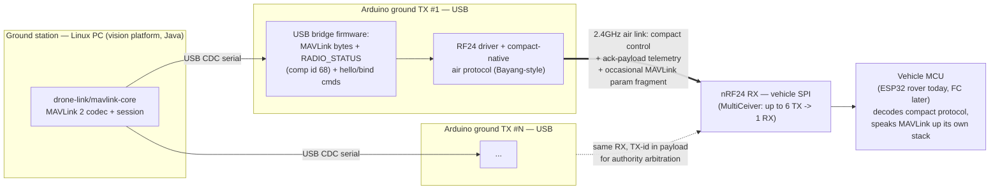

# 04 — nRF24L01(+) as the ground-to-vehicle radio carrier

Status: **research only, no implementation**. Companion to `infra/edge/README.md` (which covers
ELRS backpack / ESP32 bridge / companion-RPi recipes for *aircraft the owner doesn't build*). This
doc is the DIY case: the owner already owns several nRF24L01(+) modules and several Arduinos, and
wants radio — not Wi-Fi/UDP — to become the main carrier between the ground station (the `vision`
Linux/Java platform) and vehicles it builds itself (an ESP32 rover today, ArduPilot vehicles
later). The platform's wire contract is fixed: **MAVLink 2**, telemetry in, `RC_CHANNELS_OVERRIDE`
/ `MANUAL_CONTROL` + parameter protocol + `SET_MESSAGE_INTERVAL` out (`drone-link/mavlink-core`).
The shape asked for: a ground **TX** = Arduino + nRF24 on USB; a vehicle **RX** = nRF24 on SPI; one
asset may be bound to many TX, one PC may drive many TX.

Every non-obvious claim below carries a source URL. Claims without one, or explicitly flagged
**(inference)** / **(this document's estimate)**, are reasoning built on the sourced facts, not
something a source states outright — the two are kept visually separate on purpose.

---

## 1. nRF24L01+ hardware facts that constrain everything downstream

- **32-byte max payload per packet.** Fixed, hardware-level. Every scheme below — fragmentation,
  compact protocols, ack-payload telemetry — starts from this number.
  [Nordic nRF24L01+ Product Specification](https://cdn.sparkfun.com/assets/3/d/8/5/1/nRF24L01P_Product_Specification_1_0.pdf).
- **Air data rates: 250 kbps / 1 Mbps / 2 Mbps**, selectable per link — same datasheet. 250 kbps is
  widely documented as a "+"-revision addition (the original, pre-"+" nRF24L01 did 1/2 Mbps only);
  this is broad community/driver-ecosystem consensus rather than a single side-by-side datasheet
  diff this research re-confirmed today — treat as high-confidence, not freshly re-verified.
- **Enhanced ShockBurst**: hardware auto-ack + auto-retransmit, and the ACK frame itself can carry
  up to a 32-byte **ack payload** back to the original sender — this is what turns a nominally
  one-way pipe into a bidirectional one without a second logical channel. Requires
  `dynamic_payloads` enabled alongside auto-ack.
  [TMRh20/CircuitPython nRF24L01 docs](https://circuitpython-nrf24l01.readthedocs.io/en/1.3.0/troubleshooting.html),
  [Arduino Forum: ACK-payload mechanics](https://forum.arduino.cc/t/question-about-ack-with-payload-in-nrf24l01/538182).
- **MultiCeiver = many TX → one RX, natively, up to 6.** One PRX (receiver) listens on up to 6 pipes
  at once, i.e. up to **6 independent PTX nodes can talk to that one receiver concurrently** — pipe
  0 has its own full 5-byte address, pipes 1-5 share the top 4 bytes and differ only in the low
  byte. [MySensors: "What does Multiceiver mean"](https://forum.mysensors.org/topic/2061/what-does-multiceiver-6-data-pipes-means-nrf24l01),
  [Arduino Forum: multiple TX to one RX](https://forum.arduino.cc/t/nrf24l01-multiple-transmitters-to-one-receiver/396330).
  The reverse — **one TX → many RX** — is *not* symmetric: a PTX opens one destination address per
  transmission, so reaching several receivers means either cycling the destination address
  packet-by-packet or having every receiver share one address (true broadcast), in which case only
  one of them can usefully return an ack payload per transmission before colliding with the others.
  **(inference)** — no source states the asymmetry in so many words, but it falls directly out of
  the addressing model above, and every RF24 network library (§2) routes point-to-point rather than
  broadcasting, which is consistent with it.
- **125 channels, 1 MHz spacing, 2.400–2.525 GHz**, sharing the band with Wi-Fi's 20-22MHz-wide
  channels. [pcbsync.com nRF24L01 tutorial](https://pcbsync.com/nrf24l01-arduino/),
  [MySensors: nRF frequency and channels](https://forum.mysensors.org/topic/4721/nrf-frequency-and-channels).
  Wi-Fi's three non-overlapping 2.4 GHz channels are 1/6/11; community guidance is to park nRF24
  channels in **2420-2427 MHz, 2445-2454 MHz, or 2472-2480 MHz** to sit between them (channel
  number = 2400+N MHz, so roughly nRF24 channels 20-27 / 45-54 / 72-80) —
  [pcbsync.com](https://pcbsync.com/nrf24l01-arduino/). The chip has no real RSSI (only a 1-bit
  carrier-detect "RPD"), so the same source's practical fallback is simply running high (80+) with
  a full 15-retry budget rather than actively avoiding Wi-Fi.
- **Realistic range with PA+LNA modules** (SMA-antenna, RFX2401C-class boards): claimed up to
  1000 m; an unmodified board commonly gets "maybe 1%" of that (a few meters to tens of meters)
  because the amplifier's current spikes brown out a cheap onboard regulator —
  [Hackaday, "Fixing the Terrible Range of Your Cheap NRF24L01+ PA/LNA Module" (2016)](https://hackaday.com/2016/05/31/fixing-the-terrible-range-of-your-cheap-nrf24l01-palna-module/).
  Fix: a dedicated ≥250 mA 3.3 V regulator plus a 10-100 µF capacitor directly at the module's
  VCC/GND, sometimes with a small series resistor for a Pi filter; one documented rebuild then hit
  **~1000 m free line-of-sight and ~270 m through forest**, up from single-digit meters — same
  Hackaday source, corroborated by
  [MySensors: PA/LNA capacitor placement](https://forum.mysensors.org/topic/2269/nrf24l01-pa-lna-capacitor-is-used-at-the-power-antenna)
  and [Hackaday's 2021 follow-up](https://hackaday.com/2021/01/22/fixing-nrf24l01-modules-without-going-too-insane/)
  ("as little as 50 mV p-p of switching noise is enough to degrade usable range to a few feet").
  **Treat this capacitor + dedicated regulator as mandatory BOM, not an optional nicety.**
- **The clone-chip problem: SI24R1.** Widely sold as "nRF24L01+" but not protocol-identical — its
  Enhanced ShockBurst ACK bit is **inverted** relative to the genuine chip (a datasheet error
  carried into silicon), breaking auto-ack interop with real nRF24L01+ parts, and its RF-power
  register bits behave differently —
  [Hackaday, "Nordic NRF24L01+ – Real Vs Fake" (2015)](https://hackaday.com/2015/02/23/nordic-nrf24l01-real-vs-fake/),
  [ZeptoBars die-shot comparison](https://zeptobars.com/en/read/Nordic-NRF24L01P-SI24R1-real-fake-copy)
  (350 nm vs 250 nm die, larger die, presumed worse power/sensitivity),
  [CircuitPython nRF24L01 troubleshooting docs](https://circuitpython-nrf24l01.readthedocs.io/en/1.3.0/troubleshooting.html).
  Practical implication: buy from a source that guarantees genuine Nordic silicon, or bench-test
  auto-ack between every TX/RX pair before trusting it — a mixed genuine+clone fleet is a known
  failure mode, not a hypothetical (see bench-test list at the end).

## 2. Libraries and stacks

- **RF24** (`github.com/nRF24/RF24`, TMRh20 + Avamander) — the OSI-layer-2 driver everything else
  is built on: Arduino/AVR, ATtiny, ESP32/ESP-IDF, RP2040 (Pico SDK), and Linux via `spidev`
  (portable) or BCM2835 (fast path on Raspberry Pi) —
  [RF24 Arduino docs](https://github.com/nRF24/RF24/blob/master/docs/arduino.md),
  [Linux install docs](https://rf24.readthedocs.io/en/v1.4.4/md_docs_linux_install.html).
  **Actively maintained**: last push 2026-09-13 (checked via the GitHub API today), non-archived,
  ~2469 stars.
- **RF24Network** (`github.com/nRF24/RF24Network`) — addressing/routing on top of RF24: tree
  topology, 1-255 numeric node addresses, and — the one first-party piece that matters most here —
  **automatic fragmentation/reassembly of payloads larger than one 32-byte packet**:
  "addressing, routing, fragmentation/re-assembly (very large payloads) are handled automatically"
  — [RF24Mesh docs](https://nrf24.github.io/RF24Mesh/). Last push 2026-09-12. The exact byte
  accounting, read directly from source: `RF24NETWORK_MAX_FRAME_SIZE` is 32 bytes (the hardware
  ceiling), `RF24NetworkHeader` occupies 8 of those, leaving exactly 24 usable bytes per radio
  packet — a message larger than that is split into `NETWORK_FIRST_FRAGMENT` /
  `NETWORK_MORE_FRAGMENTS` / `NETWORK_LAST_FRAGMENT` packets and reassembled at the destination, up
  to a configurable `MAX_PAYLOAD_SIZE` ceiling (144 bytes by default on AVR, 1514 on Linux, 72 on
  ATTiny) —
  [RF24Network_config.h](https://github.com/nRF24/RF24Network/blob/master/RF24Network_config.h),
  [RF24Network.h](https://github.com/nRF24/RF24Network/blob/master/RF24Network.h). This is
  message-oriented (bounded, addressed, individually-reassembled messages), not a continuous
  serial byte stream — the gap the next bullet covers.
- **RF24Mesh** (`github.com/nRF24/RF24Mesh`) — DHCP-like dynamic addressing on top of RF24Network:
  nodes request a numeric address from a master rather than the operator hand-assigning one —
  [RF24Mesh example](https://github.com/nRF24/RF24Mesh/blob/master/examples/RF24Mesh_Example/RF24Mesh_Example.ino).
  Last push 2026-06-06.
- **RF24Gateway** (`github.com/nRF24/RF24Gateway`) — a Linux-side gateway exposing a TUN/TAP virtual
  network interface (`ip tuntap add dev tun_nrf24 mode tun`) so RF24Network/Mesh traffic looks like
  ordinary IP traffic — [RF24Gateway docs](https://nrf24.github.io/RF24Gateway/),
  [RF24Gateway README](https://github.com/nRF24/RF24Gateway). It is framed explicitly as
  **"a complimentary library... for RPi/Linux devices"**, and every RF24 Linux path assumes either
  BCM2835 GPIO or a `spidev` character device — both require a host that physically exposes an SPI
  bus. **A generic desktop/laptop PC does not have one. (inference, but consistent with every
  RF24-ecosystem doc found here)**: a plain ground-station PC cannot talk nRF24 directly. It needs
  either an SBC with GPIO (Raspberry-Pi class) running RF24Gateway, or a USB-attached
  microcontroller acting as translator. Given this project's own framing — "a TX on USB" — the
  Arduino-bridge path is the one that matches, not RF24Gateway.
- **Byte-stream / reliable-serial abstraction**: there is no first-party "just give me a stream" API
  narrower than RF24Network's own message layer. Two real options if one is wanted: (a) treat each
  RF24Network message as a stream chunk, using its built-in large-payload fragmentation — but its
  header eats several bytes out of every 32-byte air packet, since it's designed for the network
  layer's own messages, not arbitrary bytes; (b) **RF24Ethernet** (`github.com/nRF24/RF24Ethernet`,
  referenced from the RF24Gateway README: "allows small Arduino/AVR devices to communicate using
  TCP/IP over nrf24l01") layers a real lwIP TCP/IP socket API on top — a genuine byte stream, but a
  full IP stack is much heavier than a dedicated control-loop bridge needs. No standard, reusable
  hand-rolled fragmentation scheme (sequence number + more-fragments flag) surfaced in this
  research — every MAVLink-over-nRF24 attempt found in §3 either avoided fragmentation entirely or
  never got that far.
- **Maintenance / rot risk**: all four repos are non-archived and were pushed within the last ~3
  months as of 2026-09-17 (RF24 2026-09-13, RF24Network 2026-09-12, RF24Mesh & RF24Gateway
  2026-06-06, per the GitHub API) — low abandonment risk for a 2026 build.

## 3. MAVLink over nRF24 — prior art, and an honest throughput estimate

Wire sizes below are computed directly from the MAVLink source
([`common.xml`](https://github.com/mavlink/mavlink/blob/master/message_definitions/v1.0/common.xml),
[`minimal.xml`](https://github.com/mavlink/mavlink/blob/master/message_definitions/v1.0/minimal.xml))
and the [MAVLink 2 serialization guide](https://mavlink.io/en/guide/serialization.html) (unsigned
frame = 10-byte header + payload + 2-byte CRC):

| Message | Payload bytes | Wire bytes (unsigned MAVLink2) | nRF24 packets needed (32 B each) |
|---|---|---|---|
| HEARTBEAT (id 0) | 9 | 21 | 1 |
| MANUAL_CONTROL (id 69, base fields) | 11 | 23 | 1 |
| ATTITUDE (id 30) | 28 | 40 | 2 |
| RC_CHANNELS_OVERRIDE (id 70), 8-ch form | 18 | 30 | 1 |
| RC_CHANNELS_OVERRIDE (id 70), full 18-ch form | 38 | 50 | 2 |
| RADIO_STATUS (id 109) | 9 | 21 | 1 |

MAVLink 2 also defines **Empty-Byte Payload Truncation**: an implementation may drop trailing
zero-valued bytes before sending, and the receiver reconstructs them —
[mavlink.io serialization guide §Empty-Byte Payload Truncation](https://mavlink.io/en/guide/serialization.html#payload_truncation).
In practice an 8-channel `RC_CHANNELS_OVERRIDE` (the common case) usually goes out around 30 bytes,
not 50 — fits in a **single** nRF24 packet — but only if the bridge firmware replicates that
truncation logic itself; a from-scratch implementation doesn't get it for free.

### Prior art is real but thin — nobody has a finished, measured bridge

- [ArduPilot Discourse: "Resources for developing SiK radio link but with NRF24 modules" (2022)](https://discuss.ardupilot.org/t/resources-for-developing-sik-radio-link-but-with-nrf24-modules/83266) —
  someone set out to build exactly this project's idea. The thread's own conclusion: since they
  weren't injecting a custom RADIO_STATUS, "you don't even need to parse the MAVLink frames and
  could just transfer bytes." No completed/measured build reported afterward.
- [Arduino Forum: "APM/Pixhawk telemetry using nRF24L01P and Arduino Mega2560" (2018)](https://forum.arduino.cc/t/apm-pixhawk-telemetry-using-nrf24l01p-and-arduino-mega2560/521388) —
  a real attempt. The wired proof-of-concept worked (Mission Planner talked to APM through a plain
  serial bridge), but the wireless version sent MAVLink **one raw byte per `radio.write()` call** —
  32 nRF24 transactions to move one 32-byte chunk, no fragmentation logic at all. It was unreliable
  ("APM sends data again and again... no ack or data lost"); the diagnosed cause was a blocking
  state machine that stopped listening while transmitting, not a hard protocol limit — but it shows
  the naive path breaking in practice.
- [ArduPilot Discourse: "Telemetry with Two Arduino and nRF24L01+PA" (2022)](https://discuss.ardupilot.org/t/telemetry-with-two-arduino-and-nrf24l01-pa/85424) —
  never actually built; the thread drifted into troubleshooting *purchased SiK units* instead,
  which is itself telling about where people land when this gets hard.

**Read together: no one has published a finished, fragmentation-correct, measured
MAVLink-over-nRF24 bridge.** Not proof it's impossible — RF24Network's automatic fragmentation
(§2) is the exact missing piece none of these threads reached for — but it means "MAVLink
everywhere" over nRF24 is unpaved ground, not a well-trodden road with numbers to copy. Confirming
how thin this is: GitHub's own repository-search API for the query `mavlink nrf24` returns **zero**
repositories as of 2026-09-17
([search link](https://github.com/search?q=mavlink+nrf24&type=repositories)).

One real, on-topic counter-example did surface, and it independently supports this document's own
split-link conclusion rather than contradicting it:
**[plasmasparc/ArduPilot-TiltLink](https://github.com/plasmasparc/ArduPilot-TiltLink)** puts
**control on LoRa** (SX1276, periodic low-rate frames, ~5 Hz) and **telemetry on nRF24L01+PA**
(2 Mbps, Enhanced ShockBurst) — its own README states the nRF24 leg "carries bidirectional MAVLink
over 2.4 GHz nRF24 to a ground station, which exposes the stream simultaneously as USB serial and
as WiFi UDP, so MAVProxy or QGroundControl can connect," running as "a continuous stream... roughly
nine times the required capacity" with control deliberately kept on a separate radio "so a
telemetry stall can never delay a control frame." That is an independent, working confirmation of
two things this doc argues from first principles elsewhere: nRF24 has ample headroom to carry
MAVLink telemetry **verbatim** once it isn't also asked to carry the control loop (§3's throughput
math), and putting control and telemetry on genuinely separate channels/radios avoids the
telemetry-stalls-control failure mode entirely — a stronger version of the "reserve MAVLink for the
low-priority path only" recommendation below.

### Throughput/latency — **this document's own calculation**, not a sourced measurement

At 250 kbps, Enhanced ShockBurst's fixed per-transaction overhead (5-byte address + packet-control
field + CRC, present on both the data packet and its ACK) is a far bigger fraction of transaction
time than at 1/2 Mbps, since the same byte-overhead takes 4-8× longer to clock out at the slower
rate. A rough best-case budget (no retries, no contention):

- ~40 bytes (32-byte packet + a small ACK) at 250 kbps ≈ **1.3 ms**, plus the chip's documented
  RX/TX-settling turnaround (low hundreds of µs) → **~1.5-2 ms per transaction, best case.**
- A full 18-channel `RC_CHANNELS_OVERRIDE` needs 2 transactions (~3-4 ms); the common truncated
  8-channel form needs 1 (~1.5-2 ms).
- [RF24Network's own tuning guide](https://rf24network.readthedocs.io/en/v1.0.16/md_docs_tuning.html)
  states the *worst* case directly: a (15,15) retry setting is "15 retries at intervals of 4ms,
  taking up to 60ms per payload" — the ceiling this design must budget for under interference, not
  the 1.5 ms floor above.

Sharing 250 kbps air time between one control frame (1-2 packets) and a couple of telemetry frames
(1-2 packets each), a realistic engineered target is **~20-40 Hz control-loop update with ~5-10 Hz
telemetry interleaved, typical latency 10-40 ms, degrading toward the ~60 ms retry ceiling under
interference.** At 1 Mbps the same fixed overhead shrinks proportionally (~0.4-0.5 ms best case per
transaction) — plausibly ~100+ Hz control — at the cost of shorter range, and no clear interference
win (a faster PHY only shortens the vulnerability window per packet; it doesn't shrink a colliding
20 MHz-wide Wi-Fi channel). **Verify on the bench before trusting any of these numbers** (see the
measurement list at the end).

## 4. Alternative: a compact native control protocol, MAVLink carried "occasionally"

Concrete DIY packet formats already exist and fly daily, well inside the 32-byte budget:

- Small joystick-style links commonly pack throttle (10 bit) + yaw (9 bit, signed) + pitch/roll
  (6 bit each, signed) + ~9 flag/mode bits into a **5-byte payload** —
  [Arduino Forum: nRF24L01 wireless joystick](https://forum.arduino.cc/t/nrf24l01-wireless-joystick-transmitter-and-receiver-module/896639),
  [DroneBot Workshop: nRF24L01 wireless joystick](https://dronebotworkshop.com/nrf24l01-wireless-joystick/),
  [Hackster.io: RC transmitter using NRF24L01](https://www.hackster.io/indoorgeek/rc-transmitter-using-nrf24l01-radio-module-and-arduino-0e38fd).
- **Real, flight-controller-grade builds exist too, with measured numbers, not just toys.**
  [`rudra14552/stm32-nrf24-rc-system`](https://github.com/rudra14552/stm32-nrf24-rc-system) — an
  STM32 "Blue Pill" TX reusing gimbals from a broken FlySky FS-i4X, paired with Arduino nRF24
  receivers driving PWM/PPM — uses a **12-byte** `DataPacket` (4×`uint16_t` channels + 4×`uint8_t`
  aux) at `RF24_250KBPS`/`RF24_PA_LOW` with no ack-payload telemetry, and its README reports
  **measured** end-to-end latency of **~30-40 ms** and range of **~700 m** in open space — real
  field numbers for the same 250 kbps/compact-packet combination §3's estimate above is built on.
  [`sergiovirahonda/cortex`](https://github.com/sergiovirahonda/cortex) — an ESP32-S3 flight
  controller paired with a "Synapse" TX — sends a control frame down and rides a **7-byte**
  `TelemetryPacket` (pwm, roll×100, pitch×100, an altitude-hold flag) back on the Enhanced
  ShockBurst **ACK payload**, at `RF24_250KBPS`/`RF24_PA_HIGH` on **channel 108** (deliberately
  chosen above the Wi-Fi band, matching §1's channel-avoidance guidance) — a live, working instance
  of exactly the ack-payload telemetry trick this section and §1 describe, on the same ESP32 class
  of MCU this project's rover already uses.
- The production-grade version of this idea is the **DIY-Multiprotocol-TX-Module**'s Bayang
  implementation. Read directly from its source: `BAYANG_PACKET_SIZE = 15` bytes,
  `BAYANG_RF_NUM_CHANNELS = 4` hop channels plus one fixed bind channel
  (`BAYANG_RF_BIND_CHANNEL = 0`), `BAYANG_ADDRESS_LENGTH = 5` —
  [Bayang_nrf24l01.ino](https://github.com/pascallanger/DIY-Multiprotocol-TX-Module/blob/master/Multiprotocol/Bayang_nrf24l01.ino).
  15 bytes carries up to 15 logical channels (A/E/T/R plus FLIP/RTH/PICTURE/VIDEO/HEADLESS/
  INVERTED/RATES flag bits, plus two analog aux channels in an option mode) —
  [Protocols_Details.md](https://github.com/pascallanger/DIY-Multiprotocol-TX-Module/blob/master/Protocols_Details.md).
  Under half of one nRF24 packet, with headroom to spare.
- Telemetry riding the ack payload is not a theoretical trick: Bayang's optional "Silverware"
  firmware mode does exactly this, returning RX RSSI, TX RSSI, and battery voltage/accelerometer-PID
  values as FrSkyD-Hub-style sensor values inside the ack payload — same
  [Protocols_Details.md](https://github.com/pascallanger/DIY-Multiprotocol-TX-Module/blob/master/Protocols_Details.md).

**Comparison (this document's synthesis):**

| | MAVLink-over-nRF24 | Compact-native + MAVLink-elsewhere |
|---|---|---|
| Protocols to maintain | one, everywhere | two — air-native, and MAVLink at the USB/PC boundary |
| Frame-to-packet fit | routinely > 32 B, forces fragmentation | designed to fit, ≤15 B typical |
| Prior art | thin, none finished/measured (§3) | flown on thousands of toy/DIY aircraft daily |
| Control-loop ceiling | fragmentation + parsing eats into the 250 kbps budget | packet built for the loop, minimal overhead |
| Telemetry | needs its own packets, same fragmentation cost | rides free in the ack payload |
| Where MAVLink still fits | native, no translation | only occasional parameter read/write — reserve a header bit or low-priority slot meaning "this transaction also carries a queued MAVLink parameter fragment," used only when the operator triggers `PARAM_REQUEST_READ`/`PARAM_SET`, which is latency-insensitive by nature |

The compact-native path is what every successful nRF24-based RC link in the wild actually runs;
MAVLink-over-nRF24 is the theoretically uniform choice with no finished prior art behind it.

## 5. Ground side: what the Arduino TX should speak over USB

**Precedent: SiK radios are the existing template.** ArduPilot's SiK telemetry radios present as a
fully transparent serial bridge — bytes in one end come out the other carrying MAVLink unmodified —
and inject their own `RADIO_STATUS` (rssi/remrssi/noise/txbuf/rxerrors/fixed) so any stock GCS shows
link health with zero radio-specific code —
[ArduPilot SiK Telemetry Radio docs](https://ardupilot.org/copter/docs/common-sik-telemetry-radio.html).
`RADIO_STATUS` (message id 109) is a 9-byte-payload "common" dialect message with exactly those 7
fields, verified directly from the MAVLink source —
[`common.xml`, message id 109](https://github.com/mavlink/mavlink/blob/master/message_definitions/v1.0/common.xml).
It's meant to be emitted by *any* radio, not just genuine SiK hardware: the component id it's
typically sent under, `MAV_COMP_ID_TELEMETRY_RADIO = 68`, is documented as **"Telemetry radio (e.g.
SiK radio, or other component that emits RADIO_STATUS messages)"** —
[`minimal.xml`, MAV_COMPONENT enum](https://github.com/mavlink/mavlink/blob/master/message_definitions/v1.0/minimal.xml).
This is a ready-made hook: the nRF24 Arduino bridge can present as a `MAV_COMP_ID_TELEMETRY_RADIO`
component and the platform's existing MAVLink stack gets link-health telemetry for free. The same
enum goes one step further and reserves `MAV_COMP_ID_RADIO`/`RADIO2`/`RADIO3` (110/111/112)
explicitly for **distinguishing multiple physical radios on one link** — a second, MAVLink-native
identity mechanism for this project's "one PC drives many TX" shape, usable alongside (not instead
of) the hello-packet scheme below — same `minimal.xml` MAV_COMPONENT enum source.

**Two designs, compared:**

(a) **Transparent MAVLink bridge (SiK-alike).** The Arduino reassembles air-side fragments (§3/§4)
back into real MAVLink bytes and forwards them over USB CDC serial as-is, synthesizing its own
`RADIO_STATUS`. No new framing to invent on the PC side — `drone-link/mavlink-core`'s parser already
reads this.

(b) **Custom framed protocol with a separate "radio control channel"** (bind, channel-hop
commanding, set address, stats query) alongside the payload stream — needed because raw MAVLink
bytes have no room for "please rebind." Two standard framing choices: **SLIP** (escape a small set
of reserved bytes — simple, but can double-escape and has no bounded worst case) and **COBS**
(Consistent Overhead Byte Stuffing: maps arbitrary bytes into a stream with zero reserved purely for
framing, worst-case overhead a strict ⌈n/254⌉ bytes, keeping transmission time predictable) —
[Wikipedia: Consistent Overhead Byte Stuffing](https://en.wikipedia.org/wiki/Consistent_Overhead_Byte_Stuffing).

**Recommendation (this document's synthesis):** don't invent a second wire format. Lean on MAVLink
for both jobs — `RADIO_STATUS` for link health as above, and MAVLink's own extensibility (a
private/vendor message id, or repurposing an existing microservice like the parameter protocol) for
"radio control channel" concerns — since `drone-link/mavlink-core` already carries a full MAVLink
codec and every adapter in this project already speaks MAVLink as the wire contract (per
`CLAUDE.md`'s module index). Reserve COBS framing only as a fallback if the radio-control surface
needs commands that genuinely don't fit any MAVLink message shape.

**Telling multiple USB radios apart** — two mechanisms, not mutually exclusive:
- **USB serial number / `/dev/serial/by-id`.** Linux exposes a stable-by-id path from USB
  vendor/product/serial when the device reports one — the standard OS mechanism, but only as good
  as the chip's serial number. The cheap **CH340**-based USB-serial chips common on Arduino
  Nano/Uno clones are widely reported to ship with identical or missing serial numbers, making
  several CH340 boards on one PC indistinguishable at the OS level. This specific gotcha is broad
  community knowledge; this research could not land a single pristine, freshly-fetched citation for
  it today after several attempts — **treat as high-confidence, not freshly re-verified.**
- **Application-level "hello packet."** On connect, the PC queries and the Arduino radio replies
  with a small identity record: firmware version, a persistent radio id provisioned into EEPROM at
  first flash, and the vehicle/asset addresses it's currently bound to. This sidesteps the CH340
  problem by making identity a firmware fact instead of a USB fact, letting the platform persist
  "radio id → asset binding" independent of which `/dev/ttyUSBx` or physical port it lands on.
  **Recommended as primary**, with `/dev/serial/by-id` kept as a secondary UX hint.

## 6. Binding, and frequency hopping to survive Wi-Fi

The Bayang implementation gives a directly-sourced, concrete bind sequence — read straight from its
`BAYANG_send_packet()`: while binding, the TX repeatedly broadcasts a packet containing its real,
5-byte address (`rx_tx_addr`) and its 4-entry hop-channel table (`hopping_frequency[]`) on one
**fixed, publicly-known bind channel/address** (`BAYANG_RF_BIND_CHANNEL = 0`) for
`BAYANG_BIND_COUNT = 1000` packets; a receiver listening on that fixed bind address captures the
real address + hop table and switches to using them for all subsequent traffic —
[Bayang_nrf24l01.ino](https://github.com/pascallanger/DIY-Multiprotocol-TX-Module/blob/master/Multiprotocol/Bayang_nrf24l01.ino).
Persisting the negotiated address/table in EEPROM so a power-cycle doesn't require re-binding is
standard practice across this ecosystem — not shown in the exact snippet fetched here, but a
documented, common pattern in the wider multiprotocol/DIY-RC community. **(plausible, not freshly
re-verified)**

**One RX, several TX** is not something to invent — MultiCeiver (§1) already gives up to 6
concurrent transmitters addressing one receiver's pipes natively. What nRF24 does *not* give is an
opinion on **arbitration**: which of several bound TX currently has command authority. Two
architectures **(this document's synthesis — no direct prior art found specifically discussing
multi-TX arbitration)**:
- **(a) Shared address, no whitelist** — every bound TX is handed the vehicle's listening address;
  the RX accepts whatever arrives, and the application decides authority (last-command-wins, or a
  heartbeat/failover scheme). Simplest, but nothing stops an unbound-but-address-guessing TX from
  also commanding the vehicle.
- **(b) Whitelisted TX id in payload** — each compact packet carries a TX id field; the RX's
  application logic only acts on ids it currently authorizes, and hand-off between TX (e.g. a
  ground-station TX vs. a second field-crew TX bound to the same asset) becomes an explicit protocol
  event instead of "whoever transmits last wins." The one to pick if the platform wants explicit,
  auditable authority hand-off between transmitters bound to the same asset.

**Frequency hopping** is the standard answer to sharing spectrum with Wi-Fi: Bayang hops across its
4-entry channel table on a fixed schedule (`BAYANG_PACKET_PERIOD = 2000` µs per packet, same
source), so sustained interference parked on any single channel only costs roughly 1/4 of the
link's dwell time rather than killing it outright. ExpressLRS (already used elsewhere in this
project per `infra/edge/elrs-backpack.md`) applies the same conceptual pattern at larger scale on
2.4 GHz; this research did not re-verify ELRS's specific hop-table mechanics and only claims the
shared principle.

## Proposed ground-radio stack

## 7. Honest alternatives to nRF24, same role

- **ESP-NOW (ESP32↔ESP32)** — no extra hardware if the vehicle MCU is already an ESP32: a
  connectionless peer-to-peer mode built into the Wi-Fi radio/SDK. Payload up to 250 bytes
  (`ESP_NOW_MAX_DATA_LEN`) in the original protocol, up to 1470 bytes in the newer v2 mode —
  [Espressif ESP-IDF: ESP-NOW](https://docs.espressif.com/projects/esp-idf/en/stable/esp32/api-reference/network/esp_now.html).
  Measured range ~220 m open field, both boards' onboard antennas facing each other, dropping to
  ~40 m through two interior walls —
  [Random Nerd Tutorials: ESP-NOW with ESP32](https://randomnerdtutorials.com/esp-now-esp32-arduino-ide/).
  Zero extra hardware for an ESP32 vehicle; **does not help an ArduPilot FC** (no ESP32 radio
  inside a Pixhawk-class board) and has no ground-station story of its own — the PC still needs its
  own USB-attached ESP32 as bridge.
- **LoRa (SX127x, or integrated modules like E22/E32)** — genuinely long range at genuinely low
  rate: 0.3-27 kbit/s depending on spreading factor, "up to 3 miles (4.8 km) in urban areas, and up
  to 10 miles (16 km) or more in rural areas" — [Wikipedia: LoRa](https://en.wikipedia.org/wiki/LoRa).
  The same source states the core tradeoff plainly: higher spreading factor buys sensitivity/range
  at the direct cost of time-on-air per packet. Good for a few Hz of telemetry; **not a candidate
  for a 50 Hz control loop at any spreading factor** — a physics mismatch, not a tuning problem.
- **HC-12 (433 MHz serial, SI4463-based)** — a cheap, drop-in "gets a UART across a field" module;
  the Si4463 chip inside it is a real, currently-in-production Silicon Labs part, explicitly named
  as the core radio inside "commercial modules like the HC-12 wireless transceiver" —
  [Silicon Labs: Si4463 product page](https://www.silabs.com/wireless/proprietary/ezradiopro-sub-ghz-ics/device.si4463).
  Commonly cited real-world range is on the order of ~1 km at low baud, less at higher baud — **this
  specific figure is widely repeated community knowledge this research could not re-confirm against
  a fetchable manufacturer datasheet today; treat as plausible, not freshly verified.** Character:
  transparent serial, telemetry-grade throughput, not control-loop grade.
- **ExpressLRS (2.4/900 MHz) with MAVLink mode** — the strongest fit for **ArduPilot vehicles
  specifically**, and already used elsewhere in this project (`infra/edge/elrs-backpack.md`). ELRS's
  own docs describe bidirectional MAVLink over one link, with concrete throughput for its 2.4 GHz
  "F1000"/dual-band "K1000" packet rates (~2,375 B/s downlink) down to 900 MHz's 200 Hz cap
  (~470 B/s downlink), forcing a 1:2 telemetry ratio in MAVLink mode —
  [ExpressLRS MAVLink docs](https://www.expresslrs.org/software/mavlink/). Needs ESP-based TX/RX
  hardware (not STM32) for this mode. **Does not help the ESP32 DIY rover as-is** — ELRS is built
  around a flight-controller-class receiver decoding RC channels + MAVLink passthrough, not a
  generic point-to-point MCU link; putting ELRS on a bare rover means adding an ELRS RX plus
  FC-like receive logic, not just wiring a UART.
- **SiK radios (433/915 MHz)** — the incumbent this whole investigation is implicitly measured
  against: transparent MAVLink serial bridge, `RADIO_STATUS` built in, ~500 m typical range
  extendable to several km with better antennas, 57,600 baud standard serial, up to 250 kbps air
  rate, up to 20 dBm (100 mW), -121 dBm receiver sensitivity, 433/900 MHz variants —
  [ArduPilot SiK Telemetry Radio docs](https://ardupilot.org/copter/docs/common-sik-telemetry-radio.html).
  Firmware-open, hardware-proven, works with ArduPilot out of the box; does nothing for a DIY ESP32
  rover without the rover growing a MAVLink-over-UART stack of its own — which it would need
  regardless of radio choice, if it's ever to look like a MAVLink vehicle to the platform.

**Decision table** (control/telemetry rates are this document's engineering estimates built from
the sourced figures above, except where a source gives a number directly; cost/effort are ballpark):

| Link | Control-loop rate | Telemetry rate | Realistic range | Cost/link | Integration effort | ArduPilot as-is | ESP32 DIY rover as-is |
|---|---|---|---|---|---|---|---|
| nRF24L01+ (compact-native) | ~20-40 Hz *(est.)* | ~5-10 Hz *(est.)* | ~270 m forest – ~1 km LOS (PA+LNA + power fix) | ~$2-10/module | Medium-high — bind/hop firmware + USB bridge + MAVLink translation | No — needs a bridge | Yes, matching firmware both ends |
| nRF24L01+ (MAVLink-over-air) | Lower than compact-native *(est., fragmentation tax)* | Competes with control for air time | Same radio, same range | Same | High — fragmentation/reassembly is unpaved ground (§3) | No | Yes, more firmware work than compact-native |
| ESP-NOW | High (no fragmentation ≤250 B) | High | ~220 m open / ~40 m through walls | $0 extra (ESP32 only) | Low ESP32↔ESP32; PC still needs its own ESP32 USB bridge | No (no ESP32 in FC) | Yes, natively |
| LoRa (SX127x/E22/E32) | No — airtime too long for 50 Hz | Yes, a few Hz | Multi-km | ~$5-15/module | Medium | Not typically (telemetry-only role) | Yes, telemetry-only |
| HC-12 (433 MHz) | No — low baud, not control-grade | Yes, modest | ~1 km *(commonly cited, not freshly verified)* | ~$3-5/module | Low | Not typically (telemetry-only role) | Yes, telemetry-only |
| ExpressLRS (MAVLink mode) | Yes, up to several hundred Hz | Yes — ~2,375 B/s down (2.4 GHz) / ~470 B/s (900 MHz) | Several km+ field-realistic | ~$15-25 RX *(not freshly confirmed)* | Low on ArduPilot; high for a bare rover | **Yes, native** | No — needs FC-like RX logic |
| SiK (433/915 MHz) | N/A — telemetry+command passthrough, not a control-loop protocol | Yes, transparent MAVLink | ~500 m stock, several km with better antenna | ~$15-30/pair *(not freshly confirmed)* | Low | **Yes, native** | Rover still needs to speak MAVLink over the SiK's UART regardless of radio |

## Recommendation for vision

1. **Air-side framing: compact-native, not MAVLink-over-nRF24.** §3's prior-art review found no
   finished, measured MAVLink-over-nRF24 bridge anywhere; §4's Bayang-style compact frame is proven
   daily on real hardware, fits in ~15 of the 32 available bytes, and leaves headroom. Reserve
   MAVLink strictly for the parameter-protocol / occasional-config path, fragmented into a
   low-priority slot, never on the control-loop critical path.
2. **USB-side framing: MAVLink, not a new custom format.** The Arduino TX should look like a SiK
   radio to the PC — transparent MAVLink bytes plus a synthesized `RADIO_STATUS` under
   `MAV_COMP_ID_TELEMETRY_RADIO` (68) — because `drone-link/mavlink-core` already parses this and
   every other adapter in the project already speaks it. Fall back to COBS-framed custom packets
   for the "radio control channel" (bind/hop/address/stats) only if no reasonable MAVLink message
   shape fits; try a private/vendor message id first.
3. **Library: TMRh20's RF24 as the Arduino-side driver**, with the compact packet format hand-rolled
   directly on top of it (Bayang-style) rather than adopting RF24Network/Mesh's own addressing
   scheme, which is built for multi-hop mesh routing this point-to-point link doesn't need. Do not
   attempt RF24Gateway on the PC — the PC has no SPI bus; the Arduino-over-USB bridge already *is*
   the translator RF24Gateway would otherwise provide on an SBC.
4. **Bind/hop: copy Bayang's scheme wholesale** — fixed bind channel/address known by firmware, TX
   broadcasts a real random address + small hop table during bind, both sides persist it to EEPROM,
   then hop across the table during normal operation. For "one asset, many TX," lean on MultiCeiver's
   native 6-pipe support and add a TX-id field in the payload (§6 option (b)) so the platform can
   track and audit which ground TX currently holds command authority.
5. **Buy/avoid:** buy modules from a source that states genuine Nordic silicon, or bench-test every
   TX/RX pair's auto-ack before trusting it (§1's SI24R1 clone problem is real and common on the
   cheapest listings). If using PA+LNA boards, budget for a dedicated ≥250 mA 3.3 V regulator and a
   10-100 µF capacitor at the module as mandatory BOM, not an optional nicety.

## Three things to measure on the bench before committing

1. **Genuine-silicon auto-ack check across every TX/RX pair the owner already owns.** Enable ack
   payloads and auto-ack between each combination; a pair that silently fails or behaves
   inconsistently is very likely a clone-vs-genuine mismatch (§1) — a 10-minute bench test is far
   cheaper than finding this in the field.
2. **Real sustained control-loop rate and jitter at 250 kbps with the actual compact packet size
   chosen, under a background 2.4 GHz Wi-Fi load** (a phone on a video call nearby, or a laptop
   pinned to an AP on the bench). §3's ~20-40 Hz estimate and RF24Network's documented 60 ms retry
   ceiling are both computed/found-in-docs, not measured on this exact hardware — this one test
   either confirms or throws out the whole design assumption.
3. **PA+LNA range with and without the power fix, on the actual channel(s) chosen to dodge Wi-Fi
   1/6/11** (§1) — a walk-away range test, both line-of-sight and through the kind of obstruction the
   deployment will actually see (tree line, building corner), to know whether "compact-native at
   250 kbps + PA/LNA" gets anywhere near the ~1 km LOS figure other builders reported, or whether
   this owner's specific modules/antennas/environment land closer to the "1%" failure mode the fix
   is meant to cure.
