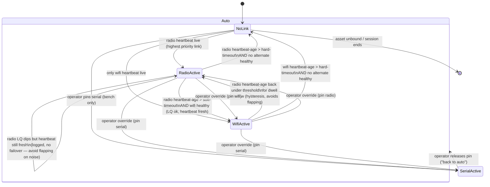

# Multi-link arbitration: reaching one vehicle over several simultaneous links

**Research only. No code changes.** Answers: which link carries control when a ground computer holds
several links to one vehicle at once (Wi-Fi/UDP, an nRF24 ground radio ("TX") on USB, a bench serial
cable), how the vehicle should dedupe/authorize, how failover should work, what the station should show,
and what vehicle firmware (today's ESP32 DIY rover with a first-peer command gate, ArduPilot later) must
implement. Every non-obvious claim below carries a source URL and a **VERIFIED** or **INFERRED** tag —
INFERRED means no primary source stated it directly; the reasoning is given so it can be checked.

---

## 0. Vocabulary used below

- **Link** — one physical/transport path to a vehicle (a serial port, a UDP socket, a USB radio dongle).
  In `vision` terms, one `adapter-mavlink` connection.
- **TX** — a ground radio device driving one link (an nRF24 dongle, an ELRS module). One asset can be
  bound to several TX at once; one PC can host several TX for several assets.
- **Active/control link** — the one link a station is currently allowed to send control (RC
  override / manual control / commands) on. Every other bound link is telemetry-only ("RX fan-in").
- **Election** — the station-side decision of which bound link is active, re-evaluated as links degrade
  or recover.

---

## 1. Comparison table

| System | Links per vehicle | TX rule (who transmits control, when several links exist) | Dedup | Failover trigger | Failover time | What the operator sees |
|---|---|---|---|---|---|---|
| **ArduPilot** (vehicle firmware) | Many `GCS_MAVLink` channels at once — 5/8/16 depending on board flash, one per SERIALn/UDP/TCP ([GCS_MAVLink.h](https://github.com/ArduPilot/ardupilot/blob/master/libraries/GCS_MAVLink/GCS_MAVLink.h), VERIFIED) | No link-based gate at all: `SYSID_MYGCS` (default 255) gates `RC_CHANNELS_OVERRIDE`/`MANUAL_CONTROL` **by sysid in the message, not by which channel it arrived on** ([issue #1515](https://github.com/ArduPilot/ardupilot/issues/1515), [PR #16515](https://github.com/ArduPilot/ardupilot/pull/16515), VERIFIED) | **None** between independently-arriving messages — each is decoded and handled ([MAVLink_routing.cpp](https://github.com/ArduPilot/ardupilot/blob/master/libraries/GCS_MAVLink/MAVLink_routing.cpp), VERIFIED). Override value is a single mutable per-channel slot + timestamp — **last message wins**, no sender arbitration (INFERRED from `RC_Channels.cpp` structure + [forum](https://discuss.ardupilot.org/t/gcs-system-id-enforce/137237)) | GCS failsafe: no heartbeat from `SYSID_MYGCS` on **any** link (one shared, global timer, not per-link — [PR #16515](https://github.com/ArduPilot/ardupilot/pull/16515), VERIFIED) | `FS_GCS_TIMEOUT` default **5 s**; RC failsafe `RC_FS_TIMEOUT` default **1 s**; override staleness `RC_OVERRIDE_TIME` default **3 s** ([GCS Failsafe](https://ardupilot.org/copter/docs/gcs-failsafe.html), [Radio Failsafe](https://ardupilot.org/copter/docs/radio-failsafe.html), [Joystick docs](https://ardupilot.org/copter/docs/common-joystick.html), all VERIFIED) | Whatever the connected GCS renders — ArduPilot itself has no concept of "operator display," only failsafe action (RTL/Land/etc. per `FS_GCS_ENABL`) |
| **PX4** (vehicle firmware) | Several concurrent `mavlink` module instances, one per port, via `MAV_n_CONFIG` ([MAVLink Peripherals](https://docs.px4.io/main/en/peripherals/mavlink_peripherals), VERIFIED) | `COM_RC_IN_MODE` (0–8) governs RC-vs-MAVLink priority, including auto-switch-on-loss (mode 2), sticky-lock (mode 3), and explicit instance-priority orderings (5–8) ([Manual Control](https://docs.px4.io/main/en/config/manual_control), VERIFIED) | Not documented; each instance appears independently tracked, no stated cross-instance sysid dedup (INFERRED from instance-indexed priority design) | `NAV_DLL_ACT` fires after `COM_DL_LOSS_T` of no data link ([Safety config](https://docs.px4.io/main/en/config/safety), VERIFIED mechanism) | `COM_DL_LOSS_T` default commonly cited as ~10 s — **could not verify the exact current default in this pass**, flag as unverified | Vehicle-side only; same caveat as ArduPilot |
| **mavlink-router** (ground router) | Endpoints in the same `Group` share a connected-systems list — the documented mechanism for "same vehicle, two parallel links" ([README](https://github.com/mavlink-router/mavlink-router/blob/master/README.md), VERIFIED) | **Broadcast-then-filter**: every inbound message is offered to every other endpoint; each endpoint delivers only if it has independently seen the target sysid ([README](https://github.com/mavlink-router/mavlink-router/blob/master/README.md), VERIFIED) — not "one link wins," all eligible links get it | Optional `DeduplicationPeriod` (ms): drops a message if an identical hash was seen within that window ([README](https://github.com/mavlink-router/mavlink-router/blob/master/README.md); [endpoint_core.rs](https://docs.rs/mavrouter/latest/src/mavrouter/endpoint_core.rs.html), VERIFIED) | Per-endpoint; no vehicle-level aggregation (it is a pure router, not vehicle-state-aware) | N/A | N/A — it has no UI |
| **MAVProxy** | `--master` × N, auto-merged read stream ([Startup Options](https://ardupilot.org/mavproxy/docs/getting_started/starting.html), VERIFIED) | One selected **primary** link via `settings.link` index, skips any with `linkerror`; a separate per-vehicle `foreach_mav()` path targets only links that have seen that sysid/compid; `alllinks` is a manual all-links override ([mavproxy.py](https://github.com/ArduPilot/MAVProxy/blob/master/MAVProxy/mavproxy.py), [mavproxy_link.py](https://github.com/ArduPilot/MAVProxy/blob/master/MAVProxy/modules/mavproxy_link.py), VERIFIED) | None beyond the routing table above | Per-link `linkerror`/`last_message` age vs `settings.timeout` ([mavproxy.py](https://github.com/ArduPilot/MAVProxy/blob/master/MAVProxy/mavproxy.py), VERIFIED) | Operator-configured `settings.timeout`; no fixed default surfaced in this pass | `link list` shows each link's id/label/status ([Link Management](https://ardupilot.org/mavproxy/docs/modules/link.html), VERIFIED) |
| **QGroundControl** | First-class per-vehicle `VehicleLinkManager`, introduced in [PR #9101](https://github.com/mavlink/qgroundcontrol/pull/9101) (VERIFIED) | Exactly **one primary link** per vehicle, chosen by `_bestActivePrimaryLink()`: direct USB > any normal-latency link > high-latency only if nothing else; re-evaluated continuously; all other bound links are RX-only ([VehicleLinkManager.cc](https://github.com/mavlink/qgroundcontrol/blob/master/src/Vehicle/VehicleLinkManager.cc), VERIFIED) | N/A (single active writer by construction) | Each link has its own `heartbeatElapsedTimer`/`commLost`; **vehicle-level loss fires only when every link reports loss** ([VehicleLinkManager.cc](https://github.com/mavlink/qgroundcontrol/blob/master/src/Vehicle/VehicleLinkManager.cc), VERIFIED) | Per-link heartbeat timeout (value not extracted in this pass) | Vehicle shown "lost" only on total loss; individual link health is internal state — QGC does not appear to expose a full per-link health panel to the operator in the docs surveyed (gap, not confirmed either way) |
| **Mission Planner** | Supported via manual setup (right-click Disconnect → add another link) — ArduPilot's own docs: *"Both Mission Planner and MAVProxy provide means of establishing redundant links"* ([Redundant Telemetry Links](https://ardupilot.org/plane/docs/common-redundant-telemetry.html), VERIFIED) | **Fully manual** — operator picks the active link from a dropdown for all tabs/views; ArduPilot's own doc contrasts this directly with MAVProxy: *"In the case of MAVProxy, that switching is automatically done based on best link performance, and can be done manually [in Mission Planner]"* ([same doc](https://ardupilot.org/plane/docs/common-redundant-telemetry.html), VERIFIED) | None documented | Not documented | Not documented | Link-selector dropdown; no automatic health/failover surfaced to the operator |
| **ExpressLRS Gemini** (RC link) | One TX module, two simultaneous RF chains/antennas (or two bands in GemX) to one true-diversity receiver — not two independent TX units ([expresslrs.org/software/gemini](https://www.expresslrs.org/software/gemini/), [Oscar Liang](https://oscarliang.com/expresslrs-gemini/), VERIFIED) | N/A — single logical control stream, combined at the RF/receiver level before it becomes a CRSF frame | Exact per-packet combining algorithm **not published**; vendor language only says packets are "combined in real-time" ([RadioMaster XR4 page](https://radiomasterrc.com/products/xr4-gemini-xrossband-dual-band-expresslrs-receiver), INFERRED: likely "best successfully-decoded packet per tick," not literal waveform summing) | N/A (simultaneous by design, no failover state) | No documented ms figure; qualitative "no latency penalty" claim only ([Oscar Liang](https://oscarliang.com/expresslrs-gemini/)) | CRSF `LINK_STATISTICS` frame: per-antenna RSSI, LQ%, SNR, active-antenna flag ([crsf-wg wiki](https://github.com/crsf-wg/crsf/wiki/CRSF_FRAMETYPE_LINK_STATISTICS), VERIFIED) |
| **FrSky Receiver Redundancy** | Two full receivers bound to one TX, arbitrated by a Redundancy Bus or SBUS-redundancy-capable receiver | **Wired master/slave priority**, not per-packet racing: *"If master receiver goes into failsafe, the output signal from the slave receiver will be used until the master receiver regains a stronger output"* ([FrSky RX8R guide](https://www.frsky-rc.com/frsky-rx8r-redundancy-bus-receiver-introduction-and-basic-guide/), VERIFIED) | N/A — only one output is ever live | Master's own failsafe state | Not documented (manual PDF not extractable in this pass) | RSSI via S.Port/FPort telemetry ([ArduPilot FrSky Telemetry](https://ardupilot.org/copter/docs/common-frsky-telemetry.html), VERIFIED) |
| **TBS Crossfire + Wi-Fi** | Not a redundant *control* pattern at all — TBS's own doc scopes the TX's Wi-Fi module as a **telemetry/GCS bridge only** ([TBS MAVLink-over-WiFi PDF](https://www.team-blacksheep.com/media/files/tbs-crossfire-mavlink-over-wifi.pdf), VERIFIED) | Crossfire RF is the sole control path; Wi-Fi never carries a competing copy of stick data | N/A | N/A | N/A | N/A |
| **SiK radio (standard)** | Strict point-to-point TDM — *"we never have the situation where both radios transmit at the same time"* ([ArduPilot SiK Advanced Config](https://ardupilot.org/copter/docs/common-3dr-radio-advanced-configuration-and-technical-information.html), VERIFIED) | N/A — one pair, one link. ArduPilot's own multi-**vehicle** pattern is one NETID per vehicle pair (frequency separation), not one radio serving many vehicles ([Multi-Vehicle Flying](https://ardupilot.org/copter/docs/common-multi-vehicle-flying.html), VERIFIED) | N/A | Radio-pair sync loss | Not documented | Per-vehicle telemetry connection in the GCS |
| **MPSiK / RFD900 multipoint** | Community/vendor firmware forks adding NODEID/NODECOUNT/NODEDESTINATION (MPSiK) or a master-coordinated TDMA star (RFD900 multipoint) — both **star topology**, one master node coordinating slots ([discuss.ardupilot.org thread](https://discuss.ardupilot.org/t/multipoint-multisik-firmware/88474), VERIFIED as community-sourced; [RFD900x Multipoint manual](https://files.rfdesign.com.au/Files/documents/RFD900x%20Multipoint%20User%20Manual%20V1.0.pdf), VERIFIED existence, body not directly re-read) | Addressed sends via `NODEDESTINATION`; broadcast via 65535 | Not documented; practitioner reports of addressed messages leaking to all nodes | Sync-master loss | Not documented | Reported reliability defects at >2 vehicles sharing the network (CRC errors, reduced telemetry) — **treat as immature for anything beyond a handful of nodes**, per practitioner testimony not an official spec |

---

## 2. The two axes this table actually shows

Two different problems keep getting called "multi-link" and they need different answers:

- **Same vehicle, several links (redundancy)** — QGC's `VehicleLinkManager`, mavlink-router's `Group`, and
  ExpressLRS Gemini are the three real prior-art answers. All three converge on the same shape: **one
  active writer, chosen by priority/quality, re-elected on health change; every other bound link stays a
  live reader.** Nobody's production answer is "broadcast control on all bound links" — even
  mavlink-router's broadcast-then-filter is a routing mechanism for message delivery between *different*
  systems, not a recommendation to send RC override redundantly (ArduPilot's own "two GCS both override"
  case, §1 row 1, is exactly the hazard this design avoids by construction).
- **One PC, several vehicles (fan-out)** — mavlink-router and QGC both handle this "for free": identity is
  the MAVLink sysid, not the link. A link is just the wire a sysid happened to arrive on
  ([mavlink-router README](https://github.com/mavlink-router/mavlink-router/blob/master/README.md), VERIFIED). The multipoint radio firmwares (MPSiK/RFD900) try to solve
  this at the RF layer instead (one radio addressing many nodes) and are the least mature option surveyed —
  ArduPilot's own documented answer to multi-vehicle is simpler and more boring: one radio pair per vehicle,
  separated by NETID, fanned into one GCS by sysid ([Multi-Vehicle Flying](https://ardupilot.org/copter/docs/common-multi-vehicle-flying.html), VERIFIED). `vision`'s
  "many TX, one PC" case is this second, well-trodden pattern, not the multipoint-RF pattern — no reason to
  chase MPSiK/RFD900-multipoint's immaturity when one-TX-per-vehicle-plus-sysid-demux already works.

**Authorization is the other axis, and it's already solved:** MAVLink 2 signing uses **one shared 32-byte
secret key per vehicle, reused across every link** — the per-message `link-id` field only disambiguates
replay-timestamp bookkeeping per channel, it is not a second secret
([mavlink.io signing spec](https://mavlink.io/en/guide/message_signing.html), VERIFIED). ArduPilot's own
doc states the practical effect plainly: *"any link... will only respond to MAVLink commands if they are
signed with the key the autopilot is using"*
([ArduPilot MAVLink2 Signing](https://ardupilot.org/copter/docs/common-MAVLink2-signing.html), VERIFIED).
QGroundControl and Mission Planner both implement exactly this model — one key, pushed once via
`SETUP_SIGNING`, valid on whichever link presents it
([QGC Telemetry settings](https://docs.qgroundcontrol.com/master/en/qgc-user-guide/settings_view/telemetry.html);
[Mission Planner signing docs](https://ardupilot.org/planner/docs/common-MAVLink2-signing.html), both
VERIFIED). This is precisely the "any TX holding the key is authorized, regardless of link" model the
research brief asked about — it's not a hypothetical, it's how the two reference GCS already work.

---

## 3. Recommended election state machine for `vision`

Priority (sticky, not "last one wins"): **radio > wifi > serial**. Serial is bench-only — automatic
election must never propose it; it is reachable only through an explicit operator pin. This mirrors QGC's
priority list (USB-direct > normal-latency > high-latency, [VehicleLinkManager.cc](https://github.com/mavlink/qgroundcontrol/blob/master/src/Vehicle/VehicleLinkManager.cc)) applied to `vision`'s
own three transports, and ArduPilot's two-tier failsafe timing (fast local-input loss vs slower GCS-link
loss, [Radio](https://ardupilot.org/copter/docs/radio-failsafe.html)/[GCS failsafe](https://ardupilot.org/copter/docs/gcs-failsafe.html) docs) informs the threshold ordering: the station should fail
over to a healthy alternate *before* the vehicle's own onboard GCS-failsafe would fire, never after.

Rules encoded above:

- **Soft threshold** (LQ or early heartbeat-age drift) logs and watches; it does not fail over by itself
  unless a healthier alternate already exists — this is the hysteresis QGC's continuous re-evaluation and
  ArduPilot's global-not-per-link failsafe timer both imply is necessary to avoid flapping on transient
  noise.
- **Hard threshold** (heartbeat-age exceeding a bound picked to be *shorter* than the vehicle's own GCS
  failsafe, e.g. comfortably under ArduPilot's 5 s `FS_GCS_TIMEOUT`) forces a failover attempt to any
  healthy alternate, or a drop to `NoLink` if none exists — at which point the vehicle's own onboard
  failsafe (RC ~1 s / GCS ~5 s per §1) is the real backstop, not the station.
- **Reclaim dwell**: recovering to a higher-priority link requires it to stay healthy for a dwell window,
  not just one good heartbeat — this is the sticky-preference requirement (radio preferred even when both
  are fine) implemented without flapping on a single lucky packet.
- **Operator override** is a first-class transition from any state, including into the bench-only serial
  link, and is clearly distinguished from `Auto` (see §6, operator display).
- Exactly one link is ever the transmit target for control traffic at a time — every other bound link stays
  a live telemetry/heartbeat/LQ source feeding the election logic, mirroring QGC's primary/secondary split
  and mavlink-router's `Group` model (§1).

---

## 4. What the VEHICLE firmware must implement

Framed against today's ESP32 rover ("first UDP peer that sends a valid frame becomes THE controller, all
others ignored") and the ArduPilot target it should converge toward:

1. **Bind to a set of authorized senders, not the first peer.** Replace "first packet wins, forever" with
   an allowlist gate — ArduPilot's equivalent is `SYSID_MYGCS` plus (recommended) MAVLink signing: identity
   is a value in the message (sysid, or better, possession of a shared secret), never "whichever transport
   spoke first" (§1 row 1, §2 signing discussion).
2. **Authorize by shared secret, not by link.** Adopt MAVLink 2 signing (or an equivalent HMAC+timestamp
   scheme) as the actual authorization boundary. One key, valid across every bound TX/link — this is
   already how ArduPilot + QGC/Mission Planner work (§2), and it directly answers "can any TX holding the
   key command the vehicle": yes, by design, and that's the correct answer for `vision`'s many-TX-one-asset
   case.
3. **Per-sender liveness, not one global "connected" flag.** Track last-seen timestamp per authorized
   sender (or at minimum per transport, if the firmware can't yet disambiguate identity below that) so a
   stale duplicate doesn't mask a fresh one, and so an aged-out sender is dropped independently of others
   still live.
4. **Latest-setpoint-wins, no message dedup needed for control values.** ArduPilot does not deduplicate
   independently-arriving control messages either — it just always takes the newest value with its
   timestamp (§1 row 1). This is the right amount of complexity: idempotent "last write wins" on a
   continuous setpoint needs no sequence tracking. Reserve sequence/replay checks (which MAVLink signing's
   timestamp field already gives for free) for **non-idempotent** commands (arm, discrete mode changes,
   one-shot triggers) where a replayed duplicate would double-fire an action.
5. **Two-tier failsafe, not one flag.** Separate "no authorized control frame recently" (fast, local,
   analogous to ArduPilot's ~1 s RC failsafe — hold/neutral immediately) from "no telemetry heartbeat from
   any bound sender" (slower, more forgiving, analogous to ArduPilot's ~5 s GCS failsafe — a different,
   less drastic reaction). Collapsing these into one timeout is the mistake to avoid.
6. **No link-election logic on the vehicle.** The vehicle's job is authorize + dedupe (trivially, by
   latest-wins) + two-tier failsafe. *Which* physical TX/link is "the active one" is a station/operator
   decision (§3) — pushing election logic onto the vehicle duplicates state that the station already owns
   and risks the vehicle and station disagreeing about who's in control.
7. **Design so the ArduPilot migration is a config change, not a rewrite.** Every item above (bound-set
   auth, latest-wins override semantics, two-tier failsafe timing) has a direct ArduPilot parameter
   (`SYSID_MYGCS`, `MAV_x_config` signing, `RC_OVERRIDE_TIME`, `RC_FS_TIMEOUT`/`FS_GCS_TIMEOUT`) — building
   the ESP32 gate to the same shape now avoids an architecture change later.

---

## 5. What the STATION must implement

1. **Model links, then group them per asset.** Each physical connection (nRF24 TX over USB, Wi-Fi/UDP
   socket, bench serial) is already roughly one `adapter-mavlink` connection in `vision`. The new piece is
   a layer above individual adapter instances that groups several bound to the *same* asset — mirroring
   mavlink-router's `Group` ([README](https://github.com/mavlink-router/mavlink-router/blob/master/README.md)) — instead of the current implicit assumption that one device registration is one
   independent link to one independent asset.
2. **Single active-TX-link election per asset**, per the state machine in §3. Transmit control on exactly
   one link at a time; never broadcast control redundantly to every bound link (avoids ArduPilot's
   documented "two GCS both send override" hazard, §1, and avoids wasting airtime on constrained radios).
3. **RX fan-in from every bound link regardless of which is active.** Telemetry, heartbeats, and LQ/RSSI
   are consumed from all bound links at all times (mirrors QGC's RX-only secondary links,
   [VehicleLinkManager.cc](https://github.com/mavlink/qgroundcontrol/blob/master/src/Vehicle/VehicleLinkManager.cc)) — this both implements CLAUDE.md's own "the newest telemetry wins" rule and
   gives the election logic live health data on a currently-inactive link so it can be promoted quickly.
4. **Sticky priority with hysteresis** (radio preferred over Wi-Fi even when both are healthy; a recovering
   higher-priority link needs a dwell period before reclaiming active status) — §3.
5. **Manual operator override + release**, including pinning the bench-only serial link, which automatic
   election must never select on its own.
6. **One shared authorization key per asset, valid on every bound link** — push/refresh it once (MAVLink
   `SETUP_SIGNING` equivalent), never require re-authorizing per TX (§2).
7. **Route targeted replies (acks/responses) down the link the request logically arrived on**, once
   `vision`'s own multi-link routing exists — this is ArduPilot's `MAVLink_routing` learn-by-channel model
   ([MAVLink Routing in ArduPilot](https://ardupilot.org/dev/docs/mavlink-routing-in-ardupilot.html), VERIFIED), not something to invent from scratch.
8. **Treat a duplicate control frame across two links during a failover transition as a non-event** — the
   vehicle's latest-wins semantics (§4.4) already make double-delivery during an election harmless; the
   station does not need message-level dedup on the way out.

---

## 6. What to show the operator

1. **Every bound link, with kind (radio/wifi/serial) and a live health indicator** — heartbeat-age plus
   whatever LQ/RSSI-equivalent that transport exposes (radio's own quality metric; Wi-Fi packet-loss/jitter
   proxy).
2. **Which link is ACTIVE (carrying control) vs merely receiving telemetry** — distinguished visually, not
   folded into a single "connected" badge. QGC's own model (primary vs RX-only secondary,
   [VehicleLinkManager.cc](https://github.com/mavlink/qgroundcontrol/blob/master/src/Vehicle/VehicleLinkManager.cc)) is the reference shape.
3. **A named, timestamped failover event** whenever the active link changes ("switched radio → wifi at
   HH:MM:SS, radio heartbeat-age exceeded Xs") — required by CLAUDE.md's own rule 7, "degrade honestly,
   never show a stale value as if current."
4. **AUTO vs manually-pinned-to-`<link>`**, always visible, with a one-click return to AUTO.
5. **A hard, unmissable warning whenever the bench/serial link is the active one** — per spec it should
   never be active in flight, so its being active is itself an anomaly worth flagging, not a quiet state.
6. **A distinct "vehicle in its own onboard failsafe" indicator**, separate from "station sees no live
   link" — the vehicle's local failsafe (§4.5) can fire on a timeline the station doesn't fully observe
   (e.g. it lost its authorized senders slightly before the station's own hard-timeout elapsed), and
   collapsing the two into one "disconnected" state would misreport which side actually acted.

---

## 7. Open items flagged as unverified, worth a direct check before treating as settled

- **PX4 `COM_DL_LOSS_T` default** — commonly cited as ~10 s but not confirmed against the current parameter
  reference in this pass (`docs.px4.io/en/advanced_config/parameter_reference.html#COM_DL_LOSS_T`).
- **ArduPilot's current `handle_rc_channels_override()`/`handle_manual_control()` source bodies** — the
  "last message wins, no per-sender arbitration" conclusion (§1) is inferred from surrounding structure and
  older source excerpts, not a verbatim read of the current handler.
- **QGroundControl's per-link heartbeat-timeout value** and whether it exposes a full per-link health panel
  to the operator — not extracted from the source in this pass, only the state-machine logic.
- **PX4 cross-instance sysid dedup** — no PX4 doc states what happens if the same GCS sysid talks over two
  `mavlink` instances at once; worth a SITL check (`mavlink start -u` × 2, same GCS sysid) before assuming
  either "independent" or "deduped" behavior.
- **ExpressLRS Gemini's exact per-packet combining algorithm** — vendor marketing describes the effect
  ("combines packets in real time," no latency penalty) but no ELRS core-team document specifies the
  algorithm or a failover-time figure.
- **Multi-TX-from-one-PC topology (several independent ELRS or nRF24 TX modules on one host)** — mechanically
  plausible by architecture (each is an independent USB-serial device with its own bind identity, no shared
  coordination layer) but not documented anywhere as a supported topology; treat as inference, not a
  citable fact, until tried.
