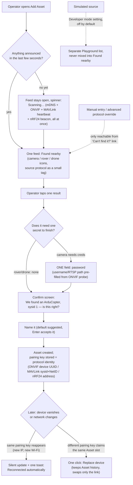

# Adoption UX research — making "add a device" trivial

Owner's complaint: in vision's asset wizard today, a user picks a **method tile** (discover /
listen / register-by-URI / simulate / none) separately for **sight** (video) and **sense**
(telemetry), then a protocol dropdown, then URI/port/sysid fields, then a handover step. That is
five decision points before a single bit of real network traffic has been looked at, and one of
the five choices is "pretend this exists" sitting at the same visual weight as "this is a real
camera on your LAN." This note surveys how six categories of shipping products collapse that to
near-zero typing, and proposes a flow for vision's three real device families.

Every claim below is sourced from a vendor doc, a project's own docs/GitHub, or a support article
(linked inline). Anything not tied to a source is marked **[inference]** — reasoning from the
sourced facts, not itself observed.

## 1. Comparison table

| Product | Device becomes visible via | What the user types | Steps to a working device | Re-pairing / replacement | Where sims/demos live |
|---|---|---|---|---|---|
| **UniFi Network/Protect** | L2 broadcast (device calls home with `set-inform`); appears in a **Pending Adoption** list. [Device Adoption](https://help.ui.com/hc/en-us/articles/360012622613-UniFi-Device-Adoption) | Nothing, or a name after adopting. Cross-subnet fallback needs one typed command: `set-inform http://<controller>:8080/inform` over SSH. [Remote Adoption (L3)](https://help.ui.com/hc/en-us/articles/204909754-Remote-Adoption-Layer-3), [L3 SSH guide](https://blog.linitx.com/how-to-guide-ubiquiti-unifi-l3-ssh-connection-and-adoption/) | 1 click ("Adopt") on same L2; controller pushes all config. Protect requires camera + controller on the *same* L2 — L3/cross-VLAN adoption is explicitly unsupported for Protect. [same article] | Re-adopt is the same one click; a factory-reset or new unit re-announces and reappears in the pending list under the same flow. | No simulated devices anywhere in the product; the adopt list only ever shows real hardware that announced itself. |
| **Home Assistant** | mDNS/Zeroconf, SSDP, DHCP, USB, Bluetooth, HomeKit — each triggers a `config_flow` discovery step (`async_step_zeroconf`, `async_step_dhcp`, …) and the device surfaces as a **Discovered** card on the Integrations page. [Config flow docs](https://developers.home-assistant.io/docs/core/integration/config_flow/), [Discovery quality-scale rule](https://developers.home-assistant.io/docs/core/integration-quality-scale/rules/discovery/) | Zero if no secret is needed; otherwise exactly the one missing value (PIN, password) on a single-question form. | 1 discovery event + 1 "Configure" click + (optionally) 1 credential field. | `unique_id` on the config entry means the same physical device is never added twice; if its IP changes (new DHCP lease), the entry updates itself silently. Explicit **reauth** flow (`async_step_reauth`) fires only when credentials go bad; explicit **reconfigure** flow lets the user change host/settings without deleting the entry. [reauth quality rule](https://developers.home-assistant.io/docs/core/integration-quality-scale/rules/reauthentication-flow/), [unique_id + DHCP update discussion](https://community.home-assistant.io/t/refining-automatic-config-entry-updating-via-device-discovery/731881) | A separate **Demo** integration ships dummy entities for every platform, installed like any other integration but never appears via discovery. [Demo integration](https://www.home-assistant.io/integrations/demo/); a public hosted instance exists purely for showing the UI. [demo.home-assistant.io](https://demo.home-assistant.io/) |
| **ESPHome dashboard** | mDNS advertisement from a device already running ESPHome firmware; shows an **Adopt** action. [mDNS component](https://esphome.io/components/mdns/) | Nothing for Wi-Fi-flashed devices; the dashboard negotiates a Noise encryption key handoff with Home Assistant automatically as of 2026.9. [encryption-key handoff PR](https://github.com/esphome/device-builder/pull/2496) | 1 click ("Adopt"); the dashboard mints/transfers the API key itself. | Re-adoption reuses the same mDNS name; work is ongoing to stop a re-adopt from minting a *competing* key that locks Home Assistant out. [key-lockout issue](https://github.com/esphome/device-builder/issues/2691) | N/A — no simulated devices in this product; every entry is a flashed board. |
| **Improv Wi-Fi + ESP Web Tools** | A brand-new, unconfigured ESP32 exposes an Improv BLE/serial service. [improv-wifi.com](https://www.improv-wifi.com/) | SSID + Wi-Fi password, typed once into the browser page over Web Bluetooth or Web Serial (Chrome/Edge). [Improv explainer](https://peyanski.com/esp-web-tools-and-improv-explained/) | Plug in over USB (or power on for BLE) → open one browser page → type the Wi-Fi password → device joins. No app install. [ESP Web Tools](https://esphome.github.io/esp-web-tools/) | Re-running Improv on the same board re-provisions it; it is the **step-0 for a factory-fresh board**, not a re-pair mechanism. | N/A |
| **Reolink / Eufy / Ring** | Camera prints a QR code that encodes its identity; the phone scans it. [Reolink QR setup](https://support.reolink.com/articles/900000518883-How-to-Add-Reolink-Devices-to-Reolink-App/), [Eufy QR location](https://support.eufy.com/s/article/eufySecurity-Device-QR-Code-Location-and-How-to-Scan-QR-Code) | Wi-Fi SSID + password (camera has no keyboard, so it re-displays a QR code on its own screen/beeps that the phone shows to the camera's lens to hand over credentials). [Reolink voice-prompt setup](https://support.reolink.com/articles/7983219944985-How-to-Initially-Set-up-Reolink-WiFi-Cameras-With-LAN-Port-and-Voice-Prompt/) | Scan → pick Wi-Fi → wait for camera-scans-phone handshake → name it. ~4 taps, 0 typed addresses. | Full re-add by rescanning the same QR code; no separate "replace" affordance surfaced in support docs. | N/A — consumer camera apps carry no simulation mode. |
| **Frigate NVR** | ONVIF probe: user gives host + credentials once, Frigate's wizard calls ONVIF `GetStreamUri`/profile enumeration and reports manufacturer/model/firmware/PTZ support + candidate RTSP URLs. [Camera setup wizard](https://docs.frigate.video/frigate/camera_setup/) | Host, username, password (still typed — Frigate does not auto-discover cameras on the LAN, only auto-inspects a given host). | Type host+creds once → wizard finds the stream → test → select → done. | Re-run the same probe if the camera's IP or creds change; nothing automatic. | No simulation objects; failure path is "use manual RTSP entry instead." |
| **Synology Surveillance Station** | "Quick Setup" search button scans the LAN for supported cameras. [Add Camera Wizard](https://kb.synology.com/en-us/Surveillance/tutorial/How_do_I_add_Synology_Camera) | Nothing to find it; username/password to authenticate to a selected result. | Open wizard → click Search → pick from list → enter creds → done. Manual fallback needs IP/port/brand/model typed by hand. | Re-search and re-pick; camera identity is re-derived from its response each time. | N/A |
| **Blue Iris** | "Find/Inspect" button probes a typed IP/DDNS + ONVIF port and auto-fills stream paths. [Find/Inspect](https://support.amcrest.com/hc/en-us/articles/360034354471-How-to-Add-a-Camera-Into-Blue-Iris) | IP/DDNS address, credentials — still typed; Find/Inspect only removes needing to know the *RTSP path*. | Type address+creds → click Find/Inspect → it fills stream details → OK. | Re-run Find/Inspect on address change. | N/A |
| **DJI Fly** | Not network discovery — a deliberate **linking ritual**: hold aircraft power 4s, it beeps and blinks; RC beeps twice and turns solid green when linked. [Aircraft Linking Guide](https://support.dji.com/help/content?customId=en-us03400006734&spaceId=34&re=US&lang=en) | Nothing typed; two physical button-holds are the "credential." | Power on aircraft → hold button → RC confirms → app shows the aircraft. | "Re-pair to Aircraft (Link)" menu item repeats the identical ritual; no data lost, since flight records live in-app tied to the aircraft's serial, not the link. | No simulator inside DJI Fly's real-aircraft flow; DJI's simulator is a separate product mode entirely (SIM), not reachable from the "connect aircraft" screen. **[inference from product structure, not directly sourced above]** |
| **Skydio** | Drone's own Wi-Fi AP; SSID/password sticker on the drone/battery bay. [Getting started, Skydio 2/2+](https://support.skydio.com/hc/en-us/articles/4407907235995-Getting-started-with-your-Skydio-2-2) | The drone's own printed Wi-Fi password, typed once — explicitly *not* via the phone's system Wi-Fi settings, only inside the app. | Power on → open app → enter printed Wi-Fi password → app connects. | Not detailed in the retrieved docs; presumed same as first pairing. | N/A |
| **QGroundControl** | `LinkManager` keeps a UDP port open for a MAVLink heartbeat and auto-connects to known device classes (Pixhawk USB, SiK radio, PX4Flow); a new `HEARTBEAT` creates a vehicle object keyed by **system id (sysid)**. [Communication Flow](https://docs.qgroundcontrol.com/master/en/qgc-dev-guide/communication_flow.html) | Nothing — there is no "register a vehicle" step at all; sysid *is* the identity (`MAV_SYS_ID` / `SYSID_THISMAV`). [Multi-Vehicle Flying](https://ardupilot.org/copter/docs/common-multi-vehicle-flying.html) | Plug in USB/radio → QGC auto-connects → vehicle appears named by its heartbeat. | A vehicle simply reappears when its link comes back; multiple vehicles need distinct sysids/radio NetIDs set once on the hardware, not in QGC. | Auto-connect toggles per link type (UDP/TCP/serial/Pixhawk/SiK) live in Settings, off the main Fly view — QGC has no simulated-vehicle entry in the connect UI itself; SITL is a separate developer workflow. **[inference: no doc found describing a "connect to SITL" UI affordance distinct from a normal UDP link]** |
| **Auterion Mission Control** | Same MAVLink heartbeat auto-connect as QGC; a **Pairing Manager** additionally associates ground/vehicle radio modules once, then future connections are automatic. [Connection manager](https://docs.auterion.com/vehicle-operation/auterion-mission-control/ui-breakdown/fly/connection-manager) | Nothing for USB/heartbeat vehicles; a one-time pairing action for advanced radios. | Plug in → green checkmark appears automatically. | Paired radios reconnect via one "Connect to Vehicle" icon in the status bar, not a re-add. | Not covered in retrieved docs. |

## 2. UX principles extracted

1. **Announce, don't ask.** The device should say "I exist" over whatever transport it has
   (L2 broadcast, mDNS, BLE, a MAVLink heartbeat) so the human never types an address to *find*
   it — only, at most, to *authenticate* to it. Proven by UniFi's pending-adoption list and QGC's
   heartbeat-driven auto-connect.
2. **One list, not a taxonomy of tiles.** Home Assistant's Integrations page shows one
   **Discovered** section regardless of whether the transport was mDNS, SSDP, DHCP, USB or
   Bluetooth — the user never chooses a discovery *method*, only reacts to a result.
3. **One question per screen.** GOV.UK's own design-notes rationale: low-confidence users find
   it easier, it degrades better on mobile, and it is what makes branching, error states and
   "save and come back later" tractable at all. [One thing per page](https://designnotes.blog.gov.uk/2015/07/03/one-thing-per-page/) Typeform's conversational
   form applies the identical idea to arbitrary forms, framed as "ask, listen, ask the next
   relevant thing" instead of a clipboard. [Typeform blog](https://www.typeform.com/blog/survey-school-1-forms-and-questions) GOV.UK's own caveat matters too: group only
   questions that truly belong together, and favor fewer pages for a form the *same* user fills
   out repeatedly, not a public one-off. [UK Parliament Design System](https://designsystem.parliament.uk/how-tos/designing-forms/)
4. **A stable ID is the contract, not the IP.** Home Assistant's `unique_id` on a config entry
   is what lets an address change (new DHCP lease) update the entry silently instead of creating
   a duplicate, and is what powers the explicit "ignore this discovery, I don't want it" option.
   [Config flow docs](https://developers.home-assistant.io/docs/core/integration/config_flow/)
5. **Confirm, don't configure.** Blue Iris's "Find/Inspect" and Frigate's ONVIF probe both do
   the same thing: try the protocol, fill in every field that answers, and show the human a
   result to accept rather than blanks to fill. Synology's camera-search wizard is the same
   pattern with zero typed network fields on the happy path.
6. **Zero typed network fields is achievable when the device can display a secret.** Reolink,
   Eufy and Ring push all identity + a Wi-Fi credential handoff through a QR code the phone
   scans and, in reverse, the camera reads off the phone screen — the *only* thing a human types
   is the Wi-Fi password, once.
7. **Recovery is a different, smaller flow than first-add — never a forced re-add.** Home
   Assistant's `reauth` step exists purely for "your credential went stale," and `reconfigure`
   purely for "the host/port changed"; both preserve the entity history and automations attached
   to the device. [reauthentication-flow rule](https://developers.home-assistant.io/docs/core/integration-quality-scale/rules/reauthentication-flow/)
8. **Protocol identity beats human-chosen identity.** QGC never asks anyone to "register a
   vehicle" — the MAVLink sysid from the heartbeat *is* the vehicle's identity, so a vehicle that
   drops off a radio link and comes back is trivially the same vehicle, no re-pairing UI needed
   at all.
9. **Physical proof-of-possession replaces typed secrets.** DJI Fly's linking ritual (hold both
   buttons within a timing window) and UniFi's L2-only adoption are both using "you are
   physically at/near the device" as the credential, which is why neither needs a typed
   password for the common case.
10. **Fallback ladder mirrors network reality, tried in order.** UniFi tries L2 adoption first
    and only exposes the SSH `set-inform` cross-subnet path when that fails — the harder,
    typed-command path is not shown up front. [L3 SSH guide](https://blog.linitx.com/how-to-guide-ubiquiti-unifi-l3-ssh-connection-and-adoption/)
11. **Simulated/demo objects live outside the discovery surface, or are architecturally distinct.**
    Home Assistant's Demo integration is a separate integration a user explicitly adds, and never
    surfaces in the discovered-devices flow; UniFi's adopt list has no simulation concept
    whatsoever; QGC's SITL is a developer workflow, not a menu item beside "connect a vehicle."
12. **Progressive disclosure keeps the default path to a couple of taps** while still leaving
    manual/advanced entry reachable one level down for the case discovery fails — Synology's
    "Quick Setup search" vs. its manual IP/port/brand form is the clearest example; QGC's
    per-link-type auto-connect toggles are one settings screen away from the Fly view, not on it.

## 3. Recommended flow for vision

The unifying move: collapse **method tile → protocol dropdown → URI/port/sysid fields → handover**
into **one discovered-sources feed → one confirm screen with at most one typed field → done**,
and make the *pairing key* (not the transport address) the thing vision remembers, so losing a
device or changing Wi-Fi is a re-discovery, not a re-registration.

### Case (i) — fresh ESP32 rover, nRF24 dongle plugged into the PC

1. **Screen: "Add Asset."** vision is already listening on the nRF24 dongle for a pairing
   beacon (a factory-fresh ESP32 broadcasts its chip id, the way an Improv-capable ESP32
   broadcasts over BLE/serial waiting for Wi-Fi credentials). Within seconds a card appears:
   *"New rover found — RVR-3F2A."* **One question:** none yet, just a tap.
2. **Screen: confirm + name.** *"This looks like a ground rover with an nRF24 radio. Name it?"*
   — a sensible default (`Rover 1`) is pre-filled so Enter alone completes the step. **One
   question:** the name field, skippable.
3. **Done.** vision stores the pairing key = the nRF24 radio address (+ a session token
   exchanged during first pairing, mirroring Improv's local-trust model). No IP, no port, no
   protocol dropdown was ever shown.
4. **Re-pair path.** If this exact rover's MCU is swapped for a new board (new radio address,
   same chassis/asset in the operator's head), the new board beacons under a *different*
   address. vision shows it as a new "Found nearby" card same as case 1, but offers **"Replace
   device on Rover 1"** as a one-click alternative to "Add as new," preserving the Asset's usage
   history — the human decision GOV.UK/Home Assistant would call a *reconfigure*, not a new add.
   If only the PC/dongle moves, nothing changes — the beacon is heard again and the same pairing
   key silently reconnects.

### Case (ii) — IP camera on the LAN

1. **Screen: "Add Asset."** vision's existing discovery adapter (ONVIF/mDNS/V4L2) is already
   scanning; the camera surfaces in the same "Found nearby" feed as the rover, tagged `camera`.
   **One question:** none — this is the same list as case (i), not a separate "camera wizard."
2. **Screen: confirm.** vision ONVIF-probes the selected result the way Frigate's wizard and
   Blue Iris's Find/Inspect do — manufacturer, model, and the working RTSP URI are filled in
   automatically. If the camera needs credentials, **one question:** password (username
   defaulted to `admin` or the ONVIF-reported default, editable).
3. **Screen: name it,** same default-prefilled pattern as case (i). Done.
4. **Re-pair path.** The pairing key is the ONVIF device UUID/serial the probe returned, not the
   IP. A DHCP lease change or a move to a new Wi-Fi network re-announces the same UUID; vision
   updates the stored host silently and shows a one-line toast (Home Assistant's
   `unique_id`-driven auto-update, applied here). Only a genuinely different physical camera
   claiming the same Asset slot triggers the explicit "Replace device" click.

### Case (iii) — ArduPilot drone over a USB telemetry radio

1. **Screen: "Add Asset."** vision opens the serial port the way QGC's `LinkManager` does and
   waits for a MAVLink heartbeat; no protocol/port typing. Radio plug-in alone produces:
   *"New vehicle found — ArduCopter, sysid 1."*
2. **Screen: confirm.** **One question:** none required — sysid + frame class + firmware version
   came from the heartbeat/autopilot version message, exactly as QGC never asks anyone to
   "register a vehicle." If the discovered sysid collides with an Asset vision already knows
   (e.g., a second radio pair reusing sysid 1 by mistake), the confirm screen becomes the one
   place a question appears: *"This looks like Rover 1's vehicle — same one, or a different
   aircraft?"*
3. **Screen: name it.** Same shared step as cases (i)/(ii).
4. **Re-pair path.** The pairing key is (sysid, radio NetID). Swapping the flight controller for
   a re-flashed unit with the same `SYSID_THISMAV` reconnects to the same Asset automatically —
   no user action. A genuinely new airframe with a fresh sysid appears as a new "Found nearby"
   card, with "Replace device" offered as before when the operator says it is the *same*
   physical asset under new electronics.

## 4. Where simulations go

**Recommendation: a Developer-mode setting, off by default, that reveals a separate "Playground"
entry point — not a tile in the same discovered-sources feed, and not a badge-only mix-in.**

Reasoning, grounded in the research above:

- Every product that nails the "add a device" flow (UniFi, DJI Fly's real-aircraft connect
  screen, Reolink/Eufy/Ring, QGC's Fly view) has **zero simulation concept in that specific
  screen** — the owner's exact complaint ("overwhelmed by the amount of different sources and
  simulations") is precisely what those products avoid by never putting a fake object next to a
  real discovery result.
- Home Assistant's Demo integration is the one counterexample that *does* offer simulated
  entities, and it does so by being a **separate integration a user deliberately searches for and
  adds** — never something the discovery scanner surfaces unprompted. That is architecturally a
  "badge-only mix-in inside the same list" and even HA does not do that; it keeps demo entities in
  their own integration entry.
- vision's own CLAUDE.md rule ("varies per deployment → config… root configuration applies to
  all modules") already implies the right mechanism: a config-gated `vision.simulation.enabled`
  switch (matching the existing `vision.training.enabled`-style flag pattern) that a real deployed
  station leaves off, and only a developer/demo box turns on.
- When it is on, simulated assets should still carry a persistent, impossible-to-miss
  **"Simulated" badge** everywhere the Asset appears (cockpit, map, inventory row) — not as the
  *sole* safeguard (a badge is easy to stop noticing after the tenth session, per general
  progressive-disclosure/attention research), but as a second layer under the primary safeguard
  of keeping it off the main "Found nearby" list entirely.

Net: **hide behind a developer switch AND keep it on a separate Playground surface when enabled**
— the two research-backed patterns (HA's separate-integration model, and every discovery-driven
product's total absence of sim from the adopt list) both point the same direction, so there's no
tension to resolve with badge-only compromise.

## Verified vs. inferred

Everything in section 1's table and section 2's principles is drawn directly from the linked
vendor docs, project docs, or support articles, except the two lines marked **[inference]** in
the table (DJI's simulator being a separate mode from the real-aircraft connect flow; QGC having
no distinct "connect to SITL" UI element) — reasoned from the absence of any such feature in the
retrieved documentation rather than a page that states it outright. Section 3 (the vision-specific
flow) and section 4 (the simulation placement recommendation) are original synthesis for this
project, built by applying the sourced principles to vision's three device families and its own
CLAUDE.md configuration rule — they are proposals, not observed facts about any external product.
