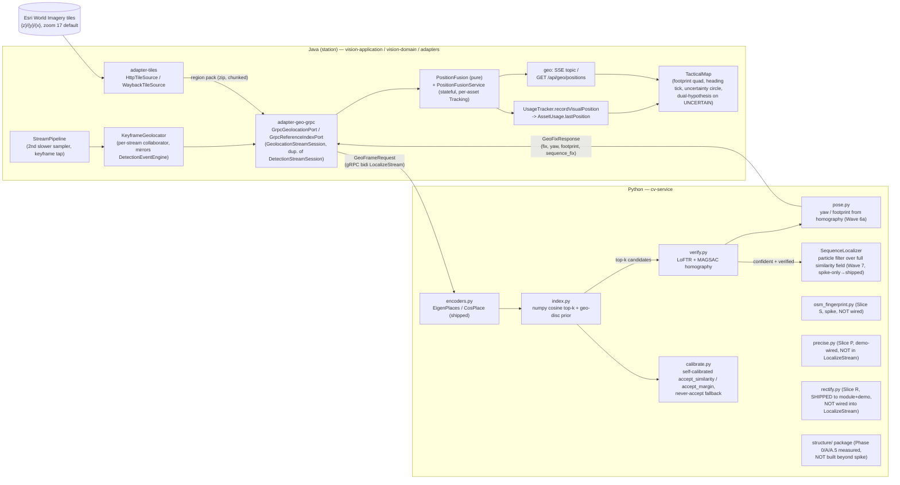

# Existing state — `feat/visual-geo` (parked branch), digest for a new literature review

Source of truth: `docs/VISUAL-GEO-PLAN.md` on branch `feat/visual-geo` (3221 lines, commit
`831a996d`, 19 commits ahead of its merge-base with `master`, `c4bb23d4`). This digest exists so a
follow-up research pass does not re-derive or re-measure anything already settled here. All section
references (`§n`) point at that plan document unless stated otherwise. The branch is **parked, not
merged** — none of what follows is live in `master`.

---

## 1. Architecture that was built

Three capability tiers, auto-detected from what data an asset has, all rendering on the one
`TacticalMap`:

| tier | asset has | position source |
|---|---|---|
| (a) | video + telemetry + onboard geo unit | GPS ⊕ onboard visual fix ⊕ server visual fix |
| (b) | video + telemetry | GPS ⊕ server visual fix |
| (c) | video only, no telemetry | server visual fix alone (+ dead reckoning) |

Server-side pipeline always runs when `vision.geo.enabled=true` (default false). Java never sees a
descriptor (D1) — cv-service owns the reference index on disk (~50k tiles × 512 float32 ≈ 100 MB),
Java sends pixels and telemetry, receives candidates/fixes only.

**Frozen wire contract (§3, appended to `proto/vision/v1/cv.proto`, not a new file — D9):**

| element | shape |
|---|---|
| `service Geolocation` | `LocalizeStream` (bidi stream, per-keyframe), `BuildReferenceIndex` (client-stream ingest), `ListRegions`, `DeleteRegion` |
| `GeoFrameRequest` | `stream_id`, `sequence`, `region_id` (`""`=search all READY regions), `TelemetrySnapshot` (all fields `optional`), `GeoPrior`, `request_verification` |
| `TelemetrySnapshot` | lat/lon/alt/heading/groundspeed + Wave 9 `gimbal_pitch_deg`/`gimbal_roll_deg` (0=nadir convention) |
| `GeoFixResponse` | `status` (`GeoFixStatus` enum: FIX/NO_FIX/LOW_TEXTURE/OUT_OF_REGION/NO_INDEX/ERROR), `candidates[]`, `fix`, `margin`, `confidence`, `radius_meters`, `verified`, `verification_match_count`, `verification_inlier_count`, `visual_tracking` (Wave 4 VO/DR blend input), `yaw_degrees`/`footprint` (Wave 6a, additive), `sequence_status`/`sequence_fix`/`sequence_spread_meters`/`sequence_update_count` (Wave 7, additive) |
| `Telemetry.extra` (Java domain, §3.2) | 5 new frozen keys, onboard tier (a), consumed Wave 5 |
| SSE | new topic `geo:<assetId>`, 7th `LiveTopicKind` |
| REST | `/api/geo/*`, absent entirely when `vision.geo.enabled=false` |
| persistence | new geo-fix/region tables, additive, not gated on `vision.persistence.enabled` being the only mode |

**Fusion state machine (§4, `PositionFusion` — pure/hand-fake-testable, `PositionFusionService` —
stateful orchestrator, one `Tracking` per `AssetId`):**

| condition | `source` | position | uncertainty |
|---|---|---|---|
| GPS fresh, no visual | `GPS` | GPS | GPS radius (10 m default) |
| GPS+visual fresh, separation ≤ divergence-meters | `FUSED` | inverse-variance weighted mean | `1/sqrt(1/rg²+1/rv²)` |
| GPS+visual fresh, separation > divergence-meters | `UNCERTAIN` | **GPS incumbent** (D6 — never silently switch) | max(rg,rv) |
| visual fresh, no GPS | `VISUAL` | visual | visual radius |
| neither fresh, age ≤ dead-reckoning-max | `DEAD_RECKONED` | propagated (VO+telemetry inverse-variance blend, revised post-§12.5) | grows |
| older / never had a fix | nothing published | — | — |

Bootstrap gate: N-consecutive (`bootstrap-frames`, default 3) `GEO_FIX`es agreeing within
`bootstrap-agreement-meters` before any fix is trusted. Divergence entering `UNCERTAIN` fires exactly
one `POSITION_UNCERTAIN` event, new `AttentionReasonKind 'position-uncertain'` at `REASON_RANK` 3.

**Java vs Python split of authority (§4's own framing):** Python answers "is this frame confidently
matched to the index?" (self-calibrated `accept_similarity`/`accept_margin`, never-accept fallback);
Java answers "do I believe the aircraft is there?" (track/bootstrap/divergence gates).

**New modules built:**

| module | role | status at branch tip |
|---|---|---|
| `adapters/adapter-geo-grpc` | gRPC client: `GrpcGeolocationPort`/`GrpcReferenceIndexPort`, duplicates (not imports, D3) `adapter-cv-grpc`'s session/codec state machine | built, 51/51 tests green, **not wired into vision-app** |
| `adapters/adapter-tiles` | HTTP raster tile fetch: `HttpTileSource` (Esri, `{z}/{y}/{x}`), Wave 11 `WaybackTileSource` (multi-date occlusion-aware) | `HttpTileSource` wired (Wave 2c); `WaybackTileSource` built+tested, **not wired** |
| `cv_service/geo/*` (encoders, index, verify, pose, calibrate, rectify, precise, osm_fingerprint, structure/) | retrieval + verification + pose + calibration + rectification + precise mode + semantic + structural spikes | mixed — see §6 below |
| `vision-application` `KeyframeGeolocator`, `PositionFusion(Service)`, `TileGrid` | second sampler, fusion state machine | built through Wave 4/6/7 per commits |
| `vision-web` position UI, footprint/heading rendering, region management, sequence-status chip | Waves 3e/4c/6c/7c | built |

Full RPC/message inventory lives in `proto/vision/v1/cv.proto` (section "Visual geolocation") on
this branch — `TelemetrySnapshot`, `GeoPoint`, `GeoPrior`, `GeoFrameRequest`, `VisualTrackingEstimate`,
`GeoFixStatus`, `GeoSequenceStatus`, `GeoCandidate`, `GeoFixResponse`, `ReferencePackChunk`,
`ReferenceIndexStats`, `ReferenceIndexProgress`, `RegionRef`/`RegionInfo`/`RegionList`,
`service Geolocation`.

---

## 2. Every algorithm/encoder/matcher evaluated — measured numbers and verdict

All numbers below are the branch's own measurements (never "literature numbers" unless explicitly
marked). Sections are `docs/VISUAL-GEO-PLAN.md` references.

### Retrieval encoders (VPR, image → 512-D descriptor, cosine top-k)

| Method | Setting | Metric | Result | Verdict | Section |
|---|---|---|---|---|---|
| EigenPlaces (ResNet18, 512-D) | AU-AIR real footage, zoom 17, 160-frame sample | Recall@1≤100m (region/prior) | 0.525/0.550, median 43m, false-fix 0.000 | best real result so far; still NO GO alone | §12.1 |
| CosPlace (ResNet18, 512-D) | same | Recall@1 | 0.344/0.362, median 138m, false-fix 0.011–0.019 | trails EigenPlaces, NO GO | §12.1 |
| Offline `DeterministicEncoder` (non-learned sanity floor) | same | Recall@1 | 0.000, false-fix 0.069–0.103 | confirms trained encoders do real work | §12.1 |
| EigenPlaces/CosPlace | SITL nadir vs oblique (analytical circle) | Recall@1 | nadir 0.487/0.487; oblique 0.789/0.592 | NO GO both | §12.2 |
| EigenPlaces/CosPlace | SITL lawnmower (wider coverage) | Recall@1 | 0.239–0.296 | tight-circle result was the *easy* case, not pessimistic | §12.2 |
| EigenPlaces/CosPlace | zoom {16,17,18} × augmentation sweep, AU-AIR | Recall@1 / false-fix | zoom16: 0.000 recall, **0.75–0.96 false-fix** (dangerous); zoom17 plain: 0.525/0.000 (best); zoom18+aug: ~0.53 but worse false-fix | zoom17 plain ≈ local optimum; zoom16 fails *dangerously*, not gracefully | §12.3 |
| Sample4Geo (ConvNeXt-B, 92.65% lit. R@1 on Univ-1652) | real bake-off, AU-AIR | Recall@1 | **0.000** (checked for a loading bug, confirmed genuine) | domain-transfer failure; also unlicensed code | §12.9 |
| DINOv2-plain (CLS token) | real bake-off | Recall@1 | 0.050 | fallback, not real AnyLoc | §12.9 |
| AnyLoc-vits14 (real VLAD, self-fitted vocab, BSD-3) | real bake-off + follow-up 76-image refit | Recall@1 | 0.025 (worst of 4); refit 0.050 | closed thread — did not help; `vitg14`+curated vocab still untested (disk-gated) | §12.8→§12.9 |
| Literature corroboration (2024 aerial-VPR survey, VPAir) | not our data | R@1 | CosPlace 4.3%, EigenPlaces 7.1%, AnyLoc (training-free DINOv2) 21.7% | encoder family ceiling is architectural, not tuning | §12.8 |

### Retrieval encoder candidates surveyed but not run (literature only, §12.8)

| Candidate | Univ-1652 Drone→Sat R@1 | License | Verdict |
|---|---|---|---|
| LPN (ring-partition, structurally rotation-invariant) | 75.93% | MIT | angle-robust but no weights, train from scratch |
| FSRA (ViT attention clustering) | 85.50% | none (no LICENSE) | weights link resolves to generic ImageNet init, not real checkpoint (§12.9 correction) |
| SDPL (2024, LPN follow-up) | 85.25% | none | unofficial repos only |
| Sample4Geo | 92.65% (lit.) / 0.000 (measured) | none | see above |
| Game4Loc / GTA-UAV (AAAI 2025) | UAV-VisLoc R@1 24.9%→80.2% after fine-tune on ~6.7k images | Apache-2.0 (checkpoints too) | the concrete training path, not yet executed |

### Geometric verification / matchers

| Method | Setting | Metric | Result | Verdict | Section |
|---|---|---|---|---|---|
| LoFTR (kornia) | Kyiv near-nadir Google Maps crops (n=4) | mean error | 284.8m→**69.7m**, backed by 100–273 matches | large real win near-nadir | §12.6 |
| LoFTR | AU-AIR real oblique-ish frames (n=32, pitch 1.4–16°) | mean error / recall@1 | 101.7m→188.6m / 0.66→0.47, backed by only 4–14 matches | **actively harmful** — noise, not confirmation | §12.6 |
| LoFTR, match-count-gated (≥12) | same AU-AIR set | mean error | 101.7m→**93.7m** at identical recall | shipped default `shouldVerify` policy | §12.7 |
| Angle-aware gating (pitch as proxy) | correlation check | corr(pitch, match_count)=−0.03; corr(pitch, Δerr)=−0.34 (wrong sign) | rejected — explicitly tested and ruled out | §12.7 |
| MAGSAC RANSAC inlier count vs raw match count as gate | homography-pose spike (186+142 queries) | precision at high end | inliers: precision 1.0 @≥8 (recall 0.81); match count: 0.83 precision @ same point | inliers strictly better at the high-precision end — shipped gate | §12.11 |
| DISK+LightGlue | real bake-off, both test sets | ms/pair, AU-AIR verified error/recall | 1056–1718ms (not 40× faster as literature claimed — GPU-measured number), 517.4m→558.4m/0.175→0.10 | loses to LoFTR, license clean but no help | §12.9 |
| EfficientLoFTR | real bake-off | ms/pair | 4453ms (**slower** than LoFTR's 1457ms on this CPU box, contra literature's 2.5× claim) | disqualified | §12.9 |
| tiny_roma_v1 | real bake-off | AU-AIR error/recall | 517.4m→611.7m/0.175→0.025 | worst of 4, fastest | §12.9 |
| RoMa v1 full (MIT+DINOv2 Apache-2.0) | cost measurement | wall-clock | **86,000–115,000 ms/pair** (40–60× LoFTR) | disqualified on cost alone before accuracy even asked | §12.9 |
| RoMa (Slice P "precise mode") | Chavdar phone photos, AU-AIR sanity, homogeneous-fields negative control | consensus outcome | NO_FIX on Chavdar (certainty maxes 0.156–0.280, refutes "slow-path RoMa fixes the almost-band" hypothesis); AU-AIR true tile refined to 6.7m but footprint-sanity-refused; fields correctly NO_FIX | engine/honesty machinery works; **adds no capability over shipped stack on any of 3 testbeds** | §13.2 Slice P |

### Homography pose (position + yaw + footprint from LoFTR correspondences, no camera intrinsics needed — Wave 6a)

| Test | Metric | Result | Section |
|---|---|---|---|
| SITL-nadir telemetry-normalized (142 queries) | median error, tile-center→refined | 92.5m→**5.9m**; under production gate (inliers≥8+sanity): 34 accepted, median **4.8m**, worst 15.4m | §12.11 |
| gmaps (n=2 passing gate) | error | 64.0→32.4m | §12.11 |
| yaw formula | median error | gmaps 0.4°, SITL-nadir-normalized 0.48° | §12.11 |
| **Load-bearing discovery** | LoFTR collapse mode | combined rotation(~90°)+scale(~4.3×) mismatch collapses matches to ~8; de-rotation alone fails, rescaling alone fails, **both together → 88–94 matches at ~100% inliers**; also cuts LoFTR cost 1.9s→0.53s (3.6×) | retroactively explains §12.2's SITL NO-GO as rotation/scale mismatch, not encoder blindness | §12.11 |
| oblique SITL (similarity-conditioning only) | error/yaw | ~450m/42° | still broken — needs perspective rectification | §12.11 |

### Perspective rectification (Slice R, IPM warp from telemetry/EXIF geometry)

| Test | Result | Section |
|---|---|---|
| SITL-oblique (71 frames, pitch 45°) unrectified | 7 matches/4 inliers median, 538m error, 0/71 pass gate | §13.4 |
| SITL-oblique rectified (IPM + telemetry priors) | **156 matches/129 inliers median, 3.8m median look-at error, 0.15° yaw, 43/71 pass gate**, zero false accepts | closes the §12.11 oblique blocker for telemetry-equipped drones | §13.4 |
| Real Chavdar phone photos, manual pitch sweep | matches 7→14, GT tile becomes leader in most combos, but **inliers plateau at 5**, below every floor | rectification helps ranking, does not clear the domain gap | §13.4 |

### Semantic / OSM fingerprints (Slice S, tier 2)

| Test | Metric | Result | Section |
|---|---|---|---|
| §12.13's 14 recorded wrong-top-1 alias pairs, GT-fingerprint upper bound | separation | 11/14 separated, only 6/14 clear a 0.05 margin; re-rank fixes 8/14 wrong cases | weak multiplicative prior, not a gate; `btn-road-x` has **zero** mapped OSM highways (structurally empty there) | §13.2 |

### Line/edge/structural matching (`structure/` package, Wave 13.7/13.8)

| Phase | Test | Result | Section |
|---|---|---|---|
| Phase 0 (LSD eyeball) | Chavdar photo vs true tile vs Maidan tile | drone photo: 194 long segments; homogeneous parking-lot tile: 33; Maidan built-up tile: many segments but heavily fragmented (median 8.8px — z17 imagery is ~0.6m/px, a 20m edge only spans ~33px) | confirms structure exists on built tiles, absent on homogeneous ones | §13.8 |
| Phase A (Canny+LSD fingerprint, rank fusion) | Maidan (12 frames), Chavdar (2 photos), sanity | structural-alone and rank-fusion **both WORSE** than embedding alone on both real hard cases (Maidan rank 30→42 fused; Chavdar 33→110 fused) | **honest negative — Phase B (SOLD2) NOT justified** | §13.8 |
| Phase A.5 (rectified re-test, controlled) | same, but with IPM rectification applied to both channels fairly | Maidan: embedding-rectified 14.0 beats structural-rectified 30.0 and combined 23.5; Chavdar: rectification made embedding **worse** (33→72) | confirms Phase A verdict for a different, correct reason (first 3-frame spot-check was methodologically flawed) | §13.8 |

### Sequence localizer (particle filter, tier "fields/plains", Wave 7)

| Test | Metric | Result | Section |
|---|---|---|---|
| PF spike, 4 real danger-region builds, 3 seeds × 21 region-trajectory cells | convergence / error / false-convergence | **63/63 converged**, median error at convergence 14–117m (≤ tile-step 196m), 4–13 steps to converge, **0 confident-wrong out of 1,289 CONVERGED steps** vs. ungated single-frame argmax right only 46–82% | GATE PASSED decisively — production slice shipped | §13.6 |
| Negative controls (cross-region replay) | — | never converged | correct behavior | §13.6 |
| **Real external drone video (Pexels, no telemetry, oblique, unrelated footage)** | — | **FALSE CONVERGENCE**: filter converged at update 7 and stayed converged on the SAME wrong tile (771–773m off) the single-frame path correctly refused the whole run | **real, new safety gap** — first genuinely out-of-sample test; every prior PF eval used same-source crops | §12.14 |

### Prior-art / commercial systems referenced as accuracy comparables (not run by this branch)

| System | Reported number | Note | Section |
|---|---|---|---|
| Theseus (YC, tested by US SOCOM) | 51.95m median over 550km | continuous VIO primary + periodic map correction, the architecture pattern this plan later adopted for DEAD_RECKONED | §12.4 |
| Palantir VNav | ~7m over 2.7km | same pattern | §12.4 |
| Vantor Raptor | ~1m claimed | same pattern | §12.4 |
| Goforth & Lucey | <8m error / 850m flight | homography-pose literature comparable | §12.10 |
| Kinnari et al. (LSVL / "lost-in-the-woods") | 17.9–51m RMS with yaw in particle state; separately 12.6–18.7m converged over fields/forest | direct precedent for the PF sequence localizer | §12.10, §13.6 |
| Game4Loc / GTA-UAV fine-tune | UAV-VisLoc R@1 24.9%→80.2%, Dis@1 1689m→123m | the concrete Wave-8 training path | §12.10 |

---

## 3. Datasets/fixtures used and their limits

| Dataset/fixture | What it is | Used for | Named limits |
|---|---|---|---|
| **AU-AIR** (arXiv 2001.11737, Aarhus Univ.) | Real Parrot Bebop 2 traffic-surveillance footage, 32,823 frames / 8 flights, alt 3–30m, pitch 45–90°, real GPS/attitude | primary "best real evidence" tier, §12.1–§12.9, §13.8 | **CC BY-NC-SA — non-commercial**, used only for internal feasibility, never redistributed/trained on; single small area (~36 tiles), oblique-heavy, not the user's own airframe/region; mostly slow traffic-watching hover, not cruise flight (§12.4 VIO window is "modest-speed, not high-speed") |
| SITL analytical circle/lawnmower tracks (`analytical_circle_telemetry.py`) | Closed-form ArduCopter CIRCLE-mode trace around a real armed/flying SITL home point (live telemetry capture itself failed — root cause unresolved, `infra/sitl/README.md`) | secondary/superseded evidence, §12.2 | position trace is **computed, not captured**; tight-circle pattern proved to be the *easy* case, not pessimistic |
| Kyiv Independence Square (Maidan) Esri tiles + Google Maps screenshots | Real cross-*source* nadir query set (n=4, manually navigated coordinates) | LoFTR Test 1 (§12.6), demo region `kyiv-maidan` | region's own tile grid sits ~201m off the true landmark (a hardcoded Wave-0-spike cache artifact, discovered §12.15); a geocoded re-centered rebuild self-calibrated to **never-accept** (harder to calibrate near the monument's own homogeneous plaza) |
| `boryspil-fields` / `kyiv-nw-forest` (real Esri, homogeneous terrain) | Purpose-built 7×7 zoom-17 regions over bare fields / unbroken forest | §12.12 homogeneous-terrain safety test | queries are perturbed crops of the *same* source imagery — refusal conclusion is a fortiori, recall numbers are not real-world performance claims |
| `btn-road-x` / `vas-road` (real Esri, semi-structured farmland+roads) | Purpose-built regions over field/road boundaries | §12.13 — found the two real shipped-code gaps | same-source perturbed-crop queries; false-positive *rates* need re-measurement on real footage |
| `kyiv-pozniaky` (252→227 tiles) + 2 real phone photos (Chavdar 38b) | First real non-synthetic user-supplied query photos, Pixel 9 Pro XL | §12.11 addendum, §13.4, §13.8 Phase 0/A | **ground-truth coordinate was wrong by 438m** for a full session (found and corrected §12.13 addendum; every downstream finding was re-verified against the corrected tile); Pixel has EXIF focal but zero gravity/heading metadata — the "Android without metadata" case stays unverified |
| Real Pexels drone video (id 14615723, Maidan, unrelated/external, no telemetry) | 12 frames @1fps through the live `LocalizeStream` wire | §12.14/§12.15 — first genuinely out-of-sample test | single external non-owned clip; ground truth from OSM Nominatim; every prior sequence-localizer eval had been same-source crops until this |

**No dataset is the user's own real FPV footage** — that remains the plan's own repeatedly-stated
decisive missing input (§12.1's opening line, §12.5's closing "remaining open paths").

---

## 4. Failure analysis — why ranking fails, and the root cause the plan itself lands on

- **Not primarily viewing angle.** §12.6/§12.7 directly falsified "oblique angle causes failure":
  AU-AIR frames are 1.4–16° pitch (near-nadir-ish), yet retrieval/verification still failed there
  while nadir-ish Google Maps crops succeeded; `corr(|pitch|, match_count) ≈ 0`.
- **The real driver is sensor/domain gap**, restated four independent times across the plan
  (§12.6 closing, §12.11 addendum, Slice P's RoMa negative, §12.14): a real camera frame
  (compression, motion blur, rolling shutter, consumer lens, arbitrary lighting/season) vs. a
  professionally-orthorectified satellite tile is a bigger gap than cross-*vendor* nadir-vs-nadir
  (Google Maps vs. Esri — both clean orthophotos — worked fine, §12.6 Test 1).
- **Terrain homogeneity fails safely, not dangerously**, when handled correctly: §12.12 measured
  zero false fixes in 72 queries over fields/forest — self-calibration correctly emits
  never-accept, the pre-encode texture gate (Laplacian floor) catches most of it before encoding.
- **The dangerous failure mode is a repeated-texture *alias*, not raw ambiguity**: §12.13 found
  along-linear-feature (windbreaks, field roads, tree lines) false fixes that PASS both defense
  layers — a one-tile diagonal slide (√2 tile step ≈ 278m) with well-spread inliers and believable
  yaw, which no geometric sanity flag catches by construction. This is a genuinely different and
  worse failure class than homogeneity, and it is what led to the two shipped code fixes (§12.13
  Gap #1/#2).
- **Scale**: zoom is a floor, not a tuning knob — zoom 16 (~400m tiles) doesn't degrade gracefully,
  it produces **0.75–0.96 false-fix rate** (§12.3). Zoom 17 (§9's default) was already close to the
  index-tuning optimum; augmentation and zoom 18 don't clear a ~0.55 recall ceiling.
- **Rotation+scale mismatch, not encoder blindness, explains most of the original SITL NO-GO**:
  §12.11's load-bearing discovery — LoFTR collapses under combined large in-plane rotation (~90°)
  and GSD mismatch (~4.3×) alone, but both correcting together (telemetry heading + altitude
  priors) recovers 88–94 matches from ~8. This retroactively reframes §12.2's SITL failure.
- **False convergence is the newest, unresolved gap (§12.14)**: a sequence localizer's posterior
  spread can collapse confidently on a *systematically*, not randomly, wrong measurement source
  (a domain-gap-biased similarity field), which convergence-by-spread alone cannot distinguish from
  a correct one. No fix designed yet, flagged for explicit user decision.
- **"One real lead" (§12.15's third bullet)**: feeding RoMa the IPM-rectified frame using the
  blind-angle-probe's own best-scoring geometry (pitch=70°/alt=60m/heading=135°) turned a
  degenerate 11 m² non-convex fit (no rectification, 668 raw matches) into a **77-inlier,
  480 m² plausible footprint — one sanity flag away from a clean pass** — on the same near-correct
  tile that produced honest single-frame refusal. This is real but fragile: two *other* plausible
  geometries on the same tile collapsed to zero matches, and the result was hand-evaluated on one
  tile/frame, not systematically swept. Flagged explicitly as "not shippable as-is... a future
  Wave 10c or similar," needing a systematic sweep optimizing for RoMa+rectification footprint
  quality (not embedding similarity, which is what the angle probe currently optimizes).

---

## 5. Already-surveyed prior art — skip or go deeper, don't re-survey from scratch

Every citation below was verified by the branch against its actual LICENSE file / GitHub API field
(not README claims or paper text) — a discipline repeated explicitly at §12.1, §12.8, §12.9, §13.1.

**§12.4 — commercial/deployed systems + verification algorithms + cross-view checkpoints:**
Theseus, Palantir VNav, Vantor Raptor (accuracy comparables); LoFTR (kornia, permissive — chosen
over LightGlue+SuperPoint because SuperPoint's pretrained weights are Magic Leap
non-commercial-research-only); LightGlue (Apache-2.0); hloc (ETH Zurich, retrieval→matching
funnel); Sample4Geo (checkpoints exist, code unlicensed).

**§12.8 — retrieval encoder survey:** LPN, FSRA, SDPL, Sample4Geo (table above); SUES-200,
DenseUAV, University-1652, VPAir (benchmarks, with license verdicts: SUES-200 dataset "academic
only" despite MIT code, VPAir "academic use only", University-1652 synthetic not real photos);
matching candidates RoMa v1, LightGlue+DISK/ALIKED, EfficientLoFTR, DKM, MASt3R/DUSt3R (MASt3R
ruled out, CC BY-NC-SA).

**§12.10 — camera pose/VO/VIO/training synthesis:** pose-from-matches literature (Goforth & Lucey,
Kinnari et al., an ICIPMM 2024 paper implementing near-identical LoFTR→tile→homography→lat/lon);
license-clean pose primitives OpenCV, cameratransform (MIT), PoseLib (BSD-3), pymap3d (BSD-2);
OpenDroneMap (AGPL, reference only). VO/VIO systems surveyed and all ruled out for this box:
ORB-SLAM3/VINS-Mono/Fusion/OpenVINS/SVO-Pro/DSO/DM-VIO/pySLAM (all GPL-3.0), DPVO/DROID-SLAM
(need CUDA), Basalt (needs stereo+IMU). Training path: Game4Loc/GTA-UAV (AAAI 2025, Apache-2.0)
as Sample4Geo's licensed-recipe successor; dataset license sweep (DenseUAV only clean real one).

**§13.1 — field reality checks (broadest single survey pass):** AnyVisLoc (2025 benchmark, our
exact configuration — 18.5% @5m against satellite reference vs 74.1% against photogrammetry —
winning strategy already matches our shipped architecture); the BEV/OrienterNet family
(license-dead at every node except Statewide-visual-geolocalization MIT, CAMP MIT); SfM/3DGS
reconstruct-then-render for drone video (Kinnari-style, CPU-honest); ISPRS 2024 orthorectification
result (43–64% error reduction, direct precedent for Slice R); EXIF/gravity/gimbal metadata
sources; GeoCalib (Apache-2.0 code, CC-BY-4.0 weights, unvalidated on aerial), Perspective Fields
(Adobe NC, ruled out), DeepCalib (no license, ruled out), AnyCalib (Apache-2.0); depth-based
reprojection candidates (Depth-Anything-V2-Small/DA3-SMALL Apache-2.0 only clean variants);
GeoCLIP (MIT, only clean global-geolocation model — oblast-scale granularity, sanity gate only),
PIGEON (weights withheld), StreetCLIP (NC).

**§13.6 — fields/plains accuracy synthesis:** Kinnari et al. LSVL line of work (the direct
precedent for the shipped particle filter), MIT SIVL (same shape); Sentinel-2 parcel/crop-mosaic
fingerprints (unclaimed niche, not pursued); TERCOM-style terrain-contour matching (ruled out,
Ukrainian plains have no relief).

**§13.7 — line/edge/structural matching:** CAEVL (arXiv 2512.02737, Dec 2025 — closest direct hit
on the user's own "decolorize + extract structure" framing, no code repo exists, a recipe to
reimplement); Li & Yang MDPI Remote Sensing 16(3):482 2024 (road-network alignment, literal match
to "align roads/lines" — abstract-only verified, full methodology NOT independently read, flagged
as an open item); SOLD2 (MIT, line detection+description across viewpoints); HAWP (MIT, wireframe
parsing — line segments + junctions); a 2024 cross-view geo-localization survey (arXiv 2406.09722)
confirming line/edge representations are a genuine but under-explored niche, not a mature
alternative.

---

## 6. Open leads / designed-but-not-built items

| item | status | where |
|---|---|---|
| FC feedback TX (`VISION_POSITION_ESTIMATE`) | explicit non-goal, own future plan, gated like command-TX | §0, §11 |
| Multi-region seam-crossing | designed for, not built | §11 |
| Re-training the VPR encoder from harvested `GeoLabel`s | labels collected Wave 4, **no exporter exists yet** | §11 |
| Reference packs shipped to the aircraft | designed for, not built | §11 |
| Replaying a fused track on `ReplayMap` | designed for, not built | §11 |
| **Java `PositionFusion.gate()` consulting `verified`/inlier evidence (fix #3)** | **deliberately closed as won't-fix-for-now (2026-08-08)** — every measured leak entered through the two Python gaps, both closed; the remaining case (retrieval-accepted fix whose verification ran and failed) is §12.7's own designed behavior, not a leak. Revisit only with new real-footage evidence of a leak, and the right shape then is radius-inflation weighting, not a binary gate | §12.13 |
| `WaybackTileSource` (Wave 11, multi-date occlusion-aware tile selection) | built + tested, **not wired** into `GeoWiring#referenceTileSourcePort`; a `vision.geo.tiles.wayback-multi-date` opt-in flag was considered and deliberately deferred | `adapters/adapter-tiles/MODULE.md` Status |
| Slice R (IPM rectification) production wiring | shipped to module + demo, measured, **`LocalizeStream` wiring deliberately deferred** (needs the gimbal-pitch wire field, which itself landed in Wave 9) | §13.4 |
| Slice S (OSM semantic fingerprints) | spike measured, module built, **not wired** anywhere | §13.2 |
| Slice P (precise mode / full RoMa) | built + measured, **demo-wired only, not in `LocalizeStream`** | §13.2 |
| `structure/` package (Phase B: SOLD2 descriptor matching + junction-pose) | **NOT justified by Phase A/A.5 evidence** — architecture designed (frozen package layout §13.8), Phase 0/A/A.5 measured honest negatives | §13.8 |
| Sequence-localizer false-convergence gate | real safety gap found (§12.14), **candidate fixes listed but none designed/built**: gate CONVERGED on the converged cell's own single-frame calibration, a minimum-diversity check across frames, or a standing regression case using the same real video | §12.14 |
| RoMa+rectification "one real lead" (§12.15) | not shippable as-is; needs a systematic sweep of geometry hypotheses optimizing footprint quality, not embedding similarity | §12.15 |
| Precompute items 3–5/7 (`§13.3`, XFeat+LighterGlue detector precompute, EfficientLoFTR official impl re-measure, oblique synthetic anchors, fp16/FAISS scaling) | designed, gated on bake-offs, **untouched** — only items 1+2+6 shipped as Slice A | §13.3 |
| Wave 8 fine-tuning (Game4Loc trainer on own captures) | designed, needs GPU + real footage volume, **not started** | §12.10, §13.5 |
| Optional intrinsics enrichment (MAVLink `CAMERA_INFORMATION` → real per-asset FOV) | designed, orthogonal, near-zero cost, **not built** | §12.10 |

---

## 7. What is reusable, concretely

### (a) A light onboard tier (tier-a onboard visual fix, low-compute/embedded-leaning)

- `proto/vision/v1/cv.proto`'s `TelemetrySnapshot.gimbal_pitch_deg`/`gimbal_roll_deg` fields and
  the frozen `Telemetry.extra` keys (§3.2) are the wire contract an onboard unit would populate —
  already frozen, nothing to renegotiate.
- The homography-pose math itself (`cv_service/geo/pose.py`, needs no camera intrinsics for
  position/yaw/footprint — only altitude/tilt extras need intrinsics) is CPU-cheap (+0.5–0.8ms on
  top of a LoFTR pass, §12.11) and license-clean (OpenCV Apache-2.0) — a candidate to port onto a
  lighter on-device path if a light matcher (LightGlue+DISK/ALIKED, ~50ms/pair *claimed*, though
  §12.9 measured it at 1056–1718ms on this CPU box — re-measure on real embedded hardware before
  trusting either number) is chosen instead of LoFTR.
- Slice R's `rectify.py` (metadata-first geometry: EXIF focal, iPhone gravity/DJI gimbal, MAVLink
  attitude → IPM warp) is pure `cv2`/`numpy`/stdlib, no torch — the cheapest, most "onboard-shaped"
  piece of the whole stack, already measured to convert 0/71→43/71 pass rate on SITL-oblique.
- `GeoProjection.destinationPoint` (made `public`, Wave 1) is the existing dead-reckoning primitive
  any light tier would reuse for gap-filling between fixes.
- Precompute items 1+2+6 (Slice A: persisted leave-one-out distinctiveness, cached verify-ready
  tensors, fp16 descriptors) are pure engineering wins with zero model risk, portable to any
  deployment tier.

### (b) A heavy server tier (ground-station-class compute, the "precise/slow path")

- `cv_service/geo/precise.py` (Slice P) — the full RoMa loop (MIT) + cross-root consensus
  (CONFIRMED/PROBABLE/NO_FIX), fully built, unit-tested (18 tests), demo-wired; the honesty
  machinery (sanity + consensus, never trusting dense-match-count alone) is the reusable part even
  though RoMa itself hasn't beaten the shipped stack on any real testbed yet.
- `cv_service/geo/osm_fingerprint.py` (Slice S) — pure-stdlib OSM Overpass fingerprint math (road
  orientation histogram, junction/building counts, water/landuse fractions), 28 unit tests; weak
  alone but the one lever proven to specifically counter along-road aliasing (§12.13's danger
  class) where OSM coverage exists.
- `cv_service/geo/structure/` package (types/extract/fingerprint, Phase A) — real, tested code
  (31 unit tests) even though the fingerprint itself is a measured honest negative; the extractor
  primitives (Canny+LSD line/junction extraction) are reusable independent of the failed
  fingerprint design, and the frozen package layout (`extract.py`/`match.py`/`pose.py`/`store.py`
  /`fusion.py`) is a ready blueprint if SOLD2/HAWP descriptor matching (Phase B) is ever attempted.
- `SequenceLocalizer` particle filter (Wave 7, `§13.6`) — the one component with a clean, decisive
  GATE PASSED result (63/63 converged, 0 confident-wrong) for the exact "fields and plain
  districts" problem a heavy server tier would own; ships with a known, unresolved safety gap
  (§12.14 false convergence) that must be closed before trusting it on out-of-sample footage.
- `WaybackTileSource` (Wave 11) — multi-date Esri Wayback capture selection by occlusion score,
  fully built and tested, for whenever seasonal/occlusion tile mismatch becomes the active
  bottleneck instead of the appearance-domain gap that dominates today's failures.
- Region-ingestion pipeline (`adapter-tiles` + `adapter-geo-grpc`'s `BuildReferenceIndex` bidi
  stream, `cv_service/geo/calibrate.py`'s self-calibration + never-accept fallback) — a
  server-side-only concern by design (D1: descriptors never leave cv-service), directly reusable
  for any new region regardless of which tier consumes it.

---

## 8. Caveats about this digest itself

- `cv-service/spikes/geo/results/**` is **git-ignored** (per the spike's own README file-map) —
  none of the raw per-run JSON/report.md artifacts are recoverable via `git show` from this branch;
  every number in this digest is transcribed from the plan document's own tables, which is the only
  surviving record of Wave 0's measurements.
- The branch's diff against `master`'s current module layout is heavily obscured by an unrelated
  concurrent module-reorg on `master` (the `fleet-migration`/`domain-separation` restructuring);
  the accurate module-touch list above was computed against the actual merge-base
  (`c4bb23d4`, `master`'s tip at fork time — "Merge feat/fixed-camera-geo"), not a raw
  `master...feat/visual-geo` diff.
- 19 commits total on the branch; the module footprint at merge-base diff is dominated by
  `vision-web/src` (53 files), `cv-service/spikes` (53), `vision-domain/src` (46),
  `vision-application/src` (39), `vision-api/src`/`cv-service/cv_service` (22 each),
  `cv-service/tests` (21), `adapters/adapter-tiles` (17), `adapters/adapter-geo-grpc` (12).
