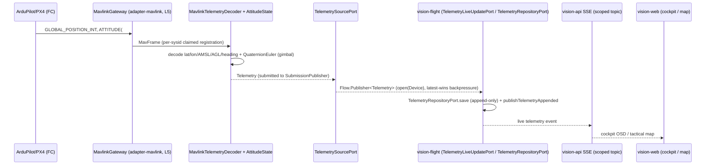
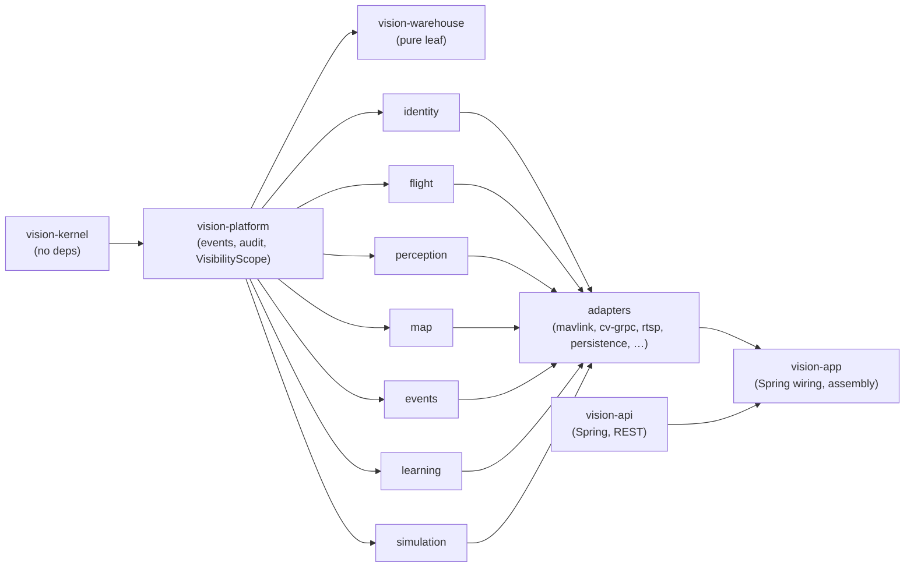

# Master geo/telemetry stack — where an onboard fix and a station correction would plug in

Grounding document for a later design that adds (a) an onboard "light" visual fix and (b) a
station-side "heavy" telemetry correction. Everything below is measured against `feat/after-action`
(master + after-action work) on 2026-08-19, from documentation first (CLAUDE.md rule) with code
signatures confirmed via each module's `MODULE.md`. `GeoProjection`/S2 fixed-camera-geo (G1–G6) and
`GEO-POSE` (V1–V3) are **done and merged**; `MISSIONS` is a **plan only**, nothing built.

---

## 1. Telemetry model today

### 1.1 `Telemetry` (kernel, `core/vision-kernel`)

```
record Telemetry(DeviceId deviceId, Instant at, Double latitude, Double longitude,
                  Double altitudeMeters, Double headingDegrees, Double batteryPercent,
                  Map<String,Double> extra, FlightState flightState, Double aglMeters,
                  Attitude attitude, Long deviceBootMillis)
```

| Field | Unit / type | Notes |
|---|---|---|
| `latitude`/`longitude` | degrees | nullable |
| `altitudeMeters` | **AMSL** (above mean sea level) | GEO-POSE G1 fixed a bug where this was treated as AGL |
| `aglMeters` | height above home/ground | separate field; **the one a projection actually wants** |
| `headingDegrees` | vehicle yaw | nullable, used only when gimbal yaw is absent |
| `attitude` | `Attitude` | see 1.2 |
| `deviceBootMillis` | device free-running boot clock | not wall-clock, not cross-device comparable; nothing consumes it yet (reserved for a future frame↔pose alignment wave) |
| `extra` | `Map<String,Double>` | vx/vy/vz, battery voltage, groundspeed, wind, vibration, EKF variances, mission seq, rangefinder distance |
| `flightState` | `FlightState` | firmware, mode, armed, failsafe, GPS fix/sats/HDOP, RSSI, arming blockers |

`Telemetry` is read by five contexts: flight, perception (OSD), warehouse (stats), events (replay),
map.

### 1.2 `Attitude` (kernel)

```
record Attitude(Double rollDegrees, Double pitchDegrees, Double yawDegrees,
                 Double gimbalRollDegrees, Double gimbalPitchDegrees, Double gimbalYawDegrees)
```

All six fields individually nullable (fixed camera ⇒ no gimbal; no IMU ⇒ no aircraft attitude).
**Gimbal angles are earth-frame absolute, not airframe-relative.** Degrees throughout — wire is
radians/quaternion, conversion is the MAVLink decoder's job (`QuaternionEuler`), not this type's.

### 1.3 Ingestion path



`GeoProjection.aimFrom`/`FixedCameraGeo` are **pull consumers** of this same `Telemetry` record —
they are called by a service (`MarkService#geolocate`, `TrackProjectionService#project`), not
pushed to.

### 1.4 Units and known traps

| Trap | Status |
|---|---|
| AMSL treated as AGL | **fixed**, GEO-POSE G1 — `Telemetry.altitudeMeters` is now documented and consumed as AMSL everywhere; `aglMeters` is the separate field |
| Gimbal yaw frame (vehicle vs earth) | resolved earth-frame via `GIMBAL_DEVICE_ATTITUDE_STATUS.flags`/`delta_yaw`, or `null` if unresolved; `MOUNT_ORIENTATION.yaw` (vehicle-relative) is **never used**, only its `yaw_absolute` extension field |
| `#285` vs `#265` | `GIMBAL_DEVICE_ATTITUDE_STATUS` (#285) preferred; `MOUNT_ORIENTATION` (#265, deprecated) used only until #285 has arrived once, then latched off permanently |
| No terrain model | `GeoProjection`/`FixedCameraGeo` results always carry `altitudeMeters = null`; flat-ground assumption throughout |
| ArduPilot 4.7 SITL | streamed only 4 message types (HEARTBEAT + 3 event-driven) until DRONE-ONBOARDING's Mechanism A (`SET_MESSAGE_INTERVAL`) asked for more — a starved link is the *default*, not the exception |
| Dialect learned per-vehicle now, not per-address | fixed at end of MAVLINK-CORE W4 (`ResyncBuffer#dialectForPendingFrame`) |

---

## 2. Geolocation math available (boresight-only, shipped)

`core/vision-kernel/GeoProjection` — pure, stateless, no interface (one implementation).

| Method | Signature | What it does |
|---|---|---|
| `project` | `GeoPosition project(GeoPosition drone, double headingDegrees, double altitudeMeters, double depressionDegrees)` | spherical destination-point projection of **one ray — the boresight**; ground range = `agl / tan(depression)`; nadir (`depression==90`) or `altitude==0` short-circuits to drone's own position |
| `project` (overload) | `GeoPosition project(GeoPosition drone, CameraAim aim)` | unpacks a resolved `CameraAim` |
| `aimFrom` | `CameraAim aimFrom(Telemetry telemetry, double fallbackDepressionDegrees)` | the gimbal-vs-airframe precedence resolver (GEO-POSE V1) |
| `bearingDistance` | `BearingDistance bearingDistance(GeoPosition from, GeoPosition to)` | haversine distance + initial great-circle bearing — **the primitive the S2 calibration solver reuses** |

`CameraAim(double bearingDegrees, double depressionDegrees, double aglMeters, boolean measured)` —
`aimFrom`'s precedence: bearing from `attitude.gimbalYawDegrees()` else `telemetry.headingDegrees()`
else throws; depression from `-attitude.gimbalPitchDegrees()` if in `(0,90]` else the fallback;
`aglMeters` from `telemetry.aglMeters()` else `telemetry.altitudeMeters()` (**still AMSL error**,
deliberately not corrected here) else throws; `measured=true` only when both bearing and AGL came
from real sensors.

### 2.1 Assumptions and stated ceiling

- **No camera intrinsics anywhere** — `GeoProjection` moves only the *boresight*; a detection's
  position inside the frame never changes the projected point (its own javadoc says so). Per-pixel
  projection is `FixedCameraGeo`'s job (§3), and only for a *stationary* camera.
- **Flat-ground / spherical-earth** — `EARTH_RADIUS_METERS = 6_371_000.0` (IUGG mean radius), no DEM,
  no terrain intersection. Returned `altitudeMeters` is always `null`.
- **No horizon guard in `GeoProjection` itself** — `agl/tan(θ)` explodes near the horizon (at 3 m AGL,
  θ=1°: range ≈ 172 m, d(range)/dθ ≈ 9.8 m per 0.1° of angular error); the guard exists only in
  `FixedCameraGeo`'s D6 refusals (§3), not in the shared boresight math.
- **`DEFAULT_DEPRESSION_DEGREES = 45.0`** — a documented guess, the fallback when no gimbal telemetry
  exists at all.

---

## 3. Fixed-camera geo (S2) — pose-from-landmarks, the N-point lesson

`FixedCameraGeo` (kernel, static-only) adds the missing **pixel→ray** half; it delegates the
**ray→ground** half verbatim to the unmodified `GeoProjection.project` — one source of truth for the
spherical math.

```
static Optional<GroundFix> project(FixedCameraPose pose, int imageWidthPixels, int imageHeightPixels,
                                    BoundingBox boundingBox, FixedCameraGeoSettings settings)
```

- Projects the box's **bottom-centre** (ground-contact point), not its geometric centre.
- Per-pixel offset: `offset = atan((2u-1)·tan(hfov/2))` per axis (vertical scaled by aspect ratio);
  small-rotation model, roll assumed 0.
- Returns `Optional.empty()` (never throws) for three D6 refusals: depression at/above horizon,
  ground range beyond `maxRangeMeters`, error radius beyond `maxErrorRadiusMeters`.
- `FixedCameraPose(GeoPosition position, double aglMeters, double yawDegrees, double pitchDegrees, double hfovDegrees)`
  — deliberately *not* `vision-map`'s audited `CameraPose`; just the five numbers the ray math needs.
- `GroundFix(GeoPosition position, double rangeMeters, double errorRadiusMeters)` — always carries an
  honest error radius, never a bare confident-looking dot.

### 3.1 What the solver proves about N-point pose-from-landmarks

`CameraCalibrationSolver` (`contexts/vision-map`, static-only): given 2–8 operator-picked
`(pixel, map point)` correspondences, golden-section search recovers `(yaw, pitch, hfov)` by
minimizing pixel residual against `FixedCameraGeo`'s own forward projection, gated by an RMS-pixel
quality ceiling (`25.0px` default).

**The N=2 lesson (found and fixed by actually running the demo, `c21684d8`):** the plan's own D5
claimed "with N=2 the fit is exact and the residual meaningless." False — two landmarks supply
**four** measurements (two bearings, two depressions) against **three** unknowns, leaving one
redundant degree of freedom, so the residual measures something real. The first live run returned
`solved:true, rmsErrorPixels:177.4, quality:UNDETERMINED` on two mutually inconsistent clicks — a
confidently wrong pose, savable. Fix: the residual ceiling now applies **at every N**, not just N≥3.

| N | Consistent input | Result before fix | Result after fix |
|---|---|---|---|
| 3 | consistent | `GOOD`, 0.014px, pose within 0.002° | unchanged |
| 2 | consistent | `UNDETERMINED`, 0.003px | unchanged (genuinely thin but consistent) |
| 2 | **inconsistent** | `solved:true`, 177px, **wrong by 10° yaw** | `solved:false`, `"residual 177.4px exceeds 25.0px"` |

Five waves of review and 1591 module tests did not catch this; one `curl` did (`FIXED-CAMERA-GEO-DEMO.md`).
This is the concrete evidence that solving pose from N ground correspondences is real and workable,
but the redundancy/residual check must never be skipped regardless of how few points are supplied —
directly relevant to any onboard/station pose-correction design that proposes fitting a camera pose
from matched ground features.

### 3.2 Track projection — not `Mark` rows, on purpose

`TrackProjectionService#project` folds a fixed camera's live tracks through `FixedCameraGeo` +
`GeoProjection` into `ProjectedTrack` (live, in-memory, republished each tick) and durable
`TrackPoint` trail rows — a **new `MapEvent.EntityType.TRACK`**, never a `Mark`. Reason: `marks` is
in the `db_audit_log` audited table set (V21); a tracked object updated at 1 Hz would write ~3600
audit rows per object-hour, drowning the exact append-heavy traffic the audit classification exists
to keep out. `projected_track_points` is in the **excluded** (high-volume) table set instead.

---

## 4. Missions — plan only, nothing built

**Status: `MISSIONS-PLAN.md` is a frozen spec; zero code exists.** `mavlink-core` W1–W4 already
*modelled* `MavlinkCoreSettings.Mission(1500ms timeout, 250ms/item, 5 retries)` but nothing consumes
it — `DefaultCorrelator.extractKey` today recognizes only `CommandAck` (id 77), not the mission
protocol's `MISSION_ACK`/`MISSION_REQUEST`/`MISSION_REQUEST_INT`/`MISSION_COUNT`.

### 4.1 What a mission upload looks like (as specced)

Standard MAVLink mission protocol, server-driven lock-step:

```
station --MISSION_COUNT(N)--> vehicle
station <--MISSION_REQUEST_INT(seq)-- vehicle   (repeated per item; re-requests re-answered, out-of-order dropped)
station --MISSION_ITEM_INT(seq)--> vehicle
... 
station <--MISSION_ACK-- vehicle                 (terminal)
```

- Every positional item ships as `MISSION_ITEM_INT` + **`MAV_FRAME_GLOBAL_RELATIVE_ALT_INT`** — the
  one frame v1 supports (non-INT global frames silently corrupt lat/lon via int32 rounding).
- Decision **D6**: `mavlink-core`'s `DefaultCorrelator.extractKey` becomes a compiled-in table
  (message class → `MatchKey`), closed for modification, adding `MISSION_ACK`(47)/`MISSION_REQUEST`(40)/
  `MISSION_REQUEST_INT`(51)/`MISSION_COUNT`(44) — this table already landed per `mavlink-core`
  MODULE.md's own note ("the four MISSION rows are landed here in full per D14").
- Decision **D3**: two mission-item families — `NATIVE` (`nav.*`, `do.*`, uploaded to the vehicle as
  `MISSION_ITEM_INT`) vs `STATION` (`station.*`, **never uploaded**, lives only in the station's
  mission document, anchored to a native item via `StationAnchor(int afterItem)`, executed by a
  `StationItemExecutor` functional seam registered in `vision-app` — the same precedent as
  `GeofenceMonitor`). A STATION item on link loss is `SKIPPED`-with-audit, never retro-fired.

### 4.2 Where "load a mission corridor + roads to the drone" attaches

| Layer | Module | Wave |
|---|---|---|
| Mission client (upload/download/clear over `RequestResponse`) | `drone-link/mavlink-core` (L4 `service.MissionService`) | M1 |
| `Mission`/`MissionItem`/`MissionItemType`/`MissionItemCatalog`, ports, `DefaultMissionService` | `contexts/vision-flight` | M2 |
| Map ↔ mission integration (edit route, planned vs flown track, promote a verified `Mark` to a mission item) | `contexts/vision-map` + `vision-app` glue | M5/M6 (explicitly must not touch MAP-UX's rail/layer manager) |
| Live mission progress (`MISSION_CURRENT`/`MISSION_ITEM_REACHED`) over SSE | `vision-api` | M3+ |
| Synthetic vehicle for fault injection (never the fidelity gate — SITL is) | `simulation-sources/mavlink-vehicle` | M8, sequenced **after** SITL |

A "mission corridor" (a route the drone should fly, roads to follow) is exactly a sequence of
`NATIVE` positional items; a station-computed correction advisory ("resume this corridor after a
GNSS gap") is naturally a `STATION` item anchored to the corridor, executed by a new
`StationItemExecutor` — no new context edge required (D4: flight gains no edge on map/perception for
this).

---

## 5. Onboard compute reality

### 5.1 Drone-side effort tiers (`BASE-COMPUTE-MATRIX` §1.2) — the offload law

| Loop | Rate | Must live | Why |
|---|---|---|---|
| Rate/attitude stabilization | 400–1000 Hz | **FC only, never offload** | link jitter destabilizes the airframe |
| Position/velocity control | 5–20 Hz | FC executes, base may command | ArduPilot GUIDED + `SET_POSITION_TARGET_*`, 3s link failsafe |
| Guidance (waypoints, RTL) | 0.1–2 Hz | base | latency-tolerant |
| Perception | 1–30 Hz | base | needs a GPU the aircraft doesn't carry |
| Deliberation | seconds–minutes | base | multi-asset, human-in-the-loop |

| Tier | Means | Cost |
|---|---|---|
| D0 | nothing — telemetry/video already arriving | €0 |
| D1 | FC config only (params/CLI) | €0 |
| D2 | cheap hardware (ESP32/ELRS bridge, capture dongle) | €5–30 |
| D3 | companion computer + bidirectional link | €40–120 |
| D4 | real integration (gimbal, thermal, firmware) | €150+ |

**Advisory autonomy first, always:** the base computes and shows the pilot the smart thing
("resume this line", "turn back now") rather than commanding — zero drone-side work, zero
command-TX risk. Commanded autonomy (an onboard fix actually steering the aircraft) is the gated
upgrade, matching the RX-only doctrine below.

### 5.2 Position source stack (`DRONE-COMPONENTS-MATRIX` §1.1) — where an onboard "light" fix sits

| # | Source | Cost | Computed on | Relevance |
|---|---|---|---|---|
| P0 | GNSS (M10) | €15–40 | drone | baseline everyone has |
| P3 | IMU dead reckoning | €0 | drone | seconds of usefulness only |
| P5 | Optical flow + rangefinder | €20–60 | drone | velocity hold, low AGL only |
| **P6** | **Visual odometry (frame-to-frame)** | **€0, camera only** | **base** | drift-bounded relative fix — the "light onboard visual fix" candidate, if computed base-side over the video downlink rather than truly onboard |
| **P7** | **Visual place recognition vs reference imagery** | **€0, camera only** | **base** | the drift-killer — resets accumulated error absolutely, no GNSS needed |
| P9 | Ground-station radio TDOA/AoA | €30–100/receiver | base | *our own mini-GNSS*, zero drone-side change |
| P11 | Operator manual fix | €0 | base | always the final layer |

Genuinely onboard (drone-side compute) options above are thin — P3/P4/P5 only, all short-range or
FC-native. **P6/P7/P9 are all base-side compute**, i.e. the "heavy" station tier the task frames as
(b) is already where this repo's own thinking (unmerged `feat/visual-geo`) puts the real work; a
truly onboard "light" fix is constrained to companion-computer tiers D2–D3 the platform does not
assume most fleets have (ANY-DRONE §0, MOAT: any-drone adaptation over vendor-specific capability).

### 5.3 RX-only doctrine and command TX

Command transmission to the aircraft is staged and operator-gated (`DRONE-INFRA-PLAN`, I-e):
RTL and arm/disarm/mode-select are **done and SITL-verified**; missions (Stage 3) are **parked**,
now the subject of `MISSIONS-PLAN`. Any onboard-fix design that wants to *correct the aircraft's own
position estimate in flight* (e.g. via `GPS_INPUT`/`VISION_POSITION_ESTIMATE`, see §7) is a new,
currently-nonexistent command-TX class and would need the same explicit operator go this repo already
requires for every other TX capability (DRONE-ONBOARDING D9: Tier-C writes never happen at any
authority level, behind no flag).

### 5.4 Hardware already owned

Per `TWO-TARGETS-PLAN`/`HARDWARE-BUYLIST`: the GB4005 inference box is already owned and running as
the station-side cv-service host (§6). No onboard companion computer is yet bought; S2 fixed-camera-geo
(§3) deliberately needs **zero new drone-side hardware** — it runs against a stationary/ground camera,
not the aircraft.

---

## 6. Station compute reality

### 6.1 cv-service host

- **Intel-only, no CUDA** (GB4005 — Gemini Lake class). `StartTraining` trains on CPU there and is
  documented as genuinely slow; `CV_DEVICE` is never hard-pinned so a real GPU training host would
  "just work" if one existed, but none does today.
- **OpenVINO path**: the Docker image exports the default model (`yolo11n.pt`) to an OpenVINO IR at
  build time (`yolo export ... format=openvino imgsz=416`) and points `CV_MODEL` at the exported
  directory; `openvino` is deliberately kept **out of the `cv` extra** (Invariant P1: nothing
  x86/CUDA-only may enter the extra that a real onboard box would also need to install) and lives
  only in the Dockerfile. `imgsz` must match between the export and `CV_IMGSZ` runtime config, or
  inference silently runs at the wrong size.
- Deploy: plain pip + **rsync**, deliberately not a multi-arch container image (the amd64 image's
  defining feature — the baked OpenVINO IR — is an Intel-only optimization with no ARM payoff).

### 6.2 gRPC contract (`proto/vision/v1/cv.proto`)

```
service Inference {
  rpc DetectStream(stream FrameRequest) returns (stream DetectionResponse);   // push
  rpc DetectPulled(stream PullControl) returns (stream DetectionResponse);    // pull (worker dials mediamtx itself)
}
service Training {
  rpc StartTraining(TrainingJobSpec) returns (stream TrainingProgress);
  rpc UploadDataset(stream DatasetChunk) returns (UploadAck);
  rpc ListModels(google.protobuf.Empty) returns (ModelList);
  rpc PromoteModel(ModelRefMsg) returns (Ack);
}
```

**`CameraPose` is already a wire message**, carried on both `FrameRequest.camera_pose` and
`PullControl.camera_pose`:

```
message CameraPose {
  float yaw_degrees; float pitch_degrees; float roll_degrees;
  float hfov_degrees;   // 0 = unknown -> pose compensation disabled
  float vfov_degrees;   // 0 = derive from hfov + aspect ratio
  int64 pose_timestamp_millis;
}
```

Its own proto comment names **exactly** the extension point this task is scoping: *"Feeds two
consumers... ego-motion compensation... and, later, S2 fixed-camera geolocation."* Today
`adapter-cv-grpc`'s `DetectionFrameCodec.encode` populates it only from MAVLink `ATTITUDE`/gimbal
telemetry (yaw-only in practice — pitch/roll decoding exists but the field is not yet consumed for
per-pixel work Java-side); nothing populates it from a station-computed visual correction.

### 6.3 `CvChannelSupervisor` and reachability

`adapter-cv-grpc`'s `CvChannelSupervisor` (docs/plans/active/CV-RECONNECT-PLAN.md R1) is the single
owner of "is the shared cv-service channel reachable" — watches `ManagedChannel` connectivity state
and gates `GrpcDetectionPort#detect` through it, throwing a stackless `CvUnavailableException` while
the gate is closed. `CvStatusProvider implements SubsystemStatusPort` surfaces this at
`GET /api/system/status` (Health.OK/DOWN/UNKNOWN, `describe()` reused verbatim). Reconnect cadence
(`reconnectInitialBackoff`=1s, `reconnectMaxBackoff`=10s, `outageLogInterval`=60s) is config, not
constants (`GrpcCvSettings`).

### 6.4 Rate budget (`CV-RATE-BUDGET.md`, `CV-RATE-CONTROL-PLAN.md`)

| Measured (after R1–R3, `feat/cv-rate-control`) | Value |
|---|---|
| Effective fps vs configured 10 | **9.998** (was 7.58 before the deadline sampler) |
| Worst box age | **143.7 ms** (was 208.4 ms) |
| Round trip p50, BGR24 vs JPEG (loopback) | 35.7 ms vs 38.6 ms |
| Payload/frame, BGR24 vs JPEG | 691.2 KB vs 12.1 KB |

`WireFormat.AUTO` resolves BGR24 on loopback authorities, JPEG otherwise — the free/expensive
tradeoff is a rule, not a guess, directly relevant to any station↔onboard link that is a radio, not
loopback (JPEG-class payloads, not BGR24). The adaptive rate controller (`DetectionRateController`,
R2) derives target fps from ego-motion (needs per-asset HFOV, not yet wired per-asset) and target
motion, but **has never been measured against real footage with a live track** — built and
unit-covered only.

---

## 7. Extension points

| Concept | Exists today | Would need adding | Owning module |
|---|---|---|---|
| Onboard fix ingestion via `Telemetry.extra` | `extra: Map<String,Double>` is free-form and already carries non-core fields (vx/vy/vz, wind, EKF variances) | a new `extra` key convention (e.g. `visualFixLatitude`/…confidence), decoded by whichever adapter receives it | `drone-link/mavlink` decoder (`MavlinkTelemetryDecoder`), if delivered over MAVLink |
| Onboard fix via MAVLink `GPS_INPUT` (common #232) | **not decoded or sent anywhere in this codebase** — no row in `adapter-mavlink`'s message→field table | a decoder row (if RX, i.e. the aircraft is reporting an onboard fix upstream) or a new TX path (if the station wants to inject a fix into the FC — a new command-TX class, see §5.3) | `drone-link/mavlink` (RX) or a new `VisualFixCommandPort`-shaped seam (TX, operator-gated) |
| Onboard fix via MAVLink `VISION_POSITION_ESTIMATE` (common #102) | **not decoded or sent** | same as `GPS_INPUT` — a new decoder row or a new TX path, whichever direction the design needs | same |
| Station-side corrected-position publication | `PositionFix`/`PositionFusion`/`FixOrigin` exist **only on the unmerged `feat/visual-geo` branch** (not in `feat/after-action`) — see `DRONE-COMPONENTS-MATRIX` §1.3, A1 ("generalize `PositionFusion` from 3 hardcoded inputs to an N-source registry") | on master today: nothing — the nearest shipped analog is `TrackProjectionService`/`ProjectedTrack` (S2, §3.2), which publishes a *ground object's* position, not the *aircraft's own* corrected position | a context decision: extend `vision-flight` (aircraft's own position) vs reuse `vision-map`'s track machinery (a ground-object position) — these are different questions |
| SSE topics | `LiveTopicKind.MAP` (scoped by layer visibility) already carries `MapEvent{MARK,DRAWING,LAYER,TRACK}`; flight/telemetry has its own scoped live channel via `TelemetryLiveUpdatePort` | a new `MapEvent.EntityType` (if a station correction is a map-visible entity) or a new telemetry-adjacent SSE topic (if it is aircraft-state) | `vision-api` (topic wiring), `vision-map` or `vision-flight` (payload owner) |
| Map layers | `MapLayer(kind COP\|TEAM\|PERSONAL)`, `LayerResolver#copLayerId()`, `MapAccessPolicy` (identity/group-based, deliberately not `VisibilityScope`) already exist and are reused by S2's projected tracks (default COP layer, per-camera `targetLayerId` override) | none, structurally — a corrected-position marker/track is the same shape S2 already solved | `vision-map` |
| Persistence | `camera_poses` (audited), `projected_track_points` (excluded/high-volume) precedent from S2 (V22 migration); `db_audit_log` (V21) classifies every table — new tables **must** be classified or `DbAuditLogCoverageTests` fails the build | a new table (or reuse of `projected_track_points`'s shape) for a corrected position history, classified per V21's audited-vs-excluded split depending on write rate | `storage/persistence` |

---

## 8. Constraints from CLAUDE.md any design must obey



| Rule | Consequence for this design |
|---|---|
| Context DAG is ArchUnit-enforced; adapters never depend on each other | an onboard-fix decoder in `drone-link/mavlink` cannot import `adapter-cv-grpc`, and vice versa — any fusion of onboard telemetry + station CV result must happen in a context module or in `vision-app` |
| Spring only in `vision-app`, `vision-api`, and adapters — never a context module | `PositionFusion`-shaped logic (if ported from `feat/visual-geo`) must stay a plain, framework-free class in a context module, same as `GeoProjection`/`FixedCameraGeo`/`CameraCalibrationSolver` today |
| Config in properties (fixed) or database+cache (runtime-variable), never hardcoded | thresholds like the S2 D6 error-radius ceilings, or a future correction-confidence floor, follow `vision.geo.fixed-camera.*`'s precedent — `FixedCameraGeoSettings` caller-supplied, sourced from `application.yaml`, never a literal in kernel code |
| Failsafe / freshest-data priority (rule 9) | a station correction must never silently override live telemetry with stale data — matches `TelemetrySourcePort`'s existing latest-wins backpressure and `TrackProjectionService`'s "compare a new fix against `findLatest`" idiom |
| Module standalone principle — a module doesn't know who uses it | `GeoProjection`/`FixedCameraGeo` already model this: pure math, no knowledge of MAVLink, map, or CV; a new pose-correction primitive should sit the same way, in kernel or a context, consumed by whichever service needs it |
| Scalable non-core modules; core modules scalable too if they hold calculation logic | any new heavy-compute station service (e.g. a homography/VPR matcher) is exactly the kind of calculation-bearing module rule 2 (deployment section) requires to be scalable, not a singleton in `vision-app` |
| Layered architecture: controller → orchestration service → feature service → repository | a REST surface for a corrected position (mirroring O13's passport/drift pattern) would sit `Controller → DefaultXService (scope+audit) → RepositoryPort`, matching every other service in `vision-flight`/`vision-map` today |

**Net reading for a later design:** the shipped, boresight-and-per-pixel geo math (§2–3) and the map's
track/audit precedents (§3.2, §7) are the reusable substrate for consuming *either* an onboard or a
station correction once one is computed; the actual computation of a visual fix (VO/VPR-class work)
exists today only on the unmerged, parked `feat/visual-geo` branch and is out of `feat/after-action`'s
scope entirely.
