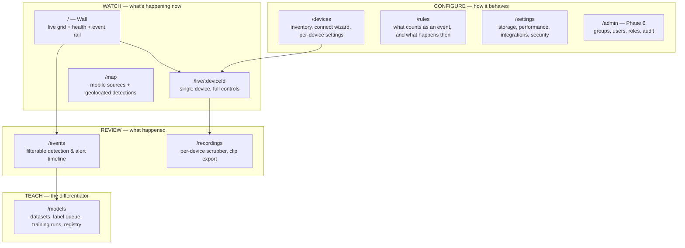
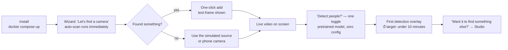

# UX Design — What Users Connect, Set, and See

Companion to [ARCHITECTURE.md](../../ARCHITECTURE.md). That document answers *how the system is built*; this one answers *what the product is, for whom, and what its surfaces look like*. It is deliberately written ahead of the UI work so that Phase 2–6 features land in a coherent shell instead of accreting into the dev console.

---

## 1. The main idea, restated as a product

The architecture describes a pipeline. Users don't buy pipelines. Stated as a promise:

> **Point anything with a camera at the world, and Vision watches it for you — tells you when something you care about happens, teaches itself things you care about that it doesn't know yet, and never locks you into one vendor's hardware.**

Four claims, in the order a user experiences them:

| Claim | What makes it true | Phase |
|---|---|---|
| **Connect anything** | One `VideoSourcePort`, many adapters — RTSP, MJPEG, UVC, UDP, WebRTC | 1, 4 |
| **See it live, anywhere** | HLS today, WebRTC later; overlay + telemetry OSD burned in | 1, 7 |
| **Know when it matters** | Detections → rules → events → alerts | 2, 5 |
| **Teach it your objects** | Dataset → fine-tune → promote → live detection | 3 |

The fourth claim is the differentiator. Frigate, Blue Iris, and Synology Surveillance Station all do claims 1–3 for fixed IP cameras. **None of them let a user upload photos of *their* object and have the live stream start finding it an hour later, and none of them treat a moving, telemetry-emitting drone as a first-class source.** The product identity lives in the intersection: *heterogeneous and mobile sources + trainable vision*.

That intersection should be visible in the UI, not buried. Concretely: a fixed camera and a flying drone must not render the same screen (§5.2), and "Teach it something new" must be a top-level destination, not a settings subtab.

### Who the final users are

The Maven group id is `com.drones.vision`. That is the honest signal about persona priority — this is a maker's platform first, and a security product second.

| Persona | Brings | Wants | Fails when |
|---|---|---|---|
| **Maker / drone builder** *(primary)* | DIY drone, ESP32-CAM, FPV link, Pi companion | Get an odd source on screen at all; low latency; OSD telemetry; record the flight | Latency makes flying impossible; the connect step needs a wiki page |
| **Small-site watcher** *(adjacent, largest volume)* | 2–8 IP cameras | "Tell me when a person is at the gate, and don't tell me about cats" | Alert noise → notifications muted → product dead |
| **ML tinkerer** *(the differentiator)* | A pile of photos, a custom object | Train, see mAP go up, promote, watch it work live | Training is a CLI ritual with no feedback |
| **Team/fleet admin** *(Phase 6)* | Several operators, sites | Groups, roles, audit, "who watched what" | Access model can't express their org |

The maker and the ML tinkerer are frequently **the same person on a different evening**. Design for one human wearing different hats, not four separate products — this is why mode-switching (§4) beats role-locked UIs.

---

## 2. Three design truths this domain imposes

Everything in §4–6 follows from these. They are not style preferences; ignoring any one of them kills the product for a persona.

### T1 — Latency is a feature, and it must be visible

The README already admits HLS costs 5–10 s. For the gate camera that is irrelevant. **For a drone pilot it makes the product useless.** Hiding this behind a spinner teaches the user the app is broken.

So: the player always shows a **latency badge** (measured, not promised) and a transport selector with honest labels — *HLS ≈ 6 s (compatible)* / *WebRTC ≈ 0.3 s (Phase 7)* / *Snapshot 1 fps (fallback that always works)*. A user who understands the tradeoff forgives it; a user who doesn't blames the app.

### T2 — Alert noise is the #1 cause of abandonment

Every camera-CV product dies the same death: too many notifications → user mutes them → product provides zero value while consuming a GPU. Noise control cannot be an afterthought; it is the core interaction of the events surface:

- **Test before save** — a new rule replays against the last 24 h of stored detections and says *"this would have fired 47 times yesterday"* before it is ever armed. This single feature prevents most abandonment.
- **Explain every event** — each alert shows *why*: model + version, confidence, which zone, dwell time. Unexplainable alerts are indistinguishable from bugs.
- **One-tap correction** — "not a person" / "yes, that's my object" on every event card. These are not just dismissals: they feed the review queue in ARCHITECTURE §4's feedback loop. **The alert list is the labeling tool** the backlog asks for, disguised as ordinary use.

### T3 — Connecting a device is where users are lost

Today the flow is: type a URI into a form → register → press start → get a 400. The user is now debugging someone else's system with no information.

The fix is a **test-before-save** connect wizard that shows a real decoded frame from the device before the record is persisted (§5.1). No device is ever saved in a state that can't stream. If credentials are wrong, the error says *"RTSP 401 — camera rejected the password"*, not *"start failed"*.

---

## 3. Information architecture

Three mental modes, plus a studio. Users are almost never doing two at once, which is why these are top-level destinations rather than tabs on a dashboard.



Everything below the fold on today's single-page console maps into exactly one of these. The console itself survives as `/debug` — raw ports, adapter health, proto round-trip timings — because this audience genuinely wants it.

---

## 4. The progressive-disclosure model

This is the direct answer to *"user-friendly with the ability of advanced settings"*. The failure mode to avoid is the usual one: a friendly page for beginners and a separate wall of 60 fields for experts, with no relationship between them — so the moment a beginner needs one advanced knob, they are dumped into the wall and lost.

**Instead: one settings surface, three tiers, and every tier is a view of the same underlying values.**

| Tier | Control style | Example (stream quality) |
|---|---|---|
| **1 — Preset** | A single named choice. Covers ~90% of users forever. | `Balanced` / `Low-latency` / `High-quality` / `Bandwidth-saver` |
| **2 — Tuned** | The 5–8 knobs that genuinely differ between installs. | inference FPS · confidence · model · label filter · overlay on/off |
| **3 — Expert** | Raw key/value — the `StreamDescriptor.options` map, FFmpeg flags, GOP, RTSP transport. | `rtsp_transport=tcp`, `stimeout=5000000` |

Four rules make this work:

1. **Every expert knob is reachable from a preset.** Presets are not a separate simplified system — they are *saved sets of the same values*. Nothing is preset-only, nothing is expert-only.
2. **Presets are transparent.** Choosing one shows what it changed: *"Low-latency: inference 3 fps, RTSP transport TCP, HLS part duration 200 ms, overlay telemetry off."* Never a black box.
3. **Editing a preset is not a trap.** Change one field and the badge becomes `Custom (based on Low-latency)`, with *Revert* and *Save as new preset* both one click away. Users experiment freely because the exit is always visible.
4. **"Show advanced" is a per-user account mode, not a per-page toggle.** An expert flips it once and stays expert; a beginner never sees Tier 3 exist. Not sticky-per-page, which forces the same click a hundred times.

The domain already supports this cleanly: `PipelineConfig(model, confidenceThreshold, inferenceFps, maxInFlightInferences, overlayTelemetry, labelFilter)` is exactly a Tier-2 record, `PipelineConfig.defaults()` is exactly a Tier-1 preset, and `StreamDescriptor.options: Map<String,String>` is exactly the Tier-3 escape hatch. **The UI tiers are already in the model** — they need naming and exposing, not new domain types.

> Presets should be *named domain objects* (`PipelineProfile`), stored and assignable to many devices — so an operator with 30 cameras tunes once and applies everywhere. Per-device-only settings do not survive contact with a real deployment.

---

## 5. Screen-by-screen: what users connect, set, and see

### 5.1 Connect — the device wizard *(the highest-value screen in the product)*

Four steps, and the third is the one that matters:

```
1 FIND      [ Scan network ]  → mDNS · ONVIF · USB found 4 candidates
            or [ Enter manually ]        (scan already exists — POST /api/discovery/scan)

2 IDENTIFY  Name  [ front-gate            ]
            Type  ( ) IP camera  ( ) ESP32-CAM  ( ) Drone  ( ) USB  ( ) Robot
            Credentials (if the probe asked for them)

3 TEST      ┌────────────────────────┐   ✓ Connected  ·  1280×720 · H.264 · 24 fps
            │   [ live decoded frame ]│   ✓ Decode OK  ·  first frame in 1.2 s
            │                         │   ⚠ No telemetry detected — OSD unavailable
            └────────────────────────┘   [ Retry ]  [ Advanced options ▾ ]

4 CONFIGURE Quality preset  [ Balanced ▾ ]   Detection [ on ]  Record [ events only ▾ ]
            → Save & start
```

Step 3 is non-negotiable. **A device that cannot produce a frame is never saved.** When it fails, the message is specific and actionable — `401 Unauthorized: the camera rejected these credentials`, `Connection refused on :554 — is RTSP enabled on the camera?`, `Codec H.265 not supported by this build`. Each with a *what to try next* line.

Capabilities are **detected here, not typed** — `Set<Capability>` is filled by the probe (video/telemetry/PTZ/audio), and that set drives which panels appear later (§5.2). A user should never hand-declare that their camera has PTZ.

### 5.2 See — the live view is capability-driven, not one-size-fits-all

A fixed gate camera and a flying drone have almost nothing in common as a viewing experience. `Device.capabilities` already distinguishes them; the UI should honor it:

```
┌─ FIXED CAMERA (VIDEO) ─────────────┐   ┌─ DRONE (VIDEO + TELEMETRY) ────────┐
│  [ video + detection overlay ]     │   │  [ video + overlay + OSD ]         │
│  ● 6.1s HLS   [transport ▾]        │   │  ● 0.4s WebRTC  ▲112m ⬢14.8V ⇢18m/s│
│                                    │   │  ┌──────┐ ← map inset: track +     │
│  Overlays: [x] boxes [ ] zones     │   │  │ map  │   geolocated detections  │
│  [snapshot] [record] [zones…]      │   │  └──────┘                          │
│  + PTZ pad — only if PTZ capable   │   │  [snapshot] [record] [flight log]  │
└────────────────────────────────────┘   └────────────────────────────────────┘
```

- **Zones are drawn on a paused frame**, never typed as coordinates — and they are *hidden entirely for mobile sources*, where a fixed polygon is meaningless. This is the clearest case where capability-driven UI beats a universal settings form.
- **Telemetry OSD and the map appear only with `TELEMETRY`.** For the drone persona this is the reason they chose this platform over Frigate.
- **PTZ pad only with `PTZ`.** Later: *auto-track this object* — click a detection, PTZ follows it (backlog item, and a genuinely delightful demo).

The **Wall** (`/`) is the default landing screen: a live grid, a health strip (devices online, inference latency, dropped-frame rate, storage headroom, GPU), and a right-hand rail of recent events. Grid tiles are quiet by default and flash a colored border on a detection — motion in the periphery is how humans monitor many feeds at once. Density is user-selectable (2×2 through 6×6) and tiles drop to snapshot-refresh when off-screen, so a 30-camera wall doesn't melt the browser.

### 5.3 Set — rules are the product's brain

`EventType` and the Phase 5 rules engine deserve a first-class editor, phrased as a sentence rather than a form:

```
When  [ person ▾ ]  is seen in  [ driveway ▾ ]  for more than [ 5 ] seconds
 with confidence above [ 0.6 ═══●═══ ]
during [ 22:00 – 06:00 ▾ ]  on  [ front-gate, side-cam ▾ ]

Then  [x] notify Telegram   [x] record 30 s clip   [ ] webhook   [ ] MQTT

┌ Test against yesterday ───────────────────────────────────┐
│ Would have fired 3 times.  [thumb] [thumb] [thumb]         │  ← T2 in practice
│ Without the dwell filter: 47 times.                        │
└────────────────────────────────────────────────────────────┘
```

That test panel is the difference between a rules engine people trust and one they turn off.

### 5.4 Teach — the studio that no competitor has

Phase 3 deserves the most careful UX in the product, because "train a model" is where non-ML users bounce. Four panes, one linear path:

1. **Datasets** — drag a folder of photos per class. Show the counts and *warn honestly*: "42 images of `forklift` — models usually need 150+ for reliable detection." Set expectations before an hour of GPU time, not after.
2. **Label queue** — frames the system was unsure about, or that a user thumbs-downed in `/events`, land here for a box-draw pass. **The feedback loop is the labeling pipeline**; users label as a byproduct of correcting alerts.
3. **Training run** — a live job page: loss and mAP curves streaming over the existing gRPC `TrainingProgress`, sample predictions on the val set updating as it learns, honest ETA. Watching accuracy climb is the emotional payoff of the entire product; do not reduce it to a progress bar.
4. **Registry** — versions with metrics side by side, `Promote to production`, `Assign to device`, and **one-click rollback**. Model swaps must be as safe as they are in the architecture (§4 hot-swap) — the user needs to feel that trying a new model is not a risk.

### 5.5 Connect outward — integrations

"What users want to connect" is not only cameras. This audience already runs a home lab, and the platform is far more valuable as a component than as an island:

| Integration | Why it matters | Port |
|---|---|---|
| **Home Assistant** (MQTT discovery) | Enormous overlap with the maker persona; makes Vision a sensor in a system they already have | `EventPublisherPort` |
| **Telegram / webhook** | Alerts with a snapshot attached; zero-infrastructure notification | `EventPublisherPort` |
| **MQTT** | The lingua franca of DIY automation | `EventPublisherPort` |
| **RTSP/HLS re-publish out** | Feed the annotated stream into an existing NVR — coexistence, not replacement | `StreamPublisherPort` |
| **Phone as a source** (WebRTC ingest) | Cheapest possible new camera; a great first-run demo when no hardware is at hand | `VideoSourcePort` |
| **API tokens + OpenAPI** | This audience scripts things; a visible, documented API is a feature | `vision-api` |

All of these are existing ports — the UI work is presentation, not architecture. That is the payoff of the hexagonal core, and the integrations page should be a card grid of *connectors*, each with test-connection and last-delivery status.

---

## 6. First-run: the ten minutes that decide adoption



Two deliberate choices: the scan runs **before** being asked (the user sees results, not an empty form), and the **simulated source is a first-class fallback** — the product must be fully demonstrable with no hardware. The backlog already calls for a simulation adapter "early, it makes every phase testable"; it is equally an onboarding feature.

---

## 7. Cross-cutting principles

1. **Never a blank screen.** Every empty/error state names the cause and the next action. A black player says *"mediamtx unreachable at rtsp://localhost:8554 — is the sidecar running?"* with a copyable command.
2. **Honest status over optimistic status.** Show measured latency, real FPS, actual drop rate. This audience can tell when they're being lied to, and trust lost here is not recovered.
3. **The UI has no private API.** Everything the UI does is a documented REST call. Contract-first already; keep it true, and users will script around it — becoming advocates.
4. **State lives on the server.** Devices, presets, rules, layouts are server-side, so phone and desktop agree. The maker checks from a phone in the field constantly.
5. **Read-only works everywhere; control asks first.** Destructive actions (delete device, promote model, wipe recordings) confirm with what will be lost. Especially with Phase 6 multi-tenancy — one operator's cleanup is another's evidence.
6. **Mobile is a viewer, desktop is a cockpit.** Don't ship a responsive compromise: phone gets wall + events + single live view. Rules editing and the training studio are desktop surfaces, and that's fine.
7. **Dark by default.** Camera monitoring happens in dark rooms and outdoors; the existing console already gets this right.

---

## 8. Build order — mapping surfaces onto the roadmap

| Phase | Backend milestone | UI surface that must ship *with* it |
|---|---|---|
| 1 *(done)* | RTSP in, HLS out | Dev console — as is |
| **1.5** | *(no new backend)* | **Connect wizard with test-frame (§5.1) + Wall.** The highest value-per-hour work available right now, and it needs no new ports |
| 2 | CV core, detections | Overlay toggles, live detection sidebar, `/events` v1, latency badge |
| 3 | Training | Studio (§5.4) — datasets, run monitor, registry |
| 4 | More devices, telemetry | Capability-driven live view: OSD, map, PTZ pad |
| 5 | Events, recording, alerts | Rules editor with test-preview (§5.3), recordings scrubber, integrations page |
| 6 | Identity | `/admin`: group tree, role matrix, audit log |
| 7 | WebRTC, scale | Transport selector, metrics dashboard |

### The one thing to do next

**The connect wizard's test step.** It requires no new ports — probe the source, decode one frame, return it — and it converts the product's worst current experience (register blind, press start, receive `400`) into its most reassuring one. Every persona passes through this screen before they see anything else.

### A note on frontend stack

The static console in `vision-api/src/main/resources/static/` is served from the jar with no build step, which is exactly right for Phase 1 and worth preserving as long as possible. Phase 2 adds WebSocket detection feeds, a multi-tile grid, and canvas overlays — beyond comfortable hand-rolled DOM, but not enough to justify a heavy SPA. Recommendation: a small component layer (Preact or Lit, ~5 KB, no JSX toolchain required) bundled into the same static dir by a Maven frontend plugin, so `docker compose up` still yields a complete product in one artifact. **Self-hosted software that needs a separate frontend deployment loses this audience.**
