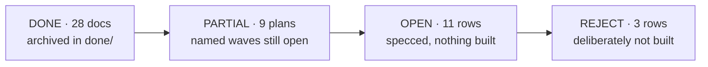

# Plans — the whole portfolio, one page

**Reconciled 2026-08-22** against `master` @ `3a1b30a5` — every row below was checked against git
(is the branch an ancestor of master?) and against the tree (does the code the plan describes exist?),
not against the plan's own status line. Several plans still claim "unbuilt" while their work is merged;
this file, not the plan header, is the status authority.

**Spot-reconciled 2026-08-26** against `master` @ `212311e0`: the two control rows in §2 read
"built, not merged" and both branches are in fact ancestors of `master`. Corrected in place — see
[`ARCHITECTURE-AUDIT-2026-08-26.md`](active/ARCHITECTURE-AUDIT-2026-08-26.md) §7 finding P2. No
other row was re-checked in that pass.

Row-level *capability* backlog lives in [`docs/main/MASTER-MATRIX.md`](../main/MASTER-MATRIX.md).
This file is one level up: the state of each **plan document**.

**Why done plans are kept, not deleted.** 640 source files cite these documents by path in
javadoc/TSDoc. They stopped being plans and became reference documentation — deleting one turns
working javadoc into a lie. On 2026-08-22 the 28 finished docs were archived `active/` → `done/`
with a scripted repoint of every citation in the same commit; the `CODE` column is what that cost.

---

## 0. HARNESS — plans that change how agents work, not what the product does

| Plan | State | What it changes |
|---|---|---|
| [AGENT-CONTEXT-DIET-PLAN](active/AGENT-CONTEXT-DIET-PLAN.md) | **in progress**, branch `chore/agent-context-diet-2` (D1–D3 done, D4–D5 open) | Module docs split into `MODULE.md` (contract, read always) + `MODULE-HISTORY.md` (wave narrative, read only to learn *why*); agent definitions read sections, not whole files; `CLAUDE.md` de-duplicated, four stale/missing entries fixed, build discipline stated once. No product code. |

---

## 1. DONE — merged to `master`, archived in [`done/`](done/)

| Plan | Merge | What shipped | CODE |
|---|---|---|---:|
| VISUAL-GEO-V2-PLAN | `d087903d` | heavy-A visual geolocation, corrected track; ships **off** | 134 |
| FIXED-CAMERA-GEO-PLAN + DEMO | `554fc105` | S2: fixed camera pose → tracked object → map coordinate | 70 |
| SYSTEM-STATUS-PLAN | `329754b7` | the running system is legible to its operator | 60 |
| OPS-UX-PLAN (A–C) | `b435838c` | authority ≠ visibility; `canAdminister`/`canManage` on `VisibilityScope` | 52 |
| CV-DEMAND-PLAN | `b435838c` | detection is opt-in **and** demand-gated | 49 |
| MEDIA-SOT-PLAN | `1bece62d` | mediamtx is the video source of truth; M0–M9, re-measured | 47 |
| STREAM-STATE-PLAN (+CONTEXT) | `c5dfa59f` | a stream has a state; detection intent is readable | 42 |
| CV-CLEAN-FEED-PLAN | `2484d6ab` | burn-in deleted, `labelDenyFilter`, priority tiers, one Vision drawer | 38 |
| POSTGRES-ONLY-CONTEXT | `72fae57e` | Postgres + Flyway is the only store; in-memory repos gone | 32 |
| SCALE-100-PLAN (+CONTEXT) | `72fae57e` | Bands A+B: 20–100 users on one JVM (rate limiter ships OFF) | 29 |
| AFTER-ACTION-PLAN | `bb21af1b` | evidence package that cannot quietly omit (`PRESENT/ABSENT/TRUNCATED/FORBIDDEN`) | 23 |
| CV-RATE-CONTROL-PLAN | — | R1–R4: closed rate loop, adaptive rate, BGR24 wire | 21 |
| LIVE-SCOPE-PLAN | `180b68fa` | W1–W6: the live plane asks who is asking; ArchUnit `@OpenByDesign` guard | 19 |
| GEO-POSE-PLAN | `6ec9e6f5` | AMSL-as-AGL unit bug fixed; attitude/gimbal decoded | 18 |
| TRACKING-V2-PLAN | `56c7354d` | C0–C5: identity owned by cv-service, not a ByteTrack side effect | 14 |
| CV-PANEL-SPLIT-PLAN | `65b0d56f` | Vision panel → side panel (flying) + setup modal (**since renamed "Tuning" and had its tracking-mode picker removed by CV-ORCHESTRATION W3.4, E19** — ASSOCIATE always, FOLLOW is tap-only, OFF is profile-only) | 13 |
| TRACK-IDENTITY-PLAN (+RESEARCH) | `2484d6ab` | L1–L4: label election, association gates, SPA stability, FOLLOW memory | 11 |
| CV-UX-RESEARCH | — | superseded in layout by CV-PANEL-SPLIT; its tiering shipped | 10 |
| RC-LATENCY-PLAN | `cb16d0dd` | send-on-arrival: ~39 ms → ~9 ms; `rateHz` read live | 9 |
| CV-FLY-INTERACTION-RESEARCH | — | D1–D9 executed by CV-CLEAN-FEED | 9 |
| IA-TRUTH-PLAN | `329754b7` | navigation stops contradicting itself | 3 |
| MODULE-LAYOUT-PROPOSAL | `965fc98b` | adapters/libs → responsibility folders | 2 |
| DEAD-CODE-AUDIT | `985bf4c8` | K4: 338 types, 337 live, 1 orphan — `TrackedObject` has no sibling | 0 |

Retired 2026-08-22 (merged session scratchpads, zero code citations): `AFTER-ACTION-CONTEXT`,
`CV-FLY-INTERACTION-CONTEXT`, `DRONE-ONBOARDING-CONTEXT`, `FIXED-CAMERA-GEO-CONTEXT`,
`MAVLINK-CORE-CONTEXT`, `MEDIA-SOT-CONTEXT`, `TRACK-IDENTITY-CONTEXT`,
`VISUAL-GEO-RESEARCH-CONTEXT`, `PLAN-DOCS-AUDIT` (superseded by this file).

---

## 2. PARTIAL — merged, with named waves still open

| Plan | Merged | Still open | CODE |
|---|---|---|---:|
| MAVLINK-COMMANDS-PLAN | **merged to `master`** (ff `c9768704`, 2026-09-01, 12 commits): R1–R4+O1 research corpus · F0–F4 firmware hardening (harness repaired incl. dark `make motors`/`make session`, esp_task_wdt, dtMs clamp, network-down failsafe pinned, learned-peer command gate + TX STATUSTEXT) · P1–P4 command surface (force-arm magic 2989 defect fix, 700ms×3 bounded retries wired to production, stream negotiation on claim, onLinkFailure pinned) · W1–W2 keyboard ops (Space e-stop, Shift+Enter hold-arm, mode digits, transmitter-view key map) | **F1 WDT bench reset test — operator, powered hardware** · live rover drive — operator-gated · `capabilities()` ← CapabilityReport wiring · stream ids/rates not yet in VisionMavlinkProperties · MAVLink signing (own effort) | — |
| DRONE-ONBOARDING-PLAN | O1–O8, O11–O14 (`aa426859`), all behind `vision.onboarding.*.enabled=false` | **O9/O10** — operator-gated, need an explicit go | 107 |
| DOMAIN-SEPARATION-W1 / -PLAN | **W1** (`00879827`) — 8 contexts are Maven modules | **W2** broker + live plane · **W3** worker role + leases · **W4** learning extraction · **W5** sim node | 51 / 2 |
| MAVLINK-CORE-PLAN | W0–W4 (`7e80746d`) — `drone-link/mavlink-core`, adapter rewired, SITL green | **W5** message-rate + link health (the first user-visible payoff) · **W6** Parameter/Mission | 22 |
| TRACKING-V3-PLAN + BAND1-CONTEXT | V1–V7 and band 1 (`331a6a77`) — levelled L1–L4 ladder wired end to end | §6b **O1–O5** — all need real aerial footage with frames to resolve | 6 / 25 |
| RC-CONTROL-PLAN | Phase 0 (`c1cf9fe`) + Phase 1 (`2b65ceb`) — SITL only | **Phase 2** (real airframe) — gated on explicit user go | 6 |
| VEHICLE-CONTROL-PROFILES-CONTEXT | P1–P6 **merged to master** (re-checked 2026-08-26: `feat/vehicle-control-profiles` is an ancestor of `master`; the row previously read "built, not merged"): per-airframe stick layouts (a copter's throttle rests at idle, a rover's at stop) + on-screen control, so a browser no longer needs a USB gamepad | live drive of a real vehicle — operator-gated | 35 |
| CONTROLLER-SETUP-CONTEXT | C1–C8 **merged to master** (`feat/controller-setup` is an ancestor of `master`); **C9–C15 merged to master** (`34e298d0`, 2026-09-01, reconciled: master's X4 wizard stays primary, Autodetect/Guide-me relocated into AllControls, Flyway V25→V32), on top of VEHICLE-CONTROL-PROFILES: the operator binds every stick, button and switch themselves (`/manage/controller`), switches fire real MAVLink commands, `/fly`'s mode + arm/disarm moved into the Controller drawer, and the page now draws the transmitter, guides the binding function-by-function, and shows the live CH1–CH8 microseconds leaving the station. **Stick modes 1–4** are supported and stored on the profile (C15) | live-fly verification — operator-gated · **calibration (C12)** deliberately deferred · expo out of scope · dark theme never looked at | 63 |
| ROVER-FIRMWARE-ALIGNMENT-CONTEXT | **merged** (harness on master via MAVLINK-COMMANDS F0 + the c15 merge `34e298d0`) plus the ESP32 sketch at `~/Arduino/ardupoilot-start`, **outside this repo**: the rover now answers the parameter protocol, `REQUEST_MESSAGE`, `SET_MESSAGE_INTERVAL`, `DO_AUX_FUNCTION` and `AUTOPILOT_VERSION`, refuses every navigation mode honestly (no GPS), and stages every reversal through a speed-scaled coast so the bridge never drives a spinning armature. `make commands` in `infra/rover-sim/` checks the lot against pymavlink | **no motor has turned** — every timing is measured on the host against captured LEDC writes, and the thermal claim is reasoning, not a measurement; also never driven end to end from the app since the command surface landed | 4* |
| OPERATOR-UX-7-PLAN | W1–W3 + sweeps **merged to master** (2026-08-29): pre-flight board triages Your vehicles / Simulated, `Not probed yet` / `No telemetry device` verdicts, `NOT PROBED` stat, 'vehicles' not 'drones'; bell unread = since mount, read ids persisted (no more permanent `9+`); events rail hides removed-device history behind `Include removed devices (n)`, one chip per row; `/devices` names the other devices bound to the same udp/tcp endpoint | pre-flight board N+1 `getAsset` · board cannot distinguish never-probed from all-unknown | — |
| OPERATOR-UX-6-PLAN | W1–W3 + sweeps **merged to master** (2026-08-29): replay page leads with map + video + transport, evidence package last and collapsed; `Built for Station`, `200 entries`, session (not flight) vocabulary; the dark-theme `night` basemap works again (OSM + tile-pane filter owned by the tile layer, cache keyed by host — Carto now needs a key); trails drop Null Island; readiness says `Not probed yet` and disables `Probe now` for an offline vehicle with the reason; `/org` opens on the roster, create forms behind a button | `UsageSummary` last-activity time · replay library has no per-kind vocabulary | — |
| OPERATOR-UX-5-PLAN | W1–W3 **merged to master** (2026-08-29): idle usages close at their last activity (`vision.usage.idle-close`/`sweep-period`, runner in vision-app — the only recovery for a crashed stream); replay reads `Open · last sample 4d ago`/`No samples` instead of `Flying now`; station verdict names the subsystem (`Degraded — CV inference down`); toasts only for post-mount events on streaming assets; UUIDs in activity/audit prose → names, root actor `Station`; `/assets` triage order + Last seen | wire has no usage last-activity time · `/assets` column sort | — |
| OPERATOR-UX-4-PLAN | W1–W5 **merged to master** (2026-08-29): a no-fix position is no position (web `hasFix` + mavlink records lat/lon only with ≥2D fix), one attention verdict per asset on `/command` (rail = panel; gps/stale/breach reasons live-only), Command rail triages like `/fly` (shared `core/fleet/triage-logic.ts`), every age via `humanAge`, `Removed device · id` in alerts, coming-soon pages inside the page frame | bell replays a historic breach toast on load · `/fly` picker POSITION for offline sims | — |
| OPERATOR-UX-3-PLAN | H1 + T1 + P1 **merged to master** (2026-08-28): stale telemetry never reads as live (OSD `LAST KNOWN · 4d 2h`, `ARMED?`, neutral drawer chip, cockpit not-streaming card); `/fly` index groups Your vehicles / Simulated with `Hide simulated`, sorted streaming → last seen, chips carry the age; pre-flight names the first blocker + `+N`, worst-first, verdict cards filter | simulated is still a category fact, not a device fact (SOURCE-ONBOARDING-CONTEXT §4) | — |
| CONTROLLER-UX-PLAN | X1–X5 + cycle 2 (K keyboard source, R readiness rows, M mode names) **merged to master** (2026-08-28): `/fly` Controller drawer is a live transmitter picture (pads with rest marks, switch gauges showing position + what they fire, "also on SB ↑" next to Mode/Arm, sticky Take-control footer); `/manage/controller` is a numbered step sequence (Throttle → … → Arm → Mode → Extras → Review) with detect-on-open, prose direction/rest tiles, channels under Advanced, old editor kept as "All controls" | live check on a real radio · both-theme screenshots of the drawer inside `.surface-dark` (agent could not capture) · Mode step has no real mode-name source (free text) | — |
| CV-SCALE-PLAN | goals 1–4 shipped via CV-CONTROL / CV-MODELS / CV-DEMAND / MEDIA-SOT | **goal 5** — a pool of 2–5 CV workers with failover. No pool exists; `GrpcCvSettings` is single-target | 0 |
| LAYERING-REFACTOR-PLAN | conventions in force repo-wide (`f13d1ebf`) | **matrix K3** — the class decompositions. `StreamPipeline` is now **1530 lines** (927 when the row was written); `DefaultSimulationService` 765 | 103 |
| CV-RECONNECT-PLAN | R1/R2 (`58fddf10`) — `CvChannelSupervisor` bounds recovery to ~20 s | **R3** — `GET /api/cv/status` + live badge | 20 |
| FLEET-MIGRATION-PLAN (+CONTEXT) | **T1** done by other plans — T1.a HikariCP (SCALE-100 S3), T1.b `JpaAuditTrail` (POSTGRES-ONLY) | **T1.c** telemetry latest-window read · **T2** NATS/JetStream (no NATS in the tree) · **T3** fleet command · **T4** mission slice · **T5** leases · **T6** link-ops UI | 0 |
| LIVE-POLL-RETIREMENT-PLAN (+CONTEXT) | **merged to `master`** (`7eb981a8`, 2026-09-07, 12 commits): L1/L2 gate the five root-store polls + discovery inbox · **L6** scopes the `fleet` SSE topic per connection (it had been leaking every asset to every viewer, which is what made L7/L8 legal to build) · L3/L4 add the `zones` and `system` topics · L5 the web side · L7 takes the fleet map off both its polls · **L8a** makes `/api/fleet/summary` invalidation-driven (this is ALWAYS-ON-FLOW **B1**). D1 is the frozen rule: a poll runs iff `activeConsumers > 0` AND live is not open. **Measured, not asserted** (`core/live/poll-rate.spec.ts`): `/command` goes from 24 req/min to **0** while live holds, plus 30/min per streaming asset to 0 — ~126 → ~0 at N=3 | **L8b** — a per-connection `fleet-summary` topic, excluded by §5's own recommendation, not by omission: it is a genuinely new aggregate mechanism and needs its own task · the `everDropped` false `DEGRADED` (§8) — `LiveRingBuffer` sets it on the *second* append to any collapse-to-latest buffer, so `live-updates` reports a false `DEGRADED` in every deployment | 59 |

---

## 3. OPEN — specced, nothing built

Ranked by [`PLATFORM-AUDIT-FINDINGS.md`](active/PLATFORM-AUDIT-FINDINGS.md), the *capability* survey
(2026-08-21). Its actions **1–4 are now closed by LIVE-SCOPE**; 5–12 are the live queue.

**A newer, structural survey sits beside it:**
[`ARCHITECTURE-AUDIT-2026-08-26.md`](active/ARCHITECTURE-AUDIT-2026-08-26.md) — domain, module
structure, user↔asset access, session flow and service topology, with recommendations R1–R10. It
ranks *how the system is built*, where PLATFORM-AUDIT ranks *what it can do*; the two queues are
independent.

**A third, flow-first survey joins them (2026-09-05):**
[`E2E-FLOW-AUDIT-2026-09-05.md`](active/E2E-FLOW-AUDIT-2026-09-05.md) — five end-to-end flows walked
across all 26 modules (add-a-camera→video · controller→drone · frame→detection→follow→trained model ·
who-may-do-what · session→telemetry→map→replay), with a domain map and 12 ranked proposals. Where the
other two rank structure and capability, this one ranks **what a user can actually reach**. Its headline
findings: seven built features ship dark in the deployed config; manual control is capped at **one RC
session per JVM fleet-wide** (verified — a single field on a singleton, named unfixed by four prior
plans); and `ARCHITECTURE.md` §2/§3/§6 have drifted from what shipped. Recommended first cycle: U1+S1+N2. Its R1 (delete the N-1 constructor convention), R2 (`engage`/`disengage` — the same
work as row **S** below, **DONE 2026-08-26**, wave R2, see the R2 row in that doc's own §9 table and
`SOURCE-ONBOARDING-CONTEXT.md` §12) and R5 (no cross-context repository-port reads, a precondition
for DOMAIN-SEPARATION W2) are the three that gate other work.

| # | Work | Plan doc | Effort | Why now |
|---|---|---|---|---|
| AF | **Asset flows & control** — same-day research corpus (R1 code truth: 15 gaps · R2 pilot journey · R3 prior-spec mining · R4 industry patterns) + O1 synthesis + **cycle 1 DONE, merged to master 2026-09-01** (tier 1+2; decisions D1–D7 recorded in P-PROPOSAL §Decided; waves in [ASSET-FLOWS-PLAN](active/ASSET-FLOWS-PLAN.md) §Close-out). Shipped: grounding gates arm+engage and is visible in cockpit/readiness (S1) · one served battery-severity source 25/10 (S3/D6) · LINK_LOST+BATTERY_LOW bell events, wired live (S4) · mediamtx read+publish auth, ingest/ open (S6) · pilot on AssetUsage (D1p) · assignment-grouped picker (B4) · readiness↔fly nav (B2) · replay any recent flight (D3r) · inbox source health (A3) · honest supports() (C5) · c15 reconciled+merged (C4). Open next: S2=CREW-CONTROL (row 10), tier 3 (S5→B3, C1, E-chain, A2) | [ASSET-FLOWS-CONTEXT](active/ASSET-FLOWS-CONTEXT.md) → [P-PROPOSAL](active/asset-flows/P-PROPOSAL.md) | cycle 1 done | Tier 3 + decisions D3/D4 build-outs remain unscheduled; CREW-CONTROL is the recommended next plan |
| FLY | **Fly control UX** — neutral-stick arm gate (tolerance served from `vision.ops.rc.*`), on-video control HUD (`fly-hud`: Take-control pill + badge at rest, input widget + Arm/Disarm engaged, rc-monitor drawer informational-only), honest engage denial (catch-all `denied` — "never confirmed control" was a swallowed station exception; **no vehicle ack exists** for take-control), one-socket wire identity proven for telemetry+commands+RC override (rover firmware's first-peer gate covers RC override too). **BUILT 2026-09-02**, waves BK1/H1/H2/WEB1 in plan §Close-out; reverses CONTROLLER-UX U5's *location* while keeping its chips-not-text law | [FLY-CONTROL-UX-CONTEXT](active/FLY-CONTROL-UX-CONTEXT.md) → [FLY-CONTROL-UX-PLAN](active/FLY-CONTROL-UX-PLAN.md) | built | Open: owner real-screen smoke both themes · on-video draggable joystick · server-side neutral gate (deferred with rationale) |
| WALL | **Wall flow UX** — `/wall` rebuilt as a grid of every live tile at once: honest per-tile health (no-publisher/stalled/reconnecting states, no longer pixel-identical to a frozen feed), asset-first titles via one fleet-summary join replacing per-tile telemetry polling, a density control that reflows instead of a fixed-column `<select>`, one wall-level declutter cycle, an in-place focus overlay (never a route, two labelled exits), and an on-demand Activity drawer scoped to this wall's own streams/last hour (no more `Removed device` rows). **BUILT 2026-09-03**, waves W1–W5 in plan §6 close-out | [WALL-FLOW-PLAN](active/WALL-FLOW-PLAN.md) | built | Open: no live-screenshotted stalled/no-publisher tile (accepted residual, plan §5); OUT-1..OUT-4 backend gaps (event DTO has no source name, no structured per-stream health, no server-side event filter, no alert-acknowledge) |
| AON | **Always-on flow** — the ingest plane runs, the view plane is asked for. Today three concerns share one lifecycle: a browser being open governs whether a stream runs, whether telemetry is claimed, and whether CV infers *or persists anything at all*. Closing the last tab ends video (10-min idle reaper, on by default), then the usage, then telemetry — and CV, with every durable detection and unattended alert, stopped 30 s earlier. Splits them into **ingest** (governed by asset policy), **state/history** (always readable) and **view** (governed by viewer demand, correctly, and only there). Waves: **A telemetry always-on — BUILT 2026-09-06** (`vision.telemetry.always-on.enabled`) · **B3 durable event history — BUILT 2026-09-06** (`vision.events.history.enabled`, `GET /api/system/events`; backend only — no web client consumes it yet, so the bell still starts empty on F5) · **B1 fleet-summary refetch — BUILT 2026-09-07** as wave L8a of LIVE-POLL-RETIREMENT (`7eb981a8`); the endpoint stays, because `FleetSummary` is not derivable from the `fleet` topic — seven of `AssetAttention`'s thirteen fields ride no topic at all — so the 5s timer became invalidation-driven instead · B2 CV verdict in the state DTO open · **C UI stops piping every stream — BUILT 2026-09-06** (wall video opt-in + capped at 6, five root stores ref-counted; `/fly`'s thumbnail players deferred to the owner) · **D1/D2 CV policy + split gate — BUILT 2026-09-06** (per-asset `cv.detection-policy`, `ALWAYS` strictly opt-in; unattended alerting now happens at all, which it previously did not) · D3 fleet inference budget still open and still required — see plan §3 | [ALWAYS-ON-FLOW-CONTEXT](active/ALWAYS-ON-FLOW-CONTEXT.md) → [ALWAYS-ON-FLOW-PLAN](active/ALWAYS-ON-FLOW-PLAN.md) | M–L | Owner-reported 2026-09-06 ("user can stop stream and it will stop the telemetry"); all four claims verified against code in the context doc. Cheaper than it looks — the MAVLink socket layer, the app-wide SSE plane, an unused `fleet` state topic, a viewer-independent CV-demand precedent and a player-free wall-tile model all already exist. **Read §3 before scheduling D3**: one cv-service saturates at ~3–4 streams at 10 fps, so always-on CV needs a budget, not the current rate applied N times |
| AUTH | **Auth & roles** — authority given its own axis, separate from visibility. Four roles (`VIEWER`/`PILOT`/`MANAGER`/`ADMIN`) as presets over four capabilities (`OPERATE_PAYLOAD`/`COMMAND_FLIGHT`/`MANAGE_FLEET`/`MANAGE_ORG`) carried in `Authority(scope, capabilities)`; server-side sessions in Postgres (spring-session-jdbc, `V34__spring_session.sql`) so a redeploy does not log everyone out; a first-run `/setup` latch for the first admin; forced password change. `VIEWER` holds no capability and may command nothing, anywhere — its low ordinal orders authority, never sight. **MERGED to master 2026-09-05** (head of the four-feature stack), live-verified; 3 defects only live checks caught, incl. a cold-boot interceptor circular-DI fix | [AUTH-ROLES-PLAN](active/AUTH-ROLES-PLAN.md) | done | Plan header said *"spec only — nothing here is built"* until 2026-09-06 (E2E-FLOW-AUDIT N2 corrected it, and reconciled `ARCHITECTURE.md` §6, which had described a three-role JWT design that was never built) |
| CC | **Crew control** — two seats on one aircraft: the pilot flies, the crew works the camera. In-heap TTL'd Seat registry in vision-flight, SeatAccess guard seam over the §3.3 verb table (flight commands, WS engage `SEAT_HELD`, session open/close, stream lifecycle, `PATCH config`), `/api/assets/{id}/seats` wire, `/crew/:assetId` seat page, pilot dock crew line + Take camera, D1 watch-mode honesty fix. Rule 3: the flight-seat holder never faces a refusal — camera writes preempt. **MERGED to master 2026-09-05** (stack `auth-roles` → `source-onboarding-2` → `track-follow` → `crew-control`); 3-account live matrix in plan §7. `vision.crew.enabled` shipped off and was **switched on in `docker-compose.yml` 2026-09-06** (E2E-FLOW-AUDIT U1) | [CREW-CONTROL-PLAN](active/CREW-CONTROL-PLAN.md) | done | ~~D2 one-RC-session-per-JVM~~ **FIXED 2026-09-06** (E2E-FLOW-AUDIT S1: `DefaultManualControlService` is now keyed per asset, so N pilots fly N aircraft). Still open: seat-change push (poll-only today) · force writes a double audit entry · row 4/7 RC halves test-covered only |
| TF | **Track-follow** — the operator clicks a detected object and the system says what it is doing with it: `follow` block on `GET /api/streams/{id}/tracks` (REQUESTING/HOLDING/COASTING/LOST/RELEASED), on-video follow HUD that outlives the Vision drawer (reverses CV-CLEAN-FEED D-3 for locks only), frozen last-box LOST honesty, Re-acquire inside the 30 s memory TTL, target list, client-side ×2 crop-follow, Release restores `ASSOCIATE` (live find). **MERGED to master 2026-09-05** (inside the four-feature stack); trackeval FOLLOW 100 % recovery, live walk in plan §6 | [TRACK-FOLLOW-PLAN](active/TRACK-FOLLOW-PLAN.md) | done | Open: REQUESTING has no timeout (small follow-up) · steps 8/10/D9 recorded as residuals (disk incident cut the walk) · F3 gimbal follow gated, F4 fly-toward permanently refused |
| CAM | **DECLINED 2026-09-01** (owner: too big a rework) — kept as reference, do not schedule. **Camera-first — the camera is the base case, the drone is the add-on.** Waves C1–C10 to a sellable unit: `camera`/`full` profiles, a credentialed media plane, one pose source (a fixed camera is a stationary vehicle), a session a camera can honestly have, the authenticated half of ONVIF onboarding, rules + acknowledge + an event that carries its own frame, retention, webhook/MQTT egress, single-camera object memory + forensic search. Cross-camera re-ID, biometrics and PTZ are **gates, not waves** | [CAMERA-FIRST-PLAN](active/CAMERA-FIRST-PLAN.md) | XL (~3.5–4 mo) | Absorbs rows 7, 8 and 12 below; sits on ZERO-CONFIG's merged Z1–Z5. The camera product inherits a countable unit of sale (the channel) that the drone product would have to invent — and two thirds of "object memory" is already written, for visual geolocation. **Declined** — its two salvaged defects went elsewhere: mediamtx open ingest/playback (§C2 → ASSET-FLOWS S6, shipped) and ONVIF credentials (§C5 → SOURCE-ONBOARDING-2 N1, open) |
| Z | **Zero-config onboarding** — devices announce (PX4 broadcast-until-heard on :14550, standing lobby gateway), streams push to mediamtx (path = identity, `runOnAvailable` hook), a persisted Discovery Inbox with one-click `createFromCandidate` (today: 0 callers), Improv Wi-Fi provisioning from the browser; Z1 closes TELEMETRY-ONLY B4 (`engage` opens telemetry, so commands stop requiring a *video* stream) | [ZERO-CONFIG-ONBOARDING-CONTEXT](active/ZERO-CONFIG-ONBOARDING-CONTEXT.md) — **Z1–Z5 MERGED to master 2026-09-01** (`7356275a`; every scoped gate green; live smoke green — heartbeat→card→register→engage→arm ACK, §12); Z6 firmware open | L | TELEMETRY-ONLY §B4 closed (engage opens telemetry); lobby + inbox ship **on** by default — vision binds :14550 at boot; composes with row S, whose S2/S4 have since shipped (S3/S5 remain open) |
| S | **One generic way to add a vehicle, honestly.** This row's own "S2-S5 remain open" note was itself stale — re-audited line by line in [SOURCE-ONBOARDING-2-PLAN](active/SOURCE-ONBOARDING-2-PLAN.md) §2.1: **S1 DONE** (2026-08-26, `engage`/`disengage`), **S4 DONE** (shipped as WAREHOUSE-UX W6, not this row — the fit-out table), **S2 now DONE** (SOURCE-ONBOARDING-2 W4/W5, **MERGED to master 2026-09-05** inside the four-feature stack: `device.origin` badge on Devices/Asset-detail/Cockpit, replacing the category-based `isSimulatedAsset` check). SOURCE-ONBOARDING-2 also rebuilt the whole wizard around an honest fork (source→prove→identify→attach→sysid→handover), a live waiting room + P1 diagnostics off `GET /api/discovery/status`, the push-address card, and `?autostart=1` handoff into the cockpit — see its own §6 Close-out. | [SOURCE-ONBOARDING-CONTEXT](active/SOURCE-ONBOARDING-CONTEXT.md) → [SOURCE-ONBOARDING-2-PLAN](active/SOURCE-ONBOARDING-2-PLAN.md) | M | **S3** (simulate onto an *existing* asset) and **S5**'s second half (deleting the `simulated` category outright — `resumeAll` already filters on origin) remain open, both deliberately deferred (N3/N4 in the new plan) |
| W | **Warehouse + sidebar** — **MERGED to master 2026-08-30**: `Identity`/`Custody`/`InventoryState` beside `LifecycleState`, `MaintenanceRecord` grounds a vehicle (readiness NO-GO, engage refuses), passive equipment via `category.connected`, V28; one Inventory page (Vehicles · Equipment · Links · Categories, CSV export), five-group rail 25→18 with 0 stubs, wizard Identify→fit-out→Prove→Register→Hand over, Maintenance (one-call `GET /api/maintenance`) + Crew pages, Firmware/Hours columns | [WAREHOUSE-UX-PLAN](active/WAREHOUSE-UX-PLAN.md) | M–L | Open: Reports' attention list, `documents` table |
| CV | **CV settings** — **MERGED to master 2026-08-30**: profile hierarchy org→category→asset in Postgres+cache resolved at stream start, one model registry (DRAFT/CANDIDATE/LIVE/RETIRED, promote/rollback, availability), persisted training runs ⇒ CANDIDATE, `/vision/profiles` page, cockpit stops dual-writing localStorage, registry behind `vision.cv.registry.enabled`. **Extended by CV-ORCHESTRATION W3.6** (branch `feat/cv-orchestration-w3-one-act`, not yet merged): `/vision/profiles` gained an intent picker (People/Vehicles/Everything/Custom) that resolves `model`/`labelFilter` server-side and shows the resolved `sources` after save, plus the `cv.detection-policy=ALWAYS` asset-attribute control (D7) in the Bindings panel | [CV-SETTINGS-PLAN](active/CV-SETTINGS-PLAN.md) | L | Deferred: YOLOE class prompts, held-out eval, ModelRegistryPort stage/metrics widening |
| 5 | Retention + partitioning on the detection/telemetry firehoses; unwire the accidental `db_audit_log` amplification | PLATFORM-AUDIT-DB §2 | M | ~222 GB/yr per 10 assets, nothing is ever deleted. **Free today because the tables are empty**; a maintenance window after the first month of flying |
| 6 | `AssetUsage.pilot` + a geo column on detections | PLATFORM-AUDIT-DB | S | Two columns make "who flew this" and "every detection of class X near Y" answerable |
| 7 | OpenAPI contract + machine API tokens | — (unwritten) | S | `ARCHITECTURE.md` §2 cites an `openapi.yaml` **that does not exist**; prerequisite for 8/9/11 |
| 8 | Webhook + MQTT v5 egress | — (unwritten) | S | The one row where we are alone at *missing* against all 8 analogs |
| 9 | KML/KMZ + GeoJSON + GPX import/export | — (unwritten) | S | Operators already live in these formats |
| 10 | Crew: `AssignmentRole{PIC,OBSERVER}` + TTL control claim | [CREW-CONTROL-PLAN](active/CREW-CONTROL-PLAN.md) (455 lines, CC-1…CC-6) | M | Two pilots can command one aircraft today. LIVE-SCOPE deliberately left arbitration to this plan |
| 11 | CoT egress + 2525/APP-6 symbols | PLATFORM-AUDIT-ANALOGS | M | The only self-service door into the defence lane; unblocked now that track-identity merged |
| 12 | Alert rules + acknowledge; per-asset retention; self-hosted basemap | PLATFORM-AUDIT-ANALOGS | M | Closes the VMS-maturity gap |
| R | **The radio layer, for copter *and* rover** — 19 verified findings F0–F18, waves R0–R7. **R0 done** (`5c51fe8f`: readiness was a constant `NO_GO` on every ArduPilot vehicle), **R7 infra done** (`10824c0e`: a real ArduRover boots in the SITL fleet) | [FLEET-RADIO-PLAN](active/FLEET-RADIO-PLAN.md) | M | Owns and schedules OPERATOR-CONTROL's two latent bugs below, plus: CH9–16 are bound in the UI and dropped on the wire, three divergent `MAV_TYPE` tables, and an `emergencyStop` that force-disarms a rover. Copter and rover only — submarine and geo are out by instruction |
| — | **Operator control** — TX12/EdgeTX, generalized over ArduPilot/INAV/Betaflight | [OPERATOR-CONTROL-CONTEXT](active/OPERATOR-CONTROL-CONTEXT.md) — decisions D1–D13; **G4/G5/G7/G11 + D4(part)/D5/D6 now closed by CONTROLLER-SETUP-CONTEXT** (merged `34e298d0`), the rest still unplanned | M | Two verified latent bugs, both now **scheduled by FLEET-RADIO-PLAN** rather than merely recorded: **G13** chan 9–16 release sentinel is `65534`, not `0` (= F4, wave R3) · **G14** we never check `SYSID_MYGCS`, so overrides can be dropped in silence (= F5, wave R6) |
| — | Fleet infrastructure (link hardware, multi-vehicle ingest, edge kits) | [DRONE-INFRA-PLAN](active/DRONE-INFRA-PLAN.md) — draft | L | Hardware-gated: H1 camera then an ArduPilot rover ([TWO-TARGETS-PLAN](../main/TWO-TARGETS-PLAN.md)) |
| — | Event topology (subject taxonomy, layer rules) | [EVENT-TOPOLOGY-PROPOSAL](active/EVENT-TOPOLOGY-PROPOSAL.md) — **accepted**, folded into FLEET-MIGRATION as MD8 | — | Reference only; do not schedule separately |
| CVO | **CV orchestration** — refactor the CV flow from two hand-written chains (`session.process()` 2 362 lines; `StreamPipeline` gates + six peers) into contributors with declared reads/writes, a frame budget, one aggregator and a per-frame **ledger**; an `ObjectState` mirror on the wire (identity distribution, three boxes + predicted, belief, provenance, memory incl. DORMANT, timing); Java `WorldModel` replacing `TrackBook`/`FollowTracker`/`DetectionExtrapolator`; one operator act (intent chips + tap, mode/memory pickers gone); detector role split out as a stateless pool (fleet budget = summed detector capacity — answers AON D3). Research R1–R5 + O1 in `active/cv-orchestration/`. Waves W-pre (standalone fixes incl. TS `DetectionState` 3-vs-4 drift) · W0 contributors+ledger+Inspect (zero delta on trackeval) · W1 wire mirror · W2 world model + trace · W3 one act · W4 detector pool · W5 inspector · W6 cold ledger | [CV-ORCHESTRATION-CONTEXT](active/CV-ORCHESTRATION-CONTEXT.md) → [CV-ORCHESTRATION-PLAN](active/CV-ORCHESTRATION-PLAN.md) | L | Owner-requested 2026-09-11 ("instead of chain — I need an orchestration"). Research found the required click path is already 3 — the real defects are three owners of prediction, two of label identity, seven dead wire fields, no answer to any "why" without logs, and a scale seam inside one process. **IN PROGRESS 2026-09-12**: W-pre (web), W0 (cv-service contributors/ledger/Inspect, zero trackeval delta) and W1 (ObjectState mirror end to end) and **W4** (detector role + pool, bytetrack retired; measured on one box: all-in-one 3 streams vs split 2 → GB4005 stays all-in-one) merged into `feat/cv-orchestration`; **W2** (Java `WorldModel` + gate/frame ledgers + `/cv/trace` + `tracks:`/`cv-trace:` SSE + `WorldObject` on the tracks wire + intent → policy; `TrackBook`/`FollowTracker`/`DetectionExtrapolator` deleted) merged 2026-09-12 (`47820e7f`); K3 not paid (StreamPipeline 1784 lines) and two §4.7 schema questions (per-tier inherit, persisted `intent`) left for the owner; **W5** (`/manage/cv` engineer inspector: process facts, gate ledger, frame contributors, object evidence, Save trace; live `cv-trace:` + 3 s poll) merged 2026-09-13 (`af8edaf7`) with the trackeval replay step open (a saved trace has no per-frame detector boxes — owner call); **W3** (one operator act: intent on the stream-config PATCH with one server-side owner, `tracks:` topic, server render tier drawn for every matched object with client extrapolation/sticky labels deleted, Tuning modal without the mode picker, intent chips + honest hero status, tap-to-follow box or point, `/vision/profiles` intent/sources/policy control) merged 2026-09-13 (`0e9c4066`); **W0–W3 are in — task branch ready to fast-forward master after a live check**; §9 owner decisions taken 2026-09-12 (E16–E20) **Decisions 2026-09-13 (Fable under the owner's "decide yourself" mandate; plan E21–E25)**: master fast-forwards on W0–W3 (the agent's push was permission-denied — the owner runs `git push . feat/cv-orchestration:master`); **W5b** trace replay (the detector's raw boxes on the ledger when tracing + a trackeval trace reader) and **W7** profile-as-patch (inherit per knob, persisted intent, sources on every read) started in parallel; **W8** = K3 cuts after W5b; **W9** = `/tracks` poll retirement after W8. **W5b merged 2026-09-13** (`1ed7c620`): a saved `/manage/cv` trace replays through trackeval — the detector's raw boxes ride on the traced ledger (trace-only, goldens byte-identical), `python -m tools.trackeval --trace <file>`; **W8 merged 2026-09-13** (`a0fcf736`): K3 paid — `FrameSampler`/`OutageSupervisor`/`DetectionGate` out of `StreamPipeline` (1784 → 1485 lines, ≤ 1000 retired by E26). **W7 merged 2026-09-13** (`f2849c93`): a profile is a patch — per-knob inherit, persisted intent (`V36`), sources on every read, Tuning modal names the source per knob. **W9 merged 2026-09-13** (`83d3a791`): the `tracks:` envelope carries the whole `/tracks` snapshot from one assembly, the per-stream poll runs only where no asset id is in scope. **master fast-forwarded 2026-09-13 to the task-branch tip** — W0–W9 on master; open by rule: W6 cold ledger (after DOMAIN-SEPARATION W2), W-legacy (E20). |

**Hardware-gated, not build-gated:** real-camera glass-to-glass and the clock-drift re-measurement
(MEDIA-SOT §6), the FOLLOW measurements TRACKING-V3 §6b needs, and the occlusion/follow-lock demo
TRACKING-PLAN §10 never claimed. All wait on the H1 camera, not on a wave.

---

## 4. REJECT — deliberately not built

| Row | Verdict | Reason |
|---|---|---|
| **Mission execution / waypoint upload** — [MISSIONS-PLAN](active/MISSIONS-PLAN.md) (464 lines, XL) + MISSIONS-CONTEXT | **Reconciled 2026-09-01 (ASSET-FLOWS D1): tasking-only.** Execution retired; tasking + `.plan` I/O may be scheduled later | MOAT §6 and MASTER-MATRIX B9/M3 both mark it **NO** (QGC does it free), while MISSIONS-PLAN answers MAVLINK-CORE §9 Q2 with "sooner". Build mission **tasking** + `.plan` import/export instead of execution |
| Emitting MISB KLV / STANAG 4609 | **NO** | mediamtx drops KLV on RTSP read (upstream #5612); the KLV PR closed unmerged. Consume KLV, never promise emission |
| Becoming a VMS / ONVIF Profile M **device** | **NO** | Client ONVIF is a week; conformant device is membership + tooling, and chasing Milestone abandons the rows where we are alone |

---

## 5. Conventions

- A plan doc is **not** deleted or moved once code cites it — citations are by path. Any move is a
  scripted `sed` sweep over the whole repo **in the same commit** (the `docs-organization` rule).
- `*-CONTEXT.md` files are per-session working notes. Once their work is merged and no source file
  cites them, they are disposable — retire them and repair the inbound `.md` links in the same pass.
- A **CODE** count marked `*` counts citations that live **outside this repo** (the ESP32 sketch in the
  Arduino sketchbook), so the scripted-move rule cannot reach them — moving that doc means editing the
  firmware by hand.
- `*-DEMO.md` files are **evidence**: a record of what was actually executed, including what was not.
  They outlive their plan and are kept.
