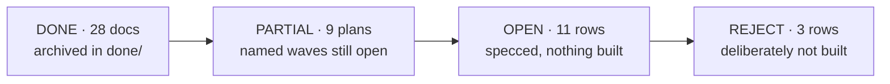

# Plans — the whole portfolio, one page

**Reconciled 2026-08-22** against `master` @ `3a1b30a5` — every row below was checked against git
(is the branch an ancestor of master?) and against the tree (does the code the plan describes exist?),
not against the plan's own status line. Several plans still claim "unbuilt" while their work is merged;
this file, not the plan header, is the status authority.

Row-level *capability* backlog lives in [`docs/main/MASTER-MATRIX.md`](../main/MASTER-MATRIX.md).
This file is one level up: the state of each **plan document**.

**Why done plans are kept, not deleted.** 640 source files cite these documents by path in
javadoc/TSDoc. They stopped being plans and became reference documentation — deleting one turns
working javadoc into a lie. On 2026-08-22 the 28 finished docs were archived `active/` → `done/`
with a scripted repoint of every citation in the same commit; the `CODE` column is what that cost.

---

## 1. DONE — merged to `master`, archived in [`done/`](done/)

| Plan | Merge | What shipped | CODE |
|---|---|---|---:|
| VISUAL-GEO-V2-PLAN | `d087903d` | heavy-A visual geolocation, corrected track; ships **off** | 134 |
| FIXED-CAMERA-GEO-PLAN + DEMO | `554fc105` | S2: fixed camera pose → tracked object → map coordinate | 70 |
| SYSTEM-STATUS-PLAN | `329754b7` | the running system is legible to its operator | 60 |
| OPS-UX-PLAN (A–C) | `b435838c` | authority ≠ visibility; `canAdminister`/`canManage` on `VisibilityScope` | 52 |
| CV-DEMAND-PLAN | `b435838c` | detection is opt-in **and** demand-gated | 49 |
| MEDIA-SOT-PLAN | `1bece62d` | mediamtx is the video source of truth; M0–M9, re-measured | 47 |
| STREAM-STATE-PLAN (+CONTEXT) | `c5dfa59f` | a stream has a state; detection intent is readable | 42 |
| CV-CLEAN-FEED-PLAN | `2484d6ab` | burn-in deleted, `labelDenyFilter`, priority tiers, one Vision drawer | 38 |
| POSTGRES-ONLY-CONTEXT | `72fae57e` | Postgres + Flyway is the only store; in-memory repos gone | 32 |
| SCALE-100-PLAN (+CONTEXT) | `72fae57e` | Bands A+B: 20–100 users on one JVM (rate limiter ships OFF) | 29 |
| AFTER-ACTION-PLAN | `bb21af1b` | evidence package that cannot quietly omit (`PRESENT/ABSENT/TRUNCATED/FORBIDDEN`) | 23 |
| CV-RATE-CONTROL-PLAN | — | R1–R4: closed rate loop, adaptive rate, BGR24 wire | 21 |
| LIVE-SCOPE-PLAN | `180b68fa` | W1–W6: the live plane asks who is asking; ArchUnit `@OpenByDesign` guard | 19 |
| GEO-POSE-PLAN | `6ec9e6f5` | AMSL-as-AGL unit bug fixed; attitude/gimbal decoded | 18 |
| TRACKING-V2-PLAN | `56c7354d` | C0–C5: identity owned by cv-service, not a ByteTrack side effect | 14 |
| CV-PANEL-SPLIT-PLAN | `65b0d56f` | Vision panel → side panel (flying) + setup modal | 13 |
| TRACK-IDENTITY-PLAN (+RESEARCH) | `2484d6ab` | L1–L4: label election, association gates, SPA stability, FOLLOW memory | 11 |
| CV-UX-RESEARCH | — | superseded in layout by CV-PANEL-SPLIT; its tiering shipped | 10 |
| RC-LATENCY-PLAN | `cb16d0dd` | send-on-arrival: ~39 ms → ~9 ms; `rateHz` read live | 9 |
| CV-FLY-INTERACTION-RESEARCH | — | D1–D9 executed by CV-CLEAN-FEED | 9 |
| IA-TRUTH-PLAN | `329754b7` | navigation stops contradicting itself | 3 |
| MODULE-LAYOUT-PROPOSAL | `965fc98b` | adapters/libs → responsibility folders | 2 |
| DEAD-CODE-AUDIT | `985bf4c8` | K4: 338 types, 337 live, 1 orphan — `TrackedObject` has no sibling | 0 |

Retired 2026-08-22 (merged session scratchpads, zero code citations): `AFTER-ACTION-CONTEXT`,
`CV-FLY-INTERACTION-CONTEXT`, `DRONE-ONBOARDING-CONTEXT`, `FIXED-CAMERA-GEO-CONTEXT`,
`MAVLINK-CORE-CONTEXT`, `MEDIA-SOT-CONTEXT`, `TRACK-IDENTITY-CONTEXT`,
`VISUAL-GEO-RESEARCH-CONTEXT`, `PLAN-DOCS-AUDIT` (superseded by this file).

---

## 2. PARTIAL — merged, with named waves still open

| Plan | Merged | Still open | CODE |
|---|---|---|---:|
| DRONE-ONBOARDING-PLAN | O1–O8, O11–O14 (`aa426859`), all behind `vision.onboarding.*.enabled=false` | **O9/O10** — operator-gated, need an explicit go | 107 |
| DOMAIN-SEPARATION-W1 / -PLAN | **W1** (`00879827`) — 8 contexts are Maven modules | **W2** broker + live plane · **W3** worker role + leases · **W4** learning extraction · **W5** sim node | 51 / 2 |
| MAVLINK-CORE-PLAN | W0–W4 (`7e80746d`) — `drone-link/mavlink-core`, adapter rewired, SITL green | **W5** message-rate + link health (the first user-visible payoff) · **W6** Parameter/Mission | 22 |
| TRACKING-V3-PLAN + BAND1-CONTEXT | V1–V7 and band 1 (`331a6a77`) — levelled L1–L4 ladder wired end to end | §6b **O1–O5** — all need real aerial footage with frames to resolve | 6 / 25 |
| RC-CONTROL-PLAN | Phase 0 (`c1cf9fe`) + Phase 1 (`2b65ceb`) — SITL only | **Phase 2** (real airframe) — gated on explicit user go | 6 |
| VEHICLE-CONTROL-PROFILES-CONTEXT | P1–P6 **built, not merged** — branch `feat/vehicle-control-profiles`: per-airframe stick layouts (a copter's throttle rests at idle, a rover's at stop) + on-screen control, so a browser no longer needs a USB gamepad | live drive of a real vehicle — operator-gated | 35 |
| CONTROLLER-SETUP-CONTEXT | C1–C15 **built, on master** (C15 landed as `e2e12820`), on top of VEHICLE-CONTROL-PROFILES: the operator binds every stick, button and switch themselves (`/manage/controller`), switches fire real MAVLink commands, `/fly`'s mode + arm/disarm moved into the Controller drawer, and the page now draws the transmitter, guides the binding function-by-function, and shows the live CH1–CH8 microseconds leaving the station. **Stick modes 1–4** are supported and stored on the profile (C15) | live-fly verification — operator-gated · **calibration (C12)** deliberately deferred · expo out of scope · dark theme never looked at | 63 |
| ROVER-FIRMWARE-ALIGNMENT-CONTEXT | **built, not merged** — branch `feat/controller-setup-c15` (harness) plus the ESP32 sketch at `~/Arduino/ardupoilot-start`, **outside this repo**: the rover now answers the parameter protocol, `REQUEST_MESSAGE`, `SET_MESSAGE_INTERVAL`, `DO_AUX_FUNCTION` and `AUTOPILOT_VERSION`, refuses every navigation mode honestly (no GPS), and stages every reversal through a speed-scaled coast so the bridge never drives a spinning armature. `make commands` in `infra/rover-sim/` checks the lot against pymavlink | **no motor has turned** — every timing is measured on the host against captured LEDC writes, and the thermal claim is reasoning, not a measurement; also never driven end to end from the app since the command surface landed | 4* |
| CV-SCALE-PLAN | goals 1–4 shipped via CV-CONTROL / CV-MODELS / CV-DEMAND / MEDIA-SOT | **goal 5** — a pool of 2–5 CV workers with failover. No pool exists; `GrpcCvSettings` is single-target | 0 |
| LAYERING-REFACTOR-PLAN | conventions in force repo-wide (`f13d1ebf`) | **matrix K3** — the class decompositions. `StreamPipeline` is now **1530 lines** (927 when the row was written); `DefaultSimulationService` 765 | 103 |
| CV-RECONNECT-PLAN | R1/R2 (`58fddf10`) — `CvChannelSupervisor` bounds recovery to ~20 s | **R3** — `GET /api/cv/status` + live badge | 20 |
| FLEET-MIGRATION-PLAN (+CONTEXT) | **T1** done by other plans — T1.a HikariCP (SCALE-100 S3), T1.b `JpaAuditTrail` (POSTGRES-ONLY) | **T1.c** telemetry latest-window read · **T2** NATS/JetStream (no NATS in the tree) · **T3** fleet command · **T4** mission slice · **T5** leases · **T6** link-ops UI | 0 |

---

## 3. OPEN — specced, nothing built

Ranked by [`PLATFORM-AUDIT-FINDINGS.md`](active/PLATFORM-AUDIT-FINDINGS.md), the newest survey
(2026-08-21). Its actions **1–4 are now closed by LIVE-SCOPE**; 5–12 are the live queue.

| # | Work | Plan doc | Effort | Why now |
|---|---|---|---|---|
| S | **One generic way to add a vehicle**, with either half simulatable — the five Connect tiles are already two ways plus three address-finders; `engage`/`disengage` replaces "a session is a video stream" | SOURCE-ONBOARDING-CONTEXT | M | An operator cannot add video without telemetry or telemetry without video. Wave S1 alone fixes that, and half of it is wiring a method that already exists with **zero callers** (`UsageTracker#onTelemetryDeviceDiscovered`) |
| 5 | Retention + partitioning on the detection/telemetry firehoses; unwire the accidental `db_audit_log` amplification | PLATFORM-AUDIT-DB §2 | M | ~222 GB/yr per 10 assets, nothing is ever deleted. **Free today because the tables are empty**; a maintenance window after the first month of flying |
| 6 | `AssetUsage.pilot` + a geo column on detections | PLATFORM-AUDIT-DB | S | Two columns make "who flew this" and "every detection of class X near Y" answerable |
| 7 | OpenAPI contract + machine API tokens | — (unwritten) | S | `ARCHITECTURE.md` §2 cites an `openapi.yaml` **that does not exist**; prerequisite for 8/9/11 |
| 8 | Webhook + MQTT v5 egress | — (unwritten) | S | The one row where we are alone at *missing* against all 8 analogs |
| 9 | KML/KMZ + GeoJSON + GPX import/export | — (unwritten) | S | Operators already live in these formats |
| 10 | Crew: `AssignmentRole{PIC,OBSERVER}` + TTL control claim | [CREW-CONTROL-PLAN](active/CREW-CONTROL-PLAN.md) (455 lines, CC-1…CC-6) | M | Two pilots can command one aircraft today. LIVE-SCOPE deliberately left arbitration to this plan |
| 11 | CoT egress + 2525/APP-6 symbols | PLATFORM-AUDIT-ANALOGS | M | The only self-service door into the defence lane; unblocked now that track-identity merged |
| 12 | Alert rules + acknowledge; per-asset retention; self-hosted basemap | PLATFORM-AUDIT-ANALOGS | M | Closes the VMS-maturity gap |
| — | **Operator control** — TX12/EdgeTX, generalized over ArduPilot/INAV/Betaflight | [OPERATOR-CONTROL-CONTEXT](active/OPERATOR-CONTROL-CONTEXT.md) — decisions D1–D13; **G4/G5/G7/G11 + D4(part)/D5/D6 now closed by CONTROLLER-SETUP-CONTEXT** (built, unmerged), the rest still unplanned | M | Carries two verified latent bugs: **G13** chan 9–16 release sentinel is `65534`, not `0` · **G14** we never check `SYSID_MYGCS`, so overrides can be dropped in silence |
| — | Fleet infrastructure (link hardware, multi-vehicle ingest, edge kits) | [DRONE-INFRA-PLAN](active/DRONE-INFRA-PLAN.md) — draft | L | Hardware-gated: H1 camera then an ArduPilot rover ([TWO-TARGETS-PLAN](../main/TWO-TARGETS-PLAN.md)) |
| — | Event topology (subject taxonomy, layer rules) | [EVENT-TOPOLOGY-PROPOSAL](active/EVENT-TOPOLOGY-PROPOSAL.md) — **accepted**, folded into FLEET-MIGRATION as MD8 | — | Reference only; do not schedule separately |

**Hardware-gated, not build-gated:** real-camera glass-to-glass and the clock-drift re-measurement
(MEDIA-SOT §6), the FOLLOW measurements TRACKING-V3 §6b needs, and the occlusion/follow-lock demo
TRACKING-PLAN §10 never claimed. All wait on the H1 camera, not on a wave.

---

## 4. REJECT — deliberately not built

| Row | Verdict | Reason |
|---|---|---|
| **Mission execution / waypoint upload** — [MISSIONS-PLAN](active/MISSIONS-PLAN.md) (464 lines, XL) + MISSIONS-CONTEXT | **Contested — reconcile in writing before anyone starts** | MOAT §6 and MASTER-MATRIX B9/M3 both mark it **NO** (QGC does it free), while MISSIONS-PLAN answers MAVLINK-CORE §9 Q2 with "sooner". Build mission **tasking** + `.plan` import/export instead of execution |
| Emitting MISB KLV / STANAG 4609 | **NO** | mediamtx drops KLV on RTSP read (upstream #5612); the KLV PR closed unmerged. Consume KLV, never promise emission |
| Becoming a VMS / ONVIF Profile M **device** | **NO** | Client ONVIF is a week; conformant device is membership + tooling, and chasing Milestone abandons the rows where we are alone |

---

## 5. Conventions

- A plan doc is **not** deleted or moved once code cites it — citations are by path. Any move is a
  scripted `sed` sweep over the whole repo **in the same commit** (the `docs-organization` rule).
- `*-CONTEXT.md` files are per-session working notes. Once their work is merged and no source file
  cites them, they are disposable — retire them and repair the inbound `.md` links in the same pass.
- A **CODE** count marked `*` counts citations that live **outside this repo** (the ESP32 sketch in the
  Arduino sketchbook), so the scripted-move rule cannot reach them — moving that doc means editing the
  firmware by hand.
- `*-DEMO.md` files are **evidence**: a record of what was actually executed, including what was not.
  They outlive their plan and are kept.
