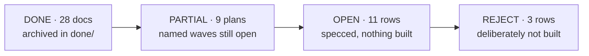

# Plans — the whole portfolio, one page

**Reconciled 2026-08-22** against `master` @ `3a1b30a5` — every row below was checked against git
(is the branch an ancestor of master?) and against the tree (does the code the plan describes exist?),
not against the plan's own status line. Several plans still claim "unbuilt" while their work is merged;
this file, not the plan header, is the status authority.

**Spot-reconciled 2026-08-26** against `master` @ `212311e0`: the two control rows in §2 read
"built, not merged" and both branches are in fact ancestors of `master`. Corrected in place — see
[`ARCHITECTURE-AUDIT-2026-08-26.md`](active/ARCHITECTURE-AUDIT-2026-08-26.md) §7 finding P2. No
other row was re-checked in that pass.

Row-level *capability* backlog lives in [`docs/main/MASTER-MATRIX.md`](../main/MASTER-MATRIX.md).
This file is one level up: the state of each **plan document**.

**Why done plans are kept, not deleted.** 640 source files cite these documents by path in
javadoc/TSDoc. They stopped being plans and became reference documentation — deleting one turns
working javadoc into a lie. On 2026-08-22 the 28 finished docs were archived `active/` → `done/`
with a scripted repoint of every citation in the same commit; the `CODE` column is what that cost.

---

## 1. DONE — merged to `master`, archived in [`done/`](done/)

| Plan | Merge | What shipped | CODE |
|---|---|---|---:|
| VISUAL-GEO-V2-PLAN | `d087903d` | heavy-A visual geolocation, corrected track; ships **off** | 134 |
| FIXED-CAMERA-GEO-PLAN + DEMO | `554fc105` | S2: fixed camera pose → tracked object → map coordinate | 70 |
| SYSTEM-STATUS-PLAN | `329754b7` | the running system is legible to its operator | 60 |
| OPS-UX-PLAN (A–C) | `b435838c` | authority ≠ visibility; `canAdminister`/`canManage` on `VisibilityScope` | 52 |
| CV-DEMAND-PLAN | `b435838c` | detection is opt-in **and** demand-gated | 49 |
| MEDIA-SOT-PLAN | `1bece62d` | mediamtx is the video source of truth; M0–M9, re-measured | 47 |
| STREAM-STATE-PLAN (+CONTEXT) | `c5dfa59f` | a stream has a state; detection intent is readable | 42 |
| CV-CLEAN-FEED-PLAN | `2484d6ab` | burn-in deleted, `labelDenyFilter`, priority tiers, one Vision drawer | 38 |
| POSTGRES-ONLY-CONTEXT | `72fae57e` | Postgres + Flyway is the only store; in-memory repos gone | 32 |
| SCALE-100-PLAN (+CONTEXT) | `72fae57e` | Bands A+B: 20–100 users on one JVM (rate limiter ships OFF) | 29 |
| AFTER-ACTION-PLAN | `bb21af1b` | evidence package that cannot quietly omit (`PRESENT/ABSENT/TRUNCATED/FORBIDDEN`) | 23 |
| CV-RATE-CONTROL-PLAN | — | R1–R4: closed rate loop, adaptive rate, BGR24 wire | 21 |
| LIVE-SCOPE-PLAN | `180b68fa` | W1–W6: the live plane asks who is asking; ArchUnit `@OpenByDesign` guard | 19 |
| GEO-POSE-PLAN | `6ec9e6f5` | AMSL-as-AGL unit bug fixed; attitude/gimbal decoded | 18 |
| TRACKING-V2-PLAN | `56c7354d` | C0–C5: identity owned by cv-service, not a ByteTrack side effect | 14 |
| CV-PANEL-SPLIT-PLAN | `65b0d56f` | Vision panel → side panel (flying) + setup modal | 13 |
| TRACK-IDENTITY-PLAN (+RESEARCH) | `2484d6ab` | L1–L4: label election, association gates, SPA stability, FOLLOW memory | 11 |
| CV-UX-RESEARCH | — | superseded in layout by CV-PANEL-SPLIT; its tiering shipped | 10 |
| RC-LATENCY-PLAN | `cb16d0dd` | send-on-arrival: ~39 ms → ~9 ms; `rateHz` read live | 9 |
| CV-FLY-INTERACTION-RESEARCH | — | D1–D9 executed by CV-CLEAN-FEED | 9 |
| IA-TRUTH-PLAN | `329754b7` | navigation stops contradicting itself | 3 |
| MODULE-LAYOUT-PROPOSAL | `965fc98b` | adapters/libs → responsibility folders | 2 |
| DEAD-CODE-AUDIT | `985bf4c8` | K4: 338 types, 337 live, 1 orphan — `TrackedObject` has no sibling | 0 |

Retired 2026-08-22 (merged session scratchpads, zero code citations): `AFTER-ACTION-CONTEXT`,
`CV-FLY-INTERACTION-CONTEXT`, `DRONE-ONBOARDING-CONTEXT`, `FIXED-CAMERA-GEO-CONTEXT`,
`MAVLINK-CORE-CONTEXT`, `MEDIA-SOT-CONTEXT`, `TRACK-IDENTITY-CONTEXT`,
`VISUAL-GEO-RESEARCH-CONTEXT`, `PLAN-DOCS-AUDIT` (superseded by this file).

---

## 2. PARTIAL — merged, with named waves still open

| Plan | Merged | Still open | CODE |
|---|---|---|---:|
| MAVLINK-COMMANDS-PLAN | **built on `feat/mavlink-command-control`, unmerged** (2026-09-01, 12 commits): R1–R4+O1 research corpus · F0–F4 firmware hardening (harness repaired incl. dark `make motors`/`make session`, esp_task_wdt, dtMs clamp, network-down failsafe pinned, learned-peer command gate + TX STATUSTEXT) · P1–P4 command surface (force-arm magic 2989 defect fix, 700ms×3 bounded retries wired to production, stream negotiation on claim, onLinkFailure pinned) · W1–W2 keyboard ops (Space e-stop, Shift+Enter hold-arm, mode digits, transmitter-view key map) | merge to master · **F1 WDT bench reset test — operator, powered hardware** · live rover drive — operator-gated · `capabilities()` ← CapabilityReport wiring · stream ids/rates not yet in VisionMavlinkProperties · MAVLink signing (own effort) | — |
| DRONE-ONBOARDING-PLAN | O1–O8, O11–O14 (`aa426859`), all behind `vision.onboarding.*.enabled=false` | **O9/O10** — operator-gated, need an explicit go | 107 |
| DOMAIN-SEPARATION-W1 / -PLAN | **W1** (`00879827`) — 8 contexts are Maven modules | **W2** broker + live plane · **W3** worker role + leases · **W4** learning extraction · **W5** sim node | 51 / 2 |
| MAVLINK-CORE-PLAN | W0–W4 (`7e80746d`) — `drone-link/mavlink-core`, adapter rewired, SITL green | **W5** message-rate + link health (the first user-visible payoff) · **W6** Parameter/Mission | 22 |
| TRACKING-V3-PLAN + BAND1-CONTEXT | V1–V7 and band 1 (`331a6a77`) — levelled L1–L4 ladder wired end to end | §6b **O1–O5** — all need real aerial footage with frames to resolve | 6 / 25 |
| RC-CONTROL-PLAN | Phase 0 (`c1cf9fe`) + Phase 1 (`2b65ceb`) — SITL only | **Phase 2** (real airframe) — gated on explicit user go | 6 |
| VEHICLE-CONTROL-PROFILES-CONTEXT | P1–P6 **merged to master** (re-checked 2026-08-26: `feat/vehicle-control-profiles` is an ancestor of `master`; the row previously read "built, not merged"): per-airframe stick layouts (a copter's throttle rests at idle, a rover's at stop) + on-screen control, so a browser no longer needs a USB gamepad | live drive of a real vehicle — operator-gated | 35 |
| CONTROLLER-SETUP-CONTEXT | C1–C8 **merged to master** (re-checked 2026-08-26: `feat/controller-setup` is an ancestor of `master`; the row previously read "built, not merged"), on top of VEHICLE-CONTROL-PROFILES: the operator binds every stick, button and switch themselves (`/manage/controller`), switches fire real MAVLink commands, and `/fly`'s mode + arm/disarm moved into the Controller drawer | live-fly verification — operator-gated · **calibration (C12)** deliberately deferred · TX modes 1/3/4 and expo out of scope | 63 |
| OPERATOR-UX-7-PLAN | W1–W3 + sweeps **merged to master** (2026-08-29): pre-flight board triages Your vehicles / Simulated, `Not probed yet` / `No telemetry device` verdicts, `NOT PROBED` stat, 'vehicles' not 'drones'; bell unread = since mount, read ids persisted (no more permanent `9+`); events rail hides removed-device history behind `Include removed devices (n)`, one chip per row; `/devices` names the other devices bound to the same udp/tcp endpoint | pre-flight board N+1 `getAsset` · board cannot distinguish never-probed from all-unknown | — |
| OPERATOR-UX-6-PLAN | W1–W3 + sweeps **merged to master** (2026-08-29): replay page leads with map + video + transport, evidence package last and collapsed; `Built for Station`, `200 entries`, session (not flight) vocabulary; the dark-theme `night` basemap works again (OSM + tile-pane filter owned by the tile layer, cache keyed by host — Carto now needs a key); trails drop Null Island; readiness says `Not probed yet` and disables `Probe now` for an offline vehicle with the reason; `/org` opens on the roster, create forms behind a button | `UsageSummary` last-activity time · replay library has no per-kind vocabulary | — |
| OPERATOR-UX-5-PLAN | W1–W3 **merged to master** (2026-08-29): idle usages close at their last activity (`vision.usage.idle-close`/`sweep-period`, runner in vision-app — the only recovery for a crashed stream); replay reads `Open · last sample 4d ago`/`No samples` instead of `Flying now`; station verdict names the subsystem (`Degraded — CV inference down`); toasts only for post-mount events on streaming assets; UUIDs in activity/audit prose → names, root actor `Station`; `/assets` triage order + Last seen | wire has no usage last-activity time · `/assets` column sort | — |
| OPERATOR-UX-4-PLAN | W1–W5 **merged to master** (2026-08-29): a no-fix position is no position (web `hasFix` + mavlink records lat/lon only with ≥2D fix), one attention verdict per asset on `/command` (rail = panel; gps/stale/breach reasons live-only), Command rail triages like `/fly` (shared `core/fleet/triage-logic.ts`), every age via `humanAge`, `Removed device · id` in alerts, coming-soon pages inside the page frame | bell replays a historic breach toast on load · `/fly` picker POSITION for offline sims | — |
| OPERATOR-UX-3-PLAN | H1 + T1 + P1 **merged to master** (2026-08-28): stale telemetry never reads as live (OSD `LAST KNOWN · 4d 2h`, `ARMED?`, neutral drawer chip, cockpit not-streaming card); `/fly` index groups Your vehicles / Simulated with `Hide simulated`, sorted streaming → last seen, chips carry the age; pre-flight names the first blocker + `+N`, worst-first, verdict cards filter | simulated is still a category fact, not a device fact (SOURCE-ONBOARDING-CONTEXT §4) | — |
| CONTROLLER-UX-PLAN | X1–X5 + cycle 2 (K keyboard source, R readiness rows, M mode names) **merged to master** (2026-08-28): `/fly` Controller drawer is a live transmitter picture (pads with rest marks, switch gauges showing position + what they fire, "also on SB ↑" next to Mode/Arm, sticky Take-control footer); `/manage/controller` is a numbered step sequence (Throttle → … → Arm → Mode → Extras → Review) with detect-on-open, prose direction/rest tiles, channels under Advanced, old editor kept as "All controls" | live check on a real radio · both-theme screenshots of the drawer inside `.surface-dark` (agent could not capture) · Mode step has no real mode-name source (free text) | — |
| CV-SCALE-PLAN | goals 1–4 shipped via CV-CONTROL / CV-MODELS / CV-DEMAND / MEDIA-SOT | **goal 5** — a pool of 2–5 CV workers with failover. No pool exists; `GrpcCvSettings` is single-target | 0 |
| LAYERING-REFACTOR-PLAN | conventions in force repo-wide (`f13d1ebf`) | **matrix K3** — the class decompositions. `StreamPipeline` is now **1530 lines** (927 when the row was written); `DefaultSimulationService` 765 | 103 |
| CV-RECONNECT-PLAN | R1/R2 (`58fddf10`) — `CvChannelSupervisor` bounds recovery to ~20 s | **R3** — `GET /api/cv/status` + live badge | 20 |
| FLEET-MIGRATION-PLAN (+CONTEXT) | **T1** done by other plans — T1.a HikariCP (SCALE-100 S3), T1.b `JpaAuditTrail` (POSTGRES-ONLY) | **T1.c** telemetry latest-window read · **T2** NATS/JetStream (no NATS in the tree) · **T3** fleet command · **T4** mission slice · **T5** leases · **T6** link-ops UI | 0 |

---

## 3. OPEN — specced, nothing built

Ranked by [`PLATFORM-AUDIT-FINDINGS.md`](active/PLATFORM-AUDIT-FINDINGS.md), the *capability* survey
(2026-08-21). Its actions **1–4 are now closed by LIVE-SCOPE**; 5–12 are the live queue.

**A newer, structural survey sits beside it:**
[`ARCHITECTURE-AUDIT-2026-08-26.md`](active/ARCHITECTURE-AUDIT-2026-08-26.md) — domain, module
structure, user↔asset access, session flow and service topology, with recommendations R1–R10. It
ranks *how the system is built*, where PLATFORM-AUDIT ranks *what it can do*; the two queues are
independent. Its R1 (delete the N-1 constructor convention), R2 (`engage`/`disengage` — the same
work as row **S** below, **DONE 2026-08-26**, wave R2, see the R2 row in that doc's own §9 table and
`SOURCE-ONBOARDING-CONTEXT.md` §12) and R5 (no cross-context repository-port reads, a precondition
for DOMAIN-SEPARATION W2) are the three that gate other work.

| # | Work | Plan doc | Effort | Why now |
|---|---|---|---|---|
| Z | **Zero-config onboarding** — devices announce (PX4 broadcast-until-heard on :14550, standing lobby gateway), streams push to mediamtx (path = identity, `runOnAvailable` hook), a persisted Discovery Inbox with one-click `createFromCandidate` (today: 0 callers), Improv Wi-Fi provisioning from the browser; Z1 closes TELEMETRY-ONLY B4 (`engage` opens telemetry, so commands stop requiring a *video* stream) | [ZERO-CONFIG-ONBOARDING-CONTEXT](active/ZERO-CONFIG-ONBOARDING-CONTEXT.md) — **Z1–Z5 MERGED to master 2026-09-01** (`7356275a`; every scoped gate green; live smoke green — heartbeat→card→register→engage→arm ACK, §12); Z6 firmware open | L | TELEMETRY-ONLY §B4 closed (engage opens telemetry); lobby + inbox ship **on** by default — vision binds :14550 at boot; composes with row S's open S2–S5 |
| S | **One generic way to add a vehicle**, with either half simulatable — the five Connect tiles are already two ways plus three address-finders; `engage`/`disengage` replaces "a session is a video stream" (**S1 DONE 2026-08-26** — `POST`/`DELETE /api/assets/{id}/session`; `onTelemetryDeviceDiscovered` was **deleted**, not wired, see §12 of the plan doc) | [SOURCE-ONBOARDING-CONTEXT](active/SOURCE-ONBOARDING-CONTEXT.md) | M | S2-S5 (device origin, fit-out table UI, delete `simulated` category) remain open |
| W | **Warehouse + sidebar** — **MERGED to master 2026-08-30**: `Identity`/`Custody`/`InventoryState` beside `LifecycleState`, `MaintenanceRecord` grounds a vehicle (readiness NO-GO, engage refuses), passive equipment via `category.connected`, V28; one Inventory page (Vehicles · Equipment · Links · Categories, CSV export), five-group rail 25→18 with 0 stubs, wizard Identify→fit-out→Prove→Register→Hand over, Maintenance (one-call `GET /api/maintenance`) + Crew pages, Firmware/Hours columns | [WAREHOUSE-UX-PLAN](active/WAREHOUSE-UX-PLAN.md) | M–L | Open: Reports' attention list, `documents` table |
| CV | **CV settings** — **MERGED to master 2026-08-30**: profile hierarchy org→category→asset in Postgres+cache resolved at stream start, one model registry (DRAFT/CANDIDATE/LIVE/RETIRED, promote/rollback, availability), persisted training runs ⇒ CANDIDATE, `/vision/profiles` page, cockpit stops dual-writing localStorage, registry behind `vision.cv.registry.enabled` | [CV-SETTINGS-PLAN](active/CV-SETTINGS-PLAN.md) | L | Deferred: YOLOE class prompts, held-out eval, ModelRegistryPort stage/metrics widening |
| 5 | Retention + partitioning on the detection/telemetry firehoses; unwire the accidental `db_audit_log` amplification | PLATFORM-AUDIT-DB §2 | M | ~222 GB/yr per 10 assets, nothing is ever deleted. **Free today because the tables are empty**; a maintenance window after the first month of flying |
| 6 | `AssetUsage.pilot` + a geo column on detections | PLATFORM-AUDIT-DB | S | Two columns make "who flew this" and "every detection of class X near Y" answerable |
| 7 | OpenAPI contract + machine API tokens | — (unwritten) | S | `ARCHITECTURE.md` §2 cites an `openapi.yaml` **that does not exist**; prerequisite for 8/9/11 |
| 8 | Webhook + MQTT v5 egress | — (unwritten) | S | The one row where we are alone at *missing* against all 8 analogs |
| 9 | KML/KMZ + GeoJSON + GPX import/export | — (unwritten) | S | Operators already live in these formats |
| 10 | Crew: `AssignmentRole{PIC,OBSERVER}` + TTL control claim | [CREW-CONTROL-PLAN](active/CREW-CONTROL-PLAN.md) (455 lines, CC-1…CC-6) | M | Two pilots can command one aircraft today. LIVE-SCOPE deliberately left arbitration to this plan |
| 11 | CoT egress + 2525/APP-6 symbols | PLATFORM-AUDIT-ANALOGS | M | The only self-service door into the defence lane; unblocked now that track-identity merged |
| 12 | Alert rules + acknowledge; per-asset retention; self-hosted basemap | PLATFORM-AUDIT-ANALOGS | M | Closes the VMS-maturity gap |
| R | **The radio layer, for copter *and* rover** — 19 verified findings F0–F18, waves R0–R7. **R0 done** (`5c51fe8f`: readiness was a constant `NO_GO` on every ArduPilot vehicle), **R7 infra done** (`10824c0e`: a real ArduRover boots in the SITL fleet) | [FLEET-RADIO-PLAN](active/FLEET-RADIO-PLAN.md) | M | Owns and schedules OPERATOR-CONTROL's two latent bugs below, plus: CH9–16 are bound in the UI and dropped on the wire, three divergent `MAV_TYPE` tables, and an `emergencyStop` that force-disarms a rover. Copter and rover only — submarine and geo are out by instruction |
| — | **Operator control** — TX12/EdgeTX, generalized over ArduPilot/INAV/Betaflight | [OPERATOR-CONTROL-CONTEXT](active/OPERATOR-CONTROL-CONTEXT.md) — decisions D1–D13; **G4/G5/G7/G11 + D4(part)/D5/D6 now closed by CONTROLLER-SETUP-CONTEXT** (built, unmerged), the rest still unplanned | M | Two verified latent bugs, both now **scheduled by FLEET-RADIO-PLAN** rather than merely recorded: **G13** chan 9–16 release sentinel is `65534`, not `0` (= F4, wave R3) · **G14** we never check `SYSID_MYGCS`, so overrides can be dropped in silence (= F5, wave R6) |
| — | Fleet infrastructure (link hardware, multi-vehicle ingest, edge kits) | [DRONE-INFRA-PLAN](active/DRONE-INFRA-PLAN.md) — draft | L | Hardware-gated: H1 camera then an ArduPilot rover ([TWO-TARGETS-PLAN](../main/TWO-TARGETS-PLAN.md)) |
| — | Event topology (subject taxonomy, layer rules) | [EVENT-TOPOLOGY-PROPOSAL](active/EVENT-TOPOLOGY-PROPOSAL.md) — **accepted**, folded into FLEET-MIGRATION as MD8 | — | Reference only; do not schedule separately |

**Hardware-gated, not build-gated:** real-camera glass-to-glass and the clock-drift re-measurement
(MEDIA-SOT §6), the FOLLOW measurements TRACKING-V3 §6b needs, and the occlusion/follow-lock demo
TRACKING-PLAN §10 never claimed. All wait on the H1 camera, not on a wave.

---

## 4. REJECT — deliberately not built

| Row | Verdict | Reason |
|---|---|---|
| **Mission execution / waypoint upload** — [MISSIONS-PLAN](active/MISSIONS-PLAN.md) (464 lines, XL) + MISSIONS-CONTEXT | **Contested — reconcile in writing before anyone starts** | MOAT §6 and MASTER-MATRIX B9/M3 both mark it **NO** (QGC does it free), while MISSIONS-PLAN answers MAVLINK-CORE §9 Q2 with "sooner". Build mission **tasking** + `.plan` import/export instead of execution |
| Emitting MISB KLV / STANAG 4609 | **NO** | mediamtx drops KLV on RTSP read (upstream #5612); the KLV PR closed unmerged. Consume KLV, never promise emission |
| Becoming a VMS / ONVIF Profile M **device** | **NO** | Client ONVIF is a week; conformant device is membership + tooling, and chasing Milestone abandons the rows where we are alone |

---

## 5. Conventions

- A plan doc is **not** deleted or moved once code cites it — citations are by path. Any move is a
  scripted `sed` sweep over the whole repo **in the same commit** (the `docs-organization` rule).
- `*-CONTEXT.md` files are per-session working notes. Once their work is merged and no source file
  cites them, they are disposable — retire them and repair the inbound `.md` links in the same pass.
- `*-DEMO.md` files are **evidence**: a record of what was actually executed, including what was not.
  They outlive their plan and are kept.
