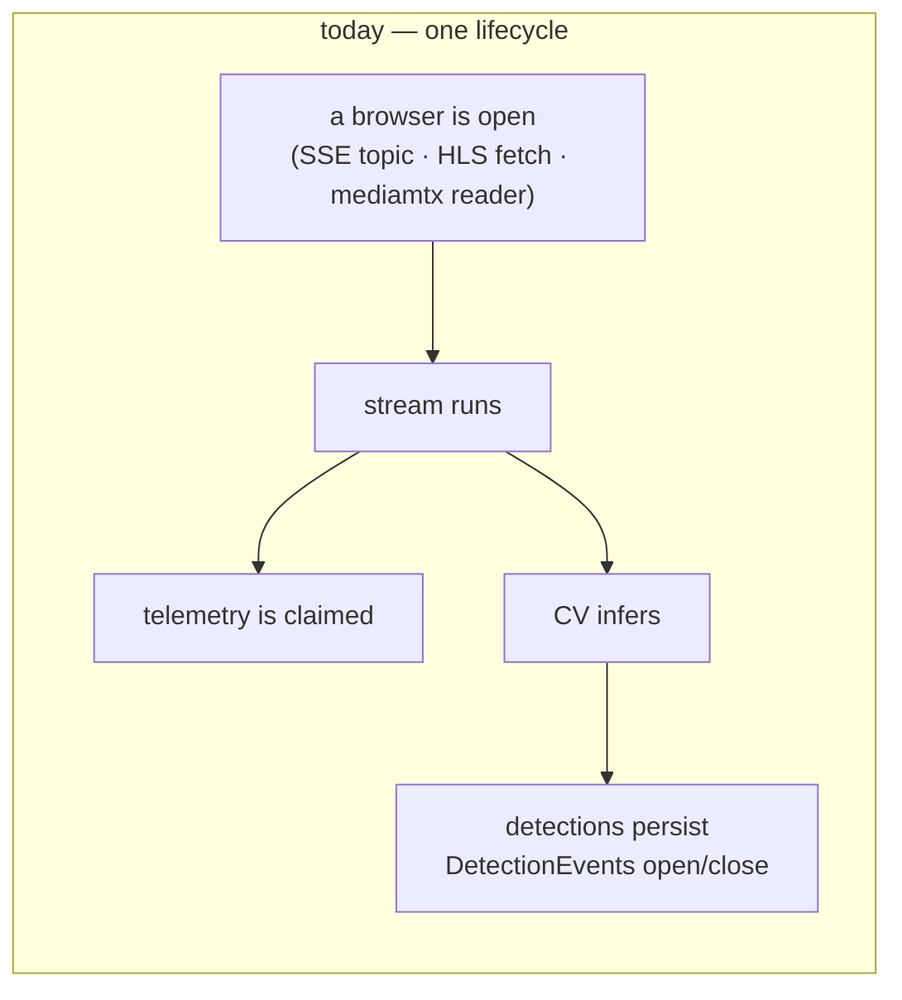
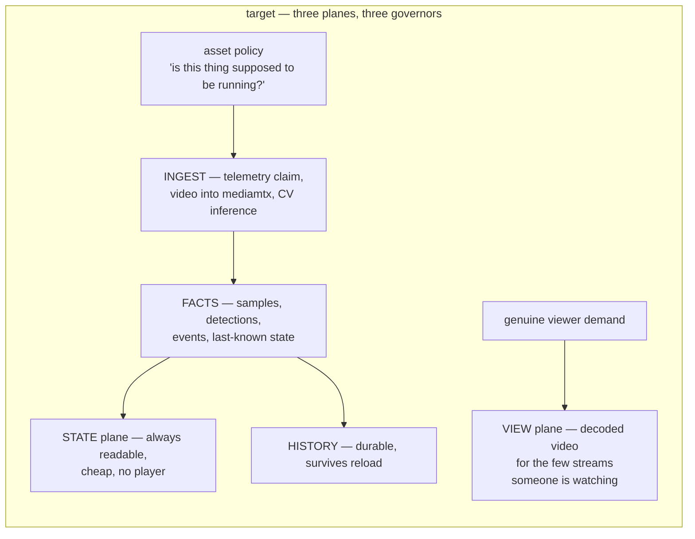
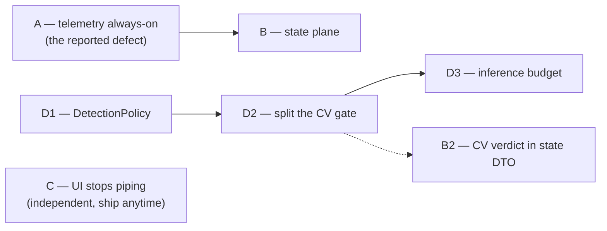

# ALWAYS-ON-FLOW — the ingest plane runs, the view plane is asked for

Status: **wave A BUILT 2026-09-06 (ships off); B/C/D SPEC.** Context + verification:
[`ALWAYS-ON-FLOW-CONTEXT.md`](ALWAYS-ON-FLOW-CONTEXT.md).
Follows [`E2E-FLOW-AUDIT-2026-09-05.md`](E2E-FLOW-AUDIT-2026-09-05.md), whose S1/U1/N2 shipped the same day.

Owner ask, in one line: *telemetry must be an always-on flow; the app should show state and history
rather than hand every user a live pipe into every stream; mediamtx can take many streams, the UI
cannot; and CV must be aligned to the same flow.*

---

## 1. The one defect behind all four complaints

Three different concerns share a single lifecycle today:

Close the tab and the chain unwinds from the left: after 10 minutes `IdleStreamReaper` stops the
stream, `UsageTracker` closes the usage, and telemetry unsubscribes. CV stopped 30 seconds after the
tab closed, and with it every durable detection and every unattended alert.

**The inversion this plan makes:**

| Plane | Governed by | Today |
|---|---|---|
| **Ingest** | the asset's own policy | whether a browser is open |
| **State** | always available | only exists while ingest runs |
| **View** | genuine viewer demand | correct already |

Demand should govern the **View** plane only. That single sentence is the plan.

---

## 2. What already exists (and makes this cheaper than it looks)

This is not a rewrite. Five load-bearing pieces are already built:

| Asset | Where | Why it matters |
|---|---|---|
| **The MAVLink socket layer is already always-on and reference-counted** | `DiscoveryInboxRunner` holds the `:14550` lobby at boot; `MavlinkGateway#unregister` refuses to close a held socket | Only the per-device *claim* and the *sink* are video-gated. The transport needs no work |
| **One app-wide SSE connection, nine topics, ref-counted** | `core/live/live-store.ts` | The event plane exists and scales. No new transport is needed |
| **A `fleet` SSE topic carrying `AssetSummary[]`, published and consumed by nobody** | `live-store.ts:190` | An always-on per-asset state feed is already on the wire, unused |
| **A viewer-independent CV demand precedent** | `LiveAndPollDetectionDemand:129` ORs in `hasCameraPose` — a calibrated fixed camera is permanently demanded | An `always` policy term is structurally identical to one that already ships |
| **A player-free wall tile model** | `features/wall/wall-logic.ts:222` `buildWallTiles` is a pure function producing `title`/`severity`/`healthLabel`/`batteryLabel`/`telemetryAgeLabel`/`pulse`/`reasons` | The state-first wall is already written. The tile merely adds a `<vision-player>` on top |

And one asymmetry already resolves in our favour: **nothing in the UI ever stops a stream on
navigation.** Leaving `/fly`, `/live`, `/crew` or `/wall` leaves the stream running server-side.
"UI open" and "backend running" are already decoupled in one direction; this plan decouples the other.

---

## 3. The honest ceiling — read this before scheduling D3

**CV does not scale to "many streams", and no wave here pretends otherwise.**

- There is **no platform-wide inference budget**. `maxInFlightInferences` is **2 per stream** and has
  no property key at all. Nothing counts concurrent inferences across streams.
- `vision.cv.inference.targets` is gRPC `pick_first` **failover**, not load balancing.
- Measured (`docs/conclusions/CV-RATE-BUDGET.md`): p50 round trip **53.8 ms**, achieved **7.58 fps**
  against a configured 10, on `yolo26n`. One cv-service saturates at roughly **3–4 streams at 10 fps**
  — and about **0.3 streams** for `orion12l` at ~343 ms/frame.

So "always-on CV for every camera" at today's per-stream rate is arithmetically impossible on one
inference process. Aligning CV to an always-on flow means **many streams at a low, fair, budgeted
rate**, not the current rate applied N times. D3 exists for exactly this and must not be dropped as
"optimisation" — without it, D1/D2 turn a viewer-shaped ceiling into a silent queueing collapse.

**A wave to deliberately NOT build:** `CV-DEMAND-PLAN` §7 proposes pushing `detection_enabled` down
the pull wire so the Python worker stops when undemanded. In pull mode the worker is *already*
always-on and the JVM merely discards its results (`StreamPipeline:1347`) — we pay for always-on CV
and throw it away. If the owner wants always-on CV, the fix is to **keep** the result, not to teach
the worker to stop.

---

## 4. Waves

Ordered by (value × reach) ÷ effort. Each wave is one branch.

### Wave A — telemetry becomes a fact about the world, not a side effect of video — **BUILT**

*The reported defect. Domain: `vision-perception`, `vision-warehouse`, `vision-app`.* **Effort: M**

**Shipped 2026-09-06**, behind `vision.telemetry.always-on.enabled` (compiled default `false`, set
`true` in `docker-compose.yml`). `UsageTracker#pinTelemetry`/`#unpinTelemetry` + `Tracking#telemetryPinned`
in `vision-perception`; `TelemetryPinRunner` + `VisionTelemetryProperties` in `vision-app`. 717 + 6
tests green. `vision-warehouse` needed no change — `AssetService#assets()` already answers "which
assets are in service". Details and the A2 doctrine change: the two modules' `MODULE.md`s.

| # | Change | Note |
|---|---|---|
| **A1** | An asset-level **telemetry policy**: every `ACTIVE` asset with a `TELEMETRY`-capable device is claimed, continuously, independent of video and of `engage`. A reconciler in `vision-app` (same shape as the existing `DiscoveryInboxRunner`) diffs desired claims against open subscriptions each tick | `subscribeTelemetry` is already idempotent per `DeviceId` — it claims each id before opening — so the reconciler cannot double-open, and can run alongside the two existing callers untouched |
| **A2** | **Split the sample sink from the usage.** `applySample` currently returns early when `tracking.usage == null`. Separate the two things it does: *live link state* (latest telemetry, link health, geofence evaluation, live publish) must always apply; the *durable per-usage record* still requires an open usage | This preserves the doctrine in `MODULE.md:267` — a straggler must never fabricate a phantom flight — while ending the conflation of "a flight" (explicit, a session) with "a live link" (a fact, needs no permission) |
| **A3** | `deviceStreamStopped` stops tearing telemetry down for a policy-claimed asset | Today the guard is `!(usage != null && origin == OPERATOR)`; the policy becomes a third reason to keep it |

**Doctrine change, flagged as one.** A2 changes a documented rule. It is the right change, but it is
a decision, not a bug fix, and the plan records it as such.

### Wave B — the state plane: one always-true per-asset read model

*Domain: `vision-api`, `vision-web`.* **Effort: M**

| # | Change | Note |
|---|---|---|
| **B1** | Consume the **already-published `fleet` SSE topic**. Retire `/command`'s per-streaming-asset 2 s telemetry poll (`map-store.ts:166`, 200 samples × N assets) — the genuine O(N) loop in the app | Pure win: the server already publishes this and no client listens |
| **B2** | Add **last-known CV verdict** and a **snapshot reference** to the per-asset state DTO. Today `AssetAttention` carries `openEventCount` — a number, not a label, class, confidence or time — so "what is this camera seeing?" forces a per-stream detections feed | Depends on D2 for the verdict to exist without a viewer |
| **B3** | **A history endpoint for domain events.** `LiveEvent` (`STREAM_STARTED`, `DEVICE_ONLINE`, `PIPELINE_ERROR`, `LINK_LOST`, `BATTERY_LOW`) has no REST endpoint at all: the bell and `/manage/system` are a pure `computed` over the current `EventSource`'s in-memory log, so they **start empty on every page load and lose everything on an SSE reconnect** | The single biggest blocker to "state and history". An event-based app whose event log dies on F5 is not one |

### Wave C — the view plane: the UI stops being a live pipe

*Domain: `vision-web` only.* **Effort: S–M** — and the highest usability return in the plan.

| # | Change | Note |
|---|---|---|
| **C1** | `/wall` defaults to **state tiles, no players**. Video becomes an explicit per-tile gesture | `buildWallTiles` already produces the full state model and renders without a player. This is mostly deletion |
| **C2** | **Cap concurrent players** and make the rest opt-in. Today `/wall` mounts one per running stream, uncapped, and `/fly` mounts one per video device, uncapped; `@defer` appears **zero times** in the app. The only mitigation is an `IntersectionObserver` that suspends off-screen tiles — defeated by a grid that fits on one screen, i.e. exactly the case that matters | Directly answers "mediamtx can take many streams, the UI cannot" |
| **C3** | Fix five root-provided stores that register a 30 s poll and discard the unsubscribe (`marks`, `layers`, `drawings`, `tracks`, `geofence`) — they leak across every route for the whole session | Free win, independent of everything else |

**A coupling worth stating:** polling `GET /api/streams/{id}/detections` *is* backend CV demand
(`StreamController:444` stamps it). So every feed the UI stops opening is CV work the backend stops
doing. C is not merely a frontend nicety — it is load shedding.

### Wave D — CV alignment

*Domain: `vision-perception`, `vision-api`, `vision-app`.* **Effort: D1 S · D2 M · D3 L**

| # | Change | Note |
|---|---|---|
| **D1** | A per-asset **`DetectionPolicy { ON_VIEW, ALWAYS }`**, `ON_VIEW` the default. Implemented as a fourth OR-term in `LiveAndPollDetectionDemand`, structurally identical to the `hasCameraPose` term that already ships | The vocabulary is already specified in `CV-SCALE-PLAN` §S2 (`on-view` / `always`); nothing named that exists in code yet. **Blocker:** `CvProfileRepositoryPort` has zero implementations, so if the policy is to live on `CvProfile` it needs W3 first — hanging it on the asset avoids that dependency |
| **D2** | **Split the CV gate.** One gate serves both paths today (`StreamPipeline:1200`): with no viewer there is no persistence, no `DETECTION` event and no `DetectionEvent` open/close. Separate them — the **durable** path follows the asset's policy, the **live fan-out** follows viewer demand | This is the actual "event-based application" enabler. Unattended alerting is the whole point of an always-on flow, and today it does not happen |
| **D3** | A **fleet-wide inference budget and scheduler**: fair-share, low-rate, round-robin across `ALWAYS` streams, with the budget as configuration and the per-stream achieved rate visible | See §3. Without this, D1/D2 convert a viewer ceiling into a queueing collapse. `maxInFlightInferences` also needs a property key — today it has none |

---

## 5. Sequencing

**A first** — it is the defect the owner actually reported, and it is self-contained.
**C is independent** of everything and is the fastest visible relief; it can ship in parallel.
**D3 is not optional** once D1/D2 land, and D2 is what makes B2 possible.

---

## 6. What this plan does not do

- It does not touch the mediamtx ingest path. That layer already scales and is not implicated.
- It does not remove viewer demand. Demand is correct — it is applied to the wrong planes.
- It does not make CV free. See §3; D3 exists precisely because the ceiling is real and measured.
- It does not change how a flight/session opens. `engage` stays explicit; A2 only stops a *link*
  from needing a session to be true.
