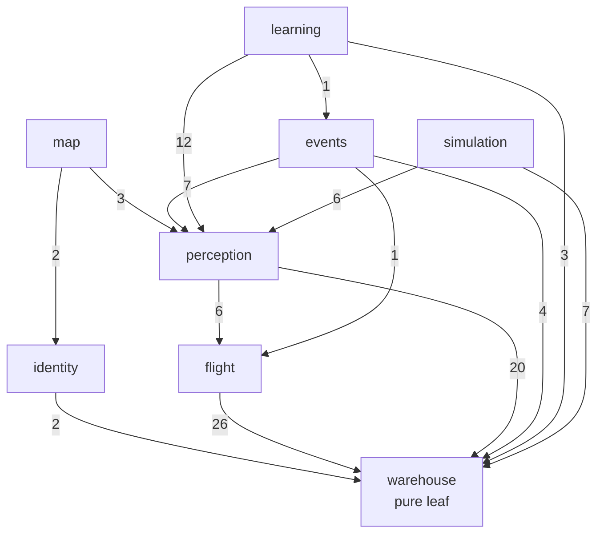
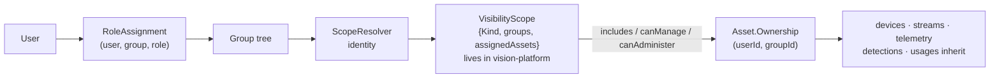
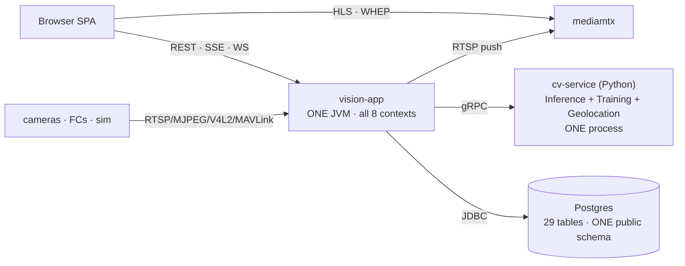
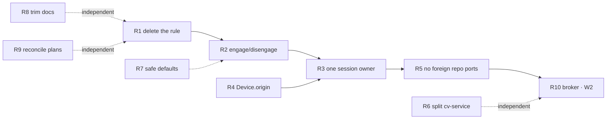

# Architecture audit — domain, structure, sessions, service topology

**Date:** 2026-08-26 · **Against:** `master` @ `212311e0` · **Depth:** structural. Read from
`ARCHITECTURE.md`, the 26 `MODULE.md` files, `docs/plans/README.md`, the pom graph, the migration
set, the ArchUnit rules and measured import/branch/config counts — **not** from reading
implementations line by line.

**One-line verdict:** the bones are unusually good and the debt is concentrated in five nameable
places. Nothing here needs a rewrite; three of the five fixes are deletions.

---

## 1. Scoreboard

| Axis | Grade | One-line |
|---|---|---|
| Module structure & dependency rule | **A** | Enforced, acyclic, measured — the allow-list matches reality exactly |
| Entity model (Asset/Device/Ownership) | **A−** | The right shape; three facts live one layer from where they belong |
| Access model (user ↔ asset) | **B** | Correct design, four overlapping mechanisms, ships **off** by default |
| Session/runtime flow | **C** | Right policies, degenerate classes; one concept split across three modules |
| Service topology & dependencies | **C+** | 4 processes, 1 shared schema, no broker; the paper design is unbuilt |
| Docs & process hygiene | **B−** | 23.6k lines of MODULE.md acting as a changelog; the status authority is stale |

Measured size: **~90k LOC Java main** (31.3k of it in the eight contexts, **19.5k in `vision-api`
alone**), ~50k LOC Python in `cv-service`, ~50k LOC TypeScript in `vision-web`. 385 classes across
core+contexts, 54 driven ports, 29 tables, 131 REST endpoints, 158 API DTOs.

---

## 2. Structure — the strongest part of the system

26 Maven modules on the rule `kernel ← platform ← contexts ← adapters ← app`. This is not
aspirational: `ContextArchitectureTest` holds an **exact allow-list of 14 cross-context edges** and
fails on any edge not declared, plus acyclicity, kernel purity and platform purity. `ArchitectureTest`
adds domain→domain-only, application→application/domain-only, adapters-never-depend-on-adapters,
only-app-sees-adapters, Spring-free domain and application, controllers only in `api.controller|proxy`,
`@ConfigurationProperties` only in `app.config.properties`, and four rules keeping `mavlink-core`
framework- and project-free.

The measured import matrix matches the declaration exactly:



*(edge labels = import statements)*

**Finding S1 — the modules are compile-time walls with no runtime payoff yet.** 26 modules, **one**
deployable. That is exactly what `DOMAIN-SEPARATION-PLAN` D1 pins ("modular monolith first"), so it
is not a defect — but the split is currently all cost (26 poms, 26 MODULE.md, longer builds, wave
coordination) and no benefit beyond the walls themselves. The benefit arrives only with W2–W5.

**Finding S2 — the delivery shell is 62% the size of the domain it delivers.** `vision-api` is 19,485
LOC / 257 files: 42 controllers, **158 DTO records**, 131 endpoints. Contexts total 31,302 LOC. Every
domain record is re-expressed as a DTO, a JPA entity and a TS interface — four representations of
`Asset` before a pixel moves. Some of that is unavoidable at a hexagonal boundary; 158 files is past
the point where it is free.

---

## 3. Domain & entities — the model is right, three facts are misplaced

What is correct and should not be touched: `Asset` as the user-facing object (owned, categorized,
1..n `Device`, free attributes), `Device` as plumbing, category as **data** behind a repository rather
than an enum, `Ownership` on the asset with everything downstream inheriting scope, typed ids wrapping
UUID in a dependency-free kernel, records validating in compact constructors. `SOURCE-ONBOARDING-CONTEXT`
reached the same conclusion independently — *"the model is already right, nothing needs a new entity"* —
and this audit confirms it.

### D1 — "session" is one concept wearing four names, owned by nobody

| Concept | Declared in | Driven by | Axis |
|---|---|---|---|
| `AssetUsage` + `UsagePhase{PREFLIGHT…CLOSED}` | **warehouse** | perception's `UsageTracker` | session lifecycle |
| `StreamId` + `StreamState{STARTING,LIVE,STALLED,RECONNECTING,UNOBSERVED}` | **perception** | `DefaultStreamService` | is video flowing |
| `FlightPhase` + `FlightPhaseRule` | **flight** | perception's `UsageTracker` | aircraft phase |
| `ManualControlSession` | **flight** | WebSocket lifetime | who is driving |

Plus `MavlinkSession`, `GeolocationSession`, `DetectionStreamSession`, `MjpegViewerSession` further down.

Three separate *axes* is a defensible decision and the MODULE.md defends it well. The defect is that
**no axis is owned by the module that names it.** `UsagePhase` is warehouse's enum; the state machine
`FlightPhaseRule` is flight's; the only thing that runs it is perception, which converts
`UsagePhase → FlightPhase → UsagePhase` on every telemetry sample through two hand-written mapping
functions. One state machine, three modules, two isomorphic six-value enums, two mappers, all so that
warehouse can stay the pure leaf.

This is the clearest place where the eight-context split cost more than it bought.

### D2 — there is exactly one verb for opening a session, and it is "start a video stream"

`POST /api/assets/{id}/stream` is the only externally reachable path into `UsageTracker`.
`resolveSingleVideoDevice` throws for an asset with no `VIDEO` device, so:

```
no video device → no stream → no AssetUsage → no telemetry subscription
                → commandTarget == null → every flight command refuses
                  on a vehicle that is actively transmitting
```

`UsageTracker#onTelemetryDeviceDiscovered(DeviceId)` exists to close exactly this, is idempotent, is
covered by 7 tests — and has **zero production callers**. A telemetry-only usage additionally has no
path to terminal `CLOSED` (perception's own MODULE.md flags this against itself).

Already diagnosed in [SOURCE-ONBOARDING-CONTEXT](SOURCE-ONBOARDING-CONTEXT.md) §2. This audit rates it
**the highest value-per-hour fix in the repository**: it is a wiring job plus one verb.

### D3 — "simulated" is stamped on the wrong entity

`DefaultSimulationService` always creates a **new asset** under a fixed `simulated` category, while
`adapter-simulation` treats `sim` as an ordinary protocol behind the same `VideoSourcePort` /
`TelemetrySourcePort` every real source implements. Two layers disagree about what simulation *is*,
and production behaviour (`resumeAll`) filters on a category slug string. The adapter layer is right.

Consequence: you cannot fit a synthetic camera onto a real rover — which is the operator's actual
request ("the drone has no camera yet").

### D4 — two facts the model cannot express

- **`Capability.CONTROL` does not exist.** "Can I drive this?" is inferred from `TELEMETRY` +
  `protocol == "mavlink"` inside `MavlinkManualControlSender#supports`. The act role is real, is used,
  and is invisible to the model — so no UI can honestly say *"watchable, not drivable"*.
- **`Device` cannot say whether it is real.** The only test is string-matching `protocol == "sim"`.
  A cockpit therefore cannot badge a synthetic feed, and the `sim` telemetry source's scripted RTL
  drama will read as a genuine low-battery event — a direct hit on CLAUDE.md rule 9 (failsafe/honesty).

---

## 4. User ↔ asset — correct design, four overlapping mechanisms, off by default

The chain is right and cleanly placed:



Genuinely good: `VisibilityScope` lives in `vision-platform`, not identity, so **no context calls
identity at runtime** — scope math stays a pure value. Out-of-scope reads answer **404, not 403**, so
a scoped read never reveals existence. `@OpenByDesign(reason = …)` on every deliberately-unscoped
endpoint, guarded by `EndpointAuthorizationTest`, is a pattern worth keeping and copying.

**Finding A1 — four parallel access mechanisms.** Group-tree scope · `Ownership` · the `PilotAssignment`
roster (`assignedAssets`) · map `LayerGrant` with its own `MapAccessPolicy` on top. No single place
answers *"who can see X"*. This is the most likely source of a future security bug, because each
mechanism was correct when added.

**Finding A2 — 34 of 43 controllers resolve a scope; 9 do not.** Most of the 9 are legitimate global
reference data (categories, CV model list, tracker list, system status) and carry an `@OpenByDesign`
reason. Three deserve an explicit re-check rather than an assumption: `HlsProxyController` (477 LOC,
proxies video bytes), `DeviceProbeController`, `EventController`.

**Finding A3 — authentication ships off.** `vision.auth.enabled` absent → the `permitAllFilterChain`
bean, CSRF disabled, `anyRequest().permitAll()`. Deliberate, documented, and correct as a migration
posture — but it means **the entire scope apparatus is unexercised in the default configuration**, and
a deployment that forgets the flag has no access control whatsoever. On a platform whose stated
deployment target is "different servers", the default should be the safe one.

**Finding A4 — two pilots can command one aircraft.** No arbitration exists; `CREW-CONTROL-PLAN`
(455 lines, CC-1…CC-6) is specced and unbuilt. `LIVE-SCOPE` deliberately left this to it.

---

## 5. Sessions & runtime flow — where the debt actually is

The *policies* are right: sample for inference while video passes at full rate, latest-wins
backpressure that never blocks the video path, per-stream supervision so one failure is isolated,
clean frames with client-side rendering (no burn-in), mediamtx as the fan-out. Those are the hard
calls and they were made correctly.

The *classes* implementing them have degenerated:

| Class | LOC | Ctors | Note |
|---|---:|---:|---|
| `StreamPipeline` (perception) | **1530** | **9** | 49 methods, 4 nullable collaborators |
| `LiveUpdateRegistry` (api) | 1042 | — | one registry for all 6 live topics |
| `UsageTracker` (perception) | 936 | **10** | canonical ctor is 12-arg, package-private |
| `DefaultStreamService` (perception) | 860 | 8 | 12-arg canonical, 6 nullable collaborators |
| `DefaultSimulationService` | 765 | 2 | |
| `ApplicationServiceWiring` (app) | 713 | — | |

**Finding R1 — the convention that produced these is written down as a rule.** `vision-warehouse/MODULE.md`
documents the *"N-1-arg convenience constructor idiom — every field a wave adds gets one more
convenience ctor layer so every pre-existing call site keeps compiling."* That is a documented policy
of **never touching call sites**. It has produced 10 constructors on one class and made *"passing
`null` simply skips that feature"* the standard way to configure behaviour (58 "nullable" collaborator
notes across the context docs).

`LAYERING-REFACTOR-PLAN` matrix K3 is open against exactly this and records that `StreamPipeline`
grew **927 → 1530 lines since the row was written**. The rule is not neutral; it is actively
compounding the problem it was meant to de-risk.

---

## 6. Service topology & dependencies

### What actually runs



Four processes. **This is a modular monolith with one Python sidecar — not a microservice system**,
and describing it otherwise is the main risk of the current plan set.

### Gap between the pinned design and the tree

| `DOMAIN-SEPARATION-PLAN` decision | Reality |
|---|---|
| D3 — NATS JetStream broker | **No NATS anywhere in the tree.** `FLEET-MIGRATION` T2 open |
| D1 — `vision.roles` flag selects active modules | **Property does not exist** |
| D6 — schema per context, no cross-context joins | **One `public` schema**, all 29 tables |
| D6 — a context reads another only via its API or events | **Violated 17 times** — see below |
| D7 — asset leases, worker role | Unbuilt (W3) |

**Finding T1 — cross-context reads go through the other context's *repository ports*, not its API.**

> **Corrected 2026-08-26**, same day, before remediation began. The first draft of this finding said
> "17 direct imports". That count came from a grep for any foreign `*Port` and swept in seven pairs
> that are **legal by design**: driven ports declared for adapters (`TelemetrySourcePort`,
> `FeedTransmitterPort`, `StreamPublisherPort`), a published live port (`TelemetryLiveUpdatePort`),
> and `AssetLiveStatePort` — which is not a violation at all but the very pattern this finding
> recommends, already in use at six sites. The honest number is **15 cross-context repository reads
> in 8 classes**, listed below. The objection stands; its size was overstated, and R5 is an **M**,
> not the **L** first assigned.

| Reader class | Foreign repository it reaches |
|---|---|
| `perception/UsageTracker` | warehouse `AssetRepositoryPort`, `DeviceRepositoryPort`, `AssetUsageRepositoryPort`; flight `TelemetryRepositoryPort` |
| `perception/DefaultStreamService` | warehouse `DeviceRepositoryPort` |
| `perception/DefaultAssetStreamService` | warehouse `AssetRepositoryPort` |
| `events/DefaultReplayService` | warehouse `AssetUsageRepositoryPort`; perception `DetectionRepositoryPort`; flight `TelemetryRepositoryPort` |
| `events/ReplaySources` | warehouse `AssetUsageRepositoryPort`; perception `DetectionRepositoryPort` |
| `identity/DefaultAssignmentService` | warehouse `AssetRepositoryPort` |
| `flight/DefaultVehicleProfileService` | warehouse `AssetUsageRepositoryPort` |
| `learning/DefaultLabelingService` | warehouse `AssetRepositoryPort` |
| `simulation/DefaultSimulationService` | warehouse `CategoryRepositoryPort` |

Four of the fifteen are `UsageTracker`, and they are not reads at all — perception **writes** another
context's records there (it opens, folds and closes warehouse's `AssetUsage`, and saves flight's
telemetry samples). That is the deepest edge in the set, it is the same code R3 has to touch, and it
should be fixed as one change with R3 rather than as a separate pass.

Every one is legal under the ArchUnit allow-list and each was justified individually ("one fact, no
need for a full assembly"). Collectively they are **a shared database accessed through Java
interfaces** — precisely the coupling D6 forbids, and the single biggest obstacle to ever splitting
these modules into services. `AssetLiveStatePort` shows the right pattern already exists; it just
isn't the default.

**Finding T2 — `cv-service` runs three unrelated workloads in one process.** `grpc/server.py`
registers `Inference` (U0 hot path, ≤50 ms budget), `Training` (long-running, GPU-hungry) and
`Geolocation` (heavy matching) on **one** gRPC server, one Python process, one GIL. Meanwhile the
Java side is **single-target** — `GrpcCvSettings` has no pool (CV-SCALE goal 5 open). So: a training
run can degrade every live stream's detection, and there is no failover. `CvChannelSupervisor` bounds
recovery to ~20 s but cannot fail over to anything.

**Finding T3 — mediamtx outside the JVM is the best boundary decision in the system.** Pixels never
fan out through Java; recording ships natively; the `adapter-recording`/`RecordingPort` that was
planned was correctly retired unbuilt. Keep this and resist every future temptation to route frames
back through the core.

---

## 7. Docs & process

**Finding P1 — MODULE.md has become a changelog.** 26 files, **23,614 lines** (vision-web 13,377 ·
vision-app 3,026 · persistence 1,995 · map 551 · perception 475). Entries are per-wave narrative —
*"W1.6e closed it in two moves…"*, *"every pre-O11 caller keeps its exact prior behavior
byte-identical"*. An agent reading `vision-warehouse/MODULE.md` for the API surface pays for the
entire wave history first. Same failure mode as the constructor rule: append, never rewrite.

**Finding P2 — the declared status authority is stale.** `docs/plans/README.md` (reconciled
2026-08-22) lists `CONTROLLER-SETUP-CONTEXT` and `VEHICLE-CONTROL-PROFILES-CONTEXT` as *"built, not
merged"*. Git disagrees: `feat/controller-setup` is **identical to master** (0 ahead / 0 behind) and
`feat/vehicle-control-profiles` is fully merged. Four days of drift in the one file whose job is not
to drift.

**Finding P3 — 56 branches, ~2 with unmerged work.** Only `feat/visual-geo` (19 ahead) and
`feat/controller-setup-c15` (2 ahead) carry commits master lacks; 10 are `worktree-agent-*` leftovers.
Cheap cleanup, real signal-to-noise gain.

**Finding P4 — flag debt.** 962-line `application.yaml`, 20 `@ConfigurationProperties` classes.
`vision.cv.enabled=false`, `vision.auth.enabled` absent, geo off, rate limiter off, onboarding off.
**The default configuration is not the interesting configuration** — which means the default is the
least-tested one.

---

## 8. Verdict

> **Architecturally sound, structurally over-modularized for its deployment reality, and tactically
> degrading in five specific places.** Nothing here is a rewrite. Three of the five fixes are
> deletions.

What is genuinely strong — and should be defended in review: the port/adapter wall; the enforced,
measured, acyclic context graph; mediamtx outside the JVM; typed ids in a dependency-free kernel;
scope-as-a-value in platform; 404-not-403 on out-of-scope reads; `@OpenByDesign` with a written reason.

What is costing you now, in priority order:

1. A **documented convention** (N-1 constructors + nullable collaborators) that guarantees the worst
   classes keep growing.
2. **One session verb**, which locks telemetry-only vehicles out of the whole control plane while the
   fix sits in the tree with zero callers.
3. **One state machine spread across three modules** with two isomorphic enums and two mappers.
4. **Seventeen cross-context reads through foreign repository ports** — a shared database wearing
   interfaces, and the thing that will block W2–W5.
5. **One Python process** serving a 50 ms control path and a GPU training job, with no pool behind it.

---

## 9. Recommendations

Sequenced. Each row is independently shippable; none needs a new module, entity or context edge.

| # | Do | Why it is the cheap one | Effort |
|---|---|---|---|
| **R1** | **Delete the N-1 constructor rule from CLAUDE.md / MODULE.md conventions.** Replace with: *a new collaborator means updating call sites, or bundling into a settings record.* Then apply it once to `UsageTracker` (10 → 1 ctor + `UsageTrackerSettings`) and `DefaultStreamService` (8 → 1 + settings). | The rule is the generator of the defect; deleting text is free and stops the bleeding before any refactor | S (rule) / M (two classes) |
| **R2** | **Ship `engage`/`disengage`** — `POST|DELETE /api/assets/{id}/session`. `engage` starts a pipeline per `VIDEO` device (**zero is legal**) and calls `onTelemetryDeviceDiscovered` per `TELEMETRY` device; `disengage` is the terminal-`CLOSED` path O7 never had. Keep `/stream` as the device-level verb. | Fixes the operator's actual complaint; half the work is wiring a tested method that has **0 callers** | M |
| **R3** | **Give the session state machine one owner.** Move `FlightPhaseRule` + `UsagePhase` into the module that runs them (perception), or invert it behind a `SessionPhasePort` warehouse declares. Delete the `UsagePhase ↔ FlightPhase` mappers and one of the two enums. | Removes two isomorphic enums, two mappers and a three-module round trip for one fact | M |
| **R4** | **Add `Device.origin{LIVE,SIMULATED}`** (kernel enum + column + API field), delete the `simulated` category (load-bearing at exactly 2 sites), let `resumeAll` filter on origin. | Makes "camera not fitted yet" and "camera on the bench" the same operation, and lets the cockpit badge a synthetic feed honestly | S |
| **R5** | **Make cross-context reads go through services, not repository ports.** Add an ArchUnit rule: *no context may import another context's `*RepositoryPort`.* Convert the **15** sites to a narrow read interface published by the owning context, the way `AssetLiveStatePort` already is at six sites. `UsageTracker`'s four go with R3, not here. | This is the actual precondition for W2–W5. Doing it now, in one JVM, costs a refactor; doing it later costs a distributed rewrite | **M — but do it before W2** |
| **R6** | **Split `cv-service` into `cv-inference` and `cv-training` processes** (same image, different entrypoint; `Geolocation` follows training). Then give the Java side a target **list** instead of a host:port (CV-SCALE goal 5). | A training run currently degrades every live stream, and there is no failover behind `CvChannelSupervisor` | M |
| **R7** | **Flip the safe defaults.** `vision.auth.enabled=true` by default with a documented `false` escape hatch for dev. Re-audit the 3 unscoped controllers that are not reference data (`HlsProxy`, `DeviceProbe`, `Event`). | A platform meant for "different servers" must not ship with `anyRequest().permitAll()` as the default | S |
| **R8** | **Cut MODULE.md back to a contract:** purpose · dependencies · API surface · conventions · gotchas. Move every *"wave W1.6e did X"* narrative into the plan doc that owns the wave. Target ≤300 lines per module. | 23.6k lines of doc is a context-window tax on every agent task, paid before any work starts | M |
| **R9** | **Reconcile `docs/plans/README.md` against git and prune branches.** Delete the 10 `worktree-agent-*` refs and the ~44 fully-merged feature branches. | The status authority is 4 days stale on two rows; branches are 96% noise | S |
| **R10** | **Only then** revisit W2 (broker). With R5 done, a NATS edge is a transport swap. Without R5, it is a rewrite. | Sequencing, not scope | — |

### Suggested order



**R1 + R9 in one sitting.** They are text changes and they make everything after them cheaper to
review. **R2 alone next** — it is the only one that can be judged by an operator before any UI moves.

## 10. What this audit did not do

Not run: no build, no test run, no live stack. Every number above is a count over the tree at
`212311e0`, and every architectural claim is read from `MODULE.md` / plan docs / poms / ArchUnit rule
names — not from reading implementations. Specifically **not verified at audit time**: whether the
foreign-port reads are each genuinely single-fact (each was justified individually in its MODULE.md;
the objection here is to the aggregate, not to any one of them); whether `HlsProxyController` leaks
scope in practice; whether R6's process split is safe against `cv-service`'s model-cache assumptions.

Two of those three were settled during remediation, and one of them the audit had guessed too kindly:
`HlsProxyController` **did** serve any `streamId`'s video bytes to any caller, with no scope check at
all — see §11 R7. The foreign-port count was also wrong in the first draft and is corrected in §6 T1.

## 11. Remediation log

Remediation runs on branch `refactor/audit-remediation`, one merge commit per recommendation. This
section records what actually landed, including where the audit's own text was wrong.

| Rec | State | What landed |
|---|---|---|
| R1 | **merged** | The N-1-arg convenience-constructor convention is **withdrawn** — rule text in `.claude/skills/java-clean-code/SKILL.md` §3 + `CLAUDE.md` rule 10, then the classes: `UsageTracker` 10 → **1** public ctor (936 → 778 lines), `StreamPipeline` 9 → **1** (1530 → 1373), `DefaultStreamService` 8 → **1**. Optional collaborators became `Optional<T>` fields on three new settings/collaborator records; zero "pass `null` to skip that feature" javadoc survives in the three files. `vision-perception` 564/564, `vision-app` 248/248, behaviour byte-identical. |
| R6 | **merged** | `cv-service` splits by `CV_SERVICE_ROLE` into `inference` vs `training`+`geolocation` processes (`cv-split` Compose profile, host ports 50061/50062); Java side gained `CvTarget`/`CvChannels`/`StaticTargetsNameResolver` — ordered failover on one channel via grpc's own `pick_first`, no load-balancer logic invented. |
| R7 | **merged** | **Secure by default.** The permit-all filter chain used to be selected when `vision.auth.enabled` was simply absent, so the shipped default was `anyRequest().permitAll()` with CSRF off and the whole `VisibilityScope` apparatus unexercised. Secured is now the default and permit-all cannot win a tie. The three controllers §4 ledgered as unscoped were each decided: `HlsProxyController` **scoped** (it was a real leak — any caller, any stream, out-of-scope now 404s before the upstream is contacted), `EventController` **scoped**, `DeviceProbeController` **`@OpenByDesign`** (its request and response carry no `AssetId` or `Ownership` to scope against). |

Open at the time of writing: R4, R2, R3, R5, R8, R9.

**One process lesson worth keeping.** R7 reported one failing test as "pre-existing, reproduced on a
clean stash." It was not: a later wave's worktree, branched from `master` with none of R7's changes,
ran the same module **248/248 green**. A `git stash` that leaves an untracked file behind does not
produce a clean tree, and "pre-existing" is a claim that has to be measured on a tree you have
actually verified is clean — not on one you assume is.
