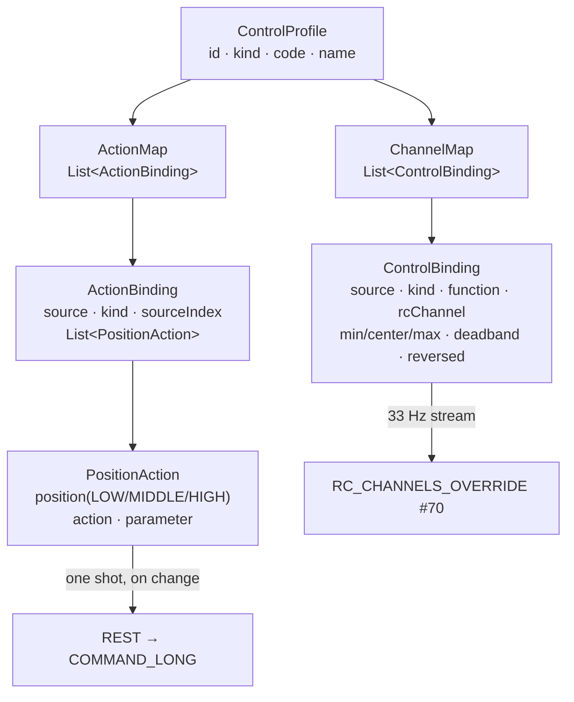

# CONTROLLER-SETUP — working context

Started 2026-08-24. Branch `feat/controller-setup`, cut off `master` while
[VEHICLE-CONTROL-PROFILES](VEHICLE-CONTROL-PROFILES-CONTEXT.md) is still uncommitted in the tree —
its `ControlProfile`/`VehicleKind`/virtual-surface work is the floor this builds on, not something to
redo.

**Task, in the operator's words:** *"I have a controller flow from UI, and ARM/DISARM. Instead of it
— I need a proper flow of setting the controller. So each toggle/switch/button and axis had an
option I chose. … About arm/disarm: the disarm and mode should not be separate from controller
window. … implement a new controller page with a proper design and ability to choose type (button,
switch 2, switch 3), and axis. … on /fly page merge mode + arm/disarm with a controller connection.
Research what MAVLink commands are usually sent from a controller."*

Companion docs: [OPERATOR-CONTROL-CONTEXT.md](OPERATOR-CONTROL-CONTEXT.md) (the audit — **G4**, **G5**,
**G7**, **G11**, **D4**, **D5**, **D6** are the gaps this task closes),
[VEHICLE-CONTROL-PROFILES-CONTEXT.md](VEHICLE-CONTROL-PROFILES-CONTEXT.md) (P1–P14, consumed not
re-litigated), [RC-CONTROL-PHASE1-PLAN.md](../done/RC-CONTROL-PHASE1-PLAN.md) (the frozen
`/ws/manual-control` contract, extended **additively**).

---

## 1. What exists today, and what is missing

| Piece | State |
|---|---|
| Axes → RC channels | Works. `ControlProfile.forKind()` picks a **built-in, per-vehicle-kind** map. Nothing is configurable |
| Buttons/switches | **Bound to nothing.** P7 dropped the old buttons→CH5..8 default and put nothing in its place |
| Arm / disarm / mode | Works, but in a **separate `flight` drawer** from the `rc` drawer (OPERATOR-CONTROL **G11**) |
| Choosing what a control does | **Does not exist anywhere.** No page, no endpoint, no stored profile (**G4**) |
| Controls past axis 3 / button 3 | Silently dropped (**G5**) |

The gap in one sentence: the platform decides the layout, the operator cannot, and the two things an
operator most wants on a switch — arm and mode — are in a different window from the sticks.

---

## 2. Research — how the field does this

### 2.1 QGroundControl (read from `src/Joystick/Joystick.h` / `.cc`)

- **Calibration is a hard gate.** `if (!_joystickSettings.calibrated()) { return; }` sits at the top
  of the poll loop: an uncalibrated joystick produces *zero* output, never "output with defaults".
- **Axis functions** are a fixed enum: `roll, pitch, yaw, throttle, pitchExtension, rollExtension,
  additionalAxis1..6`.
- **Per-axis settings:** reverse, deadband, expo, "circle correction", plus a throttle-travel choice
  spelled out in words — *"Center stick is zero throttle"* vs *"Full down stick is zero throttle"*,
  and *"Allow negative thrust"*. That is exactly our `CENTERED` / `UNIDIRECTIONAL` travel, and it is
  the only setting QGC states in prose rather than numbers — because getting it wrong is dangerous.
- **TX mode 1–4 is a transform over one canonical map**, not four stored maps
  (`_remapFunctionsInFunctionMapToNewTransmittedMode`). Stored as mode 2.
- **A button binds to a named action**, and `AssignedButtonAction` carries `{actionName, repeat}` —
  a **repeat** flag with its own frequency, which is what makes "Continuous Zoom In" work.
- The action list is **built at runtime and includes the vehicle's own flight modes**
  (`vehicle->flightModes()` appended to the fixed list) — so "Loiter" is an action, not a mode
  picker somewhere else.
- Axes go out as **`MANUAL_CONTROL` #69** or **`RC_CHANNELS_OVERRIDE` #70**, selectable.

**Verbatim QGC button-action list** (the catalogue this task's own action set is measured against):

`No Action`, `Arm`, `Disarm`, `Toggle Arm`, *(every vehicle flight mode)*, `VTOL: Fixed Wing`,
`VTOL: Multi-Rotor`, `Continuous Zoom In/Out`, `Step Zoom In/Out`, `Continuous Focus In/Out`,
`Step Focus In/Out`, `Next/Previous Video Stream`, `Next/Previous Camera`, `Trigger Camera`,
`Start/Stop/Toggle Recording Video`, `Gimbal Down/Up/Left/Right/Center`, `Gimbal Yaw Lock`,
`Gimbal Yaw Follow`, `Emergency Stop`, `Gripper Grab/Release/Hold`, `Landing gear deploy/retract`,
`Motor Interlock enable/disable`.

### 2.2 ArduPilot's own advice (`common-joystick.rst`)

- Bind buttons to **Arm**, **Disarm**, **Change Mode** — and *"the flight mode channel (e.g. RC5 or
  RC8) and auxiliary function channels should not be controlled from the joystick especially if a
  regular RC receiver is also connected."*
- Per-axis **reverse** and **expo (−100..100)**, with **Auto Detect** — you move the stick and the
  station learns which axis it was. Every station in the survey has this gesture; we do not.

### 2.3 ArduPilot aux functions — the 3-position switch, natively

`RCx_OPTION` functions are driven by switch *position*, and the PWM bands are fixed:
**LOW < 1200 µs**, **MIDDLE 1200–1800 µs**, **HIGH > 1800 µs**. A 2-position switch uses LOW/HIGH; a
3-position switch uses all three. Representative options: `4` RTL, `9` Camera Trigger, `16` AUTO,
`18` LAND, `19` Gripper, `22` Parachute Release, `31` Motor Emergency Stop, `46` **RC Override
Enable**, `55` GUIDED, `56` LOITER, `81` Disarm, `153` ARM/DISARM, `165` ARM/Emergency Stop.

Decisively for us: **`MAV_CMD_DO_AUX_FUNCTION` (218)** fires any of them over MAVLink with no RC
channel at all — `param1` = the function number, `param2` = `0` LOW / `1` MIDDLE / `2` HIGH. That is
a 3-position switch expressed as a command, which is precisely the shape the operator asked for and
the reason this task does not need to burn aux channels to be useful.

### 2.4 The command catalogue — what a controller actually sends

| Action | MAVLink | Reachable for us today |
|---|---|---|
| Arm / Disarm | `MAV_CMD_COMPONENT_ARM_DISARM` (400), `param1` 1/0, `param2` `21196` = force | **yes** — already implemented |
| Emergency stop / kill | same command, disarm **forced** (`21196`) — QGC's own `Vehicle::emergencyStop` | **yes** — one new call, no new protocol |
| Change mode | `MAV_CMD_DO_SET_MODE` (176), `param1` = `CUSTOM_MODE_ENABLED`, `param2` = custom mode | **yes** — already implemented |
| RTL / Land / Auto / Loiter | *are modes* on ArduPilot — one `DO_SET_MODE` each, no separate command needed | **yes** |
| Any aux function (46 RC-override-enable, 31 motor e-stop, 9 camera trigger, 19 gripper, 22 parachute…) | `MAV_CMD_DO_AUX_FUNCTION` (218) + switch level | **yes** — this task adds it |
| Takeoff / Land (explicit) | `MAV_CMD_NAV_TAKEOFF` (22) / `MAV_CMD_NAV_LAND` (21) | not built — LAND/GUIDED modes cover it |
| Gimbal | `MAV_CMD_DO_GIMBAL_MANAGER_PITCHYAW` (1000), `GIMBAL_MANAGER_SET_MANUAL_CONTROL` (288) | **no gimbal in this platform** — not faked |
| Camera / video | `MAV_CMD_IMAGE_START_CAPTURE` (2000), `VIDEO_START/STOP_CAPTURE` (2500/2501), `SET_CAMERA_ZOOM` (531) | our video is not MAVLink-attached — not faked |
| Gripper / landing gear / VTOL transition | `DO_GRIPPER` (211), `AIRFRAME_CONFIGURATION` (2520), `DO_VTOL_TRANSITION` (3000) | reachable via aux function where the airframe has one |

**The point of the AUX_FUNCTION row:** rather than growing a bespoke port method per gadget (and
lying about the ones we cannot reach), one command covers every switch-driven ArduPilot feature the
airframe actually has. The catalogue above is what the UI offers; nothing outside it is offered at
all, so no control in this app can be bound to something the platform cannot send.

---

## 3. Decisions

Numbered `C*`; OPERATOR-CONTROL's `D*` and VEHICLE-CONTROL-PROFILES' `P*` stay in force.

| # | Decision | Because |
|---|---|---|
| **C1** | **A control's *type* is a first-class field**: `ControlInputKind { AXIS, BUTTON, SWITCH_2, SWITCH_3 }`, chosen by the operator, separate from `Source { AXIS, BUTTON }` (which array the value is *read* from) | They are genuinely two facts. An EdgeTX 3-position switch arrives on the **axes** array; a latching toggle arrives on the **buttons** array. Collapsing them would make one of the two hardware shapes unrepresentable |
| **C2** | **A control binds to exactly one of two things: a *channel* or an *action*.** Channel bindings stream at the link rate; action bindings fire one command on a position change | This is the QGC/ArduPilot split (axis→channel, button→action) and the reason ArduPilot tells you not to put mode on a channel (**D6**) |
| **C3** | **Actions fire from the browser over the existing REST command surface**, not through the manual-control WebSocket | Three reasons: the WS contract stays frozen (**P13**); an action works **without** taking stick control (arm your rover, then decide); and every command keeps the scope gate + audit trail it already has. A one-shot command does not need a 33 Hz transport |
| **C4** | **Switch positions are ArduPilot's own three**: `LOW / MIDDLE / HIGH`, at the firmware's own PWM bands (<1200 / 1200–1800 / >1800) | Any other quantization would disagree with the vehicle about what the switch just did. A `SWITCH_2` is LOW/HIGH, a `SWITCH_3` is all three, a `BUTTON` is HIGH-on-press |
| **C5** | **`MAV_CMD_DO_AUX_FUNCTION` is the generic escape hatch**, exposed as one bindable action taking a function number | §2.3. One command reaches every switch-driven ArduPilot feature; the alternative is a port method per gadget, most of which we could not honestly implement |
| **C6** | **Profiles are saved server-side, owned by a user, one active per vehicle kind.** Engage resolves `(actor, live vehicleKind)` → saved profile, else the built-in | Server-side because this platform is multi-user and remote-deployed (CLAUDE.md); keyed on the **live** kind because P9 says the kind is never stored config. The built-in stays the floor, so a fresh operator is never blocked |
| **C7** | **The built-ins are unchanged and remain the fallback.** A saved profile is a *copy* of one, edited | P2's totality is a safety property: there is always a map, and it is never accidental |
| **C8** | **The action catalogue is served by the backend** (`GET /api/control-profiles/catalog`), not hardcoded in the SPA | CLAUDE.md rule 1. The set of sendable commands is a backend fact — a UI that invents its own list will eventually offer one the server refuses |
| **C9** | **Arm keeps its two-stage confirm when clicked, and gets a hold-to-fire when bound to a control.** Nothing arms on a single stray press | The existing `arm-confirm-dialog` two-stage gesture is the platform's most deliberate safety UI; a bound switch cannot show a dialog, so it earns its own friction instead |
| **C10** | **On `/fly`, the `flight` drawer is absorbed into the `rc` drawer.** One "Controller" panel: link + source + mode + arm/disarm + sticks + bound controls | The operator's own words. It also closes **G11** — mode and arm stop being in a window that has nothing to do with the sticks that are actually flying the thing |
| **C11** | **The setup page is its own route (`/manage/controller`), not a modal in the cockpit** | Binding controls is a bench task, not a flight task. The cockpit drawer links to it; the cockpit never becomes an editor |
| **C12** | **Calibration (QGC's hard gate, D4) stays deferred, and this task does not pretend otherwise.** Bindings are configurable; per-axis min/max *learning* is not | The dangerous half of D4 — throttle travel — is already solved structurally by `travel()` and the virtual surface's rest-at-idle (P11). Range learning is a real feature, but it is a different one, and shipping a fake "calibrated" flag would be worse than shipping none |

### 3.1 Deliberately out of scope

- **TX modes 1/3/4** (D5) — the transform is understood (§2.1) but every input this platform has today
  is either mode-2 or on-screen.
- **Expo / circle correction** — `deadband` and `reversed` exist and are now editable; expo is a curve
  this domain has no field for, and adding one is not this task.
- **Gimbal / camera / gripper as first-class actions** — reachable through `AUX_FUNCTION` where the
  airframe has them; not invented as native commands (§2.4).
- **Per-button repeat/hold frequency** (QGC's `repeat`) — only "Continuous Zoom" style actions need it,
  and none of our actions are continuous.
- **Shared/switch-arbitrated control** (D10) — unchanged, still the next big thing.

---

## 4. Design

### 4.1 The binding model

One physical control appears in **at most one** of the two maps — enforced in `ControlProfile`'s
compact constructor, because a stick that both drives channel 3 and arms the vehicle is not a
configuration, it is an accident.

### 4.2 Type → source compatibility (validated in the domain)

| Type | Reads from | Positions | Typical hardware |
|---|---|---|---|
| `AXIS` | `axes[]` | continuous | stick, pot, slider |
| `BUTTON` | `buttons[]` | HIGH on press | momentary button |
| `SWITCH_2` | either | LOW / HIGH | latching toggle, 2-pos switch |
| `SWITCH_3` | `axes[]` only | LOW / MIDDLE / HIGH | EdgeTX 3-position switch (−1 / 0 / +1 on an axis) |

`SWITCH_3` refuses a button source rather than quietly behaving as a 2-position switch: one button
cannot report three positions, and pretending it can is the kind of fabricated read this codebase
forbids elsewhere.

### 4.3 Quantization (channel bindings of switch type)

A switch driving a channel snaps to the firmware's own bands rather than sending whatever the raw
input happened to be: `LOW → minMicros`, `MIDDLE → centerMicros`, `HIGH → maxMicros`.

### 4.4 Wire additions (all additive)

- `engaged` frame: `profileId`, `profileSource` (`SAVED`/`BUILT_IN`), and each `channelMap` row gains
  `kind`.
- New REST: `/api/control-profiles` (CRUD + `/activate`), `/api/control-profiles/catalog`,
  `POST /api/assets/{id}/aux-function`, `POST /api/assets/{id}/emergency-stop`.

---

## 5. Waves

All eight waves are **built and green** (§6); nothing is merged.

| Wave | Module | Content |
|---|---|---|
| **C1** | `contexts/vision-flight` | `ControlInputKind`, `SwitchPosition`, `ControlAction`, `PositionAction`, `ActionBinding`, `ActionMap`, `ControlProfileId`, `OwnedControlProfile`; `ControlBinding`+kind/quantization; `ControlProfile`+id/actionMap; `ControlProfileRepositoryPort` |
| **C2** | `contexts/vision-flight` | `ControlProfileService` + default impl; `FlightCommandService.emergencyStop/auxFunction`; `ManualControlService` resolves the active profile |
| **C3** | `drone-link/mavlink` | `FlightCommandPort.emergencyStop/auxFunction` → `MAV_CMD_DO_AUX_FUNCTION`, forced-disarm |
| **C4** | `storage/persistence` | `V24__control_profiles.sql`, entity + mapper + repository |
| **C5** | `station/vision-api` | `ControlProfileController` + DTOs + catalog; command endpoints; WS additive fields |
| **C6** | `station/vision-app` | wiring, devsupport repo, ArchUnit |
| **C7** | `station/vision-web` | models + service; `/manage/controller` setup page; the `/fly` drawer merge; action dispatch from bound controls |
| **C8** | docs | MODULE.md × **6** (vision-app's wiring changed too), this doc's §6, `docs/plans/README.md` |

## 6. Verification

Measured, not asserted. Branch `feat/controller-setup`, 2026-08-24.

### Backend — one reactor build over every touched module

`./mvnw -B -pl contexts/vision-flight,drone-link/mavlink,storage/persistence,station/vision-api,station/vision-app -am -DskipWeb test`

| Module | Wave | Tests run | Result |
|---|---|---:|---|
| `contexts/vision-flight` | C1, C2 | **330** | 0 failures (287 before this task — +43) |
| `drone-link/mavlink` | C3 | **192** | 0 failures |
| `storage/persistence` | C4 | **222** | 0 failures — includes the real-Postgres docker suite; Flyway log shows **"Successfully applied 24 migrations"**, so `V24__control_profiles.sql` runs clean on an empty database |
| `station/vision-api` | C5 | **836** | 0 failures |
| `station/vision-app` | C6 | **248** | 0 failures — includes ArchUnit and the bean-inventory test |

### Frontend

`npm run test:ci` (= `ng test --watch=false`) — **138 files, 2527 tests, 0 failures.** Before this task: 137 files / 2503. The new specs: `controller-setup-logic.spec.ts` (24), `control-action-logic.spec.ts` (15), `control-action-dispatcher.spec.ts` (12), plus 4 cases in `rc-monitor.spec.ts` and 3 for `migratedPanelId`.

`npx tsc --noEmit -p tsconfig.json` and `-p tsconfig.spec.json` — both clean. The production bundle report shows the new lazy chunk `controller-setup | 86.72 kB`, so `/manage/controller` is genuinely code-split and costs nothing to a session that never opens it.

### Post-merge fix (2026-08-24, after master)

C11's own text promises "the cockpit drawer links to it" and the first cut did not: the Controller drawer listed bound switches but offered no way to reach `/manage/controller`, so an operator with nothing bound had no path to the page from inside the cockpit. The Bound-switches section now always renders — empty state links to the setup page and says why, populated state carries a quiet *Change what these do* link. `rc-monitor.spec.ts` gained `provideRouter([])` (a `RouterLink` needs a router) and two cases for the link; one older case that asserted the whole section vanished when nothing was bound now asserts the *binding list* vanishes instead. **138 files, 2529 tests green.**

Separately: the running app served a **stale SPA**. It loads static resources from `station/vision-web/target/classes/META-INF/resources`, which still held a pre-merge bundle — the API answered `200` on `/api/control-profiles` while the UI had no such route. `./mvnw -B -pl station/vision-web install` rebuilt it; no app restart was needed, Spring picks the new files off the classpath directory.

### Wave C13 — operator feedback round (2026-08-25)

Five things the operator asked for after flying the page with a real transmitter. Two are answers, not code, and are recorded here because they are decisions:

**Q — is a layout per user or per app?** Per user, and it always was: `owner_user_id` on every row, one active per `(owner, vehicleKind)` enforced by the partial unique index `uq_control_profiles_active`, and `ControlProfileService` takes a `UserId` with no `VisibilityScope` anywhere (C6 — ownership *is* the authority model for personal equipment configuration). Two operators sharing one aircraft keep separate layouts and separate active choices; nothing here is global.

**Q — do RC channels even mean anything when a joystick is a joystick?** Yes, but not on the hop the question is about. There are two links, and only the second has channels: browser → station carries *axes and buttons* over HTTP/WS (a USB HID device has no channels at all), and station → vehicle carries `RC_CHANNELS_OVERRIDE`, whose channel numbers are the **autopilot's** (ArduPilot `RCMAP_*`, `RCx_OPTION`) — never the transmitter's. `ChannelMap.apply` is exactly the translation between the two. That is also why the answer survives a Raspberry Pi relay: whatever the ground station talks to the vehicle over, the vehicle's own channel numbering is what the frame must speak, so the mapping belongs in the layout, not in the transport.

**Fixes.** (1) *Activating a built-in* threw "cannot be edited or deleted" — see `contexts/vision-flight/MODULE.md`'s own entry; it now clears the owner's active flag for that kind instead. (2) *The channel picker offered CH1–18* while the relay carries CH1–8; `RcChannels.RELAYED_CHANNELS` is now the single statement of that width, served in the catalogue (C8), with an over-cap binding raising a named draft issue rather than failing silently.

**The diagram (`ControllerDiagram`).** The chip inventory became a drawn transmitter: named stick pads with a live dot, bars for pots and switched axes, pills for buttons, a live percentage and caption on every axis. The first cut paired axes 0/1 and 2/3 into pads on the gamepad convention — **wrong for a transmitter**: EdgeTX reports *channels* in channel order (CH1→X, CH2→Y, CH3→Z, CH4→RX, [manual.edgetx.org](https://manual.edgetx.org/edgetx-how-to/joystick-mapping-information-for-game-developers)), so under AETR the axes are aileron/elevator/throttle/rudder and index pairing drew throttle in a *horizontal* slot with the pads swapped — which is what the operator saw. Pads now come from which axis drives which **function**, placed by the operator's **stick mode** (1–4, per rc-airplane-world.com; mode 2 = throttle left, mode 3/4 mirror 2/1). Vertical direction is a **flip**, not a constant: a gamepad reports Y negative-up while a transmitter's channel *rises* with the stick, so throttle-down read −1 and was drawn at the top. Both are display preferences persisted per browser, deliberately not fields on the profile — what the vehicle does is decided by axis → function → channel, so mode moves a picture and nothing else.

**Autodetect.** One button, then flick every control in turn; each is added *already declared as what it is*. `control-autodetect.ts` is a pure reducer over the 60 Hz gamepad stream (watch → sample → name → re-baseline → watch), so its interesting decisions are testable by feeding it frames instead of by waiting. A button is named on press (no window distinguishes momentary from latching), an axis the moment one reading sits between detents (a single off-detent sample already forces `AXIS`), and a switch gets the full ~1.5 s window it needs to reveal a third position. It never edits an existing row — a sampling window is not better evidence than the operator having said what their own switch is.

**Verified:** `npm run test:ci` — **141 files, 2583 tests green**; both typechecks clean; `ng build` clean; backend `MAVEN EXIT=0` over kernel/platform/flight/mavlink/api. The SPA was rebuilt into `station/vision-web/target/classes` and is being served. **Not verified:** the backend fixes are compiled but the running app is an IDE launch on the old classes — activating a built-in and the CH1–8 picker need an app restart to be seen live.

### Wave C14 — the browser pass (2026-08-25)

The page was driven live at `http://192.168.0.104:8080/manage/controller` against a synthetic transmitter, on the running app. **Confirmed working:** the diagram draws throttle at −60% low on the *left* pad under mode 2 (the operator's original complaint); activating a built-in flips cleanly with a success toast; the channel picker offers exactly CH1–CH8; and all three autodetect classifications (`AXIS`, `SWITCH_3`, `BUTTON`) land correctly from live frames.

**Three defects the browser found, all fixed:**

1. **The autodetect counter lied** — "7 found so far" with three rows on screen, because it counted flicks rather than rows. `ControllerSetupFacade.addControl` now returns whether a row was really appended, and only that increments the total. A running count the operator can disprove by looking is worse than no count.
2. **A picked or autodetected axis landed on `ACTIONS`** — the one role/kind pairing with nothing to fill in ("a continuous axis has no positions"), so the operator's first move was always to undo the default. `blankControlDraft` starts an axis on `CHANNEL` with a free channel, and `setKind` moves a row redeclared as `AXIS` off `ACTIONS` for the same reason. A switch redeclared the other way is *not* forced back — a 3-position switch driving a channel is a normal flight-mode setup.
3. **Clicking a control in the diagram left the operator on their own** to find its card ~2.7 screens down. The pick now scrolls the card into view and marks it; cards carry a stable `control-<SOURCE>-<index>` id.

**Testing note for whoever repeats this.** A hidden Chrome tab gets **zero** `requestAnimationFrame` frames and throttles `setTimeout` to ~1 s, so the 60 Hz gamepad loop simply does not run and the page looks broken. Drive it by shimming `requestAnimationFrame` with an interval; `scrollIntoView({behavior: 'smooth'})` is likewise compositor-driven and never animates in a hidden tab — assert on the call, not on `scrollTop`.

**Verified:** `npm run test:ci` — **141 files, 2584 tests green**; `npx tsc --noEmit` clean; SPA rebuilt and served (`MAVEN EXIT=0`).

### Wave C15 — five changes the operator picked (2026-08-25)

After the C14 browser pass the operator was offered a ranked list of what would help most and chose all four, adding a fifth rule of their own. All five are built.

**1. What the vehicle receives (`channel-output-logic.ts`).** A live CH1–CH8 strip under the diagram, in microseconds, with travel and reverse already applied — the only place on the page where "is my throttle reversed?" is answerable without a vehicle. It mirrors `ControlBinding#toMicros` exactly (clamp → reverse → deadband → piecewise map → clamp; switches snap to detents), and a channel nothing drives reads *not sent* rather than a number, because `ChannelMap.apply` fills it with `RcChannels.IGNORE` and the vehicle keeps whatever it had. Duplicating the mapping in TypeScript is deliberate: the operator is checking the *layout*, and a strip fed by the server would only prove the server agrees with itself.

**2. Function-first guided setup (`guided-setup.ts`).** *Guide me* asks one question per channel function the built-in for that vehicle kind declares — "Move the control you use for Steering" — and binds whatever moves. It is the inverse of Autodetect, which asks the operator to name what they just flicked; here the platform names it first, so a copy of a built-in is corrected in the operator's own vocabulary. Answering **takes over**: any row already holding that function or that channel is dropped, because the operator has just said *this* is their throttle and the built-in's guess is the thing being corrected. A `settle` phase (9 quiet ticks, ~0.15 s at 60 Hz) sits between steps so a self-centring stick springing back is not read as the answer to the next question. Guided covers channel functions only — switches have no equivalent question — so its completion banner hands off to Autodetect, and both buttons stay.

**3. The editor moved beside the diagram**, sticky, in a two-column grid that collapses at `--bp-lg`. The list below it is one line per mapped control. Before this the page was a column of full-height cards and picking a control on the picture scrolled ~2.7 screens (C14 defect 3, whose scroll-into-view is now a much shorter trip).

**4. Layouts grouped by vehicle kind**, each heading saying what is in force for that kind — *using the built-in* / *using ‹name›* / *nothing active*. The first cut printed the active layout's name and read "Multirotor — Multirotor".

**5. The operator's rule: editing fields belong to the selected control only.** Only the picked control's fields render; everything unselected is a one-line summary. Read-only viewing of a built-in shows every row's summary and no editor at all, which is what "when not in edit mode — should be visible for all" asks for.

**Stick mode and stick direction moved onto the profile**, reversing C13's "deliberately not fields on the profile". C13's reasoning was that they only move a picture — true, but the picture is of *the operator's radio*, which follows them between browsers, and browser storage does not. `TransmitterView(stickMode 1-4, forwardIsUp)` is a new component on `OwnedControlProfile` only — `ControlProfile`, the record a live session engages, is untouched — with a 4-argument convenience constructor so the ten existing construction sites still compile. `V25__control_profile_transmitter_view.sql` adds both columns with defaults and a `BETWEEN 1 AND 4` check; the wire fields are optional in both directions, so an older client sends nothing and gets the platform default.

**Verified:** `npm run test:ci` — **143 files, 2625 tests green**; both typechecks clean; `ng build` clean. Backend `MAVEN EXIT=0` over kernel/platform/flight (336), `station/vision-api` (838), `storage/persistence` (224, real Postgres via Docker), `station/vision-app` (248). One of those tests caught a real bug as it was written: falling back to the built-in dropped the operator's `TransmitterView`, because the fake repository's `activate` rebuilt rows through the 4-argument constructor.

**Browser pass on the running app.** Grouped layouts, the output strip, the guided run and the single-control editor were all driven live against a synthetic transmitter: `+0.5` on the steering axis reads `1750`, `-0.8` on throttle reads `1100`, and a guided run rebound Steering and Throttle onto different axes with the previous rows dropped. Two cosmetic defects found and fixed: the panel header printed the wire enum (*For ROVER* where the group heading says *Ground vehicle*), and every idle channel spent two lines saying *not sent — left unchanged*, which is now one word plus one sentence above the strip.

### What is *not* verified

- **No live fly, no SITL run of a bound switch.** Every action path is covered by unit tests against fakes; nothing in this task has commanded a real or simulated vehicle. That is the operator's step, and it is the same gate `RC-CONTROL` Phase 2 sits behind.
- **The backend half of C15 is not live on the running app.** `V25` and the `stickMode`/`forwardIsUp` wire fields are compiled and tested, but the station is an IDE launch on the old classes; a `PUT` carrying them was checked against it and answers `200` while ignoring them, so the page degrades to mode 2 / forward-up until the operator restarts it.
- **The browser passes (waves C14, C15) were light theme only.** Dark theme has still never been looked at on a real screen. The one `px` value remains a `@media` query, which cannot read `var()`, and it cites `--bp-md` in a comment beside it.
- **`ControlProfileStore` and the setup page/facade have no specs of their own.** The pure logic under both is covered; the store is a thin load/reload wrapper, and the page is verified only through typecheck plus `architecture.spec.ts`'s routed-page guard.
- **Calibration (C12) is still not built and is not faked.** Bindings are configurable; per-axis range learning is not.

### Documentation updated in the same task (wave C8)

`contexts/vision-flight/MODULE.md`, `drone-link/mavlink/MODULE.md`, `storage/persistence/MODULE.md`, `station/vision-api/MODULE.md`, `station/vision-app/MODULE.md`, `station/vision-web/MODULE.md` (six, not the five §5 planned — `station/vision-app`'s wiring changed too), plus a row in `docs/plans/README.md` and the OPERATOR-CONTROL row there noting which of its gaps this closed.
