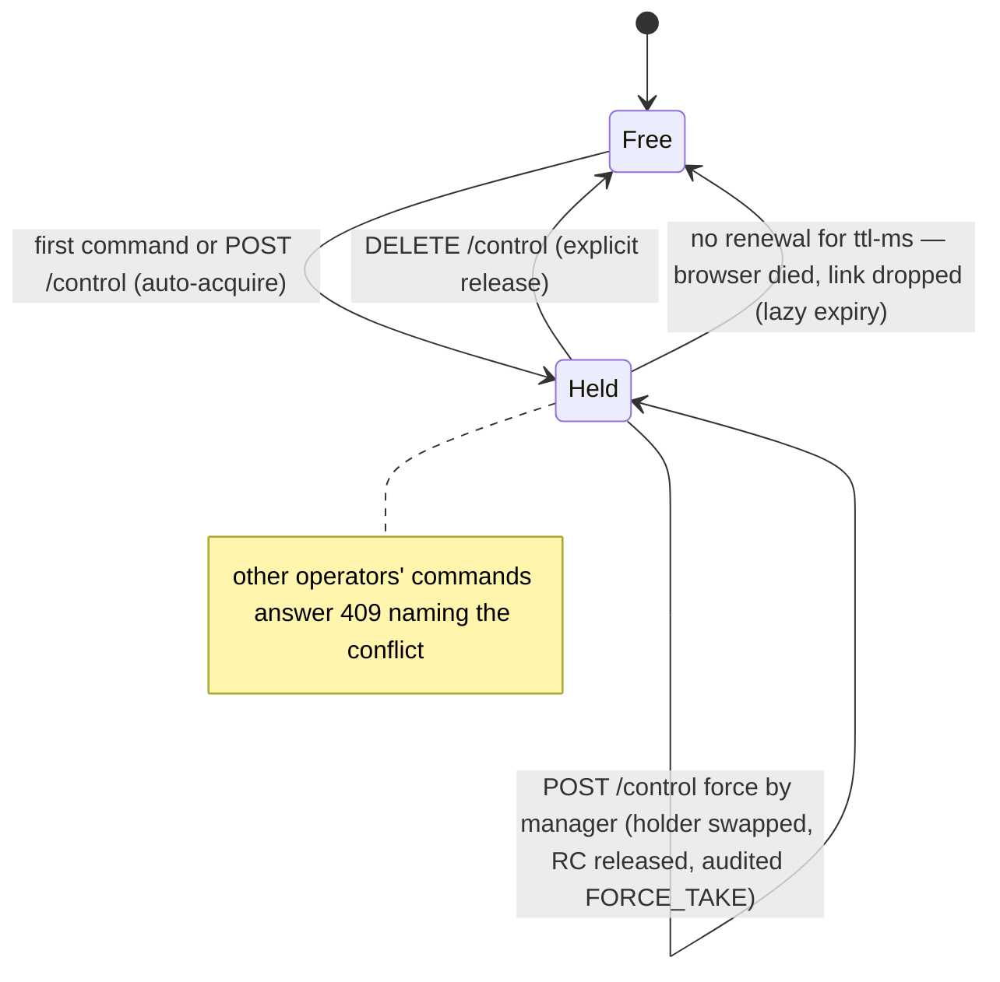
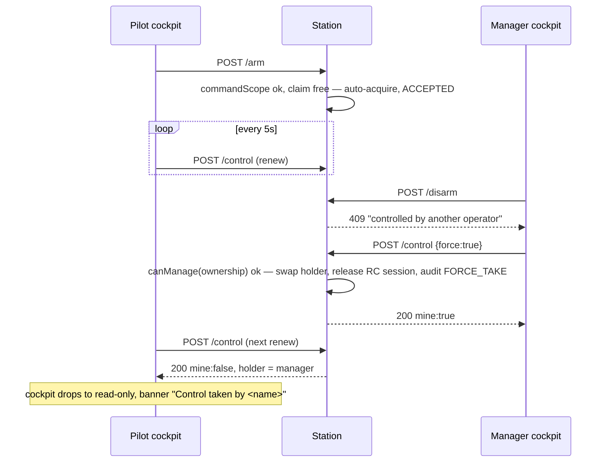

# CREW-CONTROL-PLAN — who is flying, who is watching, and how a person gets in

Status: **authoritative spec** (2026-08-16). Branch: `feat/ops-ux` (wave D of
[OPS-UX-PLAN.md](../done/OPS-UX-PLAN.md) §5). Findings answered:
[docs/conclusions/OPS-UX-REVIEW.md](../../conclusions/OPS-UX-REVIEW.md) §A2 (nobody owns control),
§A3 (there is no crew, only pilots), §O2 (invitations that invite nobody).

This plan **builds on OPS-UX-PLAN §1's frozen authority model** — `canAdminister()` /
`canManage(Ownership)` on `VisibilityScope`, implemented by OPS-UX wave C — and does not relitigate
it. Every CREW wave below starts **after wave C has landed** (they share
`contexts/vision-identity` and `station/vision-api`), and the web waves start after OPS-UX
waves A/B (shared `station/vision-web`).

Delegation: six implementation waves (CC-1…CC-6) with disjoint file scopes per §7; each ends with
its scoped `-pl` build green and every touched MODULE.md updated.

---

## 0. Goal

Three capabilities a two-person field crew needs and does not have:

1. **Control ownership.** At any moment, at most one operator holds control of an aircraft; the
   answer to "am I flying, or are you?" is a server fact, not a conversation. Handover is explicit,
   a manager may force-take, and a holder whose browser dies **loses control automatically within
   seconds** — a stale lock on a flying aircraft is worse than no lock.
2. **Crew roles.** A spotter or referee gets the full read surface — cockpit, map, marks, Wall —
   without ever being handed arm/disarm/RTH. `?watch=1` stops being a URL costume and becomes an
   enforced server posture.
3. **Real onboarding of a person.** Self-service password change, then a one-time-token invite
   bounded by ≤ own scope, that works on a station in a field with no mail server.

---

## 1. Current state (facts the design builds on)

| Fact | Where | Consequence |
|---|---|---|
| `?watch=1` is a query param that hides Start/Stop and the command drawers in the SPA, nothing more | `station/vision-web/src/app/features/fly/cockpit.ts:114-115`, `fly-logic.ts#isWatchMode` | Two people open the same cockpit URL, both get arm/disarm/mode/RTH |
| Flight commands gate on **visibility scope only**: `!scope.includes(asset)` → 403, audited | `contexts/vision-flight/.../DefaultFlightCommandService` (MODULE.md "API surface") | Any assigned pilot — and any second assigned pilot — may command concurrently; no occupancy check anywhere |
| `AssetUsage` is the flight session: opened by perception's `UsageTracker` on **stream start**, closed on stop; owned by warehouse since W1.6c | `contexts/vision-warehouse/.../AssetUsage` (MODULE.md) | It exists only while video streams — see §2.1 for why that disqualifies it as the control holder's home |
| RC relay already has exclusivity + a deadman: one `ManualControlSession` per singleton service, 300 ms watchdog, release-sentinel burst | `contexts/vision-flight/.../DefaultManualControlService` (MODULE.md, RC-CONTROL-PHASE1 R2) | The streaming-input safety story exists; only the one-shot-command story is missing |
| `Role` is `PILOT/MANAGER/ADMIN`, declared least→most privileged; **ordinal order is load-bearing** | `contexts/vision-identity/src/main/java/com/drones/vision/identity/domain/model/Role.java` (javadoc says so explicitly); `User#topRole()` picks max by ordinal; `DefaultUserService#maxGrantableRole` switches on it | A fourth constant would either outrank ADMIN or force a reorder — both silently corrupt `topRole()`/grant ceilings. The crew role must live elsewhere (§2.3) |
| Assignment is a flat pilot↔asset join with no attributes | `AssignmentRepositoryPort` (identity MODULE.md); `storage/persistence/.../AssignmentEntity.java`, migration `V9__pilot_assignments.sql`; `station/vision-app/.../devsupport/InMemoryAssignmentRepository.java` | One nullable-free enum column away from carrying a role |
| `ScopeResolver` builds a PILOT's scope from `assetsForPilot(user.id())` | `contexts/vision-identity/.../DefaultScopeResolver` | The one place "assigned" becomes "visible" — and the natural place to also derive "commandable" (§2.2) |
| The acting principal reaches controllers as `CurrentUser` → `PrincipalResolver` (`userId()/ownership()/scope()`), dev principal unbounded when `vision.auth.enabled=false` | `station/vision-api/.../security/CurrentUser.java`, `station/vision-app/.../security/DevPrincipalResolver.java` | A second scope rides the same seam with zero new architecture |
| `POST /api/assets/{id}/stream` is scoped through `CurrentUser#scope()`; `DELETE .../stream` is deliberately unscoped | `station/vision-api/.../controller/AssetStreamController.java:56-59` | Start/stop switch to the command scope in CC-3 (see §5, and the stop-posture note in §2.6) |
| "Invite a user" is `POST /api/users` with an admin-chosen password; nothing is sent, nothing expires, no password change exists anywhere | `station/vision-web/.../features/org-settings/org-settings-facade.ts`; `DefaultUserService#create`; review §O2 | OPS-UX wave B renames the panel; this plan builds the real thing |
| The ≤-own-scope invite was already a named goal | `docs/plans/done/U-SCOPE-PLAN.md` §"Invite / grant ≤-own-scope" | `DefaultUserService#create`'s gates (`canManageOrg`, `includesGroup` per membership, `maxGrantableRole`) are exactly the invite's gates — reuse, not reinvention |
| Every command/denial is already audited; auth-on/off duality is settled | `AuditTrailPort` decoration everywhere; `SecurityConfig.java:59-77` | Accountability and the permit-list for a new unauthenticated endpoint are both solved problems |
| DOMAIN-SEPARATION already reserves the word **lease** for *worker↔asset* assignment, with the asset as the lease unit (D7) | `docs/plans/active/DOMAIN-SEPARATION-PLAN.md:33,154` | This plan says **control claim**, never "lease". D7 also means an in-heap claim stays correct in the W2+ topology — the asset's whole runtime lives in one process by design |

---

## 2. Design decisions

### 2.1 The control holder does NOT live on `AssetUsage` — the brief's suggested home is the wrong home

OPS-UX-PLAN §5 (and review §A2) proposed `AssetUsage` as "the natural home". It is not, for three
reasons, and this plan says so plainly:

1. **Lifecycle mismatch, in the dangerous direction.** `AssetUsage` opens when the asset starts
   *video streaming* (perception's `UsageTracker`) and closes on stop. Arm, disarm, mode and RTH
   require **no stream and no open usage** — `FlightCommandController` works against a
   camera-less MAVLink asset today. A holder field on `AssetUsage` governs control exactly when it
   matters least (video running) and cannot exist exactly when it matters most (commanding an
   aircraft nobody is watching).
2. **Wrong owner, wrong write cadence.** `AssetUsage` lives in warehouse (the pure leaf) and is
   stamped by perception. Control arbitration is a flight-context concern; renewing a holder every
   5 s through a warehouse repository port would add a persistent-write control loop across two
   contexts for a value that must *die with the process*.
3. **Persistence is the failure mode, not the feature.** A persisted holder survives a station
   restart and a browser crash — the exact "stale lock on a flying aircraft" §A2 warns about. The
   safety-correct shape is **in-heap state with a TTL**, the same honest posture
   `GeofenceMonitor`'s in-heap breach state already documents. Durable accountability comes from
   the audit trail (who took/released/forced control, when), which is already durable.

So: a **control claim** — `ControlClaimService` in `vision-flight`'s application layer, an in-heap
`AssetId → ControlClaim(userId, acquiredAt, expiresAt)` map with **lazy expiry** (a claim past
`expiresAt` reads as free; no background sweeper thread). DOMAIN-SEPARATION D7 keeps this correct
later: the worker that owns an asset owns *all* of it in one process, so the claim never needs to
be distributed.

### 2.2 Command authority is a second `VisibilityScope` — no new type, no new module edge

The PIC/OBSERVER split needs a per-asset "may command" answer. Threading a new authority type
through `vision-flight` would add a `flight → identity` module edge that does not exist today
(flight depends on kernel/platform/warehouse only — MODULE.md) and would violate the measured DAG.

The cheap correct answer: **"what you may command" is itself a visibility-shaped value.**
`ScopeResolver` gains `commandScopeFor(User)`, differing from `scopeFor` in exactly one branch:

| Membership | `scopeFor` (visibility — unchanged) | `commandScopeFor` (new) |
|---|---|---|
| any ADMIN | `unbounded()` | `unbounded()` |
| else any MANAGER | `groups(subtrees)` | `groups(subtrees)` — a manager may command in their subtree (force-take needs this) |
| else PILOT / none | `assignedAssets(all assignments)` | `assignedAssets(`**`PIC assignments only`**`)` |

`PrincipalResolver`/`CurrentUser` gain `commandScope()` beside `scope()` (the peer-value pattern
U-SCOPE already established; `PrincipalResolver.fixed(...)` returns `unbounded()` for both, so
every existing controller test and the auth-off dev principal behave byte-identically).
Command endpoints then simply **pass `commandScope()` where they pass `scope()` today** — the
existing `!scope.includes(asset)` → 403-audited gate in `DefaultFlightCommandService` /
`DefaultManualControlService` enforces the whole OBSERVER posture **with zero changes to
`vision-flight`'s signatures and zero new types anywhere.** Reads keep `scope()`, so an observer's
cockpit, telemetry, capabilities, map, marks and Wall are untouched.

### 2.3 `AssignmentRole { PIC, OBSERVER }` on the assignment — explicitly NOT a fourth `Role` constant

`Role`'s declaration order is a documented invariant: `User#topRole()` picks the max ordinal and
`DefaultUserService#maxGrantableRole` maps scope kinds onto it. A fourth constant appended after
`ADMIN` would make the new role the *most* privileged; inserted before `PILOT` it would reorder
every existing ordinal. **No implementer may touch `Role.java` for this feature.** The crew role is
a property of one person's relationship to one asset — it lives on the assignment
(`AssignmentRole`, new enum in `identity.domain.model`), exactly as review §A3 recommends. An
observer's *user* role remains `PILOT`; only the assignment says what kind.

### 2.4 Commands auto-acquire; only a genuine conflict refuses

A lone pilot must not fill in a form before arming. Frozen semantics: every guarded flight command
(**arm / disarm / mode / return-home / RC engage**) first calls
`ControlClaimService#acquireOrRenew(assetId, actor)` — free or already-mine ⇒ claim
(re)established and the command proceeds; held by someone else ⇒ `IllegalStateException` → the
existing 409 mapping, no `ApiExceptionHandler` change. With auth off, every caller is the same dev
principal, so the claim can never conflict — **the default deployment's behavior is unchanged and
every existing test stays semantically green** (flight service tests gain a constructor
collaborator; that is the only ripple).

The claim is kept alive by the cockpit re-POSTing `/control` on its existing 5 s cadence **only
while it is `mine`**; the TTL (`vision.control.ttl-ms`, default `15000`, root `application.yaml`)
means a crashed browser, a dropped Wi-Fi link, or a closed laptop frees the aircraft in ≤ 15 s.
Merely having a cockpit open claims nothing — the first command does.

### 2.5 What the flight controller needs to know: nothing

Control ownership is **station-side arbitration**, not an aircraft-side protocol:

- One-shot commands (`FlightCommandPort`) are stateless request→ack; the FC neither knows nor
  cares which human pressed the button. When a claim lapses, the aircraft simply continues its
  current mode — exactly what it does today when an operator walks away.
- The streaming case is already covered twice: `ManualControlSession`'s 300 ms watchdog releases
  the relay, and the FC's own RC failsafe handles link loss below that.
- A force-take therefore needs no MAVLink message: the manager's claim replaces the pilot's, the
  pilot's next command 409s, an active RC session is released server-side (§5.3), and the manager
  issues their own commands. Inventing an FC-visible "operator handover" would add a protocol
  surface with no safety benefit — deliberately not done.

### 2.6 What the claim deliberately does NOT guard

Stream start/stop and detection toggles move to `commandScope()` (an OBSERVER may not start,
stop, or reconfigure the pilot's stream) but are **not** claim-guarded: starting video is not
flying, and managers/cleanup paths stop streams legitimately while a pilot holds control. Note the
posture change on `DELETE /api/assets/{id}/stream`: today it is deliberately unscoped
(`AssetStreamController.java:58` — "nothing to hide"); after CC-3 an out-of-command-scope stop of a
*resolvable* asset is a 403 (a command honestly refused), while the unknown-asset no-op stays a
no-op.

### 2.7 The invite token is the carrier — no mail server, ever

This station deploys offline in a field. Any design that "sends" anything is fake capability. The
invite's output **is** a one-time token, rendered once to the inviter as (a) a full accept URL and
(b) the bare 26-character code — carried by whatever the field has: a QR of the URL on the
inviter's screen, a radio read-out of the code, a piece of paper. The invitee types it into an
unauthenticated `/accept` page and chooses their own username and password. The server stores only
the token's SHA-256 (a leaked database row invites nobody), TTL-bounded
(`vision.invites.default-ttl-hours: 72`), single-use, revocable, and gated at creation by the
**identical** ≤-own-scope checks `DefaultUserService#create` already enforces. Self-service
password change ships first (CC-5) so the day-one crew whose passwords traveled by voice can rotate
them without waiting for CC-6.

---

## 3. Domain model (FROZEN)

### 3.1 `vision-identity`

- `enum AssignmentRole { PIC, OBSERVER }` — `identity.domain.model`. No ordinal semantics; javadoc
  must state why this is not a `Role` constant (§2.3).
- `record Assignment(UserId userId, AssetId assetId, AssignmentRole role)` — the join, now with a
  shape.
- `AssignmentRepositoryPort` — existing methods keep their exact contracts (`assetsForPilot(UserId)`
  returns assets of **both** roles; `pilotsForAsset`, `isAssigned`, `unassign` unchanged). Changes:
  - `assign(UserId, AssetId, AssignmentRole)` replaces the 2-arg form — upsert; re-assigning with a
    different role is a role change, still idempotent per (user, asset).
  - new `Set<AssetId> assetsForPilot(UserId, AssignmentRole)` — the command-scope read.
  - new `List<Assignment> assignmentsForAsset(AssetId)` — the roster read with roles.
- `ScopeResolver` gains `VisibilityScope commandScopeFor(User)` per the §2.2 table.
  `DefaultScopeResolver` implements both over the same subtree walk (shared private helper — do not
  duplicate the BFS/cycle guard).
- `AssignmentService#assign(UserId, AssetId, AssignmentRole, VisibilityScope granter)` — same
  existence-404 / ≤-own-scope-403 gates, role passed through.
- `UserService` gains (CC-5):
  - `void changeOwnPassword(UserId actor, String currentPassword, String newPassword)` — verifies
    `currentPassword` via `PasswordHasherPort#verify` (mismatch → `AccessDeniedException`), rejects
    `newPassword` shorter than `vision.auth.min-password-length` (default 8) with
    `IllegalArgumentException`, saves the re-hashed aggregate. Audited (`PASSWORD_CHANGED`, own).
  - `void resetPassword(UserId target, String newPassword, VisibilityScope acting)` — same
    management gate as `setEnabled` (manage-covers-target-membership, else 403). Audited.
- `Invite` aggregate (CC-6): `record Invite(InviteId id, String tokenHash, String displayName,
  String email, List<Membership> memberships, UserId createdBy, Instant createdAt,
  Instant expiresAt, InviteStatus status)` — `email` nullable; `InviteStatus
  { PENDING, ACCEPTED, REVOKED }` (expiry is derived from `expiresAt`, never stored).
- `InviteRepositoryPort`: `Invite save(Invite)` upsert; `Optional<Invite> findById(InviteId)`;
  `Optional<Invite> findByTokenHash(String)`; `List<Invite> findAll()` snapshot.
- `InviteService` → `DefaultInviteService(InviteRepositoryPort, UserRepositoryPort,
  PasswordHasherPort, AuditTrailPort, Clock)`:
  - `CreatedInvite create(InviteSpec, UserId actor, VisibilityScope acting)` — gates copied from
    `DefaultUserService#create` exactly (`canManageOrg`; per-membership `includesGroup`;
    `maxGrantableRole` ceiling; empty memberships only for `unbounded()`). Generates the raw token
    (26-char Crockford base32 from `SecureRandom`, ~130 bits), stores SHA-256 only, returns the raw
    token **once** in `CreatedInvite(invite, rawToken)`.
  - `User accept(String rawToken, String username, String rawPassword)` — hash-lookup; unknown /
    already `ACCEPTED` / `REVOKED` → `NoSuchElementException` (404); past `expiresAt` →
    `InviteExpiredException` (new, → 410); then creates the user with the invite's frozen
    memberships via the existing aggregate path (duplicate username → 409), marks the invite
    `ACCEPTED`. Audited with the invite id as target — the trail shows who invited whom.
  - `List<Invite> list(VisibilityScope acting)` — `unbounded()` sees all; `GROUPS` sees invites
    whose every membership group is included; others empty. Token hash never leaves the service.
  - `void revoke(InviteId, VisibilityScope acting)` — same filter, idempotent, audited.

### 3.2 `vision-flight`

- `record ControlClaim(AssetId assetId, UserId holder, Instant acquiredAt, Instant expiresAt)`.
- `ControlClaimService` (interface) → `DefaultControlClaimService(Clock, long ttlMs)` — in-heap
  `ConcurrentHashMap`, all transitions via atomic `compute`; lazy expiry (a read past `expiresAt`
  is free); no scheduler:
  - `ControlClaim acquireOrRenew(AssetId, UserId)` — free/expired/mine ⇒ new-or-extended claim;
    held by another ⇒ `IllegalStateException("…controlled by another operator")` (→ 409).
  - `ControlClaim forceTake(AssetId, UserId)` — unconditional replacement. **Authorization is the
    caller's job** (the controller checks `canManage(ownership)`); this service only swaps holders
    and fires revocation listeners.
  - `void release(AssetId, UserId)` — idempotent; releases only if held by this user.
  - `Optional<ControlClaim> holder(AssetId)` — expired claims read as empty.
  - `void onRevoked(AssetId, Runnable)` / corresponding deregistration — per-asset listeners run
    synchronously inside `forceTake` (the RC-release hook, §5.3).
- `DefaultFlightCommandService` and `DefaultManualControlService` gain the `ControlClaimService`
  collaborator: `sendAndAudit`/`engage` call `acquireOrRenew` **after** the scope gate and
  **before** the port. Audit vocabulary grows: `result ∈ {…, CONTROL_HELD:<byUserId>}` on a
  refused command; new `CONTROL` action entries with `result ∈ {ACQUIRE, RENEW?, RELEASE,
  FORCE_TAKE}` — `RENEW` is deliberately **not** audited (a 5 s heartbeat is noise, not history);
  lazy expiry writes no entry (the next `ACQUIRE` tells the story).

### 3.3 `vision-platform` / `Role.java` / `AssetUsage`

**Untouched.** No new `VisibilityScope` shape, no fourth `Role`, no holder field on `AssetUsage`.

---

## 4. Wire contract (FROZEN — implementers may not vary shapes, names, or codes)

### 4.1 Control

| Method | Path | Success | Failures |
|---|---|---|---|
| GET | `/api/assets/{id}/control` | 200 `ControlStatusResponse` | 404 unknown **or out-of-visibility** asset (a read hides existence), 400 bad UUID |
| POST | `/api/assets/{id}/control` | 200 `ControlStatusResponse` (acquired **or renewed** — idempotent for the holder; this is the heartbeat) | 403 out of command scope; 403 `force:true` without `canManage(ownership)`; 409 `{message}` held by another (without force); 404 unknown asset; 400 bad UUID |
| DELETE | `/api/assets/{id}/control` | 204 (idempotent — free or own claim released) | 403 held by another and caller lacks `canManage(ownership)`; 404 unknown; 400 bad UUID |

- `AcquireControlRequest { force?: boolean }` — the whole body may be absent; `force` defaults
  `false` (mirrors `arm`'s own optional-body precedent).
- `ControlStatusResponse { holderUserId: string|null, holderDisplayName: string|null,
  acquiredAt: string|null, expiresAt: string|null, mine: boolean, mayCommand: boolean }` — the
  three nullable fields are `null` together exactly when free (`@JsonInclude` **not** used here —
  an explicit `null` is the honest "nobody" answer); `holderDisplayName` resolved by the controller
  via identity's existing `AuthService#find(UserId)` (falls back to the id string);
  `mayCommand = currentUser.commandScope().includes(asset)` — **this field is what the cockpit
  renders its posture from**, replacing `?watch=1` as the source of truth.
- Guarded commands (`/return-home`, `/mode`, `/arm`, `/disarm`, WS `engage`) additionally answer
  **409** `{message: "…is controlled by another operator"}` when the claim is held by someone
  else — same `IllegalStateException`→409 channel as not-commandable, distinguished by message
  only (the documented pre-existing limitation of that channel; a typed split is out of scope).

### 4.2 Assignment roles (additive)

| Method | Path | Change |
|---|---|---|
| PUT | `/api/assets/{assetId}/pilots/{userId}` | gains optional body `AssignPilotRequest { role?: "PIC"\|"OBSERVER" }`; absent body or absent field ⇒ `PIC` — **byte-identical to today's call**. Re-PUT changes the role. Codes unchanged (204/403/404/400; unknown role string → 400) |
| GET | `/api/assets/{assetId}/pilots` | `PilotResponse` gains `role: "PIC"\|"OBSERVER"` |
| GET | `/api/me/assignments` | `AssignmentResponse` gains `role` |

### 4.3 Passwords (CC-5)

| Method | Path | Success | Failures |
|---|---|---|---|
| POST | `/api/me/password` | 204 | 403 wrong `currentPassword`; 400 new password blank/under min length; 409 `vision.auth.enabled=false` (changing a password on an unsecured station is a lie — refuse honestly) |
| POST | `/api/users/{id}/password` | 204 | 403 target outside management scope; 404 unknown user; 400 bad password/UUID |

`ChangePasswordRequest { currentPassword, newPassword }` · `ResetPasswordRequest { newPassword }`.

### 4.4 Invites (CC-6)

| Method | Path | Success | Failures |
|---|---|---|---|
| POST | `/api/invites` | 201 `InviteCreatedResponse` | 403 any ≤-own-scope gate (§3.1); 400 blank displayName / bad membership |
| GET | `/api/invites` | 200 `InviteSummaryResponse[]` (scope-filtered, newest first) | — |
| DELETE | `/api/invites/{id}` | 204 (idempotent revoke) | 403 out of scope; 400 bad UUID |
| POST | `/api/invites/accept` | 200 `MeResponse` + session established (`SessionAuthenticator#login`-equivalent; a no-op session when auth is off, like login itself) | 404 unknown / consumed / revoked token; **410 expired**; 409 duplicate username; 400 blank username / bad password |

- `CreateInviteRequest { displayName, email?, memberships: [{groupId, role}], expiresInHours? }` —
  `expiresInHours` clamped to `1..720`, default `vision.invites.default-ttl-hours`.
- `InviteCreatedResponse { inviteId, token, acceptPath, expiresAt }` — `token` appears **here and
  never again** (not in GET; not in logs; not in the audit entry — the audit records the invite id).
  `acceptPath` is `"/accept?token=<token>"` — a path, not an absolute URL: the server does not know
  which of its interfaces the invitee can reach; the SPA composes the full URL/QR from
  `window.location.origin`.
- `AcceptInviteRequest { token, username, password }`.
- `/api/invites/accept` joins `/api/auth/login` in `SecurityConfig`'s enabled-chain permit-list
  (`station/vision-app/.../config/SecurityConfig.java:75`); the SPA route `/accept` sits **outside**
  the auth guard's children wrapper, like `/login`.

### 4.5 The enforcement matrix (what each person may do, after this plan)

| Surface | OBSERVER (assigned) | PIC (assigned) | MANAGER (subtree) | ADMIN / auth-off |
|---|---|---|---|---|
| Cockpit video, telemetry, capabilities read, map, marks*, Wall, replay | yes | yes | yes | yes |
| `GET /control` | yes (sees who is flying) | yes | yes | yes |
| Stream start / stop / config patch | **403** | yes | yes | yes |
| arm / disarm / mode / RTH / RC engage / `POST /control` | **403** (command scope) | yes (409 if another holds) | yes (409 if another holds) | yes |
| `POST /control {force:true}` | 403 | **403** (not a manager) | yes | yes |
| Assign / change roles | 403 | 403 | yes (own subtree) | yes |

\* Mark creation stays governed by the map's own layer-grant model (MAP-REWORK §3) — a spotter
dropping marks is the point of having a spotter.

### 4.6 Control lifecycle

---

## 5. Behavior specs the waves implement

### 5.1 The cockpit's posture is a server fact

`CockpitFacade` polls `GET /control` on the cockpit's existing 5 s cadence. Effective mode =
`!mayCommand || urlWatchParam` — `?watch=1` survives only as a *voluntary* layout hint for a PIC
who wants a clean watch view; it can no longer grant anything it hides. While `mine`, the poll
switches to `POST /control` (poll and renewal are the same request). When `mine` flips false
without the user's own release, show a persistent banner naming the new holder ("Control taken by
&lt;name&gt;") — honest status over optimistic status. The Take-control affordance renders only when
`mayCommand && !mine && holder != null`, labeled **Take control** for a manager (force) and shown
as the disabled truth "&lt;name&gt; has control" for a second PIC (their path is the radio, or
waiting for expiry — deliberately no PIC-vs-PIC force).

### 5.2 Expiry is the safety feature

No renewal for `ttl-ms` ⇒ the next reader sees the asset free. The next command by anyone
auto-acquires. Nothing is sent to the aircraft (§2.5); an armed aircraft stays armed under its FC's
own failsafe — this plan never pretends the station can out-safety the flight controller.

### 5.3 Force-take vs an active RC session

`forceTake` synchronously runs the asset's revocation listeners; `DefaultManualControlService`
registers `session::release` on engage and deregisters on release. The displaced pilot's WebSocket
receives the existing `released` frame (`REASON_SOCKET_CLOSE` machinery unchanged); their sticks go
dead within one watchdog period — strictly safer than two live stick sources.

### 5.4 Auth-off invariant (non-negotiable, same as OPS-UX §1)

With `vision.auth.enabled=false` every caller is the unbounded dev principal: `commandScope()` is
unbounded, the claim never conflicts (one principal), invites/password endpoints behave as
specified (409 for own-password, invites technically usable). **Nothing about the default
deployment's observable behavior changes.** Any test failing under the default profile is a wave
bug.

---

## 6. Estimate, re-derived

FEATURE-MATRIX line 38 filed "Control/watch handoff" as Tier 3 / **L** / post-U-e — priced before
U-e shipped and before `AssetUsage`, audit decoration, `CurrentUser#scope()`, and the RC watchdog
existed. What remains today is: one in-heap service + two collaborator additions (CC-2), one
resolver branch + one enum + one column (CC-1), controller scope-source swaps + three endpoints
(CC-3), and cockpit UI (CC-4) — **M overall (~4 agent-days)** for §A2+§A3. The §2.2
second-scope alignment is what dissolved the "L": no type ripples through any context signature.
Invitations (CC-5+CC-6) are a further ~3 agent-days.

---

## 7. Waves — disjoint file scopes, agent per wave

All waves start after OPS-UX wave C; CC-4 also after OPS-UX waves A/B. Arrows are hard ordering;
CC-2 may run **in parallel** with CC-1 (disjoint modules).

| Wave | Scope (all paths exclusive to the wave at its time) | Delivers | Build | Est |
|---|---|---|---|---|
| **CC-1** | `contexts/vision-identity/**` | `AssignmentRole`, `Assignment`, port changes, `commandScopeFor`, role-aware `AssignmentService`; unit tests (hand-fake ports per module convention); MODULE.md | `./mvnw -B -pl contexts/vision-identity test` | S (0.5 d) |
| **CC-2** ∥ CC-1 | `contexts/vision-flight/**` | `ControlClaim`/`ControlClaimService`/`DefaultControlClaimService` (mutable-`Clock` tests, concurrency test via atomic `compute`); claim guard + audit in the two command services (existing tests gain the collaborator — expected churn, say so in the report); MODULE.md | `./mvnw -B -pl contexts/vision-flight test` | M (1 d) |
| **CC-3** ← CC-1, CC-2 | `station/vision-api/**`, `station/vision-app/**`, `storage/persistence/**` | `commandScope()` on `PrincipalResolver`/`CurrentUser` + both vision-app resolvers; `ControlController` + DTOs; scope-source swap in `FlightCommandController`, `AssetStreamController`, stream-config patch, `ManualControlHandshakeInterceptor` (stash command scope); `AssignPilotRequest`/role fields; `V10__assignment_roles.sql` (`ADD COLUMN role varchar NOT NULL DEFAULT 'PIC'`) + `AssignmentEntity` + `InMemoryAssignmentRepository`; wiring beans + `vision.control.ttl-ms`; MODULE.mds | `./mvnw -B -pl storage/persistence,station/vision-api,station/vision-app test -DskipWeb` | M–L (1.5 d) |
| **CC-4** ← CC-3 | `station/vision-web/**` | control poll/renew in `CockpitFacade`; posture from `mayCommand`; control chip + Take-control + taken banner; roster/pilots-card role picker; picker copy for observer assets; MODULE.md | `./mvnw -B -pl station/vision-web clean install` | M (1.5 d) |
| **CC-5** ← CC-3 | `contexts/vision-identity/**` (UserService slice), `station/vision-api/**` (password endpoints + DTOs), `station/vision-web/**` (identity-chip "Change password", org-settings reset) | self-service password change + manager reset, §4.3 exactly; MODULE.mds | identity, api, web scoped builds | M (1 d) |
| **CC-6** ← CC-5 | `contexts/vision-identity/**` (invite slice), `storage/persistence/**` (`V11__invites.sql` + entity + repo), `station/vision-app/**` (permit-list line, in-memory repo, wiring, `vision.invites.*`), `station/vision-api/**` (`InviteController` + DTOs), `station/vision-web/**` (org-settings Invites tab with URL/QR/code + `/accept` page outside the auth guard) | §3.1 invites + §4.4 exactly | all touched, scoped | L (2 d) |

Each wave is independently shippable: after CC-1/CC-2 nothing user-visible changes (defaults are
`PIC` and never-conflicting claims); after CC-3 the posture is enforced server-side even before the
UI learns to render it; CC-5 without CC-6 is already the day-one credential-rotation win.

---

## 8. Out of scope — deliberately not doing

- **A fourth `Role` constant, or any edit to `Role.java`** (§2.3). Also no CREW role tree.
- **A holder/pilot field on `AssetUsage`** (§2.1). A "who flew this flight" denormalization is
  answerable from the audit trail today; a proper column is a later, separate decision.
- **Persisting or distributing the control claim** — single-process by design; DOMAIN-SEPARATION
  D7 keeps it correct in the W2+ worker topology.
- **PIC-vs-PIC force-take** — only `canManage` may force; two PICs resolve by radio or TTL.
- **Any FC-visible handover protocol** (§2.5).
- **An SSE `control` topic** — the 5 s poll rides existing cadence; push arrives free with the
  DOMAIN-SEPARATION event topology (`evt.*`) rather than a bespoke topic now.
- **Claim-guarding stream start/stop** (§2.6) and any change to detection/CV gating semantics
  (CV-DEMAND owns those).
- **Email/SMS delivery of invites** — the token is the carrier, full stop (§2.7). No SMTP
  dependency enters this codebase.
- **Rate-limiting `/api/invites/accept` and password-complexity policy beyond min-length** — named
  honestly as accepted gaps for a LAN-deployed station; revisit if the station ever fronts a
  hostile network.
- **Forced password change on first login** — the invite flow makes it unnecessary for new users;
  for the seeded three, OPS-UX A6's unsecured-station banner is the honest mitigation.

## 9. For the record — where this plan contradicts its brief

OPS-UX-PLAN §5 says `AssetUsage` "is the natural home for a control holder." This plan rejects
that placement with the three reasons in §2.1 and puts the claim in `vision-flight` instead. The
review's underlying requirement (§A2 — session-anchored, expiring, handover-capable control) is
fully met; only the storage location differs, and the difference is the safety case.
