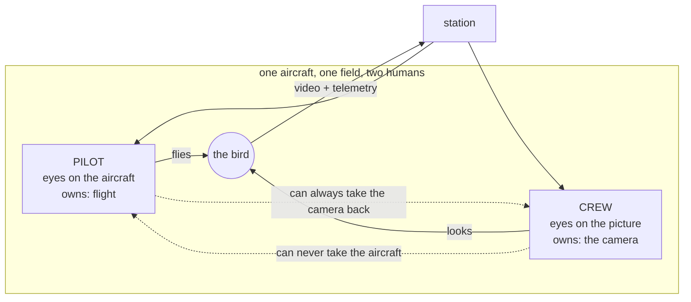
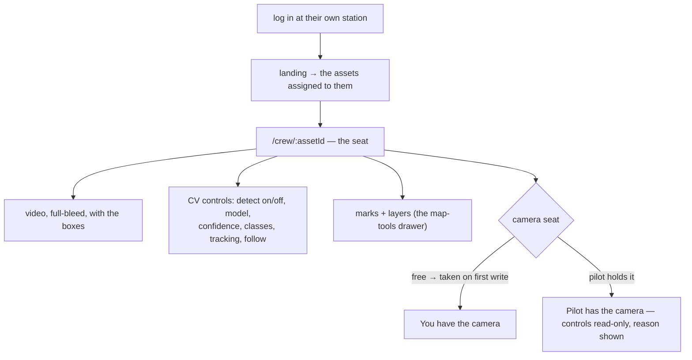
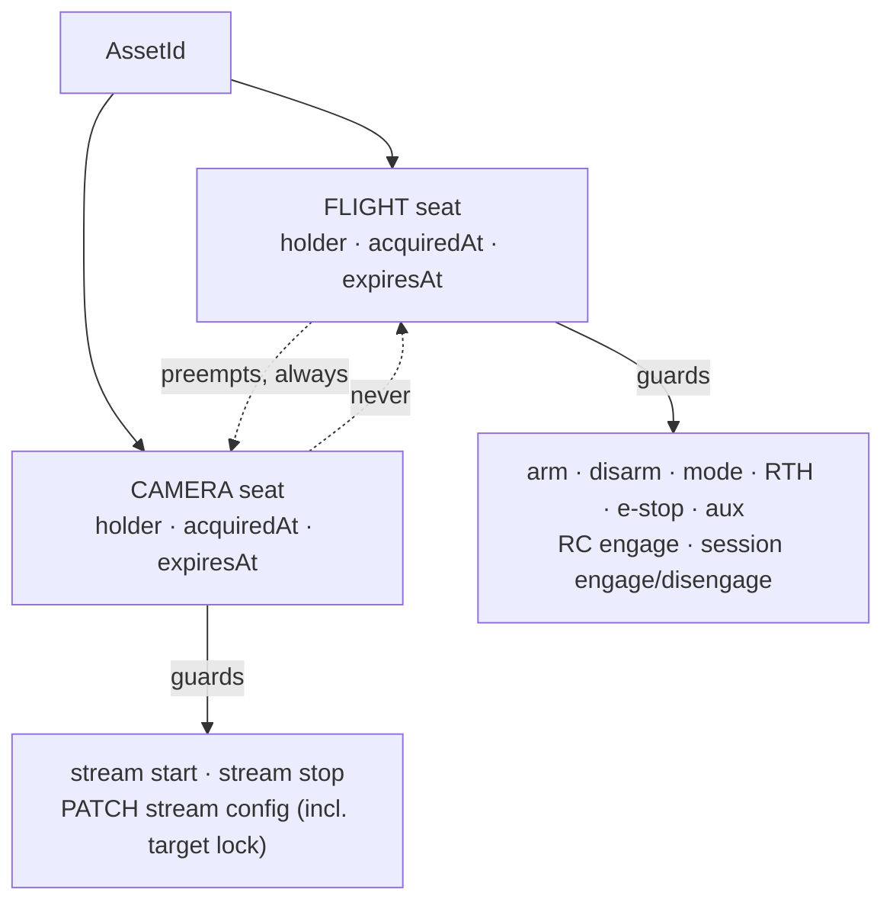
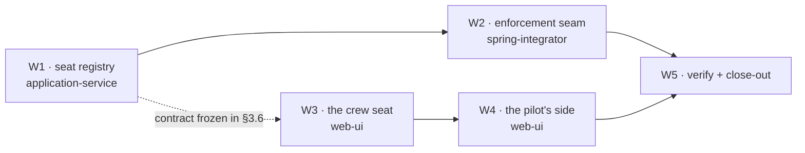

# CREW-CONTROL — two seats on one aircraft: the pilot flies, the crew works the camera

Status: **ACTIVE, nothing built.** Branch `feat/crew-control`, sub-branch per wave · owner request
2026-09-04: *"two people operating one drone — the pilot flies, a crew member owns the camera/CV.
Think the whole flow from the user's perspective before any implementation."*

This document **replaces the 2026-08-16 CREW-CONTROL spec** that occupied this path (written as
[`OPS-UX-PLAN.md`](../done/OPS-UX-PLAN.md) wave D, never implemented). That spec answered a
different question — *"which of two pilots may fly?"* — and bundled passwords and invites into the
same doc. The question now is *"how do two people with two different jobs share one aircraft?"*
**§6 is a row-by-row ledger** of what survives, what is retired, and what moved to
`AUTH-ROLES-PLAN.md` — including the two javadocs that cite the old section numbers and the wave
that repoints them.

**Grounding.** Every claim in §2 was read on `master` @ `fe931e7e` on 2026-09-04 and carries a
file:line. Design language and the layers/stages vocabulary come from
[`FLY-FLOW-PLAN.md`](FLY-FLOW-PLAN.md) and [`COMMAND-MAP-FLOW-PLAN.md`](COMMAND-MAP-FLOW-PLAN.md);
the enforcement idiom comes from [`LIVE-SCOPE-PLAN.md`](../done/LIVE-SCOPE-PLAN.md) §2.1; the
authority predicates come from [`OPS-UX-PLAN.md`](../done/OPS-UX-PLAN.md) §1. Industry grounding for
the two-seat split is [`asset-flows/R4-industry-practice.md`](asset-flows/R4-industry-practice.md)
§4 (ATAK Observer Control, RPIC retains final authority) and its rows 11/13.

**Hard dependency, stated up front.** A second seat needs a second *person*, and today with
`vision.auth.enabled=false` every request resolves to one dev principal
(`station/vision-app/.../security/DevPrincipalResolver.java:29`). `AUTH-ROLES-PLAN.md` is being
authored in parallel by another agent. §3.7 names the three contracts this plan **imports** from it,
with the exact shape required and a working stub so that **no wave below is blocked on it**. Only
the *usefulness* of the feature is blocked; the code is not.

---

## 0. The flow

### 0.1 The field unit



Two humans, two jobs, **one asymmetry that decides the whole design**: the pilot is responsible for
the aircraft, so flight authority is never negotiable and never transferable to the crew. The crew's
job is downstream of a flying aircraft — valuable, but never safety-critical in the same way. Every
rule in §3.2 falls out of that one asymmetry.

### 0.2 The pilot's journey (what must not change, and the one thing that is added)

| Step | Today | After this plan |
|---|---|---|
| Opens `/fly`, picks the bird | picker → cockpit, stage `S0→S1` | **identical** |
| Starts video, watches | dock card → `S2→S3` | **identical** |
| Takes control | one CTA "Take control" → connect modal → `S4` | **identical** |
| Flies | HUD, arm zone, sticks, OSD | **identical — no crew concept can touch any of it** |
| **Learns a crew member is on this bird** | *impossible today* | **one status line** on the dock: `Crew · Anna on camera`. Not a button. Not a badge cluster. Not a notification. |
| Wants the camera back | n/a | opens the Vision drawer (already on the rail) → one **Take camera** button. Or simply touches any camera control — it succeeds and takes the seat. |
| Leaves | Release / close tab | **identical**; both seats expire on their own |

**The pilot never faces a refusal on their own aircraft.** Not for flight, not for the camera. That
is the design's load-bearing promise, and §3.2's rule 3 is what implements it.

### 0.3 The crew's journey



What the crew seat is **not**: it is not the cockpit with buttons hidden. There are **zero flight
verbs in the crew seat's markup and zero flight verbs the server will accept from a caller who does
not hold the flight seat.** Hiding is a courtesy; the server refusal is the feature.

What the crew seat **is**, concretely: `features/live/` (video + detections strip + map-tools, no
flight controls — `station/vision-web/src/app/features/live/live.html:30,148`) plus the CV control
body (`features/fly/cv-control-panel.*`) plus a seat chip. That is the single cheapest structural
finding in this plan (§2.1 A1).

### 0.4 The four hard edges, answered

| Edge | The verdict |
|---|---|
| **Contention** — both want the camera | **There is no gimbal to contend over.** `contexts/vision-flight/.../domain/model/ControlAction.java:8-10` states it outright: *"our vehicle is not a MAVLink camera and it commands no gimbal"*; gimbal angles are decoded RX-only (`drone-link/mavlink/.../AttitudeState.java:63-65`) and there is no PTZ/zoom UI, facade or endpoint anywhere in the SPA. The **real** contended object is the single live CV pipeline per stream — one `PATCH /api/streams/{id}/config` writing model, confidence, classes, tracking mode **and the target lock**, last-write-wins today (`station/vision-api/.../controller/StreamController.java:238-239`). That is what the camera seat governs. Answering "who owns the gimbal" with a gimbal control we do not have would be fake capability. |
| **Handoff** — crew leaves, controls return | **Expiry, not ceremony.** A seat is in-heap with a TTL (default 15 s) refreshed by the SPA on its existing 5 s cadence. A closed laptop, a dead Wi-Fi link or a killed browser returns the camera to nobody within 15 s — and "nobody holds the camera" is exactly today's behaviour, so the pilot's controls simply work again. No handoff dialog, no confirmation, no state to clean up. |
| **Crew without a pilot** — fixed camera, parked drone | **Fully supported and it is the base case, not the exception.** When no flight seat is held there is nobody to preempt: the first crew member to write takes the camera seat, a second gets a 409 naming the holder, and a manager may force. A fixed camera has no flight seat *ever* — the feature works unchanged. This is the row that makes crew control useful to [`CAMERA-FIRST-PLAN.md`](CAMERA-FIRST-PLAN.md)'s camera product, not only to drones. |
| **The one-CTA glass law** (FLY-FLOW §2) | **Survives, because the second seat is a status, never a call to action.** The crew's existence adds exactly one line of text to the pilot's dock and zero buttons to the glass. The take-back control lives at layer L3 (the Vision drawer, on demand), and is redundant anyway because any camera write by the pilot takes the seat implicitly. See §3.5. |

---

## 1. Users and jobs

| Person | Where they sit | Their one sentence | What they must never be able to do |
|---|---|---|---|
| **Pilot** (PIC) | `/fly/:assetId`, eyes mostly off the screen | "Keep the aircraft safe and put it where the picture needs to be." | Lose flight authority to anyone but a manager; be refused a control on their own aircraft |
| **Crew** (sensor operator) | `/crew/:assetId`, own laptop, eyes on the picture | "Find the thing, hold it in frame, mark it, and say what I see." | Arm, disarm, change mode, RTH, e-stop, or take the sticks — by UI *or* by crafted request |
| **Commander** (manager) | `/command` | "Who is on which bird, and can I break a stuck seat?" | — (may force either seat in their subtree) |
| **Lone operator** (today's only user) | `/fly/:assetId` | "I do both jobs." | — **must observe zero change**; this is the guardrail, §3.8 |

---

## 2. Diagnosis

### 2.1 What already exists — the alignments that make this cheap

| # | Fact | Where | Why it matters |
|---|---|---|---|
| **A1** | `features/live/` is a routed, facade-clean, video-first page with detections, the map-tools drawer and **no flight controls at all** | `station/vision-web/src/app/features/live/{live.ts,live-facade.ts:37,live.html:30,148}` | The crew seat is this page + the CV control body + a seat chip. There is no new page *architecture* to invent |
| **A2** | Every CV control in the app funnels into **one** write endpoint | `PATCH /api/streams/{streamId}/config` — `StreamController.java:261`; SPA side `core/fleet/fleet-store.ts:363` → `core/api/vision-api.ts:223` | The camera seat guards exactly one write path, plus start and stop. Not thirty |
| **A3** | Track selection *is* that same endpoint — `{"tracking":{"mode":"FOLLOW","lock":{"trackId":7}}}`, with **no separate endpoint by design** | `StreamController.java:235-239` | "Who picks the target" needs no new surface at all |
| **A4** | A **monotonic, server-allocated `lockSeq`** already orders lock changes end-to-end, and cv-service applies a lock only if strictly newer | `perception/.../TrackingConfigPatch.java:95-116`; `cv/cv-service/cv_service/tracking/lock.py:101-119` | The *ordering* half of contention is solved. Only *authority* is missing — no protocol work, no proto change |
| **A5** | Declutter/boxes, priority tiers and class-hover are **client-only**, persisted per browser | `shared/player/detection-overlay-logic.ts:24-35`, `SettingsStore` (localStorage) | Each seat keeps its own view without any arbitration. Never guard them (§3.3) |
| **A6** | `<vision-map-tools>` is already a multi-host drawer with a frozen capability record, mounted on four pages, holding no store references itself | `shared/map/map-controls/map-tools/map-tools.ts:17,59-70`; mounts at `command.html:25`, `cockpit.html:424,433`, `live.html:148`, `asset-detail.html:171` | Marks/layers/draw/zones reach the crew seat with **zero** new plumbing |
| **A7** | Per-asset SSE topics `telemetry:` / `detections:` / `geo:` are authorized per topic *and per delivery*, and the SPA ref-counts them | `LiveAssetAccess.java:126,144,171`; `LiveConnection.java:127-135`; `core/live/live-store.ts:295` | A crew seat watching the same asset as the pilot costs the server **no** extra subscription and needs no new authorization |
| **A8** | The exact "resolve stream → device → asset → ownership, then decide" collaborator already exists in vision-api, with an ArchUnit rule that fails the build when a handler has no check | `security/StreamAccess.java:63,109,159`; `@OpenByDesign` guard, LIVE-SCOPE W1 | The seat check has a home, a precedent and a guard. Nothing new architecturally |
| **A9** | `AssetUsage.pilotId` exists, is first-attribution-wins, and is stamped by `POST /api/assets/{id}/session` | `warehouse/.../AssetUsage.java:49-60,154`; `perception/.../UsageTracker.java:314,334-335`; `AssetSessionController.java:93-98` | Durable "who flew this" is already honest; this plan does not need to touch it (§5 defers the crew half deliberately) |
| **A10** | `AuthService#find(UserId)` resolves a display name in vision-api | `contexts/vision-identity/.../AuthService.java:44` | "Crew · Anna" is renderable today |

### 2.2 What is missing

| # | Gap | Evidence |
|---|---|---|
| **M1** | **Nothing anywhere records who is operating an asset.** A repo-wide search for a holder / claim / lock / seat concept over `contexts/`, `station/`, `core/`, `drone-link/` returns zero domain hits | verified 2026-09-04; the three near-misses are `DefaultManualControlService.activeSession:155` (one field, one bean), `ManualControlWebSocketHandler`'s `ConnectionState.session:385`, and `AssetUsage.pilotId` (a record, not a lock) |
| **M2** | **Two authorized operators may command one aircraft concurrently.** The only per-asset check on every flight command and on RC engage is `scope.includes(...)` | `DefaultFlightCommandService.java:222`; `DefaultManualControlService.java:237`. Named as open by [`PLATFORM-AUDIT-FINDINGS.md`](PLATFORM-AUDIT-FINDINGS.md) row 10 and by `AssetStreamController.java:64` / `SimulationController.java:48`, both of which point here |
| **M3** | **Two operators may fight over the CV pipeline silently.** `PATCH .../config` has a visibility gate and nothing else; the loser is never told | `StreamController.java:261`; LIVE-SCOPE W2 scoped it, deliberately stopping short of arbitration |
| **M4** | **No per-asset authority finer than "assigned".** `AssignmentRepositoryPort` is a flat 2-column join with no role, and `PrincipalResolver` exposes one `scope()` used for both reads and commands | `identity/.../AssignmentRepositoryPort.java:38-77`; `api/security/PrincipalResolver.java:25-70`. **This is AUTH-ROLES' territory, not this plan's** (§3.7) |
| **M5** | **`ManualControlSession` cannot say whose it is.** No `assetId()`, no `actor()` accessor; identity is private and used only for audit lines | `flight/.../ManualControlSession.java:77-104`; impl fields `DefaultManualControlService.java:433-434` |
| **M6** | **No camera-pointing authority of any kind exists to delegate** — no gimbal command, no PTZ call, no zoom control, server or client. `Capability.PTZ` is declared and never used | `ControlAction.java:8-10`; `core/api/models.ts:14` (declared), zero consumers |

### 2.3 What drifted, or lies

| # | Defect | Evidence | Consequence |
|---|---|---|---|
| **D1** | **`?watch=1` is still a costume — and after three cockpit reworks it now hides *less* than it claims.** It hides Start/Stop, the CV control body and the setup modal — but `<vision-fly-hud>` is mounted **unconditionally** and gates only on `canShowCommands()`, which is capability + firmware + telemetry-freshness, never a role or a mode | `fly-logic.ts:175` (`isWatchMode`); consumers `cockpit.html:99,130,133,359,369,473,522,531,593`; the hole at `cockpit.html:396-399` + `cockpit-facade.ts:412` | A "watcher" is handed **Take control, the arm zone, Return home and the mode picker**. OPS-UX flagged `?watch=1` as unenforced in 2026-08; it is now also *internally* inconsistent. A crew seat **cannot** be built by reusing it |
| **D2** | **RC exclusivity is one session per JVM, not per asset.** `engage` refuses whenever *any* session is active, with the message *"already active on this handle"* | `DefaultManualControlService.java:229-233`; wired as a plain singleton `@Bean` at `ApplicationServiceWiring.java:258-264` | Two pilots on **two different aircraft** already collide today. Crew control does not trigger this (the crew never engages RC), so it is **named and deliberately deferred** (§5), not smuggled into this plan |
| **D3** | **`DELETE /api/assets/{id}/session` is scope-gated but unattributed** — anyone in scope may end anyone's flight session | `AssetSessionController.java:110-116` | Once two people share an asset, either can silently close the other's usage record. Fixed here as a flight-seat verb (§3.3) |
| **D4** | **The `fleet` SSE topic is broadcast unfiltered** to every connection, unlike the per-asset topics beside it | `LiveUpdateRegistry.java:693-696` (`broadcast(LiveTopic.FLEET, …)`) vs. the filtered path at `LiveConnection.java:127-135` | A crew member inherits a fleet-wide snapshot. **Adjacent finding, owned by LIVE-SCOPE, not this plan** — recorded in §5 so it is not lost |

---

## 3. The target model

### 3.1 Two seats on one asset — the domain shape

**Chosen: a `Seat`, in `vision-flight`, in heap, with a TTL. Not a `UsageParticipant`, not a field
on `AssetUsage`, not a database row.**



Three rejected placements, with the reason each was rejected:

1. **A holder field on `AssetUsage`** — OPS-UX-PLAN §5 proposed this and it is wrong in the
   dangerous direction. A usage opens when *video* starts (`UsageTracker.java:242,601-625`); flight
   commands need no stream and no open usage at all. A seat on the usage would exist exactly when it
   matters least and be absent exactly when it matters most. Worse, it is **durable** — a persisted
   holder survives a station restart and a browser crash, which is the stale-lock-on-a-flying-
   aircraft failure the feature exists to prevent.
2. **A `UsageParticipant` join table** — the right shape for the *historical* question ("who crewed
   flight 412?") and the wrong shape for the *live* question. Deferred by name in §5; `pilotId`
   (A9) remains the only durable attribution until then.
3. **A second `VisibilityScope`** (the 2026-08-16 spec's `commandScopeFor`) — that models *who may
   ever*, not *who currently does*. It is the AUTH-ROLES question, imported in §3.7, not this one.

Frozen shapes, `contexts/vision-flight`:

```
domain/model/SeatKind.java   enum { FLIGHT, CAMERA }   // NO ordinal semantics; javadoc must say so
domain/model/Seat.java       record Seat(AssetId assetId, SeatKind kind, UserId holder,
                                         Instant acquiredAt, Instant expiresAt)
application/seat/SeatService.java + DefaultSeatService.java
```

`DefaultSeatService(Clock, AuditTrailPort, long ttlMs)` — a `ConcurrentHashMap<AssetId, ...>` of the
two seats, every transition through one atomic `compute`, **lazy expiry** (a read past `expiresAt`
returns empty; no sweeper thread, no scheduled executor). This is the same honest in-heap posture
`GeofenceMonitor` already documents. `DOMAIN-SEPARATION` D7 keeps it correct in the future worker
topology: one asset's whole runtime lives in one process by design, so a seat never needs
distributing. **The word "lease" is reserved by DOMAIN-SEPARATION for worker↔asset assignment and is
not used here.**

```
Optional<Seat> holder(AssetId, SeatKind);              // expired reads as empty
Seat take(AssetId, SeatKind, UserId actor);            // free / mine → (re)stamped; else IllegalStateException
Seat preempt(AssetId, SeatKind, UserId actor);         // unconditional; authorization is the CALLER's job
void release(AssetId, SeatKind, UserId actor);         // idempotent; releases only if held by actor
void forceRelease(AssetId, SeatKind);                  // manager path; idempotent
void onPreempted(AssetId, SeatKind, Runnable);         // synchronous listener — the RC-release hook
```

`vision-flight` depends on kernel + platform + warehouse only (verified: `contexts/vision-flight/pom.xml`),
so `Seat` names `UserId` and nothing identity-shaped. That constraint is why the *authority* question
is answered in vision-api (§3.7), not here.

### 3.2 The authority rule (FROZEN — an implementer may not soften this)

> **One hand per surface.** An asset has exactly two seats. Each seat is held by at most one person.
> Flight authority is never lent. Camera authority is lent, and the lender may always take it back.

Five rules, in force order:

1. **A seat is taken by use, not by ceremony.** Every guarded verb takes its own seat as part of
   doing its job. A lone operator fills in no form and sees no dialog — today's flow, byte for byte.
2. **Free means free.** If a seat is unheld, the first caller with authority for it takes it. This
   is what makes the no-pilot case (fixed camera, parked drone) work without a special path.
3. **The flight-seat holder always wins the camera.** A camera write by the flight-seat holder
   *always* succeeds and takes the camera seat, preempting whoever held it. The displaced crew member
   is told, by name, on their next poll or on their next write's 409.
4. **Nobody takes the flight seat from its holder except a manager.** A crew member has no path to
   it at all — not by UI, not by request, not by waiting for a race. A manager with
   `canManage(ownership)` may force it (OPS-UX §1's predicate, `VisibilityScope.java:197`); forcing
   it synchronously releases any live RC session through `onPreempted`, so the displaced pilot's
   sticks die within one 300 ms watchdog period rather than two stick sources being live at once.
5. **Silence releases.** No renewal within `ttlMs` frees the seat. Nothing is sent to the aircraft
   when a seat lapses (§3.3's last row) — the station never pretends it can out-safety the flight
   controller.

**Why this beats the alternatives**, stated so it is not relitigated:

| Alternative | Rejected because |
|---|---|
| Last-write-wins (today) | The loser is never told. Two people quietly fight over one target lock and neither knows why the picture keeps changing |
| First-come-first-served, symmetric | Produces the one state the design must never allow: a pilot who presses a camera control on their own aircraft and is refused |
| Explicit request/grant handshake | A dialog in the flow's hot path, on a surface whose stated law is one CTA. The field's escalation channel is a radio; adding an in-app negotiation for a two-person unit is ceremony, not safety. Deferred by name in §5 |
| Per-action delegation (ATAK's Observer Control, R4 §4) | The right long-term model, and unbuildable today: there is exactly **one** camera verb to delegate (M6, A2). Revisit when a gimbal exists |

### 3.3 What is guarded, and what is deliberately never guarded

| Verb | Seat | Auto-takes? | On conflict | File |
|---|---|---|---|---|
| `POST /api/assets/{id}/{arm,disarm,mode,return-home,emergency-stop,aux}` | FLIGHT | yes | **409** | `FlightCommandController` |
| WS `/ws/manual-control` frame `engage` | FLIGHT | yes | denied frame, **new code `SEAT_HELD`** | `ws/ManualControlWebSocketHandler.java:121-129` |
| `POST` / `DELETE /api/assets/{id}/session` | FLIGHT | yes | **409** — also fixes D3 | `AssetSessionController.java:93,110` |
| `POST /api/assets/{id}/stream`, `POST /api/devices/{deviceId}/stream` | CAMERA | yes | **409** | `AssetStreamController`, `StreamController.java:160` |
| `DELETE /api/assets/{id}/stream`, `DELETE /api/streams/{streamId}` | CAMERA | yes | **409** | `AssetStreamController`, `StreamController.java:217` |
| `PATCH /api/streams/{streamId}/config` — model, confidence, fps, classes, deny-list, detect on/off, tracking mode/engine/cadence **and the target lock** | CAMERA | yes | **409** | `StreamController.java:261` |
| **Marks, layers, drawings, zones, verify, promote** | **none, ever** | — | — | governed by MAP-REWORK's own grant model (`MapAccessPolicy.Viewer`, `contexts/vision-map/.../MapAccessPolicy.java:73`). Two people annotating is the *point* of having a crew |
| **Declutter / boxes / priority tiers / class hover** | **none, ever** | — | — | client-only, per browser (A5). Each seat keeps its own view |
| **Every read** — video, HLS, snapshot, tracks, detections, telemetry, SSE topics, replay, after-action | **none, ever** | — | — | already scoped by visibility (LIVE-SCOPE). *Authority ≠ visibility*: a crew member sees everything the pilot sees |
| **Anything sent to the aircraft on seat change** | — | — | — | **nothing.** Seats are station-side arbitration. A lapsed seat leaves the aircraft in its current mode under its own failsafe |

### 3.4 The crew seat surface — `/crew/:assetId`

Same layer vocabulary as FLY-FLOW §2, one layer lighter because there is no connect ritual:

```
L0  the glass    the video, full-bleed, boxes drawn on it, nothing burned in
L1  the frame    header (asset identity · seat chip) · detections strip (bottom) · tool rail (right)
L2  the dock     ONE bottom-centre zone: stage text + at most one action
L3  on demand    Vision drawer (the CV control body) · Map tools drawer · CV setup modal
```

Crew stages, deliberately four instead of the cockpit's five:

| Stage | When | The dock says | The one action |
|---|---|---|---|
| `C0 no video` | asset not streaming | "Not streaming — the pilot has not started video" | **Start video** *(only if the camera seat is free or mine; else the reason)* |
| `C1 starting` | busy / pre-first-frame | "Waiting for the first frame" | — |
| `C2 watching` | live, camera seat not mine | "Pilot has the camera" | — *(CV controls render disabled with that reason)* |
| `C3 working` | live, camera seat mine | "You have the camera" | — *(CV controls live)* |

Frozen composition — every one of these already exists and is reused, not rewritten:

| Slot | Component | Note |
|---|---|---|
| video + boxes | `shared/player/player.ts` `<vision-player>` | inputs `detections`, `boxesMode`, `lockedTrackId`, `hoveredClass`; output `trackFollowed` → the follow patch |
| CV controls | `features/fly/cv-control-panel.ts` `<vision-cv-control-panel>` | body-only by design (CV-PANEL-SPLIT P1) — mounts in the crew rail unchanged |
| CV setup | `features/fly/cv-setup-modal.ts` | unchanged |
| detections strip | `shared/player/detections-strip.ts` | includes the one-click class-hide (a `labelDenyFilter` write ⇒ camera-seat guarded like any other) |
| marks / layers / draw / zones | `shared/map/map-controls/map-tools/` | capabilities `{marks:true, layers:'manage', draw:true, zones:true, cockpit:{assetId, dronePosition}}` — "Mark target" geolocation is a crew job |
| telemetry readout | `features/live/telemetry-osd.ts` | read-only instruments; **no** `<vision-fly-hud>`, ever |

Two component-level laws the wave must obey, both already enforced by tests:
`core/ui/architecture.spec.ts` (page injects no `VisionApi`/`*Store` except `UiStore`; a
`crew-facade.ts` must exist; `'crew/crew'` must be added to `ROUTED_PAGES:27` or the guard silently
skips the new page), and `.claude/skills/frontend-style` §2 (video surfaces stay dark in both
themes) + §4 (one selection language).

### 3.5 How the one-CTA glass law survives a second seat

| Where the crew could have leaked onto the pilot's glass | What ships instead |
|---|---|
| A "crew" badge / avatar cluster in the header | **One line on the existing dock**: `Crew · Anna on camera`. Rendered only while a crew member actually holds the camera seat. Zero pixels at rest |
| A "grant camera" / "revoke camera" pair of buttons | **Neither exists.** Rule 3 makes granting implicit (the pilot simply stops touching the camera) and revoking implicit (the pilot touches any camera control) |
| A take-back button on the glass | **One `Take camera` button inside the Vision drawer** — layer L3, on demand, next to the controls it re-enables. Redundant by construction; it exists so the state is *legible*, not because it is required |
| A toast when the crew takes the camera | **No toast.** The dock line is the notification. A pilot flying must not be interrupted by someone else doing their job correctly |
| A third stage / a third posture in `fly-logic.ts` | **None.** `FlyStage` is untouched. The crew line is a signal read inside the existing `S3/S4` dock template |

Net change to the pilot's cockpit: **one text line, one drawer button, zero new stages, zero new
CTAs.** Plus the D1 honesty fix, which *removes* controls from watch mode.

### 3.6 Frozen wire contract

Implementers may not vary shapes, names, or codes.

**Seats**

| Method | Path | Success | Failures |
|---|---|---|---|
| GET | `/api/assets/{id}/seats` | 200 `SeatsResponse` | 404 unknown **or out-of-visibility** asset (a read hides existence); 400 bad UUID |
| POST | `/api/assets/{id}/seats/{kind}` | 200 `SeatsResponse` — take **or** renew, idempotent for the holder; **this is the heartbeat** | 403 caller lacks authority for this seat kind; **409** held by another (see preemption below); 404 unknown asset; 400 bad UUID or unknown kind |
| DELETE | `/api/assets/{id}/seats/{kind}` | 204 — idempotent (free, or mine, released) | 403 held by another and caller lacks `mayForceSeat`; 404 unknown; 400 bad UUID or unknown kind |

- `{kind}` ∈ `flight` \| `camera`, lowercase, exactly.
- `POST .../seats/camera` by the **flight-seat holder** never 409s — it preempts (rule 3), audited.
- `POST .../seats/flight` by a non-holder 409s unless `mayForceSeat`, in which case it preempts and
  releases any live RC session (rule 4).
- Optional body `TakeSeatRequest { force?: boolean }` — whole body may be absent; `force` defaults
  `false` and is only honoured for callers with `mayForceSeat` (mirrors `arm`'s optional-body idiom).

```json
// SeatsResponse — both seats always present; a free seat is four explicit nulls, never omitted
{
  "assetId": "3fa85f64-…",
  "ttlMs": 15000,
  "flight": { "holderUserId": null, "holderDisplayName": null,
              "acquiredAt": null, "expiresAt": null, "mine": false },
  "camera": { "holderUserId": "…", "holderDisplayName": "Anna Kovalenko",
              "acquiredAt": "2026-09-04T10:12:03Z", "expiresAt": "2026-09-04T10:12:18Z",
              "mine": true },
  "mayTakeFlight": true,
  "mayTakeCamera": true,
  "mayForceSeat": false
}
```

- `@JsonInclude` is **not** used on the holder object: an explicit `null` is the honest "nobody".
- `holderDisplayName` resolves via `AuthService#find(UserId)` (A10), falling back to the id string.
- `ttlMs` is served so the SPA derives its renewal cadence (`ttlMs / 3`) instead of hard-coding one.
- The three `may*` booleans are the **caller's own** authority and are what the UI renders posture
  from. `?watch=1` stops being a source of truth (D1).

**Conflict body**, on every 409 from a guarded verb and from `POST .../seats/{kind}`:

```json
{ "message": "Asset 3fa85f64-… camera seat is held by Anna Kovalenko" }
```

Same `IllegalStateException` → 409 channel `ApiExceptionHandler` already maps; no handler change.
The WebSocket path answers a denied frame with the **new** code `SEAT_HELD` beside the existing nine
(`ManualControlWebSocketHandler.java:121-129`).

**Audit vocabulary** (`AuditAction.UPDATED`, target `ASSET`, attrs `{assetId, command:"SEAT", result}`):
`TAKE:FLIGHT`, `TAKE:CAMERA`, `RELEASE:FLIGHT`, `RELEASE:CAMERA`, `PREEMPT:CAMERA`, `FORCE:FLIGHT`,
`DENIED:SEAT_HELD:<kind>`. **A renewal is not audited** — a 5 s heartbeat is noise, not history; lazy
expiry writes nothing (the next `TAKE` tells the story). This mirrors the existing flight-command
audit shape at `DefaultFlightCommandService.java:293-301`.

**Configuration** (root `application.yaml`, per CLAUDE.md rule 1 — no magic numbers in code):

| Property | Default | Meaning |
|---|---|---|
| `vision.crew.enabled` | **`false`** | master switch. Off ⇒ `SeatAccess` is a pass-through; **no verb is seat-guarded, seat endpoints report both seats free, and the system behaves exactly as it does today** |
| `vision.crew.seat-ttl-ms` | `15000` | seat lifetime without a renewal |

**Not changed by this plan, stated so nobody drifts:** `PipelineConfig`, `TrackingConfig`,
`UpdateStreamConfigRequest`, `PatchStreamConfigResponse`, `AssetUsage`, `Role`,
`AssignmentRepositoryPort`, every SSE topic and payload, `PrincipalResolver`'s four methods, and the
entire cv-service/proto surface. **Zero Flyway migrations.**

### 3.7 Imported contracts — what this plan needs from `AUTH-ROLES-PLAN.md`

This plan writes **no authorization model**. It declares one interface it needs answered and ships a
stub that satisfies it from today's code, so the join is a bean swap and not a refactor.

```java
// station/vision-api/src/main/java/com/drones/vision/api/security/AssetAuthority.java
// Request-scoped questions about the CURRENT caller. IMPORTED CONTRACT — AUTH-ROLES owns the real impl.
public interface AssetAuthority {
    boolean mayFly(AssetId asset);            // may hold the FLIGHT seat
    boolean mayOperateCamera(AssetId asset);  // may hold the CAMERA seat
    boolean mayForceSeat(AssetId asset);      // may evict another holder
}
```

| # | Contract | Required shape | Status today | If AUTH-ROLES has not landed |
|---|---|---|---|---|
| **IC-1** | **A second operator is a distinct principal.** `CurrentUser#userId()` must differ for two concurrently signed-in humans | `PrincipalResolver.userId()` — unchanged signature | **Already satisfied when `vision.auth.enabled=true`** (`SecurityContextPrincipalResolver.java:61`); collapses to one id when auth is off (`DevPrincipalResolver.java:32`) | Waves proceed; the feature is inert with auth off, honestly stated in the UI as "single-operator station" |
| **IC-2** | **A per-(user, asset) authority answer that distinguishes "may fly" from "camera only".** | `AssetAuthority` above. **Required of AUTH-ROLES:** the distinction must live on the *assignment*, not on `Role` — `Role`'s declaration order is a documented load-bearing invariant (`identity/.../Role.java`; `User#topRole()` picks max ordinal, `DefaultUserService#maxGrantableRole` switches on it), so a fourth constant either outranks ADMIN or reorders everything. **No implementer of this plan may touch `Role.java`.** | **Missing** (M4) | **Ship `ScopeAssetAuthority`** in W2: `mayFly` = `mayOperateCamera` = `scope().includes(asset, ownership)`; `mayForceSeat` = `scope().canManage(ownership)`. Honest and weaker: anyone assigned may hold either seat. AUTH-ROLES replaces the bean; **not one call site changes** |
| **IC-3** | **`UserId` → display name** | `Optional<User> find(UserId)` | **Already satisfied** — `AuthService.java:44` | — |

**Coordinator note.** IC-2 is the only real join. If AUTH-ROLES chooses a different name or a
different granularity (e.g. a capability set rather than three booleans), the adapter is
`ScopeAssetAuthority` and nothing else — that is the entire cost of the two plans disagreeing. The
one thing that must **not** happen is AUTH-ROLES answering IC-2 with a new `Role` constant.

### 3.8 The guardrail: the default deployment observes nothing

| Configuration | Behaviour |
|---|---|
| `vision.crew.enabled=false` (**default**) | `SeatAccess` short-circuits. No verb is guarded, no 409 is reachable, `GET .../seats` reports both seats free. **Every existing test stays green without modification** |
| `crew.enabled=true`, `auth.enabled=false` | Every caller is the one dev principal, so every seat is always "mine" and no conflict can arise. Still no observable change |
| `crew.enabled=true`, `auth.enabled=true`, one operator | The operator takes both seats implicitly on first use, renews on the existing cadence, and never sees a seat concept |
| `crew.enabled=true`, `auth.enabled=true`, two people | The feature |

A wave whose tests fail under the default profile has a bug in the wave, not a behaviour change to
accept. This is OPS-UX §1's non-negotiable invariant, restated.

---

## 4. Waves

Disjoint file scopes. Each ends with its scoped build green and every touched `MODULE.md` updated.
`→` is hard ordering; `∥` may run concurrently.



| Wave | Agent | Exclusive file scope | Delivers | Build (green before hand-off) | Blocked by |
|---|---|---|---|---|---|
| **W1** | `application-service` | `contexts/vision-flight/src/main/java/.../domain/model/{Seat,SeatKind}.java`, `.../application/seat/**`, their tests, `contexts/vision-flight/MODULE.md` | §3.1 exactly: the two records, `SeatService` + `DefaultSeatService` (atomic `compute`, lazy expiry, no scheduler), audit calls, `onPreempted` listeners. Tests drive a mutable `Clock` for expiry and assert the rule-3/rule-4 asymmetry directly | `./mvnw -B -pl contexts/vision-flight test` | **nothing — start now** |
| **W2** | `spring-integrator` | `station/vision-api/.../security/{AssetAuthority,ScopeAssetAuthority,SeatAccess}.java`, `.../controller/SeatController.java`, `.../dto/{SeatsResponse,SeatHolderResponse,TakeSeatRequest}.java`, guard calls in `FlightCommandController` · `AssetStreamController` · `AssetSessionController` · `StreamController` · `ws/ManualControlWebSocketHandler.java`, `station/vision-app/.../config/wiring/**` + `.../properties/VisionCrewProperties.java` + root `application.yaml`, ArchUnit, both MODULE.mds | §3.3's guard table, §3.6's contract byte-exact, the `SEAT_HELD` denied code, the `ScopeAssetAuthority` stub for IC-2, and the `vision.crew.enabled` pass-through. Controller tests prove: guarded verb 409s for a second user, never for the flight-seat holder, and **nothing 409s with the flag off** | `./mvnw -B -pl contexts/vision-flight,station/vision-api,station/vision-app test -DskipWeb` — flight is in the `-pl` list on purpose: `-pl` without `-am` resolves stale `~/.m2` jars | W1 |
| **W3** ∥ W2 | `web-ui` | NEW `station/vision-web/src/app/features/crew/**`, NEW `.../core/seat/**`, plus four single-line registrations: `app.routes.ts` (import + spread beside `FLY_ROUTES`), `features/hubs/nav-entries.ts` (one entry in the **Operate** group, no `managerOnly`), `core/ui/architecture.spec.ts:27` (`'crew/crew'`), and the seat DTOs + three calls in `core/api/{models.ts,vision-api.ts}` | §3.4's page: `crew.routes.ts` (`crew/:assetId`, `data:{fullBleed:true}`, `:assetId` named to match the input-binding convention), `crew.ts` + `crew-facade.ts` + `crew-logic.ts` (+ spec), its own `providers:[TelemetryStore, DetectionsStore, GeoStore, …]` array (these are page-provided, never root), and `SeatStore` owning poll + renew-while-mine. Mounts `<vision-player>`, `<vision-cv-control-panel>`, `<vision-cv-setup-modal>`, `<vision-detections-strip>`, `<vision-map-tools>`, `telemetry-osd` — **no `<vision-fly-hud>`, no flight verb in the template** | `npx tsc --noEmit` (both configs) **and** `npm run test:ci` — never bare `vitest run` | §3.6 only (contract frozen here) |
| **W4** | `web-ui` | `station/vision-web/src/app/features/fly/**` only | (a) the dock's one crew line + the Vision drawer's camera-held state and `Take camera` button, from `core/seat/**`; (b) **D1 fix** — watch mode must actually hide flight controls: gate `<vision-fly-hud>`'s command surface on `watchMode()` beside `canShowCommands()` (`cockpit.html:396-399`), and every consumer listed in §2.3 stays as-is | same web chain | W3 |
| **W5** | `claude` | `docs/**`, the two javadoc citations | §5's live matrix on a real station; repoint `AssetStreamController.java:64` and `SimulationController.java:48` from `CREW-CONTROL-PLAN.md §2.6/§4.5` to `§3.2/§3.3`; add the row to `docs/plans/README.md`; close-out table in this file | — | W2, W4 |

**Parallelism.** W1 alone first (it is small and everything reads its shape). Then W2 and W3
concurrently — they share no file and meet only at §3.6's frozen JSON. W4 last on the web side.

---

## 5. Verification, residuals, non-goals

### 5.1 Verification

Per wave, as in the table above. Then W5's live matrix — **two browsers, two real accounts,
`vision.auth.enabled=true`, `vision.crew.enabled=true`**, one SITL asset:

| # | Do | Must see |
|---|---|---|
| 1 | Pilot arms; crew tries to arm via crafted `POST` | crew gets **409**, message naming the pilot; audit shows `DENIED:SEAT_HELD:FLIGHT` |
| 2 | Crew opens `/crew/:id`, toggles Detect on | succeeds; camera seat becomes crew's; pilot's dock shows `Crew · <name> on camera` within one poll |
| 3 | Pilot changes the model in the Vision drawer | **succeeds immediately, no dialog**; crew's controls go read-only with "Pilot has the camera"; audit shows `PREEMPT:CAMERA` |
| 4 | Crew clicks a track to follow while holding the camera | lock applies; **both** seats' `Following #N` agree within one tracks poll (it reads `GET .../tracks`, never the PATCH response) |
| 5 | Crew closes the laptop | camera seat free within `ttlMs`; pilot's controls live again with no action taken |
| 6 | No pilot at all (parked drone / fixed camera): crew starts video, works CV | everything works; `GET .../seats` shows flight free, camera held |
| 7 | Manager forces the flight seat while the pilot holds a live RC session | pilot's socket gets `released`; sticks dead within one 300 ms watchdog; audit shows `FORCE:FLIGHT` |
| 8 | Set `vision.crew.enabled=false`, repeat 1 and 3 | **no 409 anywhere**; both seats read free; behaviour identical to `master` |

Row 8 is the release gate. Rows 1–7 are the feature.

### 5.2 Residuals — accepted, named, not hidden

- **No push for seat changes.** State rides a poll on the cockpit's existing 5 s cadence; a
  preempted crew member can keep clicking dead controls for up to one poll before the UI corrects,
  and their write's 409 is the authoritative correction meanwhile. A `seats:<assetId>` SSE topic (or
  seat holders folded into the `fleet` snapshot) is the push path when it is wanted.
- **D2 — one RC session per JVM** (`DefaultManualControlService.java:229-233`) is untouched. Crew
  control never triggers it (the crew never engages RC), but the first *two-pilot, two-aircraft*
  deployment will hit it. Recommended next, as a one-wave change keying `activeSession` by `AssetId`.
- **D4 — the `fleet` SSE topic is broadcast unfiltered** (`LiveUpdateRegistry.java:693-696`). Found
  while surveying; owned by LIVE-SCOPE, recorded here so it is not lost a second time.
- **Seat state is not durable and not distributed** — deliberate (§3.1). A station restart frees
  every seat, which is the correct failure direction.

### 5.3 Non-goals — deliberately not built

- **Any gimbal, PTZ or zoom control.** There is nothing to command (M6). The crew seat's "camera" is
  the CV pipeline, the target lock and the stream's lifecycle. When a gimbal exists, it becomes one
  more camera-seat verb — the model already has a place for it.
- **A durable crew roster (`usage_participants`).** The historical question deserves a table; this
  plan does not build it, and `AssetUsage.pilotId` stays the only durable attribution.
- **A request/grant handshake or a handoff checklist** (R4 §4's CRM ritual). Rule 3 makes it
  unnecessary for a two-person unit; revisit for shift changes across multiple pilots.
- **Any change to `Role`, `AssignmentRepositoryPort`, or the authorization model.** IC-2 is
  AUTH-ROLES' to answer (§3.7).
- **Passwords and invites.** Present in the 2026-08-16 spec, moved out — see §6.
- **Per-action delegation** (ATAK Observer Control granularity) — one camera verb makes it
  meaningless today.
- **Crew-specific alerting, crew currency, multi-pilot usage aggregation** — R4 rows 9, 12, 16, all
  gated on this plan existing first.

---

## 6. Ledger — what survives from the 2026-08-16 spec

Two javadocs (`AssetStreamController.java:64`, `SimulationController.java:48`) cite
`CREW-CONTROL-PLAN.md §2.6/§4.5` as the owner of multi-operator arbitration. **That claim is still
true** — the owner is now §3.2/§3.3. W5 repoints both citations.

| Old section | Verdict |
|---|---|
| §2.1 — the control holder must **not** live on `AssetUsage`; in-heap with a TTL, durable accountability from the audit trail | **Kept verbatim.** Its three reasons are this plan's §3.1 |
| §2.4 — commands auto-acquire; only a genuine conflict refuses; renewal is not audited | **Kept.** §3.2 rule 1, §3.6's audit note |
| §2.5 — the flight controller needs to know nothing; no FC-visible handover protocol | **Kept.** §3.3's last row |
| §2.3 — the crew role must not be a fourth `Role` constant (ordinal invariant) | **Kept as a requirement placed on AUTH-ROLES**, IC-2 |
| §2.2 — `commandScopeFor` / a second `VisibilityScope` on `PrincipalResolver` | **Retired.** It models *who may ever*, not *who currently does*, and it is AUTH-ROLES' question. Replaced by the imported `AssetAuthority` (§3.7) |
| §3.1 — `AssignmentRole{PIC,OBSERVER}`, port and service changes in `vision-identity` | **Moved to AUTH-ROLES** as IC-2's required shape. This plan touches no identity code |
| §4.1 — `GET/POST/DELETE /api/assets/{id}/control`, `ControlStatusResponse` | **Superseded** by §3.6's two-seat `/seats/{kind}` shape. One seat cannot express this feature |
| §4.5 — the OBSERVER enforcement matrix | **Superseded** by §3.3, which splits by *verb and seat* rather than by role — and which lets a crew member start a stream when no pilot exists, the case the old matrix forbade |
| §5.1 — `?watch=1` becomes a voluntary layout hint, posture from a server fact | **Kept and sharpened** — §3.6's `may*` fields are that fact, and D1 fixes the lie that survived three cockpit reworks |
| §§2.7, 3.1-invites, 4.3, 4.4, CC-5, CC-6 — passwords and one-time-token invites | **Moved out of this plan entirely.** They are an onboarding feature that was bundled here only because both needed "a second person to exist". They belong with AUTH-ROLES |
| §6 — the M/~4-agent-day estimate | **Re-derived.** W1 S · W2 M · W3 M · W4 S · W5 S — with the `features/live/` reuse (A1) and one write endpoint (A2), the web half is materially smaller than the old CC-4 |

---

## 7. Close-out (2026-09-05)

Status: **BUILT + live-verified**, branch `feat/crew-control` (stacked on `feat/track-follow`,
unmerged). All five waves done. Suites at close: vision-flight **447** (+37), vision-api **1046**
(+37, Testcontainers ran for real), vision-app **334**, web **190 files / 3793 tests** (+56 over
the pre-plan 187/3737).

| Wave | Commit | Notes |
|---|---|---|
| W1 | `546545d9` | Seat/SeatKind + DefaultSeatService. One flagged deviation: `forceRelease` has no actor in the frozen signature, so the FORCE audit entry is written by W2's caller |
| W2 | `c827069e` | SeatAccess + guards + `/seats` wire + `SEAT_HELD` WS code. `AssetAuthority` already existed — AUTH-ROLES B4 shipped IC-2 for real (`AssignmentRole.CREW`), so `ScopeAssetAuthority` was never needed. Also fixed a pre-existing `LiveFrameFallbackStreamService#followStatus` missing override |
| W3 | `7382c43b` | `/crew/:assetId` (`CrewSeatPage` — `features/roster` already owned the `CrewPage` name), SeatStore, single-operator degrade |
| W4 | `c74a798f` | Dock crew line, Take camera in the Vision drawer, **D1 fixed**: watch mode gates the fly-hud command surface via `commandSurfaceVisible()` |
| W5 | `9c3ffce4` + this section | Live matrix below; javadoc citations repointed to §3.2/§3.3 |

### 7.1 §5.1 live matrix — run against a real station, `auth=true`, `crew=true`, three real accounts

admin (ADMIN, unbounded) · bob (PILOT membership + PILOT assignment) · anna (PILOT membership +
**`AssignmentRole.CREW`** assignment on the asset). Wire observed byte-exact §3.6 — free seat is
four explicit nulls; anna's `mayTakeFlight:false, mayTakeCamera:true`.

| # | Result |
|---|---|
| 1 | ✅ crew's `arm` → **403** "may not be flown by you" (CREW assignment has no flight standing at all — stronger than the specced 409); a second *pilot*'s `arm` while bob held the flight seat → **409** "flight seat is held by Bob Pilot" + audit `DENIED:SEAT_HELD:FLIGHT` |
| 2 | ✅ anna takes camera; pilot cockpit dock renders exactly `Crew · Anna Kovalenko on camera`; crew page seat chip `Camera · Anna Kovalenko`; C0-with-holder withholds Start video and says `Camera held by Anna Kovalenko` |
| 3 | ✅ flight-holder bob's camera write while anna held it → 200, `PREEMPT:CAMERA` audited, no dialog; anna's next write → **409** naming Bob Pilot. First attempt was confounded by the 15 s TTL lapsing between test bursts — redone inside one window |
| 4 | ⚠️ not staged live (needs a live CV stream); the lock PATCH rides the same guarded endpoint row 3 proves; W2 unit tests cover it |
| 5 | ✅ 17 s of silence frees both seats (lazy expiry, nothing sent anywhere) |
| 6 | ✅ with no flight seat held, crew takes camera on a parked asset — flight stays free |
| 7 | ✅ `force:true` by admin while bob held flight → 200, seat transfers, `FORCE:FLIGHT` audited; without force → 409. The live-RC-socket release half is covered by W2's `SEAT_HELD`/hook tests, not staged live |
| 8 | ✅ **release gate**: flag off (default) — seat POST is a 200 no-op, seats read free, `arm` conflicts identically for both users with the *pre-existing* "no active MAVLink device" body, zero seat 409s |

### 7.2 Defects found by verification (fixed on-branch)

1. **`/crew/:assetId` was unreachable** — the bare-`/crew` redirect used the default
   `pathMatch: 'prefix'` and swallowed every deep link to the Wall. `9c3ffce4`. (Also the reason the
   first walk attempt saw `/wall`: a stale dev server serving from a deleted `.angular` cache masked
   the real defect for one round.)

### 7.3 Residuals beyond §5.2's accepted list

- **Force writes a double audit entry** — `TAKE:FLIGHT` + `FORCE:FLIGHT` 6 ms apart for the same
  gesture (the service audits the take, the caller audits the force). Cosmetic; the story is still
  readable. Fold into any later audit pass.
- Matrix rows 4 and 7's RC-socket half are test-covered, not live-staged (no live CV stream / RC
  session was up during the walk).
- Both-themes screenshot pass over the crew page not performed (page is `.surface-dark` +
  theme-invariant `--hud-*` tokens throughout; same posture as TRACK-FOLLOW's step 10 residual).
