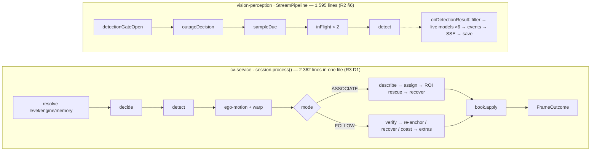
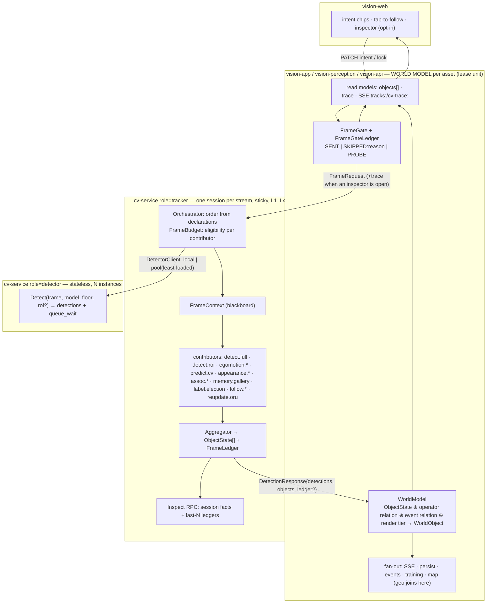
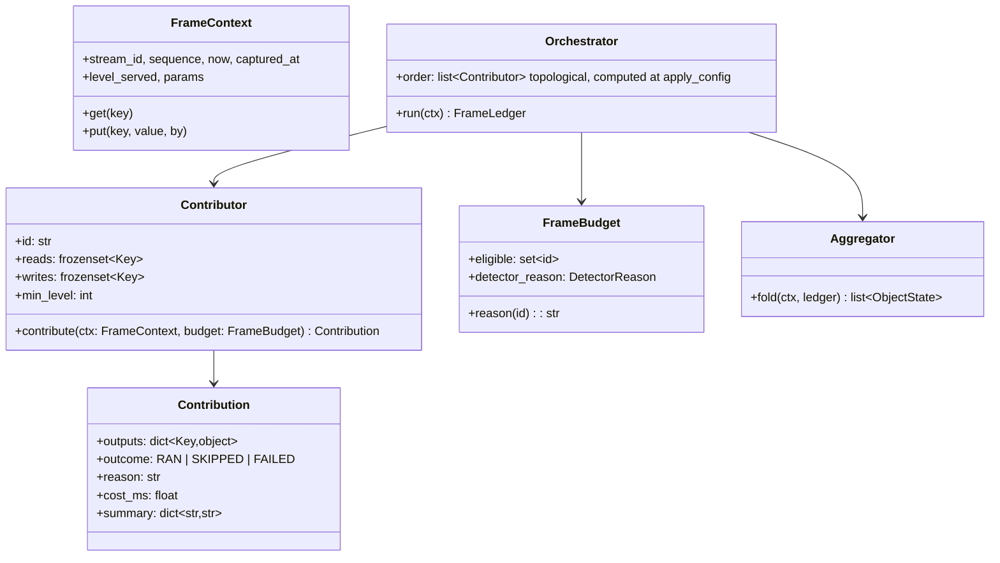
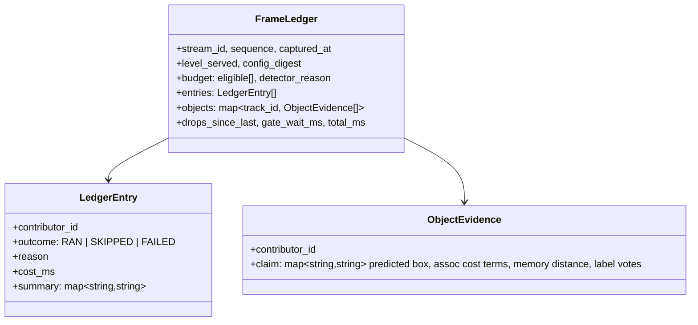
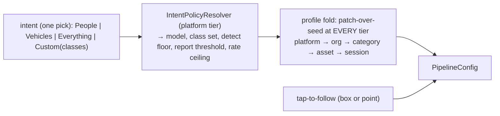

# CV-ORCHESTRATION — from two chains to one orchestration

| | |
|---|---|
| Status | **IN PROGRESS** — proposed 2026-09-11, double-checked against `O1-SYNTHESIS.md` (§12); owner said "continue" 2026-09-12, so W-pre + W0 started on `feat/cv-orchestration` sub-branches; §9 decisions taken 2026-09-12 (E16–E20); **W4 merged 2026-09-12** (`92eac8db`, measured: GB4005 stays all-in-one); **W2 merged 2026-09-12** (`47820e7f`, `WorldModel` + trace + `WorldObject` on the tracks wire; K3 not paid, two §4.7 schema questions open); **W5 merged 2026-09-13** (`af8edaf7`, `/manage/cv` inspector; W5.5 replay open); **W3 merged 2026-09-13** (`0e9c4066`, one operator act) — **W0–W3 are in: the task branch fast-forwards master** (`dc97d698` → `a16240a8`, E21 — the agent's push was permission-denied, the owner runs it); **decisions 2026-09-13 (E21–E25, Fable under the owner's "decide yourself" mandate)**: **W5b merged 2026-09-13** (`1ed7c620`, a saved trace replays through trackeval), **W8 merged 2026-09-13** (`a0fcf736`, K3 paid at 1485 lines — E26), **W7 merged 2026-09-13** (`f2849c93`, a profile is a patch), **W9 (`/tracks` poll) running** (E27); still open by rule: W6, W-legacy |
| Branch | `docs/cv-orchestration` (docs only). Implementation task branch: `feat/cv-orchestration`, one sub-branch per wave, merged back in order |
| Context | [CV-ORCHESTRATION-CONTEXT.md](CV-ORCHESTRATION-CONTEXT.md) — the ask, roles, corpus, status log |
| Evidence | `cv-orchestration/R1..R5` (Sonnet, code-truth with file:line) → `cv-orchestration/O1-SYNTHESIS.md` (Opus) → this plan (Fable) |
| Supersedes | `docs/extracts/TRACKING-ORCHESTRATION.md` §2–§3 (file layout, "decide first", "one gate acquisition") — carried forward: its DTO rules §5, flow-visibility tiers §7, and the two hard invariants named in §4.3 below |
| Does not touch | TRACKING-V3 E1 (no Kalman), no cross-stream identity; CV-SCALE "keep gRPC"; DOMAIN-SEPARATION lease = Asset; EVENT-TOPOLOGY §8 (frames and per-sample telemetry never on the broker) |

---

## 0. The ask, decoded

The owner asked for five things in one message. Each has a number below and every design element in this plan names which one it serves.

| # | Requirement | Meaning after research |
|---|---|---|
| **A1** | "one task — make computer see the object" should not need many decisions | The operator names an outcome; the platform resolves policy. Research (R1 §6) shows the *required* path is already three clicks; what is broken is that six optional decisions sit in the same modal with no required/optional distinction, and three of them (model, tracking mode, memory) should not be operator decisions at all |
| **A2** | orchestration, not a chain — parts own memory / tracking / prediction / … and results are aggregated | One owner per responsibility, declared inputs and outputs, an aggregator that folds them. Today prediction has three owners and label identity two (§1.3) |
| **A3** | scalable | Scale where the cost is. The detector (135–230 ms, stateless) must scale independently of the tracker session (< 1 ms, stateful, sticky) and of the app's per-asset world model |
| **A4** | debuggable per part, in the main app or a sub-service — "what each process is doing and what is the result of it" | Every part's decision, reason and cost is recorded per frame and readable from the app without logs. Today the answer to nearly every "why" question is NOWHERE (§1.5) |
| **A5** | the contract mirrors the real object — not only the box but difference, confidence, id, predicted next position, "how our application sees it" | An `ObjectState` grouped by facet, additive on the wire; every fact in it is already computed inside cv-service today and thrown away before the proto (§1.4) |

---

## 1. Diagnosis — what the code actually does

Every claim below cites a research report; the reports cite `file:line`. Where a doc and the code disagreed, the code won (O1 §4 lists the contradictions).

### 1.1 The required operator path is short; the decision surface is not

Verified path (R1 §6): Start stream → "Turn on" chip → click the box. `ASSOCIATE` is the server default (`TrackingConfig.defaults()`), so every box already has an id and click-to-follow needs no mode change. (One assumption inside that path: the default `yolo26n.pt` roster covers the object's class — COCO taxonomy, inferred, not read from a live roster; O1 §10.) The owner's frustration is real but is about the **setup modal**: model card, class list, confidence, tracking mode (Off/Associate/Follow), capability ceiling, engine, verify cadence, follow fps — eight controls, no visual split between "decide this" and "never touch this" (R1 §2b). Three of them are policy the platform can resolve (model from intent, mode = always associate, memory = always on). Two quiet defects sit next to this: click-to-follow is a no-op on an untracked box although the wire supports a point lock with zero web callers (R1 surprise 2), and the default declutter tier can hide the very box the operator is trying to click with no on-screen reason (R1 surprise 5).

**Conclusion for A1:** an information-architecture and intent→policy change, not an orchestration change. The orchestration is justified by A2–A5, and this plan says so honestly.

### 1.2 Two hand-written chains

Both chains are correct. Their defect is structural: a stage's output is invisible unless it lands on the wire; adding a stage means editing the composer; a stage cannot degrade alone. The charter promised an ~80-line composer and eight files; the code has 2 362 lines and sixteen files (R3 D1/D2). On the Java side the "gate" is not a class but two inline checks (R2 §2), and the reasons a frame was not sent exist only as branches, never as data.

### 1.3 Responsibilities have several owners

| Responsibility | Owners today | Evidence |
|---|---|---|
| Prediction / extrapolation | **three**: `predict.py` (constant velocity, used only for gating); Java `DetectionExtrapolator` still instantiated and fed every frame with `.at()` having zero callers; web `extrapolateOne` re-deriving velocity from consecutive batches while the wire's `velocityX/Y` is read by nobody except the rate controller | R1 §10, R2 surprise 6, R3 #26 |
| Label identity | **two**: server L1 election in `track.py:946-1028`; web `electStickyLabels` with three hand-copied constants | R1 §10, R3 #24 |
| Inference admission | **three physical `acquire()` sites** routed through one helper; ROI rescue ships **on** so two passes per frame is the default; Java has its own per-stream in-flight bound with no fleet budget | R3 D4, R3 surprise 1, R2 surprise 5 |
| Follow lifecycle | cv-service has no `FollowState`; Java derives REQUESTING/HOLDING/COASTING/LOST/RELEASED from three wire scalars | R4 Part B |
| Frame drops | counted on both sides, reported by neither: push-mode `LatestOnlyMailbox.dropped` never reaches the wire; Java's `DROPPED_IN_FLIGHT` never reaches cv-service | R3 surprise 3, R2 §2 |
| Ground-object geolocation | Java-only (`ProjectedTrack`, vision-map) — correct placement, but unrelated to the `geo:` SSE topic that carries the *aircraft's* position | R4 surprise 9 |

### 1.4 The wire carries a box with facts bolted on

`Detection` = label + confidence + box + nine flat track scalars. Computed inside cv-service and **discarded before the proto** (R4 Part B): predicted next box, the label vote tally behind the elected label, `DORMANT` state (the wire says `LOST` forever), which memory entry matched and at what distance, the appearance descriptor, the ego-motion transform, hits/misses, time since last detector confirmation, the per-term association cost. Seven wire fields are dead in one or both directions (R4 Part A: request 8/9/10, `TargetLock.box`, response 1/13/14/15/21). The web parses roughly two thirds of what does arrive and renders none of it (R1 §8). The label on the wire is already the *elected* label, so the training-capture path labels samples with a smoothed value it cannot audit (R4 A.5).

### 1.5 "Why?" has no answer

| Question an operator or engineer asks | Where the answer is today |
|---|---|
| Why are there no boxes? | `DetectionState` explains *gating* only; a stalled cv-service still reads `RUNNING` (R2 §2) |
| Why is this box not drawn? | nowhere — "hidden at tier T2" looks identical to "not detected" (R1 surprise 5) |
| Why did the detector not run this frame? | `detector_reason` on the wire, rendered only in the expert flow strip (R1 §9) |
| Why did the id change / why did this track die? | nowhere — hits/misses/last_confirmed never leave `track.py` (R4 Part B) |
| Why did follow lose the target? | Java-derived state only; cv-service's own reason is not on the wire |
| Why is inference running with nobody watching? | `RUNNING_UNWATCHED` exists in Java, is missing from the TS union, renders as "status not reported by this server yet" (R1 §9) |
| What did ego-motion do, and what did it cost? | computed, put on the wire, dropped at the codec (R2/R4) |
| How much did each stage cost? | `tracker_millis` spans decode + assign + ROI pass; ego-motion is **not** in it — it is `PHASE_PRE` with its own `motion_millis` field (R3 surprise 4 was wrong on this point; corrected by W0, 2026-09-12) |
| Is cv-service healthy, not merely reachable? | no health RPC, no reflection, no `/metrics`, no Micrometer anywhere (R3 §5, R2 surprise 4) |

### 1.6 The scale seam is inside one process

One Python process holds one `InferenceGate` semaphore for all streams (default `min(2, cpu//2)`), one pool thread per stream for its life, and `SessionRegistry` in process memory (R3 §0, §3). A yolo26n pass costs 36–58 ms on a laptop and 197–230 ms on the GB4005; lk/ncc cost under 0.5 ms (R3 #14, #35, #36; CV-PULL-SPIKE). One cv-service saturates at three to four streams at 10 fps (ALWAYS-ON §3). Every timing number here is a doc claim nobody re-measured this wave, and the two GB4005 figures disagree (O1 §7, §10); W4's acceptance is a measurement for that reason. Two replicas behind one address work until the first reconnect, which lands on the other replica and silently resets ids, gallery and lock (R3 §6). Two Java targets are `pick_first` failover, not balancing (R2 §4). There is no fleet inference budget (ALWAYS-ON D3, open).

---

## 2. Principles — the argument

| # | Principle | Answers | Honours |
|---|---|---|---|
| **P1** | **One operator act.** "Watch for X" or "tap to follow". Everything else is policy: resolved by the platform, inspectable and overridable, never required | A1 | every mature product names an outcome, never a stage (R5 §operator-intent); CV-SETTINGS profile hierarchy already persists policy |
| **P2** | **Contributors, not stages.** A part declares what it reads and writes on a per-frame blackboard; the orchestrator derives the order from the declarations. Adding a part = registering it. No part imports another part | A2 | DeepStream plugin graph, ROS composition (R5); the four engine Protocols stay as the evidence seam (R3 §4) |
| **P3** | **Evidence is a first-class artifact.** Every contribution is recorded in a per-frame ledger: who, ran/skipped/failed, reason, cost, summary. The ledger is the debug surface, the replay fixture and the audit trail. Nothing is "visible only in logs" | A4 | TRACKING-ORCHESTRATION §7 flow-visibility tiers; charter §7 "no per-frame INFO" stays true because the ledger is data, not logs |
| **P4** | **Aggregation is a fold, owned by the platform.** One aggregator folds contributions into `ObjectState[]`; it is the only writer of identity and the only authority on birth and death. Contributors propose; the aggregator decides | A2 | TRACKING-REVIEW §4.1 inversion (engines are evidence, core owns identity), made structural; SORT lifecycle counters (R5) |
| **P5** | **The wire carries a mirror, not a box.** `ObjectState` groups facts by facet: identity, kinematics, belief, provenance, memory, lock, timing. An absent group means "not computed at this level". Algorithm-shaped facts (transform, descriptor, cost terms) go in the ledger, never in the mirror | A5 | TRACKING-ORCHESTRATION §5 DTO rules (group, don't widen; absent = untracked; additive only; proto flat by *field*, grouped by *message*); vision_msgs label-as-distribution and DeepStream detector/tracker/predicted boxes as separate fields (R5) |
| **P6** | **Scale where the cost is.** Detector = stateless model server, N instances, least-loaded. Tracker session = stateful, sticky by stream, cheap, placeable onboard at L1/L2. App = world model per asset (the lease unit). Sub-millisecond contributors are never split across processes: the hop costs more than the work | A3 | TRACKING-V3 L1 "boxes come from offboard"; CV-SCALE S4 pool; DOMAIN-SEPARATION D7 lease = Asset; EVENT-TOPOLOGY §8 |
| **P7** | **Zero behavioural delta first.** The contributor refactor ships with `tools/trackeval` `BASELINE.md` unchanged and a golden per-frame outcome dump byte-identical, before any new evidence source or wire field is added | all | TRACKING-V3 P7 reversibility; `test_baseline_consistency.py` already runs on every pytest |

Rejected shapes, so nobody re-proposes them:

| Shape | Why not |
|---|---|
| Actor per track / stream processor (Flink, Akka, NATS between stages) | hop cost ≫ work for sub-ms parts; per-sample telemetry on the broker is forbidden (EVENT-TOPOLOGY §8); identity state must never be shared across processes (R3 §6) |
| A workflow/DAG engine library | the DAG has ≤ 12 nodes and is fixed per config; declarations + a topological sort at `apply_config` time is the whole "engine" |
| "Just split `session.py` into three files" | fixes size, not ownership or visibility; it *is* the mechanical first step of W0, not the destination |
| Shared fleet token bucket (Redis/Postgres) for inference | admission belongs where capacity is known — at the detector instance; the app keeps its per-stream bound; the fleet number is the sum of what instances report (§4.9) |
| Push `detection_enabled` down the pull wire | already rejected by ALWAYS-ON §3; in pull mode the worker is always-on by design |
| Add six more scalars to `DetectionResponse` for the dropped fields | R4 shows scalar-by-scalar growth produced seven dead fields; new facts go in `ObjectState` groups and the ledger |

---

## 3. Target architecture

Three processes, three kinds of state, three ways to scale (§4.9). Everything inside `TRK` stays on one thread per stream exactly as today; the only new cross-process seam is `DET`, and it is introduced last (W4), after the refactor is observable.

### 4.1 Contributor contract (cv-service)

A contributor is the adapter between the blackboard and an evidence engine. The four engine Protocols in `engines/base.py` (`Associator`, `SingleObjectTracker`, `MotionCompensator`, `AppearanceExtractor`) are **kept unchanged** as the pixel seam; contributors wrap them. What is *not* behind a seam today (prediction, memory, label election, scheduler, ROI rescue, follow verify/coast/extras, ORU, lock) becomes a contributor (R3 §4 "hardwired" list).

Rules:

| Rule | Why |
|---|---|
| Blackboard keys are a closed enum (`FRAME, POSE, TRACKS_PREV, PREDICTIONS, TRANSFORM, DETECTIONS, DETECTIONS_ROI, DESCRIPTORS, ASSIGNMENT, RECOVERIES, LOCK, FOLLOW_OBS, CORRECTIONS, OBSERVATIONS`) | a typo in a string key would be a silent missing input; an enum is a compile-time DAG |
| A key has exactly one writer per configuration | one owner per responsibility (A2); the orchestrator refuses a config with two writers |
| Order is computed once at `apply_config`, never per frame | resolve-once rule (`params.py`); no per-frame graph work |
| `contribute` never raises; the orchestrator also wraps it. A failure is recorded `FAILED:reason` and the frame continues with the key absent | degradation becomes per-part, never per-stream — fixes TRACKING-REVIEW D1 structurally |
| Only `detect.*` contributors may touch the inference gate, and only through `DetectorClient` | carries forward the invariant "the gate is never touched on the tracker-only path" (R3 §Deviations, verified); makes it checkable: a ledger with no `detect.*` entry must show zero gate waits |
| `FrameBudget` is frame-free | carries forward "`decide()` is frame-free" (R3, verified); the scheduler becomes the budget without reading pixels |
| The contributor set is fixed for W0: existing modules map 1:1, **no algorithm change** | P7 |

Mapping (R3 §1 inventory → contributor; `session.py` line ranges are the code that moves):

| Contributor id | Today | reads → writes | Budget rule |
|---|---|---|---|
| `detect.full` | `_run_detector` / `detect_composite` (`servicers.py:1160-1197`, `registry.py:257-309`) | FRAME → DETECTIONS | eligible iff scheduler says run (reasons = today's `DetectorReason`, unchanged) |
| `detect.roi` | ROI rescue `session.py:1071`, `_run_roi_detector :1199-1263` | FRAME, ASSIGNMENT → DETECTIONS_ROI | eligible iff `roi_enabled` and a CONFIRMED candidate went unmatched |
| `egomotion.flow` / `egomotion.pose` | `flow_gmc.py`, `pose_gmc.py`, `_estimate_motion :561-564`, `book.warp :577` | FRAME, POSE, TRACKS_PREV → TRANSFORM | eligible when a compensator resolved for the level |
| `predict.cv` | `predict.py:66-91` | TRACKS_PREV, TRANSFORM → PREDICTIONS | always |
| `appearance.histogram` | `histogram.py`, `_describe :820` | FRAME, DETECTIONS → DESCRIPTORS | only on detector frames |
| `assoc.cost` / `assoc.bytetrack` | `assign.py`, `_run_cost_associate :791-999`; `bytetrack.py` | PREDICTIONS, DETECTIONS, DESCRIPTORS → ASSIGNMENT (bytetrack declares DETECTIONS only — its dead-end becomes visible in the DAG, R3 surprise 5) | ASSOCIATE mode |
| `memory.gallery` | `memory.py`, `_attempt_recovery :952`, `_attempt_follow_recovery :1175-1225` | ASSIGNMENT, DESCRIPTORS → RECOVERIES | always registered; env switch = `SKIPPED:disabled` (R3 §7: always-on is safe; switch kept for P7 measurement) |
| `label.election` | `track.py:946-1028` | ASSIGNMENT → OBSERVATIONS(label proposal, candidates) | always; the aggregator applies the proposal |
| `follow.lk` / `follow.ncc` | `session.py:1262-1776` verify / re-anchor / coast / extras + `lk.py`, `ncc.py` | FRAME, LOCK, PREDICTIONS, DETECTIONS → FOLLOW_OBS | FOLLOW mode |
| `reupdate.oru` | `reupdate.py`, `_late_corrected_box :1314`, `_observe` ORU path | OBSERVATIONS, history → CORRECTIONS | detector frames with a coasted gap |
| *(config-time, not per-frame)* | capability/engine/motion/appearance/memory resolution `session.py:1852-2168`, degradation `:1924-1984`, `LockArbiter.apply` | — | run at `apply_config`; the ledger records the resolved set once per config change |
| **Aggregator** | `TrackBook.apply` (`track.py:474-482`) + `FrameOutcome` construction (`session.py:595-616`) | OBSERVATIONS, FOLLOW_OBS, RECOVERIES, CORRECTIONS, LOCK → tracks, `ObjectState[]` | the only writer of `Track`; death from counters (`_retire`) |

**As built in W0 (merged 2026-09-12, `c4344bf5`)** — the table above is the design; where the code's boundaries differed, W0 kept the *outcome* fixed (golden fixtures byte-identical) and moved the boundary instead:

| Design | As built | Why |
|---|---|---|
| `label.election` contributor | runs inside `Track._observe` under `TrackBook.apply`; surfaced as aggregator evidence | moving it out would change the fold order and therefore the outcome |
| `reupdate.oru` writes `CORRECTIONS` per frame | per-track seam (`orchestration/corrections.py`); `Key.CORRECTIONS` has no registered writer in W0 | it is a property of one track's history, not a frame stage |
| `follow.verify` / `follow.predict` / `follow.coast` | one `follow.<engine>` contributor; its five outcomes share post-fold bookkeeping on `Proposal.settle` | the outcomes are alternatives of one decision, not stages |
| `emit.raw` contributor | the aggregator's no-proposal branch | a second writer of `OBSERVATIONS` would break one-writer-per-key |
| `predict.cv` in every mode; `TRACKS_PREV` seeded | `predict.cv` owns the post-warp snapshot as `TRACKS_PRED` and is registered in ASSOCIATE only | FOLLOW predicts inside the follower |
| roster rebuilt at `apply_config` | rebuilt when the **resolved-engine signature** changes | engines resolve lazily; this is a strict superset |
| `egomotion.*` id = served engine | id = *requested* `motion_engine_id`; the served one is a ledger summary field | the requested id is stable across degradation |
| proto add-only list | plus `ObjectClaims` | protobuf cannot put `repeated` directly in a map value |
| — | new: `propose.cost` (ASSIGNMENT + DETECTIONS + DETECTIONS_ROI + RECOVERIES → OBSERVATIONS), `EngineSet.reconfigure`, `StreamTrackingSession.stream_id`, `SessionRegistry.snapshot()`, `orchestration/facts.py` | the proposal step had no name in the design; the rest is what `Inspect` needs |

Keys as built: `FRAME, POSE, LOCK, DETECTIONS, DETECTIONS_ROI, MOTION, TRACKS_PRED, DESCRIPTORS, ASSIGNMENT, RECOVERIES, OBSERVATIONS, FOLLOW_OBS, CORRECTIONS` (`MOTION` for the design's `TRANSFORM`, `TRACKS_PRED` for `PREDICTIONS`+`TRACKS_PREV`). Two defects of the *new* code were caught by the golden fixtures before they shipped: the budget never marked the aggregator eligible, and `Proposal` collapsed "no observations" with "do not book" (an empty `apply([])` is what ages a live track). One accepted behaviour change under rule 4 of the contract: a raising `cost` associator becomes `FAILED` + raw echo instead of propagating out of `process()`; no fixture exercises it.

### 4.2 Orchestrator and budget

The orchestrator is ~150 lines: hold the ordered contributor list, run each eligible one under a timer, catch everything, write outputs, append a ledger entry. `DutyCycleScheduler.decide()` becomes the core of `FrameBudget`: it still answers "run the detector this frame and why" with the same `DetectorReason` values; it additionally answers "which contributors are eligible" from mode and level. The ROI second pass is a budget decision recorded as its own ledger entry — today it hides inside `tracker_millis` (R3 surprise 4). The duty ratio the flow strip shows counts `detect.full` only; `detect.roi` is shown beside it, never folded in (O1 Q13).

### 4.3 Aggregator

`TrackBook.apply` already is the fold; W0 gives it the name and the boundary. It reads proposals (observations, follow observation, recoveries, corrections, label proposal) and is the only code that creates, ages, settles, retires a `Track` and mints ids. It emits `ObjectState[]` (§4.5) and finishes the `FrameLedger`. Lifecycle death stays exactly today's rule (`min_hits`, `max_age_frames`, `max_age_millis`, retention multiplier) but the counters that drove it are now on the object. Two precisions from O1: the aggregator runs every frame so the ledger is always complete, but in W0 the fold into the book keeps today's call sites exactly — `apply` is *at most* once per frame, zero on the OFF path and on a FOLLOW re-anchor failure with nothing held (O1 contradiction 7) — anything else is a behavioural delta; and the frame's `captured_at` at which the aggregator folds is the one clock for age and death, whatever cadence a contributor ran at (O1 Q20).

### 4.4 Ledger — the debug surface (A4)

| Tier | Where | Exposure | Cost when nobody looks |
|---|---|---|---|
| **Hot** | ring per session, last N frames (`CV_LEDGER_RING`, default 64); ring per `StreamPipeline` for gate decisions | gRPC `Inspect(stream_id?, last_n)` → session facts + ledgers; process facts when `stream_id` is empty (level, roster, sessions, gate occupancy, model loaded, uptime) — this is the health surface R3 §5 and R2 surprise 3 found missing | a few KB per stream, no I/O |
| **Warm** | `DetectionResponse.ledger` set only while `FrameRequest.trace = true`; Java forwards to SSE `cv-trace:<assetId>` | `GET /api/streams/{id}/cv/trace?last=N` (gate + frame + world ledgers) and SSE `cv-trace:<assetId>` (opt-in topic, like `detections:`) | zero: `trace` is a demand flag set only while an inspector subscribes, cleared when the last one leaves |
| **Cold** | later: ledgers to the broker as a U3 history stream | out of scope until DOMAIN-SEPARATION W2 lands | — |

Java side, `FrameGateLedger` records one decision per sampler deadline (R2 §2 branches, all verified): `SENT`, `PROBE`, or `SKIPPED:` one of `GATE_OFF · GATE_NO_DEMAND · PULL_MODE · OUTAGE_BACKOFF · DEADLINE_NOT_DUE · IN_FLIGHT_FULL · CV_UNAVAILABLE`, plus the demand snapshot (`sse | pose | poll`) so "why is inference running" names the term (R2 §2: demand has three OR-terms and fails open). The `WorldModel` records per result: live/durable gate snapshot, filtered-out count, follow transition, objects born/died.

What the "why" table in §1.5 looks like afterwards:

| Question | Answer location after this plan |
|---|---|
| Why no boxes? | gate ledger reason, or frame ledger `detect.*` entry, or Inspect health — three distinct answers |
| Why is this box not drawn? | `WorldObject.render.tier` — one lookup |
| Why did the detector not run? | ledger `budget.detector_reason` (same enum as today) |
| Why did the id change / die? | `ObjectState.timing` (hits, misses, since_confirmed) + `ObjectEvidence` for that id |
| Why did follow lose it? | `follow.*` entry reason + `ObjectState.lock` |
| Running with nobody watching? | gate ledger demand snapshot + policy flag |
| Ego-motion? each stage's cost? | `egomotion.*` entry summary + per-entry `cost_ms` |
| Healthy? | `Inspect()` process facts → `CvStatusProvider` → `/api/system/status` row gains queue depth, gate occupancy, model loaded |

### 4.5 ObjectState — the mirror (A5)

One new message on the wire, nested groups, additive; `detections[]` kept for existing readers. Sources are the internal facts R4 Part B found (all already computed).

| Group | Fields | Source today | Status on wire today |
|---|---|---|---|
| **root** | `id`, `lifecycle` (new enum `ObjectLifecycle`: TENTATIVE · CONFIRMED · COASTING · LOST · DORMANT), `stream_id` | `Track.state`, `DormantIdentity` | DORMANT absent — wire says LOST forever |
| **identity** | `label` (elected), `label_raw` (this frame's detector label), `candidates[]` (label, weight), `stability` (frames since last switch) | `Track` vote ring `track.py:946-1028` | only the elected label crosses; training capture cannot audit it |
| **kinematics** | `box` (the elected one), `detector_box`, `tracker_box`, `predicted_box` + `horizon_ms`, `velocity_x/y`, `displacement_x/y` since last update, `motion_compensated` | `Track` fields, `predict.py`, `TrackBook.warp` | velocity only; three-box separation per DeepStream (R5) |
| **belief** | `confidence_raw`, `confidence_smoothed`, `existence` (0..1 from hits/misses/age), `since_confirmed_ms` | `Track.last_confirmed`, vote tally | raw confidence only |
| **provenance** | `source` (new enum `EvidenceSource`: DETECTOR · TRACKER · PREDICTED · MEMORY · REUPDATE), `contributors[]` (ids that touched it this frame), `assoc_cost`, `reupdated` | `Observation.source`, `assign.py`, `reupdate.py` | DETECTOR/TRACKER + boolean `reupdated` |
| **memory** | `recovered`, `identity_confidence`, `dormant_ms`, `gallery_matches` (count), `match_distance` | `memory.py:272-306` | two scalars, and JSON republishes them only for the locked track (R4 surprise 5) |
| **lock** | `locked`, `lock_seq_applied` | `LockArbiter` | `locked_track_id` at frame level only |
| **timing** | `first_seen_ms`, `last_seen_ms`, `last_confirmed_ms`, `age_frames`, `hits`, `misses` | `Track` dataclass | `age_frames` only |

Placement rules (these are the DTO rules of TRACKING-ORCHESTRATION §5, applied):

- `DetectionResponse.objects = repeated ObjectState` (field 27) and `DetectionResponse.ledger = FrameLedger` (field 28, present only when traced). `FrameRequest.trace = bool` (field 13); `PullControl.trace` (field 12).
- New enums live only on new messages. `TrackState`, `DetectionSource`, `DetectorReason` are **not** extended. Verified 2026-09-11 (O1 §10 had it unverified): the codec maps each with a switch *expression* and no `default` branch (`DetectionFrameCodec.java:366-391`), so a new proto value fails compilation of any Java build on the new proto; and an older codec at runtime receives it as `UNRECOGNIZED` and nulls the whole `TrackRef` (R4 A.5). A silently untracked object on old clients is exactly the failure a mirror must not have.
- Algorithm-shaped facts (the affine transform, descriptor vectors, per-term cost weights) go in `ObjectEvidence.claim` in the ledger, never in `ObjectState`. The mirror describes the object; the ledger describes the algorithm.
- Dead fields (`TrackingConfig` 8/9/10, `DetectionResponse` 13/14/15/21, `TargetLock.box`) are marked deprecated in proto comments and never renumbered; their information moves to the ledger. `DetectionResponse.stream_id` starts being *checked* by the codec (R4 surprise 2).
- `model_id/model_version` stay frame-level; `ObjectState` carries no model. The per-detection replication in JSON is a legacy shape that stays on `detections[]` only.
- `ObjectState` is keyed by `(stream_id, id)` so a future cross-camera fusion stage consumes it without a wire change; fusion itself is out of scope (TRACKING-V3 non-goal).

**As built in W1 (merged 2026-09-12, `700b7834`)** — contract as specified (fields 27/28/13/12, two new enums, nothing renumbered, dead fields marked deprecated); boundaries that moved:

| Design | As built | Why |
|---|---|---|
| the aggregator fills `objects[]` | a read-only `orchestration/mirror.py` called from `session.process()` after the run | `provenance.contributors` is a ledger fact the aggregator never receives; the one class that mutates `Track` must not hold the record of what it did |
| codec decodes `ledger` | `ledger` encoded by cv-service, **not decoded** in Java yet | no domain `FrameLedger` and no reader until W2's `TraceDemand`; W2 owns both halves |
| `objects[]` mirrors every object | label-deny-filtered like `detections[]` (an object with no `identity` group is kept); **not** confidence-filtered | a denied label must not reappear under a new JSON key; confidence is a belief, not a filter, on the mirror |
| `timing.*` "epoch ms" | on the response's own `timestamp_millis` timebase, never wall-clock | cv-service ages on `time.monotonic()` and rebases once at the wire; three copies of the wrong comment corrected |
| `trace` "on the port request" | `PipelineConfig.trace` (boolean, `false` everywhere; never a profile field) | the profile fold must not be able to switch a debug tier on for an asset |

Found and fixed on the way (outside the wave's scope, reported): `StreamPipeline#applyLabelFilters` dropped `PullTelemetry` on every frame a label filter bit, hidden by a convenience constructor rule 10 retired; four dead convenience constructors deleted. Measurement trap recorded in two MODULE.md files: summing `surefire-reports/*.txt` under-counts `adapter-persistence` tenfold (`@Nested` classes get no `.txt`); Maven's per-module `Results:` line is the truth.

### 4.6 WorldModel and WorldObject (Java)

`WorldModel` (vision-perception, `application/pipeline`) replaces `TrackBook` + `FollowTracker` + `DetectionExtrapolator` as the single per-stream owner of object state. It folds each `DetectionResult` (now carrying `ObjectState[]`) into `WorldObject`:

| Facet | From | Note |
|---|---|---|
| `state: ObjectState` | wire | verbatim domain mirror |
| `operator: {followed, denied, follow: FollowState}` | `WorldModel` | `FollowState` stays Java-derived — it is an operator relation, not a cv fact (R4 Part B); no consumer-shaped field goes back into the pipeline (TRACKING-ORCHESTRATION P3) |
| `event: {openEventId}` | `DetectionEventEngine` | |
| `render: {tier}` | today's `detectionTiers` logic moves server-side | answers "why isn't it drawn" (§1.5); the web keeps drawing, stops deciding |
| geo | **not here** — joins at the vision-api read model with vision-map's `ProjectedTrack` | perception must not depend on map (ArchUnit DAG) |

JSON: `DetectionResultResponse.objects[]` and `StreamTracksResponse.objects[]` (nested groups, `NON_NULL`), `detections[]`/`tracks[]` kept. New SSE topics: `tracks:<assetId>` (objects at frame cadence — the first live topic for tracks; `/tracks` remains the poll fallback) and `cv-trace:<assetId>` (opt-in). TS mirrors under `core/api/models.ts`, plus a contract test that asserts every TS enum union against a fixture the API exports, so `DetectionState` cannot drift again (R1 Q3). `onDetectionResult` ordering (live plane before durable save, both gates read once) is carried forward verbatim (R2 §3).

### 4.7 Operator intent → policy (A1)

| Control today (R1 §2) | After |
|---|---|
| "Turn on" chip / Detect toggle | **stays** — the one act |
| Model card ("Looking for") | becomes the intent pick; the model is resolved from intent; expert tier can still pin a model and sees "resolved from intent People (platform)" |
| Tracking mode Off/Associate/Follow | **removed from the operator surface**: ASSOCIATE always, FOLLOW = tap (box *or point* — wires the zero-caller point lock, R1 surprise 2), OFF only via profile/expert |
| Memory / cached tracking | **removed**: always on (R3 §7); env switch kept for measurement |
| Confidence, classes | stay, in a modal renamed "Tuning", each showing its resolved source |
| Capability ceiling, engine, verify cadence, follow fps | expert tier only |
| `cv.detection-policy = ALWAYS` | gets a control on the asset binding in `/vision/profiles` (today: blind attribute editor only, R1 §4) |
| Boxes declutter | stays client-side, but the tier is now server-assigned and visible per object |

The profile fold must become patch-over-seed at every tier; today a bound profile replaces the request wholesale (R2 §1 known gap), which would make an asset-tier intent and an expert override mutually exclusive.

### 4.8 Debug surfaces by audience

| Audience | Surface | Content |
|---|---|---|
| Operator (fly hero) | one status line, three honest states | "Off" · "On — N objects" · "On — no viewer" · "Degraded — <reason>" from Inspect health, never a guess from gating |
| Expert (Tuning modal) | resolved-source line per knob; flow strip reads ledger entries not `tracker_millis` | |
| Engineer (new `/manage/cv` page or fly inspector, W5) | per-frame contributor list with outcome/reason/cost; per-object evidence; gate ledger; process facts | also the replay fixture: a saved trace replays through trackeval |
| Ops | `/api/system/status` cv row | queue depth, gate occupancy, capacity N/M streams, model loaded |

### 4.9 Scaling model (A3)

| Part | State | Scales as | Placement | Admission |
|---|---|---|---|---|
| **Detector** (`CV_SERVICE_ROLE=detector`) | none | N instances, least-loaded, batchable later | GPU/OpenVINO box (GB4005-class) | instance-local `InferenceGate`; `RESOURCE_EXHAUSTED` when its queue exceeds a bound → client tries the next instance; capacity/occupancy on `Inspect` |
| **Tracker session** (`CV_SERVICE_ROLE=tracker`, today's `inference` minus the in-process detector when `CV_DETECTOR_TARGETS` is set) | per stream | M processes, **sticky by stream_id** | next to the app; onboard at L1/L2 later | gRPC pool size, as today |
| **World model** | per asset | K app workers | app; DOMAIN-SEPARATION lease = Asset | per-stream in-flight bound, as today |
| **Ledger sink** (cold) | none | broker consumers | anywhere | later |

Decisions:

- **Pull-mode streams count against detector capacity whether or not anyone watches.** That is ALWAYS-ON's design (the ingest plane is always on; the anti-goal forbids pushing demand down the pull wire), and it is why admission must live at the detector, where the ingest plane's true load is visible (O1 defect 8).
- **Affinity is a deployment requirement, not code.** One tracker per app instance via the ordered target list + `pick_first` (today's mechanism); documented in compose; DOMAIN-SEPARATION W3's worker role inherits it. No shared session store (R3 §6: nothing needs sharing if affinity holds).
- **The detector hop is paid once per detector frame**: ≈1–3 ms LAN for a 640 px JPEG against 135–230 ms inference — under 2 % (CV-PULL-SPIKE numbers). Sub-ms contributors never leave the session thread (P6).
- **Fleet budget (ALWAYS-ON D3) is answered structurally, not with a token**: each detector instance admits what it can; `CvStatusProvider` sums instance capacities into "N of M streams" on `/api/system/status`; the app's per-stream bound stays. When the sum is exhausted, `ALWAYS`-policy streams are the ones that see `RESOURCE_EXHAUSTED` first, recorded in the gate ledger as `CV_UNAVAILABLE` — visible, not silent.
- `DetectorClient` in cv-service has two implementations: `local` (in-process `YoloDetector`, today) and `pool(targets)`. Java is unchanged by W4; it still talks to a tracker.

**As built in W4 (merged 2026-09-12, `92eac8db`)** — wire and roles as specified (`service Detector { Detect }`, `CV_SERVICE_ROLE = detector | tracker | unset = all-in-one`, ordered `CV_DETECTOR_TARGETS`, `RESOURCE_EXHAUSTED` above `CV_DETECTOR_MAX_QUEUE`, capacity/occupancy/queue on `Inspect`); boundaries and numbers that differ:

| Design (above) | As built | Why |
|---|---|---|
| Only `DetectorClient` acquires `InferenceGate` | Still true inside `cv_service/orchestration/` (grep-enforced, 30 seam tests). The **detector-role process** acquires its own gate in `grpc/detector_servicer.py` — it *is* the door on the far side of the wire | A detector instance runs no orchestration, only admission + YOLO; the seam test guards the package that must never grow a second door |
| `bytetrack` unregistered (E16) | Unregistered from `BUILTIN_ASSOCIATORS` (`cost` is the only associator); engine file kept unregistered as a reference; `params.py#resolve()` **aliases** a stored/env `engine_id="bytetrack"` to `cost` | Profiles and env files that still say `bytetrack` keep working instead of failing at session start |
| "1 tracker + 2 detectors sustains ≥ 2× the streams of one all-in-one on the same hardware" | **On one box the split sustains fewer**: all-in-one 3 streams, split 2 (12-core laptop, 10 fps, yolo26n, 30 s windows per count, first failing count 4 vs 3, quiet box verified). The split's 4 gate permits over-subscribe the same cores and add a loopback hop (+8 ms p50 at one stream) | The acceptance sentence assumed a second machine's cores behind the extra permits. The number that decides a GB4005 split needs GB4005 plus a second box; deferred until GB4005 alone saturates (`Inspect` occupancy/queue, `RESOURCE_EXHAUSTED` in the field), then re-run `tools/detectorbench` across both |
| ALWAYS-ON D3 "answered by §4.9" | The **budget half** is answered (admission at the instance, fleet number = sum on `Inspect`). The **scheduler half** — fair-share ordering between `ALWAYS` streams once the fleet is saturated — stays open; today the loser is whoever asked last | Out of W4's scope; recorded on ALWAYS-ON-FLOW-PLAN's D3 row |
| `local` unchanged by pooling | `CV_DETECTOR_TARGETS` may end in `local` as a last resort; a reconnect never reverts a pooled session to local detection (test) | A tracker stays honest about where its boxes came from (`provenance`) |
| — | W1's wire test `test_tracing_changes_the_ledger_and_nothing_else` was load-dependent (byte-equality over measured `tracker_millis`/`motion_millis`); both are normalised before the compare now | Found by W4's full-suite runs; a test that asserts two runs took the same microseconds asserts a coincidence |

**As built in W2 (merged 2026-09-12, `47820e7f`)** — `WorldModel`/`WorldObject`/`FrameGateLedger`/`TraceDemand`, `/cv/trace`, `tracks:`/`cv-trace:` SSE, capacity on `/api/system/status`, `Intent` → `IntentPolicyResolver` as specified; `TrackBook`/`FollowTracker`/`DetectionExtrapolator` are gone from every `src/main` tree (grep-clean, D4 deletes the extrapolator outright). Boundaries that differ:

| Design (above) | As built | Why |
|---|---|---|
| §4.6 `WorldObject` facets "nested groups, NON_NULL" on `objects[]` | Two wire shapes on purpose: `DetectionResultResponse.objects[]` (the `detections:` topic and the durable path) stays W1's flat `ObjectStateResponse`; `StreamTracksResponse.objects[]`, the `tracks:` SSE payload and `CvTraceResponse.world` carry `WorldObjectResponse { state, operator{followed, denied, follow?}, event{openEventId?}, render{tier} }` (W2.8). TS mirror `WorldObject`/`RenderTier` in `models.ts`, pinned by `world-object.wire.contract.spec.ts` against the Java-generated `__fixtures__/world-object.wire.json` | The operator/event/render relations are platform-owned; cv-service's own contract (and W1's `object-state.wire.json` fixture) stays byte-identical. W3 reads `render.tier` from the `tracks` surfaces it already renders from |
| `WorldModel` folds, the registry reads | `DetectionLiveUpdatePort#publishDetections` grew a third parameter: the fold's `List<WorldObject>` captured once in `onDetectionResult`, right after `world.accept`; `LiveUpdateRegistry` holds `(result, worldObjects)` together and builds `detections:`/`tracks:`/`cv-trace:` from that one snapshot | A second `world.objects()` read at publish time is a later snapshot of a mutable fold; the registry must never re-fold or call back into the pipeline mid-fan-out (rule 10: call sites updated, no overload) |
| §4.7 "patch-over-seed at EVERY tier: platform → org → category → asset → session" | Patch-over-seed holds **inside one request** (an `intent` seeds `model`/`labelFilter`; explicit knobs win over the seed) and **at the session tier** (`StreamDetectionSupport#resolveStartConfig`'s existing `mergeOnto`), so an asset-tier intent and an expert session override coexist (test). **Between persisted tiers the fold is still wholesale**: a bound `CvProfile` is a complete record with no "inherit" value per knob, so an org/category profile that sets one knob does not compose under an asset profile | Widening `CvProfile` to nullable/inherit knobs is a schema + Flyway + `/vision/profiles` change, out of a Java-only wave. **Decided 2026-09-13 (E22): W7 makes the profile a patch** — per-knob inherit, persisted `intent`, `sources` on every read |
| "expert tier … sees *resolved from intent People (platform)*" | `CvProfileResponse.sources { model, labelFilter }` (`ProfileSource.INTENT`) is reported on the **create/update response only**; a later `GET` of the profile carries no `sources` (`Sources.none()`), because `intent` is not persisted on `CvProfile` | W3's "Tuning" modal can show the source right after a save; showing it after a reload needs `intent` persisted — same schema decision as the row above |
| `IntentPolicyResolver → detect floor, rate ceiling` | `IntentPolicy#detectFloor`/`#rateCeiling` are computed and **unconsumed**; only `model` and the class set fold into the profile | The frozen §5 `CvProfileRequest` carries bare-primitive `confidenceThreshold`/`inferenceFps` with no unset sentinel to fold a floor/ceiling through; named in `IntentPolicy`'s javadoc — **W7 (E22) folds `reportThreshold`/`rateCeiling` through the inherit-capable knobs; `detectFloor` still has no `PipelineConfig` knob** |
| `TraceDemand` like `DetectionDemand` | `LiveAndPollTraceDemand` fails **closed** (no subscriber ⇒ no trace), the opposite of `DetectionDemandPort`'s fail-open | Trace costs cv-service work per frame; an unknown demand must not buy it |
| Gate ledger = one entry per frame | `FrameGateLedger` coalesces consecutive identical-reason `SKIPPED` entries **without a repeat count** — one wire row may stand for many skipped frames (`GateDecision` has no count field; W5's ledger table says so in its doc comment); `FrameLedgerRing` never coalesces; `GET …/cv/trace?last=N` defaults `N` to 50 | A demand-gated stream skips thousands of frames for one reason; the inspector wants the transitions, not the run length |
| "pays MASTER-MATRIX K3 partially — `StreamPipeline` loses the six live-model peers" | The three peers are gone, but `StreamPipeline.java` grew 1643 → 1784 lines (W2.2 `WorldModel` integration +106, W2.3 gate classification; W2.9 extracted the ledgers/read models/trace-demand fold into `PipelineTrace`, 124 lines). `maybeDetect`'s three-way gate classification and `submitDetection`'s `CV_UNAVAILABLE` peek stay inline | They read five pipeline-private fields together; moving them means exposing those fields or duplicating the decision. **K3 is not paid by W2**; the remaining cut is the gate classification as its own collaborator (candidate for W5, which reads the same ledger) |

**As built in W5 (merged 2026-09-13, `af8edaf7`)** — `/manage/cv` (`features/cv-inspector`, `MANAGE_ORG`-gated Manage entry, `ROUTED_PAGES` guard), `core/cv-trace` store + `VisionApi.getCvTrace`, TS mirrors `CvTrace`/`GateDecision`/`FrameLedger`/`LedgerEntry`/`ObjectEvidence` pinned by `cv-trace.wire.contract.spec.ts` against the Java-generated `cv-trace.wire.json`, `'cv-trace'` envelope + `LiveStore` topic, "Save trace" download. Boundaries that differ:

| Design (above) | As built | Why |
|---|---|---|
| "trace is a demand flag set only while an inspector subscribes" (SSE opt-in) | The store runs a **3 s poll of `GET …/cv/trace` and the `cv-trace:<assetId>` live topic concurrently**; the poll is authoritative for `gate` and `world`, live arrivals are merged into the `frame` ring between polls. The live subscription is wired (W5.7): picking a stream subscribes to the owning asset's topic, switching or leaving releases it (facade spec, 7 cases) | Only `FrameLedger` has a live topic; `gate` and `world` exist on the REST read alone. `LiveAndPollTraceDemand` counts both, so trace flips on with the first poll or subscription and off when both stop |
| Gate ledger rows = frames | One coalesced `SKIPPED` row may stand for many frames and carries no repeat count (W2 wire) | Recorded in the `GateDecision` TS doc and the W2 table above; adding a count is a `GateDecisionResponse` change for a later wave |
| Process facts = capacity N/M, occupancy, queue, model, uptime as fields | The panel renders the `/api/system/status` cv row as it comes: health chip + the one free-text `detail` sentence in which `CvStatusProvider` folds the capacity facts | That provider folds on purpose so one subsystem's shape does not leak into the status type every provider implements (W2.5); structured fields need a status-contract decision |
| "a saved trace replays through trackeval" | **Not built.** A saved `CvTrace` carries no per-frame detector box: `detect.full` evidence is a count, `predict.cv` claims are the tracker's own state, `world[]` is one snapshot. `tools/trackeval`'s `Recording` needs real per-track detector boxes + confidence per frame | Replaying the tracker's own output through the tracker would prove nothing. Closing it means capturing per-frame detections with the trace (the web already receives `detections:` per result — a client-side join, no wire change) plus a recorded-detections input on trackeval. **Decided 2026-09-13 (E23): W5b**, captured at the source (the detector's raw boxes on the ledger when tracing), not a client-side join |
| Stream → asset for the live topic | Stream picker lists running streams by `streamId`; the owning asset is resolved by one `GET /api/fleet/summary` per pick joined on `AssetAttention.streamId` (`assetIdForStream`) because no root-provided structure holds the device→asset join while `/manage/cv` is open (`ActiveStream` carries `deviceId` only) | One fetch per rare engineer pick beats a new root-level index; `POLL_INTERVAL_MS = 3_000` and `DEFAULT_CV_TRACE_LAST = 50` are named constants in `core/cv-trace` |

**As built in W3 (merged 2026-09-13, `0e9c4066`)** — intent chips + one honest status line on the fly hero, "Tuning" modal without the tracking-mode picker, tap-to-follow on a box or a bare point (D8), `tracks:<assetId>` topic, server `render.tier` drawn for every matched object, client extrapolation and `electStickyLabels` deleted for tracked objects (grep-enforced by `no-client-rederivation.spec.ts`), intent + resolved sources + detection-policy control on `/vision/profiles` (D7). Boundaries that differ:

| Design (above) | As built | Why |
|---|---|---|
| W3 is "vision-web only" | **W3.0 touched vision-api**: `UpdateStreamConfigRequest.intent` resolves `model` + `labelFilter` through `IntentPolicyResolver` on the hot path (explicit values win over the seed; `CUSTOM` without a `labelFilter` is a 400), `UpdateStreamConfigResponse.sources { model, labelFilter }` | The intent → policy mapping has one owner (§2, §4.7); the web never maps an intent to a model name |
| "Memory / cached tracking toggle removed" | Nothing to remove — no such control existed in the setup modal at W3's base | R1 §2b never listed one; the plan row inherited R3 §7's env switch, which stays |
| Intent chip = one PATCH | People / Vehicles / Everything PATCH `{ intent }` directly; **Custom opens Tuning** to pick classes first | A custom intent without classes is the 400 above; the modal is where classes live |
| "render tier from server" | Matched detections draw at the wire's `render.tier` (`HIDDEN` ⇒ not drawn); **unmatched detections** (no world object yet: untracked, first frame) keep the client `detectionTiers` and a local forward-projection narrowed to that subset | The wire has no object for them yet; the server owns every tracked object's tier, box and label |
| `tracks:` replaces polling | The `tracks:` payload is only `WorldObject[]`; the `GET …/tracks` poll stays for stats/latency/rate/follow | Widening the SSE payload is a vision-api change; LIVE-POLL-RETIREMENT L8b stays open |
| Resolved source per knob in Tuning | Shown from the last PATCH/profile response's `sources` only; after a reload nothing is claimed | `intent` is not persisted (W2 table, same schema decision); no invented "platform" label |
| `sources` absent when no intent | Serialises as `{}` (Jackson `NON_NULL` is per field; the nested object is always present) — TS mirror `sources: { model?, labelFilter? }` | Found three times by three sub-agents; pinned in the TS mirror comment |
| "click path = 3 (measured by the e2e spec)" | `features/fly/click-to-follow.spec.ts` drives the production logic functions start → Turn on → tap and asserts **3** acts for a tracked box and for a bare point; no browser e2e exists in the repo | vision-web has `ng test` only; the measure is logic-level |
| `cv.detection-policy = ALWAYS` control | Written on the asset's `attributes` through `PATCH /api/assets/{id}` with the merged `attributes` map (`VisionApi.updateAsset`, `vision-profiles-facade.ts#toggleDetectionAlways`); the PATCH replaces the map wholesale, so the facade merges client-side | No `detectionPolicy` field exists on the API; the attribute is what `StreamPipeline` reads today |
| — | `shared/player/node-builtins.d.ts` shims `fs`/`path`/`url` types for the grep spec (no `@types/node` in the project) | Specs run in Node under jsdom; only the type-check needed help |
| — | Process lesson: two sub-agents run concurrently in one shared tree clobbered each other's `cockpit-facade.ts`/`cockpit.html`; caught by diffing commits, converged in `d2180f8c` | Sub-agents get their own worktrees even for disjoint-looking scopes |

---

**As built in W5b (merged 2026-09-13, `1ed7c620`)** — the detector's raw, pre-association boxes ride on the traced ledger: proto `TracedDetection {label, confidence, box}` and `FrameLedger.detections = 13`, `frame_width = 14`, `frame_height = 15`; `session.process()` stamps them from `Key.DETECTIONS` **only when the request traced** (the same `request.trace` gate `servicers.py` already used for attaching the ledger, so an untraced response is byte-identical); domain `DetectorBox` + `FrameLedger` widened with all six call sites updated (no overload); `FrameLedgerResponse.detections[]`/`frameWidth`/`frameHeight` with `cv-trace.wire.json` regenerated (frame 0 carries boxes, frame 1 the "not carried" shape); TS `TracedDetection` mirror pinned by the contract spec; `tools/trackeval/trace.py#read_trace` + `--trace FILE`, eleven tests including the Java-generated fixture. Boundaries that differ:

| Design (above) | As built | Why |
|---|---|---|
| "a saved trace replays through trackeval" as an accuracy run | `--trace` prints the structural/cost summary the real-footage `recording.py` path prints, not the `--scenario` accuracy table | a trace carries no ground truth to score against — the same reason a recording replay has none; the value is a real-detector-noise regression fixture |
| Camera pose on replay | none — every replayed frame keeps the zero pose, so ego-motion compensation is off | `CvTrace` carries no pose (no field on `FrameLedger`); adding one is a proto + Java + TS change for a later wave, disclosed in `--help` and the README |
| `fps` from consecutive timestamps | a non-positive median delta yields `fps = 0.0` ("unknown", `metrics.summarize_recording`'s own convention), not an error; < 2 frames and a pre-W5b trace without a frame size still raise | the Java-generated wire fixture's two frames share one fixed timestamp by construction |
| Only `detect.full`'s boxes | exactly that: `Key.DETECTIONS` is the full pass's own key; `detect.roi` writes `Key.DETECTIONS_ROI` and is never merged in (pinned by a test) | a rescued frame must still show what the full pass actually saw |
| — | the inspector's frame row shows "raw boxes N" (one template line); "Save trace" itself unchanged | the saved file already is the replay input |

**As built in W7 (merged 2026-09-13, `f2849c93`)** — a profile is a patch: every `CvProfile` knob nullable = inherit from the tier below, `intent` persisted (`V36__cv_profile_patch.sql`), `CvProfileResolver` folds organization → category → asset in sequence with per-knob `KnobSources` on every read, `EffectiveCvProfileResponse.sources` + `intent` on the wire, `/vision/profiles` inherits per knob, the Tuning modal names the source per knob from `GET /api/cv/profiles/effective`. Boundaries that differ:

| Design (§4.7 / E22 brief) | As built | Why |
|---|---|---|
| tracking knobs reuse `TrackingConfigPatch` | new domain record `TrackingKnobPatch(mode, engineId, capabilityLevel, verifyEveryMillis, followFps)` | `TrackingConfigPatch` is `application.stream` — ArchUnit domain purity, and reusing it would pull the session-tier hot path into the wave |
| `KnobSources` a domain record | `application.profile.KnobSources` (one `ProfileSource` per knob, `platform()` factory) | its fields are typed `ProfileSource`, an application type |
| the domain fold seeds intent | `CvProfile.foldOnto(PipelineConfig below)` is intent-blind; the resolver seeds each tier's intent through `IntentPolicyResolver` (`model`, `labelFilter`, `confidenceThreshold`, `inferenceFps`) before that tier's explicit knobs fold on top; `EffectiveProfile` carries `sources` + `intent` (the most specific tier whose intent seeded anything) | same ArchUnit rule; the intent → policy mapping keeps one owner (§4.7) |
| `sources` on every read | `EffectiveCvProfileResponse{assetId, profile, source, sources: CvKnobSourcesResponse (8 knobs, `ASSET`/`CATEGORY`/`ORGANIZATION`/`PLATFORM`/`INTENT`), intent}`; `CvProfileResponse.sources` is a new nested `FieldSources(model, confidenceThreshold, inferenceFps, labelFilter)` (`INTENT` or absent per field); the old 2-field `Sources` is kept byte-identical for the `PATCH` stream-config response only | two provenance needs, two shapes; the hot-path wire is W3's and stays frozen |
| `V36` nullable knobs + intent | nine `cv_profiles` columns drop `NOT NULL`, `ck_cv_profiles_model_pair CHECK ((model_id IS NULL) = (model_version IS NULL))`, `intent text NULL` | a model is a pair; half a pair is not "inherit" |
| `/vision/profiles` inherit per knob | three encodings by knob shape: blank text = inherit for `model`; an explicit `*Inherit` boolean for the two label lists (an explicit `[]` is a real value); a sentinel `<select>` option for tracking mode/engine and detection; tracking inherits **per sub-knob**; `validateDraft` no longer requires a model | each knob already has a distinct explicit "off"/"empty" that must stay distinguishable from "unset" |
| Tuning modal sources from the effective read | `resolvedSourceLine` reads `EffectiveCvProfile.sources[knob]` and names the intent ("Resolved from your Vehicles intent"); a wiring gap found on the way: `CockpitFacade#lastConfigSources` (W3.3) was never bound in `cockpit.html`, so the "this session's last PATCH" branch was dead code — bound now | the spec "survives a reload" proves the line from a fresh effective `GET` alone |
| — | `CvProfileResolverTest#assetBindingReplacesEveryKnobWholesale…` deleted; three tests replace it (org fps + asset model both persist; org intent seeds four knobs and an asset explicit threshold wins; the four built-ins fold byte-identical) | it pinned the wholesale-per-tier contract this wave retires |
| `modelSourceLine` | never existed; nothing removed | the brief inherited a draft name |
| — | Existing tests touched: 13 files (constructor call sites of the widened `CvProfile`/`CvProfileSpec`, DTO shapes, the resolver contract; editor/modal/panel specs); `CV-SETTINGS-PLAN.md` §3.1 carries a dated correction note | a domain record's shape changed — every call site follows (rule 10); the older plan must not keep describing the wholesale fold |
| — | Merge note: three tail-append conflicts (`models.ts`, vision-api `MODULE.md`, the context log); git took `TracedDetection`'s closing `}` as a common suffix, restored in the merge commit before the tsc run | parallel waves appending to one file end |

**As built in W8 (merged 2026-09-13, `a0fcf736`)** — three collaborators cut out of `StreamPipeline`, each built inside the canonical constructor from `StreamPipelineSettings`/`PipelineConfig` (no signature change, no overload, no new null-means-off parameter), each with its own unit tests against a fake clock; the pipeline keeps composition, the frame/detection callbacks, the side effects and the logging. Reviewed by git: `maybeDetect` keeps the original increment → rate-window record → submit order for every verdict; `handleDetectionGateTransition` reads both gates outside the lock as before; the outage machine moved with its check-and-claim inside one `synchronized` block. Boundaries that differ:

| Design (E24 / brief) | As built | Why |
|---|---|---|
| `StreamPipeline` ≤ 1000 lines | **1485** lines, of which **504** are code (654 before); 1784 → 1652 (W8.0) → 1585 (W8.1) → 1485 (W8.2) | 63% of the file is javadoc; ≤ 1000 total would move the callbacks E24 keeps — E26 retires the number, K3 is paid on what it asked for |
| `DetectionGate` owns the decision half of `handleDetectionGateTransition()` | `DetectionGate.handleTransition(config)` returns an `Edge {NONE, INFERENCE_CLOSED, LIVE_CLOSED}`; the pipeline switches on it to run `clearDetectionDerivedState()`/`clearLiveDerivedState()` | side effects stay in the pipeline; `config` is passed, never stored — the same live-swap rule `PipelineTrace` follows |
| `maybeDetect`'s three-way classification as one sealed verdict | `Optional<GateVerdict>`: `Send(probe, demand)` / `Skip(reason, demand)`; **empty for exactly one case** — an outage backoff deadline not yet due, which the original never recorded | keeps "one rate-window entry per deadline, not one per frame in a ten-second backoff" byte-identical |
| every `GateReason` produced by the gate | `CV_UNAVAILABLE` is not producible by `classify`; `submitDetection`'s completed-exceptionally peek still decides it | folding it in would make the gate call `detectionPort.detect` itself — a behaviour change |
| no "null means off" | `classify(…, PullDetectionBinding pullDetection)` takes the pipeline's pre-existing nullable pull binding (`null` = push mode) as a parameter | ported, not introduced (the field predates W8); a `boolean pullMode` parameter is the one-line cleanup if the gate is touched again |
| `OutageSupervisor` keeps transitions, the pipeline keeps logging/events | `recordFailure(isProbe) → boolean enteringOutage`; `recordSuccess() → Recovery(recovered, failuresDuringOutage)` | `PIPELINE_ERROR` is still published on the entering edge only, the recovery log line unchanged |
| `framesObserved()`/`nanosSinceLastFrame()` delegate | yes; `detectionRate()` threads `effectiveInferenceFps()` and `maxInFlightInferences` into `sampler.targetFps(rateController, …)` | the sampler asks the rate controller, it does not own it |
| existing tests untouched | `git diff --stat 86d2704a..74a6d091 -- '*Test.java'` lists only the three new files | acceptance |
| — | Kept inline, by size: the field block (164 lines with javadoc), `config()`/`updateConfig` (100), `onDetectionResult` (83) + `onDetectionSuccess` (52), `readTelemetry` + `recordPullTelemetry` (134), `submitDetection` (57), constructor (56), `applyLabelFilters` + `suppressedObjects` (61), `PullResultSubscriber` (33), `onNext` (30) | composition + the callbacks are what E24 says stay; telemetry assembly and label filtering are the optional W8b of E26 |

## 5. Contract changes (frozen for implementation)

| Layer | Addition | Removal / deprecation |
|---|---|---|
| `cv.proto` | messages `ObjectState` (+ nested `Identity, Kinematics, Belief, Provenance, Memory, Lock, Timing`), `FrameLedger`, `LedgerEntry`, `ObjectEvidence`, `InspectRequest`, `InspectResponse`, `SessionFacts`, `ProcessFacts`; enums `ObjectLifecycle`, `EvidenceSource`, `LedgerOutcome`; fields `DetectionResponse.objects = 27`, `.ledger = 28`, `FrameRequest.trace = 13`, `PullControl.trace = 12`; rpc `Inference.Inspect(InspectRequest) returns (InspectResponse)`; service `Detector { rpc Detect(DetectRequest) returns (DetectResponse) }` (W4) | comments marking `TrackingConfig` 8/9/10, `TargetLock.box`, `DetectionResponse` 13/14/15/21 deprecated; nothing renumbered, no existing enum extended |
| Java domain (vision-perception) | `ObjectState` record family, `WorldObject`, `WorldModel`, `FrameGateLedger`, `GateReason`, `TraceDemand`; `TrackingTelemetry` unchanged | `TrackBook`, `FollowTracker`, `DetectionExtrapolator` retired in W2 (`FollowState` enum kept) |
| cv/grpc codec | decode `objects`, `ledger`; encode `trace`; **check** `stream_id`; `Inspect` client | — |
| vision-api | `objects[]` on `DetectionResultResponse` and `StreamTracksResponse`; `GET /api/streams/{id}/cv/trace`; `LiveTopicKind.TRACKS("tracks")`, `.CV_TRACE("cv-trace")`; `/api/system/status` cv row gains capacity fields; `CvProfileRequest.intent`; asset binding `detectionPolicy` | `detections[]`, `tracks[]` stay (legacy) |
| vision-web | `ObjectState`/`WorldObject` TS mirrors; enum contract test; intent chips; point lock; inspector | client extrapolation for tracked objects; `electStickyLabels`; tracking-mode picker; memory toggle |
| cv-service | `orchestration/` package (contributor, context, budget, orchestrator, aggregator, ledger), `Inspect` servicer, `DetectorClient`, `detector` role | `session.py` shrinks to composition; `tracker_millis` semantics unchanged for old clients |
| compose | `cv-detector` service ×N under profile `scale`; `cv-service` gains `CV_DETECTOR_TARGETS` (unset = local) | — |

---

## 6. Waves

Task branch `feat/cv-orchestration` from master once this plan is accepted; each wave is a dash-named sub-branch `feat/cv-orchestration-wN-<name>` (git refuses nested refs under the existing leaf `feat/cv-orchestration`), merged into the task branch when its acceptance holds; the task branch merges to master when W0–W3 are in. Roles per CLAUDE.md: Opus owns each wave's flow and may write code; Sonnet implements and tests within a file scope; Fable reviews acceptance only. Every wave updates its `MODULE.md`s and the context file's status log. No reactor-wide builds while another wave holds modules red.

| Wave | Scope (disjoint files) | Agent | Acceptance |
|---|---|---|---|
| **W-pre** standalone fixes — **web DONE** 2026-09-12 (`ae103a0a`); python half absorbed by W0 | `models.ts` `DetectionState` 4 values + switches; `vision-perception/MODULE.md` gate re-check sentence; `cv-service/MODULE.md` two defaults + "recovery cost-only"; push-mode `dropped_frames` set on the response (field exists, "all zero in push mode") | Sonnet ×2 (web, python) | `npm run test:ci` green; cv-service pytest green; no behaviour change beyond the drop counter |
| **W0** contributors + orchestrator + ledger + Inspect — **DONE** 2026-09-12 (`c4344bf5`; 1423 pytest passed, BASELINE.md unchanged, 30 golden fixtures byte-identical, session.py 400 lines, gate seam grep-enforced) | `cv/cv-service/cv_service/tracking/**` → new `orchestration/**`; `grpc/servicers.py` Inspect only; `tools/trackeval` golden dump; proto: `Inspect*`, `FrameLedger*` only | Opus (flow, orchestrator, aggregator boundary) + Sonnet per contributor | `BASELINE.md` unchanged; **new golden test**: per-scenario `FrameOutcome` sequence byte-identical before/after; every contributor has a unit test with a fake context; `Inspect` returns ≥ 1 ledger for a running session; `session.py` ≤ 400 lines; no `acquire()` outside `DetectorClient` (grep-enforced test) |
| **W1** wire mirror — **DONE** 2026-09-12 (`700b7834`; pytest 1443 passed, Maven 26/26 green incl. vision-app 355, test:ci 199 files / 3904, golden + BASELINE.md unchanged, round-trip fixture `object-state.wire.json`) | proto `ObjectState*`, fields 27/28/13/12; cv-service aggregator emits `objects`; codec decode/encode + `stream_id` check; Java domain `ObjectState` family; DTO `objects[]`; TS mirrors + enum contract test | domain-modeler → adapter-builder → spring-integrator → web-ui (sequential, disjoint) | round-trip test proto→Java→JSON→TS for every group; `detections[]` unchanged byte-for-byte; a `DORMANT` object appears on the wire in the memory trackeval scenario |
| **W2** Java world model + trace — **DONE** 2026-09-12 (`47820e7f`; eleven commits `33c2a6a1`→`d71cc99f`; scoped build perception 834 / cv-grpc 194 / vision-api 1112 / vision-app 355 green, test:ci 200 files / 3912; `TrackBook`/`FollowTracker`/`DetectionExtrapolator` grep-clean; `WorldObjectResponse` on `tracks`/`cv-trace` with TS fixture `world-object.wire.json`) | `WorldModel`, `WorldObject`, `FrameGateLedger`, `TraceDemand`; retire `TrackBook`/`FollowTracker`/`DetectionExtrapolator`; `/cv/trace`; SSE `tracks:`, `cv-trace:`; `CvStatusProvider` capacity; profile fold patch-over-seed + `intent` (Java side); `MODULE.md`s | Sonnet (started under an Opus owner, finished by Sonnet after the owner's Sonnet-only rule 2026-09-12) | `TrackingAssociateE2ETest` and follow tests green with `WorldModel`; live-before-durable order asserted by test; gate ledger shows all seven reasons in unit tests; **pays MASTER-MATRIX K3 (StreamPipeline decomposition)** partially — `StreamPipeline` loses the six live-model peers — **as built**: the three peers are gone, but `StreamPipeline.java` is 1643 → 1784 lines even after `PipelineTrace` was extracted; K3 stays open (§4.9 "As built in W2") |
| **W3** one operator act — **DONE** 2026-09-13 (`0e9c4066`; nine commits `9d50533f`→`4304059a`; tsc clean, test:ci 208 files / 4027, vision-api 1121 at the merged tree) | vision-web only: intent chips on hero; "Tuning" modal with resolved sources; remove mode picker + memory toggle; point lock; delete client extrapolation-for-tracked and `electStickyLabels`; `/vision/profiles` intent + policy ALWAYS control; render tier from server (`render.tier` is on the `tracks` REST/SSE surfaces since W2.8; `sources` on the profile save response only until `intent` is persisted — §4.9 "As built in W2") | Sonnet (one wave owner + Sonnet sub-agents; W3.0 is a small vision-api step, see §4.9 "As built in W3") | click path to follow = 3 (measured by the e2e spec); no client re-derivation of velocity or label for tracked objects (grep test); `RUNNING_UNWATCHED` renders honestly — **as built**: `click-to-follow.spec.ts` measures 3 acts (logic-level, no browser e2e exists); `no-client-rederivation.spec.ts` is the grep test; the hero status line has the four §4.8 states |
| **W4** detector role + pool — **DONE** 2026-09-12 (`92eac8db`; pytest 1508 passed / 8 skipped, golden + BASELINE.md byte-identical, gate-seam 30/30, vision-proto compiles, `tools/detectorbench` + `DEPLOY-GPU.md` runbook) | cv-service `DetectorClient` (`local`, `pool`), `detector` role + `Detector` service, `RESOURCE_EXHAUSTED` admission; compose `cv-detector` profile; `Inspect` capacity; **`bytetrack` unregistered from the roster (E16)** | Sonnet (branch started under an Opus owner, finished by Sonnet after the owner's Sonnet-only rule 2026-09-12) | trackeval identical with `local` ✔; reconnect/affinity tests ✔ (`test_detector_affinity.py`); **measured on one box, not under contention**: all-in-one sustains **3** streams at 10 fps yolo26n, tracker + 2 detectors sustains **2** — the "≥ 2×" target needs a second machine's cores and is deferred (E17, as-built table under §4.9) |
| **W5** inspector — **DONE 2026-09-13 except W5.5** (`af8edaf7`; seven commits `48d91621`→`bbb6fe1d`; test:ci 205 files / 3970 at the merged tree, vision-api 1113 with the `cv-trace.wire.json` fixture test) | vision-web `/manage/cv` (decided E18; no fly-drawer tab): contributor timeline, per-object evidence, gate ledger, process facts; trace demand wiring | Sonnet (one agent, Sonnet-only rule) | opening the inspector flips `trace` on and closing flips it off (asserted via `/cv/trace`); a saved trace replays through trackeval — **as built**: open/close flips demand through the store's poll + `cv-trace:` subscription (facade spec); **replay not built**, a saved trace has no per-frame detector boxes (§4.9 "As built in W5", owner call) |
| **W5b** trace replay — **DONE 2026-09-13** (`1ed7c620`; seven commits `8ef32f5d`→`84c83261`; pytest 1504 passed / 7 skipped, goldens + `BASELINE.md` byte-identical; perception 839, cv-grpc 195, vision-api 1121, vision-proto 5; test:ci 208 files / 4029; replay command `python -m tools.trackeval --trace <file>` verified on the Java-generated fixture) | proto `FrameLedger.detections`/`frame_width`/`frame_height` (populated only when tracing); cv-service attaches the detector's raw boxes to the traced ledger; `DetectionFrameCodec#toFrameLedger`; domain `FrameLedger` + `DetectorBox`; `FrameLedgerResponse` + regenerated `cv-trace.wire.json`; TS mirror + contract spec; `tools/trackeval` trace reader + `--trace` | Sonnet | golden fixtures + `BASELINE.md` byte-identical; a trace-off response byte-identical; a committed minimal trace replays through `replay_recording` in a pytest; a W5 "Save trace" file is that input unchanged |
| **W7** profile as patch — **DONE 2026-09-13** (E22; `f2849c93`, sub-branch `feat/cv-orchestration-w7-profile-patch` @ `87bfe5ae`, seven commits `7d3926b4` → `87bfe5ae`; merged-tree perception 886 / persistence 286 / cv-grpc 195 / vision-api 1121 / vision-app 357 with Docker, `test:ci` 208 files green, both tsc clean) | `CvProfile` knobs inherit-capable + persisted `intent` (`V36`); `CvProfileResolver` per-knob fold with per-knob `sources`; `CvProfileRequest`/`CvProfileResponse`/`EffectiveCvProfileResponse` nullable knobs + `sources` on every read; `/vision/profiles` inherit per knob; Tuning modal sources from the effective read | Sonnet | an org profile setting only fps and an asset profile setting only model both take effect (test); an org-tier intent and an asset-tier expert override coexist; every built-in row folds byte-identical to before; `sources` survive a reload (facade spec); Flyway on Docker green |
| **W8** StreamPipeline cuts (K3) — **DONE** 2026-09-13 (`a0fcf736`; sub-branch `feat/cv-orchestration-w8-pipeline-cuts` @ `74a6d091`, cuts `3f6ed600` W8.0 / `8e7ca6f5` W8.1 / `293f491f` W8.2) | `perception/application/pipeline/` only: `FrameSampler`, `OutageSupervisor`, `DetectionGate` + sealed `GateVerdict` extracted; `StreamPipeline` 1784 → 1652 → 1585 → 1485 lines (code lines 654 → 504) — the ≤ 1000 target is **not met**, decided in E26 | Sonnet | every existing test green **unmodified** — not even a constructor call site, the collaborators are built inside the canonical constructor; 35 new unit tests (`FrameSamplerTest` 8, `OutageSupervisorTest` 10, `DetectionGateTest` 17); zero behaviour change; sub-branch build perception 874 / cv-grpc 195 / vision-api 1121 / vision-app 355 (Docker) |
| **W9** tracks poll retirement — after W8 (E25) | `tracks:` payload = the whole `StreamTracksResponse` snapshot bundled at `onDetectionResult`; `DetectionsStore` drops the `GET …/tracks` poll | Sonnet | zero `GET …/tracks` requests while a viewer is mounted (spec) |
| **W6** cold ledger | after DOMAIN-SEPARATION W2: ledgers to a U3 history stream | — | deferred; not scheduled here |
| **W-legacy** retire `detections[]`/`tracks[]` | wire, DTOs, TS; `objects[]` is the only shape | — | two releases after W3 (E20); not scheduled here |

Dependencies: W-pre ∥ W0 → W1 → W2 → W3; W4 after W0, parallel with W2/W3; W5 after W2. **Added 2026-09-13:** W5b ∥ W7 (disjoint code: cv-service/cv-grpc/trace DTOs vs profile package/persistence/profile DTOs; both append to `models.ts` and to the same MODULE.md files, merged in order by Fable); W8 after W5b (one perception wave at a time in `StreamPipeline`); W9 after W8. W0 is the largest wave and carries the strictest acceptance on purpose: everything after it is additive on an observable core.

---

## 7. Standalone defects found by the research

Fix regardless of whether the plan is accepted (W-pre unless noted):

| # | Defect | Evidence |
|---|---|---|
| D1 | TS `DetectionState` has 3 values, Java 4; `RUNNING_UNWATCHED` falls through every web switch | R1 §9, R4 surprise 8, verified 2026-09-11 (`models.ts:805` vs `DetectionState.java:39`) |
| D2 | `vision-perception/MODULE.md` describes a trailing `liveGateOpen()` re-check the code deliberately does not do | R2 surprise 1 |
| D3 | `cv-service/MODULE.md` has both defaults backwards: associator is `cost`, ROI rescue ships **on**; "recovery is cost-only" is false | R3 surprise 1, 2  **fixed in W0** — and FOLLOW recovers too, via a targeted `ObjectMemory.match_identity` re-anchor; the modes differ in which recovery question is asked |
| D4 | `DetectionExtrapolator` runs every frame for a caller that no longer exists; the TS header comment claims it was deleted | R1 §10, R2 surprise 6; **verified by grep 2026-09-11**: production callers are `reset()` ×2 and `accept()` ×1 in `StreamPipeline`, none for the query method (W2 deletes it) |
| D5 | Push-mode frame drops never reach the wire | R3 surprise 3 |
| D6 | `identity_confidence`/`dormant_millis` decoded per track, republished only for the locked track | R4 surprise 5 — **fixed in W1** via the memory group on every object |
| D7 | No UI sets `cv.detection-policy = ALWAYS`; cancels out with D1 today, will not once either is fixed | R1 §4 (W3) |
| D8 | Click-to-follow is a no-op on untracked boxes; point lock has zero web callers | R1 surprise 2 (W3) |
| D9 | `DetectionResponse.stream_id` is never checked | R4 surprise 2 — **fixed in W1**: a mismatch is dropped and logged with both ids |

Algorithm defects the research found that this plan makes **observable but does not fix** (they need real aerial footage, TRACKING-V3 O1–O5): FOLLOW re-anchors on the raw box then corrects only the reported one (R3 surprise 9); a missing descriptor passes the memory appearance gate (R3 surprise 7); `ObservationRing.before()` assumes monotone timestamps (R3 surprise 8); two dormant matches race on `claim()` (R3 surprise 6). Each becomes a ledger entry with a reason, which is what makes them fixable later.

---

## 8. Decisions taken (alternatives rejected)

| # | Decision | Rejected | Why |
|---|---|---|---|
| E1 | Emit one coalesced `ObjectState[]` per processed frame; contributors never have their own wire stream | per-contributor streams | DeepStream/SORT pattern; the ledger is the per-contributor view (R5 Q1) |
| E2 | Association stays inside the tracker session next to the state; only the detector is split out | association as a service | every mature tracker keeps association with state; hop ≫ work (R5 Q2, R3 §6) |
| E3 | Label is a distribution (`candidates[]`) plus an elected value plus the raw frame label | elected only | vision_msgs; training audit (R4 A.5) |
| E4 | Death authority = aggregator from counters; contributors never retire a track | contributor-driven | P4; SORT counters as the free "why did it die" (R5 Q4) |
| E5 | Cross-camera re-ID out of scope; key by `(stream_id, id)` | fusion now | TRACKING-V3 non-goal; keyed so a later stage consumes it (R5 Q5) |
| E6 | No Kalman; `predict.cv` is a contributor so a future estimator is one file | Kalman now | TRACKING-V3 E1; R3 Q7 |
| E7 | Algorithm-shaped facts only in the ledger; the mirror stays algorithm-free. **Clarified 2026-09-12 (W1):** "algorithm-shaped" means the *internals* — the affine transform, descriptor vectors, per-term cost weights, the raw vote ring. The per-object *outcomes* of those algorithms (`predicted_box`, total `assoc_cost`, `match_distance`, the candidate label list) describe how the application sees the object and stay on `ObjectState`, exactly as §4.5's table places them | transform/descriptor on `ObjectState` | R4 Q4; keeps the wire from leaking engine choice |
| E8 | Existing enums untouched; new enums only on new messages | extend `DetectionSource` | exhaustive switch expressions in the codec (compile error on the new proto) and `UNRECOGNIZED → null` on old codecs — both verified §4.5 |
| E9 | Memory always on; env switch = contributor disabled | per-stream wire "off" | R3 §7; wire cannot express "off" today anyway |
| E10 | Fleet budget = detector-instance admission + summed capacity on status; no shared token | Redis/Postgres token bucket | §4.9; R2 Q1 |
| E11 | Affinity is a deployment requirement; no shared session store; NATS never carries track state | external `SessionRegistry` store | R3 §6; DOMAIN-SEPARATION U0/U1 |
| E12 | `FollowState` stays Java-derived as an operator relation | move follow lifecycle into cv-service | TRACKING-ORCHESTRATION P3; R4 Part B |
| E13 | Ground-object geo joins at the API read model from vision-map | geo in perception or in cv-service | ArchUnit DAG; R4 surprise 9 |
| E14 | `TrackingConfig` 8/9/10, `TargetLock.box`, response 13/14/15/21 deprecated, never renumbered | re-home as `TrackingTelemetry` scalars | R4 Q1; scalar growth produced the dead fields |
| E15 | W0 ships zero behavioural delta, proven by golden per-frame outcomes, before any new evidence source | refactor + improve together | P7; the harness is the only ground truth without aerial footage (TRACKING-V3 O1–O5) |
| E16 | `bytetrack` unregistered from the roster (owner 2026-09-12 #1) | keep as an L3 reference entry | one evidence graph per associator; R3 Q8 |
| E17 | GB4005 stays all-in-one — **measured 2026-09-12** (W4 sweep on one box: all-in-one 3 streams vs tracker + 2 detectors 2, at 10 fps yolo26n); revisit only when GB4005 alone saturates, then re-run `tools/detectorbench` across two machines | split now | §4.9 as-built table; `cv/cv-service/DEPLOY-GPU.md` |
| E18 | Engineer inspector is `/manage/cv` only (owner #3) | fly-drawer tab | §4.8 audiences |
| E19 | Mode picker removed; OFF via profile only (owner #4) | keep OFF as an operator control | §4.7 |
| E20 | `detections[]`/`tracks[]` retired two releases after W3 (owner #5) | keep indefinitely | PLATFORM-AUDIT: closed to integration |
| E21 | Master fast-forwards on W0–W3 (decided 2026-09-13 by Fable under the owner's "decide yourself" mandate); the live check is recommended, not gating | wait for a live check first | the plan's own §6 rule is met and the merged tree is green; every other branch of the owner predates current master, so nothing else moves; undo is `git branch -f master dc97d698`. **The push was denied to the agent by the tool permission classifier (shared resource), so the owner runs `git push . feat/cv-orchestration:master` (fast-forward only)** |
| E22 | A profile is a **patch** (W7): every knob inherit-capable, `intent` persisted with the profile and resolved at fold time, per-knob `sources` on every read; the resolver folds per knob, not per tier | accept wholesale-per-tier and persist only `intent` | §4.7 A1 is "patch-over-seed at every tier"; wholesale made an org intent and an asset expert override mutually exclusive, and `sources` died on reload (W3 as-built). Persisting the pick rather than the outcome lets a platform policy change reach old profiles |
| E23 | Trace replay captures the detector's raw boxes **at the source** (W5b): `FrameLedger.detections` + frame size on the proto when tracing, decoded through the one Java ledger mapper, on `FrameLedgerResponse`, read by a trackeval trace reader | a client-side join of `detections:` in the inspector store | the join would subscribe the inspector to `detections:` and so hold detection demand open — an observer effect on the very gate being inspected; `ObjectState.detectorBox` exists only for matched objects, so replay from the mirror would drop every box the associator rejected |
| E24 | K3 is paid as W8 (three cuts: gate, sampler, outage supervisor; `StreamPipeline` ≤ 1000 lines; zero behaviour change) **after** W5b merges | leave K3 open; or run it concurrently with W5b | 1784 lines with three inline decisions is the last un-debuggable part; sequencing keeps one perception wave at a time in that file |
| E25 | The per-stream `GET …/tracks` poll retires as W9 after W8: the `tracks:` payload becomes the whole `StreamTracksResponse` snapshot bundled at `onDetectionResult` | keep the poll; or widen the payload inside W8 | the context had mislabelled it LIVE-POLL-RETIREMENT L8b (that row is the fleet-summary topic) — it is this plan's own leftover; W8 rewires the publish site first, so the widening is one small wave on top |
| E26 | K3 is recorded **paid** at W8's 1485 lines (504 code lines); the "≤ 1000 lines" target is retired rather than chased. An optional **W8b** — `LabelFilterStage` (`applyLabelFilters` + `suppressedObjects`) and `PullTelemetryRecorder` (`readTelemetry` + `recordPullTelemetry`), ≈ −195 lines — is **not scheduled**; it is taken only if a later wave touches label filtering or pull telemetry | a fourth cut now; or restate the target in code lines and keep cutting | the target counted javadoc, which is 63% of the file: reaching ≤ 1000 total would move the frame/detection callbacks E24 says stay. What K3 actually asked for is met — the class composes six unit-tested collaborators (`WorldModel`, `PipelineTrace`, `DetectionRateController`, `FrameSampler`, `OutageSupervisor`, `DetectionGate`) and what remains is config swap, the two callbacks and telemetry assembly. W9 is worth more than 195 lines |
| E27 | W9's `TracksSnapshot` needs `TrackingStats`, `PipelineLatency`, `DetectionRate` on a **domain** port, and all three live in `application.pipeline` (ArchUnit `domainDependsOnlyOnDomainAndJava` blocks the port signature, not just the file). Decision: **move the three records to `perception.domain.model`** as a pure package move (W9.0a, imports only, `git diff -M` renames), the `*Window` classes that compute them stay in `application.pipeline` | move the port out of `domain.port` (changes the hexagonal seam every sibling port uses); or narrow the snapshot to the four already-domain fields and keep a second owner for the stats/latency/rate gating in `StreamController` | the three are values — `java.time` + domain enums (`DetectorReason`, `TrackState`, `TrackingMode`) — exactly the category `DetectionState`/`FollowStatus`/`TrackedObject` already occupy in `domain.model`; what is application-layer is the windowed *computation*, not its result. Found by the W9 agent before writing any code, per the brief's stop rule |

---

## 9. Owner decisions — **decided 2026-09-12** (all five as recommended)

| # | Question | Decision | Lands in |
|---|---|---|---|
| 1 | `bytetrack` roster entry | **Retire.** Every associator shares one evidence graph; its DAG dead-end is visible now and would cost every future contributor a special case | W4 (cv-service roster; engine module kept as a reference file, unregistered) |
| 2 | Detector placement | **Stay all-in-one until W4 measures the split.** GB4005 stays an all-in-one instance; the role split is decided on W4's number, not before | W4 measurement → **measured, stays all-in-one** (E17) |
| 3 | Inspector audience | **`/manage/cv` page only.** The fly cockpit gets the one honest status line (§4.8), engineers get the full ledger elsewhere | W5 |
| 4 | Tracking-mode picker | **Removed from the operator surface.** OFF stays reachable through the profile (asset-level policy), FOLLOW is the tap, ASSOCIATE otherwise | W3 |
| 5 | Legacy `detections[]` / `tracks[]` | **Retire two releases after W3.** The platform is closed to integrators today (PLATFORM-AUDIT); the retirement is a scheduled row, not a maybe | W-legacy (new row in §6, deferred until two releases after W3) |

---

## 10. Acceptance for the whole initiative and non-goals

Done when: an operator reaches boxes-and-follow in three clicks with one decision; every "why" question in §1.5 has a location in §4.4; `ObjectState` carries every group in §4.5 end to end; `BASELINE.md` is unchanged through W0–W4; a 1-tracker + 2-detector deployment measurably out-scales one all-in-one; no responsibility in §1.3 has more than one owner (grep-enforced where possible).

Non-goals: Kalman or any new estimator; cross-camera identity; moving frames or per-sample telemetry onto NATS; replacing gRPC; training or geolocation scale; resolving TRACKING-V3 O1–O5 (they need aerial footage).

---

## 11. Documentation owed by each wave

| Wave | Docs |
|---|---|
| W0 | `cv/cv-service/MODULE.md` (orchestration package, contributor list, Inspect); `docs/extracts/TRACKING-ORCHESTRATION.md` marked superseded §2–3 with a pointer here |
| W1 | `cv/grpc/MODULE.md`, `contexts/vision-perception/MODULE.md`, `station/vision-api/MODULE.md`, `proto` comments |
| W2 | `contexts/vision-perception/MODULE.md` (WorldModel replaces three peers; D2 fixed), `station/vision-app/MODULE.md` — **done** (plus `cv/grpc`, `station/vision-api`, `station/vision-web`, `storage/persistence` MODULE.md; perception's doc had been stale since W2.1 and was corrected in place) |
| W3 | `station/vision-web/MODULE.md`; `docs/plans/README.md` rows for CV-SETTINGS, CV-PANEL-SPLIT — **done** (plus `station/vision-api/MODULE.md` for W3.0) |
| W4 | `cv/cv-service/MODULE.md` roles table, `docker-compose.yml` comments, ALWAYS-ON-FLOW-PLAN D3 row → "answered by CV-ORCHESTRATION §4.9" — **done** (budget half; plus `cv/cv-service/DEPLOY-GPU.md` runbook with the measured sweep, `cv/vision-proto/MODULE.md`) |
| W5 | `station/vision-web/MODULE.md` (`cv-inspector/`, `core/cv-trace/`), `station/vision-api/MODULE.md` (fixture test) — **done**; `docs/plans/README.md` has no `/manage` route table, nothing owed there |
| all | this plan's status header; `CV-ORCHESTRATION-CONTEXT.md` status log; `docs/plans/README.md` row |

---

## 12. Double-check against O1-SYNTHESIS

O1 (Opus, 446 lines) reconciled R1–R5 without seeing this plan. What it changed here, and what it left as risk:

| O1 finding | Effect on this plan |
|---|---|
| Contradiction 9 — the "many clicks" premise is wrong; the defect is information architecture | §1.1 rewritten to say so; A1 is served by intent→policy and IA (W3), not by the orchestration |
| Contradiction 3 — "the only gate acquisition" is false; ROI makes two passes the default | §4.1 rule "only `detect.*` may touch the gate, through `DetectorClient`" replaces the count invariant; §4.2 keeps ROI out of the duty ratio |
| Contradiction 7 — `book.apply` is at most once, not exactly once | §4.3: W0 keeps the call sites; the aggregator still finishes a ledger every frame |
| Contradiction 13 — the brief's vocabulary (`InferenceGate` as a Java class, `/api/cv/status`, client `lockSeq`) is wrong three times | this plan names the two inline checks, the `/api/system/status` row, and server-allocated `lock_seq` |
| §10 item 6 — "new enum value = compile error" was unverified | verified by reading the codec; §4.5 and E8 now cite it |
| §10 item 4 — "`.at()` has no caller" was doc-sourced | verified by grep; D4 |
| Defect 8 — a gated-off pull stream still costs full inference | §4.9: named as the reason admission lives at the detector |
| Defects 18, 19, 20, 29 — algorithm defects | §7: made observable, explicitly not fixed |
| Q20 — which clock decides death across cadences | §4.3: the aggregator's frame clock |
| Q13 — ROI in the duty ratio | §4.2: no |

O1's 34 verified defects map as: the 3 *blocks-redesign* (no fleet budget, replica identity reset, ROI double pass) → §4.9 E10, E11 + W4, §4.2; the 18 *must-fix-in-redesign* → W0–W3 by construction (ledger, mirror groups, world model, one act) except the four algorithm defects above; the 10 *standalone* → W-pre, W1 (`stream_id` check, memory group), W2 (`tracks:` topic, extrapolator), W3 (point lock, policy control); the 3 *cosmetic* → noted, not scheduled (`capture_skew_millis`, per-detection model fan-out, `TargetLock.box`).

Carried as risk (O1 §10, unchanged by this plan): every timing number is a doc claim; the profile-fold behaviour and the `pick_first` semantics were read from `MODULE.md`, not source; R5 is external precedent, not evidence about this codebase. W0's golden test and W4's measurement are the two places these risks get retired.

