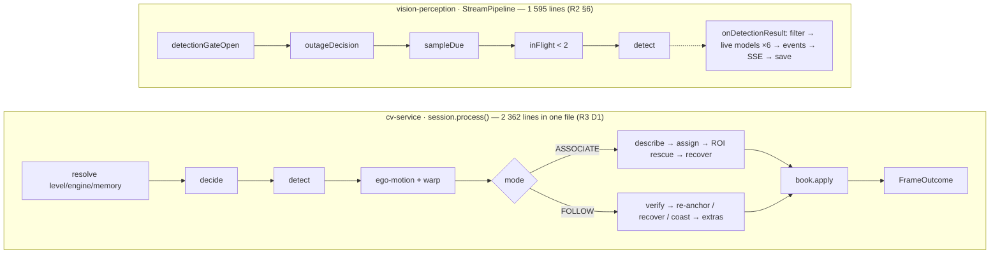
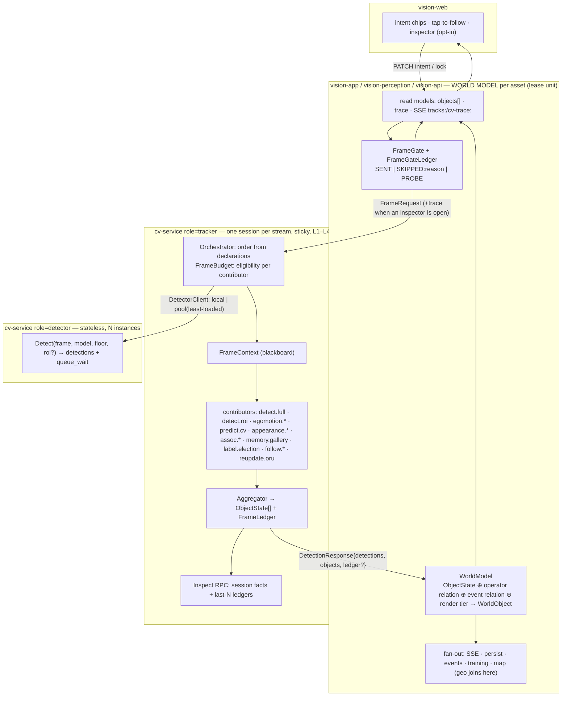
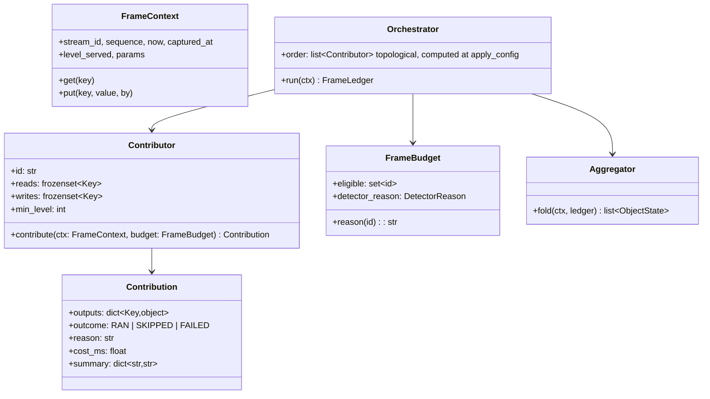
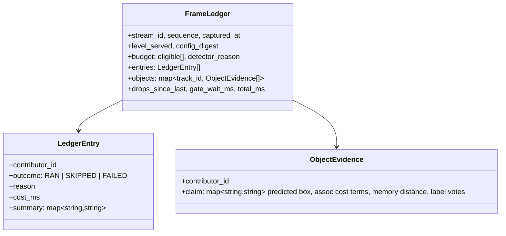
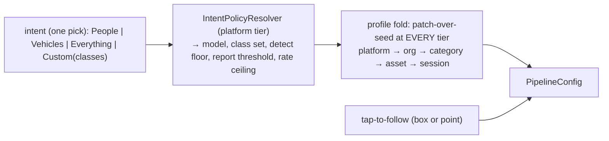

# CV-ORCHESTRATION — from two chains to one orchestration

| | |
|---|---|
| Status | **IN PROGRESS** — proposed 2026-09-11, double-checked against `O1-SYNTHESIS.md` (§12); owner said "continue" 2026-09-12, so W-pre + W0 started on `feat/cv-orchestration` sub-branches; §9 decisions still open and needed before W3/W4/W5 |
| Branch | `docs/cv-orchestration` (docs only). Implementation task branch: `feat/cv-orchestration`, one sub-branch per wave, merged back in order |
| Context | [CV-ORCHESTRATION-CONTEXT.md](CV-ORCHESTRATION-CONTEXT.md) — the ask, roles, corpus, status log |
| Evidence | `cv-orchestration/R1..R5` (Sonnet, code-truth with file:line) → `cv-orchestration/O1-SYNTHESIS.md` (Opus) → this plan (Fable) |
| Supersedes | `docs/extracts/TRACKING-ORCHESTRATION.md` §2–§3 (file layout, "decide first", "one gate acquisition") — carried forward: its DTO rules §5, flow-visibility tiers §7, and the two hard invariants named in §4.3 below |
| Does not touch | TRACKING-V3 E1 (no Kalman), no cross-stream identity; CV-SCALE "keep gRPC"; DOMAIN-SEPARATION lease = Asset; EVENT-TOPOLOGY §8 (frames and per-sample telemetry never on the broker) |

---

## 0. The ask, decoded

The owner asked for five things in one message. Each has a number below and every design element in this plan names which one it serves.

| # | Requirement | Meaning after research |
|---|---|---|
| **A1** | "one task — make computer see the object" should not need many decisions | The operator names an outcome; the platform resolves policy. Research (R1 §6) shows the *required* path is already three clicks; what is broken is that six optional decisions sit in the same modal with no required/optional distinction, and three of them (model, tracking mode, memory) should not be operator decisions at all |
| **A2** | orchestration, not a chain — parts own memory / tracking / prediction / … and results are aggregated | One owner per responsibility, declared inputs and outputs, an aggregator that folds them. Today prediction has three owners and label identity two (§1.3) |
| **A3** | scalable | Scale where the cost is. The detector (135–230 ms, stateless) must scale independently of the tracker session (< 1 ms, stateful, sticky) and of the app's per-asset world model |
| **A4** | debuggable per part, in the main app or a sub-service — "what each process is doing and what is the result of it" | Every part's decision, reason and cost is recorded per frame and readable from the app without logs. Today the answer to nearly every "why" question is NOWHERE (§1.5) |
| **A5** | the contract mirrors the real object — not only the box but difference, confidence, id, predicted next position, "how our application sees it" | An `ObjectState` grouped by facet, additive on the wire; every fact in it is already computed inside cv-service today and thrown away before the proto (§1.4) |

---

## 1. Diagnosis — what the code actually does

Every claim below cites a research report; the reports cite `file:line`. Where a doc and the code disagreed, the code won (O1 §4 lists the contradictions).

### 1.1 The required operator path is short; the decision surface is not

Verified path (R1 §6): Start stream → "Turn on" chip → click the box. `ASSOCIATE` is the server default (`TrackingConfig.defaults()`), so every box already has an id and click-to-follow needs no mode change. (One assumption inside that path: the default `yolo26n.pt` roster covers the object's class — COCO taxonomy, inferred, not read from a live roster; O1 §10.) The owner's frustration is real but is about the **setup modal**: model card, class list, confidence, tracking mode (Off/Associate/Follow), capability ceiling, engine, verify cadence, follow fps — eight controls, no visual split between "decide this" and "never touch this" (R1 §2b). Three of them are policy the platform can resolve (model from intent, mode = always associate, memory = always on). Two quiet defects sit next to this: click-to-follow is a no-op on an untracked box although the wire supports a point lock with zero web callers (R1 surprise 2), and the default declutter tier can hide the very box the operator is trying to click with no on-screen reason (R1 surprise 5).

**Conclusion for A1:** an information-architecture and intent→policy change, not an orchestration change. The orchestration is justified by A2–A5, and this plan says so honestly.

### 1.2 Two hand-written chains

Both chains are correct. Their defect is structural: a stage's output is invisible unless it lands on the wire; adding a stage means editing the composer; a stage cannot degrade alone. The charter promised an ~80-line composer and eight files; the code has 2 362 lines and sixteen files (R3 D1/D2). On the Java side the "gate" is not a class but two inline checks (R2 §2), and the reasons a frame was not sent exist only as branches, never as data.

### 1.3 Responsibilities have several owners

| Responsibility | Owners today | Evidence |
|---|---|---|
| Prediction / extrapolation | **three**: `predict.py` (constant velocity, used only for gating); Java `DetectionExtrapolator` still instantiated and fed every frame with `.at()` having zero callers; web `extrapolateOne` re-deriving velocity from consecutive batches while the wire's `velocityX/Y` is read by nobody except the rate controller | R1 §10, R2 surprise 6, R3 #26 |
| Label identity | **two**: server L1 election in `track.py:946-1028`; web `electStickyLabels` with three hand-copied constants | R1 §10, R3 #24 |
| Inference admission | **three physical `acquire()` sites** routed through one helper; ROI rescue ships **on** so two passes per frame is the default; Java has its own per-stream in-flight bound with no fleet budget | R3 D4, R3 surprise 1, R2 surprise 5 |
| Follow lifecycle | cv-service has no `FollowState`; Java derives REQUESTING/HOLDING/COASTING/LOST/RELEASED from three wire scalars | R4 Part B |
| Frame drops | counted on both sides, reported by neither: push-mode `LatestOnlyMailbox.dropped` never reaches the wire; Java's `DROPPED_IN_FLIGHT` never reaches cv-service | R3 surprise 3, R2 §2 |
| Ground-object geolocation | Java-only (`ProjectedTrack`, vision-map) — correct placement, but unrelated to the `geo:` SSE topic that carries the *aircraft's* position | R4 surprise 9 |

### 1.4 The wire carries a box with facts bolted on

`Detection` = label + confidence + box + nine flat track scalars. Computed inside cv-service and **discarded before the proto** (R4 Part B): predicted next box, the label vote tally behind the elected label, `DORMANT` state (the wire says `LOST` forever), which memory entry matched and at what distance, the appearance descriptor, the ego-motion transform, hits/misses, time since last detector confirmation, the per-term association cost. Seven wire fields are dead in one or both directions (R4 Part A: request 8/9/10, `TargetLock.box`, response 1/13/14/15/21). The web parses roughly two thirds of what does arrive and renders none of it (R1 §8). The label on the wire is already the *elected* label, so the training-capture path labels samples with a smoothed value it cannot audit (R4 A.5).

### 1.5 "Why?" has no answer

| Question an operator or engineer asks | Where the answer is today |
|---|---|
| Why are there no boxes? | `DetectionState` explains *gating* only; a stalled cv-service still reads `RUNNING` (R2 §2) |
| Why is this box not drawn? | nowhere — "hidden at tier T2" looks identical to "not detected" (R1 surprise 5) |
| Why did the detector not run this frame? | `detector_reason` on the wire, rendered only in the expert flow strip (R1 §9) |
| Why did the id change / why did this track die? | nowhere — hits/misses/last_confirmed never leave `track.py` (R4 Part B) |
| Why did follow lose the target? | Java-derived state only; cv-service's own reason is not on the wire |
| Why is inference running with nobody watching? | `RUNNING_UNWATCHED` exists in Java, is missing from the TS union, renders as "status not reported by this server yet" (R1 §9) |
| What did ego-motion do, and what did it cost? | computed, put on the wire, dropped at the codec (R2/R4) |
| How much did each stage cost? | `tracker_millis` spans decode + ego-motion + assign + ROI pass (R3 surprise 4) |
| Is cv-service healthy, not merely reachable? | no health RPC, no reflection, no `/metrics`, no Micrometer anywhere (R3 §5, R2 surprise 4) |

### 1.6 The scale seam is inside one process

One Python process holds one `InferenceGate` semaphore for all streams (default `min(2, cpu//2)`), one pool thread per stream for its life, and `SessionRegistry` in process memory (R3 §0, §3). A yolo26n pass costs 36–58 ms on a laptop and 197–230 ms on the GB4005; lk/ncc cost under 0.5 ms (R3 #14, #35, #36; CV-PULL-SPIKE). One cv-service saturates at three to four streams at 10 fps (ALWAYS-ON §3). Every timing number here is a doc claim nobody re-measured this wave, and the two GB4005 figures disagree (O1 §7, §10); W4's acceptance is a measurement for that reason. Two replicas behind one address work until the first reconnect, which lands on the other replica and silently resets ids, gallery and lock (R3 §6). Two Java targets are `pick_first` failover, not balancing (R2 §4). There is no fleet inference budget (ALWAYS-ON D3, open).

---

## 2. Principles — the argument

| # | Principle | Answers | Honours |
|---|---|---|---|
| **P1** | **One operator act.** "Watch for X" or "tap to follow". Everything else is policy: resolved by the platform, inspectable and overridable, never required | A1 | every mature product names an outcome, never a stage (R5 §operator-intent); CV-SETTINGS profile hierarchy already persists policy |
| **P2** | **Contributors, not stages.** A part declares what it reads and writes on a per-frame blackboard; the orchestrator derives the order from the declarations. Adding a part = registering it. No part imports another part | A2 | DeepStream plugin graph, ROS composition (R5); the four engine Protocols stay as the evidence seam (R3 §4) |
| **P3** | **Evidence is a first-class artifact.** Every contribution is recorded in a per-frame ledger: who, ran/skipped/failed, reason, cost, summary. The ledger is the debug surface, the replay fixture and the audit trail. Nothing is "visible only in logs" | A4 | TRACKING-ORCHESTRATION §7 flow-visibility tiers; charter §7 "no per-frame INFO" stays true because the ledger is data, not logs |
| **P4** | **Aggregation is a fold, owned by the platform.** One aggregator folds contributions into `ObjectState[]`; it is the only writer of identity and the only authority on birth and death. Contributors propose; the aggregator decides | A2 | TRACKING-REVIEW §4.1 inversion (engines are evidence, core owns identity), made structural; SORT lifecycle counters (R5) |
| **P5** | **The wire carries a mirror, not a box.** `ObjectState` groups facts by facet: identity, kinematics, belief, provenance, memory, lock, timing. An absent group means "not computed at this level". Algorithm-shaped facts (transform, descriptor, cost terms) go in the ledger, never in the mirror | A5 | TRACKING-ORCHESTRATION §5 DTO rules (group, don't widen; absent = untracked; additive only; proto flat by *field*, grouped by *message*); vision_msgs label-as-distribution and DeepStream detector/tracker/predicted boxes as separate fields (R5) |
| **P6** | **Scale where the cost is.** Detector = stateless model server, N instances, least-loaded. Tracker session = stateful, sticky by stream, cheap, placeable onboard at L1/L2. App = world model per asset (the lease unit). Sub-millisecond contributors are never split across processes: the hop costs more than the work | A3 | TRACKING-V3 L1 "boxes come from offboard"; CV-SCALE S4 pool; DOMAIN-SEPARATION D7 lease = Asset; EVENT-TOPOLOGY §8 |
| **P7** | **Zero behavioural delta first.** The contributor refactor ships with `tools/trackeval` `BASELINE.md` unchanged and a golden per-frame outcome dump byte-identical, before any new evidence source or wire field is added | all | TRACKING-V3 P7 reversibility; `test_baseline_consistency.py` already runs on every pytest |

Rejected shapes, so nobody re-proposes them:

| Shape | Why not |
|---|---|
| Actor per track / stream processor (Flink, Akka, NATS between stages) | hop cost ≫ work for sub-ms parts; per-sample telemetry on the broker is forbidden (EVENT-TOPOLOGY §8); identity state must never be shared across processes (R3 §6) |
| A workflow/DAG engine library | the DAG has ≤ 12 nodes and is fixed per config; declarations + a topological sort at `apply_config` time is the whole "engine" |
| "Just split `session.py` into three files" | fixes size, not ownership or visibility; it *is* the mechanical first step of W0, not the destination |
| Shared fleet token bucket (Redis/Postgres) for inference | admission belongs where capacity is known — at the detector instance; the app keeps its per-stream bound; the fleet number is the sum of what instances report (§4.9) |
| Push `detection_enabled` down the pull wire | already rejected by ALWAYS-ON §3; in pull mode the worker is always-on by design |
| Add six more scalars to `DetectionResponse` for the dropped fields | R4 shows scalar-by-scalar growth produced seven dead fields; new facts go in `ObjectState` groups and the ledger |

---

## 3. Target architecture

Three processes, three kinds of state, three ways to scale (§4.9). Everything inside `TRK` stays on one thread per stream exactly as today; the only new cross-process seam is `DET`, and it is introduced last (W4), after the refactor is observable.

### 4.1 Contributor contract (cv-service)

A contributor is the adapter between the blackboard and an evidence engine. The four engine Protocols in `engines/base.py` (`Associator`, `SingleObjectTracker`, `MotionCompensator`, `AppearanceExtractor`) are **kept unchanged** as the pixel seam; contributors wrap them. What is *not* behind a seam today (prediction, memory, label election, scheduler, ROI rescue, follow verify/coast/extras, ORU, lock) becomes a contributor (R3 §4 "hardwired" list).

Rules:

| Rule | Why |
|---|---|
| Blackboard keys are a closed enum (`FRAME, POSE, TRACKS_PREV, PREDICTIONS, TRANSFORM, DETECTIONS, DETECTIONS_ROI, DESCRIPTORS, ASSIGNMENT, RECOVERIES, LOCK, FOLLOW_OBS, CORRECTIONS, OBSERVATIONS`) | a typo in a string key would be a silent missing input; an enum is a compile-time DAG |
| A key has exactly one writer per configuration | one owner per responsibility (A2); the orchestrator refuses a config with two writers |
| Order is computed once at `apply_config`, never per frame | resolve-once rule (`params.py`); no per-frame graph work |
| `contribute` never raises; the orchestrator also wraps it. A failure is recorded `FAILED:reason` and the frame continues with the key absent | degradation becomes per-part, never per-stream — fixes TRACKING-REVIEW D1 structurally |
| Only `detect.*` contributors may touch the inference gate, and only through `DetectorClient` | carries forward the invariant "the gate is never touched on the tracker-only path" (R3 §Deviations, verified); makes it checkable: a ledger with no `detect.*` entry must show zero gate waits |
| `FrameBudget` is frame-free | carries forward "`decide()` is frame-free" (R3, verified); the scheduler becomes the budget without reading pixels |
| The contributor set is fixed for W0: existing modules map 1:1, **no algorithm change** | P7 |

Mapping (R3 §1 inventory → contributor; `session.py` line ranges are the code that moves):

| Contributor id | Today | reads → writes | Budget rule |
|---|---|---|---|
| `detect.full` | `_run_detector` / `detect_composite` (`servicers.py:1160-1197`, `registry.py:257-309`) | FRAME → DETECTIONS | eligible iff scheduler says run (reasons = today's `DetectorReason`, unchanged) |
| `detect.roi` | ROI rescue `session.py:1071`, `_run_roi_detector :1199-1263` | FRAME, ASSIGNMENT → DETECTIONS_ROI | eligible iff `roi_enabled` and a CONFIRMED candidate went unmatched |
| `egomotion.flow` / `egomotion.pose` | `flow_gmc.py`, `pose_gmc.py`, `_estimate_motion :561-564`, `book.warp :577` | FRAME, POSE, TRACKS_PREV → TRANSFORM | eligible when a compensator resolved for the level |
| `predict.cv` | `predict.py:66-91` | TRACKS_PREV, TRANSFORM → PREDICTIONS | always |
| `appearance.histogram` | `histogram.py`, `_describe :820` | FRAME, DETECTIONS → DESCRIPTORS | only on detector frames |
| `assoc.cost` / `assoc.bytetrack` | `assign.py`, `_run_cost_associate :791-999`; `bytetrack.py` | PREDICTIONS, DETECTIONS, DESCRIPTORS → ASSIGNMENT (bytetrack declares DETECTIONS only — its dead-end becomes visible in the DAG, R3 surprise 5) | ASSOCIATE mode |
| `memory.gallery` | `memory.py`, `_attempt_recovery :952`, `_attempt_follow_recovery :1175-1225` | ASSIGNMENT, DESCRIPTORS → RECOVERIES | always registered; env switch = `SKIPPED:disabled` (R3 §7: always-on is safe; switch kept for P7 measurement) |
| `label.election` | `track.py:946-1028` | ASSIGNMENT → OBSERVATIONS(label proposal, candidates) | always; the aggregator applies the proposal |
| `follow.lk` / `follow.ncc` | `session.py:1262-1776` verify / re-anchor / coast / extras + `lk.py`, `ncc.py` | FRAME, LOCK, PREDICTIONS, DETECTIONS → FOLLOW_OBS | FOLLOW mode |
| `reupdate.oru` | `reupdate.py`, `_late_corrected_box :1314`, `_observe` ORU path | OBSERVATIONS, history → CORRECTIONS | detector frames with a coasted gap |
| *(config-time, not per-frame)* | capability/engine/motion/appearance/memory resolution `session.py:1852-2168`, degradation `:1924-1984`, `LockArbiter.apply` | — | run at `apply_config`; the ledger records the resolved set once per config change |
| **Aggregator** | `TrackBook.apply` (`track.py:474-482`) + `FrameOutcome` construction (`session.py:595-616`) | OBSERVATIONS, FOLLOW_OBS, RECOVERIES, CORRECTIONS, LOCK → tracks, `ObjectState[]` | the only writer of `Track`; death from counters (`_retire`) |

### 4.2 Orchestrator and budget

The orchestrator is ~150 lines: hold the ordered contributor list, run each eligible one under a timer, catch everything, write outputs, append a ledger entry. `DutyCycleScheduler.decide()` becomes the core of `FrameBudget`: it still answers "run the detector this frame and why" with the same `DetectorReason` values; it additionally answers "which contributors are eligible" from mode and level. The ROI second pass is a budget decision recorded as its own ledger entry — today it hides inside `tracker_millis` (R3 surprise 4). The duty ratio the flow strip shows counts `detect.full` only; `detect.roi` is shown beside it, never folded in (O1 Q13).

### 4.3 Aggregator

`TrackBook.apply` already is the fold; W0 gives it the name and the boundary. It reads proposals (observations, follow observation, recoveries, corrections, label proposal) and is the only code that creates, ages, settles, retires a `Track` and mints ids. It emits `ObjectState[]` (§4.5) and finishes the `FrameLedger`. Lifecycle death stays exactly today's rule (`min_hits`, `max_age_frames`, `max_age_millis`, retention multiplier) but the counters that drove it are now on the object. Two precisions from O1: the aggregator runs every frame so the ledger is always complete, but in W0 the fold into the book keeps today's call sites exactly — `apply` is *at most* once per frame, zero on the OFF path and on a FOLLOW re-anchor failure with nothing held (O1 contradiction 7) — anything else is a behavioural delta; and the frame's `captured_at` at which the aggregator folds is the one clock for age and death, whatever cadence a contributor ran at (O1 Q20).

### 4.4 Ledger — the debug surface (A4)

| Tier | Where | Exposure | Cost when nobody looks |
|---|---|---|---|
| **Hot** | ring per session, last N frames (`CV_LEDGER_RING`, default 64); ring per `StreamPipeline` for gate decisions | gRPC `Inspect(stream_id?, last_n)` → session facts + ledgers; process facts when `stream_id` is empty (level, roster, sessions, gate occupancy, model loaded, uptime) — this is the health surface R3 §5 and R2 surprise 3 found missing | a few KB per stream, no I/O |
| **Warm** | `DetectionResponse.ledger` set only while `FrameRequest.trace = true`; Java forwards to SSE `cv-trace:<assetId>` | `GET /api/streams/{id}/cv/trace?last=N` (gate + frame + world ledgers) and SSE `cv-trace:<assetId>` (opt-in topic, like `detections:`) | zero: `trace` is a demand flag set only while an inspector subscribes, cleared when the last one leaves |
| **Cold** | later: ledgers to the broker as a U3 history stream | out of scope until DOMAIN-SEPARATION W2 lands | — |

Java side, `FrameGateLedger` records one decision per sampler deadline (R2 §2 branches, all verified): `SENT`, `PROBE`, or `SKIPPED:` one of `GATE_OFF · GATE_NO_DEMAND · PULL_MODE · OUTAGE_BACKOFF · DEADLINE_NOT_DUE · IN_FLIGHT_FULL · CV_UNAVAILABLE`, plus the demand snapshot (`sse | pose | poll`) so "why is inference running" names the term (R2 §2: demand has three OR-terms and fails open). The `WorldModel` records per result: live/durable gate snapshot, filtered-out count, follow transition, objects born/died.

What the "why" table in §1.5 looks like afterwards:

| Question | Answer location after this plan |
|---|---|
| Why no boxes? | gate ledger reason, or frame ledger `detect.*` entry, or Inspect health — three distinct answers |
| Why is this box not drawn? | `WorldObject.render.tier` — one lookup |
| Why did the detector not run? | ledger `budget.detector_reason` (same enum as today) |
| Why did the id change / die? | `ObjectState.timing` (hits, misses, since_confirmed) + `ObjectEvidence` for that id |
| Why did follow lose it? | `follow.*` entry reason + `ObjectState.lock` |
| Running with nobody watching? | gate ledger demand snapshot + policy flag |
| Ego-motion? each stage's cost? | `egomotion.*` entry summary + per-entry `cost_ms` |
| Healthy? | `Inspect()` process facts → `CvStatusProvider` → `/api/system/status` row gains queue depth, gate occupancy, model loaded |

### 4.5 ObjectState — the mirror (A5)

One new message on the wire, nested groups, additive; `detections[]` kept for existing readers. Sources are the internal facts R4 Part B found (all already computed).

| Group | Fields | Source today | Status on wire today |
|---|---|---|---|
| **root** | `id`, `lifecycle` (new enum `ObjectLifecycle`: TENTATIVE · CONFIRMED · COASTING · LOST · DORMANT), `stream_id` | `Track.state`, `DormantIdentity` | DORMANT absent — wire says LOST forever |
| **identity** | `label` (elected), `label_raw` (this frame's detector label), `candidates[]` (label, weight), `stability` (frames since last switch) | `Track` vote ring `track.py:946-1028` | only the elected label crosses; training capture cannot audit it |
| **kinematics** | `box` (the elected one), `detector_box`, `tracker_box`, `predicted_box` + `horizon_ms`, `velocity_x/y`, `displacement_x/y` since last update, `motion_compensated` | `Track` fields, `predict.py`, `TrackBook.warp` | velocity only; three-box separation per DeepStream (R5) |
| **belief** | `confidence_raw`, `confidence_smoothed`, `existence` (0..1 from hits/misses/age), `since_confirmed_ms` | `Track.last_confirmed`, vote tally | raw confidence only |
| **provenance** | `source` (new enum `EvidenceSource`: DETECTOR · TRACKER · PREDICTED · MEMORY · REUPDATE), `contributors[]` (ids that touched it this frame), `assoc_cost`, `reupdated` | `Observation.source`, `assign.py`, `reupdate.py` | DETECTOR/TRACKER + boolean `reupdated` |
| **memory** | `recovered`, `identity_confidence`, `dormant_ms`, `gallery_matches` (count), `match_distance` | `memory.py:272-306` | two scalars, and JSON republishes them only for the locked track (R4 surprise 5) |
| **lock** | `locked`, `lock_seq_applied` | `LockArbiter` | `locked_track_id` at frame level only |
| **timing** | `first_seen_ms`, `last_seen_ms`, `last_confirmed_ms`, `age_frames`, `hits`, `misses` | `Track` dataclass | `age_frames` only |

Placement rules (these are the DTO rules of TRACKING-ORCHESTRATION §5, applied):

- `DetectionResponse.objects = repeated ObjectState` (field 27) and `DetectionResponse.ledger = FrameLedger` (field 28, present only when traced). `FrameRequest.trace = bool` (field 13); `PullControl.trace` (field 12).
- New enums live only on new messages. `TrackState`, `DetectionSource`, `DetectorReason` are **not** extended. Verified 2026-09-11 (O1 §10 had it unverified): the codec maps each with a switch *expression* and no `default` branch (`DetectionFrameCodec.java:366-391`), so a new proto value fails compilation of any Java build on the new proto; and an older codec at runtime receives it as `UNRECOGNIZED` and nulls the whole `TrackRef` (R4 A.5). A silently untracked object on old clients is exactly the failure a mirror must not have.
- Algorithm-shaped facts (the affine transform, descriptor vectors, per-term cost weights) go in `ObjectEvidence.claim` in the ledger, never in `ObjectState`. The mirror describes the object; the ledger describes the algorithm.
- Dead fields (`TrackingConfig` 8/9/10, `DetectionResponse` 13/14/15/21, `TargetLock.box`) are marked deprecated in proto comments and never renumbered; their information moves to the ledger. `DetectionResponse.stream_id` starts being *checked* by the codec (R4 surprise 2).
- `model_id/model_version` stay frame-level; `ObjectState` carries no model. The per-detection replication in JSON is a legacy shape that stays on `detections[]` only.
- `ObjectState` is keyed by `(stream_id, id)` so a future cross-camera fusion stage consumes it without a wire change; fusion itself is out of scope (TRACKING-V3 non-goal).

### 4.6 WorldModel and WorldObject (Java)

`WorldModel` (vision-perception, `application/pipeline`) replaces `TrackBook` + `FollowTracker` + `DetectionExtrapolator` as the single per-stream owner of object state. It folds each `DetectionResult` (now carrying `ObjectState[]`) into `WorldObject`:

| Facet | From | Note |
|---|---|---|
| `state: ObjectState` | wire | verbatim domain mirror |
| `operator: {followed, denied, follow: FollowState}` | `WorldModel` | `FollowState` stays Java-derived — it is an operator relation, not a cv fact (R4 Part B); no consumer-shaped field goes back into the pipeline (TRACKING-ORCHESTRATION P3) |
| `event: {openEventId}` | `DetectionEventEngine` | |
| `render: {tier}` | today's `detectionTiers` logic moves server-side | answers "why isn't it drawn" (§1.5); the web keeps drawing, stops deciding |
| geo | **not here** — joins at the vision-api read model with vision-map's `ProjectedTrack` | perception must not depend on map (ArchUnit DAG) |

JSON: `DetectionResultResponse.objects[]` and `StreamTracksResponse.objects[]` (nested groups, `NON_NULL`), `detections[]`/`tracks[]` kept. New SSE topics: `tracks:<assetId>` (objects at frame cadence — the first live topic for tracks; `/tracks` remains the poll fallback) and `cv-trace:<assetId>` (opt-in). TS mirrors under `core/api/models.ts`, plus a contract test that asserts every TS enum union against a fixture the API exports, so `DetectionState` cannot drift again (R1 Q3). `onDetectionResult` ordering (live plane before durable save, both gates read once) is carried forward verbatim (R2 §3).

### 4.7 Operator intent → policy (A1)

| Control today (R1 §2) | After |
|---|---|
| "Turn on" chip / Detect toggle | **stays** — the one act |
| Model card ("Looking for") | becomes the intent pick; the model is resolved from intent; expert tier can still pin a model and sees "resolved from intent People (platform)" |
| Tracking mode Off/Associate/Follow | **removed from the operator surface**: ASSOCIATE always, FOLLOW = tap (box *or point* — wires the zero-caller point lock, R1 surprise 2), OFF only via profile/expert |
| Memory / cached tracking | **removed**: always on (R3 §7); env switch kept for measurement |
| Confidence, classes | stay, in a modal renamed "Tuning", each showing its resolved source |
| Capability ceiling, engine, verify cadence, follow fps | expert tier only |
| `cv.detection-policy = ALWAYS` | gets a control on the asset binding in `/vision/profiles` (today: blind attribute editor only, R1 §4) |
| Boxes declutter | stays client-side, but the tier is now server-assigned and visible per object |

The profile fold must become patch-over-seed at every tier; today a bound profile replaces the request wholesale (R2 §1 known gap), which would make an asset-tier intent and an expert override mutually exclusive.

### 4.8 Debug surfaces by audience

| Audience | Surface | Content |
|---|---|---|
| Operator (fly hero) | one status line, three honest states | "Off" · "On — N objects" · "On — no viewer" · "Degraded — <reason>" from Inspect health, never a guess from gating |
| Expert (Tuning modal) | resolved-source line per knob; flow strip reads ledger entries not `tracker_millis` | |
| Engineer (new `/manage/cv` page or fly inspector, W5) | per-frame contributor list with outcome/reason/cost; per-object evidence; gate ledger; process facts | also the replay fixture: a saved trace replays through trackeval |
| Ops | `/api/system/status` cv row | queue depth, gate occupancy, capacity N/M streams, model loaded |

### 4.9 Scaling model (A3)

| Part | State | Scales as | Placement | Admission |
|---|---|---|---|---|
| **Detector** (`CV_SERVICE_ROLE=detector`) | none | N instances, least-loaded, batchable later | GPU/OpenVINO box (GB4005-class) | instance-local `InferenceGate`; `RESOURCE_EXHAUSTED` when its queue exceeds a bound → client tries the next instance; capacity/occupancy on `Inspect` |
| **Tracker session** (`CV_SERVICE_ROLE=tracker`, today's `inference` minus the in-process detector when `CV_DETECTOR_TARGETS` is set) | per stream | M processes, **sticky by stream_id** | next to the app; onboard at L1/L2 later | gRPC pool size, as today |
| **World model** | per asset | K app workers | app; DOMAIN-SEPARATION lease = Asset | per-stream in-flight bound, as today |
| **Ledger sink** (cold) | none | broker consumers | anywhere | later |

Decisions:

- **Pull-mode streams count against detector capacity whether or not anyone watches.** That is ALWAYS-ON's design (the ingest plane is always on; the anti-goal forbids pushing demand down the pull wire), and it is why admission must live at the detector, where the ingest plane's true load is visible (O1 defect 8).
- **Affinity is a deployment requirement, not code.** One tracker per app instance via the ordered target list + `pick_first` (today's mechanism); documented in compose; DOMAIN-SEPARATION W3's worker role inherits it. No shared session store (R3 §6: nothing needs sharing if affinity holds).
- **The detector hop is paid once per detector frame**: ≈1–3 ms LAN for a 640 px JPEG against 135–230 ms inference — under 2 % (CV-PULL-SPIKE numbers). Sub-ms contributors never leave the session thread (P6).
- **Fleet budget (ALWAYS-ON D3) is answered structurally, not with a token**: each detector instance admits what it can; `CvStatusProvider` sums instance capacities into "N of M streams" on `/api/system/status`; the app's per-stream bound stays. When the sum is exhausted, `ALWAYS`-policy streams are the ones that see `RESOURCE_EXHAUSTED` first, recorded in the gate ledger as `CV_UNAVAILABLE` — visible, not silent.
- `DetectorClient` in cv-service has two implementations: `local` (in-process `YoloDetector`, today) and `pool(targets)`. Java is unchanged by W4; it still talks to a tracker.

---

## 5. Contract changes (frozen for implementation)

| Layer | Addition | Removal / deprecation |
|---|---|---|
| `cv.proto` | messages `ObjectState` (+ nested `Identity, Kinematics, Belief, Provenance, Memory, Lock, Timing`), `FrameLedger`, `LedgerEntry`, `ObjectEvidence`, `InspectRequest`, `InspectResponse`, `SessionFacts`, `ProcessFacts`; enums `ObjectLifecycle`, `EvidenceSource`, `LedgerOutcome`; fields `DetectionResponse.objects = 27`, `.ledger = 28`, `FrameRequest.trace = 13`, `PullControl.trace = 12`; rpc `Inference.Inspect(InspectRequest) returns (InspectResponse)`; service `Detector { rpc Detect(DetectRequest) returns (DetectResponse) }` (W4) | comments marking `TrackingConfig` 8/9/10, `TargetLock.box`, `DetectionResponse` 13/14/15/21 deprecated; nothing renumbered, no existing enum extended |
| Java domain (vision-perception) | `ObjectState` record family, `WorldObject`, `WorldModel`, `FrameGateLedger`, `GateReason`, `TraceDemand`; `TrackingTelemetry` unchanged | `TrackBook`, `FollowTracker`, `DetectionExtrapolator` retired in W2 (`FollowState` enum kept) |
| cv/grpc codec | decode `objects`, `ledger`; encode `trace`; **check** `stream_id`; `Inspect` client | — |
| vision-api | `objects[]` on `DetectionResultResponse` and `StreamTracksResponse`; `GET /api/streams/{id}/cv/trace`; `LiveTopicKind.TRACKS("tracks")`, `.CV_TRACE("cv-trace")`; `/api/system/status` cv row gains capacity fields; `CvProfileRequest.intent`; asset binding `detectionPolicy` | `detections[]`, `tracks[]` stay (legacy) |
| vision-web | `ObjectState`/`WorldObject` TS mirrors; enum contract test; intent chips; point lock; inspector | client extrapolation for tracked objects; `electStickyLabels`; tracking-mode picker; memory toggle |
| cv-service | `orchestration/` package (contributor, context, budget, orchestrator, aggregator, ledger), `Inspect` servicer, `DetectorClient`, `detector` role | `session.py` shrinks to composition; `tracker_millis` semantics unchanged for old clients |
| compose | `cv-detector` service ×N under profile `scale`; `cv-service` gains `CV_DETECTOR_TARGETS` (unset = local) | — |

---

## 6. Waves

Task branch `feat/cv-orchestration` from master once this plan is accepted; each wave is a dash-named sub-branch `feat/cv-orchestration-wN-<name>` (git refuses nested refs under the existing leaf `feat/cv-orchestration`), merged into the task branch when its acceptance holds; the task branch merges to master when W0–W3 are in. Roles per CLAUDE.md: Opus owns each wave's flow and may write code; Sonnet implements and tests within a file scope; Fable reviews acceptance only. Every wave updates its `MODULE.md`s and the context file's status log. No reactor-wide builds while another wave holds modules red.

| Wave | Scope (disjoint files) | Agent | Acceptance |
|---|---|---|---|
| **W-pre** standalone fixes | `models.ts` `DetectionState` 4 values + switches; `vision-perception/MODULE.md` gate re-check sentence; `cv-service/MODULE.md` two defaults + "recovery cost-only"; push-mode `dropped_frames` set on the response (field exists, "all zero in push mode") | Sonnet ×2 (web, python) | `npm run test:ci` green; cv-service pytest green; no behaviour change beyond the drop counter |
| **W0** contributors + orchestrator + ledger + Inspect | `cv/cv-service/cv_service/tracking/**` → new `orchestration/**`; `grpc/servicers.py` Inspect only; `tools/trackeval` golden dump; proto: `Inspect*`, `FrameLedger*` only | Opus (flow, orchestrator, aggregator boundary) + Sonnet per contributor | `BASELINE.md` unchanged; **new golden test**: per-scenario `FrameOutcome` sequence byte-identical before/after; every contributor has a unit test with a fake context; `Inspect` returns ≥ 1 ledger for a running session; `session.py` ≤ 400 lines; no `acquire()` outside `DetectorClient` (grep-enforced test) |
| **W1** wire mirror | proto `ObjectState*`, fields 27/28/13/12; cv-service aggregator emits `objects`; codec decode/encode + `stream_id` check; Java domain `ObjectState` family; DTO `objects[]`; TS mirrors + enum contract test | domain-modeler → adapter-builder → spring-integrator → web-ui (sequential, disjoint) | round-trip test proto→Java→JSON→TS for every group; `detections[]` unchanged byte-for-byte; a `DORMANT` object appears on the wire in the memory trackeval scenario |
| **W2** Java world model + trace | `WorldModel`, `WorldObject`, `FrameGateLedger`, `TraceDemand`; retire `TrackBook`/`FollowTracker`/`DetectionExtrapolator`; `/cv/trace`; SSE `tracks:`, `cv-trace:`; `CvStatusProvider` capacity; profile fold patch-over-seed + `intent` (Java side); `MODULE.md`s | application-service + spring-integrator | `TrackingAssociateE2ETest` and follow tests green with `WorldModel`; live-before-durable order asserted by test; gate ledger shows all seven reasons in unit tests; **pays MASTER-MATRIX K3 (StreamPipeline decomposition)** partially — `StreamPipeline` loses the six live-model peers |
| **W3** one operator act | vision-web only: intent chips on hero; "Tuning" modal with resolved sources; remove mode picker + memory toggle; point lock; delete client extrapolation-for-tracked and `electStickyLabels`; `/vision/profiles` intent + policy ALWAYS control; render tier from server | web-ui | click path to follow = 3 (measured by the e2e spec); no client re-derivation of velocity or label for tracked objects (grep test); `RUNNING_UNWATCHED` renders honestly |
| **W4** detector role + pool | cv-service `DetectorClient` (`local`, `pool`), `detector` role + `Detector` service, `RESOURCE_EXHAUSTED` admission; compose `cv-detector` profile; `Inspect` capacity | adapter-builder (python) | trackeval identical with `local`; **measured**: 1 tracker + 2 detectors sustains ≥ 2× the streams of 1 all-in-one at 10 fps yolo26n on the same hardware; reconnect test proves affinity holds with the ordered target list |
| **W5** inspector | vision-web `/manage/cv` (or fly drawer tab): contributor timeline, per-object evidence, gate ledger, process facts; trace demand wiring | web-ui | opening the inspector flips `trace` on and closing flips it off (asserted via `/cv/trace`); a saved trace replays through trackeval |
| **W6** cold ledger | after DOMAIN-SEPARATION W2: ledgers to a U3 history stream | — | deferred; not scheduled here |

Dependencies: W-pre ∥ W0 → W1 → W2 → W3; W4 after W0, parallel with W2/W3; W5 after W2. W0 is the largest wave and carries the strictest acceptance on purpose: everything after it is additive on an observable core.

---

## 7. Standalone defects found by the research

Fix regardless of whether the plan is accepted (W-pre unless noted):

| # | Defect | Evidence |
|---|---|---|
| D1 | TS `DetectionState` has 3 values, Java 4; `RUNNING_UNWATCHED` falls through every web switch | R1 §9, R4 surprise 8, verified 2026-09-11 (`models.ts:805` vs `DetectionState.java:39`) |
| D2 | `vision-perception/MODULE.md` describes a trailing `liveGateOpen()` re-check the code deliberately does not do | R2 surprise 1 |
| D3 | `cv-service/MODULE.md` has both defaults backwards: associator is `cost`, ROI rescue ships **on**; "recovery is cost-only" is false | R3 surprise 1, 2 |
| D4 | `DetectionExtrapolator` runs every frame for a caller that no longer exists; the TS header comment claims it was deleted | R1 §10, R2 surprise 6; **verified by grep 2026-09-11**: production callers are `reset()` ×2 and `accept()` ×1 in `StreamPipeline`, none for the query method (W2 deletes it) |
| D5 | Push-mode frame drops never reach the wire | R3 surprise 3 |
| D6 | `identity_confidence`/`dormant_millis` decoded per track, republished only for the locked track | R4 surprise 5 (W1 fixes via the memory group) |
| D7 | No UI sets `cv.detection-policy = ALWAYS`; cancels out with D1 today, will not once either is fixed | R1 §4 (W3) |
| D8 | Click-to-follow is a no-op on untracked boxes; point lock has zero web callers | R1 surprise 2 (W3) |
| D9 | `DetectionResponse.stream_id` is never checked | R4 surprise 2 (W1) |

Algorithm defects the research found that this plan makes **observable but does not fix** (they need real aerial footage, TRACKING-V3 O1–O5): FOLLOW re-anchors on the raw box then corrects only the reported one (R3 surprise 9); a missing descriptor passes the memory appearance gate (R3 surprise 7); `ObservationRing.before()` assumes monotone timestamps (R3 surprise 8); two dormant matches race on `claim()` (R3 surprise 6). Each becomes a ledger entry with a reason, which is what makes them fixable later.

---

## 8. Decisions taken (alternatives rejected)

| # | Decision | Rejected | Why |
|---|---|---|---|
| E1 | Emit one coalesced `ObjectState[]` per processed frame; contributors never have their own wire stream | per-contributor streams | DeepStream/SORT pattern; the ledger is the per-contributor view (R5 Q1) |
| E2 | Association stays inside the tracker session next to the state; only the detector is split out | association as a service | every mature tracker keeps association with state; hop ≫ work (R5 Q2, R3 §6) |
| E3 | Label is a distribution (`candidates[]`) plus an elected value plus the raw frame label | elected only | vision_msgs; training audit (R4 A.5) |
| E4 | Death authority = aggregator from counters; contributors never retire a track | contributor-driven | P4; SORT counters as the free "why did it die" (R5 Q4) |
| E5 | Cross-camera re-ID out of scope; key by `(stream_id, id)` | fusion now | TRACKING-V3 non-goal; keyed so a later stage consumes it (R5 Q5) |
| E6 | No Kalman; `predict.cv` is a contributor so a future estimator is one file | Kalman now | TRACKING-V3 E1; R3 Q7 |
| E7 | Algorithm-shaped facts only in the ledger; the mirror stays algorithm-free | transform/descriptor on `ObjectState` | R4 Q4; keeps the wire from leaking engine choice |
| E8 | Existing enums untouched; new enums only on new messages | extend `DetectionSource` | exhaustive switch expressions in the codec (compile error on the new proto) and `UNRECOGNIZED → null` on old codecs — both verified §4.5 |
| E9 | Memory always on; env switch = contributor disabled | per-stream wire "off" | R3 §7; wire cannot express "off" today anyway |
| E10 | Fleet budget = detector-instance admission + summed capacity on status; no shared token | Redis/Postgres token bucket | §4.9; R2 Q1 |
| E11 | Affinity is a deployment requirement; no shared session store; NATS never carries track state | external `SessionRegistry` store | R3 §6; DOMAIN-SEPARATION U0/U1 |
| E12 | `FollowState` stays Java-derived as an operator relation | move follow lifecycle into cv-service | TRACKING-ORCHESTRATION P3; R4 Part B |
| E13 | Ground-object geo joins at the API read model from vision-map | geo in perception or in cv-service | ArchUnit DAG; R4 surprise 9 |
| E14 | `TrackingConfig` 8/9/10, `TargetLock.box`, response 13/14/15/21 deprecated, never renumbered | re-home as `TrackingTelemetry` scalars | R4 Q1; scalar growth produced the dead fields |
| E15 | W0 ships zero behavioural delta, proven by golden per-frame outcomes, before any new evidence source | refactor + improve together | P7; the harness is the only ground truth without aerial footage (TRACKING-V3 O1–O5) |

---

## 9. Open decisions for the owner

1. **`bytetrack` roster entry** — keep as an L3 reference (its DAG dead-end becomes visible) or retire so every associator shares one evidence graph (R3 Q8)?
2. **Detector placement** — is the GB4005 to become a detector-only instance with the tracker next to the app, or stay all-in-one until W4 measures the split?
3. **Inspector audience** — is the engineer inspector (W5) a product surface on `/fly` or a `/manage/cv` page only?
4. **Tracking-mode picker** — remove from the operator surface entirely (this plan) or keep OFF reachable for the operator?
5. **Legacy `detections[]`/`tracks[]`** — retire two releases after W3, or keep indefinitely for integrators (PLATFORM-AUDIT: closed to integration today)?

---

## 10. Acceptance for the whole initiative and non-goals

Done when: an operator reaches boxes-and-follow in three clicks with one decision; every "why" question in §1.5 has a location in §4.4; `ObjectState` carries every group in §4.5 end to end; `BASELINE.md` is unchanged through W0–W4; a 1-tracker + 2-detector deployment measurably out-scales one all-in-one; no responsibility in §1.3 has more than one owner (grep-enforced where possible).

Non-goals: Kalman or any new estimator; cross-camera identity; moving frames or per-sample telemetry onto NATS; replacing gRPC; training or geolocation scale; resolving TRACKING-V3 O1–O5 (they need aerial footage).

---

## 11. Documentation owed by each wave

| Wave | Docs |
|---|---|
| W0 | `cv/cv-service/MODULE.md` (orchestration package, contributor list, Inspect); `docs/extracts/TRACKING-ORCHESTRATION.md` marked superseded §2–3 with a pointer here |
| W1 | `cv/grpc/MODULE.md`, `contexts/vision-perception/MODULE.md`, `station/vision-api/MODULE.md`, `proto` comments |
| W2 | `contexts/vision-perception/MODULE.md` (WorldModel replaces three peers; D2 fixed), `station/vision-app/MODULE.md` |
| W3 | `station/vision-web/MODULE.md`; `docs/plans/README.md` rows for CV-SETTINGS, CV-PANEL-SPLIT |
| W4 | `cv/cv-service/MODULE.md` roles table, `docker-compose.yml` comments, ALWAYS-ON-FLOW-PLAN D3 row → "answered by CV-ORCHESTRATION §4.9" |
| all | this plan's status header; `CV-ORCHESTRATION-CONTEXT.md` status log; `docs/plans/README.md` row |

---

## 12. Double-check against O1-SYNTHESIS

O1 (Opus, 446 lines) reconciled R1–R5 without seeing this plan. What it changed here, and what it left as risk:

| O1 finding | Effect on this plan |
|---|---|
| Contradiction 9 — the "many clicks" premise is wrong; the defect is information architecture | §1.1 rewritten to say so; A1 is served by intent→policy and IA (W3), not by the orchestration |
| Contradiction 3 — "the only gate acquisition" is false; ROI makes two passes the default | §4.1 rule "only `detect.*` may touch the gate, through `DetectorClient`" replaces the count invariant; §4.2 keeps ROI out of the duty ratio |
| Contradiction 7 — `book.apply` is at most once, not exactly once | §4.3: W0 keeps the call sites; the aggregator still finishes a ledger every frame |
| Contradiction 13 — the brief's vocabulary (`InferenceGate` as a Java class, `/api/cv/status`, client `lockSeq`) is wrong three times | this plan names the two inline checks, the `/api/system/status` row, and server-allocated `lock_seq` |
| §10 item 6 — "new enum value = compile error" was unverified | verified by reading the codec; §4.5 and E8 now cite it |
| §10 item 4 — "`.at()` has no caller" was doc-sourced | verified by grep; D4 |
| Defect 8 — a gated-off pull stream still costs full inference | §4.9: named as the reason admission lives at the detector |
| Defects 18, 19, 20, 29 — algorithm defects | §7: made observable, explicitly not fixed |
| Q20 — which clock decides death across cadences | §4.3: the aggregator's frame clock |
| Q13 — ROI in the duty ratio | §4.2: no |

O1's 34 verified defects map as: the 3 *blocks-redesign* (no fleet budget, replica identity reset, ROI double pass) → §4.9 E10, E11 + W4, §4.2; the 18 *must-fix-in-redesign* → W0–W3 by construction (ledger, mirror groups, world model, one act) except the four algorithm defects above; the 10 *standalone* → W-pre, W1 (`stream_id` check, memory group), W2 (`tracks:` topic, extrapolator), W3 (point lock, policy control); the 3 *cosmetic* → noted, not scheduled (`capture_skew_millis`, per-detection model fan-out, `TargetLock.box`).

Carried as risk (O1 §10, unchanged by this plan): every timing number is a doc claim; the profile-fold behaviour and the `pick_first` semantics were read from `MODULE.md`, not source; R5 is external precedent, not evidence about this codebase. W0's golden test and W4's measurement are the two places these risks get retired.

