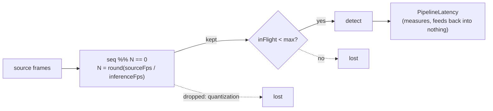
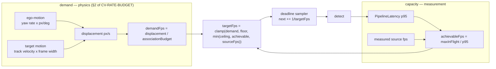

# CV rate control — close the loop, then widen the pipe

**Status:** R1–R3 done and measured, R4 done. 2026-08-12. Branch `feat/cv-rate-control`.
Results and their caveats live in `docs/conclusions/CV-RATE-BUDGET.md` §3 ("Re-measured"), which is
the authority; this file is the design record.
**Follows:** `docs/conclusions/CV-RATE-BUDGET.md` §6 items 1–2 (gap 1 + the ~25 ms overhead).
**Premise:** all three open latency items are one mechanism — the pipeline has *no rate control
loop at all*. It quantizes a fixed target to an integer frame stride, drops whatever does not
fit, and never learns what it actually achieved.

---

## 1. What is broken today

Three independent losses, none of them visible to the thing choosing the rate:

| # | Loss | Cause |
|---|---|---|
| L1 | **Quantization** | `everyNth = max(1, round(sourceFps / inferenceFps))` is an integer. A 24 fps source with `inferenceFps=10` can only ever sample at 12 or 8, never 10. |
| L2 | **Phase churn** | `sampleEveryNthFrame` is recomputed from a drifting EWMA *every frame*, and the test is `frame.sequence() % N`. When N flips 3→2 the hit set changes phase, so samples bunch and gap. |
| L3 | **Silent in-flight drops** | A sample that arrives while `maxInFlightInferences` are outstanding is discarded, uncounted. |

Measured consequence (`CV-RATE-BUDGET.md` §3): **effectiveFps 7.58 against a configured 10.**
Which of L1/L2/L3 dominates is *currently unknowable* — nothing counts them separately. Wave R1
makes that measurable rather than assumed.

## 2. Target design

**Association budget** (`CV-RATE-BUDGET.md` §2): for a box of width `w` px and an IoU
re-anchor threshold `t`, two observations still associate while the box moves less than

    d = w (1 - t) / (1 + t)

so the rate that keeps displacement inside the budget is `demandFps = displacement_px_per_s / d`.
This is the whole of "spend resources not to lose it", stated as an inequality instead of a
constant.

**Floor** is today's `effectiveInferenceFps()` — the operator's `inferenceFps`, or `followFps`
in FOLLOW. Adaptive rate may only ever *raise* the rate above what was asked for, never lower it,
so an operator who set a number still gets at least that number.

## 3. Waves

Disjoint file scopes, each ending with its scoped build green and MODULE.md updated.

### R1 — deadline sampler + sampling accounting
*Scope:* `vision-application/.../pipeline/`, `vision-api` DTO.

- Replace `frame.sequence() % sampleEveryNthFrame` with a **deadline**: sample the first frame at
  or after `nextSampleAtNanos`, then advance `nextSampleAtNanos = max(now, nextSampleAtNanos +
  intervalNanos)`. Kills L1 and L2 outright — every deadline is served by exactly one frame, so
  the achieved rate equals the target whenever the source is faster than the target.
- The `max(now, ...)` clamp is load-bearing: without it a stalled source builds a deadline debt
  that fires as a burst on recovery.
- **One clock read per frame.** `onNext` already reads `nanoTimeSource` once inside
  `recordArrivalAndRecomputeSampling`; the deadline must reuse that value, not read again. The
  test clock advances *per read* ("one read per frame") — a second read silently doubles every
  fake source's rate. This already bit once (`PipelineLatency`'s separate `latencyNanoSource`).
- New `DetectionRate` record + `DetectionRateWindow`, sibling to `PipelineLatency`: source fps,
  target fps, achieved fps, and the three drop counters (quantization is gone, so: `deadlinesMissed`,
  `droppedInFlight`, `droppedOutage`). Surfaced on `GET /api/streams/{id}/tracks` beside latency.

*Done when:* the 7.58 is explained by counters rather than by argument.

### R2 — adaptive rate controller
*Scope:* `vision-application/.../pipeline/DetectionRateController.java` (new), `StreamPipelineSettings`,
`vision-app` properties + `application.yaml`.

- New collaborator owning demand, capacity and target — `StreamPipeline` keeps only the deadline.
  Same extracted-collaborator shape as `DetectionExtrapolator` / `TrackBook` / `PipelineLatencyWindow`.
- Ego-motion term needs `cameraHfovDegrees`; **target-motion term does not** (`TrackRef` velocities
  are already normalized frame-widths/s). So the controller does something useful on a deployment
  that has never described its optics, and more once it has.
- Config: `vision.application.pipeline.adaptive-rate.{enabled,max-fps,ewma-alpha}`.

### R3 — BGR24 wire format
*Scope:* `adapters/adapter-cv-grpc/`, `vision-app` config.

`IMAGE_ENCODING_BGR24` already exists on the wire and cv-service already decodes it
(`inference/detector.py`); only the Java side unconditionally re-encodes to JPEG when it downscales.
Sending the downscaled frame raw removes a Java encode **and** a Python decode from every round trip.

- `vision.cv.wire-format: auto | jpeg | bgr24`, default **`auto`** = BGR24 when the endpoint is
  loopback, JPEG otherwise. A real decision rule, not a guess: 640x360 BGR24 is ~691 KB against
  ~40 KB of JPEG, which is free on loopback and wrong over a radio link.

### R4 — measure and record ✔
Ran the real path against a real cv-service and against a probe server. Headlines: **effectiveFps
9.998/10** with all three drop counters at zero; a **24 fps source asked for 10 now gets 10.002**
where the integer stride could only have given 12; **worst box age 208 ms → 144 ms**; BGR24 saves
~3 ms of median round trip and costs tail latency; and `wire-format` was confirmed *on the wire*
(691,200 bytes = 3 × 640 × 360), including that the shipped `auto` default resolves correctly with
no key set.

Two things the run is honest about rather than quiet about: the before/after round trips were taken
on **different sources** and are not comparable, and **R2 never engaged** — a `testsrc` pattern
contains nothing the detector detects, so no track existed to demand a higher rate. R2 is built and
unit-covered; its live effect is unmeasured. §5's standing lesson is that green tests are not an
outcome, and that applies to one's own work first.

One defect the live run did find, which no test would have: the demand EWMA decayed toward zero
geometrically and never arrived, so an idle stream reported `demandFps: 9.29e-38` on its API.

## 4. Non-goals

Gap 7 (auto-promote to FOLLOW) and gap 9 (tracker on-board) stay out. So do per-asset FOV and
MAVLink `ATTITUDE` decoding — R2 consumes yaw where it exists and degrades where it does not.
