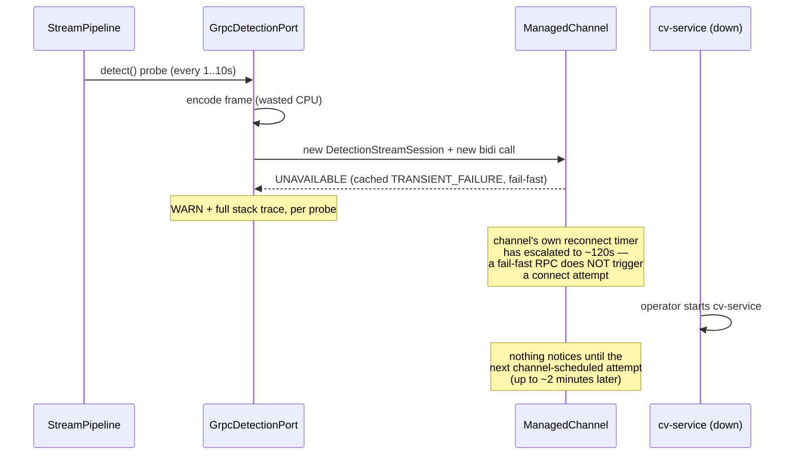
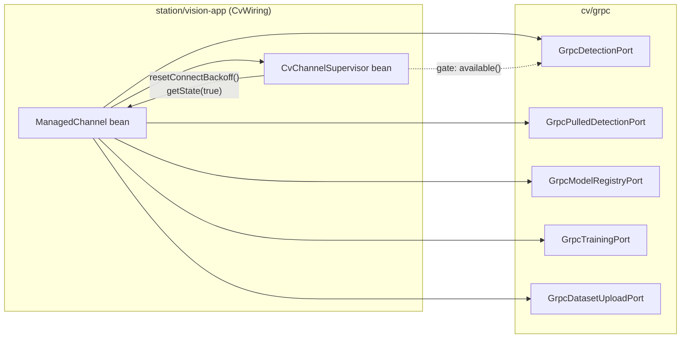
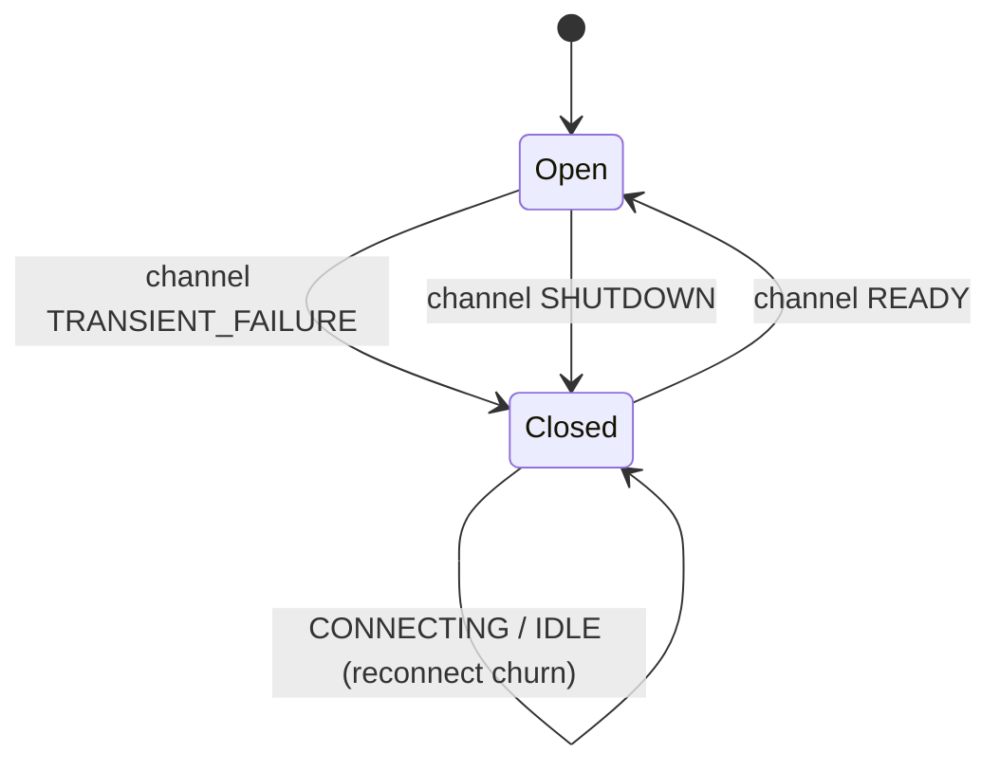

# CV-RECONNECT — bounded, consistent reconnect to cv-service

**Status:** active · **Branch:** `fix/cv-reconnect` · **Author:** architecture (Fable) · **Date:** 2026-08-15

Reported symptom: starting `cv-service` *after* `vision-app` produces a repeating
`UNAVAILABLE: io exception / finishConnect(..) failed: Connection refused` WARN with a full stack
trace per stream, and recovery once cv-service comes up is **inconsistent** — sometimes seconds,
sometimes minutes.

---

## 1. Root cause

Two supervisors exist. Neither owns the connection.

| Layer | What it supervises | Cadence | Where |
|---|---|---|---|
| `StreamPipeline` (vision-perception) | **inference calls** — outage state, single serialized probe, 1s→10s backoff, one `PIPELINE_ERROR` per outage | bounded, correct | `StreamPipeline#outageDecision`/`#onDetectionFailure` |
| gRPC `ManagedChannel` | **the TCP connection** — its own reconnect backoff | **1s → 120s escalating, uncapped by us** | grpc-java internals |
| — | **nobody** owns "keep the cv channel connected at a bounded cadence" | — | **the gap** |

The failure mode that follows:



Three separate defects fall out of that one gap:

1. **Unbounded recovery latency.** A fail-fast RPC issued while the subchannel is in
   `TRANSIENT_FAILURE` returns the cached failure *without* starting a connect attempt. Only the
   channel's own escalating timer reconnects, and after a few minutes of downtime that timer is at
   ~120s. Whether recovery takes 2s or 2min depends purely on where in that escalation cv-service
   happened to come up. **This is the inconsistency.**
2. **Log flood with no diagnostic value.** Every probe builds a fresh session and logs a full
   `AnnotatedConnectException` stack at WARN. The stack is identical every time and says nothing the
   one-line message doesn't.
3. **Wasted work per probe.** The frame is downscaled and JPEG-encoded *before* anything discovers
   the channel is down, and a fresh bidi call is allocated and torn down each time.

Non-defects, confirmed and deliberately left alone:
- `StreamPipeline`'s outage policy is correct — one probe in flight, one event per outage, capped
  backoff, video path untouched. It stays exactly as it is.
- The intended fallback ("video/telemetry keep running, boxes just don't appear",
  `docker-compose.yml` §resilience demo) is already the designed behaviour. Nothing here changes it.
- `DetectionStreamSession`'s per-session teardown is idempotent and already correct.

---

## 2. The fix — one owner for the connection

Introduce **`CvChannelSupervisor`**: one per `ManagedChannel`, the single owner of "is cv-service
reachable, and if not, keep trying at a cadence *we* choose".



The supervisor sits on the **channel**, not on a port, because the channel is shared by all five
cv-service ports. Everything that talks to cv-service benefits from one bounded reconnect loop.

### 2.1 Bounded reconnect

`io.grpc.ManagedChannel` (1.64.0) exposes exactly the two levers needed — verified against the
published API, no internal classes involved:

| API | Use |
|---|---|
| `notifyWhenStateChanged(state, callback)` | one-shot state watch, re-armed each transition |
| `getState(requestConnection)` | read state; `true` pulls an `IDLE` channel into `CONNECTING` |
| `resetConnectBackoff()` | **abandons the escalated timer and reconnects now** — the core fix |
| `enterIdle()` | not used; `resetConnectBackoff()` is sufficient and less disruptive |

While the channel is in `TRANSIENT_FAILURE` the supervisor calls `resetConnectBackoff()` on its own
capped backoff (`1s → 10s` default). Recovery latency stops depending on gRPC's escalation and
becomes **bounded by configuration**.

### 2.2 The gate — sticky-closed until `READY`



**The gate must open only on `READY`, never on `CONNECTING`.** Each reconnect attempt cycles
`TRANSIENT_FAILURE → CONNECTING → TRANSIENT_FAILURE`; a gate that reopened on `CONNECTING` would let
one probe through per cycle and reproduce the flood at a slower rate. `IDLE` and `CONNECTING` *before*
any observed failure are open — that is the cold-start path, and it must not be blocked.

While closed, `GrpcDetectionPort#detect` returns a **stackless** `CvUnavailableException` *before*
encoding the frame and *without* creating a session. `StreamPipeline` sees the same failed stage it
sees today, so its outage machinery is untouched — its probes simply become free.

### 2.3 Worst-case recovery, stated honestly

```
cv-service starts
  → ≤ vision.cv.reconnect.max-backoff   (10s)  supervisor forces a connect attempt → READY, gate opens
  → ≤ StreamPipeline detection-backoff  (10s)  next probe is let through and succeeds
  ────────────────────────────────────────────
  ≈ 20s bounded worst case, ~5s typical
```

Against today: unbounded, observed up to and beyond 2 minutes. The two backoffs are deliberately
**not** coupled — the adapter does not reach into a context module's private outage state.

---

## 3. Frozen contract

### 3.1 New — `cv/grpc`, package `com.drones.vision.adapter.cvgrpc`

| Type | Shape |
|---|---|
| `public final class CvChannelSupervisor implements AutoCloseable` | ctor `(ManagedChannel, GrpcCvSettings)`; `void start()` (idempotent); `boolean available()`; `ConnectivityState state()`; `Duration outageFor()`; `long reconnectAttempts()`; `void close()` |
| `public final class CvUnavailableException extends IllegalStateException` | stackless — `super(message, null, false, false)`; message names authority, state, outage duration, attempt count |

- The supervisor **never** shuts down the channel — channel lifecycle stays with whoever built it
  (`CvWiring`'s channel bean), matching this module's existing convention for every port except
  `GrpcDetectionPort`.
- One daemon thread, named `cv-channel-supervisor`, mirroring `DefaultTxScheduler`'s convention
  (`drone-link/mavlink-core`).
- `available()` is `false` iff the gate is closed (§2.2). It is *not* `state() == READY`.

### 3.2 Changed — `cv/grpc`

| Type | Change |
|---|---|
| `GrpcCvSettings` | **+3 fields**: `reconnectInitialBackoff`, `reconnectMaxBackoff`, `outageLogInterval`. Defaults `1s` / `10s` / `60s`. Compact-ctor validated like every existing `Duration` field. Existing fields and defaults unchanged. |
| `GrpcDetectionPort` | **+1 constructor** `(ManagedChannel, GrpcCvSettings, CvChannelSupervisor)`. The existing two-arg constructor keeps today's behaviour exactly (no gate) so every existing test and call site is unaffected. When a supervisor is present, `detect(...)` checks `available()` **first** — before `codec.encode` and before `sessions.computeIfAbsent`. |
| `DetectionStreamSession` | `onTransportError` logs **message + gRPC status at WARN, full stack at DEBUG**. A connection-refused stack is identical every time and carries no information the message lacks. Message reworded to "will retry with backoff" (the old "will reopen on next detect()" is no longer what happens). No behavioural change to teardown. |

### 3.3 Changed — `station/vision-app`

| File | Change |
|---|---|
| `VisionCvProperties` | nested `Reconnect(boolean enabled, Duration initialBackoff, Duration maxBackoff, Duration outageLogInterval)` → `vision.cv.reconnect.*`, defaults `true` / `1s` / `10s` / `60s` |
| `CvWiring` | new `@Bean(initMethod = "start", destroyMethod = "close") CvChannelSupervisor` on the shared channel; `detectionPort` takes it via `ObjectProvider` and uses the 3-arg constructor when `reconnect.enabled` |
| `application.yaml` | document the four new keys in the existing `vision.cv.*` block |

`vision.cv.reconnect.enabled=false` must restore today's exact behaviour — the escape hatch.

### 3.3a Folded in — two properties `CvWiring#cvGrpcChannel` silently ignores

Not caused by this work, but in the exact six lines R2 rewrites, and both are the same class of
defect: a documented `vision.cv.*` knob that does nothing.

1. **`vision.cv.plaintext` is ignored — a config lie with a security flavour.** `GrpcCvSettings`
   carries it, `application.yaml:219` documents it as *"whether the host/port channel skips TLS"*,
   and `GrpcDetectionPort#buildChannel` honours it — but the channel vision-app actually uses is
   built in `CvWiring#cvGrpcChannel`, which calls `.usePlaintext()` **unconditionally**. An operator
   setting `plaintext: false` to get TLS keeps an unencrypted connection and gets no warning.
   **Fix:** call `.usePlaintext()` only when `settings.plaintext()`. Default stays `true`, so default
   behaviour is byte-identical.
   **Honest limit:** this makes the knob *truthful*, not *complete* — `plaintext: false` yields the
   JDK default trust chain, which will not validate a self-signed cv-service certificate. Custom
   trust material is a separate concern and is not in this wave.
2. **Sub-second keepalive truncates to zero.** `cvGrpcChannel` passes
   `settings.keepAliveTime().toSeconds()` where `GrpcDetectionPort#buildChannel` passes
   `.toMillis()`; a `keepalive-time: 500ms` becomes `0`. **Fix:** use millis in both, matching the
   adapter.

### 3.4 Explicitly out of scope

- **No change to `StreamPipeline`** or anything in `contexts/`. Its outage policy is correct.
- **No CV status endpoint / UI badge.** The absence of an honest "cv reachable" signal is a real gap
  (documented at `AssetAttention:14-23`; `PIPELINE_ERROR` reaches SSE but nothing renders it), and
  `CvChannelSupervisor` is precisely the read model that would close it — but that is a REST + web
  wave, not this one. Recorded as follow-on **R3**.
- **No in-JVM fallback detector.** "Fallback" here means degrade-and-recover, not a second detector.

---

## 4. Waves (disjoint file scopes)

| Wave | Scope | Agent | Files | Status |
|---|---|---|---|---|
| **R1** | supervisor, exception, settings, gate, log demotion, tests, MODULE.md | adapter-builder (Sonnet) | `cv/grpc/**` only | **done** — 118/118 |
| **R2** | properties, wiring, application.yaml, MODULE.md | spring-integrator (Sonnet) | `station/vision-app/**` only | **done** — 245/245 |
| **R3** | *follow-on, not built here* — `GET /api/cv/status` + live badge | — | `station/vision-api/**`, `station/vision-web/**` | open |

R1 must land and `./mvnw -B -pl cv/grpc install` be green before R2 starts (R2 compiles against R1's
new types).

### 4.1 Outcome

`./mvnw -B -pl cv/grpc,station/vision-app test -DskipWeb` — **BUILD SUCCESS**, both modules green
together (verified after R1's review fixes landed, i.e. not merely each wave green in isolation).

**Two correctness findings caught in review of R1**, both fixed and regression-tested:

1. The class javadoc's state machine claimed `OPEN --SHUTDOWN--> CLOSED`, but `case SHUTDOWN` returned
   without touching the gate — so a shut-down channel left `available()` stuck `true`, and an
   in-progress reconnect chain kept calling `resetConnectBackoff()` on a dead channel. Reachable in
   production because `CvWiring` declares `detectionPort` with `destroyMethod = ""`, so
   `GrpcDetectionPort#close()` never runs and its own `closed` flag never short-circuits.
2. `start()` armed `notifyWhenStateChanged(initial, …)` without applying the transition logic to
   `initial` itself. Since that callback only fires when the state moves *away* from `initial`, a
   supervisor started against an already-`TRANSIENT_FAILURE` channel left the gate open indefinitely.

Both were fixed by extracting one `applyTransition(ConnectivityState)` used by `start()` and
`onStateChange()` alike, plus an `onShutdown()` that closes the gate and orphans the chain.

**One deviation from this plan's own §3.1**, accepted: the spec called for a stackless exception via
`super(message, null, false, false)`. That does not compile — `IllegalStateException` does not
re-declare `RuntimeException`'s four-arg constructor, and a subclass may only chain to constructors
its immediate superclass declares. `CvUnavailableException` overrides `fillInStackTrace()` instead,
the standard technique, with identical observable behaviour (zero stack frames).

## 5. Acceptance

1. `./mvnw -B -pl cv/grpc test` green; `./mvnw -B -pl station/vision-app test` green.
2. **Manual, the reported scenario**: start `vision-app` with `vision.cv.enabled=true` and no
   cv-service; observe **one** WARN per outage (not one per probe) and a periodic INFO heartbeat;
   start cv-service; detection resumes within ~20s, with an INFO naming the outage duration.
3. `vision.cv.reconnect.enabled=false` reproduces today's behaviour.
4. Both MODULE.md files updated.
