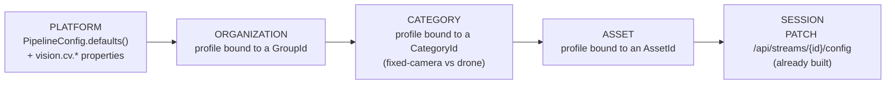

# CV-SETTINGS-PLAN — CV settings that survive a browser, a model registry that remembers

Status: **W1–W8 MERGED to master 2026-08-30 (829c864d)**. Ledger/handoffs/deviations in [CV-SETTINGS-CONTEXT.md](CV-SETTINGS-CONTEXT.md). All §8 defaults accepted; train-start gate relaxed to `canManageOrg`; no fork endpoint (client copies); explicit stream-start overrides folded at the API layer.
`feat/warehouse-ux` @ `829ac48a` (max Flyway **V28**, five-group rail with a **Vision** group already
live). Owner: CV control plane.

**Ask (verbatim):** *"Computer vision settings. Let's think how to make it better, have some better
settings, models, ability to train, filter assets and so on. It's one of core features, and it should
be enhanced and made better."*

Read first — this is a mature area and nothing below restarts it:
[CV-CONTROL-PLAN](../done/CV-CONTROL-PLAN.md) (live PATCH contract, model roster),
[CV-DEMAND-PLAN](../done/CV-DEMAND-PLAN.md) (two gates), [CV-CLEAN-FEED-PLAN](../done/CV-CLEAN-FEED-PLAN.md)
(deny-list, one drawer), [CV-UX-RESEARCH](../done/CV-UX-RESEARCH.md) (15 controls, 6 answerable),
[CV-PANEL-SPLIT-PLAN](../done/CV-PANEL-SPLIT-PLAN.md) (panel + setup modal),
[CV-TRAINING-PLAN](../done/CV-TRAINING-PLAN.md) + [-V2](../done/CV-TRAINING-V2-PLAN.md) (the shipped loop),
[UX-DESIGN §4/§5.4](../../main/UX-DESIGN.md) (the tier model this plan finally lands server-side).

---

## 0. The one-sentence diagnosis

Every *live* CV knob is real, honest and already hot-swappable — and **not one persisted setting
exists**: the page called *Detection defaults* is `localStorage` on one browser, so a fleet has no
CV configuration at all, no asset knows what it should look for, and the model registry is a
pass-through list of filenames with no version, metrics, provenance or rollback.

---

## 1. Audit — what the operator has today

### 1.1 Every control, where it lives, and what it actually reaches

| # | Control | Surface | Reaches | Real scope |
|---|---|---|---|---|
| 1 | Detect on/off (hero) | Vision drawer `features/fly/cv-control-panel.html:14` | `PATCH /api/streams/{id}/config` | per-stream ✅ |
| 2 | Model ("Looking for" intent cards) | setup modal `cv-setup-modal.html:32-63` | PATCH `{model}` **+ localStorage draft** | per-stream + browser |
| 3 | Confidence slider | modal `:78-86` | debounced PATCH **+ localStorage** | per-stream + browser |
| 4 | Detector-floor fps | modal `:268-276` | debounced PATCH **+ localStorage** | per-stream + browser |
| 5 | Class allow-list (staged, Submit) | modal `:101-184` | PATCH `{labelFilter}` **+ localStorage** | per-stream + browser |
| 6 | Class hide chips (deny-list) | strip `shared/player/detections-strip.ts:91` + modal | PATCH `{labelDenyFilter}` **+ localStorage** | per-stream + browser |
| 7 | Tracking mode Off/Associate/Follow | modal `:196-225` | PATCH `{tracking.mode}` | per-stream ✅ |
| 8 | Tracking engine | modal `:306-318` | PATCH `{tracking.engineId}`; list `GET /api/cv/trackers` | per-stream ✅ |
| 9 | Capability ceiling L1–L5 | modal `:288-296` | PATCH `{tracking.capabilityLevel}` | per-stream, **no readback** |
| 10 | Re-verify cadence / follow fps | modal `:325-345` | PATCH `{tracking.*}` | per-stream, **no readback** |
| 11 | Follow lock / Release / click-a-box | panel `:90`, `cockpit-facade.ts:818` | PATCH `{tracking.lock}` | per-stream ✅ |
| 12 | Boxes / declutter (All·Priority·Locked·Off) + `B` | panel `:68-78`, `live.html:75-86`, `wall-tile.html:38-47` | **nothing** | in-memory, **three unshared copies** |
| 13 | Profile cards + model + confidence + fps + save/delete | `/settings/detection` (whole page) | **nothing** — `localStorage['vision.settings.v1']` | one browser |
| 14 | Base model + epochs + Start training | `/manage/training/:id` | `POST /api/datasets/{id}/train` | deployment-global |
| 15 | Promote | `/manage/training/models` | `POST /api/cv/registry/models/{id}/promote` | deployment-global |

### 1.2 The honesty ledger

| Defect | Evidence |
|---|---|
| **H1 — "Detection defaults" is a browser preference.** The page's own notice says a change "reaches every stream anyone starts"; `detection-settings-facade.ts:27-28` injects only `SettingsStore` + `FleetStore` and issues **zero** HTTP. `docs/extracts/design/11-settings.md` designed it as "fleet-wide operational defaults". Two operators on two laptops run two different fleets. | `core/settings/settings-store.ts:159,330-342` |
| **H2 — every in-flight knob dual-writes the global draft.** Hiding `person` on drone A's stream changes the *default* for drone B's next start. There is no per-asset scope anywhere. | `cv-setup-modal.ts` `applyHotKnob` |
| **H3 — two model rosters that need not agree.** `GET /api/cv/models` is a hand-maintained `List<CvModelResponse>` bean literal (`CvWiring.java:273`), `@OpenByDesign`; `GET /api/cv/registry/models` is what cv-service actually has. A promoted model never reaches the picker; a picker entry the worker lacks falls back silently. `GET /api/cv/trackers` is the same shape (`TrackingWiring.java:108`). | `CvModelsController.java:13-27`, `ModelRegistryController.java:62` |
| **H4 — the registry throws away what the wire already carries.** `ModelInfo{id, version, stage, metrics}` arrives from `Training.ListModels`; domain `ModelRef(id, version)` drops `stage` and `metrics`, so `RegisteredModelResponse{id, version, active}` is all an operator sees. | `cv/grpc/MODULE.md:38` |
| **H5 — the whole Vision rail group 404s out of the box.** `vision.training.enabled=false` removes `ModelRegistryPort`/`ModelRegistryService` *and* the controllers; `vision.cv.enabled=false` leaves `DetectionPort` a no-op. Two of three Vision entries land on "not enabled here". | `TrainingWiringConfiguration.java:112-158`, `application.yaml:286-291, 802` |
| **H6 — expert knobs with no readback.** Capability ceiling, re-verify cadence and follow fps reset to seed values every time the modal reopens, although `GET /api/streams/{id}/config` returns the running tracking config. | `cv-setup-modal.ts:107-115`, `StreamController.java:290` |
| **H7 — training metrics evaporate.** `TrainingProgress.map50` streams per epoch into an in-memory `TrainingJobView` capped at 50 finished jobs; nothing is persisted, so a promoted model cannot say what it scored or which dataset made it. | `vision-learning/MODULE.md` |
| **H8 — dead controls.** `LiveFacade.onConfidence/onFps/onModel` (`live-facade.ts:290-300`) are bound by no template. | — |
| **H9 — the alert rule is unreachable.** `EventRuleConfig` (which labels open a `DetectionEvent`, at what confidence, with what debounce) comes only from `PipelineConfig.defaults()` — `{person, car}` @ 0.5, N=3, 5 s. It has no property, no DTO field, no PATCH, no UI. Every deployment alerts on people and cars, forever. | `domain/model/EventRuleConfig.java:27` |
| **H10 — training needs `canAdminister`.** `POST /api/datasets/{id}/train` and promote both require `UNBOUNDED`; a group manager can build and label a dataset but cannot train it. | `TrainingJobController.java:80` |

### 1.3 The model catalogue as it exists

Roster is **discovered from disk at startup** (`cv_service/inference/registry.py#discover_roster` globs
`CV_MODEL_DIR` for `*.pt` and `*_openvino_model/`), never hardcoded.

| id (the wire value) | Size | Role | Runtime reality |
|---|---|---|---|
| `yolo26n.pt` | 5.5 MB | **default** (`CV_MODEL`, and `PipelineConfig.defaults()`) | plain PyTorch CPU ≈ 230 ms/frame on GB4005 |
| `yolo11n.pt` | 5.6 MB | the one the Docker image exports | **only** model with a baked OpenVINO IR → 135–150 ms |
| `orion12l.pt` | 53 MB | military vehicles (user-provided) | ~5–6× slower; "not real-time" per `DEPLOY-GPU.md` |
| `yoloe-26s-seg-pf.pt` | 33 MB | open-vocab, ~4585 classes incl. buildings | seg checkpoint, masks dropped; ~2× `yolo26n` |
| `<datasetId>-50e.pt` | 5.3 MB | a fine-tune artifact already sitting there | registered live by `ModelRegistry.register` |

Selection: `FrameRequest.model_id` per frame; a comma-separated id runs a **composite** and prefixes
labels `"{model}:{label}"`. `model_version` is sent, echoed and **never read**. Promotion writes
`active_model.json` and swaps the in-process default — no restart. Three things are **not on the wire
at all**: a class/prompt list, `iou`, `max_det`. Class filtering is therefore Java-side only —
the model infers everything every frame regardless of the filter.

**Intel-only, no CUDA, and the code is honest about it:** `CV_DEVICE` is deliberately left unset so
Ultralytics auto-selects (`Dockerfile:136-142` — OpenVINO's `CPU/GPU/AUTO` strings are a different
namespace and setting one "would be misleading"); `pyproject.toml` INVARIANT P1 forbids anything
CUDA-only in the `cv` extra; `trainer.py:147-169` warns once that CPU training is slow. **No
iGPU/NPU path exists.** An OpenVINO IR has its input size baked at export, so `yolo export imgsz`
must equal runtime `CV_IMGSZ`.

---

## 2. Four perspectives — what each one wants

| Perspective | Wants | Gets today | Gap |
|---|---|---|---|
| **Operator in flight** | few, fast, safe: detect on, what am I looking for, hide that class, follow that target | exactly this, and it is good (CV-PANEL-SPLIT shipped the tiering) | the same acts silently rewrite the *global* default (H2); declutter is lost on every navigation (12) |
| **Enterprise / admin** | fleet-wide defaults that outlive a laptop, who may change what, which models are approved, which classes raise an alert, an audit of promotions | one `canAdminister` gate on promote and nothing else | no persisted setting at all (H1); no model governance (H4); no per-group default; the alert rule is hardcoded to `{person, car}` (H9) |
| **Data / ML** | dataset → train → **evaluate** → promote → **roll back**, with metrics side by side | capture (live+replay) → label → one-button train → promote, all real | metrics not persisted (H7); no provenance from model back to dataset; no rollback; three route trees with no shared nav; training itself needs `canAdminister`, so the person who labels cannot train (H10) |
| **The asset itself** | *"I am a fixed mast camera; I want people and vehicles at 2 fps forever. That drone's gimbal wants everything at 10 fps while it flies."* | nothing — an asset carries no CV intent | no per-asset or per-category profile; "which assets run CV" is unanswerable fleet-wide |

**"Filter assets"** decomposes into two questions the platform cannot answer: *which assets run CV at
all* (today: whoever last toggled a stream, plus the demand gate), and *which classes matter for this
asset* (today: whatever is in one browser's localStorage).

---

## 3. Target design

### 3.1 The hierarchy — most specific wins, resolved once at stream start



| Level | Stored | Written by | Lifetime |
|---|---|---|---|
| Platform | code + `application.yaml` | deployer, boot | forever |
| Organization / Category / Asset | **Postgres `cv_profiles` + `cv_profile_bindings`, read through an in-process snapshot cache** | `canManageOrg` | until changed |
| Session | in-memory on the running `StreamPipeline` | the pilot | the stream |

Rules, frozen:
1. **Resolution happens once, at `start`.** The resolver produces one `PipelineConfig`; from that
   moment the existing live-PATCH machinery owns the stream. Nothing re-resolves mid-flight.
2. **A session PATCH never writes upward.** Making a live value the new default is an explicit,
   audited act (*Save to this asset's profile*), never a side effect. This deletes H2.
3. **Behavior-preserving by construction, no feature flag.** The migration seeds built-in profiles
   and **zero bindings**; with no binding the resolver returns exactly today's
   `PipelineConfig.defaults()` merged with `vision.cv.detection-default-enabled`. Every existing test
   stays green without a flag to remember to flip.
4. **Category is the "camera kind" axis.** `CategoryId` is already a data-driven kebab slug on every
   asset — reuse it rather than inventing a device-type taxonomy (`DeviceType` was deleted for a reason).

**Ownership:** the profile is a **perception** concept (it produces a `PipelineConfig`). It stores a
model **id string**, never a foreign key into learning's registry — `vision-learning → vision-perception`
is the only legal direction, and `ContextArchitectureTest#noContextImportsAnotherContextsRepositoryPort`
forbids the read back. The picker composes the two lists at the **API** layer, which may read both.

**Cache** (CLAUDE.md rule 1): `CvProfileCache` in `perception.application` — a `volatile` immutable
snapshot of all profiles + bindings, rebuilt write-through on every mutation and on a TTL
(`vision.cv.profiles.cache-ttl`, default `60s`). No Caffeine, no Redis, no Spring Cache — none exists
in this tree and one node is the deployed shape. Cross-node invalidation is named as deferred to
DOMAIN-SEPARATION W2's broker, not faked.

> **2026-09-13 — corrected by CV-ORCHESTRATION-PLAN.md wave W7 (decision E22, "a profile is a
> patch"):** the fold across Organization → Category → Asset above was, until this wave,
> **wholesale-per-tier** — a `CvProfile` carried no per-knob inherit value, so a tier either supplied
> every knob or none of them, and `sources`/`intent` could not survive a reload (W2's own "As built"
> note recorded this as a known gap, deferred to this schema decision). W7 makes every knob on
> `CvProfile`/`CvProfileRequest`/`CvProfileTracking` independently optional — `null`/absent means
> "leave this knob unset, inherit from the tier below" — so the fold above is now genuinely per-knob:
> an asset-tier profile that only overrides `confidenceThreshold` still inherits `model`/`labelFilter`/
> tracking from whichever lower tier last set them, rather than being forced to restate the whole
> record. `intent` (§4.7) is now persisted on the profile itself and resolved by `CvProfileResolver`
> **at fold time**, not at request/save time — `IntentPolicyResolver` seeds `model`/`labelFilter`/
> `confidenceThreshold`/`inferenceFps` for whichever knobs the matched tier still leaves unset. Every
> read (not only the response to a save) now reports real per-knob provenance —
> `KnobSources`/`CvKnobSourcesResponse`, one of `ASSET`/`CATEGORY`/`ORGANIZATION`/`PLATFORM`/`INTENT`
> per knob — on `EffectiveCvProfileResponse#sources`, replacing the old save-time-only, 2-field
> `CvProfileResponse.Sources` for that purpose (kept, unchanged, only for the stream-config hot-knob
> PATCH response, which has its own separate, narrower provenance need). See
> `docs/plans/active/CV-ORCHESTRATION-CONTEXT.md`'s 2026-09-13 W7 status-log entry for the full
> wave breakdown (migration, resolver, DTOs, web editor, Tuning modal).

### 3.2 The model registry

`RegisteredModel(ModelRef, boolean active)` becomes a **joined** read model: worker truth ∪ platform
governance. The cheap part: `ModelInfo{id, version, stage, metrics}` is **already on the wire** and
merely dropped in Java — no proto change is needed for stage or metrics.

| Field | Source | Note |
|---|---|---|
| `id`, `version` | worker `ListModels` | version is `""` today; `"latest"` sentinel stays |
| `availability` | computed | `PRESENT` \| `MISSING_ON_WORKER` — never silently substitute |
| `displayName`, `kind`, `openVocab`, `defaultLabelFilter` | platform row (seeded from today's config list) | keeps the picker's copy |
| `taskType` | platform row | `DETECT` \| `SEGMENT` \| `OPEN_VOCAB` |
| `classes` | platform row | closed-set rosters only; open-vocab stays empty by design (CV-CONTROL §4) |
| `runtime` | platform row | `PYTORCH` \| `OPENVINO` — the honest speed signal |
| `status` | platform row | `DRAFT` \| `CANDIDATE` \| `LIVE` \| `RETIRED`; exactly one `LIVE` |
| `metrics` | training run, or worker `ModelInfo.metrics` | labelled **training mAP50, not a held-out evaluation** |
| `provenance` | training run | `datasetId`, `trainingRunId`, `baseModel`, `epochs`, `trainedAt` |

`promote` sets `LIVE` and demotes the previous to `RETIRED`, recording it so **rollback is one call**.
A finished `SUCCEEDED` job writes a `CANDIDATE` row — **never** an automatic `LIVE`.

### 3.3 The training loop as the operator sees it

```
Capture (live | replay) → Correct → Dataset → Train → Evaluate → Promote ⇄ Rollback
   BUILT        BUILT      BUILT     BUILT    NEW: run row     BUILT      NEW
                                              persisted with
                                              final metrics
```
Only two links are new, and both are storage, not new machinery: persist the run
(`cv_training_runs`) and persist the model it produced (`cv_models`, `CANDIDATE`, with provenance).
The three route trees gain one shared sub-nav so a dataset → its run → its model is walkable.

### 3.4 Class filtering, priority tiers, presets

- The allow/deny split stays exactly as CV-CLEAN-FEED froze it; a profile simply *persists* both sets
  per asset. State the drop-everywhere truth once, as today.
- **Priority tiers T0–T3 stay a pure client heuristic** (`detection-overlay-logic.ts:882-1064`) —
  correct, and no server concept is invented for them. The declutter level becomes one shared,
  persisted view preference instead of three unshared in-memory signals.
- Built-in profiles seeded by the migration (`built_in`, not editable, forkable):
  `people-vehicles` (`yolo26n.pt`, conf .40, 10 fps, ASSOCIATE) · `wide-search`
  (`yoloe-26s-seg-pf.pt`, conf .30, 4 fps) · `military-vehicles` (`orion12l.pt`, conf .45, 5 fps) ·
  `video-only` (`detectionEnabled=false`). This finally lands UX-DESIGN §4's *"presets should be named
  domain objects, stored and assignable to many devices"*.

### 3.5 Honesty rules (enforced in review)

1. A control with no backend effect is not shown under "settings" — view-only controls live in a
   **View** group and say so.
2. A page that says "defaults" writes server-side, or it does not use the word.
3. A knob without readback is either given readback or removed (H6 is fixed by *reading*
   `GET /api/streams/{id}/config`, not by a new endpoint).
4. A model the worker does not have reads `Missing on worker` — never a silent fallback.
5. Metrics say which kind they are; training mAP is not called an evaluation.

---

## 4. UI after the change

Rail **Vision** group goes 3 → 4 entries; `/settings` loses its *Detection defaults* link (manager
rail 18 → 19). No new top-level group: Vision already exists (WAREHOUSE-UX §3.1) and this is the
group's own subject.

| Entry | Route | Contents |
|---|---|---|
| **Vision defaults** *(new)* | `/vision/profiles` | profiles CRUD, bindings, fleet coverage table. Replaces `/settings/detection` (redirect) |
| CV model registry | `/manage/training/models` | rows gain version · status · runtime · metrics · provenance · availability; Promote + **Roll back** |
| CV training | `/manage/training` | unchanged flow + a run-history list with persisted metrics |
| Geo regions | unchanged | — |

```
/vision/profiles                                      VISION · Defaults
┌─────────────────────────────────────────────────────────────────────┐
│ Profiles                                            [+ New profile] │
│ ┌─ people-vehicles  built-in ──────────────────────────────────────┐│
│ │ yolo26n.pt · conf 0.40 · 10 fps · tracking Associate · detect ON ││
│ │ bound to: Organization (default) · 2 categories · 3 assets       ││
│ └──────────────────────────────────────────────────────────────────┘│
│ ┌─ wide-search  built-in ──┐ ┌─ mast-cams  custom ─────────────────┐│
│ │ yoloe-26s · 0.30 · 4 fps │ │ yolo26n · 0.35 · 2 fps · hide: tree ││
│ └──────────────────────────┘ └─────────────────────────────────────┘│
├─────────────────────────────────────────────────────────────────────┤
│ Coverage — what CV will do on each asset                            │
│ Asset          Category      Profile          From        Detect    │
│ Mast North     fixed-camera  mast-cams        asset       ON        │
│ Bravo-2        quadcopter    people-vehicles  category    ON        │
│ Rover-1        rover         video-only       organization OFF      │
│ Sim Alpha      simulated     people-vehicles  platform    OFF       │
└─────────────────────────────────────────────────────────────────────┘
```

```
/fly — Vision drawer (unchanged shape, one line added, no dual-write)
┌─ Vision ───────────────────────────────────────── ✕ ┐
│ [ ●— ] Detect on this stream    9.9/s · 3 classes    │
│ Looking for: People & vehicles  fast     [Change…]   │
│ From profile "people-vehicles" (asset)               │ ← NEW: says where it came from
│ Boxes  [All][Priority][Locked][Off]  (B)             │ ← VIEW group, shared + persisted
│ [Following #12 · Release]                            │
│ [Detection setup…]   ┌ in the modal footer ─────────┐│
│                      │ [Save these to this asset]   ││ ← the only upward write, audited
└──────────────────────└──────────────────────────────┘┘
```

The setup modal **keeps** live model/confidence/classes/tracking-mode (real in-flight acts) and
**stops** writing `SettingsStore`. Capability ceiling, tracking engine and the two cadences move to
`/vision/profiles` under Expert — they are fleet-admin knobs, exactly as CV-UX-RESEARCH §1 diagnosed.

---

## 5. Frozen wire contract

Field names mirror the existing stream DTOs **exactly** (`StartStreamRequest` /
`UpdateStreamConfigRequest` / `StreamConfigResponse`) so one TS type serves both.

### 5.1 `CvProfile` JSON (the shape returned and accepted everywhere)

```json
{ "id": "…uuid…", "name": "mast-cams", "description": "Fixed masts, low rate",
  "builtIn": false, "groupId": "…uuid…",
  "model": "yolo26n.pt", "confidenceThreshold": 0.35, "inferenceFps": 2,
  "labelFilter": [], "labelDenyFilter": ["tree"], "detectionEnabled": true,
  "tracking": { "mode": "ASSOCIATE", "engineId": "", "capabilityLevel": 0,
                "verifyEveryMillis": 2000, "followFps": 15 },
  "eventRule": { "labels": ["person","car"], "confidenceThreshold": 0.5,
                 "consecutiveToOpen": 3, "absenceToCloseSeconds": 5 },
  "createdAt": "…", "updatedAt": "…" }
```
`eventRule` is in the profile because H9 is real: today every deployment alerts on `{person, car}`
with no way to say otherwise. It is **not** added to `PipelineConfigPatch` — the event engine is
built once at `start` (CV-CONTROL §A, still true), so it is a start-time value only. Say so in the UI.
`maxInFlightInferences` is deliberately **not** a profile field — host capacity, stays a property.

### 5.2 Endpoints

| Method + path | Body → Response | Gate | Codes |
|---|---|---|---|
| `GET /api/cv/profiles` | → `{"profiles":[CvProfile]}` | authenticated, group-filtered | 200 |
| `POST /api/cv/profiles` | `CvProfile` (no id) → `CvProfile` | `canManageOrg` | 201 · 400 · 403 |
| `PUT /api/cv/profiles/{id}` | `CvProfile` → `CvProfile` | `canManageOrg` | 200 · 400 · 403 · 404 · **409 built-in** |
| `DELETE /api/cv/profiles/{id}` | → — | `canManageOrg` | 204 · 403 · 404 · **409 still bound** |
| `PUT /api/cv/bindings` | `{"scopeKind":"ASSET\|CATEGORY\|ORGANIZATION","scopeId":"…","profileId":"…"}` → same | `canManageOrg` | 200 · 400 · 403 · 404 |
| `DELETE /api/cv/bindings?scopeKind=&scopeId=` | → — | `canManageOrg` | 204 · 403 · 404 |
| `GET /api/cv/profiles/effective?assetId=` | → `{"assetId","profileId","profileName","source":"ASSET\|CATEGORY\|ORGANIZATION\|PLATFORM","config":{…CvProfile config fields…}}` | scope-checked on the asset | 200 · 403 · 404 |
| `GET /api/cv/coverage` | → `{"assets":[{"assetId","name","categoryId","profileId","profileName","source","detectionEnabled","model","labelFilter","labelDenyFilter"}]}` | group-filtered | 200 |
| `GET /api/cv/models` **(widened)** | → `{"source":"registry\|config","models":[CvModel]}` | `@OpenByDesign` (unchanged) | 200, never errors |
| `POST /api/cv/registry/models/{id}/promote` **(widened response)** | `{"version"}` → `{"id","version","status":"LIVE","previousModelId","previousVersion"}` | `canAdminister` | 200 · 403 · 409 |
| `POST /api/cv/registry/rollback` **(new)** | — → same shape | `canAdminister` | 200 · 403 · **409 no previous** |
| `GET /api/cv/training/runs` · `/{runId}` **(new)** | → `{"runs":[TrainingRun]}` | `canManageOrg` | 200 · 404 |
| `GET /api/cv/registry/models` | **DELETED** — folded into `GET /api/cv/models` | — | — |

`CvModel` (one roster, replacing both):
```json
{ "id": "yolo26n.pt", "version": "latest", "displayName": "People & vehicles",
  "kind": "general", "openVocab": false, "defaultLabelFilter": [],
  "taskType": "DETECT", "runtime": "PYTORCH", "classes": [],
  "status": "LIVE", "availability": "PRESENT",
  "metrics": { "map50": 0.71, "kind": "TRAINING" },
  "provenance": { "datasetId": null, "trainingRunId": null, "baseModel": null, "epochs": null, "trainedAt": null } }
```
`TrainingRun`: `{ "runId","datasetId","datasetName","baseModel","epochs","state","epoch","totalEpochs",
"loss","map50","outputModelId","startedAt","finishedAt","startedBy" }`.

### 5.3 Persistence

| Migration | Tables |
|---|---|
| **`V29__cv_profiles.sql`** (perception) | `cv_profiles(id, name, description, built_in, group_id, model, confidence_threshold, inference_fps, label_filter jsonb, label_deny_filter jsonb, detection_enabled, tracking jsonb, created_at, updated_at)`; `cv_profile_bindings(scope_kind, scope_id, profile_id, created_at, PRIMARY KEY(scope_kind, scope_id))`. Seeds the four built-ins and **no bindings**. |
| **`V30__cv_model_registry.sql`** (learning) | `cv_models(model_id, version, display_name, kind, open_vocab, default_label_filter jsonb, task_type, runtime, classes jsonb, status, metrics jsonb, dataset_id, training_run_id, base_model, epochs, trained_at, promoted_by, promoted_at, created_at, PRIMARY KEY(model_id, version))`; `cv_training_runs(run_id, dataset_id, base_model, epochs, state, epoch, total_epochs, loss, map50, output_model_id, started_by, started_at, finished_at, message)`. |

Version numbers are pinned here so the two waves cannot collide. Max on this branch is **V28**.
Two schema conventions this repo already keeps and these migrations must too: **no cross-entity
foreign keys anywhere**, and list-shaped columns are `jsonb` (as `datasets.classes` and
`detection_results.detections` already are).

### 5.4 cv-service / proto

**No proto change and no Python change.** `ModelInfo.stage` and `ModelInfo.metrics` already exist and
are merely dropped Java-side; `ModelRegistry.register`/`promote` already work live without a restart.
Passing a class list to the worker (text-prompted YOLOE, the only real inference-cost lever) would
need a new `FrameRequest` field and Python work — named as deferred in §7, not smuggled in.

### 5.5 Wiring change

`ModelRegistryPort` / `ModelRegistryService` / the models controller move out from behind
`vision.training.enabled` to **`vision.cv.registry.enabled`, defaulting to `vision.cv.enabled`** — the
model catalogue is an inference concern, not a training one. Same default-off behavior as today; H5
narrows from "two of three Vision entries are dead" to "the training entry needs its own flag".

---

## 6. Waves — disjoint file scopes

Sequencing: **W1 ‖ W4** start together; **W2** needs W1; **W3** needs W1+W4 ports; **W5** needs W2+W4;
**W6** runs in parallel against the frozen contract; **W7/W8** serialize after W6 (shared web files).
Every wave ends independently green with its scoped build and its `MODULE.md` updated. Never run a
reactor-wide build.

| # | Agent | Scope | Result | Verify |
|---|---|---|---|---|
| **W1** | domain-modeler | `contexts/vision-perception/**/domain/**` | `CvProfile` (reusing the existing `ModelRef`, `TrackingConfig`, `EventRuleConfig` value objects — no parallel types), `CvProfileId`, `CvProfileBinding`, `BindingScope{ORGANIZATION,CATEGORY,ASSET}`, `CvProfileRepositoryPort`; compact-ctor validation; `CvProfile#toPipelineConfig(PipelineConfig defaults)` as a pure fold | `./mvnw -B -pl contexts/vision-perception test` |
| **W2** | application-service | `contexts/vision-perception/**/application/profile/**` | `CvProfileService`/`Default…` (CRUD + `canManageOrg` + audit), `CvProfileResolver` (asset→category→org→platform), `CvProfileCache` (volatile snapshot, write-through, TTL); `DefaultStreamService.start` consults the resolver. Hand-fake ports; a test asserting **no binding ⇒ byte-identical `PipelineConfig.defaults()`** | same |
| **W3** | spring-integrator | `storage/persistence/**` (both migrations) | JPA entities + adapters for `CvProfileRepositoryPort`, `CvModelRepositoryPort`, `TrainingRunRepositoryPort`; `V29`, `V30` with built-in seed | `./mvnw -B -pl storage/persistence -am test` |
| **W4** | domain-modeler + application-service | `contexts/vision-learning/**` | `CvModelRecord`, `ModelStatus`, `ModelMetrics`, `ModelProvenance`, `TrainingRunRecord` + two ports; `ModelRegistryService` merges worker `ModelInfo` (stage+metrics) with rows, computes `availability`; `promote` records the previous LIVE and `rollback` restores it; `DefaultTrainingJobService` persists a run and writes a `CANDIDATE` model on `SUCCEEDED` | `./mvnw -B -pl contexts/vision-learning test` |
| **W5** | spring-integrator | `station/vision-api/**`, `station/vision-app/**` | every §5.2 endpoint + DTOs; delete `/api/cv/registry/models`; widen `GET /api/cv/models`; move registry wiring to `vision.cv.registry.enabled`. Every new handler must consult `CurrentUser` or carry `@OpenByDesign(reason=…)` — `EndpointAuthorizationTest` and `ContextArchitectureTest` both stay green | `-pl station/vision-api test` then `-pl station/vision-app test` |
| **W6** | web-ui | `station/vision-web/src/app/features/vision-profiles/**`, `core/api/models.ts`, `nav-entries.ts` | `/vision/profiles` page (profiles + bindings + coverage), rail entry, `/settings/detection` → redirect, TS types for §5 | `npm run test:ci` + `tsc` + build |
| **W7** | web-ui | `features/fly/**`, `shared/player/**`, `features/live/**`, `features/wall/**` | stop dual-writing `SettingsStore`; add "From profile …" line + "Save to this asset"; read tracking back from `GET /api/streams/{id}/config` (H6); one shared, persisted declutter level (H12); delete `LiveFacade.onConfidence/onFps/onModel` (H8) | same |
| **W8** | web-ui | `features/models/**`, `features/labeling/**`, `features/training-jobs/**` | registry rows with status/runtime/metrics/provenance/availability + Roll back; run-history list; one shared sub-nav across the three trees | same |

`npm run test:ci` is the only correct web command (a bare `npx vitest run` fakes ~536 failures).

---

## 7. Non-goals / deferred — named, not dropped

- **Text-prompted YOLOE** (`set_classes` so the model infers *fewer* classes) — the only real
  inference-cost lever; needs a proto field + Python. Deferred, as CV-CONTROL §E already deferred it.
- **Held-out evaluation.** Persisted `map50` is the *training* metric and is labelled as such. A real
  val-split evaluation with a comparison view is a later wave.
- **Per-asset model *promotion*** (UX-DESIGN §5.4's "assign to device"): a profile's `model` field
  already gives per-asset model choice; `LIVE` stays deployment-global, matching `active_model.json`.
- **A/B or shadow inference**, model file upload through the UI, and automated OpenVINO export of
  non-`yolo11n` checkpoints — all out.
- **Multi-worker pool with failover** — still CV-SCALE goal 5; `GrpcCvSettings` is single-target.
- **Cross-node cache invalidation** — TTL only; DOMAIN-SEPARATION W2's broker owns this.
- **`iou` / `max_det` on the wire** — not exposed by cv-service; not invented here.
- **Confidence `0.0`** stays unrepresentable (proto3 falsy ⇒ default `0.25`); the slider floor stays 0.05.

---

## 8. Open questions — each with a recommended default

| # | Question | Recommended default |
|---|---|---|
| 1 | Does a live PATCH ever update the asset profile? | **No.** Explicit, audited "Save to this asset" only. |
| 2 | Camera-kind axis: reuse `CategoryId` or add a new field? | **Reuse `CategoryId`** — already data-driven per asset. |
| 3 | Who may bind a profile to one asset — `canManageOrg` or the asset's owner? | **`canManageOrg`**, matching every other fleet-config gate. |
| 4 | Keep `/settings/detection` as a personal preference page? | **No** — redirect and delete. A per-browser CV default is the bug. |
| 5 | Should `GET /api/cv/models` still answer when the registry is down? | **Yes** — fall back to the config list with `"source":"config"`. Never error. |
| 6 | Does a `SUCCEEDED` job ever auto-promote? | **No.** It writes `CANDIDATE`; promotion stays a human `canAdminister` act. |
| 7 | Does the resolver re-run mid-stream when a profile changes? | **No** — resolve at `start`; a live change needs a restart or a PATCH. Say so in the UI. |
| 8 | One migration or two? | **Two, pinned V29/V30**, so the perception and learning waves never race a version number. |
| 9 | Relax `POST /api/datasets/{id}/train` from `canAdminister` to `canManageOrg` (H10)? | **Yes, relax to `canManageOrg`** — the training host is shared but the act is team-scoped, and promotion (the deployment-global act) stays `canAdminister`. Flag it explicitly: it is a **security-gate change**, so it needs the user's go before W4 codes it. |
| 10 | Is `eventRule` per-profile or left global? | **Per-profile, start-time only** (§5.1). A mission that only cares about vehicles should not be alerted about every person. |
