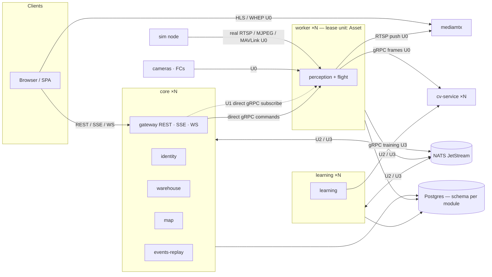
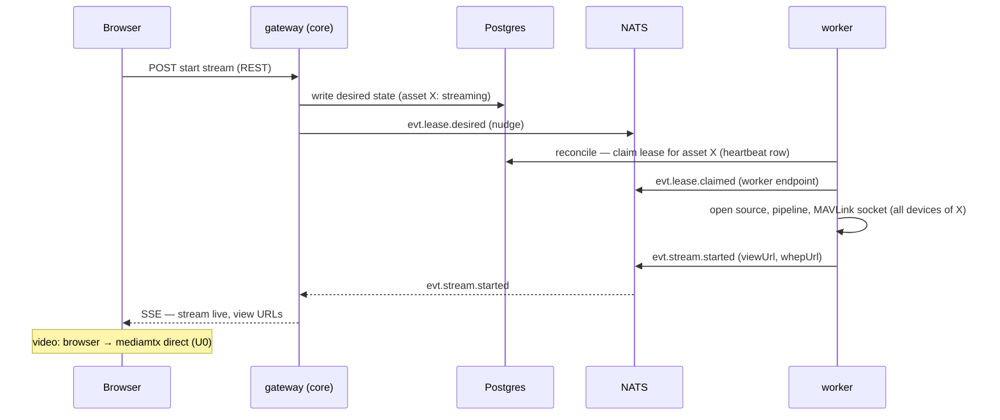
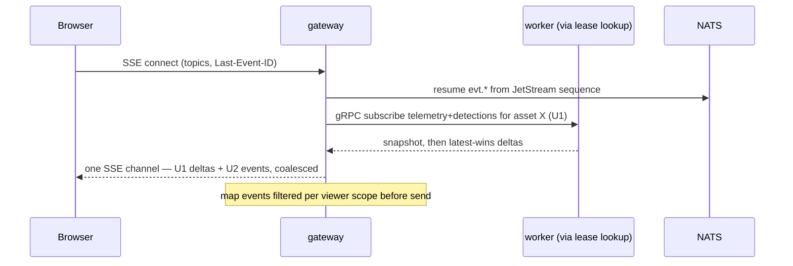
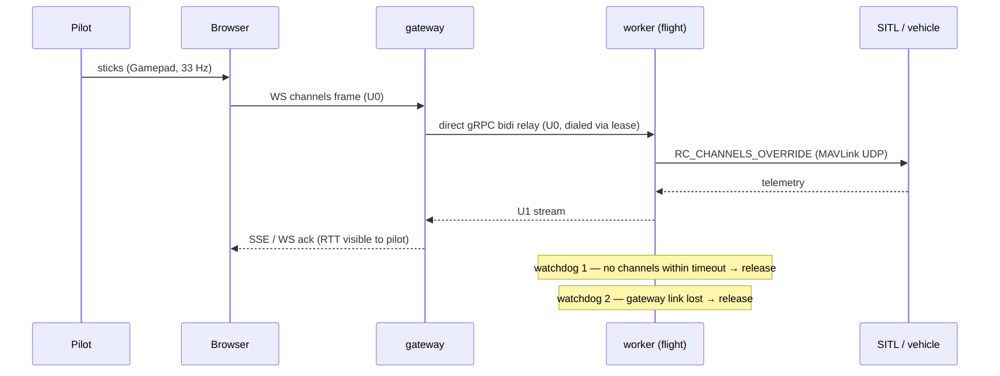
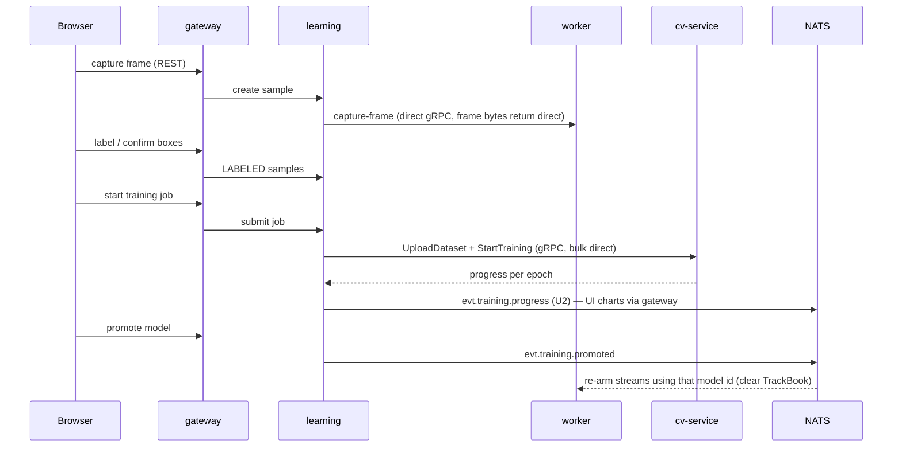
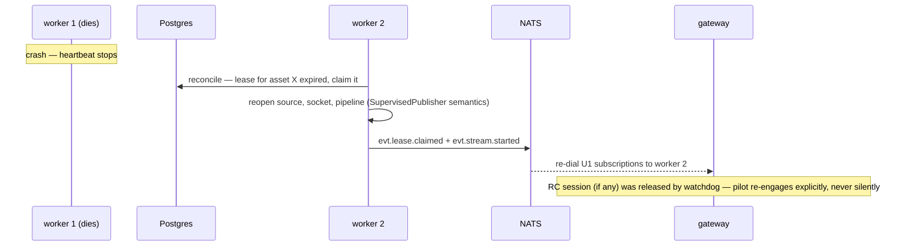

# DOMAIN-SEPARATION-PLAN — modules, services, and how they talk while scaling

**Status:** authoritative target architecture, not yet implemented. Waves in §12.
**Reads with:** [ARCHITECTURE.md](../../../ARCHITECTURE.md) (the hexagonal base, unchanged), [docs/main/vision-architecture.drawio](../../main/vision-architecture.drawio) (the as-is picture this plan decomposes).
**Supersedes:** nothing — it *extends* the adapter separation one level up, to domains.

---

## 1. Why

Three findings against the current shape (see the drawio, page 3):

| Finding | Evidence | Consequence |
|---|---|---|
| One orchestrator core | 18 feature packages + hot pipeline machinery in one `vision-application`; one bag of 60 records + 36 ports in `vision-domain` | every feature builds, tests, deploys and rolls back together |
| One JVM owns every frame | decode → overlay → encode all run in a single process; SSE plane is process-local; per-stream state pins a stream to the process | perception cannot scale horizontally; a second app instance is impossible today |
| No domain separation | Training shares a module with RC control; Map reaches into Warehouse repositories | contexts cannot evolve, deploy or scale independently |

What is **already right** and must not be disturbed: media fan-out never touches the JVM (mediamtx), inference already scales behind `DetectionPort` (cv-service pool), and the port/adapter wall is clean. This plan applies the *same discipline between domains* that already exists between adapters.

---

## 2. Decisions (pinned)

| # | Decision | Rationale |
|---|---|---|
| D1 | **Modular monolith first, distribution by role flag** — one binary/image, `vision.roles` selects which modules a node activates | independence comes from module walls; deployability is a runtime decision, not nine repos |
| D2 | **Urgent data travels direct; non-urgent data travels through a queue broker.** No Postgres LISTEN/NOTIFY anywhere | a queue in front of a control loop or a latest-wins feed only delivers *stale* data (project rule 9); a direct socket in front of collaboration events loses fan-out and replay |
| D3 | **Broker: NATS JetStream** (single small binary — fits compose; durable streams for replayable events; work queues with ack/retry/DLQ; sequence numbers replace the process-local SSE ring buffers) | alternatives (RabbitMQ heavier ops, Redis Streams weaker durability semantics) reconsidered only if an ops constraint appears |
| D4 | **The broker never carries pixels.** Frames, sample images, dataset zips, model files travel direct (gRPC/HTTP) or by reference | keeps the broker small, fast and boring |
| D5 | **One domain model per context; contexts translate at their edges.** The same real-world thing may be modeled differently per context, and aggregation read-models are legitimate contexts of their own (§9) | a canonical shared model is how the current 60-record bag happened |
| D6 | **Schema-per-context in the one Postgres; no cross-context joins.** A context reaches another context's data only via its published API or via events feeding its own read model | separable later into database-per-service without rewrites |
| D7 | **The lease unit is the Asset, not the stream.** One worker owns *all* of an asset's devices — video pipeline, MAVLink socket, RC relay, OSD telemetry supplier — together | RC watchdog and telemetry→OSD are in-process loops; splitting an asset across workers would put a network hop inside a control loop |

---

## 3. Urgency classes — the law every arrow follows

Every communication in §6 carries exactly one class. The class dictates transport, delivery semantics, and what "late" means.

| Class | Name | Budget/hop | Transport | Delivery semantics | If it arrives late |
|---|---|---|---|---|---|
| **U0** | Control loop / frame path | ≤ 50 ms | UDP, RTSP, WebSocket, gRPC bidi stream | fire-and-forget, loss-tolerant, **never queued, never persisted in flight** | it is worse than useless — discard; newest always wins |
| **U1** | Live operational state | ≤ 300 ms | direct gRPC server-stream subscription, SSE to browser | **latest-wins**, no backlog, snapshot-on-connect then deltas | overwrite it silently |
| **U2** | Collaboration & ops events | ≤ 2 s | broker **durable pub/sub** (JetStream stream) | at-least-once, replayable by sequence, idempotent consumers | still valuable — deliver on reconnect |
| **U3** | Workflow & history | seconds–minutes | broker **work queue** (JetStream consumer, ack/retry/DLQ) | at-least-once, durable, retried | fine — it is a job, not a signal |

**Class examples:**

- **U0** — video frames (source→worker, worker→cv-service, worker→mediamtx, mediamtx→browser), RC channel frames, watchdog trip, MAVLink command/ack.
- **U1** — telemetry samples to viewers, detection results to viewers, tracking/flight state, fleet "who is live now".
- **U2** — mark/drawing/layer changes, detection-event open/close, asset/device lifecycle, stream started/stopped/outage, lease changes, training progress, model promoted, geofence breach.
- **U3** — audit entries, detection history batches, usage close-out, training job submissions, discovery scan requests.

---

## 4. The eight modules (bounded contexts)

Module ≠ deployment unit. Modules are compile-time walls (ArchUnit); §5 maps them onto runtime roles.

| Module | Owns (model + store) | Exposes | Consumes | Dominant class |
|---|---|---|---|---|
| **identity** | User, Group, Membership, Role, VisibilityScope, **audit trail** | authn at the edge → *claims*; scope resolution as a pure library; audit ingest queue | `job.audit` from everyone | request + U3 |
| **warehouse** | Asset, Device, DeviceCategory, AssetImage, lifecycle, discovery, probe | asset/device CRUD API; `evt.fleet.*` | claims | request + U2 |
| **perception** | StreamConfig, pipelines, TrackBook, extrapolator, overlay, publish, **asset leases** | worker Control API (direct gRPC): config patch, capture-frame, TX feeds; live subscriptions (U1); `evt.stream.*`, `evt.lease.*` | frames (U0), warehouse read-model, cv-service | **U0/U1** |
| **flight** | Vehicle link state, Telemetry samples, AssetUsage, FlightState/Capability, RC session + watchdog, geofence eval | flight command API (direct gRPC via lease lookup); live telemetry subs (U1); `evt.geofence.*` | MAVLink UDP (U0), geofence zones read-model | **U0/U1** |
| **map** | Mark, MapLayer, LayerGrant, Drawing, Verification, GeoProjection | map CRUD API; `evt.map.*` (layer-scoped) | claims, asset-position read-model (from U1/U2) | U2 |
| **learning** | Dataset, TrainingSample, Annotation, SampleImage, model registry, training jobs | dataset/labeling/job API; sample-image ingest (direct upload); `evt.training.*` | capture-frame via perception Control API; cv-service Training gRPC | U3 |
| **events-replay** | Event history, DetectionEvent engine + history, **detection history**, replay timeline | events/replay query API; `evt.detection-events.*` | `job.history.*` queues, `evt.*` streams, mediamtx playback API | U2/U3 |
| **simulation** | SimulatedAsset, TelemetryPlan, TX transmitters | none needed beyond registration — it emits **real protocols onto the wire** | warehouse registration API | U0 outbound |

**Shared kernel** (the only code every module may import): typed ids, GeoPosition, Ownership, urgency-class envelope types. Nothing else — no shared "Asset".

---

## 5. Deployment roles

One image; a role flag activates modules. Compose today runs `all` on one node — behavior identical to the current monolith.

| Role | Activates | Scaling | State |
|---|---|---|---|
| **core** | identity, warehouse, map, events-replay, + **gateway** (REST/SSE/WS termination, today's vision-api) | replicas behind a load balancer | stateless between requests once §7 lands |
| **worker** | perception + flight | N pods; capacity = leased assets | per-asset in-memory state, recoverable via lease takeover |
| **learning** | learning | 1..N (jobs are queued) | store-backed |
| **sim** | simulation | any | none |
| *(later)* **gateway** | SSE/WS termination split out of core | replicas | none (resume state lives in JetStream) |

---

## 6. Communication matrix

Every arrow in the system. **Pattern** column: RR = request-response, PS = pub/sub, WQ = work queue, ST = stream/subscription.

| From → To | Payload | Class | Transport | Pattern |
|---|---|---|---|---|
| Browser → gateway | commands & queries (REST) | sync | HTTPS | RR |
| gateway → Browser | live envelopes (all topics) | U1/U2 | SSE | ST |
| Browser ↔ gateway | RC sticks / ack / watchdog | **U0** | WebSocket | ST |
| mediamtx → Browser | video | **U0** | HLS / WHEP | ST |
| camera/FC/sim → worker | video, telemetry | **U0** | RTSP / MJPEG / V4L2 / MAVLink UDP | ST |
| worker → cv-service | sampled frames + tracking config | **U0** | gRPC bidi | ST |
| worker → mediamtx | annotated H.264 | **U0** | RTSP push | ST |
| worker ↔ FC | arm / mode / RTL / RC override + ack | **U0** | MAVLink UDP | RR/ST |
| gateway → worker | RC relay leg, flight commands, config PATCH, capture-frame — **dialed via lease registry** | U0/sync | direct gRPC | ST/RR |
| gateway → worker | per-asset telemetry & detection subscriptions | **U1** | direct gRPC server-stream | ST |
| worker → broker | stream lifecycle, lease changes, geofence breach | U2 | `evt.stream.*` `evt.lease.*` `evt.geofence.*` | PS |
| worker → broker | detection history batches, usage close, audit | U3 | `job.history.detections` `job.audit` | WQ |
| core (warehouse/map) → broker | fleet & map events | U2 | `evt.fleet.*` `evt.map.*` | PS |
| events-replay ← broker | everything `evt.*` + `job.history.*` | U2/U3 | PS + WQ | consume |
| gateway ← broker | everything `evt.*` for SSE fan-out; **SSE `Last-Event-ID` maps to JetStream sequence** | U2 | PS (durable) | ST |
| core → worker (assignment) | **desired state, not commands**: core writes intended streams/config to its store, publishes a nudge; workers reconcile by claiming leases | U2 | `evt.lease.desired` | PS |
| learning → cv-service | dataset upload, StartTraining, progress | U3 | gRPC (direct — bulk bytes, D4) | ST |
| learning → broker | job progress, model promoted | U2 | `evt.training.*` | PS |
| perception ← broker | `evt.training.promoted` → live model re-arm per stream | U2 | PS | ST |
| learning → worker | capture-frame request | sync | direct gRPC (frame returns direct, D4) | RR |
| sim → warehouse | register simulated assets | U3 | REST | RR |
| identity ← everyone | audit entries | U3 | `job.audit` | WQ |
| everyone → own Postgres schema | persistence | — | JDBC | — |

**Identity is not a runtime hop.** The gateway authenticates once per session; *claims* (user id, memberships, scope) travel with the request in-process or as verified headers/token between roles. No module calls identity per operation — scope math stays the pure library it already is.

**Lease registry:** a Postgres table owned by perception (worker id, endpoint, heartbeat, asset id) — polled cheaply by workers for reconciliation; **changes announced on `evt.lease.*`** so gateways re-dial without polling. No LISTEN/NOTIFY.

---

## 7. Broker topology

| Subject / queue | Kind | Producers → Consumers | Retention |
|---|---|---|---|
| `evt.fleet.>` | durable stream | warehouse → gateways, events-replay, map | 24 h |
| `evt.map.>` | durable stream | map → gateways (scoped fan-out at gateway) | 24 h |
| `evt.stream.>` | durable stream | workers → gateways, events-replay | 24 h |
| `evt.lease.>` | durable stream | perception → gateways, workers | 1 h |
| `evt.detection-events.>` | durable stream | events-replay → gateways | 24 h |
| `evt.geofence.>` | durable stream | flight → gateways, events-replay | 24 h |
| `evt.training.>` | durable stream | learning → gateways, perception | 7 d |
| `job.audit` | work queue | everyone → identity | until ack, DLQ |
| `job.history.detections` | work queue | workers → events-replay | until ack, DLQ |
| `job.history.usage` | work queue | workers → events-replay | until ack, DLQ |

Rules: consumers are idempotent (at-least-once); event payloads carry facts and ids, never binaries (D4); the JetStream sequence is the *only* resume cursor — the in-process ring buffers and their `everDropped` logic retire in Wave 2. U1 topics deliberately have **no broker presence**: a viewer reconnecting gets a snapshot from the owning worker, not a replay.

---

## 8. Key flows

### F1 — Start a stream (desired state + lease claim)

### F2 — Live viewing fan-in at the gateway

### F3 — RC control loop (two watchdogs, no queue anywhere)

### F4 — Teach-and-promote (the training loop across three services)

### F5 — Worker failure and takeover

---

## 9. One thing, many models — sanctioned variance (D5)

The same drone appears in five contexts under five models. This is intended, not drift; translation happens at the contract edge, and the shared identity is the id alone.

| Real thing | warehouse | flight | perception | map | learning |
|---|---|---|---|---|---|
| a drone | **Asset** — inventory: name, category, ownership, lifecycle, image | **Vehicle** — link state, FlightState, capabilities, usage sessions | **Source** — stream descriptor, pipeline config, lease | **TrackedPosition** — last position + affiliation on a layer | **CaptureSource** — an asset id stamped on samples |

**Aggregation read-models are contexts' own property**: events-replay composes usage + telemetry + detections + recordings into a timeline; the gateway composes fleet summary from warehouse (U2) + live state (U1); map keeps a denormalized asset-position cache fed by telemetry events. None of these aggregate by joining another context's tables — they aggregate what arrived over contracts.

---

## 10. Degradation map — what breaks when a piece dies

Ordered by the project's priority: **the flying and the viewing must survive everything else.**

| Down | Unaffected | Degraded | Recovery |
|---|---|---|---|
| **NATS** | flying (U0), RC + watchdogs, viewing (U0/U1), flight commands | COP updates, alerts, fleet changes, training progress stall; history queues buffer at producers | JetStream replays on reconnect; consumers idempotent |
| **a worker** | other assets (other workers), core, learning | its assets: video gap + RC release for ≤ lease TTL | F5 takeover |
| **a gateway replica** | flying continues *only if* another replica holds the WS quickly — RC releases via watchdog, honest and safe | SSE viewers reconnect to another replica, resume by JetStream sequence | LB + resume |
| **cv-service** | video, flying, recording | no detections (already designed: pipeline passes through) | reconnect |
| **mediamtx** | detection path, telemetry, RC | viewing + recording | publisher reopen (supervised) |
| **Postgres** | in-flight U0/U1 loops keep running on in-memory state | all CRUD, lease claims freeze (current holders keep flying), history writes buffer | reconnect; honest data-loss window for buffered history |
| **learning** | everything live | training UI | queue resumes |

---

## 11. Dependency rules (ArchUnit, one level up from today's)

- A module may import: **itself + the shared kernel + another module's published contract artifact**. Never another module's internals, services, or repositories.
- **perception and flight may not import any other module** — they receive read-models via events and expose subscriptions; nothing in a frame or control loop ever calls across a context boundary synchronously except the contracts in §6.
- Adapters keep their current walls and become *owned* by modules (adapter-mavlink → flight; adapter-rtsp/mjpeg/v4l2/overlay/publish-hls → perception; adapter-cv-grpc → perception + learning; adapter-discovery/persistence → per owning module).
- vision-app remains the only composition root; role flags decide which modules' wiring activates.
- The gateway may depend on every module's contract (it is the edge), and on nothing's internals.

---

## 12. Migration waves — each ends green, none is big-bang

| Wave | Scope | Exit criterion |
|---|---|---|
| **W1 — module walls** | split vision-domain + vision-application into per-context module pairs; contracts as Java artifacts; all calls stay in-process; ArchUnit rules of §11 | build green, behavior byte-identical, per-module MODULE.md |
| **W2 — broker + live plane** | NATS in compose; U2/U3 move to JetStream; SSE resume = JetStream sequence; ring buffers retired; audit + detection history via queues | **two core replicas** serve the same SPA correctly |
| **W3 — worker role** | asset lease table + reconciliation; perception+flight activate under `role=worker`; gateways dial U1/commands via lease registry | 2 workers; kill one → takeover ≤ lease TTL; RC releases cleanly |
| **W4 — learning extraction** | learning under its own role; direct uploads; job queue; training fully operable with zero workers running | train + promote with workers scaled to 0 |
| **W5 — sim node + optional gateway split** | simulation runs on a separate machine, feeding real protocols; gateway split if SSE/WS connection count demands it | sim fleet drives a worker across the LAN |

---

## 13. Open questions

1. **Lease TTL / heartbeat cadence** — the takeover-vs-flapping tradeoff; needs a measured number from W3, not a guess.
2. **Inter-role authn** — mTLS or signed claims tokens between gateway↔worker gRPC; must land in W3 before a worker accepts a dialed RC relay.
3. **Sample images at scale** — Postgres bytea today; an S3-compatible object store becomes attractive once learning is a separate role (D4 already forbids the broker for this).
4. **Postgres HA** — out of scope here; §10 documents the honest degradation until it exists.
5. **Multi-gateway RC failover** — current stance: a gateway death releases the session via watchdog and the pilot re-engages. Sticky-WS failover is deliberately *not* attempted — silent control-path failover is scarier than an honest release.
