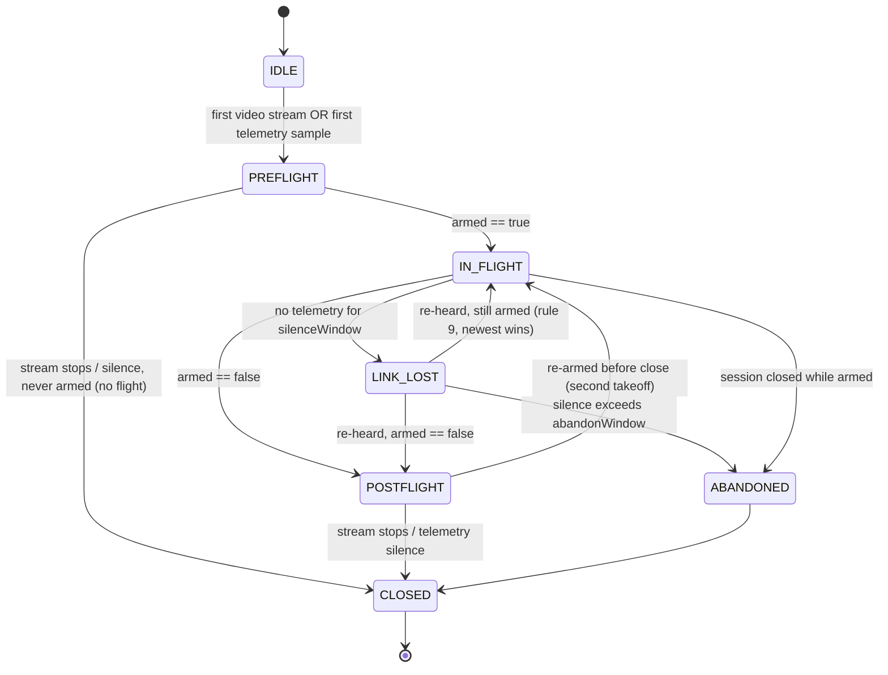
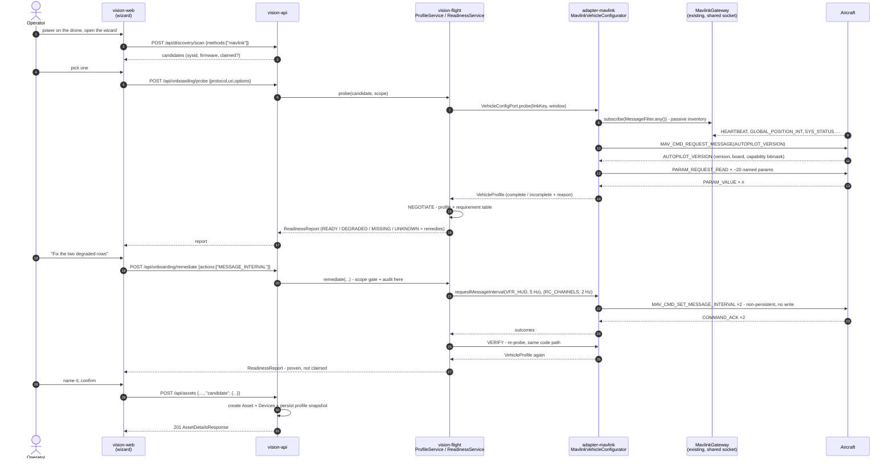
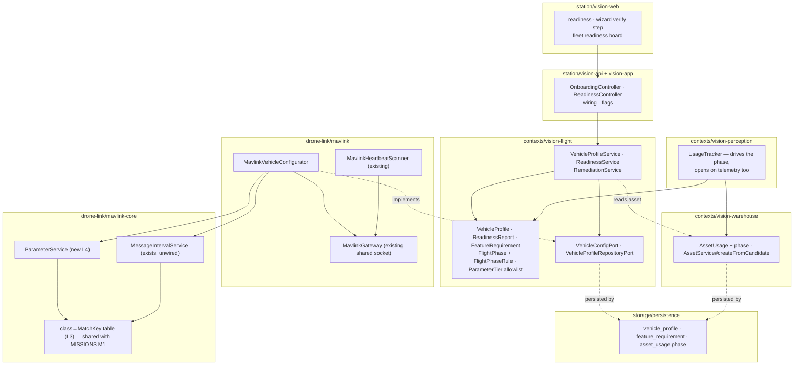

# DRONE-ONBOARDING-PLAN — the aircraft lifecycle, and the pipeline that installs it

Status: **O1–O8 and O11–O14 merged to master 2026-08-19** (behind `vision.onboarding.*.enabled=false`);
**O9/O10 remain operator-gated.** Constraints C1–C13 that this plan obeys are restated in §0.

**Ask (verbatim):** *"how our system will interact with a drones before flight, in flight and after
flight. I need a good, proper flow of adding a drone to our app not only from video and telemetry
part, but the automatic pipeline where I can connect the drone, and app will setup all internally and
on drone's side. Something like an auto-software integration. Don't implement, but think how we can do
that and add a plan"*

## 0. What this plan is, and what it is not

Two deliverables, in this order:

1. **An owned flight lifecycle** — before / in / after flight, as one explicit state machine with one
   owner, replacing today's implicit "a flight is a video stream" (§2).
2. **A closed-loop onboarding pipeline** — discover → identify → probe → negotiate → configure both
   sides → verify → register (§3), with an honest boundary around the phrase *auto-software
   integration* (§4).

**Relationship to existing documents.** `docs/conclusions/ANY-DRONE-PLAN.md` is a thinking document
that says explicitly it is *"not yet an authoritative spec"*. **This plan is its engineering
successor**: it realises §1.1 (PROBE), §1.2 (DIAGNOSE), §1.3 Mechanisms A/B/C (REMEDIATE), §1.4
(VERIFY), §2 (the passport), §4 (the video half + companion install) and §5 (attachment seams), and
adds what that document does not contain — a lifecycle, a wire contract, module placement, waves, and
a safety model. It does **not** restate its reasoning; where this plan deviates it says so and why.

It deepens two of the four moats in `docs/conclusions/MOAT.md`: **Pillar 4** (any drone, no vendor
lock — MOAT §4 calls this loop *"the gate in front of everything"*) and **Pillar 3** (one picture from
heterogeneous sensors — the capability model of §5 is what lets an unknown vehicle join it). Its
honesty rules (§4, §6) are Pillar-3's cultural moat made structural.

**Out of scope, named not dropped:** missions and waypoint upload (`MISSIONS-PLAN.md` owns them
entirely — C13); command TX beyond what I-e Stage 2 already shipped; RC relay Phase 2; any change to
the CV or tracking pipelines.

---

## 1. Where we are

### 1.1 Adding one aircraft today: 20 steps, of which the app performs 0 on the drone side

Counted against `infra/edge/companion-rpi.md` §Setup (the only recipe carrying both video and
telemetry) plus `station/vision-web/src/app/features/onboarding/onboarding-logic.ts#nextStep`.

| # | Step | Where it happens | Who does it |
|---|---|---|---|
| 1–3 | Wire FC UART ↔ companion; connect camera; prepare the OS image (incl. `dtoverlay=disable-bt` for `/dev/ttyAMA0`) | bench | operator |
| 4–5 | Set `SERIALx_PROTOCOL` + baud; set `SRx_*` stream rates if messages are missing | **QGroundControl / Mission Planner — someone else's software** | operator |
| 6–11 | `apt install mavlink-router ffmpeg`; copy `main.conf` and edit `Device`/`Address`; copy two systemd units and edit the `CHANGE-ME` placeholders; `daemon-reload`; `enable --now` | SSH to the companion | operator |
| 12–17 | Wizard: `profile` → `connect` (firmware × link picker) → `listen` (scan, pick) → `test` (probe) → `create` → `assign` | our app | operator, 4 clicks + a name |
| 18 | Register the RTSP video device as a **second** device on the asset — the wizard emits exactly one `DeviceSpec` (`onboarding-logic.ts#buildCreateAssetRequest`) | our app, separately | operator |
| 19 | Set `SYSID_THISMAV` if a second aircraft exists — otherwise two aircraft appear as one | someone else's software | operator |
| 20 | Start the stream, because that is the only thing that opens a session | our app | operator |

**Steps 12–17 are good and stay.** They are I-b + I-g, shipped 2026-07-29, and this plan does not
touch the wizard's shape. The other fourteen are the target; §4's matrix says roughly nine are
genuinely automatable.

### 1.2 Current state, per capability

| Capability | Today | Gap |
|---|---|---|
| Hear an aircraft on the wire | `drone-link/mavlink/.../MavlinkHeartbeatScanner.java` — per-sysid `DiscoveredDevice` with firmware, mavType, claimed-by | none for discovery |
| Turn what we heard into inventory | **nothing in Java.** Full consumer set of `DiscoveredDevice` ends at `DiscoveryController` → JSON → a prefilled form. `station/vision-api/.../dto/DiscoveredDeviceResponse.java` even **drops `suggestedStream.options()`**; the MAVLink path survives only because the scanner duplicates `sysid` into `details` | no server-side registration command; a lossy wire shape |
| Know what the aircraft *is* | `FlightCapability(commandable, armSupported, modeSelectSupported, selectableModes)` derived **purely from the HEARTBEAT firmware string + mavType** (`MavlinkFlightCommander#capabilities`) | no `AUTOPILOT_VERSION`, no capability bitmask, no parameter read — zero Java references to any of them |
| Know what it is *sending* | `MavlinkTelemetryDecoder` decodes 17 message types and ignores the rest | no message inventory: nobody can say "`VFR_HUD` never arrives" |
| Change anything on the vehicle | `MavlinkFlightCommander` sends exactly **two** commands — `MAV_CMD_DO_SET_MODE`, `MAV_CMD_COMPONENT_ARM_DISARM` | no `PARAM_SET` anywhere; `MessageIntervalService` **exists in `mavlink-core` and nothing outside that module references it** |
| Say whether it can fly | `station/vision-web/.../core/telemetry/flight-state-logic.ts#derivePreflight` — five rows, in TypeScript, with a hardcoded 45% battery bar (`flight-state-logic.ts:188`) | the rule is in the browser; no verdict, no recorded override, no fleet board (`preflight-logic.ts`'s own javadoc says templates are unbuilt) |
| Record a flight | `AssetUsage(id, assetId, startedAt, endedAt, startPosition, lastPosition, sampleCount, streamId)` in **warehouse**, opened by `UsageTracker#onStreamStarted` | it is a *video session*. Fly without video → no record. Bench-test with video → a "flight" |
| Configure the edge | `infra/edge/` — three markdown recipes, a `main.conf`, two systemd units | documentation, not an install channel: no agent, no served installer, no credential issuing, nothing reports back |

**Verdict: onboarding is not already good.** The guidance half is excellent and the observation half
does not exist. That asymmetry is exactly what `ANY-DRONE-PLAN.md` §0 calls *open-loop*.

> Note for readers of CLAUDE.md: its module index still says *"vision-flight | Flight sessions
> (AssetUsage)"*. `AssetUsage` moved to `vision-warehouse` in DOMAIN-SEPARATION **W1.6c**, and
> `contexts/vision-flight/MODULE.md` says so. Fix the index in whichever wave first touches it.

---

## 2. The lifecycle, owned

### 2.1 The argument for reusing `AssetUsage`

`AssetUsage` is already the join key for everything a flight produces: telemetry samples
(`TelemetryRepositoryPort`, keyed by usage), detections (via `streamId`), replay
(`contexts/vision-events` exists to narrate *"one finished `AssetUsage`"*), and labeling capture. A
parallel `Flight` entity would fork that join and force `vision-events` — a module whose MODULE.md
opens with *"the rule that must not be broken"* — to read two histories.

So: **reuse it. Do not invent a `Flight`.** But it needs two changes, because today it is honestly a
*stream session* wearing a flight's name:

1. **A phase**, so "before / in / after" is a recorded fact rather than something a UI infers.
2. **A second opening trigger**, so a flight with no video open is still a flight.

### 2.2 Who owns what

The temptation is to put the state machine in warehouse next to the record. That is wrong: warehouse
is the **pure leaf** (14 measured edges, `DOMAIN-SEPARATION-W1.md` §16) and knows nothing about
arming, failsafe or link health. The temptation's opposite — a new `flight → warehouse` write path —
is unnecessary, because that edge already exists.

The split, and it costs **zero new context edges**:

| Piece | Module | Why |
|---|---|---|
| The record + its `phase` field | `contexts/vision-warehouse` | it is where `AssetUsage` lives; a phase is one more append-only column |
| `FlightPhase` enum + `FlightPhaseRule` (a **pure function** `(phase, FlightState, linkAge, streamCount) → phase`) | `contexts/vision-flight` | phases are decided by flight facts; `FlightState` is kernel, `flight` already owns every port that produces it |
| The **driver** that calls the rule and writes the record | `contexts/vision-perception` — `UsageTracker` | it already holds both inputs in one place: stream start/stop **and** every telemetry sample (`applySample`). Measured edges `perception → flight(4)`, `perception → warehouse(16)` already exist |

This is the `GeofenceMonitor` precedent (a flight-owned rule, driven from perception's sample path)
applied a second time.

### 2.3 The state machine



Three rules that make this honest rather than decorative:

- **`armed == null` is not `false`.** Before the first HEARTBEAT, `FlightState.armed` is `null`
  (kernel javadoc). A session with unknown arming stays in `PREFLIGHT` and is *never* promoted or
  closed as "flew". C7.
- **`failsafe` is a flag, not a state.** `FlightState.failsafe` is recorded and rendered on the
  `IN_FLIGHT` phase and raises an audit entry; it does not transition, because an aircraft in failsafe
  is still flying. Modelling it as a state would make the machine lie about what the aircraft is
  doing.
- **`ABANDONED` is a real outcome, not an error.** It means *we stopped observing while it was
  airborne*. Today that case is indistinguishable from a normal landing, which is the worst kind of
  silent data loss for a post-flight review.

### 2.4 What each phase means

| Phase | Aircraft is | Platform must know | Platform must check | Platform records |
|---|---|---|---|---|
| **PREFLIGHT** | on the ground, powered, disarmed (or arming unknown) | firmware, sysid, message inventory, parameter snapshot, battery, GPS fix, arming blockers, video reachable | the **readiness verdict** (§2.5) — and this is the only phase where a Tier-A parameter write is permitted (§6) | `startedAt`, the `VehicleProfile` snapshot (§5), the verdict and any override |
| **IN_FLIGHT** | armed, link live | position, altitude, attitude, gimbal, battery, link health, failsafe, mode | geofence (exists — `GeofenceMonitor`), link silence, failsafe onset | telemetry series (exists), `firstArmedAt`, detections, marks, failsafe onsets |
| **LINK_LOST** | unknown — probably still airborne | last known everything, and **how old it is** | whether silence exceeds `abandonWindow` | `linkLostAt`; the UI must show age, never a frozen-looking live value (the CV-DEMAND stale-box lesson) |
| **POSTFLIGHT** | landed, disarmed, still powered | duration, distance, sample count, detection count, whether any parameter changed since the pre-flight snapshot | nothing blocking; this is where **config drift** is computed | `lastDisarmedAt`, the closing `VehicleProfile` snapshot |
| **CLOSED / ABANDONED** | off, or gone | the whole record is now immutable | — | `endedAt`, terminal phase; the pair of profile snapshots is the flight's forensic evidence |

### 2.5 Readiness moves to the server

Today's five rows (video, telemetry, GPS, battery, armable) are computed in
`flight-state-logic.ts#derivePreflight` with a TypeScript constant for the battery bar. That is the
rule in the wrong layer and a magic number (C6), and it is why there is no fleet readiness board and
no recorded override.

Move the rule into `contexts/vision-flight` as `ReadinessService`, fed by **two** sources:

- **telemetry-derived rows** — exactly today's five, same thresholds, same wording;
- **configuration-derived rows** — new, from the `VehicleProfile` of §3/§5: *"ground speed unavailable
  — `VFR_HUD` not arriving (`SR2_EXTRA2 = 0`)"*.

The frontend keeps `derivePreflight` as a **renderer** for the live card and stops being the
authority. Thresholds become data (§5, D6), seeded with today's values so no existing test changes.

---

## 3. The onboarding pipeline

### 3.1 The seven stages

The structural inversion versus today: **registration is the last stage, not the first.** Today the
operator types a device into existence and then finds out whether it works. Here, everything is
observed against a *candidate* — keyed by `(bind address, sysid)`, which `MavlinkHeartbeatScanner`
already produces without any persisted `Device` — and a record is created only once the platform can
describe what it has.

| # | Stage | Input | Output | Owner | How it fails |
|---|---|---|---|---|---|
| 1 | **DISCOVER** | a scan request | `List<DiscoveredDevice>` | `drone-link/mavlink` (`MavlinkHeartbeatScanner`), `device-discovery/*` — **both exist** | nothing heard (radio off, wrong port, firewall); bind conflict → today logs WARN and returns empty |
| 2 | **IDENTIFY** | one candidate | `linkKey = "udp://host:port#sysid"`, firmware label, vehicle kind, claimed-by | `drone-link/mavlink` — **exists** | two aircraft share `SYSID_THISMAV=1` → they identify as one. Detectable (two source addresses, one sysid), and the honest output is a *conflict*, not a silent merge |
| 3 | **PROBE** | `linkKey` + a window | `VehicleProfile`: message inventory (msgid → Hz), `AUTOPILOT_VERSION` (firmware version, board, capability bitmask), ~20 named parameter values, link bytes/s | **new** `VehicleConfigPort` (flight) + `MavlinkVehicleConfigurator` (adapter-mavlink) | `AUTOPILOT_VERSION` unanswered (Betaflight, old firmware); parameter read unsupported; window too short on a 2.4 kB/s link → **`complete: false` + `incompleteReason`, never a fabricated profile** |
| 4 | **NEGOTIATE** | `VehicleProfile` × the feature-requirement table | `ReadinessReport` — per feature: READY / DEGRADED / MISSING / UNKNOWN, each with a `remedy` of `MESSAGE_INTERVAL` \| `PARAM_WRITE` \| `CLI_SCRIPT` \| `MANUAL` \| none | `ReadinessService` (flight) | an unknown firmware has no requirement rows → every feature is `UNKNOWN`, which is a correct answer, not a failure |
| 5 | **CONFIGURE (dual side)** | the chosen remedies | **platform side:** asset + devices + stream descriptors + telemetry route + category + ownership. **vehicle side:** message-interval requests (Mechanism A), Tier-A parameter writes (Mechanism B, gated), generated CLI diff (Mechanism C, we write nothing). **companion side:** a token-scoped `setup.sh` (§4b) | warehouse (platform side), adapter-mavlink (vehicle side), vision-api (companion side) | vehicle armed → **refused**, always; command denied by FC; no ack; companion unreachable or has no install channel |
| 6 | **VERIFY** | — | a re-probe through the *same* code path, and a fresh `ReadinessReport` | `MavlinkVehicleConfigurator` + `ReadinessService` | the remedy acked but the message still does not arrive → the report stays DEGRADED and says so. **Green means proven, never claimed** |
| 7 | **REGISTER** | the verified profile | `Asset` + 1..n `Device` + the profile snapshot, one transactional act | **new** `AssetService#createFromCandidate` (warehouse) | duplicate: the same `(protocol, uri, options.sysid)` already registered → 409 naming the existing asset, never a second one |

### 3.2 Happy path



Note what the diagram does **not** contain: no new socket, no new port binding, no second connection
to the aircraft. Everything rides `MavlinkGateway`'s existing shared `UdpListenLink` + `MavlinkSession`
— the seam `MavlinkHeartbeatScanner` already borrows.

### 3.3 Failure modes and what the operator sees

Every row obeys C7: absent data renders as unknown **and says why**.

| Stage | Failure | What the operator sees | Recovery offered |
|---|---|---|---|
| DISCOVER | nothing heard in the window | *"No aircraft heard on udp://0.0.0.0:14550 in 8 s."* + the wizard's existing firmware×link recipe, and the server's own address | re-scan; switch NIC (the multi-NIC picker exists) |
| DISCOVER | port already bound by something else | *"Port 14550 is in use by another process — MAVLink discovery cannot listen."* (today this is a WARN log and an empty list — silently indistinguishable from "no drone") | named as a distinct outcome; that distinction is new work |
| IDENTIFY | two source addresses, one sysid | *"Two aircraft are both reporting sysid 1. They cannot be told apart until one is changed."* + `SYSID_THISMAV` as a Tier-A remedy | Tier-A write (O9), or the CLI diff |
| IDENTIFY | candidate already claimed by a device | existing behaviour: greyed out, *"already registered as <asset>"* | open that asset instead |
| PROBE | `AUTOPILOT_VERSION` unanswered | *"This aircraft did not answer the capability request. Firmware version and supported protocols are unknown."* — profile `complete: false` | proceed with inventory-only profile; features needing the bitmask read `UNKNOWN` |
| PROBE | parameter read unsupported / times out | per-parameter *"not readable"*, never a zero | Mechanism C (generated CLI diff) for BF/INAV |
| PROBE | slow link, window expired mid-read | *"Read 12 of 20 settings in 10 s on a 2.3 kB/s link."* | extend window; the partial profile is still stored and still useful |
| NEGOTIATE | unknown firmware, no requirement rows | every feature `UNKNOWN` with *"we have never seen this firmware"* | the profile is still recorded — this is how the compatibility matrix of ANY-DRONE §3 gets seeded |
| CONFIGURE | **aircraft armed** | *"This aircraft is armed. Settings can only be changed on the ground."* | wait; **never** an override (§6) |
| CONFIGURE | `armed` unknown | same refusal, different words: *"Arming state unknown — refusing to write."* | probe again |
| CONFIGURE | command acked but read-back differs | *"The aircraft accepted the change but reports a different value."* — treated as failure, previous value restored | retry, or manual |
| CONFIGURE | no ack | `NO_ACK` — *"No response. Nothing is known to have changed."* (not "failed", not "succeeded") | retry; the snapshot is untouched |
| CONFIGURE (companion) | host unreachable / no agent | *"We cannot reach the companion computer. Run this one line on it:"* + the token-scoped installer | manual, one command |
| VERIFY | remedy acked, message still absent | report stays DEGRADED: *"Requested `VFR_HUD` at 5 Hz; still not arriving after 10 s."* | escalate to Tier-A `SRx_*` write, or CLI diff |
| REGISTER | duplicate `(protocol, uri, sysid)` | 409 naming the existing asset | open it |

---

## 4. What "auto-software integration" can and cannot mean

This is the section where a plan like this normally overpromises. Four honest categories.

### (a) Parameters we can set on the flight controller over MAVLink

Two mechanisms, and the distinction matters more than any other in this plan.

**Mechanism A — runtime request. Not a write at all.** `MAV_CMD_SET_MESSAGE_INTERVAL` (#511) and
`MAV_CMD_REQUEST_MESSAGE` (#512) ask the aircraft to *transmit* something, at a rate, for this
session. Nothing persists, nothing survives a reboot, nothing can be left in a bad state. **This is
already implemented** in `drone-link/mavlink-core/.../service/MessageIntervalService.java` —
`setMessageInterval(PeerId, int messageId, Duration)`, `disableMessage`, microsecond conversion
handled — and **nothing outside `mavlink-core` references it** (verified by grep). A large share of
"degraded onboarding" is a stream rate, so this single unwired class is the highest value-per-line in
the plan.

**Mechanism B — `PARAM_SET`, tiered by risk.** ANY-DRONE §1.3's tiering, adopted verbatim and made
enforceable:

| Tier | Examples | Policy |
|---|---|---|
| **A — reporting** | `SRx_*` stream rates, `SYSID_THISMAV`, `SERIALx_PROTOCOL` = MAVLink2 | one confirm; snapshot before; read-back verify; one-click restore; audited |
| **B — link & failsafe behaviour** | GCS/RC failsafe action and timeout, RC-override acceptance | per-item explicit consent with plain-language "what changes in flight"; disarmed-only; `canAdminister()`; audited |
| **C — flight-critical** | PIDs, `ARMING_CHECK`, frame class/type, battery calibration, compass/accel offsets | **never written. Reported only.** |

The allowlist is **domain code in `contexts/vision-flight`**, not a UI convention — enforce in the
right layer. A platform that writes someone's PIDs kills an aircraft once and is finished as a
product; Tier C is not negotiable and has no flag.

Today the repo can send exactly two commands (`MAV_CMD_DO_SET_MODE`,
`MAV_CMD_COMPONENT_ARM_DISARM`) and has zero `PARAM_SET` references, so Mechanism B is entirely new
code.

> ### ⚠ Measured against ArduPilot Copter 4.7.0 in wave O4 — read before building O8/O9
>
> Wave O4 ran the probe and both mechanisms against the firmware `infra/sitl` actually ships. Two
> results contradict assumptions this section and the tables below were written on:
>
> 1. **There are no `SRx_*` stream-rate parameters on 4.7.** `SR0_*`, `SR1_*` and `SR2_*` were each
>    read off a live instance and every one is absent. So the Tier-A row's "`SRx_*` stream rates"
>    example, §2.5's *"`VFR_HUD` not arriving (`SR2_EXTRA2 = 0`)"*, §3.2 VERIFY's *"escalate to
>    Tier-A `SRx_*` write"*, O8's exit criterion *"connect with `SR2_EXTRA2=0`"*, and the §9 JSON
>    example's `SR2_EXTRA2` reading are **not implementable on this firmware**. Mechanism A is not a
>    cheaper alternative to a stream-rate write here — it is the only mechanism that exists.
>    Rewriting those rows belongs to O8, which is the wave that has to act on them.
>
>    **O8's exit criterion becomes simpler, not impossible.** It was written as *"connect with
>    `SR2_EXTRA2=0`"* because it assumed the starved link had to be manufactured. It does not: a stock
>    SITL is **already** starved — measured at four message types over a UDP `--out` link (`HEARTBEAT`
>    at 1 Hz plus three event-driven ones at ~0.1 Hz), against the dozen a connected GCS sees. So the
>    test is *connect to a stock aircraft, observe the starved baseline, enable the flag, observe the
>    requested messages begin arriving* — with **no parameter write at all**, which is the point
>    Mechanism A was there to make.
> 2. **Several named parameters have been renamed.** `SYSID_THISMAV` → `MAV_SYSID` (so O9's wizard
>    and the §3.2 IDENTIFY conflict remedy both name a parameter that no longer exists),
>    `FS_BATT_ENABLE` → `BATT_FS_LOW_ACT`, `GPS_TYPE` → `GPS1_TYPE`. `ARMING_CHECK`, `RTL_ALT`,
>    `WPNAV_SPEED`, `LAND_SPEED`, `ANGLE_MAX` and `PILOT_SPEED_UP` are absent too.
>
> The general lesson, and the reason `probeParameters` is configuration: **MAVLink gives an autopilot
> no way to report an unknown parameter name — it simply says nothing.** A stale list therefore does
> not fail loudly; it degrades into a slow probe that quietly reads less than it claims. Any wave
> that adds a parameter name must verify it against a live instance, and `MavlinkSitlOnboardingIntegrationTest`
> asserts every configured name answers so a future drift fails the build rather than the flight.

**Mechanism C — generated CLI diff.** Betaflight and INAV do not usefully expose the MAVLink
parameter protocol. We generate the exact `set …` / `save` lines **from the probed state** — a diff,
not a generic snippet — for paste into the configurator, then a `[Verify]` that re-probes. We write
nothing; the loop still closes. *(Exact BF/INAV CLI keys and serial-function bitmasks must be
verified against firmware sources before implementation — this repo does not carry unverified wire
facts.)*

### (b) Configuration we can push to a companion computer

This is where "auto" is most often oversold. A push requires **all four** of these to already be
true:

1. **Network reachability** from the platform to the companion, or the companion out to us. In the
   field the companion is usually behind LTE CGNAT — **outbound-only**. Any design that requires us to
   dial *in* to the drone is wrong for the common case.
2. **Something listening.** Either an SSH daemon with a key we hold, or an agent we installed. A
   stock Raspberry Pi OS image has neither pointed at us.
3. **Credentials**, scoped, revocable, and not the operator's personal SSH key.
4. **An install channel** — a package or script the box can fetch, and a way to roll back.

What is realistic, and what this plan proposes: **one manual command, then automatic forever.** The
platform serves a token-scoped installer — `curl -sSL http://<server>/api/onboarding/setup.sh?token=… | sh`
— generated per candidate, already carrying our address, the MAVLink port, the mediamtx path and the
publish credentials. It writes `main.conf` and the two systemd units that already exist in
`infra/edge/`, with no `CHANGE-ME` left in them, and registers the asset back to us. That collapses
steps 6–11 and 18 of §1.1 into one line the operator pastes once.

An **agent** (a resident process that polls us for config and reports health) is strictly more
capable and is deliberately **deferred** — see D11 and OQ1. Its price: a new deployable artifact
outside the Maven reactor, a permanent update channel, and a new security boundary on a machine
attached to an aircraft.

What can **never** be pushed to a companion we did not install: anything at all. A box with no agent
and no inbound route is invisible to us, and we must say so rather than showing an idle "configure"
button.

### (c) Physical access / vendor tooling — never automatable

Wiring FC UART ↔ companion and level-shifting; freeing `/dev/ttyAMA0` from Bluetooth; flashing or
upgrading FC firmware; radio binding; ESC and motor configuration; **compass and accelerometer
calibration** (requires physically rotating the airframe); RC transmitter failsafe setup; propeller
and battery fitment; regulatory registration marks. These belong in the wizard as a **checklist with
links**, never as a progress bar that implies we are doing them.

### (d) The closed-SDK case (DJI, Autel, Skydio)

The vehicle is not ours to configure. `ARCHITECTURE.md:221` already routes digital FPV/DJI through
"RTSP/UDP from ground station" with **no control column**, and that is the correct and permanent
position. We can ingest video (and, with the operator's own tooling, sometimes telemetry). We cannot
read a parameter, set a stream rate, or install anything. MOAT §0 says vendor-internal capability is a
commodity we should stop chasing; the onboarding path for these aircraft is therefore the existing
RTSP/SRT source flow, labelled **ingest-only**, with the configuration surface *absent* rather than
present-and-failing. Showing a greyed "probe" button on a DJI asset would be fake capability.

### (e) Capability matrix

Columns: what the platform can do **without a human touching the aircraft**.
✅ automatable · ⚠️ automatable after one manual bootstrap · ❌ not possible · — not applicable.

| Vehicle class | Discover | Identify | Probe params | Set msg rates (Mech. A) | Tier-A write | Tier-B write | Push companion config | Push video config | Readiness verdict | Mission-capable (MISSIONS) |
|---|---|---|---|---|---|---|---|---|---|---|
| **ArduPilot + companion** | ✅ | ✅ | ✅ | ✅ | ✅ | ⚠️ gated | ⚠️ one-line installer | ⚠️ same installer | ✅ full | ✅ |
| **ArduPilot, bare FC** (ELRS/ESP32 link) | ✅ | ✅ | ✅ (slow — ~2.4 kB/s) | ✅ | ✅ | ⚠️ gated | — | ❌ no video path | ✅ full | ✅ |
| **PX4** | ✅ | ⚠️ label only | ⚠️ unverified | ⚠️ unverified | ❌ not claimed | ❌ | ⚠️ | ⚠️ | ⚠️ partial | ❌ untested |
| **INAV** | ✅ | ⚠️ masquerades as ArduPilot | ❌ | ⚠️ unverified | ❌ | ❌ | — | ❌ | ⚠️ telemetry rows only | ❌ |
| **Betaflight** | ✅ | ✅ (as `generic`) | ❌ | ❌ | ❌ CLI diff instead | ❌ | — | ❌ | ⚠️ telemetry rows only | ❌ |
| **Closed-SDK (DJI/Autel/Skydio)** | ❌ | ❌ | ❌ | ❌ | ❌ | ❌ | ❌ | ❌ | ⚠️ video rows only | ❌ |
| **IP camera / non-drone asset** | ✅ (ONVIF/mDNS/V4L2) | ✅ | — | — | — | — | — | ⚠️ ONVIF, out of scope | ⚠️ video rows only | — |
| **Simulated (`sim`)** | — | — | — | — | — | — | — | — | ✅ synthetic | — |
| **Simulated (`mavlink-vehicle`, MISSIONS M8)** | ✅ | ✅ | ✅ | ✅ | ✅ | ✅ | — | — | ✅ | ✅ |

**The PX4 row is the honesty case.** `FlightStatusState#firmwareLabel` returns `"px4"` for autopilot
12, but `FlightModes#tableFor` returns `null` for it (its own comment: *"PX4 (12) and any other
autopilot: no table, `Mode <n>` fallback"*), and `MavlinkFlightCommander` reports
`notCommandable` for anything that is not `"ardupilot"`. **The repo does not support PX4 today.** The
probe/inventory/message-rate stages are protocol-generic and should work, but until a PX4 SITL run
proves it, every PX4 cell above stays ⚠️ and the UI must not claim otherwise (OQ5).

---

## 5. The capability model

The point: **the UI and services stop guessing**, and an unknown vehicle is describable rather than
unsupported. That is what makes the funnel work.

### 5.1 The doctrine, borrowed from categories

`DeviceType` was an enum and became `DeviceCategory` — data behind a repository, seeded in
`storage/persistence/.../V2__seed_categories.sql`, because *"new device kinds are data, not code"*
(ARCHITECTURE §3). Apply the same move to capability:

- **Vehicle capability** is *observed data* (a `VehicleProfile`), not a firmware `switch`.
- **Feature requirements** are a *seeded table* (`feature × required message + minimum Hz × required
  parameter`), not an `if (firmware.equals("ardupilot"))` chain. This is ANY-DRONE §1.2's matrix,
  expressed as rows. Adding a feature requirement must be a migration, not five layers of edits.
- `DeviceCategory.attributeHints` is the precedent for **suggestions, not schema** — the requirement
  table is authoritative for readiness, never for whether an asset may exist.

### 5.2 Where it lives, and why not in `Asset.attributes`

`Asset.attributes` is `Map<String,String>`, free-form, defensively copied, with the operator-authored
`registrationNumber` convention already on it
(`station/vision-web/.../core/fleet/asset-attributes.ts:12`). It is tempting and it is **wrong** for
this: a profile is machine-observed, timestamped, versioned per flight, and tens of entries wide.
Putting it there would collide with operator edits, carry no observation time, and turn a small human
map into a telemetry dump.

**D5: `VehicleProfile` is its own append-only record in `contexts/vision-flight`**, keyed by
`DeviceId` + `observedAt`, persisted via `VehicleProfileRepositoryPort`. `Asset.attributes` stays what
it is: what a human wrote down.

### 5.3 The shape

```
VehicleProfile
├── linkKey            "udp://0.0.0.0:14550#7"      (identity before a DeviceId exists)
├── observedAt         Instant
├── firmware           "ardupilot" | "generic" | "px4" | null      (null = never heard)
├── firmwareVersion    "4.5.7" | null                (AUTOPILOT_VERSION; null = unanswered)
├── vehicleKind        "quadcopter" | … | null
├── capabilityBitmask  Long | null                   (the autopilot's own protocol declaration)
├── messages           List<MessageObservation(messageId, hz, count)>
├── parameters         List<ParameterReading(name, value, type)>   (only what was actually read)
├── linkBytesPerSecond Long | null
└── complete           boolean + incompleteReason    (C7 — a partial probe says which half is missing)
```

`FlightCapability(commandable, armSupported, modeSelectSupported, selectableModes)` — already on
`FlightCommandPort` and already exposed at `GET /api/assets/{id}/flight-capabilities` — **keeps its
shape** (frozen contract, existing UI) but changes its *source*: derived from the profile's bitmask
and observed evidence when one exists, falling back to today's firmware-string derivation when it does
not. That is a strictly-more-informed answer at an unchanged wire shape, so no UI wave is blocked on
it.

---

## 6. Security and safety

Pushing configuration to an aircraft is a write to a physical machine. Stated plainly, here is what
can hurt someone:

- A wrong `SERIALx_PROTOCOL` or baud **kills telemetry**, possibly while airborne — the operator loses
  the picture on a flying aircraft.
- A wrong failsafe parameter means the aircraft **does not come home** on link loss. It flies until the
  battery ends, wherever it is pointed.
- Any parameter write **while armed** can change behaviour in the air; ArduPilot accepts many of them.
- A companion "update" that restarts `mavlink-router` or the video unit **mid-flight** cuts the link
  at the worst moment.
- A wrong `SYSID_THISMAV` assignment can make commands intended for one aircraft reach another.

### 6.1 Authority per operation

Tied to `core/vision-platform/.../VisibilityScope.java` (merged 2026-08-17), whose own javadoc
establishes **visibility ≠ authority**:

| Operation | Predicate | Denial | Audited |
|---|---|---|---|
| Read a `ReadinessReport` / `VehicleProfile` | `includes(assetId, ownership)` | **404** (a scoped read hides) | no |
| PROBE (passive inventory) | `includes(...)` | 404 | no |
| PROBE (active: `REQUEST_MESSAGE`, `PARAM_REQUEST_READ`) | `canManage(ownership)` | **403** | yes — it puts traffic on the aircraft's link |
| Mechanism A (`SET_MESSAGE_INTERVAL`) | `canManage(ownership)` | 403 | yes |
| Tier-A `PARAM_SET` | `canManage(ownership)` | 403 | yes, with before/after values |
| Tier-B `PARAM_SET` | `canAdminister()` **+ per-item consent** | 403 | yes |
| Tier-C | — | **not exposed at any authority level** | — |
| Serve a companion installer token | `canAdminister()` | 403 | yes |
| Override a NO-GO verdict | `canManage(ownership)` | 403 | yes — *"a check that can be ignored silently is not a check"* (`docs/extracts/design/17-preflight.md`) |

The 403-and-audit / 404-silent asymmetry is not new: it is `DefaultFlightCommandService`'s existing
rule (C4), and every new service copies it rather than inventing a variant.

### 6.2 Interlocks that are structural, not UI

1. **Disarmed-only**, checked in the application layer against the latest `FlightState.armed`, and
   **`armed == null` counts as "not permitted"** (D10). Unknown is never optimistic.
2. **Snapshot before, read-back after.** A write whose read-back differs is a *failure*, the previous
   value is restored, and the report says so. `NO_ACK` is reported as "nothing is known to have
   changed" — neither success nor failure.
3. **Nothing automatic from discovery.** An aircraft appearing on the network must never trigger a
   write. Every vehicle-side change originates in an explicit operator act on an asset they may
   manage. Mechanism A on connect (O8) is the one borderline case, and it ships behind a flag that
   defaults **off** with the operator's own go (OQ2 covers the persistent tier; the non-persistent
   tier still gets its own flag).
4. **The Tier allowlist is domain code.** A UI that forgets to hide a button must still be refused by
   the service.
5. **Restore is one click and always available** while the session's snapshot exists.

---

## 7. Module placement

**No new bounded context. No new context dependency edge.** Verified against the 14 measured edges in
`DOMAIN-SEPARATION-W1.md` §16: `perception → flight` and `perception → warehouse` already exist, and
`adapter-mavlink` already imports `kernel, warehouse, flight, perception`. Everything below lands
inside an existing edge.

| Piece | Module | New or existing |
|---|---|---|
| `FlightPhase`, `FlightPhaseRule`, `VehicleProfile`, `MessageObservation`, `ParameterReading`, `ReadinessReport`, `FeatureRequirement`, `ParameterTier` | `contexts/vision-flight` (`domain.model`) | new types, existing module |
| `VehicleConfigPort` (`probe`, `requestMessageInterval`, `readParams`, `writeParam`), `VehicleProfileRepositoryPort`, `FeatureRequirementRepositoryPort` | `contexts/vision-flight` (`domain.port`) | new ports, existing module |
| `VehicleProfileService` / `ReadinessService` / `RemediationService` + `Default*` (scope gate + audit, copying `DefaultFlightCommandService`) | `contexts/vision-flight` (`application`) | new services |
| `MavlinkVehicleConfigurator implements VehicleConfigPort` | `drone-link/mavlink` | **new class**; existing constructors untouched (C7 of MISSIONS applies equally) |
| `ParameterService` (L4) + the class→`MatchKey` table (L3) + `AUTOPILOT_VERSION` correlation | `drone-link/mavlink-core` | new L4 class; **L3 change shared with MISSIONS M1** — see D14 |
| `AssetUsage.phase` + `createFromCandidate` on `AssetService`, duplicate check on `(protocol, uri, options.sysid)` | `contexts/vision-warehouse` | field + command on existing services |
| Phase driving; telemetry-opened sessions | `contexts/vision-perception` (`UsageTracker`) | edits |
| Controllers, DTOs, wiring, JPA + Flyway, devsupport in-memory repos | `station/vision-api`, `station/vision-app`, `storage/persistence` | additive |
| Readiness screen, wizard's verify step, fleet readiness board | `station/vision-web` | new feature folders |
| Served installer + token | `station/vision-api` + `infra/edge/` | new endpoint, existing config files |

**Considered and rejected: a new `vision-provisioning` context.** It would need `warehouse` (assets),
`flight` (commands, telemetry) and `perception` (streams) — three new edges into a DAG whose whole
point is that it has fourteen. Every piece above has an obvious existing owner. Rejected on price.

**Considered and deferred: a companion agent module.** D11 / OQ1.

### 7.1 Seam map



Direction check: every arrow points inward (adapters → contexts → kernel) or from app → contexts.
`mavlink-core` still knows nothing about `Device` (C9).

---

## 8. Waves

Disjoint file scopes. Every wave ends with its scoped build green **×3** and MODULE.md updated. One
branch `feat/drone-onboarding`, sub-branch per wave.

**Guardrail for all of O1–O11:** the feature flag `vision.onboarding.probe.enabled` defaults to
**`false`**, and with it off, `VehicleConfigPort` has no implementation, `probe`/`remediate` return
409 with a naming detail, and `readiness` still answers from telemetry alone. **Every existing test
stays green by construction**, because with the flag off the system behaves exactly as it does today.

| Wave | Agent | Scope (disjoint) | Size | Exit criterion (a command someone runs) | Blocked on |
|---|---|---|---|---|---|
| **O1** | adapter-builder | `drone-link/mavlink/**` only: message inventory — a `Dispatcher` subscription on `MavlinkGateway` counting `(msgid → count, Hz)` per peer over a window, plus a bytes/s meter. **No library change, no write, no new port** | S | `./mvnw -B -pl drone-link/mavlink test` green ×3, all **155** existing tests unweakened; a new loopback test proves per-sysid isolation of the inventory | — |
| **O2** | **Opus** | `drone-link/mavlink-core/**` only: the class→`MatchKey` table in `session` (MISSIONS **D6**), `ParameterService` (L4 — `PARAM_REQUEST_READ`/`PARAM_VALUE` correlated by param name, `PARAM_SET` + read-back, over `RequestResponse`), `AUTOPILOT_VERSION` correlation, `api` records, `API.md` amendment | **L** | `./mvnw -B -pl drone-link/mavlink-core test` green ×3, ≥ the **102** existing tests unweakened; new `FakeVehicle` suite: param read round-trip, a re-sent `PARAM_VALUE` answered without a duplicate-key race, `PARAM_SET` read-back mismatch surfaced as failure, `AUTOPILOT_VERSION` matched, timeout path terminal not retried | coordination with MISSIONS M1 (D14) |
| **O3** | domain-modeler + application-service | `contexts/vision-flight/**` only: `VehicleProfile`/`ReadinessReport`/`FeatureRequirement`/`ParameterTier`/`FlightPhase`/`FlightPhaseRule`, the three ports, `Default*Service` with the scope+audit gate | **M–L** | `./mvnw -B -pl contexts/vision-flight test` green ×3; hand-fake tests incl.: 403+audit on out-of-scope probe, 404 on out-of-scope read, write refused while `armed==true` **and** while `armed==null`, Tier-C name rejected by the allowlist, incomplete profile yields `UNKNOWN` not `GO`; all **144** existing flight tests untouched | O2 (port shape only — can start in parallel against this doc) |
| **O4** | **Opus** | `drone-link/mavlink/**` only: `MavlinkVehicleConfigurator implements VehicleConfigPort` (probe = O1's inventory + `AUTOPILOT_VERSION` + named param read; remediate = message-interval; write = Tier-A with snapshot/read-back) | **M** | `-pl drone-link/mavlink test` green ×3, 155 unweakened; **docker-gated SITL suite extended and run un-skipped (C10)**: probe a real ArduPilot SITL, assert ≥8 message types with plausible rates, read 20 named params, request `VFR_HUD` at 5 Hz and observe the rate change, write a parameter and read it back. **A skipped SITL run fails the wave** | O1, O2, O3 | **DONE** (`a1ea3bc`), 172/172 ×3, `Skipped: 0`. The ≥8-message-type assertion holds *after* Mechanism A, not before — default firmware streams four; and `SR2_EXTRA2` does not exist, so the write is `FENCE_ALT_MAX`. See the ⚠ box in §4a |
| **O5** | spring-integrator | `station/vision-api/**`, `station/vision-app/**`, `storage/persistence/**`: the §8.1 wire contract, wiring behind the flag, JPA entities + Flyway for `vehicle_profile` / `feature_requirement` (seeded with today's thresholds) / `asset_usage.phase`. **Persistence shape per C14** — target whatever `POSTGRES-ONLY` leaves behind, not today's dual in-memory/JPA arrangement | **M** | scoped builds green ×3; wire contract byte-matches §8.1; **flag off ⇒ every pre-existing api/app test passes unchanged** (the guardrail, asserted); ArchUnit untouched-green | O3, **and `POSTGRES-ONLY` merged** (C14) | **DONE** (`3c9191e`): persistence 176/176, api 633/633, app 208/208, `Skipped: 0`. Also closed the `AssetUsage.phase` persistence gap O7 surfaced — the column, entity field, mapper (both directions) and round-trip tests, without which every reload silently reverted a flight to `PREFLIGHT`. Shipped the `probe.enabled=false` branch only; the `true` branch was wired in a follow-up once O4 was in tree |
| **O6** | web-ui | `station/vision-web/**`: the readiness report screen, the wizard's new **verify** step between `test` and `create`, the fleet readiness board replacing `features/preflight`'s single card; `derivePreflight` demoted to a renderer and `BATTERY_LOW_PERCENT` sourced from the API | **L** | `npm test` + `tsc --noEmit` + prod build green; the existing cockpit checklist renders identically when the API is unavailable (fallback path tested) | O5 |
| **O7** | application-service + adapter-builder | `contexts/vision-warehouse/**` (`AssetUsage.phase`, `createFromCandidate`, duplicate check) + `contexts/vision-perception/**` (`UsageTracker` drives the phase; a session opens on first telemetry, not only first stream) | **M** | `-pl contexts/vision-warehouse test` and `-pl contexts/vision-perception test` green ×3; new tests: armed→disarmed walks PREFLIGHT→IN_FLIGHT→POSTFLIGHT; `armed==null` never leaves PREFLIGHT; silence→LINK_LOST→re-heard→IN_FLIGHT; close-while-armed→ABANDONED; a telemetry-only asset gets a usage | O3 | **"session opens on first telemetry" mechanism SUPERSEDED** (ARCHITECTURE-AUDIT-2026-08-26 wave R2, 2026-08-26): this row's `UsageTracker#onTelemetryDeviceDiscovered` shipped, was fully tested (7 tests), but was never called from production code — an implicit open-on-first-sample path nothing ever wired up. R2 deleted it outright (not left dead, not wired post hoc) and replaced the underlying need with an explicit operator `engage`/`disengage` verb (`POST`/`DELETE /api/assets/{id}/session`) instead — an operator marks a telemetry-only or not-yet-streaming asset "in use" directly, symmetric open **and** close, rather than an automatic open with no matching close (this also resolves the "nothing in this wave (O7) ever closes a telemetry-only usage on its own" gap `contexts/vision-perception`'s own MODULE.md flagged when O7 shipped). See that module's MODULE.md for the three stream/operator collision rules and the full R2 reasoning. The rest of this row — `AssetUsage.phase`, `createFromCandidate`'s duplicate check, the phase-transition tests — is untouched by R2. |
| **O8** | adapter-builder | `drone-link/mavlink/**` + `station/vision-app/**` (property only): **Mechanism A on connect** — request the message set the requirement table asks for, every time a gateway learns a peer. Flag `vision.onboarding.remediate.message-interval.enabled`, default **false** | S | `-pl drone-link/mavlink test` green ×3; SITL: connect with `SR2_EXTRA2=0`, observe `VFR_HUD` begin arriving without any parameter write; flag off ⇒ zero commands sent (asserted) | O4 | **DONE** (`86136de`), 189/189 ×3, `Skipped: 0`, all four SITL suites un-skipped. Built in `drone-link/mavlink/**` first — the flag lives in `MavlinkSettings.Onboarding` (`requestMessagesOnConnect`, default false); the Spring property `vision.onboarding.remediate.message-interval.enabled` was wired **after O5 merged** (it held `vision.onboarding.*`), together with the `probe.enabled=true` branch O5 had to leave empty. "Flag off" is structural: `MavlinkGateway` never constructs the remediator, so no subscription exists. Exit criterion run per the ⚠ box's replacement, not as written |
| **O9** | **Opus** — **gated on OQ2** | `contexts/vision-flight/**` + `drone-link/mavlink/**` + `station/vision-api/**`: Tier-A writes live — snapshot, confirm, read-back, restore, audit; `SYSID_THISMAV` assignment in the wizard | **M** | scoped green ×3; SITL: write `SYSID_THISMAV`, verify by read-back, restore, and confirm both transitions are in the audit trail; a write attempted while armed is refused and audited as a denial | O4, operator go |
| **O10** | spring-integrator + adapter-builder — **gated on OQ1** | `station/vision-api/**` (`GET /api/onboarding/setup.sh`, token issue/revoke), `infra/edge/**` (templating the two systemd units and `main.conf`), plus ingest self-diagnosis (codec/fps/GOP/jitter → readiness rows) | **M** | scoped green ×3; a generated script run on a clean container brings `mavlink-router` up and the asset appears with **zero** `CHANGE-ME` edits; an expired/revoked token yields 403, audited | O5, operator go |
| **O11** | application-service | `contexts/vision-flight/**` + `storage/persistence/**`: the **passport** — a profile snapshot at PREFLIGHT and at POSTFLIGHT, attached to the `AssetUsage`; config-drift diff between consecutive flights | S–M | `-pl contexts/vision-flight test` green ×3; a two-flight fixture with one changed parameter produces exactly one drift row naming the parameter, both values, and both timestamps | O7, O4 | **DONE** (`934b228b`): vision-flight 240/240, persistence 182/182, `Skipped: 0`. **Drift compares the previous flight's POSTFLIGHT against the current flight's PREFLIGHT** — the plan never says which two snapshots, and D10's disarmed-only interlock makes that the only window a real parameter change can appear in. `V20` links `vehicle_profiles` to a usage+phase, additive and still append-only. **Nothing calls `captureSnapshot` yet** — `UsageTracker` (vision-perception) must invoke it at the PREFLIGHT/POSTFLIGHT transitions, and there is no REST surface for `passport`/`drift`; both are follow-ups |
| **O12** | spring-integrator | `contexts/vision-perception/**` + `core/vision-platform/**` + `station/vision-app/**` (properties, `ApplicationServiceWiring`, `OnboardingWiringConfiguration`, new `app/onboarding/**`): **make the passport actually run** — a phase-change seam on `UsageTracker`, and a vision-app recorder that turns "usage opened" and "→POSTFLIGHT" into `captureSnapshot` calls off the telemetry thread. Flag `vision.onboarding.passport.enabled`, default **false** | S–M | `-pl contexts/vision-perception -am test` and `-pl station/vision-app -am test` green; the seam fires once per real transition and never on an unchanged phase; a throwing observer does not break telemetry ingest | O11 | **DONE** (`b0e17761`, review fixes in `b8cad29f`): perception 503 → **507**, vision-app 214 → **221**, platform 17 → **19**, `Skipped: 0`. Seam fires from **five** sites — the two usage-open paths and the three `withPhase` folds. **Two review fixes**: `PlatformActor` shipped holding `UUID(0, 2)`, which is the dev seed's *manager account*, so every unattended capture would have been audited as a real person; and the log-once-per-usage set grew unbounded. Capture is PREFLIGHT-at-open, not PREFLIGHT-just-before-arming — nothing marks the latter |
| **O13** | spring-integrator | `station/vision-api/**`: the REST surface O11 has none of — `GET /api/assets/{id}/usages/{usageId}/passport` and `.../drift`, both scoped reads collapsing unknown/out-of-scope/not-yours to 404 | S | `-pl station/vision-api -am test` green; an uncaptured snapshot is **absent** from the JSON rather than `null`; an empty drift list answers 200, never 404 | O11 | **DONE** (`3c1d8d73`): vision-api 635 → **650**, vision-app **214/214** unchanged, `Skipped: 0`. No wiring changed — O11's own post-merge fix had already made `VehicleProfileService` a fully-injected bean, so the two reads were ordinary methods on it. `SecurityConfig`'s existing `/api/**` wildcard covers both routes; no security rule was added. **No UI** — `vision-web` shows neither the passport nor the drift |
| **O14** | spring-integrator | `storage/persistence/**` + `station/vision-app/**` (`vision.persistence` only): **database change audit** — a PL/pgSQL trigger writing every insert/update/delete on the control-plane tables to `db_audit_log` (`V21`), with the high-volume event tables explicitly excluded. Distinct from `audit_entries`: that one records *who intended what*, this one records *what the database actually did*, including hand-typed SQL | M | `-pl storage/persistence -am test` green with the docker-gated tests **un-skipped**; an insert/update/delete through the real repositories produces the expected audit rows, and an UPDATE names the changed column; a coverage test fails when a future migration adds an unclassified table | — | **DONE** (`d6c10fdf`, review fix in `b8cad29f`): persistence 182 → **188**, `Skipped: 0`, `PostgresDockerIntegrationTest` 144 cases un-skipped. One generic `audit_row_change()` resolving primary keys from `pg_index`, so composite-key join tables work too; **17 tables audited, 9 excluded**, coverage asserted against the live `information_schema`. **Review fix**: `users` is audited and `to_jsonb(NEW)` is verbatim, so `password_hash` was being written into the log — and a password change stored *both* hashes. Now redacted, with `changed_columns` computed first so the change is still reported. No port, no flag, **no purge job** — retention is a written-down open item |

**Sequencing.** O1 ∥ O2 ∥ O3 start immediately (this document is their shared contract; O3 builds
against the port shapes frozen here). O4 needs O1+O2+O3. O5 needs O3 and runs parallel to O4. O6 needs
O5. O7 needs O3 only, so it can run parallel to O4/O5. O8 needs O4. O9/O10 are operator-gated. O11
last, and it is cheap.

**O12–O14 were added after O11 merged.** O12 and O13 exist because O11 shipped a passport that
nothing wrote and nothing could read — the wave was green and the feature was inert, which is the
failure mode a per-wave exit criterion cannot catch on its own. O14 is unrelated to onboarding and
merely lands here because the database work of this cycle made the gap obvious: `audit_entries`
records the *intent* an application service chose to declare, so anything that writes without
declaring — a migration, a repository nobody audited, a DBA at a SQL console — leaves no trace at all.

**First demonstrable result: O1+O2+O3+O4 = "point the platform at a real SITL aircraft and get a
truthful readiness report with named remedies"** — the whole diagnostic value, before any UI ships and
before anything is written to a vehicle.

**Two live coordination hazards, both real as of 2026-08-17:**
- `mavlink-core`'s L3 `extractKey` file is wanted by both O2 and MISSIONS M1 (D14, OQ4).
- `storage/persistence` + `station/vision-app` wiring is mid-rewrite by `POSTGRES-ONLY`
  (branch `fix/postgres-only-auth`, uncommitted in the tree). **O5 must not start until it merges**,
  or it will write devsupport repositories that are being deleted. Nothing before O5 is affected.

**Test rig.** Do **not** build a second synthetic vehicle. `simulation-sources/mavlink-vehicle`
(MISSIONS **M8**) is the bidirectional mock this plan wants for fault injection — a vehicle that can be
*told* to ack a `PARAM_SET` and then report a different value, which is the one path SITL cannot be
made to exercise. C11/D14 hold: the mock may test **more**, never **instead**. If M8 has not landed
when O4 runs, O4's SITL gate stands alone and the fault-injection tests wait.

### 8.1 Frozen wire contract

Backend and UI waves parallelize against exactly this. Property names, status codes and enum spellings
are frozen.

**Pre-registration probe** (mirrors `POST /api/devices/probe`'s existing shape deliberately):

```
POST /api/onboarding/probe
  { "protocol": "mavlink", "uri": "udp://0.0.0.0:14550", "options": {"sysid":"7"} }
→ 200 VehicleProfileResponse
→ 409 { "detail": "vehicle probing is disabled (vision.onboarding.probe.enabled)" }
```

**Per-asset**:

```
GET  /api/assets/{assetId}/profile    → 200 VehicleProfileResponse | 404 (unknown or out of scope, or never probed)
POST /api/assets/{assetId}/probe      → 200 VehicleProfileResponse | 403 (audited) | 404 | 409 (no probeable device / disabled)
GET  /api/assets/{assetId}/readiness  → 200 ReadinessReport | 404
POST /api/assets/{assetId}/remediate  → 200 RemediationResult | 403 (audited) | 409 (armed, or arming unknown, or disabled)
GET  /api/fleet/readiness             → 200 { "assets": [ReadinessRow] }
```

**Per-flight** (O13 — the passport O11 built and nothing could reach). Both are scoped reads, and
unknown asset / out of scope / `usageId` not belonging to that asset all collapse to the same 404:
a distinguishable 404 would leak another asset's flight history to a caller scoped only to this one.

```
GET /api/assets/{assetId}/usages/{usageId}/passport → 200 FlightPassportResponse | 404
GET /api/assets/{assetId}/usages/{usageId}/drift    → 200 { "drift": [ParameterDrift] } | 404
```

```jsonc
// FlightPassportResponse — a snapshot never captured is ABSENT, not null: "we did not look"
// and "we looked and found nothing" are different claims, and only one of them is true here.
{
  "usageId": "…",
  "assetId": "…",
  "preflight":  { /* VehicleProfileResponse */ },
  "postflight": { /* VehicleProfileResponse */ }
}

// ParameterDrift — an EMPTY list is a correct 200 meaning "nothing to compare"
// (no previous flight, or a snapshot was never captured). It is never a 404.
{ "parameterName": "FENCE_ALT_MAX", "previousValue": 100.0, "currentValue": 120.0,
  "previousObservedAt": "2026-08-18T09:10:00Z", "currentObservedAt": "2026-08-19T07:02:00Z" }
```

```jsonc
// VehicleProfileResponse
{
  "linkKey": "udp://0.0.0.0:14550#7",
  "observedAt": "2026-08-17T10:04:11Z",
  "sysid": 7,
  "firmware": "ardupilot",            // "ardupilot" | "generic" | "px4" | null
  "firmwareVersion": "4.5.7",         // null when AUTOPILOT_VERSION unanswered
  "vehicleKind": "quadcopter",        // null when unknown
  "capabilityBitmask": 12345,         // null when unanswered
  "capabilityFlags": ["MAVLINK2", "MISSION_INT", "PARAM_FLOAT", "FTP"],
  "messages": [ { "messageId": 33, "name": "GLOBAL_POSITION_INT", "hz": 0.9, "count": 9 } ],
  "parameters": [ { "name": "SR2_EXTRA2", "value": 0.0, "type": "REAL32" } ],
  "linkBytesPerSecond": 2300,         // null when not measured
  "complete": false,
  "incompleteReason": "AUTOPILOT_VERSION not answered within 3s"   // null iff complete
}

// ReadinessReport
{
  "assetId": "…",
  "verdict": "NO_GO",                 // "GO" | "NO_GO" | "UNKNOWN" — UNKNOWN is never rendered as GO
  "evaluatedAt": "2026-08-17T10:04:14Z",
  "profileObservedAt": "2026-08-17T10:04:11Z",   // null when never probed
  "features": [
    { "feature": "ground-speed", "label": "Ground speed",
      "status": "DEGRADED",           // "READY" | "DEGRADED" | "MISSING" | "UNKNOWN"
      "detail": "VFR_HUD is not arriving (SR2_EXTRA2 = 0)",
      "remedy": "MESSAGE_INTERVAL" }  // "MESSAGE_INTERVAL"|"PARAM_WRITE"|"CLI_SCRIPT"|"MANUAL"|null
  ],
  "blockers": ["battery"]             // feature keys whose status forces NO_GO
}

// RemediationRequest / RemediationResult
{ "features": ["ground-speed", "link-quality"], "actions": ["MESSAGE_INTERVAL"] }
{
  "requestedAt": "…", "verifiedAt": "…",          // verifiedAt null when the re-probe did not run
  "actions": [ { "action": "MESSAGE_INTERVAL", "messageId": 74, "intervalMicros": 200000,
                 "outcome": "ACCEPTED",           // "ACCEPTED"|"DENIED"|"NO_ACK"|"UNSUPPORTED"
                 "previousValue": null, "newValue": null, "detail": null } ],
  "reprobe": { /* ReadinessReport */ }
}

// ReadinessRow (fleet board)
{ "assetId": "…", "displayName": "Hexa-7", "verdict": "GO",
  "features": { "map-position": "READY", "battery": "READY", … } }
```

**Frozen v1 feature keys** (exact strings — the requirement table's primary key, ANY-DRONE §1.2's
rows plus video):
`map-position`, `preflight-checks`, `ground-speed`, `link-quality`, `failsafe-banners`, `battery`,
`visual-geolocation`, `fleet-identity`, `command-tx`, `rc-relay`, `video-ingest`.

**Additive changes to existing DTOs** (additive only — no client breaks):
- `AssetUsageResponse` gains `"phase"` (`PREFLIGHT|IN_FLIGHT|LINK_LOST|POSTFLIGHT|ABANDONED|CLOSED`),
  `"firstArmedAt"`, `"lastDisarmedAt"` (both nullable).
- `DiscoveredDeviceResponse` gains `"suggestedOptions": {"sysid":"7"}`, ending the lossy-wire
  workaround. `details["sysid"]` stays for one release; its removal is deferred, named here.

**Configuration** (CLAUDE.md rule 1 — defaults chosen so behaviour is unchanged):

| Property | Default | Note |
|---|---|---|
| `vision.onboarding.probe.enabled` | `false` | the guardrail; off ⇒ today's behaviour exactly |
| `vision.onboarding.probe.inventory-window` | `10s` | |
| `vision.onboarding.probe.request-timeout` | `3s` | per `REQUEST_MESSAGE` / param read |
| `vision.onboarding.remediate.message-interval.enabled` | `false` | O8's on-connect Mechanism A |
| `vision.onboarding.installer.enabled` | `false` | O10 |
| `vision.flight.phase.silence-window` | `10s` | → `LINK_LOST` |
| `vision.flight.phase.abandon-window` | `120s` | → `ABANDONED` |

Readiness **thresholds** (e.g. the 45% battery bar, the 2 Hz position minimum) are **runtime-variable
per category and therefore rows in `feature_requirement`, not properties** — rule 1's "database +
cache" branch. Seeded with today's TypeScript values so O6 changes no visible behaviour.

---

## 9. Decisions

| # | Decision | Alternative rejected, and why |
|---|---|---|
| D1 | `AssetUsage` is extended with a phase; **no parallel `Flight` entity** | A dedicated `Flight` would fork the join key that telemetry, detections, replay and labeling all already use, and force `vision-events` — the module whose MODULE.md opens with "the rule that must not be broken" — to read two histories |
| D2 | The phase *rule* is a pure function in `vision-flight`; the *record* stays in `vision-warehouse`; `UsageTracker` (perception) drives it | Putting the rule in warehouse would teach the pure leaf about arming and failsafe. A new `warehouse → flight` edge would invert the measured DAG. The chosen split costs **zero new edges** and reuses the `GeofenceMonitor` precedent |
| D3 | A session may be opened by **first telemetry**, not only by first video stream | Keeping video as the sole trigger leaves the plan's headline defect in place: fly without video and nothing is recorded |
| D4 | The readiness rule moves to the server; `derivePreflight` becomes a renderer | Leaving it in TypeScript blocks the fleet board, the recorded override, and per-category thresholds, and keeps a magic number in the browser (rule 1) |
| D5 | `VehicleProfile` is its own append-only record in `vision-flight`, **not** `Asset.attributes` | Attributes are operator-authored, untimestamped and small; a profile is machine-observed, versioned per flight and tens of entries wide. Merging them would collide with operator edits and lose observation time |
| D6 | Feature requirements are **seeded data** (`feature_requirement`), not firmware `if` chains | The `DeviceType`-enum → `DeviceCategory`-data move, applied a second time. A new requirement must be a migration, not a five-layer edit |
| D7 | Registration is the **last** pipeline stage; probing keys on `(bind address, sysid)` before a `DeviceId` exists | Registering first (today's order) means the operator commits to a record before anything is known, which is exactly why fourteen of twenty steps happen outside the app |
| D8 | Mechanism A (`SET_MESSAGE_INTERVAL`) is not a "write" and needs no confirm dialog, but **is** an authority action requiring `canManage` | Treating it as a plain read would let a viewer put traffic on someone else's aircraft link. Treating it as a write would add a confirm to the one remedy that is genuinely free |
| D9 | Tier C is never written, at any authority level, behind no flag. Tier B needs `canAdminister()` + per-item consent. The allowlist is **domain code** | A UI-only guard fails open the first time a screen forgets it. "Configurable" Tier C is how a product kills an aircraft once and ends |
| D10 | Disarmed-only, with `armed == null` counted as **not permitted** | Treating unknown as "probably on the ground" is the exact failure C7 exists to prevent, and the consequence is a parameter write to a flying aircraft |
| D11 | **No companion agent** in this plan. A token-scoped, per-candidate `setup.sh` served by the platform instead | An agent is strictly more capable and costs a new deployable outside the reactor, a permanent update channel, and a new security boundary on a machine attached to an aircraft. The installer collapses seven manual steps with none of that; the seam leaves room for an agent later (OQ1) |
| D12 | Closed-SDK vehicles (DJI/Autel/Skydio) are an explicit **ingest-only** class with the configuration surface *absent*, not greyed out | A disabled "probe" button implies a capability that will never exist. MOAT §0: vendor-internal capability is a commodity we should stop chasing |
| D13 | **PX4 is "generic MAVLink, unverified"** until a PX4 SITL run proves otherwise; every PX4 cell in §4(e) stays ⚠️ | Claiming PX4 because `firmwareLabel` returns `"px4"` would be fake capability: `FlightModes#tableFor` returns `null` for it and `MavlinkFlightCommander` reports it not commandable |
| D14 | `mavlink-core`'s class→`MatchKey` table (MISSIONS **D6**) is landed by **whichever of O2 / MISSIONS-M1 runs first**, in full, per D6's spec; the other consumes it unchanged | Two waves each adding an `instanceof` branch to `DefaultCorrelator.extractKey` would conflict in the one L3 file every live command flows through. Deciding ownership up front is cheaper than merging it later (OQ4) |
| D15 | The fault-injection rig is MISSIONS' `simulation-sources/mavlink-vehicle` (M8), not a second mock; SITL remains the fidelity gate | Two hand-written vehicles drift, and a mock that agrees with its author's reading of the spec proves nothing about a real aircraft (MISSIONS D14, C10/C11) |
| D16 | `DiscoveredDeviceResponse` becomes lossless (`suggestedOptions`) | Keeping the `details["sysid"]` duplication means every future scanner must remember the same workaround, and every non-MAVLink option silently disappears on the wire |
| D17 | The whole plan ships behind `vision.onboarding.probe.enabled=false`; with it off, `VehicleConfigPort` is unwired and behaviour is byte-identical to today | An always-on rollout puts new traffic on every operator's aircraft link at upgrade time and makes "did the upgrade change anything?" unanswerable |

---

## 10. Open questions for the operator

Short, and each genuinely blocking.

1. **Companion agent: yes or no?** D11 proposes *no* — a served, token-scoped one-line installer, with
   the agent deferred and its price named. An agent buys unattended reconfiguration and edge health
   reporting; it costs a new deployable, a permanent update channel, and root-adjacent code on a
   machine attached to a flying aircraft. **Gates O10.**
2. **Are Tier-A parameter writes authorized?** `SRx_*`, `SYSID_THISMAV`, `SERIALx_PROTOCOL` — with
   snapshot, read-back, one-click restore, audit, disarmed-only. This is the first time this platform
   would persist a change on someone's aircraft, and it is the deliberate widening C3 requires an
   explicit go for. Tier C is not on the table at any answer. **Gates O9** (O1–O8 deliver the whole
   diagnostic loop without it).
3. **Does a NO-GO verdict block, or only advise?** Blocking means the cockpit refuses to start a
   stream or send a command until an override is recorded; advising means it renders and nothing else.
   Blocking is a real safety feature and a real support burden. **Gates O6's UI and O7's transition
   into IN_FLIGHT.**
4. **Who lands `mavlink-core`'s `MatchKey` table — this plan's O2, or MISSIONS' M1?** Both need it in
   the same L3 file. Recommendation: whichever branch starts first, implemented in full per MISSIONS
   D6. **Gates O2's start.**
5. **Do we claim PX4?** D13 says no until a PX4 SITL run proves it. Saying yes adds a PX4 mode table, a
   second SITL image and a second fidelity gate to O4. **Gates the §4(e) matrix row and O4's scope.**
