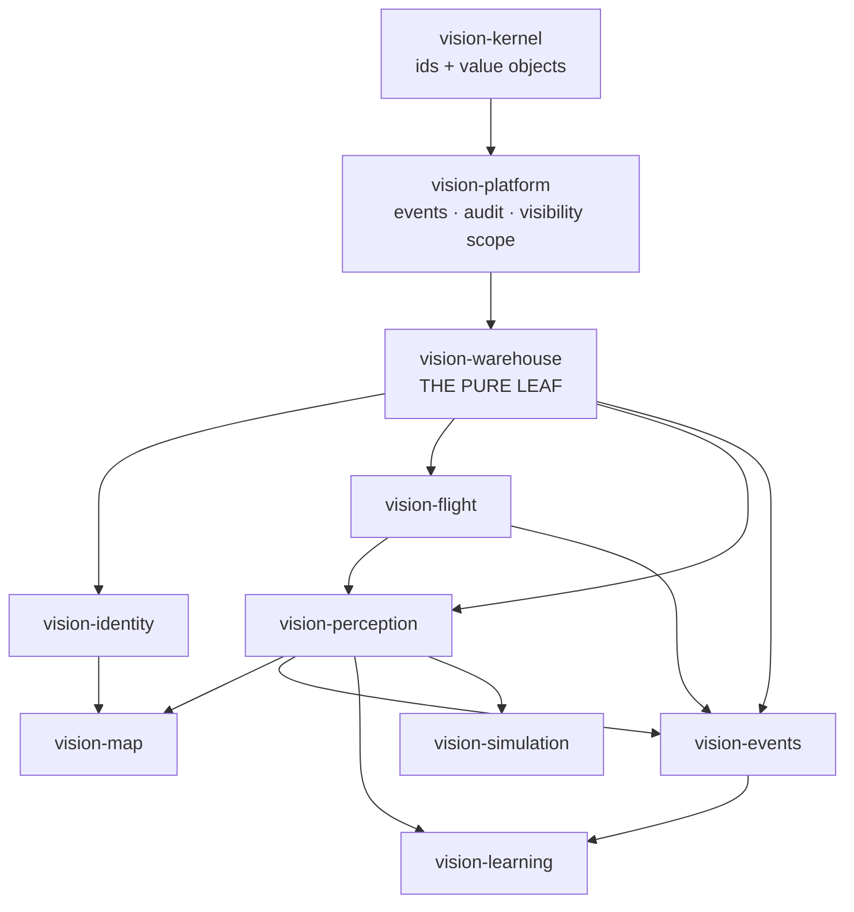

# E2E-FLOW-AUDIT — domains, features, and what to do next

**Audited 2026-09-05** against `master` @ `423a9e13` (the four-feature stack `auth-roles` →
`source-onboarding-2` → `track-follow` → `crew-control` had just merged). Context and method:
[`E2E-FLOW-AUDIT-CONTEXT.md`](E2E-FLOW-AUDIT-CONTEXT.md).

Five end-to-end flows were walked across all 26 modules. Every claim below is labelled:

- **[verified]** — read in the source this session, file named.
- **[doc]** — asserted by a `MODULE.md` or plan doc, not independently re-checked.

That distinction is not pedantry. This audit began the same day a merge was blocked by five
`MODULE.md` entries that all agreed a build gate was "pre-existing" — measuring against `master`
proved it was not. **A doc's own status line is not evidence.** Three more instances of the same
drift turned up here (§5.3).

---

## 1. The domain map

| Domain | Owns | Explicitly does **not** own |
|---|---|---|
| **vision-kernel** | Entity ids, pure value objects (`StreamDescriptor`, `GeoPosition`) | Anything third-party — zero deps |
| **vision-platform** | Cross-cutting seams: `EventType`, audit trail, `VisibilityScope`, `Capability`/`Authority` | Any business rule of a context |
| **vision-warehouse** | `Asset`, `Device`, `DeviceCategory`, `AssetUsage`, inventory/custody, discovery candidates | Any other context — the pure leaf |
| **vision-identity** | `User`, `Group` tree, `Membership`, `Role`, assignment, scope resolution | Per-asset *verb* authority (that is api-side) |
| **vision-flight** | Flight sessions, telemetry fold, geofence, manual control, **crew seats** | Video; who may *see* an asset |
| **vision-perception** | `StreamPipeline`, sampling, detection, tracking, follow, device probing | Inference itself (that is cv-service) |
| **vision-map** | Layers, grants, marks, drawings, affiliation, verify/promote | Telemetry acquisition |
| **vision-events** | Replay capture, usage timeline, evidence package | Anything writing back — a pure downstream sink |
| **vision-learning** | Datasets, labeling, training runs, model promotion | Serving inference |
| **vision-simulation** | Synthetic flight-plan/telemetry orchestration | Real vehicles |

**Adapter groups** (never depend on each other, by rule): `video-input/` (rtsp, mjpeg, v4l2) ·
`video-output/` (publish-hls) · `drone-link/` (mavlink-core, mavlink) · `cv/` (grpc, tiles, proto,
cv-service) · `device-discovery/` · `storage/` · `simulation-sources/`. **Station**: `vision-api`
(54 controllers / 170 endpoints) [verified], `vision-app` (wiring), `vision-web` (51 routes, 20 nav
entries) [verified].

**One shape worth questioning:** `perception → flight`. A stream pipeline depends on flight sessions
because `UsageTracker` opens an `AssetUsage` when a stream starts. It works, but it means "video"
cannot be deployed without "flight" — relevant to the camera-only product the declined
CAMERA-FIRST plan wanted, and to DOMAIN-SEPARATION's role-flagged deploy.

---

## 2. The five flows

### A. Add a camera or vehicle → watch its video

`DeviceDiscoveryPort` scanners (mDNS · ONVIF WS-Discovery · V4L2 · mediamtx paths) → 30 s
`DiscoveryInboxRunner` sweep → `DiscoveryCandidate` → `/add-source` wizard (source → prove →
identify → attach → hand-over) → `Asset` + `Device{StreamDescriptor}` → `POST /api/assets/{id}/stream`
→ `VideoSourceRegistry` picks the adapter whose `supports()` matches → `StreamPipeline` →
`StreamPublisherPort` → mediamtx → browser over **HLS (proxied), WHEP/WebRTC (direct) or RTSP** [doc].

Two publish modes: `MediamtxStreamPublisher` (the JVM decodes and re-encodes) or
`MediamtxProxyPublisher` (mediamtx dials the camera; the JVM never touches frames) — chosen by
`PublisherRouter`, proxy **only** when `protocol=="rtsp"` and the flag is on [doc]. That second mode
is the single most important scalability lever in the system and it is reachable by one protocol.

**Friction** [doc, `ZERO-CONFIG-ONBOARDING-CONTEXT.md`]: ESP32 rover+camera costs **5 off-app + ~14
in-app steps**, including a vision-host IP hard-coded in firmware that breaks on DHCP renewal; USB
camera is 0 + ~6 and "still ends in a form". Discovery is poll-only, so a plugged-in device can take
30 s+ to appear. **A device whose IP moves mints a second candidate, forever un-merged** — an
accepted-unfixed residual.

### B. Controller → drone

`/manage/controller` wizard → `ControlProfile` (JPA, JSON column) → `RcInputSource` (gamepad ·
on-screen · keyboard) → `/ws/manual-control` → `mayFly` + `SeatAccess` → `ChannelMap.apply` →
`RC_CHANNELS_OVERRIDE` at 20–50 Hz with a 300 ms watchdog [doc]. Arm/disarm/mode take a *different*
path: REST → `FlightCommandPort` → `COMMAND_LONG` with 700 ms × 3 retries [doc].

**The neutral-stick arm gate is UI-only** [doc] — `neutral-gate-logic.ts` disables the button; there
is no server-side twin, because arm and manual-control share no collaborator. The vehicle's own
pre-arm check is the real interlock.

**The hard ceiling** [verified, `DefaultManualControlService.java:155` + `ApplicationServiceWiring.java:284`]:
`activeSession` is a single field on a **singleton** bean, and `engage()` throws if it is non-null
**regardless of which asset is being engaged**. So: **one RC session per application instance, fleet-wide.**
Ten vehicles and five operators means one operator flying and four refused. Crew seats arbitrate
*who drives one aircraft*; they do not touch this. Four separate plans name it (FLEET-RADIO F9,
CREW-CONTROL D2, AUTH-ROLES D17, FLEET-MIGRATION MD4) and none has fixed it.

### C. Frame → detection → track → follow → trained model

`StreamPipeline` samples `everyNth = max(1, round(measuredFps / inferenceFps))`; detection is
**opt-in** (`PipelineConfig.detectionEnabled` off by default) **and** demand-gated
(`DetectionDemandPort`, fail-open) [verified]. Transport is push (bidi gRPC `DetectStream`,
latest-wins mailbox, non-blocking contract) or pull (the worker dials mediamtx itself — the real fix
for backend-decode-is-O(streams), and it is **done**) [doc]. `CvChannelSupervisor` bounds recovery to
~20 s [doc].

Follow is real for `REQUESTING|HOLDING|COASTING|LOST|RELEASED` + a client-side ×2 digital crop (off
by default). **Gimbal follow does not exist** — there are zero gimbal commands in the MAVLink TX path
[doc]. "Fly toward the target" is a permanent, deliberate non-goal.

Training is genuine and human-gated: a successful run yields `CANDIDATE`, never auto-`LIVE`. **Known
gap**: in a split (`cv-split`) deployment a promotion does *not* reach the running inference process
until it restarts [doc].

### D. Who may do what

`Role{VIEWER,PILOT,MANAGER,ADMIN}` → `RoleAuthority#capabilitiesOf` → `Capability{OPERATE_PAYLOAD,
COMMAND_FLIGHT,MANAGE_FLEET,MANAGE_ORG}` + `VisibilityScope{UNBOUNDED,GROUPS,ASSIGNED_ASSETS}`
wrapped as `Authority`; per-asset verbs via `AssetAuthority.mayFly/mayOperateCamera/mayForceSeat`;
`Seat{FLIGHT,CAMERA}` answers *who holds the verb right now* [doc]. `VisibilityScope`'s old authority
predicates were deleted outright, not deprecated in place [doc] — good hygiene.

There is deliberately **no `@PreAuthorize`**: every gate is a hand-written call from a controller into
a `security/*` collaborator, with an `EndpointAuthorizationTest` BFS forcing each new handler to reach
one of them [doc]. The honest limit, stated in its own doc: it proves *a* check exists, never the
*right* one — and **12 handlers sit in its `TEMPORARY_UNSCOPED` ledger with no authority check at all**
[doc], including `AssetController#telemetry` and `UsageTimelineController#timeline`.

**It is not multi-tenant.** One fixed-id root group, one org tree, no tenant column anywhere [doc] —
despite `ARCHITECTURE.md` §6 being titled "Identity & Access Model (Multi-Tenancy)".

### E. Session → telemetry → map → replay

`AssetUsage` is opened only by `UsageTracker` (stream start, or operator `engage` which promotes and
backfills `pilotId` — first attribution wins) [doc]. **Nothing closes a usage on pipeline failure**;
the `UsageIdleCloseService` sweep (10 min idle, 60 s period) is the only recovery, and it stamps
`endedAt` at the last real sample, never `now()` [doc] — honest design.

Telemetry → SSE topics (`telemetry:<assetId>`), coalesced ~150 ms, `Last-Event-ID` resume, authorized
at subscribe **and re-checked on delivery** [doc]. The map runs a **second, deliberately different**
access model (`MapAccessPolicy`, identity/group-based) because `VisibilityScope.includesGroup` is
hard-`false` for a PILOT, which would hide every TEAM layer from pilots [doc].

The evidence package is the best-designed surface in the system: eight parts in fixed order, each
stamped `PRESENT|ABSENT|TRUNCATED|FORBIDDEN`, `complete` true only if all are PRESENT, and `FORBIDDEN`
produced by catching the real authorization failure rather than re-deriving it [doc].

---

## 3. What breaks first, in order

| # | Ceiling | Evidence | Bites at |
|---|---|---|---|
| 1 | **One RC session per JVM, fleet-wide** | [verified] singleton + single field | **2 concurrent pilots** |
| 2 | **cv-service `InferenceGate`** semaphore `min(2, cpu//2)`, shared by every stream, against a 2 s client timeout → sessions tear down and back off | [doc] | ~5–10 detecting streams |
| 3 | **Per-stream platform threads** (`new Thread`, not virtual — [verified] in all three ingest adapters) + JavaCV's **process-wide static lock** in grabber/recorder `start()`, so one hung source blocks every other stream's open/reconnect | [verified] / [doc] | tens of streams |
| 4 | **`detection_results` volume** — 222 GB/yr at 10 assets, 2.22 TB at 100; no partitioning; no retention on most tables; `db_audit_log` amplified ~33 GB/yr by 1 Hz `asset_usages` updates | [doc] `PLATFORM-AUDIT-DB` | weeks, at 10 assets |
| 5 | **Single-node assumptions** — `LiveUpdateRegistry` is process-local ("multi-instance SSE fan-out out of scope"); seat registry, geofence/battery/divergence latches all in-heap | [doc] | the 2nd app node |
| 6 | `JpaDetectionRepository#query()` fetches the whole result set with no `setMaxResults`, and allows time-range-only queries with no supporting index | [doc] | one wide query |

Note the shape: **#1, #2 and #5 are all "a field on a singleton" problems**, not algorithmic ones.
That is good news — they are bounded, well-understood refactors, not rewrites.

---

## 4. What this costs the next feature

- **A new video protocol**: one clean port (`VideoSourcePort`), but 4–6 real files across modules —
  adapter module + `vision-app` wiring + properties + `application.yaml` + web protocol picker.
  Adapters deliberately duplicate grab-loop/backpressure boilerplate, by rule [doc].
- **A new permission-bearing feature**: genuinely one place per axis — a `Capability`, a row in
  `RoleAuthority#capabilitiesOf`, one `authority.mayX(...)` call [doc]. This is the best seam in the
  codebase.
- **A new event type**: enum append + producer + two web maps; three precedents shipped with zero
  signature breakage [doc].
- **A new CV capability**: `cv.proto` → cv-service → adapter codec → perception → web. Multi-module
  and multi-language by design [doc].
- **A new map layer kind**: moderate — COP's "exactly one" invariant lives in application code, not a
  schema constraint [doc].

---

## 5. Cross-cutting findings

### 5.1 Seven built features ship dark [verified]

Of 17 `vision.*.enabled` flags, 9 default off, and `docker-compose.yml` overrides only
`VISION_CV_ENABLED` and `VISION_AUTH_ENABLED`. So in the deployed configuration these are **off**:
`crew` · `training` · `geo.fixed-camera` · `geo.visual` · `onboarding.probe` · `onboarding.passport` ·
`api.rate-limit`. Several are built *and live-verified*. For a product whose stated priority is easy
access to features, a built feature nobody can reach is the most expensive code in the repo.

### 5.2 Refusals speak in internal vocabulary

`VEHICLE_UNIDENTIFIED`, `SEAT_HELD` and similar reach the operator as codes rather than next steps
[doc]. Reads hide existence (404, deliberate); commands 403 honestly. But there are **two access
mental models** — `VisibilityScope`/`Authority` everywhere, `MapAccessPolicy` on the map — a
defensible divergence that still forces both an engineer and an operator to hold two models.

### 5.3 Documentation drift, in the authoritative documents

- `ARCHITECTURE.md` §6 describes three roles (`USER`/`MANAGER`/`SUPERUSER`) carried in a **JWT**.
  Shipped: four roles → capabilities, with **Postgres-backed sessions** [doc/verified].
- `ARCHITECTURE.md` §3 promises **virtual threads** per stream. All three ingest adapters use
  `new Thread(...)` [verified].
- `ARCHITECTURE.md` §2 cites `openapi.yaml`. **It does not exist** [verified] — the same gap
  `docs/plans/README.md` row 7 has recorded for weeks.
- `AUTH-ROLES-PLAN.md` header still reads *"spec only — nothing here is built"* while its code is
  merged to `master` [doc, cross-checked against verified code].

---

## 6. Proposals

Ranked by the owner's stated priorities: **usability and easy access first**, scalability close
behind, then the cost of the next feature. Each names where it lands. Effort: S ≤ 1 wave,
M = 2–4, L = a plan of its own.

### Tier 1 — usability and access (do these first)

| # | Proposal | Why | Where | Effort |
|---|---|---|---|---|
| **U1** | **Decide, per flag, "on or delete"** for the 7 dark features; enable in `docker-compose.yml` what survives | The cheapest possible feature delivery — the code is written and in several cases live-verified. Nothing here needs new product work | `vision-app` config, compose | **S** |
| **U2** | **One refusal vocabulary.** Every denial answers *what happened · why · what to do next*, with the internal code kept only as a diagnostic field | The single most repeated friction across flows B, C and D | `vision-api` + `vision-web` | **M** |
| **U3** | **Close the 12 `TEMPORARY_UNSCOPED` handlers** — each either gets an authority check or is documented as deliberately open | Today `AssetController#telemetry` and `UsageTimelineController#timeline` answer to anyone authenticated | `vision-api` | **M** |
| **U4** | **Make discovery push, and merge candidates by identity** rather than address, so an IP change stops minting a permanent duplicate | Removes the two worst onboarding papercuts; the mediamtx-path scanner already proves the passive pattern | `device-discovery`, `vision-warehouse` | **M** |
| **U5** | **Replay search** — filter by asset, pilot, date, outcome, instead of a 20-row recent list | "Find what happened last Tuesday" is currently unanswerable | `vision-events`, `vision-web` | **S–M** |

### Tier 2 — scalability (the three singleton problems)

| # | Proposal | Why | Where | Effort |
|---|---|---|---|---|
| **S1** | **Make manual control per-asset**: replace `activeSession` with a keyed registry (the `SeatService` shape already exists in the same context) | Lifts the platform from **one** concurrent pilot to N. Highest ratio of value to effort in this document | `vision-flight` | **S–M** |
| **S2** | **Externalise per-JVM state** — seats, geofence/battery/divergence latches, and the SSE registry — so a second app node is possible. Sessions already did this via Postgres; follow that precedent | Nothing else in the roadmap can scale horizontally until this exists | `vision-flight`, `vision-api` | **L** (DOMAIN-SEPARATION W2/W3 already scopes it) |
| **S3** | **Retention and partitioning before the disk fills** — `detection_results` first, then the `db_audit_log` amplification from 1 Hz `asset_usages` updates. Bound `JpaDetectionRepository#query()` | Free today only because the tables are empty; ~14 days of headroom was measured at audit time | `storage/persistence` | **M** |
| **S4** | **Widen the proxy publisher beyond RTSP**, and finish CV-SCALE S3/S4 (model reload + pooled least-loaded inference) | Proxy mode is the one path where the JVM never decodes; it is currently reachable by one protocol | `video-output`, `cv/grpc` | **M** |

### Tier 3 — make the next feature cheaper

| # | Proposal | Why | Where | Effort |
|---|---|---|---|---|
| **N1** | **Generate `openapi.yaml` from the 170 endpoints** and publish it | `ARCHITECTURE.md` has promised it for months; it is the prerequisite for webhook/MQTT egress, machine tokens and any integration | `vision-api` | **S** |
| **N2** | **Reconcile `ARCHITECTURE.md` with what shipped** — §6 identity, §3 virtual threads, §2 openapi — and fix `AUTH-ROLES-PLAN`'s header | These are the first documents a new contributor (or agent) reads; all three mislead today | docs | **S** |
| **N3** | **Give the neutral-stick gate a server-side twin**, or state in the doc that it is advisory | A safety interlock that exists only in the browser is one API call from being absent | `vision-flight` | **S** |

### Recommended first cycle

**U1 + S1 + N2.** All three are S-sized, they touch disjoint files, and together they change what the
product *is*: every built feature reachable, more than one pilot able to fly, and the architecture
documents telling the truth. S3 should be scheduled before any sustained multi-asset flying, because
its clock starts the day detection is switched on.

---

## 7. What this audit did not check

- No live run. Every claim is source- or doc-derived; nothing here was exercised against a running
  station, and the flow-B ceiling in particular deserves a two-operator live confirmation.
- The DB volume numbers are `PLATFORM-AUDIT-DB`'s, measured against a dev container migrated only
  through V16 — the shape is trustworthy, the absolute figures less so.
- `drone-link/mavlink` (1202 lines of `MODULE.md`) was read structurally, not exhaustively.
- Nothing in `cv-service`'s Python was executed; the `InferenceGate` ceiling is read, not measured.
