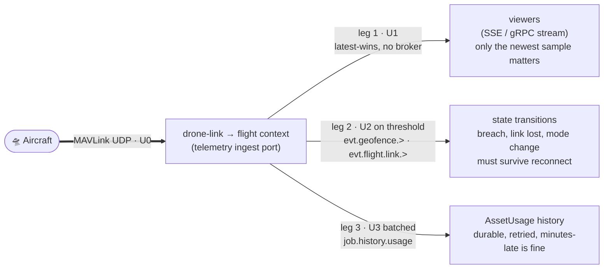
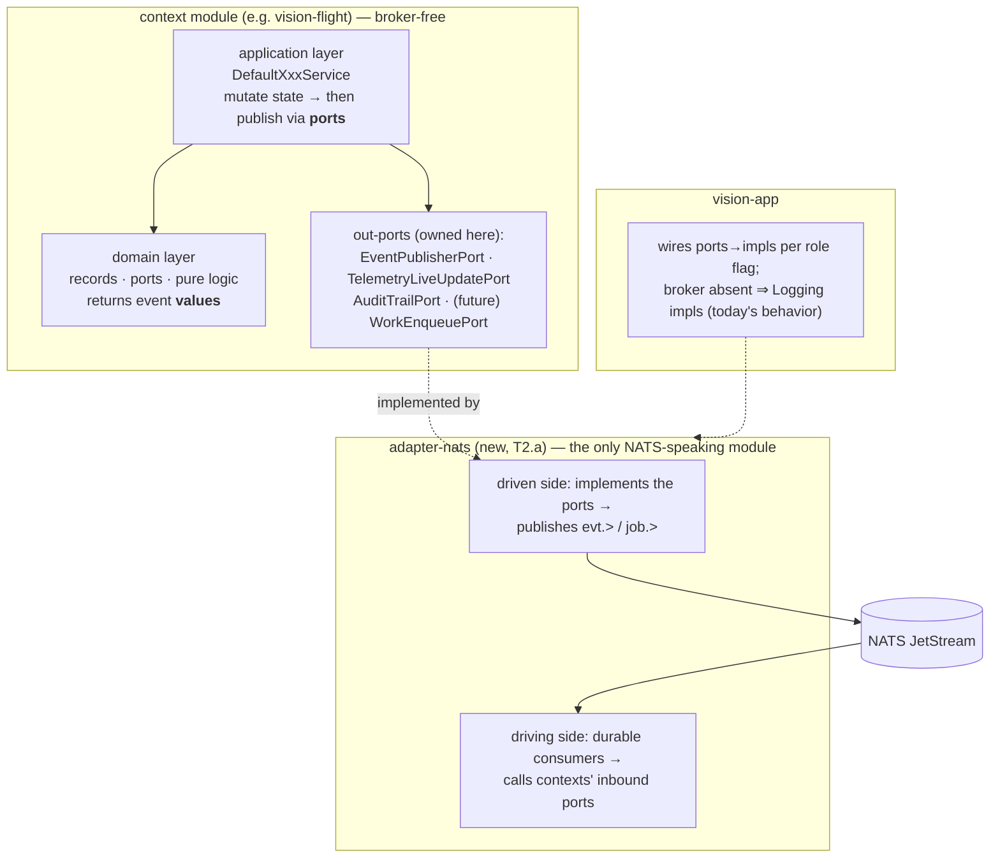
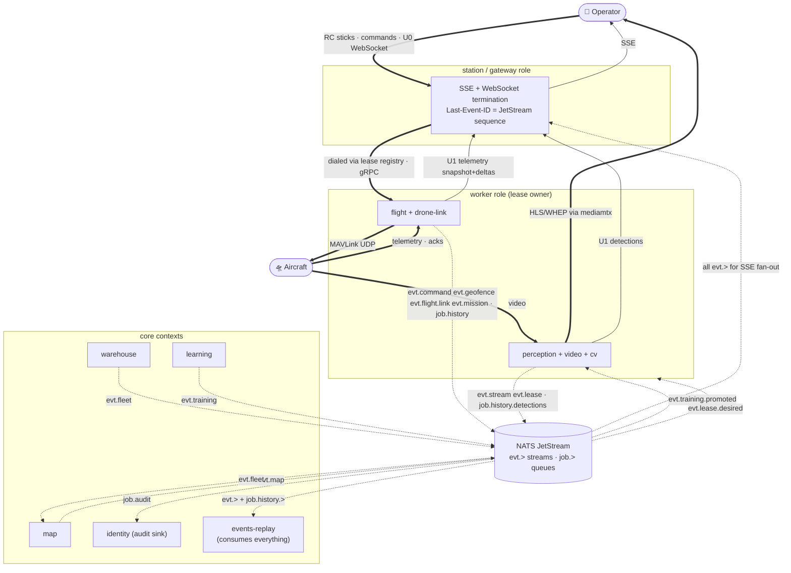

# EVENT-TOPOLOGY — event-driven flow between contexts (proposal)

**Status:** ACCEPTED 2026-08-15 — folded into FLEET-MIGRATION-PLAN as MD8 (subjects wired into
T2.a/T3.a/T4.b). Refines DOMAIN-SEPARATION §3/§7; changes nothing already pinned.
**Date:** 2026-08-15.
**Driver:** publish once, let consumers subscribe — instead of the producer knowing (and being
rewired for) every consumer. Straight connection stays only where the law demands it: the drone
control loop.

## 1. The law (already pinned — restated as the sorting rule)

Every piece of data is classified **by what happens if it is late**, and the class picks the
transport. This table is DOMAIN-SEPARATION §3, unchanged:

| Class | What | Deadline | Transport | If late |
|---|---|---|---|---|
| **U0** control loop | MAVLink cmd/ack, RC frames, video frames, watchdog | ≤ 50 ms | UDP / gRPC / WebSocket — **direct, never a broker** | worse than useless — discard |
| **U1** live state | telemetry to viewers, detections to viewers, fleet liveness | ≤ 300 ms | direct subscription (gRPC stream / SSE), **latest-wins, no broker** | overwrite silently |
| **U2** collaboration events | marks, lifecycle, lease changes, geofence breach, command outcomes | ≤ 2 s | **NATS JetStream durable stream** (`evt.>`) | still valuable — replay on reconnect |
| **U3** workflow & history | audit, history batches, training jobs, scan requests | sec–min | **JetStream work queue** (`job.>`, ack/retry/DLQ) | fine — it is a job |

Your framing maps onto it directly: *"straight connection for drone control"* = U0.
*"Topics for events"* = U2. *"Topics for commands"* = split below (§3). The one correction:
*"topics for telemetry"* is not one topic — see §2.

## 2. The key refinement: one telemetry sample, three legs

A single MAVLink telemetry sample serves three consumers with three different deadlines. Putting it
on one broker topic would force the slowest consumer's semantics on the fastest. Instead it forks
**inside the flight context** after ingest:

Same pattern applies to detections (U1 to viewers · U2 detection-event open/close · U3 history
batches) — the classifier is always the consumer's deadline, never the data type.

## 3. Commands: three different things hide under one word

| What | Class | Transport | Why |
|---|---|---|---|
| **Command execution** (arm/mode/RTL → vehicle, ack back) | U0 | direct: caller → worker holding the lease (dialed via lease registry, gRPC) → MAVLink UDP | ack correlation needs the live session; a queued command to an aircraft is a hazard, not a feature |
| **Command outcomes** (accepted/denied/timeout per vehicle) | U2 | `evt.command.>` *(new subject, this proposal)* | fleet dashboard chips, audit, events-replay all want them without the commander knowing they exist |
| **Desired state** ("these streams should run", "this asset assigned here") | U2 | `evt.lease.desired` (already in §7) | reconcile-loop, not RPC: core states intent once, workers converge — survives worker restart |

So: **no `cmd.>` request topic.** Fleet fan-out (FLEET-MIGRATION T3.a) is a server-side service
making N direct calls and publishing N outcomes to `evt.command.>` — the broker carries the *news*,
never the *trigger* of a U0 action.

## 4. Subject taxonomy

Convention: `evt.<domain>.<entity>.<verb>` for streams, `job.<queue>` for work queues. Pinned
subjects (DOMAIN-SEPARATION §7) unchanged; this proposal adds three:

| Subject | Kind | Producer → Consumers | Retention | Status |
|---|---|---|---|---|
| `evt.fleet.>` | stream | warehouse → gateways, events-replay, map | 24 h | pinned §7 |
| `evt.map.>` | stream | map → gateways (scope-filtered at gateway) | 24 h | pinned §7 |
| `evt.stream.>` | stream | workers → gateways, events-replay | 24 h | pinned §7 |
| `evt.lease.>` (+`.desired`) | stream | perception/core → gateways, workers | 1 h | pinned §7 |
| `evt.detection-events.>` | stream | events-replay → gateways | 24 h | pinned §7 |
| `evt.geofence.>` | stream | flight → gateways, events-replay | 24 h | pinned §7 |
| `evt.training.>` | stream | learning → gateways, perception (model re-arm) | 7 d | pinned §7 |
| `job.audit` | work queue | everyone → identity | until ack, DLQ | pinned §7 |
| `job.history.detections` / `.usage` | work queue | workers → events-replay | until ack, DLQ | pinned §7 |
| **`evt.command.>`** | stream | flight (workers) → gateways, events-replay, identity-audit | 24 h | **new — feeds T3 outcome chips** |
| **`evt.flight.link.>`** | stream | flight → gateways, warehouse (fleet liveness), events-replay | 24 h | **new — vehicle heard/lost/reboot; today implied by polling** |
| **`evt.mission.>`** | stream | flight → gateways, map, events-replay | 7 d | **new — T4: created/validated/uploaded/item-reached/completed** |

Standing rules stay: consumers idempotent (at-least-once); payloads carry **facts and ids, never
binaries**; JetStream sequence is the only SSE resume cursor; U1 has **no broker presence** —
reconnecting viewers get a snapshot from the owner, not a replay.

## 5. Who is allowed to touch the broker (layer rules)

The hexagon does not bend for NATS. Same rule as Spring: **broker client code only in adapters/app,
never in a context.**

Consequences worth stating:

- **Contexts already own the right ports** (shipped in W1): `EventPublisherPort` + the five
  `*LiveUpdatePort`s the god-port split into. Event-driving is an adapter swap, not a context rewrite
  — that was the point of W1.
- **Inside a context, layers stay direct calls** (controller → service → lower services → repos).
  Events are for *between* contexts and *out* to viewers — never a context talking to itself
  through the broker.
- **Publish-after-commit:** once persistence hardening (T1) lands, U2/U3 publishes ride a
  transactional outbox so a crash between DB-commit and publish can't lose the event. Until then,
  best-effort publish is accepted (same as today's contract: "must not throw, must return quickly").
- **Same-JVM is not special:** single-node compose runs the same code; NATS loopback latency is
  sub-ms. One topology, not two.

## 6. The full flow

**Bold = U0 straight connection (the only ones). Thin = U1 direct latest-wins. Dotted = broker.**
Read it as your requirement satisfied: flight publishes a geofence breach *once*; gateway SSE,
events-replay, and audit each consume it independently — flight knows none of them.

## 7. Shipped today vs this target

| Seam | Shipped today | Target | Carried by |
|---|---|---|---|
| Event out-ports in contexts | ✅ `EventPublisherPort` + five `*LiveUpdatePort`s (W1) | unchanged — the seam was built for this | done |
| Event transport | `LoggingEventPublisher` (log line, then silence) | `adapter-nats` publishing `evt.>`/`job.>` | T2.a |
| Broker in deploy | none | NATS in docker-compose, degradation-tested (broker down ⇒ flying/viewing intact) | T2.a |
| SSE fan-out | in-heap ring buffers, process-local, `everDropped` | JetStream sequence as resume cursor; ring buffers retire for U2 | T2.b |
| Web live data | 2 s per-asset pollers + 5 s fleet poll | SSE-fed; polls demoted to reconnect fallback | T2.c |
| Telemetry to viewers | poll → REST read | U1 direct SSE (deliberately **not** broker) | T2.b/c |
| Telemetry history | synchronous per-sample writes | U3 `job.history.usage` batches | T2.a |
| Audit | in-memory list, lost on restart | `job.audit` queue → identity's JPA store | T1.b + T2.a |
| Command outcomes | return value visible to caller only | `evt.command.>` fan-out to UI chips + audit + replay | T3 (new subject) |
| Vehicle link liveness | implied by polling fleet summaries | `evt.flight.link.>` events | new, with T3 |
| Mission lifecycle | n/a (no missions yet) | `evt.mission.>` | T4 |
| Cross-context reads | in-process calls (W1) | stay in-process within a role; events only where consumers shouldn't be known | by design |

## 8. What must never ride the broker (the anti-list)

Video frames, RC channel frames, MAVLink command/ack exchanges, watchdog trips, per-sample
telemetry to viewers. Each is U0/U1: by the time a queue delivers it, its value is negative —
the newest value has already replaced it. This list is the reason `drone-link/` keeps a straight
line to the aircraft in every diagram, and it is load-bearing, not an implementation shortcut.
