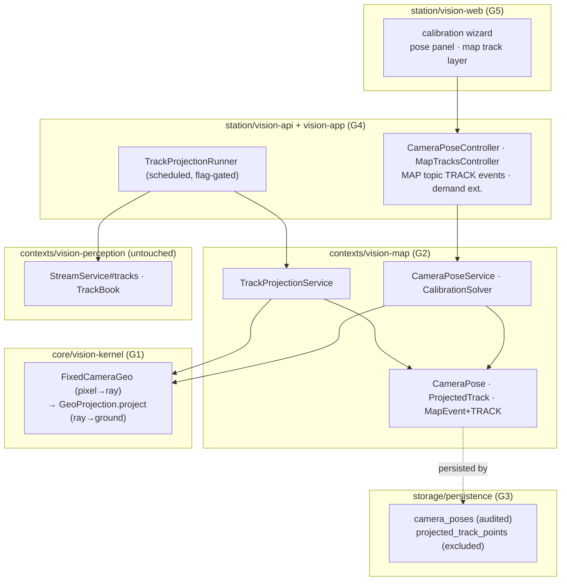

# FIXED-CAMERA-GEO-CONTEXT — what exists, what was measured, what is assumed

Grounding for `docs/plans/active/FIXED-CAMERA-GEO-PLAN.md` (S2, `docs/main/TWO-TARGETS-PLAN.md` §S2,
matrix order #1 in `docs/main/MASTER-MATRIX.md` §11). Everything below marked **measured** was read
from the file cited on 2026-08-19, branch `feat/fixed-camera-geo` off `master` (`e6f1d18e`).
Everything marked **assumed** was not verified and the plan says so where it matters.

---

## 1. The existing geo math — measured, and it does NOT do what S2 says

`core/vision-kernel/src/main/java/com/drones/vision/kernel/GeoProjection.java`:

- `project(GeoPosition drone, double headingDegrees, double altitudeMeters, double depressionDegrees)`
  — spherical destination-point projection of **one ray: the boresight**. Ground range =
  `agl / tan(depression)`, depression required in `(0, 90]`. Its own javadoc (lines 4–9) states it
  plainly: *"no camera-intrinsics data exists anywhere in the platform, so a detection's position
  within the frame never moves the projected point."*
- `aimFrom(Telemetry, fallbackDepression)` → `CameraAim(bearing, depression, agl, measured)` — the
  gimbal-vs-airframe precedence resolver (GEO-POSE wave V1/V3). Still boresight-only.
- `bearingDistance(GeoPosition from, GeoPosition to)` → `BearingDistance(bearingDegrees,
  distanceMeters)` — great-circle initial bearing + haversine distance. **This is the primitive the
  calibration solver needs** (map point → measured bearing/range from the camera) and it exists.
- The destination-point formula (`destinationPoint`) is **private**; the public 4-arg `project` is
  the reuse seam — a per-pixel projector can compute a per-pixel `(azimuth, depression)` and
  delegate to it, keeping one source of truth for the spherical math.

**Verdict on the S2 prose's core claim** (*"turning a pixel into a map coordinate is already-solved
math you have shipped"*): the *ray-to-ground* half is shipped; the *pixel-to-ray* half — FOV,
aspect, per-pixel angular offset — does not exist anywhere and is the genuinely new math. It also
does handle oblique views in the trigonometric sense (any depression in `(0,90]`), but nothing
guards the near-horizon regime where `agl/tan(θ)` explodes: at 3 m AGL and θ=1°, range ≈ 172 m and
d(range)/dθ ≈ 9.8 m per 0.1° of angular error. The plan makes per-pixel projection its own wave
(G1) with an explicit horizon guard and an uncertainty model.

## 2. Tracking as delivered — measured

`contexts/vision-perception/MODULE.md` + `.../application/pipeline/TrackBook.java`:

- `Detection` carries a nullable `TrackRef(trackId≥1, state, source, velocityX, velocityY,
  ageFrames, reupdated)`; `TrackedObject(trackId, detection, firstSeen, lastSeen)` is the
  application-side track-book entry.
- `StreamService#tracks(StreamId)` → `List<TrackedObject>` — forgiving (empty for unknown stream);
  exposed at `GET /api/streams/{streamId}/tracks`
  (`station/vision-api/.../controller/StreamController.java:240`).
- **`TrackBook`'s own javadoc (lines 31–51) names this exact feature as planned consumer #2**:
  *"Geo / COP (TWO-TARGETS §S2) — box bottom-center plus camera pose → a ground coordinate → a map
  mark carrying the track id. Consumer-local knowledge it adds: camera lat/lon/AGL/yaw/pitch/FOV and
  GeoProjection."* Invariant P3 forbids putting any geo/pose/FOV concept into perception — the
  consumer brings that knowledge. The seam is `StreamService#tracks` (poll), not a new push port.
- Tracking mode defaults to `ASSOCIATE` since TRACKING wave T8 (`PipelineConfig.defaults()`), but
  **detection itself defaults OFF per stream** (`detectionEnabled=false` since CV-DEMAND wave D1)
  **and** is demand-gated (`DetectionDemandPort`, implemented by
  `station/vision-api/.../live/LiveAndPollDetectionDemand.java`). No detection ⇒ no tracks ⇒
  nothing to project. The plan must treat "projection is running" as detection demand and surface
  the `DetectionState` (`OFF | IDLE_NO_VIEWERS | RUNNING`) honestly in the calibration UI.

## 3. The COP as delivered — measured

`contexts/vision-map/MODULE.md`:

- `Mark(id, layerId, position, kind, affiliation, label, note, ownership, createdAt, status,
  source, verification)` — a **control-plane record**: verified, promoted, audited (the `marks`
  table has a `db_audit_log` trigger, see §5), draggable, with a review lifecycle.
- Layers + grants: `MapLayer(kind COP|TEAM|PERSONAL)`, `MapAccessPolicy` (identity/group-based, not
  `VisibilityScope` — a deliberate, documented decision; do not re-litigate),
  `LayerResolver#copLayerId()` find-or-creates the single COP layer.
- Live channel: `MapLiveUpdatePort#publishMapEvent(MapEvent(entity MARK|DRAWING|LAYER, action
  CREATED|UPDATED|CLEARED|DELETED, layerId, payload))` — payload runtime-type-validated per entity;
  `CLEARED` today valid only for `MARK`. Delivery is **scoped per connection by layer
  visibility** (`LiveTopicKind.MAP` in vision-api, which replaced the `marks` topic outright).
- Map's context dependencies (measured DAG, `docs/plans/active/DOMAIN-SEPARATION-W1.md` §16):
  `map → identity(2), perception(1)`. **Map does not depend on warehouse**, and
  `ContextArchitectureTest` (W1.1) freezes the edge *set* — a new edge fails CI. New references
  inside an existing edge are fine (DRONE-ONBOARDING §7 used the same rule).
- Map context declares **no `AuditTrailPort` dependency today** (MODULE.md Gotchas) — a pose-write
  audit is this context's first, and its service constructors sit at the 5-arg ceiling.

## 4. Asset attributes vs a typed table — measured

- `Asset.attributes` is `Map<String,String>`, free-form, operator-authored
  (`contexts/vision-warehouse/MODULE.md`).
- `docs/plans/active/DRONE-ONBOARDING-PLAN.md` §5.2 (decision D5) already ruled on exactly this
  shape of question: machine-produced, typed, numeric data does **not** go into `Asset.attributes`
  ("what a human wrote down"); it gets its own record + port + table (`VehicleProfile` precedent).
  A calibrated pose is solver-produced, six-numbers-typed, and validated — same side of the line.

## 5. Persistence and the database-audit constraint — measured

- Migrations run V1..V21 (`storage/persistence/src/main/resources/db/migration/`); **next is V22**.
- `V21__db_audit_log.sql` classifies every table: 17 audited control-plane tables (incl. `marks`,
  `map_layers`, `geofence_zones`, `vehicle_profiles`), 9 excluded high-volume/append-only tables
  (`telemetry_samples`, `detection_results`, `detection_events`, …). A generic `audit_row_change()`
  trigger writes old/new row JSON per change. `DbAuditLogCoverageTests` (docker-gated, in
  `storage/persistence`) **fails on any new table left unclassified**.
- Consequence the S2 prose did not price in: `marks` is audited. A tracked car updated in place as
  a `Mark` at even 1 Hz writes ~3600 `db_audit_log` rows per car-hour — the audit log drowns in
  exactly the append-heavy traffic V21's excluded list exists to keep out. This single fact drives
  the plan's central design decision (projected tracks are not `Mark` rows).

## 6. Ingest without new hardware — measured

- `video-input/rtsp/.../FfmpegVideoSource.java` supports protocol `"file"` (`PROTOCOL_FILE`,
  line 56) — a video file on disk is a first-class stream source. `adapter-mjpeg`, `adapter-v4l2`,
  `adapter-simulation` also exist. The demo is therefore fully buildable against a traffic video
  file played through the existing pipeline; the €50 USB camera is the operator's own final step.
- **Assumed, not verified**: that YOLO in cv-service detects cars acceptably in a downloaded street
  video. It detects `car` as a stock class, so the risk is low, but no such video was run.

## 7. Feature-flag and wire-contract precedents — measured

- `vision.onboarding.probe.enabled=false` (application.yaml:549–556): flag off ⇒ endpoints answer
  **409 naming the flag**, wiring never constructs the feature, every pre-existing test green by
  construction. The plan copies this exactly (`vision.geo.fixed-camera.enabled`).
- Authority doctrine (OPS-UX, DRONE-ONBOARDING §6.1): scoped reads hide with 404; writes on a
  visible-but-not-manageable asset are 403 and audited.

## 8. Seam map (who talks to whom)

Direction check: no new context edge. `map → perception` stays as-is because the *runner in
vision-app* (which legally sees every context) fetches tracks and hands them to map's service —
perception is never imported anywhere new inside `contexts/vision-map`.

## 9. What was verified vs not

| Claim | Status |
|---|---|
| `GeoProjection` is boresight-only, per-pixel math absent | **measured** (javadoc + full source read) |
| `bearingDistance` exists and fits the calibration solve | **measured** |
| Track ids reach domain (`TrackedObject`) and REST (`/api/streams/{id}/tracks`) | **measured** |
| TrackBook explicitly plans for this consumer via `StreamService#tracks` | **measured** (javadoc) |
| `marks` table is db-audited; V22 is next; coverage test enforces classification | **measured** (V21 read in full) |
| Map context DAG position; frozen edge set; no map→warehouse edge | **measured** (§16 edge list + W1.1) |
| `file` ingest protocol exists | **measured** (`FfmpegVideoSource.PROTOCOL_FILE`) |
| Detection default-off + demand-gated; demand impl is `LiveAndPollDetectionDemand` (vision-api) | **measured** |
| cv-service detects cars well in an arbitrary street video | **assumed** — try before the demo |
| SSE `MAP` topic mechanics beyond `LiveTopicKind` javadoc (exact payload JSON) | **partially read** — G4's implementer must read `MapEventPayload` before extending it |
| Exact `AuditTrailPort` wiring available to map services in vision-app | **assumed** wireable (every other context does it); constructor-ceiling note taken from map MODULE.md |

## 10. Open questions for the operator

1. **Target layer**: projected tracks default to the COP layer (visible to everyone who sees the
   COP). Per-camera override to a TEAM layer is in the contract (`targetLayerId`). Is COP-default
   acceptable for the first cut?
2. **Trail retention**: 30 min default. Long enough for the demo, short enough to stay cheap. OK?
3. **Buy the camera** (~€50 USB + €10–20 clamp mount, TWO-TARGETS hardware track) — not needed to
   build or test, needed only for the windowsill moment.
4. **A test video**: pick/record one street-traffic clip with 2–3 map-identifiable landmarks in
   frame (a corner, a pole, a crossing) so calibration can be exercised honestly against the file
   ingest before any hardware exists.
