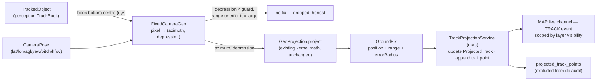

# FIXED-CAMERA-GEO-PLAN — a camera that doesn't move, and the street that does

**S2** (`docs/main/TWO-TARGETS-PLAN.md` §S2; order #1 in `docs/main/MASTER-MATRIX.md` §11).
Grounding, measured-vs-assumed, and seam map: `docs/plans/active/FIXED-CAMERA-GEO-CONTEXT.md` —
read it first; this plan does not repeat its citations.

## 0. What this plan is, and what it is not

**Goal, in the user's terms made precise:** a camera whose position and orientation are known —
entered by hand or solved from 2–3 clicked landmark correspondences — turns every *tracked*
object's bounding-box bottom-centre into a ground coordinate on the shared map, live, with a
stable track id and a trail. A camera on a windowsill; cars on the actual street, on the COP.

**What it is not:** not DEM/terrain intersection (matrix row X — flat ground is assumed and said
so), not cross-sensor fusion (C12 — explicitly the *next* cheap step, not this one), not moving
cameras (the drone path already has GEO-POSE), not lens-distortion or roll calibration, not a
mission or guidance feature. §9 lists every deferral by name.

**Every wave ends demonstrable, not merely green.** The demo path needs **no new hardware**: the
`file` ingest protocol plays a street-traffic video through the real pipeline
(CONTEXT §6). The €50 USB camera is the operator's own final, separate step.

---

## 1. Where we are

| Piece S2 needs | Exists today | The gap |
|---|---|---|
| Ray → ground point (spherical destination, range = agl/tan θ) | `GeoProjection.project` (kernel) — **measured** | none; reused verbatim as the inner step |
| Camera bearing/pose precedence | `GeoProjection.aimFrom`/`CameraAim` | drone-only (telemetry-driven); a fixed camera's pose is stored, not sampled — new record, not `CameraAim` |
| **Pixel → ray** (FOV, aspect, per-pixel angular offset) | **nothing** — javadoc says so explicitly | the genuinely new math; wave G1 |
| Map point → bearing+range from camera (calibration input) | `GeoProjection.bearingDistance` | none |
| Stable track ids in the domain and on REST | `TrackedObject`, `StreamService#tracks`, `GET /api/streams/{id}/tracks` | none; TrackBook's javadoc names this consumer and this seam |
| A shared map with layers, grants, scoped live delivery | vision-map + `LiveTopicKind.MAP` | no track-shaped payload; `MapEvent` knows MARK/DRAWING/LAYER only |
| Somewhere to hold camera pose | `Asset.attributes` (free-form strings) | wrong home by the repo's own D5 precedent — typed table needed |
| A place tracks-at-10-Hz can be written | `marks` table | **audited** — unusable for this traffic; a new excluded table needed |
| Feature-flag + 409 + flag-off-green precedent | `vision.onboarding.probe.enabled` | copy it |

**Where the S2 prose is wrong, plainly** (also reported to the caller):
1. *"already-solved math you have shipped"* — half-true. Ray→ground is shipped; pixel→ray is not,
   and `GeoProjection`'s javadoc says a detection's frame position never moves the point. G1 exists
   because of this.
2. *"publish as marks on the existing COP"* — taken literally, this floods `db_audit_log` (the
   `marks` table is triggered) and misuses a verified/promoted control-plane record for 10 Hz
   telemetry-character data. Decision D3 publishes tracks *onto the COP layer* without making them
   `Mark` rows.
3. *"camera pose as asset attributes"* — contradicts DRONE-ONBOARDING §5.2 (D5): typed,
   machine-solved data gets its own table. Decision D4.
4. The prose ignores that detection is **off by default and demand-gated** since CV-DEMAND — with
   no viewer and no demand there are no tracks to project. Decision D9.

---

## 2. Decisions

**D1 — Per-pixel projection is new kernel math, and `GeoProjection` is not modified.**
New final class `FixedCameraGeo` in `core/vision-kernel` (stateless statics, mirrors
`GeoProjection`'s idiom). It computes a per-pixel `(azimuth, depression)` from the pose + pixel and
**delegates to the existing public `GeoProjection.project(GeoPosition, azimuth, agl, depression)`**
— one source of truth for the spherical math, zero risk to the drone path. Kernel placement is
justified by three foreseen consumers (COP projection now; C11 calibration; gated guidance —
TrackBook javadoc lists them), matching why `GeoProjection` itself lives there.

**D2 — `contexts/vision-map` owns the feature; no new context edge.**
Pose CRUD, the calibration solver, and the track-projection service all land in vision-map:
- `map → perception` and the frozen edge set stay untouched because the **cross-context
  composition happens in vision-app** (the legal composer): a scheduled `TrackProjectionRunner`
  resolves each calibrated asset's active stream, calls perception's `tracks(streamId)`, and hands
  `(pose, List<TrackedObject>)` to map's `TrackProjectionService`. Map's service signature naming
  `TrackedObject` is a new *reference* inside the existing `map → perception` edge — the same rule
  DRONE-ONBOARDING §7 used ("lands inside an existing edge").
- `CameraPose` is keyed by `AssetId` (a kernel type), so **no `map → warehouse` edge** is needed.
  Philosophically pose is sensor metadata; structurally the frozen DAG prices a new edge higher
  than filing "where a sensor sits on the shared picture" with the picture. Named trade-off, taken.
- Perception is **not modified at all** (invariant P3 forbids geo knowledge there anyway).
- vision-perception's alternative ownership is structurally impossible: perception publishing to
  the map would need `perception → map`, which cycles against the existing `map → perception`.

**D3 — Projected tracks are NOT `Mark` rows.** New concept, two halves:
- **Live**: `ProjectedTrack` — an ephemeral, in-memory read model per `(assetId, trackId)`, pushed
  over the existing scoped `MAP` live channel as a new `MapEvent` entity `TRACK` (frozen in §5).
  One object updated in place per track — never one mark per point.
- **Durable trail**: append-only table `projected_track_points`, **excluded** from `db_audit_log`
  (it has exactly the character of V21's excluded set), decimated (§6) and pruned by retention.
  `GET /api/map/tracks` rebuilds the live picture + trail after a reload from this table.
- A track whose id expires from the TrackBook (or whose stream stops) gets a `TRACK`/`CLEARED`
  event and leaves the map. Nothing lingers, nothing pretends.
- Promoting a snapshot of a track into a real, durable `Mark` (verify/annotate flow) is **deferred**
  and named in §9 — the seam (`MarkService#create` with the projected position) is already there.

**D4 — Camera pose is a typed row, one per asset: table `camera_poses`, audited.**
`CameraPose(assetId, latitude, longitude, aglMeters, yawDegrees, pitchDegrees, hfovDegrees,
targetLayerId?, source MANUAL|CALIBRATED, rmsErrorPixels?, updatedAt, updatedBy)` +
`CameraPoseRepositoryPort` in vision-map. Control-plane character (few rows, human/solver-written,
"who changed the camera's aim" is precisely an audit question) ⇒ **audited side of V22** (§7).
`Asset.attributes` stays what it is: what a human wrote down (DRONE-ONBOARDING D5 verbatim).

**D5 — The calibration solve: what is solved, from how many points, under which assumptions.**
Inputs: camera `latitude/longitude/aglMeters` (operator-measured — a phone GPS fix and a tape
measure; the solver does *not* solve position), image `width/height`, and N ∈ [2,8] correspondences
`(u, v) ↔ (latitude, longitude)` (normalized pixel, top-left origin ↔ map click).
Solved: **yaw, pitch, hfov** — exactly the three S2 names. Assumed and stated on the result: roll
= 0, flat ground at camera-base elevation, square-pixel pinhole, `tan(vfov/2) =
tan(hfov/2)·height/width`.
Method (deterministic, no third-party deps, lives in map's application layer — single consumer
today; C11 may lift it to kernel later):
- per landmark *i*: `βᵢ, dᵢ = GeoProjection.bearingDistance(camera, landmarkᵢ)`; measured
  depression `θᵢ = atan(agl/dᵢ)`; pixel angles `aᵢ = atan((2uᵢ−1)·tan(hfov/2))`,
  `eᵢ = atan((2vᵢ−1)·tan(hfov/2)·h/w)`.
- 1-D search over hfov ∈ [20°, 120°] (golden section, fixed iterations): for each candidate,
  `yaw = circular mean of (βᵢ − aᵢ)`, `pitch = mean of (θᵢ − eᵢ)`; minimize summed squared
  angular residuals.
- Quality: RMS residual converted to **pixels** (`rms / (hfov/width)` per axis). With N=2 the fit
  is exact and the residual meaningless — the result carries `quality: "UNDETERMINED"` and the UI
  says "add a third point to verify". With N≥3, `rmsErrorPixels > calibration.max-rms-error-pixels`
  ⇒ **`solved:false`** with a reason. Degenerate geometry (bearing spread < 10°, or any landmark
  nearer than 3 m) ⇒ `solved:false` with a reason. **An honest "cannot solve" beats a confident
  wrong pose** — the solve endpoint never persists; the operator reviews the returned pose +
  quality and confirms with a separate `PUT`.

**D6 — Uncertainty is computed, carried, and drawn; near-horizon fixes are refused, not faked.**
For a ray at depression θ from height *agl*, with configured angular error σ (degrees, default 0.5
— covers pixel quantization, solve residual, and the flat-ground sin):
- downrange error `= agl·σrad/sin²θ`, crossrange error `= range·σrad`;
  `errorRadiusMeters = max(downrange, crossrange)`, carried on every fix and every wire DTO.
- **Refusals** (the fix is dropped, never published): ray depression `< min-ray-depression-degrees`
  (at or above the effective horizon — no ground intersection under flat-ground), `range >
  max-range-meters`, or `errorRadius > max-error-radius-meters`. `FixedCameraGeo` returns an empty
  result for these; the trail simply has no point there.
- The UI draws the error radius as a circle under the track dot, always. A 200 m-error estimate
  must never render as a 5 m-accurate-looking dot.

**D7 — Volume: one live object per track, a decimated trail, all numbers in configuration.**
The runner samples `tracks(streamId)` every `publish-interval-millis` (default 1000 — the map does
not need 10 Hz; the tracker keeps its own cadence). A trail point is appended only if it moved ≥
`trail.min-distance-meters` (default 2.0) from the last stored point; per-track cap
`trail.max-points-per-track` (default 600 — at 2 m spacing that is >1 km of street); rows older
than `trail.retention` (default PT30M) are pruned by the runner. A two-minute 10 Hz car is
therefore ~15–40 stored points, not 1200. Every number lives in `application.yaml` (§6), none in
code (CLAUDE.md rule 1).

**D8 — Flagged, default off, invisible when uncalibrated.**
`vision.geo.fixed-camera.enabled=false`. Off: the runner is never scheduled, every §5 endpoint
answers **409 naming the flag** (onboarding precedent), no `TRACK` event is ever published, no
migration behavior differs (V22 still runs — schema is unconditional, like V21). **Every existing
test passes unchanged by construction.** Flag on but no pose stored for any asset: the runner
finds nothing to do — the feature is inert, not wrong. No calibration ⇒ no projection, ever.

**D9 — Projection is detection demand.**
`LiveAndPollDetectionDemand` (vision-api) gains one more OR-term: a stream whose owning asset has a
stored `CameraPose` while the flag is on **is demanded**. The operator's own per-stream
`detectionEnabled` gate is *not* bypassed — both gates stay AND-ed, exactly the CV-DEMAND design.
The pose panel surfaces the stream's `DetectionState` so "calibrated but detection off" is a
visible, explained state, not a silent dead map.

**D10 — Authority and visibility.** Pose endpoints live under `/api/assets/{id}/…` and are gated at
the vision-api edge like every other asset endpoint: out-of-scope reads 404 (hide), writes on a
visible-but-unmanageable asset 403 **and audited** (`AuditTrailPort` — this is the map area's first
audit write; it rides the pose service, whose constructor is new and well under the 5-arg ceiling).
Track visibility rides entirely on the target layer: `TRACK` events and `GET /api/map/tracks` are
filtered per connection/viewer by `MapAccessPolicy.canView`, the same predicate `MAP` events
already use. Default target layer is the COP (`LayerResolver#copLayerId()`); a pose may name a
`targetLayerId` to confine a camera's tracks to a TEAM/PERSONAL layer.

**D11 — `MapEvent` grows entity `TRACK`; `CLEARED` becomes valid for `MARK|TRACK`.**
Payload type-validated as today (`TRACK` → `ProjectedTrack`). This touches a real compact-ctor
invariant and its tests — done in G2, frozen here so G4's DTO mapping cannot drift.

---

## 3. The projection, end to end



Pixel → ray (frozen; roll = 0 assumed):
`azimuth = yaw + atan((2u−1)·tan(hfov/2))` · `depression = pitch + atan((2v−1)·tan(hfov/2)·h/w)`
with `v` measured from the top of the frame (so the bbox *bottom*-centre, the ground-contact
point, is the input — `u = (x₁+x₂)/2`, `v = y₂` in normalized box coordinates). The cross-axis
coupling this small-rotation form ignores is < ~2° for pitch ≤ 30°, and calibration absorbs the
bias — stated in `FixedCameraGeo`'s javadoc, not hidden.

New kernel result record `GroundFix(GeoPosition position, double rangeMeters, double
errorRadiusMeters)`; the refusing paths return `Optional.empty()`.

---

## 4. Module placement

No new bounded context (rejected on the same price DRONE-ONBOARDING §7 rejected one). No new
context edge (D2). Perception untouched.

| Piece | Module | New or existing |
|---|---|---|
| `FixedCameraGeo`, `GroundFix` | `core/vision-kernel` | new class + record, existing module |
| `CameraPose`, `CameraPoseRepositoryPort`, `ProjectedTrack`, `TrackTrailRepositoryPort`, `MapEvent`+`TRACK` | `contexts/vision-map` (`domain`) | new types + one reworked invariant |
| `CameraPoseService`+`Default` (CRUD + audit), `CameraCalibrationSolver`, `TrackProjectionService`+`Default` | `contexts/vision-map` (`application`, new subpackage `application.track`) | new services |
| `camera_poses` (audited), `projected_track_points` (excluded), JPA entities/repos, coverage-test lists | `storage/persistence`, `V22` | additive |
| Controllers + DTOs (§5), `MAP`-topic `TRACK` payload, demand OR-term | `station/vision-api` | additive |
| `TrackProjectionRunner` (scheduled), `vision.geo.fixed-camera.*` properties, wiring behind the flag | `station/vision-app` | new wiring config |
| Calibration wizard, pose panel, map track layer + trail + error circle | `station/vision-web` | new feature folder `features/camera-geo` + map-layer additions |

The runner is deliberately thin (resolve stream per calibrated asset → fetch tracks → call one map
service method → prune), the O12-recorder precedent: composition in vision-app, logic in the
context.

---

## 5. Frozen wire contract

Backend and UI waves parallelize against exactly this. Property names, status codes and enum
spellings are frozen. Every endpoint below answers **409** while the flag is off, in this app's
real, shipped error envelope — `ErrorResponse(String error, String message)` — produced by throwing
`IllegalStateException`, which `ApiExceptionHandler` already maps:

```
409 {"error":"CONFLICT","message":"fixed-camera geolocation is disabled (vision.geo.fixed-camera.enabled)"}
```

> **Amended 2026-08-19 (wave G5 found it).** This section originally specified
> `{"detail":"…"}`, a shape that exists nowhere in this codebase. Corrected to the shipped
> envelope rather than inventing a second error format for one feature.

**Camera pose** (asset-scoped; 404 hides out-of-scope, 403 = visible but not manageable, audited):

```
GET /api/assets/{assetId}/camera-pose
→ 200 CameraPoseResponse | 404 (no pose stored, or asset out of scope)

PUT /api/assets/{assetId}/camera-pose            (manual entry or confirming a solve)
  { "latitude": 50.4501, "longitude": 30.5234, "aglMeters": 12.0,
    "yawDegrees": 214.0, "pitchDegrees": 8.5, "hfovDegrees": 62.0,
    "targetLayerId": null, "source": "MANUAL", "rmsErrorPixels": null }
→ 200 CameraPoseResponse | 400 (range checks) | 403 | 404

DELETE /api/assets/{assetId}/camera-pose
→ 204 (idempotent) | 403 | 404

POST /api/assets/{assetId}/camera-pose/calibration     (solves; NEVER persists)
  { "latitude": 50.4501, "longitude": 30.5234, "aglMeters": 12.0,
    "imageWidth": 1920, "imageHeight": 1080,
    "points": [ { "u": 0.41, "v": 0.83, "latitude": 50.45031, "longitude": 30.52310 }, … ] }
→ 200 { "solved": true,
        "pose": { …CameraPoseResponse fields, "source": "CALIBRATED" },
        "rmsErrorPixels": 7.3,
        "quality": "GOOD" | "UNDETERMINED",     // UNDETERMINED ⇔ exactly 2 points
        "reason": null }
→ 200 { "solved": false, "pose": null, "rmsErrorPixels": 41.0, "quality": null,
        "reason": "residual 41.0px exceeds 25.0px" | "landmarks span only 6° of bearing"
                | "landmark 2 is 1.4m from the camera" }
→ 400 (fewer than 2 or more than 8 points; u/v outside [0,1]) | 403 | 404
```

`CameraPoseResponse` = `{ assetId, latitude, longitude, aglMeters, yawDegrees, pitchDegrees,
hfovDegrees, targetLayerId, source, rmsErrorPixels, updatedAt }` — `targetLayerId` and
`rmsErrorPixels` nullable, absent-is-null. Ranges (validated in `CameraPose`'s compact ctor):
`aglMeters ≥ 0`, `pitchDegrees ∈ [-10, 90]` (a slight upward tilt is legal; individual rays still
face the horizon guard), `hfovDegrees ∈ (10, 160)`, yaw finite (normalized mod 360).

**Projected tracks** (viewer-scoped by layer):

```
GET /api/map/tracks
→ 200 { "tracks": [ ProjectedTrackResponse, … ] }        (only layers the viewer canView)

ProjectedTrackResponse = {
  "assetId": "…", "trackId": 17, "label": "car",
  "layerId": "…",
  "latitude": 50.45044, "longitude": 30.52371,
  "rangeMeters": 84.2, "errorRadiusMeters": 6.8,
  "updatedAt": "2026-08-19T12:03:04.500Z",
  "trail": [ { "latitude": …, "longitude": …, "at": "…" }, … ]   // oldest→newest, decimated
}
```

**Live channel** — the existing `MAP` SSE topic; `MapEventPayload.entity` gains `"track"`:

```
{ "entity": "track", "action": "created" | "updated", "layerId": "…",
  "track": ProjectedTrackResponse-without-trail }          // trail via GET after reload
{ "entity": "track", "action": "cleared", "layerId": "…",
  "track": { "assetId": "…", "trackId": 17 } }             // track expired or stream stopped
```

> **Amended 2026-08-19 (wave G5 found it).** This section originally froze `"TRACK"` /
> `"CREATED"`. The shipped `MapEventPayload.from` lowercases every entity and action
> (`event.entity().name().toLowerCase(Locale.ROOT)`), and the SPA's map store already consumes
> `"mark"`/`"created"`. Uppercase would have made `track` the only shouting entity on a topic with
> live consumers. **Lowercase wins**; G5's TypeScript was corrected to match.

Delivery scoping: identical predicate to `MARK` events (per-connection `canView(layerId)`).
`DELETED` is never used for tracks; `cleared` is the single terminal action.

`ProjectedTrackResponse` must be `@JsonInclude(NON_NULL)` with **boxed** `Double`/`String` fields
for everything except `assetId` and `trackId` — the `cleared` payload carries only those two, and
absent-not-null is what makes one record serve both shapes.

---

## 6. Configuration (all defaults; deployment-tunable in `application.yaml`, root level)

```
vision:
  geo:
    fixed-camera:
      enabled: false                     # D8 — the master gate
      publish-interval-millis: 1000      # runner cadence; the map needs ~1 Hz, not the tracker's 10
      min-ray-depression-degrees: 1.0    # D6 — at/above this horizon guard: no fix
      max-range-meters: 500.0            # beyond: no fix (flat-ground fiction stops being useful)
      angular-error-degrees: 0.5         # σ for the error radius
      max-error-radius-meters: 100.0     # a fix less certain than this is not published
      trail:
        min-distance-meters: 2.0         # decimation: append only after this much movement
        max-points-per-track: 600
        retention: PT30M                 # pruned by the runner
      calibration:
        max-rms-error-pixels: 25.0       # above this the solve refuses (D5)
```

These are deployment-tuning constants, not runtime-per-request state, so they follow the
established yaml-properties precedent (`vision.onboarding.*`, `vision.cv.*`) rather than the
database. The two per-*camera* values that genuinely vary at runtime — the pose itself and its
target layer — are in the database (D4), which is the CLAUDE.md rule-1 split applied.

---

## 7. Database, `V22__fixed_camera_geo.sql`

| Table | Side of the V21 classification | Why |
|---|---|---|
| `camera_poses` | **audited** — add `trg_audit_camera_poses` in V22, add to `DbAuditLogCoverageTests`' audited list | control-plane configuration; "who re-aimed the camera" is exactly an audit question; low write volume; no secret-bearing column, so no redaction-list entry |
| `projected_track_points` | **excluded** — add to the coverage test's excluded list | append-only, high-volume, telemetry-character — the same reasoning V21 wrote down for `detection_results`/`telemetry_samples` verbatim |

Shapes: `camera_poses(asset_id uuid PK, latitude, longitude, agl_meters, yaw_degrees,
pitch_degrees, hfov_degrees double precision; target_layer_id uuid null; source varchar(12);
rms_error_pixels double precision null; updated_at timestamptz; updated_by uuid)` — one row per
asset, upsert. `projected_track_points(id bigint identity PK, asset_id uuid, track_id bigint,
label text, layer_id uuid, latitude, longitude, error_radius_meters double precision, captured_at
timestamptz)` + index `(asset_id, track_id, captured_at)` and `(captured_at)` for the prune.
Retention is *addressed* here (unlike V21's own open item): the runner prunes on its own cadence —
no unbounded growth by design.

Migration numbering hazard: **V22 is next as of `master` `e6f1d18e`**; if another in-flight branch
(DRONE-ONBOARDING follow-ups) claims V22 first, renumber at merge — Flyway will not.

---

## 8. Waves

Disjoint file scopes. Every wave ends with its scoped build green ×3 and MODULE.md updated. Branch
`feat/fixed-camera-geo`, sub-branch per wave.

**Guardrail for all waves:** `vision.geo.fixed-camera.enabled=false` by default; with it off the
runner is never scheduled and every new endpoint 409s — **every pre-existing test green by
construction** (asserted in G4, the onboarding-O5 pattern).

| Wave | Agent | Scope (disjoint) | Size | Exit criterion (a command someone runs) | Blocked on |
|---|---|---|---|---|---|
| **G1** | domain-modeler | `core/vision-kernel/**` only: `FixedCameraGeo` (pixel→ray per §3, delegating ray→ground to the untouched `GeoProjection.project`), `GroundFix`, the three refusal paths of D6, the error-radius formula | S–M | `./mvnw -B -pl core/vision-kernel test` green ×3; new tests pin: nadir-ish and 45° cases against hand-computed fixes, the horizon guard (θ below guard ⇒ empty), monotone error growth toward the horizon, bbox-bottom-centre convention; **every existing `GeoProjectionTest` untouched** | | **DONE** (`6bf4a180`): core/vision-kernel **146 → 182**, `Skipped: 0`, `GeoProjection` untouched byte-for-byte. Added one refusal D6 does not name: combined depression past 90° is folded into the horizon refusal rather than left to throw out of `GeoProjection.project`'s own `(0,90]` contract. **Built on a worktree branched from a stale pre-reorg commit** — output relocated from `vision-kernel/` to `core/vision-kernel/` and re-verified. Every wave after this one must check `git merge-base HEAD feat/fixed-camera-geo` before starting |
| **G2** | domain-modeler + application-service | `contexts/vision-map/**` only: `CameraPose` + `CameraPoseRepositoryPort`, `ProjectedTrack` + `TrackTrailRepositoryPort`, `MapEvent` `TRACK` entity + `CLEARED`-for-`MARK\|TRACK` invariant rework (D11), `application.track`: `CameraPoseService`+`Default` (CRUD, audit via `AuditTrailPort` — this context's first, per D10), `CameraCalibrationSolver` (D5 exactly, incl. every `solved:false` reason string), `TrackProjectionService`+`Default` (fold tracks→fixes→trail decimation→`TRACK` events, expiry⇒`CLEARED`) | **L** | `./mvnw -B -pl contexts/vision-map test` green ×3; hand-fake tests incl.: a synthetic 3-point calibration round-trips the pose that generated it to <1px RMS; 2 points ⇒ `UNDETERMINED`; collinear landmarks refuse; a track below the horizon guard publishes nothing; expiry publishes `CLEARED`; decimation stores no point under min-distance; **all 227 existing map tests unweakened** | G1 (uses `GroundFix`; solver can start against this doc) — **DONE** (`b11eb316`): contexts/vision-map **227 → 282**, `Skipped: 0`, verified in the main tree. All three §5 refusal strings byte-match. **Gap this doc left**: D5 states two degeneracy thresholds (10° bearing spread, 3 m landmark distance) as part of the algorithm but §6 never lists them as knobs — implemented as named constants on `CameraCalibrationSolver` under rule 1's mathematical-constant carve-out; promote them to §6 if a deployment ever needs to move them. Residual-in-pixels uses `hfov/width` as degrees-per-pixel, a ~10% underestimate of the true boresight rate at 60° hfov — it makes the ceiling *stricter*, never looser |
| **G3** | spring-integrator | `storage/persistence/**` only: `V22` per §7 (both tables, trigger on `camera_poses`), JPA entities + repositories implementing the two new ports, **both coverage-test lists updated** | M | `./mvnw -B -pl storage/persistence -am test` green ×3 with docker-gated tests **un-skipped** — `DbAuditLogCoverageTests` passes with the two new tables classified; a pose update produces a `db_audit_log` row naming the changed column; a trail insert produces none | G2 (port shapes; may start from this doc's §7) |
| **G4** | spring-integrator | `station/vision-api/**` + `station/vision-app/**`: §5 controllers + DTOs byte-matching the contract, `MapEventPayload` `TRACK` mapping + scoped delivery through the existing `MAP`-topic predicate, the demand OR-term in `LiveAndPollDetectionDemand` (D9), `vision.geo.fixed-camera.*` properties record, `TrackProjectionRunner` + `FixedCameraGeoWiringConfiguration` behind the flag | M–L | scoped `-pl station/vision-api -am test` and `-pl station/vision-app -am test` green ×3; wire contract byte-matches §5; **flag off ⇒ every pre-existing api/app test passes unchanged, and the 409s are asserted**; a `TRACK` event reaches only a connection that `canView`s the target layer (scoping test); ArchUnit untouched-green | G2, G3 |
| **G5** | web-ui | `station/vision-web/**` only: `features/camera-geo` — pose panel on the asset page (incl. the stream's `DetectionState` so "detection off" is visible, D9), the calibration wizard (click frame ↔ click map pairs, live residual, refusal reasons shown verbatim, confirm-then-PUT), map track rendering: stable id chip, trail polyline, **error circle always drawn** (D6) | **L** | `npm test` + `tsc --noEmit` + prod build green; architecture.spec.ts green; wizard against a mocked §5 contract: an `solved:false` response renders the reason and offers no save; uncalibrated asset shows no geo UI beyond "calibrate" | this doc (§5) to build; G4 to integrate |
| **G6** | **Opus** | `docs/plans/active/FIXED-CAMERA-GEO-DEMO.md` + `infra/**` or scratch scripts only (no product code): the no-hardware demo — a street-traffic video file registered as a `file`-protocol device, detection enabled, a pose calibrated from 2–3 known landmarks of the filmed street, flag on | S | a written, executed transcript: `docker compose up`, register + start the file stream, `PUT`/calibrate the pose, then `curl /api/map/tracks` returns ≥1 track with a growing trail and the map page shows moving cars — **the touchable outcome, pre-hardware**; failures (e.g. YOLO misses cars in the chosen clip) recorded honestly, not worked around | G4, G5 |

**Sequencing.** G1 first (small, unblocks everything). G2 after G1; G3 and G5 may start in
parallel against this doc's frozen §5/§7; G4 needs G2+G3; G6 last. First demonstrable result
before any UI ships: after G4, `curl /api/map/tracks` against a file-ingested clip already answers
with projected tracks — G6 merely stages it properly.

**Coordination hazards, named:**
1. `MapEvent`'s invariant rework (G2) vs its DTO mapping (G4) — the §5 payload is the shared
   frozen contract; neither wave negotiates it bilaterally.
2. `LiveAndPollDetectionDemand` is live code with its own D1 contract (cheap, never throws) — the
   new OR-term must consult a cached pose set, not hit the repository per poll tick.
3. Migration number V22 may be claimed by a concurrent branch — renumber at merge (§7).
4. Detection default-off: every demo/test script must enable detection for the stream
   (`PATCH /api/streams/{id}/config`) — forgetting this looks exactly like a projection bug.
5. `station/vision-app` wiring and `application.yaml` are frequently touched by other active
   branches (DRONE-ONBOARDING follow-ups) — keep G4's wiring in a new
   `FixedCameraGeoWiringConfiguration` file rather than editing shared ones where possible.

---

## 9. Non-goals and deferred items — named, not dropped

| Item | Status |
|---|---|
| DEM / terrain intersection | **deferred to matrix row X** — flat ground is assumed, stated on every surface (D5/D6) |
| Cross-sensor fusion (two cameras, one track) | **deferred to C12** — explicitly the next step, out of scope here |
| Promote a projected track to a durable `Mark` | **deferred** — seam exists (`MarkService#create`); D3 |
| Roll calibration, lens distortion, non-square pixels | **not solved** — assumed zero/absent, stated in solver result |
| Solving camera *position* (not just orientation) | **not solved** — operator measures lat/lon/AGL; solver refuses nothing about it |
| Feeding the calibrated hfov into tracking's ego-motion `camera-hfov-degrees` seed | **deferred** — noted cheap alignment, needs its own wire |
| Replay of trails through `vision-events` | **deferred** — the trail table would be its source |
| PTZ / moving fixed cameras | **out of scope** — a pose is stationary by definition here |
| Track history UI beyond the live trail (scrubbing, export) | **deferred** |

## 10. Open questions for the operator

Same four as CONTEXT §10. Two are software and are now **decided on the documented defaults** so
the waves are not blocked; both are configuration, so reversing either is a property change, not a
rework:

| Question | Resolution |
|---|---|
| COP as the default target layer | **Yes**, exactly as §4 already specifies: a pose's `target_layer_id` is nullable and null resolves to `LayerResolver#copLayerId()`. A track nobody can see is a worse failure than one an operator must move off the COP. |
| 30-minute trail retention | **Yes** — `vision.geo.fixed-camera.trail.retention: PT30M`, per §6. Retention is enforced by the runner's prune and by bounding the trail query; it is not a database purge job, which stays named in §9. |

Two remain genuinely the operator's, and neither blocks G2–G5: buy the €50 camera + mount when the
software track reaches G5; pick or film one street-traffic clip with 2–3 map-identifiable landmarks
so G6 can run before any hardware exists.
