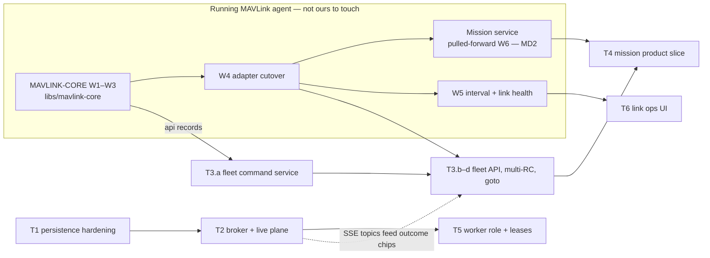

# FLEET-MIGRATION-PLAN — from single-instance station to fleet command point

**Status:** authoritative sequencing spec, not yet implemented.
**Context:** [FLEET-MIGRATION-CONTEXT.md](FLEET-MIGRATION-CONTEXT.md) — starting state, the running-agent constraint.
**Reads with:** [DOMAIN-SEPARATION-PLAN.md](DOMAIN-SEPARATION-PLAN.md) (target architecture — this plan *executes* its W2/W3),
[MAVLINK-CORE-PLAN.md](MAVLINK-CORE-PLAN.md) (in flight — this plan *consumes* its outputs, never edits its scope),
[DRONE-INFRA-PLAN.md](DRONE-INFRA-PLAN.md),
[EVENT-TOPOLOGY-PROPOSAL.md](EVENT-TOPOLOGY-PROPOSAL.md) (accepted 2026-08-15 — subject taxonomy + layer rules for T2/T3/T4).
**Supersedes:** nothing. This is the umbrella that orders the existing plans and adds the fleet
capabilities none of them covered (group commands, multi-operator RC, mission product slice).

---

## 1. What we are migrating away from, ranked

The 2026-08-15 all-module survey found five problems, in order of weight for a stationary station
commanding many drones:

| # | Problem | Where it is stated |
|---|---|---|
| P1 | **Mission planning does not exist** for real aircraft — command vocabulary is mode/arm/RTL + one RC session | vision-flight, adapter-mavlink, vision-map MODULE.mds |
| P2 | **Command path won't survive fleet scale** — blocking 2 s waits on request threads, no retry/`confirmation`, ack-waiter clobbering, `COMMAND_LONG` only, per-asset API only, one RC session app-wide | adapter-mavlink + vision-flight MODULE.mds |
| P3 | **Aggregation is poll-heavy and pinned to one JVM** — process-local SSE plane, per-streaming-asset 2 s pollers, silent caps | vision-api §live, vision-web core stores |
| P4 | **Single points of failure in-process** — JavaCV process-wide `avcodec` lock, no JDBC pool, in-memory audit/breach/claim state | adapter-rtsp, adapter-persistence MODULE.mds |
| P5 | **Event layer is seams without transport** — `EventPublisherPort` → logger, no durable ops timeline, no read side | vision-platform, vision-app MODULE.mds |

What is **deliberately not migrated** (re-affirmed, do not re-litigate):

- **U0 stays direct.** Commands, acks, RC frames never touch a broker (DOMAIN-SEPARATION D2/D7,
  MAVLINK-CORE §5). The broker sits in front of the command gateway as one more driver, never
  inside the control loop.
- **Modular monolith + role flags, not microservices** (DOMAIN-SEPARATION D1). One image;
  `vision.roles` decides what a node activates. Scaling is leases (D7), not service splitting.
- **Latest-wins everywhere on hot paths** (project rule 9). No wave may introduce a queued/buffered
  hot path.

---

## 2. Decisions (pinned)

| # | Decision | Rationale |
|---|---|---|
| MD1 | **Broker is NATS JetStream.** MAVLINK-CORE §5.1's Kafka note is resolved in favor of DOMAIN-SEPARATION D3 | D3 is the standing pinned decision; single small binary fits compose and field deployments; JetStream sequence doubles as the SSE resume cursor, which W2 is built on. MAVLINK-CORE's seam is broker-agnostic by design (its own B1–B5 rules), so nothing there changes. Kafka reconsidered only if an ops constraint appears — same escape hatch D3 already carries |
| MD2 | **Mission is pulled forward.** MAVLINK-CORE's `MissionService` (its W6) becomes the *next* wave the MAVLink agent takes after its W4 exit gate, ahead of `ParameterService`/transport hardening | P1 is the largest capability gap and the plan's own words: "the largest product win". The product slice on top (T4 here) is this plan's responsibility |
| MD3 | **Fleet commands are a first-class API**, not N client-side calls | partial failure is the normal case in a fleet; per-vehicle outcomes must aggregate server-side where the audit trail lives |
| MD4 | **Multi-operator RC**: sessions become per-operator-per-asset, bounded by assignment scope | the current one-session-per-station singleton was a documented Phase 1 simplification (vision-flight MODULE.md flags it "for whoever later needs multi-operator support" — that is now) |
| MD5 | **Persistence hardening precedes replicas.** Connection pool + JPA audit trail land before any second instance exists | two core replicas against an unpooled per-call `EntityManager` is self-harm; a command audit that dies with the JVM is a liability at *any* scale |
| MD6 | **No wave touches the running MAVLink agent's file scope** until its W4 merges (§5) | one task, one branch; two agents in one module is how green builds die |
| MD7 | **Every wave ends green and demo-able on the single-node compose** | migration must never make today's working station worse while building tomorrow's |
| MD8 | **Subject taxonomy is EVENT-TOPOLOGY-PROPOSAL §4** (accepted 2026-08-15): DOMAIN-SEPARATION §7 unchanged + three new streams — `evt.command.>` (per-vehicle outcomes), `evt.flight.link.>` (vehicle heard/lost/reboot), `evt.mission.>` (T4 lifecycle); no `cmd.>` request topic ever (broker carries news, never U0 triggers); once T1 lands, U2/U3 publishes ride a transactional outbox | one vocabulary across plans; command execution stays U0 direct per the standing law |

---

## 3. Tracks and waves

Track letters are this plan's own namespace (T1–T6) to avoid colliding with the W-numbers both
existing plans use. Within a track, waves are sequential; across tracks, §4 shows what may run in
parallel. Agent roles per CLAUDE.md: Opus owns flow-level waves, Sonnet executes scoped coding
waves, Fable touches no code.

### T1 — Persistence hardening (start immediately; fully disjoint from everything)

| Wave | Agent | Scope | Exit criteria |
|---|---|---|---|
| T1.a | spring-integrator | `adapters/adapter-persistence/**`: pooled connection provider (HikariCP via Hibernate's provider seam), request-scoped `EntityManager` lifecycle where `JpaOperations` needs it; pool sizing in `application.yaml`, no literals | module tests green; the `HHH10001002` built-in-pool warning gone; MODULE.md's "single-instance/friends-demo" caveat rewritten |
| T1.b | spring-integrator | `JpaAuditTrail implements AuditTrailPort` + Flyway migration + `vision-app` conditional wiring (replaces the unconditional `InMemoryAuditTrail` when `vision.persistence.enabled`) | command/denial audit entries survive restart; in-memory path still default-off behavior-identical |
| T1.c | application-service | telemetry read semantics: `TelemetryRepositoryPort.findByUsage` gains a latest-window read (new method, additive — the earliest-window method stays for replay's documented consumer) ; OSD/backfill callers move to it | the "permanently-stale OSD after ~200 s" limitation closed; events-replay behavior unchanged |

### T2 — Broker + live plane (DOMAIN-SEPARATION W2, made concrete)

| Wave | Agent | Scope | Exit criteria |
|---|---|---|---|
| T2.a | Opus (flow) + Sonnet | NATS in `docker-compose.yml`; new `adapters/adapter-nats/**`: JetStream publisher implementing `EventPublisherPort`, `job.audit` + `job.history.*` producers/consumers per DOMAIN-SEPARATION §7 + EVENT-TOPOLOGY §4 (incl. new `evt.flight.link.>` from flight's link tracker); envelope records (facts + ids only, D4); transactional outbox for U2/U3 publishes once T1.b's store exists (MD8) | compose up includes NATS; events published durably; audit flows through `job.audit` into T1.b's store; single-node behavior unchanged with broker down (degradation map §10 honored) |
| T2.b | spring-integrator | `vision-api` live plane: SSE `Last-Event-ID` maps to JetStream sequence; `LiveRingBuffer`/`everDropped` retired for U2 topics; U1 topics (telemetry/detections) stay direct-from-process per D2 — snapshot-on-connect, no broker presence | **two core replicas serve the same SPA correctly** (DOMAIN-SEPARATION W2's exit test, run via compose scale) |
| T2.c | web-ui | `vision-web` poll retirement: fleet map telemetry rides SSE topics instead of per-streaming-asset 2 s pollers; 5 s fleet-summary poll demoted to reconnect fallback; COP 30 s safety net kept | zero recurring per-asset GETs in a 60 s steady-state window with N streaming assets (the REALTIME exit criterion, now achievable) |

### T3 — Fleet command surface (gated on MAVLINK-CORE W3 records; adapter parts on its W4)

| Wave | Agent | Scope | Exit criteria |
|---|---|---|---|
| T3.a | application-service | `vision-flight`: `FleetCommandService` — fan-out of one command over an asset selection within scope; per-vehicle `CommandOutcome` aggregation (ACCEPTED / NO_ACK / REFUSED / OUT_OF_SCOPE per asset, never all-or-nothing); one audit entry per attempted vehicle; each outcome also published to `evt.command.>` (MD8) so UI chips/audit/replay consume without the commander knowing them; consumes MAVLINK-CORE's `CommandGateway` + `com.drones.mavlink.api` records (its W3 deliverable) so requests are value-typed and correlation-id'd from day one | unit tests with hand-fake gateway; partial-failure semantics frozen in javadoc |
| T3.b | spring-integrator + web-ui | `POST /api/fleet/commands` (async: 202 + outcome resource, no 2 s×N request-thread parking); Command page multi-select → "RTL all" with per-drone outcome chips | commanding 10 SITL drones shows 10 independent outcomes; a NO_ACK on one never masks the other nine |
| T3.c | application-service + spring-integrator | multi-operator RC: `DefaultManualControlService` one-session-per-**(operator, asset)** with per-asset exclusivity (two pilots cannot hold one aircraft; one pilot can hold one aircraft while another pilot holds another); WS handler + wiring updated; watchdog semantics unchanged | two browsers, two assets, two concurrent RC sessions on SITL; engage-conflict on the *same* asset still refused |
| T3.d | application-service | positional command: `goto(AssetId, GeoPosition)` on `FlightCommandService` over MAVLINK-CORE's `COMMAND_INT` support (its D7) — the crowd-operating primitive between "RTL" and full missions | SITL aircraft repositions to a map-clicked point; refused honestly for non-commandable firmware |

### T4 — Mission (the product slice over MAVLINK-CORE's pulled-forward MissionService)

| Wave | Agent | Scope | Exit criteria |
|---|---|---|---|
| T4.a | Fable→Opus | mission contract: `MissionPlan`/`MissionItem` domain records in `vision-flight`, upload/verify/current-item read model; translation to mavlink-core `MissionService` (which owns the lock-step protocol, `MISSION_ITEM_INT` INT-frame rule, ArduPilot deviations — per MAVLINK-CORE §2.2) | contract doc frozen before code; explicitly *not* reusing simulation's `TelemetryPlan` (different thing: synthetic input vs. real upload) |
| T4.b | application-service + spring-integrator | `MissionPlanService`: author → validate (geofence check against zones before upload) → upload → monitor `missionSeq`; REST surface; audit per upload; lifecycle published to `evt.mission.>` (MD8) | plan uploaded to SITL, aircraft flies it, `MISSION_CURRENT` visibly advances in telemetry `extra["missionSeq"]` (already decoded today) |
| T4.c | web-ui | map plan editor: `vision-map` drawings substrate grows a plan-authoring mode (the "later plans slice" its MODULE.md reserved); assign plan → asset; fleet view of per-drone mission progress | operator draws a route on the tactical map and sends a real aircraft to fly it |

### T5 — Worker role + leases (DOMAIN-SEPARATION W3; gated on T2)

| Wave | Agent | Scope | Exit criteria |
|---|---|---|---|
| T5.a | Opus (flow) + spring-integrator | asset-lease table (perception-owned per D7), reconciliation loop, `vision.roles` activation for `worker` (perception + flight), `evt.lease.*` announcements | as spec'd in DOMAIN-SEPARATION §6/§8 F1/F5 |
| T5.b | spring-integrator | gateway dials U1 subscriptions + commands via lease registry; inter-role authn (its open question 2 — must land here, before a worker accepts a dialed RC relay) | 2 workers; kill one → takeover ≤ lease TTL; RC releases via watchdog, honest and explicit (F5) |

### T6 — Link operations (stays with the MAVLink agent's W5; our side is UI only)

| Wave | Agent | Scope | Exit criteria |
|---|---|---|---|
| T6.a | web-ui | surface link health + per-asset telemetry-rate control that MAVLINK-CORE W5 exposes (context service → api are that plan's scope) | operator sees per-drone link quality on the Command page; can drop shelf-drones to 1 Hz |

---

## 4. Dependency graph

Parallelism that is safe from day one: **T1 ∥ the MAVLink agent's W1–W3 ∥ T4.a (contract doc)**.
T2.a may start once T1.a merges. Everything in T3 waits for MAVLINK-CORE artifacts by design —
building a fleet fan-out on today's blocking commander would mean building it twice.

---

## 5. Coordination with the running MAVLink agent

- **Exclusive scopes until its W4 merges:** `libs/mavlink-core/**`, `adapters/adapter-mavlink/**`,
  root `pom.xml`, `vision-app`'s ArchUnit rule file. No wave above lists any of them.
- **Serialization points** (edit only between its waves, coordinated by the operator):
  1. **root `pom.xml`** — its W1 adds the `libs` aggregator; T2.a adds `adapters/adapter-nats`.
     T2.a's pom edit waits until W1 is merged, then is a one-line module addition.
  2. **`vision-app` wiring** — its §8 freezes the five MAVLink port-class constructors (wiring
     unchanged W1–W4); T1.b/T2.a add *new* conditional configurations and touch no MAVLink bean.
     Different files, same module: never run concurrently with its W4, which rewrites MAVLink wiring.
- **Amendments to MAVLINK-CORE-PLAN.md** (MD1 broker note resolved → NATS; MD2 W6 mission
  pull-forward) are appended by the operator or by that agent between waves — this plan does not
  edit that file while its owner runs.
- **Builds:** every wave verifies with `-pl` scoped builds only (CLAUDE.md rule); no reactor-wide
  build while any MAVLink wave holds its modules red.
- **Branches:** one task one branch — each T-wave gets `feat/fleet-<track><wave>` off `master`
  (or off the track's integration branch for multi-wave tracks), merged per wave. Never branch off
  `feat/mavlink-core*`.

---

## 6. Risks

| Risk | Mitigation |
|---|---|
| Two agents collide in `vision-app` | §5 serialization points; vision-app edits are the *only* shared surface and are operator-scheduled |
| Broker path degrades the working station | MD7 + DOMAIN-SEPARATION §10: broker-down leaves flying/viewing intact; T2.a proves it with a NATS-stopped compose test before T2.b retires any ring buffer |
| Fleet fan-out built before the correlator exists gets rebuilt | T3 is hard-gated on MAVLINK-CORE W3/W4 outputs (accepted cost: T3 idles if that agent slips — T1/T2/T4.a absorb the slack) |
| Two core replicas expose latent shared-state bugs beyond the known list | T2.b's exit test is exactly this; the known in-heap registries (perception streams, RC session) stay single-writer until T5 moves them behind leases — replicas before T5 serve *core* role surfaces only |
| Mission upload against real firmware hits ArduPilot deviations | T4.b exit runs against SITL un-skipped (same doctrine as MAVLINK-CORE's W4 SITL gate); the INT-frame and partial-upload traps are already pinned in that plan's §2.2 |
| Multi-operator RC weakens the safety posture | T3.c changes *who may hold* a session, never the watchdog/release semantics; per-asset exclusivity is a hard invariant with its own test |

---

## 7. Backlog — recorded, deliberately not scheduled

- **CRSF/ELRS ingest** (FPV-class aircraft: telemetry + video in, no command TX) — the gap the
  BattleBorn comparison exposed; belongs to ANY-DRONE-PLAN when prioritized.
- **Per-mission/per-group geofences** + persisted breach state (today: global zones, in-heap edges).
- **Reboot detection** (`SYSTEM_TIME` backwards ⇒ reset learned state) — MAVLINK-CORE §2.3 research
  fact, no wave owns it yet; natural home is that plan's session layer.
- **Unclaimed-vehicle registry cap (32)** — raise/make configurable when a real >32 rehearsal exists.
- **RF layer / hardware story** — out of software scope; interoperate (mast-station video →
  V4L2/RTSP ingest, ELRS MAVLink-mode UDP → existing gateway), don't build.

## 8. Open questions for the operator

1. **Replica shape for T2.b's exit test** — compose `--scale` on one host is enough to prove the
   plane, or do you want it proven across two machines (the SITL-farm host is available)?
2. **T3.b command UX** — is "RTL all in selection" the only v1 fleet command, or should mode-set
   ride along immediately? (arm/disarm fleet-wide is deliberately excluded from v1 — highest
   blast radius, no operational story yet.)
3. **Lease TTL** (DOMAIN-SEPARATION open question 1) — still needs a measured number in T5, not a
   guess; flagging early so T5.a instruments it from the first run.
