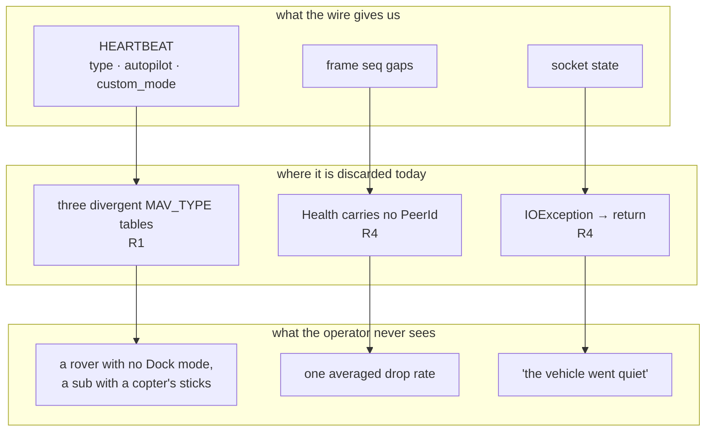
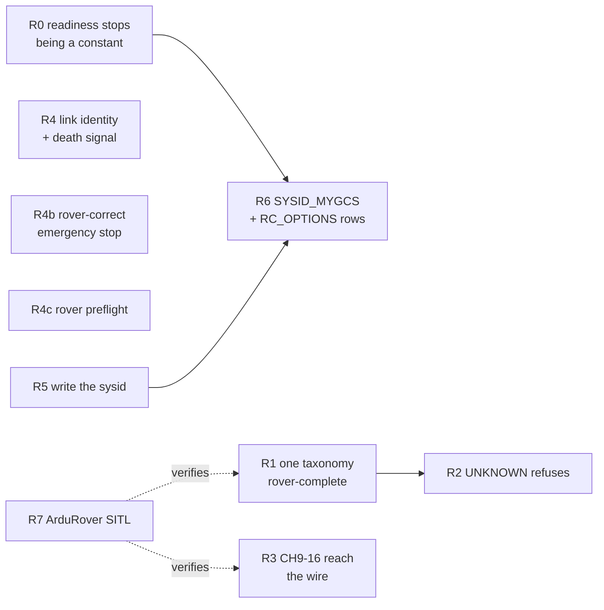

# FLEET-RADIO-PLAN — one radio layer for a mixed fleet

**Status:** authoritative spec. **R0 done**; R1–R7 open. Opened 2026-08-26, branch `feat/fleet-radio`.
**Scope:** the link and control layer for the vehicles we actually fly and drive — **copter and rover
(rover first)**. Rover covers the surface boat, which shares ArduRover's firmware, mode table and control
shape. Plane stays working where it already works; it is not a target of this plan.
**Deliberately out of scope:** anything geolocation/visual-geo, and **submarine/ArduSub** — both by
operator instruction, 2026-08-26. The taxonomy R1 builds is extensible to a sub later; it does not add one now.

**Reads with:** [MAVLINK-CORE-PLAN](MAVLINK-CORE-PLAN.md) (§W5/W6 — this plan closes W5's surfacing half),
[OPERATOR-CONTROL-CONTEXT](OPERATOR-CONTROL-CONTEXT.md) (G13/G14, verified below),
[VEHICLE-CONTROL-PROFILES-CONTEXT](VEHICLE-CONTROL-PROFILES-CONTEXT.md) (the `VehicleKind` taxonomy this extends),
[DRONE-ONBOARDING-PLAN](DRONE-ONBOARDING-PLAN.md) (§O9 — the unreachable write path R5 connects),
[DRONE-INFRA-PLAN](DRONE-INFRA-PLAN.md) (I-a fleet gateway, I-e command TX),
[ANY-DRONE-PLAN](../../conclusions/ANY-DRONE-PLAN.md) (PROBE→DIAGNOSE→REMEDIATE→VERIFY, the loop R5 completes).

**Supersedes:** nothing. It pays down **nineteen verified defects** in shipped code (§1) and closes the
capability gap that stops a second rover on one radio from existing at all.

---

## 0. Why this plan exists

The platform can fly one copter well. Everything below was verified against `master` @ `3825a89f` by
reading the code, not the plan headers — every row is a defect or gap that only shows up the moment a
**second, different** vehicle appears on the link.

The unifying failure is that vehicle identity and link identity are both **thrown away** at exactly the
point they become load-bearing. A boat is told apart from a drone in one table and not in another; a
vehicle's packet loss is computed per peer and then averaged into the fleet; a dead socket is
indistinguishable from a quiet aircraft; and every flight controller ships its sysid at `1`, which the
code can fix but cannot reach — and which readiness cannot even name correctly (F0).

---

## 1. Verified findings — the evidence base

Every row was reproduced by reading the cited line. **No row is taken from a plan document's own
status claim.** Where a prior document was wrong, that is noted.

| # | Finding | Evidence | Severity |
|---|---|---|---|
| **F0** | **Readiness is permanently `NO_GO` for every ArduPilot vehicle.** The `fleet-identity` requirement row demands the parameter `SYSID_THISMAV`; the probe list reads **`MAV_SYSID`** (ArduPilot 4.7 renamed it — the rename is acknowledged in `drone-link/mavlink/MODULE.md:290` and `DRONE-ONBOARDING-PLAN.md:336`, but the migration was never updated). The row therefore always evaluates `MISSING`, which is a blocker, which forces `NO_GO`. The remedy is unreachable twice over: `ParameterTier.classify("MAV_SYSID")` returns empty (unclassified ⇒ 400), and `PARAM_WRITE` is hardcoded `UNSUPPORTED` (F8). | `V18__feature_requirements.sql:74` vs `MavlinkSettings.java:368`; `DefaultReadinessService.java:149-155`; `ParameterTier.java:37-56` | **Critical** — the whole readiness verdict is a constant |
| **F1** | **Three divergent `MAV_TYPE` tables.** (a) `FlightModes.vehicleKind(int)` — the control taxonomy that picks the stick layout — knows VTOL 19–25, **not** submarine (12). (b) `MavlinkHeartbeatScanner.java:288-302` — device discovery — knows **no VTOL type and no submarine**, so both are labelled `"vehicle"`. (c) `MavlinkVehicleConfigurator.java:403-417` — the probe's human string — knows submarine, **no VTOL**. None knows dodecarotor (29) or decarotor (35). Three hand-maintained tables, incomplete in three different directions; any one edit drifts the others. | `FlightModes.java:57-66`, `MavlinkHeartbeatScanner.java:288-302`, `MavlinkVehicleConfigurator.java:403-417` | **High** — a sub probes as `"submarine"`, discovers as `"vehicle"`, and flies as `UNKNOWN` |
| **F2** | **`VehicleKind.UNKNOWN` hands out a control map its own javadoc calls unsafe.** `ControlProfile.forKind(UNKNOWN)` returns four centred axes; a centred throttle is ~50 % power on a multirotor. The enum documents this as deliberate ("no safe default"), but the *consequence* — engage succeeds anyway — was never gated. | `VehicleKind.java:31-40`, `contexts/vision-flight/MODULE.md` Gotchas | **High** — safety |
| **F3** | **CH9–CH18 are bound in the UI and dropped on the wire, silently.** `controller-setup.ts:26` offers CH1–18; `ControlBinding.java:88` validates `[1,18]`; `ManualControlService.java:324-328` hardcodes `chan9..18 = IGNORE` on every frame. An operator binds a switch to CH9, saves, flies, flips it — nothing happens, no error anywhere. | `ManualControlService.java:312-345` | **High** — shipped, user-visible, silent |
| **F4** | **G13 confirmed as the blocker for F3.** MAVLink's extension channels 9–18 do **not** share channels 1–8's sentinels: for 9–18, `0` *or* `UINT16_MAX` mean *ignore* and `UINT16_MAX-1` (**65534**) means *release*. `RcChannels` models only `RELEASE=0`/`IGNORE=0xFFFF`. Dormant today only because we never populate 9–18; it goes live the instant F3 is fixed. | `RcChannels.java:25`, MAVLink common spec | **Medium** — latent, becomes High with F3 |
| **F5** | **G14 confirmed: `SYSID_MYGCS` is never checked.** We transmit as `SysId(255)`; ArduPilot honours `RC_CHANNELS_OVERRIDE` only from the GCS sysid that parameter names. Default is 255 so it usually works — on a vehicle configured otherwise (Herelink, some Mission Planner setups) **every stick input is discarded in silence** and readiness still reports GO. `SYSID_MYGCS` appears nowhere in the tree. | `MavlinkNode.java:18`; zero grep hits | **High** — silent total loss of control authority |
| **F6** | **Per-vehicle link quality is computed, then anonymised.** `LinkHealth.Health(connected, lastHeard, received, lost, dropRate)` carries **no vehicle identity**. `MavlinkGateway.java:200` resolves each claimed vehicle's `PeerId`, calls `health.of(peerId)`, then collects to a bare `List<Health>` — discarding the identity it just resolved. `MavlinkLinkStatusProvider.java:59` averages the fleet into one badge string. | `LinkHealth.java:24`, `MavlinkGateway.java:200-206` | **High** — the number an operator flying a boat at 800 m needs, already computed, never shown |
| **F7** | **A dead link is silent.** `MavlinkSession.java:196-198` catches `IOException`, logs at WARNING, and `return`s — the reader thread stops, `running` stays `true`, nothing propagates. `SubmissionPublisher.closeExceptionally()` is never called anywhere in the adapter. "Our socket died" is indistinguishable from "the vehicle went quiet", and costs the full silence timeout to notice. | `MavlinkSession.java:188-202`, `MavlinkGateway.java:249` | **High** — violates CLAUDE.md rule 9 |
| **F8** | **`SYSID_THISMAV` cannot be set, though every layer to do it exists.** `RemediationService.writeParameter` (tier gate + consent + disarmed interlock + audit), `VehicleConfigPort.writeParam` (snapshot/read-back), and `ParameterTier` classifying `SYSID_THISMAV` as Tier A are all built. `RemediationOrchestrator.java:137-141` refuses `PARAM_WRITE` because *"needs a target value and explicit consent this request shape does not carry"* — an honest refusal of the wrong request shape, not a missing capability. | `RemediationOrchestrator.java:125-145` | **High** — every FC ships sysid=1; this is what blocks a real mixed fleet |
| **F9** | **One RC session app-wide.** `DefaultManualControlService.java:120` holds a single `activeSession`; `vision-app` wires one bean. You cannot drive a boat and fly a drone at the same time, from any number of browsers. Documented as a Phase-1 simplification; FLEET-MIGRATION MD4 calls it due. | `DefaultManualControlService.java:120,186` | **Medium** — hard fleet ceiling |
| **F10** | **UDP is the only transport that exists in practice.** The adapter constructs `UdpListenLink` and nothing else; `TcpClientLink` is in mavlink-core but never constructed; there is no serial transport at all. A SiK telemetry radio — the standard long-range link for rovers and boats — requires the operator to run `mavlink-router` externally. | grep: `UdpListenLink` only, in `MavlinkGateway`/`MavlinkHeartbeatScanner` | **Medium** — hardware-gated, recorded not scheduled |
| **F11** | **No rover or boat is ever tested against real firmware.** `infra/sitl/entrypoint.sh:4` launches **ArduCopter only**. The rover path is covered by `infra/rover-sim` (the ESP32 sketch on the host), which is excellent but is *our* firmware, not ArduPilot's. | `infra/sitl/entrypoint.sh:4` | **Medium** — every rover/boat claim is untested end to end |
| **F12** | **The probe parameter list is copter-only and is not configurable, despite claiming to be.** It includes `FENCE_ALT_MAX`, which does not exist on ArduRover. MAVLink has no "no such parameter" reply, so every absent name burns a full timeout × retries. `MavlinkSettings.java:269-272` calls this configuration; it is not — `TelemetryWiring.java:95` hard-wires `defaults.probeParameters()` and `VisionOnboardingProperties` exposes no key for it. | `MavlinkSettings.java:368-373`, `TelemetryWiring.java:95` | **Medium** — every rover/boat probe is slow and partly meaningless |
| **F13** | **`emergencyStop` is an unconditional forced disarm with no vehicle-kind gate.** On a boat this leaves it adrift with steering dead; on a fixed-wing it is a crash command. Exposed to any operator and never consults `FlightCapability.vehicleKind`. | `MavlinkFlightCommander.java:172-178`, `FlightCommandController.java:146` | **High** — safety, and actively wrong on 3 of 4 vehicle kinds |
| **F14** | **The preflight checklist is copter-tuned and hard-fails a rover or boat.** `fixType >= 3` or `'fail'` — but a rover/boat in ArduRover `Manual`/`Acro` needs no GPS at all. The 45 % battery bar is likewise copter-tuned. | `flight-state-logic.ts:177-197` | **Medium** — a working boat reports "not ready to fly" |
| **F15** | **Readiness requirements are keyed by firmware alone, never by vehicle kind.** All 11 seeded rows are `firmware = 'ardupilot'`; lookup is `findByFirmware`. A boat is held to the same `ATTITUDE ≥ 5 Hz` / `VFR_HUD ≥ 1 Hz` bars as a copter, with no way to express a rover-specific set. | `V18__feature_requirements.sql:51-77`, `DefaultReadinessService.java:76-78` | **Medium** — blocks F0's fix from being done properly |
| **F16** | **`RC_OPTIONS` bit 1 (`IGNORE_OVERRIDES`) is never checked either.** A second, independent way for every stick input to be silently discarded, alongside F5. Neither string appears anywhere in the tree. | zero grep hits for `RC_OPTIONS` | **High** — same silent-total-loss class as F5 |
| **F17** | **The RC channel range is wrong at both ends.** Domain and UI accept `[1,18]`; ArduPilot reads only **1–16**. Channels 17/18 do not exist for it, and 9–16 are dropped (F3). | `ControlBinding.java:88`, `RcChannels.java:40-43` (both copies) | **Medium** — folded into R3 |
| **F18** | **Geofence ceilings compare AMSL against an operator's mental AGL.** `GeofenceMonitor` feeds `sample.altitudeMeters()` (documented AMSL) into `GeofenceZone.maxAltitudeMeters`. `aglMeters` exists and is decoded but the fence never uses it. A boat on a 500 m lake with a 50 m ceiling is permanently breaching. | `GeofenceMonitor.java:135,161-162`, `Telemetry.java:24,49,54` | **High** — but see §5: scheduling needs your call |

### Corrections to existing documents

- `docs/plans/README.md` MAVLINK-CORE row says **W5 open**. Its backend (`LinkHealth`, `DefaultLinkHealth`,
  `MessageIntervalService`) is **built**; only surfacing is missing. The row should read PARTIAL.
- `docs/plans/README.md` §3 row S says "S2–S5 remain open". S2's backend shipped as audit **R4**
  (`DeviceOrigin` + `V25__device_origin.sql`), S3's service method exists unexposed, S5 is half done.
- `OPERATOR-CONTROL-CONTEXT` G13/G14 were listed as unverified latent bugs. **Both are confirmed present**
  (F4, F5).

---

## 2. Decisions (pinned before any code)

| # | Decision | Rationale |
|---|---|---|
| **D1** | **One `MAV_TYPE` table, in `mavlink-core`, is the single source of truth.** `FlightModes` and `MavlinkVehicleConfigurator` both read it. Two hand-maintained tables in one module is the whole of F1. | A vehicle taxonomy is protocol knowledge, not adapter trivia. Its natural home is the module that owns the protocol. |
| **D2** | **`VehicleKind` gains `SUBMARINE`; boats stay folded into `ROVER`.** A sub is a genuinely different control shape (vertical thrust, depth-hold, 6-DOF). A surface boat steers and drives exactly like a rover and shares ArduPilot's rover mode table — `VehicleKind`'s own javadoc argues this, and it is right. | Split on *control shape*, never on marketing category. Splitting boat from rover would produce two identical `ControlProfile`s free to drift apart. |
| **D3** | **`UNKNOWN` must refuse to engage, not hand out a guess.** `ControlProfile.forKind(UNKNOWN)` stops returning a flyable map. The operator picks a kind explicitly, or does not fly. | F2. "No safe default" and "hand out a default anyway" cannot both be true. This is the one behavioural break in the plan and it is deliberate. |
| **D4** | **`LinkHealth.Health` gains the `PeerId` it is already keyed by.** Aggregation stays the caller's job. | F6. A health record that cannot say whose health it is forces every consumer to re-derive identity or throw it away. |
| **D5** | **A dead link raises a typed event; it never merely logs.** `MavlinkSession` gains a link-failure listener; the adapter closes the affected publishers exceptionally. | F7, CLAUDE.md rule 9. The newest fact — "the socket is gone" — must win over a stale telemetry sample. |
| **D6** | **Parameter writes get their own endpoint with an explicit value + consent.** Not derived from a feature key. `RemediationOrchestrator`'s existing refusal is correct and stays. | F8. The refusal names the real problem: a feature key does not carry a target value. Fix the request shape, do not weaken the guard. |
| **D7** | **No new magic numbers.** Every threshold added (drop-rate warn/alarm, link-failure grace) is a property under `vision.mavlink.*` or `vision.rc.*`. | CLAUDE.md rule 1. |
| **D8** | **F9 (multi-session RC) and F10 (serial/TCP) are specced here but scheduled elsewhere.** F9 belongs to FLEET-MIGRATION T3.c and needs CREW-CONTROL's arbitration to be safe; F10 is hardware-gated. | Two operators contending for one aircraft is CREW-CONTROL's problem by prior decision — do not re-invent it here. |

---

## 3. Waves

Disjoint file scopes; each ends with its scoped build green and its `MODULE.md` updated.
Agent roles per CLAUDE.md.

### R0 — readiness stops being a constant *(independent, highest severity)* — **DONE**
**Shipped scope:** `contexts/vision-flight/.../ParameterAliases.java` (new) +
`DefaultReadinessService.java` + `ParameterTier.java`, `drone-link/mavlink/.../MavlinkSettings.java` +
`MavlinkVehicleConfigurator.java`, `station/vision-app/.../VisionOnboardingProperties.java` +
`TelemetryWiring.java` + `application.yaml`.

- F0 closed **without a migration**. The `V18` `fleet-identity` row still reads `SYSID_THISMAV`; a new
  `ParameterAliases` value class makes `SYSID_THISMAV` and `MAV_SYSID` (and `SYSID_MYGCS` /
  `MAV_GCS_SYSID`) the same parameter at every comparison, so either spelling satisfies the row.
- **Why not the planned `V27` migration.** A rename is recurring, not a one-off — the next one would be
  another migration and another set of divergent rows. It also sidesteps the numbering collision with
  `feat/controller-setup-c15` entirely, so that coordination note is moot. Normalising at probe time was
  considered and rejected: it would make `ParameterReading` claim a name the vehicle never answered under.
- `ParameterTier.classify` canonicalises before matching, so both spellings are Tier A and the remedy stays
  reachable.
- `vision.onboarding.probe.parameters` is now bound *and read* (F12) — empty keeps the firmware-verified
  defaults. `FENCE_ALT_MAX` is gone from the default list (it does not exist on ArduRover).

**Unplanned finding — the probe cost of an alias.** Listing both spellings in the probe list, which is what
this wave first did, regressed every probe by the full `parameterTimeout × parameterRetries` budget:
`ParameterService.readAll` fans out concurrently, and a firmware carries exactly one spelling, so the other
holds the whole batch open. The live SITL test caught it (~8 s added; one-shot messages fell out of the
inventory's rate window). Fixed properly rather than absorbed: `MavlinkVehicleConfigurator.readInto` now
reads the configured list, then re-asks *only* unanswered names under their other spellings. Current
firmware never reaches the second pass and pays nothing.

**Result:** a correctly configured ArduPilot vehicle can reach `GO`; before this, none could, of any kind.
Proven by tests that fail without the fix with exactly the F0 symptom (`expected: <GO> but was: <NO_GO>`)
for a profile carrying `MAV_SYSID` against a row naming `SYSID_THISMAV`, and symmetrically. Scoped builds
green: vision-flight 345, adapter-mavlink 198 (live SITL included), persistence + vision-app 263.

### R1 — one vehicle taxonomy, complete for rover
**Scope:** `drone-link/mavlink-core/**` (new `VehicleClass`), `drone-link/mavlink/FlightModes.java`,
`MavlinkVehicleConfigurator.java`, `MavlinkHeartbeatScanner.java`,
`contexts/vision-flight/.../VehicleKind.java`, `ControlProfile.java`.

- Introduce a single `MAV_TYPE` → family table in `mavlink-core`, covering copter (incl. **dodecarotor 29**,
  **decarotor 35**), plane (incl. every VTOL), rover (**ground rover + surface boat**), **submarine (12)**,
  and airship/balloon as explicitly unsupported rather than absent.
- **All three** call sites delegate to it — `FlightModes`, `MavlinkVehicleConfigurator` **and
  `MavlinkHeartbeatScanner`** (F1c: discovery must name a VTOL and a submarine, not call both `"vehicle"`).
  Delete all three local tables.
- **Complete the ArduRover mode table** — the modes missing today are **Dock (8)**, **Circle (9)** and
  **Initialising (16)**. Verify each number against the ArduPilot source for the firmware generation we
  target before freezing: a wrong mode number is a wrong *command*, not a wrong label.
- Submarine (`MAV_TYPE` 12) is **not** added as a `VehicleKind`. The unified table must simply have a slot
  for it, so adding one later is a row and not a fourth table.

**Expected result:** one table, three call sites, zero local copies. A rover offers Dock in
`selectableModes` and renders it by name; a boat is named consistently in discovery, profile and control;
a dodecarotor gets "RTL", not "Mode 6". A test asserts all three former tables now agree on every
`MAV_TYPE` any one of them knew.

### R2 — `UNKNOWN` stops guessing *(depends on R1)*
**Scope:** `contexts/vision-flight/.../ControlProfile.java`, `DefaultManualControlService.java`,
`station/vision-api/.../ManualControlWebSocketHandler.java`, `station/vision-web/.../rc/**`.

- `ControlProfile.forKind(UNKNOWN)` no longer returns a flyable map.
- `engage` on an `UNKNOWN` vehicle is refused with a named reason on the frozen WS contract
  (a new `denied` reason code — additive, no frame removed).
- The web client renders the refusal and offers the operator an explicit kind choice.

**Expected result:** no vehicle that never said what it is receives a ~50 %-throttle stick map.
The existing `denied` frame carries the new reason; no wire break.

### R3 — every channel the operator bound reaches the wire *(independent)*
**Scope:** `drone-link/mavlink-core/.../RcChannels.java`, `ManualControlService.java`.

Also in scope: `contexts/vision-flight/.../RcChannels.java`, `ControlBinding.java`,
`station/vision-web/.../features/controller/controller-setup.ts`.

- `RcChannels` (**both copies** — core and flight domain) learn the **extension-channel sentinels** (F4):
  channels 9–16 use `65534` for release; `0`/`65535` both mean ignore. Channels 1–8 keep `0` = release.
- `ManualControlService.buildFrame` populates 9–16 from the mailbox instead of hardcoding `IGNORE`;
  the release burst uses the correct per-range sentinel.
- **Narrow the range to `[1,16]`** (F17) in `ControlBinding`, both `RcChannels` copies, and the
  `controller-setup.ts` picker. ArduPilot does not read 17/18; offering them is the same lie as CH9.
  A stored profile already binding 17/18 must fail loudly on load, not silently.
- Test: a profile binding CH9 produces a frame whose `chan9Raw` is the bound value; a release produces
  `65534` on 9–16 and `0` on 1–8, asserted against pymavlink-built fixtures.

**Expected result:** F3, F4 and F17 closed together. `/manage/controller`'s aux channels stop being a lie —
which is what a rover actually needs them for (mode switch, lights, winch, a camera trigger).

### R4 — the link has a name, and says when it dies *(independent)*
**Scope:** `drone-link/mavlink-core/.../LinkHealth.java`, `DefaultLinkHealth.java`, `MavlinkSession.java`,
`drone-link/mavlink/.../MavlinkGateway.java`, `MavlinkTelemetrySource.java`, `MavlinkLinkStatusProvider.java`.

- `LinkHealth.Health` gains `PeerId` (D4). `MavlinkGateway.claimedVehicleHealth()` returns
  `Map<DeviceId, Health>`; `MavlinkLinkStatusProvider` aggregates at the top instead of at the source.
- `MavlinkSession` gains a link-failure listener; the `IOException` path (F7) invokes it instead of
  returning in silence. The adapter closes affected telemetry publishers exceptionally (D5).
- Thresholds (`drop-rate-warn`, `drop-rate-alarm`, link-failure grace) become `vision.mavlink.*` properties (D7).

**Expected result:** the platform can say *which* vehicle's radio is bad and *that our socket died*,
as two distinct facts, within the grace window rather than the silence timeout.

### R5 — set the vehicle's sysid *(depends on nothing; unblocks the fleet)*
**Scope:** `station/vision-api/.../controller/**` (new parameter-write endpoint + DTO),
`station/vision-web/src/app/features/onboarding/**`.

- A dedicated `POST /api/assets/{id}/parameters` carrying `{name, value, consent}` — the explicit request
  shape `RemediationOrchestrator` correctly refuses to synthesise (D6). It calls the **already-built**
  `RemediationService.writeParameter`; no service or adapter change.
- The onboarding wizard gains a sysid step for a vehicle whose sysid collides with one already claimed.
  It must write **whichever spelling that vehicle answers to** — `MAV_SYSID` or `SYSID_THISMAV` (F0) —
  not assume one.
- `RemediationOrchestrator`'s existing `PARAM_WRITE` refusal is left exactly as it is.

**Expected result:** DRONE-ONBOARDING **O9's** write half becomes reachable; a second rover on one port
stops being invisible. Ships behind `vision.onboarding.probe.enabled`, still default `false`.

### R4b — a rover is not a falling copter *(independent; rover safety)*
**Scope:** `drone-link/mavlink/.../MavlinkFlightCommander.java`,
`contexts/vision-flight/.../DefaultFlightCommandService.java`, `station/vision-web/.../fly/**`.

- `emergencyStop` consults `FlightCapability.vehicleKind` (F13). On a **rover** the safe stop is
  `HOLD` (or a zero-throttle disarm on the ground), never the unconditional forced disarm that on a boat
  leaves it adrift with steering dead. The copter behaviour is unchanged and stays a force-disarm.
- The button's label and confirm text change with the vehicle kind — "Emergency stop" on a rover must not
  read like "Cut the motors".

**Expected result:** the one irreversible command in the product does the right thing on the vehicle we
are about to buy, instead of the one it was written for.

### R4c — the preflight checklist asks a rover rover questions *(independent, web-only)*
**Scope:** `station/vision-web/src/app/core/telemetry/flight-state-logic.ts` (+ its spec).

- The `fixType >= 3` hard fail becomes conditional on vehicle kind (F14): a rover or boat in `Manual`/`Acro`
  needs no GPS fix and must not be reported "not ready".
- The 45 % battery bar likewise stops being a universal constant; thresholds come from configuration,
  not from a literal in a `.ts` file (D7).

**Expected result:** a working rover reports ready. Today it reports a hard fail on a sensor it does not need.

### R6 — `SYSID_MYGCS` and `RC_OPTIONS` become readiness rows *(depends on R5's endpoint for the remedy)*
**Scope:** `contexts/vision-flight/.../FeatureRequirement.java` seed + `DefaultReadinessService`,
`storage/persistence` (a seed migration), `station/vision-web/.../readiness/**`.

- A readiness feature keyed on `SYSID_MYGCS`: read it during PROBE (`readParams` already exists), compare
  against the sysid we actually transmit as (255), report `MISSING` with remedy `PARAM_WRITE` on mismatch.
- A second row for **`RC_OPTIONS` bit 1 (`IGNORE_OVERRIDES`)** (F16) — the other, independent way every
  stick input is silently discarded. One without the other still leaves a silent failure mode open.
- Both are also checked **at `engage`**, not only at preflight: a parameter can change between the two.
- **Note:** `FeatureRequirement.FEATURE_KEYS` is a *frozen* eleven-key set. Adding a key is a wire change —
  the wave must extend the frozen set deliberately and say so in the plan and in `MODULE.md`, not quietly.

**Expected result:** F5 closed. The one configuration that silently voids all manual control is
diagnosed before flight instead of discovered in the air.

### R7 — a rover on real ArduPilot firmware *(independent)*
**Scope:** `infra/sitl/**`.

- Parameterise the SITL entrypoint by vehicle (`ArduCopter` | `ArduRover`), defaulting to copter so nothing
  that exists today changes behaviour.
- Add a rover instance to the compose fleet, and one docker-gated integration test that drives a rover
  through arm → mode → RC override and asserts the **rover** mode table resolved, Dock included.

**Expected result:** F11 closed. Every rover claim in R0–R4c is verified against ArduPilot itself,
not only against `infra/rover-sim` (which runs our own ESP32 firmware, not ArduPilot's).

---

## 4. Sequencing

**Parallel-safe:** R0, R1, R3, R4, R4b, R4c and R5 have disjoint file scopes. R2 waits on R1; R6 waits on
both R0 (done — the parameter-name fix) and R5 (the remedy endpoint).

**Serial order by value, rover first:**

| Order | Wave | Why here |
|---|---|---|
| 1 | ~~**R0**~~ **done** | Readiness was a constant `NO_GO`. Nothing downstream that reads a verdict could be trusted until this was true |
| 2 | **R3** | Shipped, silent, user-visible. A rover's aux channels are its mode switch and its lights |
| 3 | **R1** | Three tables is how the next rover defect gets introduced; Dock/Circle/Initialising are missing today |
| 4 | **R4b** | Safety, and actively wrong on the vehicle being bought |
| 5 | **R4** | The number an operator driving a rover past the tree line actually needs |
| 6 | **R4c** | Cheap, web-only, removes a false "not ready" on every rover |
| 7 | **R5** → **R6** | What makes a *second* rover on one port possible, then what stops its sticks being silently ignored |
| 8 | **R2** | Depends on R1; a behaviour break, so it lands once the taxonomy beneath it is settled |
| 9 | **R7** | Verifies 1–8 against ArduPilot instead of against our own simulator |

**Note on migrations:** master is at `V26`, and unmerged `feat/controller-setup-c15` also claims `V25`.
R6 adds a migration and must take the next free number. R0 shipped without one (see its wave), so the
`feat/controller-setup-c15` `V25` collision no longer involves this plan.

## 5. What this plan deliberately does not do

| Not doing | Why | Owner |
|---|---|---|
| Multi-operator RC sessions (F9) | Two operators contending for one aircraft is arbitration, and that is `CREW-CONTROL-PLAN` §2.6/§4.5 by prior decision. Lifting the singleton without it makes contention *worse*, not better | FLEET-MIGRATION T3.c + CREW-CONTROL |
| Serial / TCP transports (F10) | Hardware-gated — no SiK radio exists to test against. `mavlink-router` is a working external answer today | DRONE-INFRA I-a |
| Fleet/group commands | Real gap (`FleetController` is read-only), but it is a command-plane design task, not a radio one | FLEET-MIGRATION T3 |
| NATS / broker | Both `ARCHITECTURE-AUDIT` R10 and `MASTER-MATRIX` T3 independently conclude "one adapter class, never urgent, do it the day a second instance exists" | DOMAIN-SEPARATION W2 |
| Mission upload / waypoint execution | Contested — `MOAT` §6 and `MASTER-MATRIX` B9/M3 both say NO; `MISSIONS-PLAN` says sooner. Unresolved, and this plan does not resolve it | MISSIONS-PLAN, blocked on reconciliation |
| PX4 mode tables | PX4 encodes `custom_mode` as a packed main/sub-mode bitfield, not a flat int — a different decode shape, not another `Map.ofEntries`. Real work, low demand today | unscheduled |
| **Geofence ceilings comparing AMSL to AGL (F18)** | A real defect — a rover on a 500 m plateau or a boat on a high lake is permanently breaching a ceiling it is nowhere near. `aglMeters` is already decoded and simply unused. **Left unscheduled pending your call**, because "skip geo" was the instruction and this sits on the fence/altitude boundary rather than in visual geolocation. Say the word and it is an S-sized wave | **needs a decision** |
| Per-vehicle-kind readiness requirement rows (F15) | The requirement table is keyed by firmware alone, so a rover is held to a copter's `ATTITUDE ≥ 5 Hz` bar. R0 fixes the *wrong parameter name*; making the whole table kind-aware is a schema change and a larger wave | follow-on to R0 |

---

## 6. Exit gate

The plan is done when, on one UDP port, with a copter and a rover both transmitting:

1. Each vehicle reports its **own** drop rate and last-heard time, distinctly (R4).
2. Killing the socket surfaces as a **link failure**, not as silence (R4).
3. The rover's mode list is the rover's, and a bound CH9 switch changes the vehicle's behaviour (R1, R3).
4. A vehicle that never identified itself **cannot** be engaged (R2).
5. A colliding `SYSID_THISMAV` can be reassigned from the wizard (R5).
6. A wrong `SYSID_MYGCS` is reported before flight, not discovered by dead sticks (R6).
7. All of the above verified against **ArduPilot SITL rover firmware**, not only our own simulator (R7).
