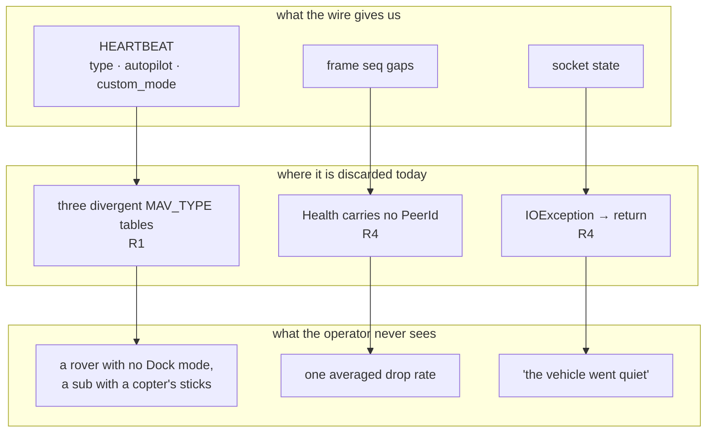
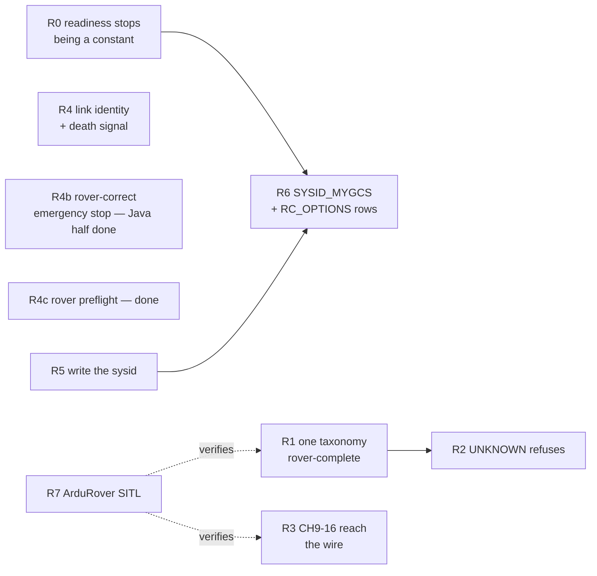

# FLEET-RADIO-PLAN — one radio layer for a mixed fleet

**Status:** authoritative spec. **R0, R1, R2 (Java + R4b's web half), R3 (Java half), R4b (Java half),
R4c, R5, R6 done**, **R7 infra half done**; R4, R3's web half, R2's own "explicit kind choice" web
half, and R7's test open. Opened 2026-08-26, branch `feat/fleet-radio`.
**Scope:** the link and control layer for the vehicles we actually fly and drive — **copter and rover
(rover first)**. Rover covers the surface boat, which shares ArduRover's firmware, mode table and control
shape. Plane stays working where it already works; it is not a target of this plan.
**Deliberately out of scope:** anything geolocation/visual-geo, and **submarine/ArduSub** — both by
operator instruction, 2026-08-26. The taxonomy R1 builds is extensible to a sub later; it does not add one now.

**Reads with:** [MAVLINK-CORE-PLAN](MAVLINK-CORE-PLAN.md) (§W5/W6 — this plan closes W5's surfacing half),
[OPERATOR-CONTROL-CONTEXT](OPERATOR-CONTROL-CONTEXT.md) (G13/G14, verified below),
[VEHICLE-CONTROL-PROFILES-CONTEXT](VEHICLE-CONTROL-PROFILES-CONTEXT.md) (the `VehicleKind` taxonomy this extends),
[DRONE-ONBOARDING-PLAN](DRONE-ONBOARDING-PLAN.md) (§O9 — the unreachable write path R5 connects),
[DRONE-INFRA-PLAN](DRONE-INFRA-PLAN.md) (I-a fleet gateway, I-e command TX),
[ANY-DRONE-PLAN](../../conclusions/ANY-DRONE-PLAN.md) (PROBE→DIAGNOSE→REMEDIATE→VERIFY, the loop R5 completes).

**Supersedes:** nothing. It pays down **nineteen verified defects** in shipped code (§1) and closes the
capability gap that stops a second rover on one radio from existing at all.

---

## 0. Why this plan exists

The platform can fly one copter well. Everything below was verified against `master` @ `3825a89f` by
reading the code, not the plan headers — every row is a defect or gap that only shows up the moment a
**second, different** vehicle appears on the link.

The unifying failure is that vehicle identity and link identity are both **thrown away** at exactly the
point they become load-bearing. A boat is told apart from a drone in one table and not in another; a
vehicle's packet loss is computed per peer and then averaged into the fleet; a dead socket is
indistinguishable from a quiet aircraft; and every flight controller ships its sysid at `1`, which the
code can fix but cannot reach — and which readiness cannot even name correctly (F0).

---

## 1. Verified findings — the evidence base

Every row was reproduced by reading the cited line. **No row is taken from a plan document's own
status claim.** Where a prior document was wrong, that is noted.

| # | Finding | Evidence | Severity |
|---|---|---|---|
| **F0** | **Readiness is permanently `NO_GO` for every ArduPilot vehicle.** The `fleet-identity` requirement row demands the parameter `SYSID_THISMAV`; the probe list reads **`MAV_SYSID`** (ArduPilot 4.7 renamed it — the rename is acknowledged in `drone-link/mavlink/MODULE.md:290` and `DRONE-ONBOARDING-PLAN.md:336`, but the migration was never updated). The row therefore always evaluates `MISSING`, which is a blocker, which forces `NO_GO`. The remedy is unreachable twice over: `ParameterTier.classify("MAV_SYSID")` returns empty (unclassified ⇒ 400), and `PARAM_WRITE` is hardcoded `UNSUPPORTED` (F8). | `V18__feature_requirements.sql:74` vs `MavlinkSettings.java:368`; `DefaultReadinessService.java:149-155`; `ParameterTier.java:37-56` | **Critical** — the whole readiness verdict is a constant |
| **F1** | **Three divergent `MAV_TYPE` tables.** (a) `FlightModes.vehicleKind(int)` — the control taxonomy that picks the stick layout — knows VTOL 19–25, **not** submarine (12). (b) `MavlinkHeartbeatScanner.java:288-302` — device discovery — knows **no VTOL type and no submarine**, so both are labelled `"vehicle"`. (c) `MavlinkVehicleConfigurator.java:403-417` — the probe's human string — knows submarine, **no VTOL**. None knows dodecarotor (29) or decarotor (35). Three hand-maintained tables, incomplete in three different directions; any one edit drifts the others. | `FlightModes.java:57-66`, `MavlinkHeartbeatScanner.java:288-302`, `MavlinkVehicleConfigurator.java:403-417` | **High** — a sub probes as `"submarine"`, discovers as `"vehicle"`, and flies as `UNKNOWN` |
| **F2** | **`VehicleKind.UNKNOWN` hands out a control map its own javadoc calls unsafe.** `ControlProfile.forKind(UNKNOWN)` returns four centred axes; a centred throttle is ~50 % power on a multirotor. The enum documents this as deliberate ("no safe default"), but the *consequence* — engage succeeds anyway — was never gated. | `VehicleKind.java:31-40`, `contexts/vision-flight/MODULE.md` Gotchas | **High** — safety |
| **F3** | **CH9–CH18 are bound in the UI and dropped on the wire, silently.** `controller-setup.ts:26` offers CH1–18; `ControlBinding.java:88` validates `[1,18]`; `ManualControlService.java:324-328` hardcodes `chan9..18 = IGNORE` on every frame. An operator binds a switch to CH9, saves, flies, flips it — nothing happens, no error anywhere. | `ManualControlService.java:312-345` | **High** — shipped, user-visible, silent |
| **F4** | **G13 confirmed as the blocker for F3.** MAVLink's extension channels 9–18 do **not** share channels 1–8's sentinels: for 9–18, `0` *or* `UINT16_MAX` mean *ignore* and `UINT16_MAX-1` (**65534**) means *release*. `RcChannels` models only `RELEASE=0`/`IGNORE=0xFFFF`. Dormant today only because we never populate 9–18; it goes live the instant F3 is fixed. | `RcChannels.java:25`, MAVLink common spec | **Medium** — latent, becomes High with F3 |
| **F5** | **G14 confirmed: `SYSID_MYGCS` is never checked.** We transmit as `SysId(255)`; ArduPilot honours `RC_CHANNELS_OVERRIDE` only from the GCS sysid that parameter names. Default is 255 so it usually works — on a vehicle configured otherwise (Herelink, some Mission Planner setups) **every stick input is discarded in silence** and readiness still reports GO. `SYSID_MYGCS` appears nowhere in the tree. | `MavlinkNode.java:18`; zero grep hits | **High** — silent total loss of control authority |
| **F6** | **Per-vehicle link quality is computed, then anonymised.** `LinkHealth.Health(connected, lastHeard, received, lost, dropRate)` carries **no vehicle identity**. `MavlinkGateway.java:200` resolves each claimed vehicle's `PeerId`, calls `health.of(peerId)`, then collects to a bare `List<Health>` — discarding the identity it just resolved. `MavlinkLinkStatusProvider.java:59` averages the fleet into one badge string. | `LinkHealth.java:24`, `MavlinkGateway.java:200-206` | **High** — the number an operator flying a boat at 800 m needs, already computed, never shown |
| **F7** | **A dead link is silent.** `MavlinkSession.java:196-198` catches `IOException`, logs at WARNING, and `return`s — the reader thread stops, `running` stays `true`, nothing propagates. `SubmissionPublisher.closeExceptionally()` is never called anywhere in the adapter. "Our socket died" is indistinguishable from "the vehicle went quiet", and costs the full silence timeout to notice. | `MavlinkSession.java:188-202`, `MavlinkGateway.java:249` | **High** — violates CLAUDE.md rule 9 |
| **F8** | **`SYSID_THISMAV` cannot be set, though every layer to do it exists.** `RemediationService.writeParameter` (tier gate + consent + disarmed interlock + audit), `VehicleConfigPort.writeParam` (snapshot/read-back), and `ParameterTier` classifying `SYSID_THISMAV` as Tier A are all built. `RemediationOrchestrator.java:137-141` refuses `PARAM_WRITE` because *"needs a target value and explicit consent this request shape does not carry"* — an honest refusal of the wrong request shape, not a missing capability. | `RemediationOrchestrator.java:125-145` | **High** — every FC ships sysid=1; this is what blocks a real mixed fleet |
| **F9** | **One RC session app-wide.** `DefaultManualControlService.java:120` holds a single `activeSession`; `vision-app` wires one bean. You cannot drive a boat and fly a drone at the same time, from any number of browsers. Documented as a Phase-1 simplification; FLEET-MIGRATION MD4 calls it due. | `DefaultManualControlService.java:120,186` | **Medium** — hard fleet ceiling |
| **F10** | **UDP is the only transport that exists in practice.** The adapter constructs `UdpListenLink` and nothing else; `TcpClientLink` is in mavlink-core but never constructed; there is no serial transport at all. A SiK telemetry radio — the standard long-range link for rovers and boats — requires the operator to run `mavlink-router` externally. | grep: `UdpListenLink` only, in `MavlinkGateway`/`MavlinkHeartbeatScanner` | **Medium** — hardware-gated, recorded not scheduled |
| **F11** | **No rover or boat is ever tested against real firmware.** `infra/sitl/entrypoint.sh:4` launches **ArduCopter only**. The rover path is covered by `infra/rover-sim` (the ESP32 sketch on the host), which is excellent but is *our* firmware, not ArduPilot's. | `infra/sitl/entrypoint.sh:4` | **Medium** — every rover/boat claim is untested end to end |
| **F12** | **The probe parameter list is copter-only and is not configurable, despite claiming to be.** It includes `FENCE_ALT_MAX`, which does not exist on ArduRover. MAVLink has no "no such parameter" reply, so every absent name burns a full timeout × retries. `MavlinkSettings.java:269-272` calls this configuration; it is not — `TelemetryWiring.java:95` hard-wires `defaults.probeParameters()` and `VisionOnboardingProperties` exposes no key for it. | `MavlinkSettings.java:368-373`, `TelemetryWiring.java:95` | **Medium** — every rover/boat probe is slow and partly meaningless |
| **F13** | **`emergencyStop` is an unconditional forced disarm with no vehicle-kind gate.** On a boat this leaves it adrift with steering dead; on a fixed-wing it is a crash command. Exposed to any operator and never consults `FlightCapability.vehicleKind`. | `MavlinkFlightCommander.java:172-178`, `FlightCommandController.java:146` | **High** — safety, and actively wrong on 3 of 4 vehicle kinds |
| **F14** | **The preflight checklist is copter-tuned and hard-fails a rover or boat.** `fixType >= 3` or `'fail'` — but a rover/boat in ArduRover `Manual`/`Acro` needs no GPS at all. The 45 % battery bar is likewise copter-tuned. | `flight-state-logic.ts:177-197` | **Medium** — a working boat reports "not ready to fly" |
| **F15** | **Readiness requirements are keyed by firmware alone, never by vehicle kind.** All 11 seeded rows are `firmware = 'ardupilot'`; lookup is `findByFirmware`. A boat is held to the same `ATTITUDE ≥ 5 Hz` / `VFR_HUD ≥ 1 Hz` bars as a copter, with no way to express a rover-specific set. | `V18__feature_requirements.sql:51-77`, `DefaultReadinessService.java:76-78` | **Medium** — blocks F0's fix from being done properly |
| **F16** | **`RC_OPTIONS` bit 1 (`IGNORE_OVERRIDES`) is never checked either.** A second, independent way for every stick input to be silently discarded, alongside F5. Neither string appears anywhere in the tree. | zero grep hits for `RC_OPTIONS` | **High** — same silent-total-loss class as F5 |
| **F17** | **The RC channel range is wrong at both ends.** Domain and UI accept `[1,18]`; ArduPilot reads only **1–16**. Channels 17/18 do not exist for it, and 9–16 are dropped (F3). | `ControlBinding.java:88`, `RcChannels.java:40-43` (both copies) | **Medium** — folded into R3 |
| **F18** | **Geofence ceilings compare AMSL against an operator's mental AGL.** `GeofenceMonitor` feeds `sample.altitudeMeters()` (documented AMSL) into `GeofenceZone.maxAltitudeMeters`. `aglMeters` exists and is decoded but the fence never uses it. A boat on a 500 m lake with a 50 m ceiling is permanently breaching. | `GeofenceMonitor.java:135,161-162`, `Telemetry.java:24,49,54` | **High** — but see §5: scheduling needs your call |

### Corrections to existing documents

- `docs/plans/README.md` MAVLINK-CORE row says **W5 open**. Its backend (`LinkHealth`, `DefaultLinkHealth`,
  `MessageIntervalService`) is **built**; only surfacing is missing. The row should read PARTIAL.
- `docs/plans/README.md` §3 row S says "S2–S5 remain open". S2's backend shipped as audit **R4**
  (`DeviceOrigin` + `V25__device_origin.sql`), S3's service method exists unexposed, S5 is half done.
- `OPERATOR-CONTROL-CONTEXT` G13/G14 were listed as unverified latent bugs. **Both are confirmed present**
  (F4, F5).

---

## 2. Decisions (pinned before any code)

| # | Decision | Rationale |
|---|---|---|
| **D1** | **One `MAV_TYPE` table, in `mavlink-core`, is the single source of truth.** `FlightModes` and `MavlinkVehicleConfigurator` both read it. Two hand-maintained tables in one module is the whole of F1. | A vehicle taxonomy is protocol knowledge, not adapter trivia. Its natural home is the module that owns the protocol. |
| **D2** | **`VehicleKind` gains `SUBMARINE`; boats stay folded into `ROVER`.** A sub is a genuinely different control shape (vertical thrust, depth-hold, 6-DOF). A surface boat steers and drives exactly like a rover and shares ArduPilot's rover mode table — `VehicleKind`'s own javadoc argues this, and it is right. | Split on *control shape*, never on marketing category. Splitting boat from rover would produce two identical `ControlProfile`s free to drift apart. |
| **D3** | **`UNKNOWN` must refuse to engage, not hand out a guess.** `ControlProfile.forKind(UNKNOWN)` stops returning a flyable map. The operator picks a kind explicitly, or does not fly. | F2. "No safe default" and "hand out a default anyway" cannot both be true. This is the one behavioural break in the plan and it is deliberate. |
| **D4** | **`LinkHealth.Health` gains the `PeerId` it is already keyed by.** Aggregation stays the caller's job. | F6. A health record that cannot say whose health it is forces every consumer to re-derive identity or throw it away. |
| **D5** | **A dead link raises a typed event; it never merely logs.** `MavlinkSession` gains a link-failure listener; the adapter closes the affected publishers exceptionally. | F7, CLAUDE.md rule 9. The newest fact — "the socket is gone" — must win over a stale telemetry sample. |
| **D6** | **Parameter writes get their own endpoint with an explicit value + consent.** Not derived from a feature key. `RemediationOrchestrator`'s existing refusal is correct and stays. | F8. The refusal names the real problem: a feature key does not carry a target value. Fix the request shape, do not weaken the guard. |
| **D7** | **No new magic numbers.** Every threshold added (drop-rate warn/alarm, link-failure grace) is a property under `vision.mavlink.*` or `vision.rc.*`. | CLAUDE.md rule 1. |
| **D8** | **F9 (multi-session RC) and F10 (serial/TCP) are specced here but scheduled elsewhere.** F9 belongs to FLEET-MIGRATION T3.c and needs CREW-CONTROL's arbitration to be safe; F10 is hardware-gated. | Two operators contending for one aircraft is CREW-CONTROL's problem by prior decision — do not re-invent it here. |

---

## 3. Waves

Disjoint file scopes; each ends with its scoped build green and its `MODULE.md` updated.
Agent roles per CLAUDE.md.

### R0 — readiness stops being a constant *(independent, highest severity)* — **DONE**
**Shipped scope:** `contexts/vision-flight/.../ParameterAliases.java` (new) +
`DefaultReadinessService.java` + `ParameterTier.java`, `drone-link/mavlink/.../MavlinkSettings.java` +
`MavlinkVehicleConfigurator.java`, `station/vision-app/.../VisionOnboardingProperties.java` +
`TelemetryWiring.java` + `application.yaml`.

- F0 closed **without a migration**. The `V18` `fleet-identity` row still reads `SYSID_THISMAV`; a new
  `ParameterAliases` value class makes `SYSID_THISMAV` and `MAV_SYSID` (and `SYSID_MYGCS` /
  `MAV_GCS_SYSID`) the same parameter at every comparison, so either spelling satisfies the row.
- **Why not the planned `V27` migration.** A rename is recurring, not a one-off — the next one would be
  another migration and another set of divergent rows. It also sidesteps the numbering collision with
  `feat/controller-setup-c15` entirely, so that coordination note is moot. Normalising at probe time was
  considered and rejected: it would make `ParameterReading` claim a name the vehicle never answered under.
- `ParameterTier.classify` canonicalises before matching, so both spellings are Tier A and the remedy stays
  reachable.
- `vision.onboarding.probe.parameters` is now bound *and read* (F12) — empty keeps the firmware-verified
  defaults. `FENCE_ALT_MAX` is gone from the default list (it does not exist on ArduRover).

**Unplanned finding — the probe cost of an alias.** Listing both spellings in the probe list, which is what
this wave first did, regressed every probe by the full `parameterTimeout × parameterRetries` budget:
`ParameterService.readAll` fans out concurrently, and a firmware carries exactly one spelling, so the other
holds the whole batch open. The live SITL test caught it (~8 s added; one-shot messages fell out of the
inventory's rate window). Fixed properly rather than absorbed: `MavlinkVehicleConfigurator.readInto` now
reads the configured list, then re-asks *only* unanswered names under their other spellings. Current
firmware never reaches the second pass and pays nothing.

**Result:** a correctly configured ArduPilot vehicle can reach `GO`; before this, none could, of any kind.
Proven by tests that fail without the fix with exactly the F0 symptom (`expected: <GO> but was: <NO_GO>`)
for a profile carrying `MAV_SYSID` against a row naming `SYSID_THISMAV`, and symmetrically. Scoped builds
green: vision-flight 345, adapter-mavlink 198 (live SITL included), persistence + vision-app 263.

### R1 — one vehicle taxonomy, complete for rover — **DONE, 2026-08-27**
**Scope:** `drone-link/mavlink-core/**` (new `VehicleClass`), `drone-link/mavlink/FlightModes.java`,
`MavlinkVehicleConfigurator.java`, `MavlinkHeartbeatScanner.java`,
`contexts/vision-flight/.../VehicleKind.java`, `ControlProfile.java`.

- Introduce a single `MAV_TYPE` → family table in `mavlink-core`, covering copter (incl. **dodecarotor 29**,
  **decarotor 35**), plane (incl. every VTOL), rover (**ground rover + surface boat**), **submarine (12)**,
  and airship/balloon as explicitly unsupported rather than absent.
- **All three** call sites delegate to it — `FlightModes`, `MavlinkVehicleConfigurator` **and
  `MavlinkHeartbeatScanner`** (F1c: discovery must name a VTOL and a submarine, not call both `"vehicle"`).
  Delete all three local tables.
- **Complete the ArduRover mode table** — the modes missing today are **Dock (8)**, **Circle (9)** and
  **Initialising (16)**. Verify each number against the ArduPilot source for the firmware generation we
  target before freezing: a wrong mode number is a wrong *command*, not a wrong label.
- Submarine (`MAV_TYPE` 12) is **not** added as a `VehicleKind`. The unified table must simply have a slot
  for it, so adding one later is a row and not a fourth table.

**Expected result:** one table, three call sites, zero local copies. A rover offers Dock in
`selectableModes` and renders it by name; a boat is named consistently in discovery, profile and control;
a dodecarotor gets "RTL", not "Mode 6". A test asserts all three former tables now agree on every
`MAV_TYPE` any one of them knew.

**What shipped:**
- `mavlink-core` gained `com.drones.mavlink.VehicleClass` — one `enum { COPTER, PLANE, ROVER, SUBMARINE,
  UNSUPPORTED_VEHICLE, NOT_A_VEHICLE, UNKNOWN }`, `static of(int mavType)` / `static label(int mavType)`.
  Four outcomes, not two: **not-a-vehicle** (5 ANTENNA_TRACKER, 6 GCS, 18 ONBOARD_CONTROLLER, 26 GIMBAL,
  27 ADSB, 30 CAMERA, 31 CHARGING_STATION, 32 FLARM, 33 SERVO, 34 ODID, 36 BATTERY, 37 PARACHUTE, 38 LOG,
  39 OSD, 40 IMU, 41 GPS, 42 WINCH, 44 ILLUMINATOR, 45 SPACECRAFT_ORBITER) is a different outcome from
  **unsupported-but-real-airframe** (7 AIRSHIP, 8 FREE_BALLOON, 9 ROCKET, 16 FLAPPING_WING, 17 KITE,
  28 PARAFOIL), which is a different outcome again from **UNKNOWN** (a number none of the above claims).
  This split beyond the plan's own two-way "unsupported vs. absent" framing exists because R2 (next wave)
  needs it: refusing to engage manual control on `UNKNOWN` is right, refusing because a gimbal is sharing
  the link is a bug that would look identical without `NOT_A_VEHICLE` as its own constant — this exact
  risk is flagged in this session's own grounding notes as "a finding the audit missed."
- **All three call sites delegate, zero local tables survive.** `FlightModes.vehicleKind`/`tableFor`,
  `MavlinkHeartbeatScanner.vehicleKind`, `MavlinkVehicleConfigurator.vehicleKind` are now one-line
  switches/delegations onto `VehicleClass`, kept package-private (not inlined at every call site) so
  `VehicleTaxonomyAgreementTest` — the test the plan's own "Expected result" describes — can call all
  three independently and assert agreement. Mechanical check (`grep -rn "MAV_TYPE_QUADROTOR\|case 13
  ->\|case 11 ->" drone-link/mavlink/src/main/java`) returns nothing except one unrelated hit in
  `SimulatedVehicleMessages.java`, a synthetic outgoing `HEARTBEAT` builder (an emission, not a
  classification table).
- **Vocabulary chosen, not left to whichever table happened to run first.** `MavlinkHeartbeatScanner`
  and `MavlinkVehicleConfigurator` disagreed on the same vehicles before this wave (see this session's
  grounding table). Kept: the scanner's `"fixed-wing"` (matches this module's existing hyphenation
  convention) and the configurator's `"surface boat"`/`"coaxial helicopter"` (the finer spellings).
  Added, where neither table had anything: `"dodecacopter"`, `"decacopter"`, `"multirotor"`, one label
  per VTOL subtype, `"submarine"`, a label per unsupported airframe, a label per not-a-vehicle
  instrument. **User-visible consequence:** a surface boat that showed up as `"boat"` in device discovery
  now reads `"surface boat"`, matching what the onboarding profile already called it — the only wire/UI
  string this wave changes. `station/vision-api`'s `OnboardingWireContractTest` was checked and asserts
  only presence/absence of `VehicleProfile.vehicleKind`, never an exact spelling, so this is not a frozen-
  contract break.
- **ArduRover mode table completed and verified against real source, not just added on the plan's say-so.**
  `Rover/mode.h` for the `stable-4.7.0` generation `infra/rover-sim`'s own SITL image is pinned to (R7)
  confirms Dock=8, Circle=9, Initialising=16 — the plan's claimed numbers were exactly right.
  `"Initialising"` (ArduRover's own spelling, with an "s") is kept distinct from `ARDUPILOT_PLANE`'s
  `"Initializing"` (with a "z") rather than normalized to match — two different firmware source trees.
- **`MODE_DOCK_ENABLED` resolved by decision, not by hiding the mode.** Dock is compiled in behind a
  feature guard on real ArduPilot, so it is absent from some builds — harmless for the forward `name()`
  lookup (an absent build never reports `custom_mode==8`), but a real risk for the reverse `customModeFor()`
  lookup, which is used to *command* a mode by name. Decision: keep Dock in both directions regardless,
  because there is no live per-vehicle capability signal to gate an optional compiled-in mode on, and
  hiding it would make Dock permanently uncommandable even on builds that do have it. The existing safety
  net is upstream: `MavlinkFlightCommander.send` already throws for an explicit non-`ACCEPTED`
  `COMMAND_ACK`, so a build that honestly rejects the mode change surfaces that rejection like any other.
  The one gap this cannot close — a build that ACKs `ACCEPTED` without honoring the change — is a
  firmware-honesty problem, not something a client-side table can fix; documented in
  `FlightModes.customModeFor`'s own javadoc and in both modules' `MODULE.md` Gotchas.
- **Submarine got its table slot, no `VehicleKind` constant** — `VehicleClass.of(12) == SUBMARINE`,
  `VehicleClass.label(12) == "submarine"` (both discovery and the onboarding probe now say so, agreeing
  with each other for the first time), but `FlightModes.vehicleKind(12)` still returns
  `VehicleKind.UNKNOWN`, unchanged from before this wave, per the plan's own instruction and a direct
  2026-08-26 operator instruction confirming it.
- **Tests:** `mavlink-core` gained `VehicleClassTest` (8, new file) covering all seven outcomes including
  the three copter numbers no prior table knew (29/35/43). `drone-link/mavlink` gained
  `VehicleTaxonomyAgreementTest` (10, new file) — the test this plan's own "Expected result" describes,
  proving all three former call sites now agree on the taxonomy and on exact labels, and that it fails
  fast if a local table reappears — plus six new/extended cases in the existing `FlightModesTest`
  (Dock/Circle/Initialising resolve both ways, a dodecarotor resolves "RTL" not "Mode 6", a gimbal and a
  submarine are both proven still `UNKNOWN` at the `VehicleKind` level while distinct at the
  `VehicleClass` level). All four in-scope modules green: `mavlink-core` 145 (+8), `vision-flight` 346
  (untouched), `drone-link/mavlink` 214 (+16), `vision-api` 859 (untouched) — measured via
  `./mvnw -B -o -pl drone-link/mavlink-core,contexts/vision-flight,drone-link/mavlink,station/vision-api
  test`.
- **Deliberately not touched: `contexts/vision-flight`.** The plan's own "Scope" line above names
  `VehicleKind.java`/`ControlProfile.java`, but nothing in either needed a change — the new copter
  `MAV_TYPE`s all resolve onto the existing `COPTER` constant, and the plan's own bullet three lines up
  ("Submarine ... is not added as a `VehicleKind`") already forbids the one change that file's presence
  in the scope line might have suggested. `ControlProfile.forKind(UNKNOWN)` is unchanged — it still
  returns a flyable (if unsafe) default map; closing that is R2's job, not R1's.

**What this plan got wrong:** essentially nothing factual — every number this wave's own grounding
re-verified against upstream sources (the `MAV_TYPE` table, the ArduRover mode numbers) matched the
plan's claims exactly. The one overspecification: the R1 "Scope" line names two `vision-flight` files
that turned out to need zero changes (see above) — worth trimming in a future edit of this plan so a
later reader doesn't go looking for a vision-flight diff that was never there.

### R2 — `UNKNOWN` stops guessing *(depends on R1)* — **DONE (Java + partial web), 2026-08-27**
**Scope:** `contexts/vision-flight/.../ControlProfile.java`, `DefaultManualControlService.java`,
`station/vision-api/.../ManualControlWebSocketHandler.java`, `station/vision-web/.../rc/**`.

- `ControlProfile.forKind(UNKNOWN)` no longer returns a flyable map.
- `engage` on an `UNKNOWN` vehicle is refused with a named reason on the frozen WS contract
  (a new `denied` reason code — additive, no frame removed).
- The web client renders the refusal and offers the operator an explicit kind choice.

**Expected result:** no vehicle that never said what it is receives a ~50 %-throttle stick map.
The existing `denied` frame carries the new reason; no wire break.

**The central design decision — three refusal reasons, not one.** "I cannot identify this vehicle",
"this is an airframe we don't support", and "this is not a vehicle at all" have three different
operator remedies, and a refusal that reads the same for all three makes a bug (a gimbal sharing the
link) indistinguishable from a correct refusal. The line drawn: **`VehicleKind` stays exactly the 4
values it already had** (`COPTER|PLANE|ROVER|UNKNOWN` — a pure control-shape taxonomy: "what
`ChannelMap` applies", and all three unidentified cases genuinely need the same answer, none). A new,
orthogonal `contexts/vision-flight` domain enum, `UnidentifiedReason { UNSUPPORTED_VEHICLE,
NOT_A_VEHICLE, NEVER_IDENTIFIED }`, carries the *why*, read only at the `engage` refusal boundary.
`VehicleClass.SUBMARINE` folds into `UNSUPPORTED_VEHICLE` (indistinguishable, from an operator's
engage attempt, from an airship or a rocket) — per operator instruction (2026-08-26), **no
`SUBMARINE` constant was added to `VehicleKind`**, honored exactly.

**What shipped (Java, full):**
- `contexts/vision-flight`: new `UnidentifiedReason` enum; new `VehicleUnidentifiedException`
  (`final`, extends `IllegalStateException`, carries `reason()` — chosen as an `IllegalStateException`
  subtype so `engage`'s existing throws contract needs no signature change, and so the WS handler can
  catch it ahead of the generic `IllegalStateException` clause); `ManualControlLink` gained a
  **default** method `unidentifiedReason()` returning `Optional<UnidentifiedReason>`, defaulting to
  `NEVER_IDENTIFIED` whenever `vehicleKind() == UNKNOWN` — a default, not an abstract addition, so
  every pre-existing test double and the real adapter's prior shape kept compiling; only the real
  MAVLink adapter overrides it. `ControlProfile.forKind(UNKNOWN)` now returns an **empty** `ChannelMap`
  (code `----`, displayName `"Unidentified vehicle"`) instead of the old centred four-axis map — still
  total/non-throwing, now genuinely unflyable rather than merely unsafe. `DefaultManualControlService
  .engage`, after the port already opened the link (kind is only knowable live), releases it and
  refuses with `VehicleUnidentifiedException` whenever `vehicleKind() == UNKNOWN`, auditing
  `REFUSED:unidentified-vehicle:<reason>`; three distinct, reason-specific operator-facing messages.
- `drone-link/mavlink`: new `FlightModes.unidentifiedReason(int mavType)`, switching on
  `VehicleClass.of(mavType)` (`SUBMARINE`/`UNSUPPORTED_VEHICLE`→`UNSUPPORTED_VEHICLE`,
  `NOT_A_VEHICLE`→`NOT_A_VEHICLE`, `UNKNOWN`→`NEVER_IDENTIFIED`, the three flyable kinds→empty).
  `MavlinkManualControlSender`'s `AdapterLink` overrides `unidentifiedReason()`, resolved once at
  `engage` from the same heartbeat `vehicleKind()` already reads.
- `station/vision-api`: `ManualControlWebSocketHandler` gained one `catch (VehicleUnidentifiedException
  e)` clause ahead of the existing `IllegalStateException` clause, mapping to a new, additive `denied`
  code `CODE_VEHICLE_UNIDENTIFIED = "VEHICLE_UNIDENTIFIED"` — `ManualControlDeniedFrame.code` is a
  plain `String`, not a closed enum, so this needed no DTO/wire-contract change at all; every existing
  wire-contract test passed unmodified.
- Tests, all green: `contexts/vision-flight` **351** (was 346: +5 — `ControlProfileTest`'s empty-map
  assertion, `DefaultManualControlServiceTest`'s new refusal-path cases including one proving the
  interface's own default refuses correctly with no override), `drone-link/mavlink` **227** (was 220:
  +7 — `FlightModesTest#unidentifiedReason*` (5), `MavlinkManualControlSenderTest` integration cases
  (2)), `station/vision-api` **861** (was 859: +2 — asserting the new code is distinct and not
  message-sniffed into one of the other `denied` causes) — measured via
  `./mvnw -B -o -pl contexts/vision-flight,drone-link/mavlink,station/vision-api test`.

**What shipped (web, partial) — rendering the refusal needed zero code changes.**
`features/fly/rc-monitor.html`'s existing `denied`-state template already renders
`client.deniedReason() ?? 'the vehicle refused control.'` verbatim, and `manual-control-client.ts`'s
`handleMessage` already forwards any `denied` frame's free-text `reason` regardless of `code` — the
operator sees the new three-way-distinct refusal message the moment the backend starts sending it, no
frontend change required. **Verified, not merely assumed**: both files were read in full before
concluding this.

**What did not ship, and why — the "explicit kind choice" UI is deferred, not built.** The plan's own
scope line asked for the web client to "offer the operator an explicit kind choice" after a refusal.
Building that needs a kind-override parameter added to `ManualControlClient.engage(assetId)` — and
that method lives in `manual-control-client.ts`, a file this wave's own hard constraint named
explicitly as another session's, with instructions to stop and report rather than edit it if reaching
it turned out to be necessary. It did turn out to be necessary, so this is that report, not a
workaround. Independently of the constraint: trusting an operator-supplied kind override over live
MAVLink classification is itself an unresolved safety question (does an override persist past one
engage? can it be wrong in a way worse than refusing?) that deserves its own designed wave, not a
rushed addition riding on this one. **Follow-up, unscheduled:** a wave scoped to `manual-control-client.ts`
plus a small `rc-monitor` UI addition (a kind picker shown only in the `denied` state, gated on
`code === 'VEHICLE_UNIDENTIFIED'`) that adds an optional override parameter to `engage`, threaded to a
new `ManualControlPort`/`ManualControlService.engage` parameter server-side.

**What this plan got wrong:** none of R2's own factual claims — the `ControlProfile.forKind(UNKNOWN)`/
refusal/WS-additive mechanics described above match exactly what the plan called for. The imprecision
was in R4b's own note (see R4b below), which described the whole of `core/rc/` as off-limits; this
wave's own hard constraint scoped that far more narrowly (only `manual-control-client.ts`/`.spec.ts`),
and R4b's deferred web half shipped inside this wave's task as a result — see below.

### R3 — every channel the operator bound reaches the wire *(independent)* — **DONE (Java half), 2026-08-27**
**Scope:** `drone-link/mavlink-core/.../RcChannels.java`, `ManualControlService.java`.

Also in scope: `contexts/vision-flight/.../RcChannels.java`, `ControlBinding.java`,
`station/vision-web/.../features/controller/controller-setup.ts`.

- `RcChannels` (**both copies** — core and flight domain) learn the **extension-channel sentinels** (F4):
  channels 9–16 use `65534` for release; `0`/`65535` both mean ignore. Channels 1–8 keep `0` = release.
- `ManualControlService.buildFrame` populates 9–16 from the mailbox instead of hardcoding `IGNORE`;
  the release burst uses the correct per-range sentinel.
- **Narrow the range to `[1,16]`** (F17) in `ControlBinding`, both `RcChannels` copies, and the
  `controller-setup.ts` picker. ArduPilot does not read 17/18; offering them is the same lie as CH9.
  A stored profile already binding 17/18 must fail loudly on load, not silently.
- Test: a profile binding CH9 produces a frame whose `chan9Raw` is the bound value; a release produces
  `65534` on 9–16 and `0` on 1–8, asserted against pymavlink-built fixtures.

**Expected result:** F3, F4 and F17 closed together. `/manage/controller`'s aux channels stop being a lie —
which is what a rover actually needs them for (mode switch, lights, winch, a camera trigger).

**What shipped (Java half only, on `feat/fleet-radio`):**
- `mavlink-core`'s `RcChannels` gained `MAX_CHANNELS=16`, `BASE_CHANNEL_COUNT=8`, `EXTENSION_RELEASE=0xFFFE`,
  and a `wireValue(int oneBased)` method (renamed from `channelOrIgnore`) that is the **one** place a
  domain `RELEASE` is re-encoded as `EXTENSION_RELEASE` for channel 9 and above — F4's fix, isolated to a
  single call site by design rather than repeated at every place a frame is built.
- `ManualControlService.buildFrame` now calls `channels.wireValue(n)` for every `n` in `1..16` (was:
  chan1..8 from the mailbox, chan9..18 hardcoded `IGNORE`) — F3's fix. `release()` also had to widen its
  own release mailbox from 8 to 16 channels (`RcChannels.released(MAX_CHANNELS)`); without that a bound
  CH9+ would never actually be released on session end, because `wireValue` would have nothing but
  padding-`IGNORE` to translate. chan17Raw/chan18Raw stay hardcoded `IGNORE` — `RcChannels` itself now
  refuses to carry a value past 16, so there is nothing else they could carry.
- `RcChannels` (both copies — `mavlink-core` and `vision-flight`) and `ControlBinding` narrowed their
  accepted range to `[1,16]` — F17. `vision-flight`'s `RcChannels` deliberately did **not** grow a
  `wireValue`-equivalent method: nothing in that module's own call chain needs wire-level encoding
  (`MavlinkManualControlSender.toCoreChannels` copies the raw list verbatim into `mavlink-core`'s own
  `RcChannels`, where the real translation lives) — adding one would be unused, speculative API surface
  per `.claude/skills/java-clean-code/SKILL.md`.
- A stored `ControlProfile` already binding CH17/18 fails loudly on load with **no code change needed** in
  `storage/persistence`: `ControlProfileEntity` stores `List<ControlBinding>` as JSON, Hibernate's
  deserialization re-invokes the record's own compact constructor, `JpaOperations.read` has no catch
  block, and `vision-api`'s global `ApiExceptionHandler` maps the resulting `IllegalArgumentException` to
  HTTP 400. This was already the entity's own documented design intent; F17 just gives it a real case.
- `drone-link/mavlink`'s `MavlinkManualControlSender` had stale javadoc ("v1 scope: channels 1..8 only")
  and a dead, unused `CHANNEL_COUNT=8` constant left over from before this fix — both corrected/removed as
  part of this wave, since leaving factually-wrong documentation next to the fixed defect would be worse
  than the file being technically out of the original scope list.
- Tests: `mavlink-core` gained a new `RcChannelsTest` (9 tests) covering range and `wireValue`; the
  critical regression test is `ManualControlServiceTest`'s renamed
  `framesCarryAllSentChannelValuesIncludingExtensionChannelsNineThroughSixteen` — **before the fix**, sending
  16 channels and asserting `chan9Raw == 1150` (an arbitrary bound value) failed with
  `expected: <1150> but was: <65535>` (the old hardcoded-`IGNORE` constant), proving F3 was real and is now
  closed. `releaseEmitsAReleaseBurstThenGoesSilentAndIsIdempotent` was extended to assert `chan9Raw`/
  `chan16Raw == 65534` on release (F4) and `chan17Raw`/`chan18Raw` stay `65535`. `ControlBindingTest` and
  both `RcChannelsTest`s gained explicit CH17/18-rejection cases (F17). All four in-scope modules green:
  `mavlink-core` 137, `vision-flight` 346, `drone-link/mavlink` 198, `vision-api` 859 — measured via
  `./mvnw -B -o -pl drone-link/mavlink-core,contexts/vision-flight,drone-link/mavlink,station/vision-api test`.
- **Deferred, on purpose:** the web half (narrowing `controller-setup.ts`'s channel picker) is owned by
  branch `feat/controller-ux`, which already centralizes the range as `export const MAX_RC_CHANNEL = 18`
  in `station/vision-web/src/app/core/rc/controller-setup-logic.ts`. Nothing under `station/vision-web/`
  was touched by this wave. **Follow-up, after `feat/controller-ux` merges:** change
  `MAX_RC_CHANNEL = 18` to `MAX_RC_CHANNEL = 16` in that one file.
- **What this plan got wrong:** the R3 test description above says "asserted against pymavlink-built
  fixtures" — `infra/rover-sim`'s pymavlink fixtures (`session_fixture.py`, `wire_fixture.py`) were read
  (not modified, per this wave's own hard constraint — another session had uncommitted changes there) and
  turned out to exercise only base channels 1–8 with the `IGN` sentinel; neither fixture builds or asserts
  on an extension-channel (9–16) frame at all, so there was nothing there to assert F4's sentinel against.
  The Java-side tests above (`RcChannelsTest`, `ManualControlServiceTest`) cover the same facts directly
  instead. No contradiction of F3/F4/F17's own factual claims was found anywhere — those three findings
  held up exactly as written.

### R4 — the link has a name, and says when it dies *(independent)* — **DONE, 2026-08-27**
**Scope:** `drone-link/mavlink-core/.../LinkHealth.java`, `DefaultLinkHealth.java`, `MavlinkSession.java`,
`drone-link/mavlink/.../MavlinkGateway.java`, `MavlinkTelemetrySource.java`, `MavlinkLinkStatusProvider.java`.

- `LinkHealth.Health` gains `PeerId` (D4). `MavlinkGateway.claimedVehicleHealth()` returns
  `Map<DeviceId, Health>`; `MavlinkLinkStatusProvider` aggregates at the top instead of at the source.
- `MavlinkSession` gains a link-failure listener; the `IOException` path (F7) invokes it instead of
  returning in silence. The adapter closes affected telemetry publishers exceptionally (D5).
- Thresholds (`drop-rate-warn`, `drop-rate-alarm`, link-failure grace) become `vision.mavlink.*` properties (D7).

**Expected result:** the platform can say *which* vehicle's radio is bad and *that our socket died*,
as two distinct facts, within the grace window rather than the silence timeout.

**What shipped, exactly as scoped, plus one additive constructor split:**
- `mavlink-core`'s `LinkHealth.Health` gained `PeerId peerId` as its first field; `DefaultLinkHealth.of`'s
  two construction sites thread it through. `MavlinkSession` gained
  `onLinkFailure(BiConsumer<LinkId, IOException> listener)`: the `catch (IOException e)` branch in
  `LinkRuntime.runLoop` now calls it (guarded by the pre-existing `running` flag, so a shutdown racing a
  poll failure never fires it) instead of just logging and returning; a separate `catch (RuntimeException
  e)` branch (unexpected frame-processing errors) deliberately does **not** notify — see below.
- `adapter-mavlink`'s `MavlinkGateway.claimedVehicleHealth()`/`MavlinkTelemetrySource.claimedVehicleHealth()`
  both now return `Map<DeviceId, LinkHealth.Health>` (were `List<LinkHealth.Health>`). `MavlinkGateway`'s
  constructor wires `session.onLinkFailure((linkId, cause) -> handleLinkFailure(cause))`, which logs a
  WARNING, calls a new `VehicleClaimPolicy.closeAllPublishersExceptionally(cause)` (D5 — every currently-
  registered device's `SubmissionPublisher` closes exceptionally with the real `IOException`), then closes
  the gateway itself. `MavlinkLinkStatusProvider` was rewritten: its constructor now takes
  `Supplier<Map<DeviceId, LinkHealth.Health>>` plus a new `MavlinkSettings.LinkStatus` thresholds record,
  and `status()` names the single worst-offending `DeviceId` in `detail` (deterministic tie-break by the
  device id's own `UUID` ordering) instead of only ever reporting a fleet-wide average.
- **One constructor split not named in the plan's own scope list, done to make F7/D5 testable against real
  production code paths rather than a fake:** `MavlinkGateway`'s `link` field was widened from
  `UdpListenLink` to the `MavlinkLink` interface, and its constructor was split into the production one
  (`(String bindHost, int port, MavlinkSettings)`, unchanged signature) delegating to a new package-private
  test-seam constructor (`(MavlinkLink, MavlinkSettings)`). This is the java-clean-code skill's own
  sanctioned exception ("a package-private test seam is fine when a test genuinely needs to inject a...";
  §3) — it cost nothing in production (the field was already used only through methods `MavlinkLink` itself
  declares) and let `MavlinkGatewayLinkFailureTest` exercise the real `MavlinkGateway`→`VehicleClaimPolicy`→
  `SubmissionPublisher` chain against a hand-built failing link, instead of the fragile alternative
  (reflection-based sabotage of a real `DatagramSocket`).
- D7's three thresholds landed as new fields on `station/vision-app`'s `VisionMavlinkProperties`
  (`dropRateWarnPercent`/`dropRateAlarmPercent`/`linkFailureGrace`, defaults 5.0/20.0/2s, `@DefaultValue`-
  annotated, compact-constructor validated: both percents 0..100, alarm ≥ warn, grace positive) and a new
  `MavlinkSettings.LinkStatus` nested record in `adapter-mavlink` mirroring the same three fields.
  `SystemStatusWiring#mavlinkLinkStatus` (now `@EnableConfigurationProperties(VisionMavlinkProperties.class)`,
  matching the same class's existing declarations in `TelemetryWiring`/`DiscoveryWiringConfiguration`)
  builds the `LinkStatus` record from the properties and passes it to `MavlinkLinkStatusProvider`'s
  constructor. Documented with defaults in `application.yaml`'s commented `vision.mavlink.*` block.
- **The `RuntimeException` branch decision:** `LinkRuntime.runLoop`'s `catch (RuntimeException e)` (an
  already-received frame misbehaving during processing — a `Dispatcher` handler throwing, a decode bug)
  does **not** call `onLinkFailure`. The two branches answer different questions: `IOException` from
  `poll()` means the transport itself is gone and the reader thread is about to stop for good — exactly
  what F7 exists to report. A `RuntimeException` while processing one frame means the *link is still
  alive* and the loop continues to the next `poll()`; reporting a link failure here would be a false
  positive, the mirror image of F7's own "report nothing when something failed" bug. This is documented in
  both `mavlink-core`'s MODULE.md/API.md and the method's own javadoc, in case a later wave wants "N
  consecutive frame errors" to become a *new*, deliberately separate signal.
- Tests (17 new, all passing; see the per-module counts below): `mavlink-core`'s `MavlinkSessionLinkFailureTest`
  (2) — a genuine `poll()` `IOException` fires the listener with the correct `LinkId`/cause; a poll failure
  racing with `removeLink()`-driven shutdown never fires it (this second test fails against the pre-R4
  code — before this wave nothing distinguished a failure from a shutdown, both just returned silently).
  `adapter-mavlink`'s `MavlinkLinkStatusProviderTest` (6, pure unit) — including
  `namesTheOneBadDeviceAmongTwoWithoutAveragingItAway`, the exact two-peer/one-degraded scenario the plan's
  own expected result names, and `dropRateThresholdsAreConfiguredNotHardcoded` proving the same 10% drop
  rate reports `OK` under a lenient threshold pair and `DOWN` under a strict one. `adapter-mavlink`'s
  `MavlinkGatewayLinkFailureTest` (2, real `MavlinkGateway` + a hand-built failing `MavlinkLink`) — a
  genuine failure closes every registered publisher exceptionally with the real `IOException`, promptly
  (asserted under 5s); an ordinary `unregister()` never closes a publisher exceptionally.
  `station/vision-app`'s new `VisionMavlinkPropertiesTest` (7) — valid carry-through, alarm<warn rejection
  (exact message), out-of-range rejection, zero/negative grace rejection, warn==alarm boundary acceptance,
  and defaults matching `application.yaml`'s documented values.
- Scoped builds green (2026-08-27, Docker available — `station/vision-app`'s Testcontainers-Postgres and
  SITL-gated tests ran, not skipped): `mavlink-core` **147** (145 pre-R4 + 2 new), `adapter-mavlink` **235**
  (227 pre-R4 + 6 + 2 new), `vision-app` **270** total — measured via
  `./mvnw -B -o -pl drone-link/mavlink-core,drone-link/mavlink,station/vision-app test`.
- **What this plan got wrong:** nothing factual — F7 and D4 were both confirmed exactly as described by
  reading the pre-fix source before writing any code. The one thing the plan's own bullet list left
  implicit is `failureGrace`'s actual production meaning: `MavlinkSession`'s link-failure listener is fully
  synchronous with no retry/backoff mechanism, so there is **no production runtime branch point** this
  value feeds today — it exists as a configured, documented value backing this wave's own test-promptness
  assertion (CLAUDE.md rule 1: no magic numbers, even in a test) rather than a hardcoded literal, not
  because production code makes a decision based on it. Documented as such in `MavlinkSettings.LinkStatus`'s
  own javadoc and this module's MODULE.md, so a later wave giving it a real runtime meaning isn't surprised
  by finding it already "wired" to nothing.

### R5 — set the vehicle's sysid *(depends on nothing; unblocks the fleet)* — **DONE, 2026-08-27**
**Scope:** `station/vision-api/.../controller/**` (new parameter-write endpoint + DTO),
`station/vision-web/src/app/features/onboarding/**`.

- A dedicated `POST /api/assets/{id}/parameters` carrying `{name, value, consent}` — the explicit request
  shape `RemediationOrchestrator` correctly refuses to synthesise (D6). It calls the **already-built**
  `RemediationService.writeParameter`; no service or adapter change.
- The onboarding wizard gains a sysid step for a vehicle whose sysid collides with one already claimed.
  It must write **whichever spelling that vehicle answers to** — `MAV_SYSID` or `SYSID_THISMAV` (F0) —
  not assume one.
- `RemediationOrchestrator`'s existing `PARAM_WRITE` refusal is left exactly as it is.

**Expected result:** DRONE-ONBOARDING **O9's** write half becomes reachable; a second rover on one port
stops being invisible. Ships behind `vision.onboarding.probe.enabled`, still default `false`.

**What shipped (backend half).** New `AssetParameterController`
(`station/vision-api/.../controller/AssetParameterController.java`) — `POST /api/assets/{id}/parameters`,
`dto.ParameterWriteRequest{name,value,consent}` → `dto.ParameterWriteResponse` (mirrors
`ParameterWriteOutcome` field-for-field). No service, adapter, or wiring change: `RemediationService`/
`VehicleProfileService` are already unconditional beans (`OnboardingWiringConfiguration`), so the
endpoint inherits the existing `VehicleConfigPort` flag-swap (`NoopVehicleConfigPort` when
`vision.onboarding.probe.enabled=false`) with zero new gating code. `RemediationOrchestrator.java`
untouched — `git diff` empty, verified.

- **Authorization** mirrors `FlightCommandController` exactly: `CurrentUser#scope()` flows straight
  into `RemediationService#writeParameter`, which enforces `canManage`/`canAdminister` per-tier and
  audits a denial as `AccessDeniedException` → 403. An out-of-scope caller is refused the same
  honest, audited way as every other command endpoint — asserted by
  `AssetParameterControllerTest#writeParameterReturns403WhenTheAssetIsOutsideManagementScope`.
- **`consent` is a real interlock, not a decoration.** `ParameterWriteRequest#requireConsent()`
  refuses any request where `consent` is not exactly `true` — 400, before the asset is even resolved
  — for **every** write this controller dispatches, Tier A included. This is *stricter* than
  `RemediationService#writeParameter`'s own `explicitConsent` parameter, which only actually gates
  Tier B internally; Tier A (the tier `SYSID_THISMAV`/`MAV_SYSID` belongs to) would otherwise accept
  a write with no consent field at all. Tested: `consent:false` and `consent` absent both refused,
  `remediationService` never invoked (`verifyNoInteractions`).
- **Spelling resolution (F0)** is a private controller method, `resolveSpelling`, not a new
  `vision-flight` service (this wave's scope line does not permit a fourth application-service
  method, and `RemediationOrchestrator`'s own javadoc already flags exactly this hazard). It consults
  `VehicleProfileService#latestProfile` only when `ParameterAliases#spellingsOf(name)` names more
  than one spelling, searches the profile's `parameters` for a reading under any known alias, and
  falls back to the requested name on any lookup failure (never probed, unknown asset, out of scope,
  or an unaliased name to begin with) — a resolution failure is never surfaced as anything but "use
  the name as given"; the authoritative status always comes from the subsequent
  `RemediationService#writeParameter` call. Tested against both a 4.7-style vehicle (answers under
  `MAV_SYSID`) and a legacy vehicle (answers under `SYSID_THISMAV`), plus the never-probed fallback.
- **Flag-off unavailability** proven end-to-end, not just unit-tested: `station/vision-app`'s new
  `AssetParameterFlagGatingTest` starts a real `sim` stream, waits for the first live telemetry
  sample (guaranteed `armed=false` by `SyntheticFlightState`'s startup-disarmed ticks), then calls the
  real, fully-wired `AssetParameterController` bean and asserts the refusal names "no active device
  this platform can configure" specifically — ruling out "arming state unknown" as a false-positive
  cause, so the 409 is unambiguously the flag-off `NoopVehicleConfigPort` refusal, not a coincidence
  of a freshly-created asset never having reported telemetry at all.
- **Tests:** `./mvnw -B -o -pl contexts/vision-flight,station/vision-api,station/vision-app test` —
  `vision-flight` **351** (unchanged, no source touched), `vision-api` **874** (+13 — new
  `AssetParameterControllerTest`, was 861), `vision-app` **271** (+1 — new
  `AssetParameterFlagGatingTest`, was 270), all green. Docker was available and used (vision-app's
  Postgres-backed `@SpringBootTest`s ran, not skipped).

**Plan defect found: O9 is not fully built by this wave, and the plan's own §8 O9 row already said
so correctly — this wave narrows, not completes, O9.** DRONE-ONBOARDING-PLAN.md §8's O9 row describes
a fuller pipeline (snapshot/confirm/read-back/restore/audit UI, "gated on OQ2"). This wave does not
answer OQ2 ("are Tier-A parameter writes authorized?") at the plan level — it sidesteps it by
requiring **per-call, explicit operator consent** instead of any blanket authorization rule, which is
a narrower and more conservative answer than OQ2 asks for, not an implementation of whatever OQ2's
eventual answer turns out to be. Read this wave as "O9's write half is now *reachable* through one
explicit-consent endpoint", exactly the plan's own "Expected result" wording — not as OQ2 resolved or
O9 shipped in full.

**What shipped (frontend half).** `station/vision-web`'s onboarding wizard gains a seventh step,
`'sysid'`, inserted between `'create'` and `'assign'` — new files
`features/onboarding/sysid-collision-logic.ts` (+ spec) hold the pure logic; `onboarding-logic.ts`,
`onboarding-store.ts`, `onboarding-facade.ts`, `onboarding.html`, `core/api/models.ts`,
`core/api/vision-api.ts` and `MODULE.md` are all extended, no other module touched.

- **Appears only on an actual collision, verified.** `'sysid'`/`'assign'` share the exact same
  "never reached via `next()`/`prevStep()`, entered explicitly by `finishCreate` after
  `POST /api/assets` succeeds" shape `'assign'` already established — `nextStep`/`prevStep` gained
  terminal cases for `'sysid'` purely for switch totality, matching `'assign'`'s own existing pattern
  byte-for-byte. `finishCreate` branches: `connectMethod() === 'register' && sysidCollision() !== null`
  → `enterSysidStep`; every other case (no collision, or any Connect method other than `register`,
  which is the only path that ever calls `verify()` at all) → `enterAssignStep` directly, and that
  branch's code is provably unchanged (`git diff` shows the `else` line is byte-identical to the
  pre-wave call). Collision detection (`detectSysidCollision`) runs inside the existing `verify()`
  method against the fleet's current device list (`VisionApi#listDevices`), comparing the probed
  `VehicleProfile#sysid` to every already-registered device's `options['sysid']` — silent-degrade on a
  failed device-list fetch (leaves `sysidCollision` at `null`, the same value "no collision" already
  has, never blocking or misleading `verify()`), and reset to `null` at the top of every `verify()`
  call so a stale collision from an earlier attempt can never survive an edited retry.
- **Spelling resolution done client-side, not server-side, and this is a real, load-bearing plan
  correction, not a stylistic choice.** The backend's own `AssetParameterController#resolveSpelling`
  cannot help here: it consults `VehicleProfileService#latestProfile`, which is keyed by an existing
  `AssetId` — but the wizard's Verify-step probe (`POST /api/onboarding/probe`) runs *before* the
  asset exists and is never persisted (DRONE-ONBOARDING-PLAN.md D7), so a freshly-created asset has no
  server-side profile yet at the moment this step calls `POST /api/assets/{id}/parameters`. The one
  place that already observed which spelling this specific vehicle answers under is the wizard's own
  captured `VehicleProfile` from Verify — `sysid-collision-logic.ts#sysidParameterName` reads that
  profile's own `parameters` list directly (mirroring the backend function's logic, independently,
  client-side) and sends whichever name the write should use; the backend still authoritatively
  executes the write, but is not asked to re-resolve a spelling it has no data to resolve.
- **`consent: true` is sent from exactly one place** — `OnboardingStore#writeSysid`, itself only ever
  invoked by the step's own "Write sysid" button click. No default, no automatic call.
- **Advisory, never a hard block** (matching `canAdvanceFromVerify`'s existing philosophy): "Continue"
  proceeds into Assign regardless of whether a write was attempted or its outcome — a collision is
  informative, and the operator can always fix it later from the asset's readiness page.
- **Flag-off degrades honestly with no client-side flag check at all**: with
  `vision.onboarding.probe.enabled=false` the write attempt's `409` (the same
  `NoopVehicleConfigPort` refusal the backend section above proved) renders verbatim through the
  existing `describeHttpError` path, exactly like every other onboarding error banner in this wizard.
- **Tests:** `npm run test:ci` — **139 spec files / 2559 tests**, all green (was 138/2545; +1 file,
  +14 tests — 12 in `sysid-collision-logic.spec.ts`, 2 new `nextStep`/`prevStep` cases in
  `onboarding-logic.spec.ts`). `npx tsc --noEmit` clean on both `tsconfig.app.json`/`tsconfig.spec.json`.
  Production build succeeds; the onboarding lazy chunk grew accordingly (+3.54 kB raw), no new budget
  violations beyond the pre-existing initial-bundle warning.

### R4b — a rover is not a falling copter *(independent; rover safety)* — **DONE (Java half), 2026-08-27**
**Shipped scope:** `drone-link/mavlink/.../MavlinkFlightCommander.java` (+ its test),
`contexts/vision-flight/.../FlightCommandPort.java` (javadoc only — see below).

- `emergencyStop` consults `FlightCapability.vehicleKind` (F13). On a **rover** the safe stop is
  `HOLD` (or a zero-throttle disarm on the ground), never the unconditional forced disarm that on a boat
  leaves it adrift with steering dead. The copter behaviour is unchanged and stays a force-disarm.
- The button's label and confirm text change with the vehicle kind — "Emergency stop" on a rover must not
  read like "Cut the motors".

**Expected result:** the one irreversible command in the product does the right thing on the vehicle we
are about to buy, instead of the one it was written for.

**What shipped:**
- `MavlinkFlightCommander.emergencyStop` now resolves the target once (`resolveReachableTarget` +
  `requireCommandableFirmware`, exactly the calls `armOrDisarm` already made) and branches on
  `FlightModes.vehicleKind(target.mavType())`: `COPTER`/`PLANE` fall through to the unchanged
  `armOrDisarm(device, DISARM, true, "emergency stop")` — byte-identical COMMAND_LONG on the wire to
  before this wave, proven by a test. `ROVER` calls a new private `emergencyStopRover`, which sends
  `MAV_CMD_DO_SET_MODE` resolving `"Hold"` (ArduRover custom_mode 4, always present in
  `ARDUPILOT_ROVER`'s table — R1 already completed it) rather than a disarm.
- **No disarm follows a successful rover `Hold`** — decided and documented in `emergencyStop`'s own
  javadoc, not left implicit: ArduRover's active brake in `Hold` depends on the motor controller
  staying armed to apply reverse/holding torque, so disarming immediately after would release the
  very brake the stop just applied — worse than not stopping at all on a slope. An operator wanting
  the vehicle fully powered down once it is confirmed stationary issues a separate, deliberate
  `disarm` call; it is never bundled into the panic-stop path.
- **`UNKNOWN` stays on the forced-disarm path** — the plan asked for a defensible decision, not a
  default. `VehicleKind.UNKNOWN` covers a genuinely unrecognized `MAV_TYPE` *and* every
  `VehicleClass.SUBMARINE`/`UNSUPPORTED_VEHICLE`/`NOT_A_VEHICLE` (R1's own four-outcome table) — none
  of those has a rover-shaped mode table `"Hold"` could resolve against, so a `Hold` attempt on one of
  them would either throw before anything is sent (no such mode name) or require inventing a table
  entry that does not exist, exactly the guess `VehicleKind.UNKNOWN`'s own "no safe default" contract
  forbids. `MAV_CMD_COMPONENT_ARM_DISARM` needs no vehicle-family mode table at all, so it is the one
  stop command guaranteed to actually reach an unidentified aircraft and report a real, honest
  outcome — the constraint "never silently do nothing" ruled this decision as much as the "no
  guessing" one did. It is also the platform's pre-existing, well-understood meaning of "Emergency
  Stop" for exactly this class of vehicle, unchanged.
- **Never silently does nothing, on either path** — both branches end in the same `send()` every
  other command in this class already uses (`ACCEPTED`/`NO_ACK`/thrown `IllegalStateException` naming
  the refusal). Nothing new catches or downgrades a rover `Hold` failure; `DefaultFlightCommandService
  .sendAndAudit` audits and rethrows it exactly as it already does for every other command.
- **`FlightCommandPort.emergencyStop`'s javadoc rewritten** (in `contexts/vision-flight`, outside the
  plan's own scope line, matching R3's own precedent for fixing stale documentation next to a fixed
  defect) — it previously claimed unconditional equivalence to `disarm(device, true)` and "an
  airborne vehicle will fall" for every device; both are now qualified to `COPTER`/`PLANE`/`UNKNOWN`
  only, pointing at `MavlinkFlightCommander#emergencyStop`'s own javadoc for the per-kind rationale.
- **Tests:** `MavlinkFlightCommanderTest` gained 7 cases, real loopback against `FakeVehicle` exactly
  like every other test in that file (heartbeats as `MAV_TYPE_QUADROTOR`/`MAV_TYPE_GROUND_ROVER`/
  `MAV_TYPE_SURFACE_BOAT`/`MAV_TYPE_SUBMARINE`, decodes the resulting `COMMAND_LONG`): a copter's
  emergency stop is asserted byte-for-byte identical to `arm`/`disarm`'s own existing wire assertions
  (`MAV_CMD_COMPONENT_ARM_DISARM`, param1=0, param2=21196); a rover's and a surface boat's both
  assert `MAV_CMD_DO_SET_MODE` with param2=4 (`Hold`); a refused rover `Hold` throws
  `IllegalStateException` naming the ack; a silent vehicle returns `NO_ACK`, never a false success;
  an ArduPilot-firmware vehicle heartbeating `MAV_TYPE_SUBMARINE` (→ `VehicleKind.UNKNOWN` per R1)
  still gets the forced disarm. `drone-link/mavlink` module total: **220 tests** (was 213), all
  green — `./mvnw -B -o -pl contexts/vision-flight,drone-link/mavlink,station/vision-api test`.
  `contexts/vision-flight` stays **346** (javadoc-only change, no test added there); `station/vision-api`
  stays **859** (untouched).

**What did not ship in this wave's own task, and why — the plan's scope line named a UI change that
does not exist to change.** The plan's "Scope" line above named `station/vision-web/.../fly/**` for
"the button's label and confirm text". No clicked "Emergency stop" button exists anywhere in this
codebase's UI — grepping the whole `vision-web` tree for `emergencyStop`/`EMERGENCY_STOP` finds
exactly two call sites, both under `core/rc/`: `control-action-dispatcher.ts#command` (which calls
`api.emergencyStop`) and `control-action-logic.ts#actionLabel` (which supplies the literal string
`"Emergency stop"` for a bound RC switch's toast/hold-countdown text, rendered inside
`features/fly/rc-monitor.html` but authored entirely in `core/rc/`). `EMERGENCY_STOP` is reachable
today **only** by binding it to a switch position in a control profile and holding that switch for
`DANGEROUS_HOLD_MS` (decision C9) — there is no clicked confirm dialog to reword, and the only place
that could grow vehicle-kind-aware wording (`actionLabel`, and the dispatcher that calls it) lives
outside `features/fly/**`, in `core/rc/` — a directory *this wave's own task* described its hard
constraint as covering entirely, so it was reported rather than actioned here.

**Shipped since, in R2's task (2026-08-27) — this was overstated, not blocked.** R2's own task
statement scoped its hard constraint far more narrowly: only `manual-control-client.ts`/
`.spec.ts` were another session's and off-limits; "the rest of `core/rc/` is yours" was explicit.
Under that narrower, accurate constraint, `actionLabel(action, parameter, vehicleKind?)` gained
exactly the parameter this note called for (mirroring `flight-state-logic.ts#derivePreflight`'s
R4c precedent as predicted), returning `'Emergency stop (Hold)'` on a `ROVER` and the unchanged
`'Emergency stop'` everywhere else including `undefined`/`UNKNOWN`; `ControlActionDispatcher#send`
and its two call sites in `onFrame`, plus `features/fly/rc-monitor.html`'s bound-switch chip list,
now thread `profile.kind`/`capabilities()?.vehicleKind` through. See R2's own "what shipped" note
above for the full change list and test counts. **Lesson for future wave notes:** describe a hard
constraint by the specific file(s) it names, not by the directory those files happen to sit in —
this note's own "a directory this wave's own hard constraint says to stop and report on" reads
broader than the constraint actually was, and cost one wave's worth of deferral that turned out to
be unnecessary.

### R4c — the preflight checklist asks a rover rover questions *(independent, web-only)* — **DONE**
**Shipped scope:** `station/vision-web/src/app/core/telemetry/flight-state-logic.ts` + its spec,
`station/vision-web/src/app/core/telemetry/preflight-readiness-independence.spec.ts` (an existing
signature-guard spec elsewhere in `core/telemetry/` that also calls `derivePreflight`, not named in
the plan's original scope — see "what the plan got wrong" below), and the one call site,
`station/vision-web/src/app/features/fly/cockpit-facade.ts`.

- `gpsFixItem` takes a new `vehicleKind: VehicleKind | undefined` parameter. `vehicleKind === 'ROVER'`
  (D2 folds the surface boat into `ROVER`) is the *only* carve-out: a `fixType < 3` reading now
  returns `{ state: 'ok', detail: '<label> — GPS not required to drive.' }` instead of `'fail'`.
  Every other kind — `'COPTER'`, `'PLANE'` (out of this plan's scope, unchanged), the literal
  `'UNKNOWN'` a vehicle earns by heartbeating something unrecognized, and plain `undefined`
  (capabilities not loaded yet, or the fetch failed) — all keep the original strict rule. `undefined`
  deliberately does **not** get the rover's laxer treatment, so an unresolved kind can never silently
  look GPS-optional.
- `batteryItem` takes the same `vehicleKind` parameter and resolves its low-battery bar from a new
  named table, `BATTERY_LOW_PERCENT_BY_KIND` (`flight-state-logic.ts`), instead of the universal
  `telemetry-logic.ts#BATTERY_LOW_PERCENT` (45%) literal. `ROVER` gets **25%** — see "on the
  threshold value" below for the reasoning, written as a comment at the constant's definition, not
  presented as measured. Every other kind (including `undefined`) falls through to the unchanged 45%.
- `derivePreflight` gained the parameter (`sample, vehicleKind, hasVideo, streaming, nowMs`);
  `cockpit-facade.ts#preflightItems` passes `this.capabilities()?.vehicleKind` — the same
  `FlightCapability` read `rc-monitor.ts#activeProfile` already makes, legitimately `undefined` while
  that fetch is in flight or on any failure.

**What the plan got wrong.**
- **The scope line named only `flight-state-logic.ts` + its spec.** A second spec file,
  `preflight-readiness-independence.spec.ts`, also calls `derivePreflight` directly (a signature-drift
  guard for DRONE-ONBOARDING wave O6) and needed its call site and its doc comment's own quoted
  signature updated too. Any future signature change to `derivePreflight` will hit this file as well
  as `flight-state-logic.spec.ts` — worth naming explicitly in scope next time.
- **The bullet's own wording ("a rover or boat in `Manual`/`Acro` needs no GPS fix") reads as
  mode-conditional, but the fix implemented is kind-conditional only**, per the wave's own header
  ("becomes conditional on **vehicle kind**"). Gating on the *current* mode as well would need a
  per-firmware "which modes need GPS" table this app does not have — that table is ArduPilot's own
  `FlightModes.java` decode, a Java module explicitly out of scope for this vision-web-only wave — so
  gating stays unconditional on mode, matching every other row in this checklist ("is the sensor
  healthy", never "is the sensor needed for what you're about to do"). If mode-conditional gating is
  wanted later, it is a new, larger wave that also touches `contexts/vision-flight`.
- **D7 ("thresholds come from configuration, not a literal in a `.ts` file") is only half satisfied,
  and could not be fully satisfied without new scope.** There is no client-config endpoint anywhere
  in this codebase — nothing serves UI thresholds from `application.yaml` today. Building one needs
  new Spring `@ConfigurationProperties`, a new REST endpoint, and a new `VisionApi`/store read on the
  client — three modules, its own wave. What shipped instead is the part of D7 achievable inside this
  wave: **one named per-vehicle-kind table** (`BATTERY_LOW_PERCENT_BY_KIND`) in the logic layer,
  replacing the single universal literal at the point of use — the shape a later wave can feed from
  the server without a second refactor. **Recorded here as the deferral**, not silently dropped: a
  follow-on wave (unscheduled) would add `vision.ui.preflight.battery-low-percent-by-kind` (or
  similar) under `vision.*`, a controller exposing it, and a client-side config store; until then the
  table in `flight-state-logic.ts` is the single place to retune it.
- **On the threshold value.** 25% for `ROVER` is a reasoned placeholder, not a measured one:
  comfortably above `BATTERY_CRITICAL_PERCENT` (20%, the under-voltage/brownout floor every vehicle
  shares regardless of kind) so a rover still gets a real margin against a sagging pack, while nowhere
  near a copter's 45% flight-reserve bar, which a ground/surface vehicle structurally cannot need
  (it stops moving, it doesn't fall). Written as a comment at the constant, not presented as derived.

**Result:** a rover with `fixType 0` and a copter with `fixType 0` diverge for the first time — `ok`
vs `fail` — and a rover's battery bar no longer inherits a fall-risk margin it doesn't need. Tests:
`npx vitest run src/app/core/telemetry` and the full suite both green (see build log below).

### R6 — `SYSID_MYGCS` and `RC_OPTIONS` become readiness rows *(depends on R5's endpoint for the remedy)* — **DONE, 2026-08-27**
**Scope:** `contexts/vision-flight/.../FeatureRequirement.java` seed + `DefaultReadinessService`,
`storage/persistence` (a seed migration), `station/vision-web/.../readiness/**`.

- A readiness feature keyed on `SYSID_MYGCS`: read it during PROBE (`readParams` already exists), compare
  against the sysid we actually transmit as (255), report `MISSING` with remedy `PARAM_WRITE` on mismatch.
- A second row for **`RC_OPTIONS` bit 1 (`IGNORE_OVERRIDES`)** (F16) — the other, independent way every
  stick input is silently discarded. One without the other still leaves a silent failure mode open.
- Both are also checked **at `engage`**, not only at preflight: a parameter can change between the two.
- **Note:** `FeatureRequirement.FEATURE_KEYS` is a *frozen* eleven-key set. Adding a key is a wire change —
  the wave must extend the frozen set deliberately and say so in the plan and in `MODULE.md`, not quietly.

**Expected result:** F5 closed. The one configuration that silently voids all manual control is
diagnosed before flight instead of discovered in the air.

**Shipped, vs. this section's own plan.** Both rows exist and both are checked at `engage`, exactly as
specified. `FeatureRequirement` gained two nullable fields, `requiredParameterValue` (exact-equality,
small float tolerance) and `forbiddenParameterBits` (must-be-clear mask, value rounded to a `long`) —
generalizing the pre-existing presence-only `requiredParameterName` check to a value-aware one, needed
because neither of these two facts is "is a parameter present", both are "does it hold a specific
value". Seeded by `V27__rc_relay_readiness.sql`, which retires V18's single, always-trivially-satisfied
`rc-relay` placeholder row and replaces it with the two real ones. `DefaultManualControlService#engage`
gained a required `ReadinessService` collaborator and refuses (audited `REFUSED:not-ready:rc-relay`)
on a `MISSING` verdict, before any device is resolved or link opened — `UNKNOWN`/`DEGRADED`/`READY` all
proceed. `ParameterTier` gained `RC_OPTIONS` as Tier B, so the row's `PARAM_WRITE` remedy is actually
reachable through R5's endpoint rather than a remedy the system recommends and then refuses to perform.

**The frozen-key question, examined and answered: kept frozen, not extended.**
`FeatureRequirement.FEATURE_KEYS` stays the eleven keys. Both new facts are independent ways a MAVLink
RC override fails to reach the servos — exactly what `rc-relay`'s own label already means — so both are
seeded as two rows sharing that one key, and `DefaultReadinessService` gained a `combine()` step that
folds every row sharing a key into the single `FeatureReadiness` the wire contract allows before either
one ever reaches `vision-api` (worst status wins; a failing detail joins every failing row's own
sentence; the remedy is the first non-null one at the worst status). The deciding fact: `V18`'s own
migration header had already hit this exact wire-shape limit once, for `preflight-checks`
(`GPS_RAW_INT`+`STATUSTEXT`) — `ReadinessRowResponse` (`vision-api`'s fleet-board tile) is a
`{featureKey: status}` map that structurally cannot carry two independent statuses under one key
*regardless* of how many keys exist in the frozen set. Extending `FEATURE_KEYS` with e.g.
`rc-relay-sysid`/`rc-relay-options` would not have avoided that constraint — a fleet-board tile is one
cell per feature — it would only have moved the same fold-into-one-row step to the `vision-api`
boundary while breaking every existing `FEATURE_KEYS.size() == 11` assumption already written into this
module's own tests. Reusing the key and folding server-side keeps the wire contract, and every existing
consumer of it, byte-identical.

**`CLEAR_OVERRIDES_BY_RC` (bit 14), examined and left as a documented gap, not a blocker.** With it
set, an operator touching the physical transmitter sticks silently ends manual control mid-session —
adjacent to R6's bit 1, but a different kind of fact: the vehicle's *designed* pilot-override behavior,
not a link misconfiguration. This table only ever holds a vehicle's static parameter values, never live
telemetry, and there is no way to check "is the pilot's own RC currently moving a stick" from a stored
`VehicleProfile`. Judgment call, stated explicitly per this wave's brief: surfacing it usefully needs a
telemetry-derived signal `ReadinessService` does not have today (the same gap already documented for the
video/GPS/battery/armable preflight rows) — modeling it as a false blocker would be worse than leaving
it undocumented-but-absent, so it stays a fact recorded in `V27`'s own migration header and this
module's `MODULE.md` Gotchas, for whoever next extends this table with that telemetry-derived half.

**Plan defect found: the Scope line was incomplete.** This section's own "Scope" line never names
`DefaultManualControlService`/`ManualControlService`, yet "Expected result" 3 ("checked at `engage`,
not only at preflight") can only be satisfied by changing exactly those two files — `engage` is where
manual control actually starts, and it lives nowhere else. Read literally, the Scope line would have
left the central requirement of this wave unbuildable within its own stated file list. Treated as
incomplete rather than authoritative (both files are `contexts/vision-flight`, the same context module
the Scope line already covers for `FeatureRequirement`/`DefaultReadinessService`), not as a signal to
skip the engage-time check.

**Out of this wave's scope, flagged rather than fixed:** `DefaultManualControlService` gaining a
required constructor parameter broke `station/vision-app`'s `ApplicationServiceWiring#manualControlService`
compile (`java.time.Clock cannot be converted to ReadinessService` — a positional-argument mismatch
after the new parameter shifted everything after it). The fix is one new `ReadinessService` parameter
on that `@Bean` method, wired from the bean `OnboardingWiringConfiguration#readinessService` already
produces — see `contexts/vision-flight/MODULE.md`'s own Gotchas entry for the exact call site.

**Verification:** `./mvnw -B -pl contexts/vision-flight test` — 371/371 green (was 351 before this
wave). `./mvnw -B -pl storage/persistence test` — 225/225 green (Docker available this run), including
a renamed migration-count test (11 → 12 rows for `firmware='ardupilot'`, since V27 nets +1: -1
placeholder, +2 real rows) and a new test asserting both V27 rows' shape. `./mvnw -B -pl station/vision-api test`
— 874/874 green, no source changes needed there. `npm run test:ci` (`station/vision-web`) — 2559/2559
green across 139 files, confirmed with **no edits** — the wire shape (`{featureKey: status}`) already
supported this, and `rc-relay` already had a label from before this wave. `station/vision-app` did not
build this wave (see above); vision-flight/persistence/vision-api's own scoped builds do not depend on
it building.

### R7 — a rover on real ArduPilot firmware — **infra half DONE, test half open**
**Shipped scope:** `infra/sitl/Dockerfile`, `entrypoint.sh`, `autofly.py`, `docker-compose.yml`,
`up.sh`, `README.md`.

- One image, both official ArduPilot 4.7.0 SITL binaries (`arducopter` + `ardurover`, both pulled from
  the project's own pinned `stable-4.7.0` release paths), selected at run time by `VEHICLE`. Not one
  image per vehicle: `up.sh` fans a fleet out of a single build, and a mixed copter+rover fleet is the
  whole point.
- `VEHICLE` defaults to `copter`, so every existing invocation is byte-identical. The rover sits behind
  a compose profile (`docker compose --profile rover up -d`) for the same reason.
- Per-vehicle default parameters, each copied verbatim from ArduPilot's own
  `Tools/autotest/default_params/<vehicle>.parm`. The rover block has **no `FRAME_CLASS`/`FRAME_TYPE`** —
  ArduRover has no frame class, which is precisely the copter-only assumption this plan exists to stop
  making.
- A rover **arms in MANUAL and holds**, deliberately, rather than driving an autonomous circuit: it is
  here to be *driven*, and a vehicle running its own guided mission would fight the RC overrides R3's
  tests send it. MANUAL is also the mode a rover legitimately runs in with no GPS fix — the case R4c
  addresses.
- `up.sh` takes a vehicle argument and a `SYSID_BASE`, so two calls compose into one mixed fleet without
  colliding on sysid or on SITL's `10 × instance` port offset.

**Unplanned finding — a dead line in the copter defaults.** `entrypoint.sh` was writing `SYSID_THISMAV`
into its defaults file for a **4.7.0** binary, which no longer has that parameter (R0/F0). It was silently
doing nothing; `--sysid` on the command line was what actually set the id, and still is. Now `MAV_SYSID`,
and the running rover's own log confirms the binary accepts it: `Setting MAV_SYSID=7`.

**Verified by running it, not by reading it.** Rover: `Starting sketch 'Rover'`, defaults loaded,
`armed in MANUAL -- waiting to be driven`. Copter with no `VEHICLE` set: armed, took off, reached
`CIRCLE` — the pre-R7 behaviour unchanged.

**Still open:** the docker-gated integration test that drives a rover through arm → mode → RC override and
asserts the **rover** mode table resolved, Dock included. It depends on R1 (the taxonomy it asserts) and
R3 (the override path it exercises), so it lands after both. F11 is not closed until it does.

---

## 4. Sequencing

**Parallel-safe:** R0, R1, R3, R4, R4b, R4c and R5 have disjoint file scopes. R2 waits on R1; R6 waits on
both R0 (done — the parameter-name fix) and R5 (the remedy endpoint).

**Serial order by value, rover first:**

| Order | Wave | Why here |
|---|---|---|
| 1 | ~~**R0**~~ **done** | Readiness was a constant `NO_GO`. Nothing downstream that reads a verdict could be trusted until this was true |
| 2 | ~~**R3**~~ **Java half done, web half open** | Shipped, silent, user-visible. A rover's aux channels are its mode switch and its lights |
| 3 | ~~**R1**~~ **done** | Three tables is how the next rover defect gets introduced; Dock/Circle/Initialising are missing today |
| 4 | ~~**R4b**~~ **Java half done, web half open** | Safety, and actively wrong on the vehicle being bought |
| 5 | **R4** | The number an operator driving a rover past the tree line actually needs |
| 6 | ~~**R4c**~~ **done** | Cheap, web-only, removes a false "not ready" on every rover |
| 7 | **R5** → **R6** | What makes a *second* rover on one port possible, then what stops its sticks being silently ignored |
| 8 | **R2** | Depends on R1; a behaviour break, so it lands once the taxonomy beneath it is settled |
| 9 | **R7** | Verifies 1–8 against ArduPilot instead of against our own simulator. **Infra half already landed** (a rover boots today); the asserting test waits on R1+R3 |

**Note on migrations:** master is at `V26`, and unmerged `feat/controller-setup-c15` also claims `V25`.
R6 adds a migration and must take the next free number. R0 shipped without one (see its wave), so the
`feat/controller-setup-c15` `V25` collision no longer involves this plan.

## 5. What this plan deliberately does not do

| Not doing | Why | Owner |
|---|---|---|
| Multi-operator RC sessions (F9) | Two operators contending for one aircraft is arbitration, and that is `CREW-CONTROL-PLAN` §2.6/§4.5 by prior decision. Lifting the singleton without it makes contention *worse*, not better | FLEET-MIGRATION T3.c + CREW-CONTROL |
| Serial / TCP transports (F10) | Hardware-gated — no SiK radio exists to test against. `mavlink-router` is a working external answer today | DRONE-INFRA I-a |
| Fleet/group commands | Real gap (`FleetController` is read-only), but it is a command-plane design task, not a radio one | FLEET-MIGRATION T3 |
| NATS / broker | Both `ARCHITECTURE-AUDIT` R10 and `MASTER-MATRIX` T3 independently conclude "one adapter class, never urgent, do it the day a second instance exists" | DOMAIN-SEPARATION W2 |
| Mission upload / waypoint execution | Contested — `MOAT` §6 and `MASTER-MATRIX` B9/M3 both say NO; `MISSIONS-PLAN` says sooner. Unresolved, and this plan does not resolve it | MISSIONS-PLAN, blocked on reconciliation |
| PX4 mode tables | PX4 encodes `custom_mode` as a packed main/sub-mode bitfield, not a flat int — a different decode shape, not another `Map.ofEntries`. Real work, low demand today | unscheduled |
| **Geofence ceilings comparing AMSL to AGL (F18)** | A real defect — a rover on a 500 m plateau or a boat on a high lake is permanently breaching a ceiling it is nowhere near. `aglMeters` is already decoded and simply unused. **Left unscheduled pending your call**, because "skip geo" was the instruction and this sits on the fence/altitude boundary rather than in visual geolocation. Say the word and it is an S-sized wave | **needs a decision** |
| Per-vehicle-kind readiness requirement rows (F15) | The requirement table is keyed by firmware alone, so a rover is held to a copter's `ATTITUDE ≥ 5 Hz` bar. R0 fixes the *wrong parameter name*; making the whole table kind-aware is a schema change and a larger wave | follow-on to R0 |

---

## 6. Exit gate

The plan is done when, on one UDP port, with a copter and a rover both transmitting:

1. Each vehicle reports its **own** drop rate and last-heard time, distinctly (R4).
2. Killing the socket surfaces as a **link failure**, not as silence (R4).
3. The rover's mode list is the rover's, and a bound CH9 switch changes the vehicle's behaviour (R1, R3).
4. A vehicle that never identified itself **cannot** be engaged (R2).
5. A colliding `SYSID_THISMAV` can be reassigned from the wizard (R5).
6. A wrong `SYSID_MYGCS` is reported before flight, not discovered by dead sticks (R6).
7. All of the above verified against **ArduPilot SITL rover firmware**, not only our own simulator (R7).
