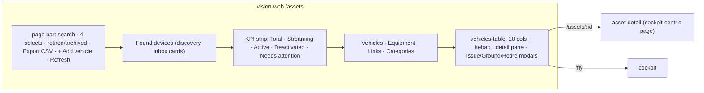

# INVENTORY-REWORK — context (2026-09-06)

Working notes for the Inventory page rework. **Facts here were verified against code or the
running app on 2026-09-06**, not copied from older plans. The spec that acts on them is
[INVENTORY-REWORK-PLAN.md](INVENTORY-REWORK-PLAN.md); the analog survey is
[inventory-rework/R1-analogs.md](inventory-rework/R1-analogs.md).

Branch: `feat/inventory-rework` off `master` @ `bc74e83c`, in worktree `../vision-inventory-rework`
(the main tree carries another task's uncommitted work on `feat/live-topics-zones-system` — never
stash it).

## 1. The owner's ask

> "Rework the inventory page. Think about cards, flows, buttons, what user needs, what user wants,
> what user will click in what situation. Double-check if assets are visible for only the assigned
> (having access to) people. Remake the whole flow of inventory. Check the analogs in other systems."

Three deliverables: (a) a per-persona flow/verb design of `/assets`; (b) a visibility audit;
(c) an analog survey folded into the design.

## 2. What exists (post WAREHOUSE-UX W1–W10, AUTH-ROLES, CREW-CONTROL — all on master)

Domain (vision-warehouse, pure leaf): `Asset{Identity, Custody, InventoryState, LifecycleState}`,
`MaintenanceRecord` (open record ⇒ effective `MAINTENANCE` ⇒ readiness NO-GO, engage refuses).
Stored states `IN_STOCK | MAINTENANCE | RETIRED`; `ISSUED` (custodian set) and `IN_FIELD` (open
usage) are derived by `InventoryStates#effective`. Custody (who physically holds it) is a separate
axis from Ownership (group) and from pilot **Assignment** (identity context — who may fly it).

Authority (vision-platform): `Authority(scope, capabilities)`; `mayManageOrg()`,
`mayManageFleet(Ownership)`, `mayAdminister()`. Roles are presets: VIEWER → {} · PILOT →
{OPERATE_PAYLOAD, COMMAND_FLIGHT} · MANAGER/ADMIN → all four. Scope (vision-identity
`DefaultScopeResolver`): ADMIN → unbounded · MANAGER/VIEWER → group subtree · PILOT-only → the set
of assigned assets (empty set when unassigned). `AssignmentRole{PILOT, CREW}` per (user, asset).

## 3. Visibility audit — verdict

**Server side: correct.** Every inventory read the page makes is scoped to `currentUser.scope()`:

| Endpoint | Gate | Read from |
|---|---|---|
| `GET /api/assets`, `/api/assets/{id}` | `assetService.assets(scope, includeDeleted)`; details 404 out of scope | `AssetController` |
| `GET /api/fleet/summary`, `/api/fleet/readiness` | scoped | `FleetController`, `ReadinessController` |
| `GET /api/assets/{id}/maintenance`, `/api/maintenance` | scoped (`VisibilityScope#includes`) | `AssetInventoryController` |
| `GET /api/inventory/export` (CSV) | `toCsv(scope)` | `InventoryExportController` |
| `GET /api/devices` | scoped | `DeviceController` |
| `GET /api/users` | `userService.list(scope)` → **empty list** for an ASSIGNED_ASSETS scope | `UserAdminController` |
| `GET /api/discovery/inbox` | `mayManageOrg` (403 otherwise) | `DiscoveryInboxController` |
| custody / inventory / maintenance writes | `Authority#mayManageFleet(ownership)` | warehouse services |
| `PUT/DELETE /api/assets/{id}/pilots/{userId}` | `mayManageFleet` | `AssignmentController` |
| `GET /api/me/assignments` | self-scoped, `@OpenByDesign` | `AssignmentController` |

So a PILOT sees exactly the assets assigned to them, a VIEWER/MANAGER their group subtree, an
ADMIN everything. **Nothing leaks.**

**Client side: drifted** (the PLATFORM-AUDIT T2 pattern again — the web renders verbs the server
will refuse):

| # | Defect | Where | Effect |
|---|---|---|---|
| A | Row kebab (Issue/Return/Ground/Release/Retire), detail-pane maintenance "Open record"/"Close", page-bar `+ Add vehicle` render with **no capability check** — `vehicleRowActions(row)` takes only archived/lifecycle/inventoryState | `features/inventory/vehicles-logic.ts`, `vehicles-table.html`, `inventory.html` | a pilot/viewer clicks → 403 toast; `+ Add vehicle` bounces off `orgGuard` |
| B | `issue` writes **custody only**; the `/add-source` wizard's Hand-over step does custody **then** `assignPilot` as two client calls (`onboarding-store.ts:1307-1308`) | `AssetInventoryController#custody` → `AssetCustodyService#issue` | WAREHOUSE-UX D3 ("issuing does both in one command") is half-shipped and lives in the wrong layer; a PILOT issued from `/assets` without a prior assignment **cannot see the vehicle in their hand** |
| C | Custodian and pilot names are client-joined against `listUsers()` — empty for a pilot | `vehicles-logic.ts` (`nameById.get(id) ?? id`), `asset-detail/pilots-card.ts` | pilots read raw UUIDs |
| D | `loadAll` = 5 parallel calls **+ one `getAsset` per asset** (N+1) | `inventory-facade.ts#loadAll` | 20 assets → 25 requests; the OPERATOR-UX-7 pre-flight board has the same open item |
| E | Issue dialog's custodian `<select>` lists **every** user in scope (36 on the dev DB, 32 of them `demo.*`), not pilots | `vehicles-table.html` Issue modal | the manager scrolls a roster to find a pilot |
| F | Found-devices inbox fetches for everyone; server answers 403 to non-admins | `found-devices.ts` | needless request/error path for pilots and viewers |

## 4. Live evidence (localhost:8080, admin session, 2026-09-06 21:20)

- 20 assets, **all `IN_STOCK`, zero custodians**, 17 with pilot assignments (raw `userId`s on
  `GET /api/assets/{id}/pilots` — `PilotResponse{userId, role}` carries no name).
- 36 users; accounts `admin`, `bob` (PILOT), `anna` (CREW), `viewer1` exist from the CREW-CONTROL
  live matrix — the plan's exit matrix reuses them (owner supplies passwords; the `admin/manager/
  pilot` seed accounts are **not** present — `seed-dev-users=false`).
- Readiness column reads `● Unknown` on every row with no cause; KPI `NEEDS ATTENTION 2` has no
  click-through; state chip is the only chip per row (good, §5 of frontend-style holds).
- Kebab for an in-stock vehicle: `Issue… · Ground… · Retire · Open · Fly`. Detail pane: state chip →
  Identity dl → Custody dl → Maintenance — all `—` on the dev fleet.
- Dark theme renders correctly. `/assets/:id` is cockpit-first (Open cockpit / Watch live /
  Readiness ›, Position map, camera pose) — inventory facts live only in drill-ins.

## 5. Analog survey — what to carry (full evidence in R1-analogs.md)

| Pattern (seen in ≥4 products) | Applies as |
|---|---|
| 3+-state health encoded by colour, **hover/inline cause** (Skydio "Front Camera Failure") | readiness cell = dot + verdict + first blocker text |
| Role-gated visibility: admin all · pilot "mine" · read-only in between | persona-shaped page (§PLAN 3) |
| Detail = hub of identity · status · custody · history | drawer anatomy (§PLAN 5) |
| Timestamped, authored maintenance entries as the atomic record | already `MaintenanceRecord` — surface "opened by · when" |
| Self-service check-out/-in (Snipe-IT, Airdata "pilots with Edit can check out") | custodian self-return (D5) |
| Field pilot logs unscheduled maintenance from the flying app (Auterion roadmap) | pilot "Report issue" (D4) |
| Tables win for compare/scale (NN/g); bulk controls appear only on selection (Pencil & Paper) | table for managers, cards for a pilot's 1–5 vehicles, bulk deferred |
| Snipe-IT: assignability class + derived "Deployed" | matches `InventoryState` stored/derived split — no change |
| QR as the physical↔digital bridge (Airdata, Dronedesk, Fleetio) | out of scope — noted for a later plan |

## 6. Decisions taken in this rework (owner may veto — see plan §2)

D1 issue ⇒ custody **+ PILOT assignment** in one server-side command (identity composes warehouse).
D2 return ⇒ custody only; the assignment stays (authorization outlives possession).
D3 names travel on the wire (`custodianName`, pilot `displayName`) — no client user-list join.
D4 a COMMAND_FLIGHT holder whose scope includes the asset may **open** a maintenance record
("Report issue"); only `mayManageFleet` may close/release. *Authorization widening — owner confirms.*
D5 the current custodian may **return** their own vehicle. *Authorization widening — owner confirms.*
D6 a session without `MANAGE_FLEET` sees **"My vehicles" cards**, not the manager table.
D7 the KPI strip becomes the **view switcher** (Needs attention · In field · Issued · In stock ·
Maintenance); the four filter selects collapse to search + category + a `More filters` disclosure.

## 7. Files read for this context (so agents need not re-read)

`docs/plans/active/WAREHOUSE-UX-PLAN.md`, `PLATFORM-AUDIT-ANALOGS.md`, `asset-flows/R2-pilot-journey.md`,
`asset-flows/R4-industry-practice.md`, `docs/extracts/design/04-assets.md`, `05-asset-detail.md`,
`docs/conclusions/UX-SIMPLIFY-REVIEW.md` (F2/F3), `E2E-FLOW-AUDIT-2026-09-05.md` §D/§6,
`docs/main/UX-DESIGN.md` §1; `contexts/vision-warehouse/MODULE.md`, `contexts/vision-identity/MODULE.md`;
web `features/inventory/*`, `features/asset-detail/asset-detail.html`, `features/maintenance/*`,
`core/fleet/inventory-logic.ts`, `core/api/models.ts` (AssetSummary/UserSummary/AssignedPilot),
`core/auth/auth-store.ts`; api controllers listed in §3; `DefaultAssetCustodyService`,
`DefaultScopeResolver`.
