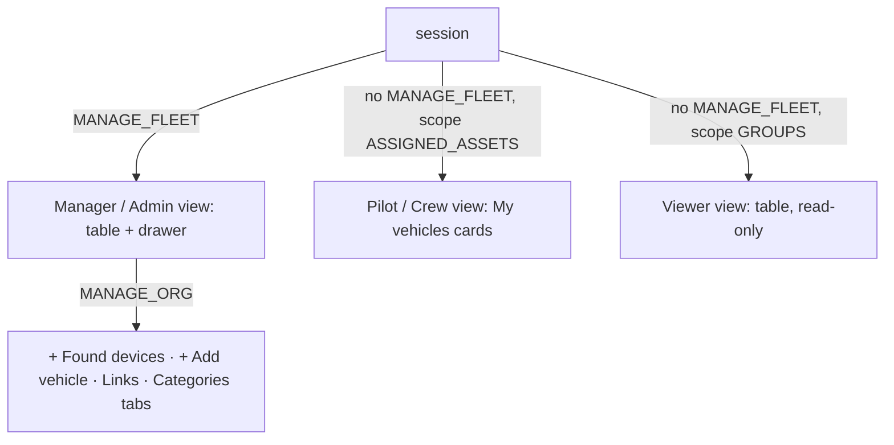
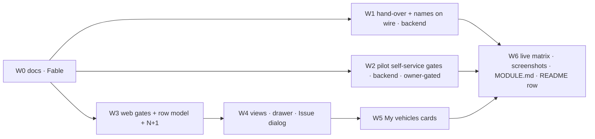

# INVENTORY-REWORK — plan

**Status: SPEC, 2026-09-06.** Context and verified defects in
[INVENTORY-REWORK-CONTEXT.md](INVENTORY-REWORK-CONTEXT.md); analog evidence in
[inventory-rework/R1-analogs.md](inventory-rework/R1-analogs.md). Supersedes the page half of
WAREHOUSE-UX-PLAN §3.3 (table/verbs) and completes its D3; leaves its domain model untouched.

Branch `feat/inventory-rework` (worktree `../vision-inventory-rework`). One task, one branch; waves
land as commits on it; sub-branches only if a wave needs one.

---

## 1. The one sentence

`/assets` becomes **a page shaped by who is looking**: a fleet manager gets a scan → compare → act
table whose top row answers "what needs me", a pilot gets their own vehicles as launch-pad cards, a
viewer gets the same table read-only — and every verb on screen is one the server will accept.

## 2. Decisions (D1–D7 recorded in the context §6)

| # | Decision | Default | Owner veto changes |
|---|---|---|---|
| D1 | Issue = custody + PILOT assignment, one server command | ship | W1 shrinks to names-on-wire only |
| D2 | Return keeps the assignment | ship | W1 `HandoverService#returnToStock` also unassigns |
| D3 | Names on the wire | ship | — |
| D4 | Pilot may **Report issue** on an assigned vehicle | ship **after owner yes** | W2 dropped; cards lose the verb |
| D5 | Custodian may **Return** own vehicle | ship **after owner yes** | W2 dropped; cards lose the verb |
| D6 | Pilot/crew view = cards | ship | W5 becomes a reduced-column table |
| D7 | KPI strip = view switcher; selects fold into `More filters` | ship | W4 keeps the four selects |

## 3. Personas → situations → what they click



The switch is `auth.can('MANAGE_FLEET')` first, then `auth.scopeKind()`. It is a rendering choice
only — the server already scopes the data (context §3).

### 3.1 Fleet manager (MANAGER, ADMIN) — owns custody and serviceability

| Situation | Arrives asking | Clicks | Result |
|---|---|---|---|
| Morning check | what needs me? | **Needs attention** stat (default view when > 0) | rows: grounded · open maintenance · stale/never probed · low battery, worst first |
| Pilot at the shelf | give Bob the Backfire | row kebab / drawer **Issue to…** → pilot picker (assigned pilots first, then PILOT-role users in the asset's group) + location | custody + assignment in one call; toast `Issued to Bob · assigned as pilot` with **Undo** (= return) |
| Vehicle comes back | shelve it | **Return to stock** | custody cleared, assignment stays, toast with Undo (= re-issue same custodian) |
| Damage reported | take it out of service | **Ground…** → kind + summary | record opened, state → Maintenance, readiness NO-GO; appears in Needs attention + `/maintenance` |
| Repair done | put it back | **Release** (drawer shows the open record: kind · summary · opened by · when) | record closed |
| Where is X / who has it | find it | search (name · serial · registration) | custodian + location columns |
| End of life | retire / archive | **Retire…** (refused with reason while a custodian holds it) → **Archive** | archived hidden behind `Show archived`; undo toast as today |
| Accounting | export | **Export CSV** (current view's rows) | scoped CSV |
| New hardware appeared | onboard it | Found devices **Add / Attach** (MANAGE_ORG only) | wizard / attach dialog as today |

### 3.2 Pilot (PILOT role; AssignmentRole PILOT) — flies what is theirs

| Situation | Arrives asking | Clicks | Result |
|---|---|---|---|
| Shift start | what can I fly right now? | opens `/assets` → **My vehicles** cards | each card: readiness verdict **with cause**, state, "with you since…" / "in stock at <location>" / "with <name>", last flown |
| Ready to go | fly it | **Fly** (primary, only when GO/UNKNOWN and not grounded) | cockpit, as today |
| Something is wrong | this one is broken | **Report issue…** → kind + summary (D4) | record opened, vehicle grounded; manager's Needs attention grows by one |
| Done for the day | hand it back | **Return** (D5, only when I am the custodian) | custody cleared |
| Curious | details | card title → `/assets/:id` | read-only detail |
| Nothing assigned | why is this empty? | — | `vision-empty`: "No vehicles are assigned to you yet — your fleet manager assigns them from Roster." |

### 3.3 Crew (AssignmentRole CREW) — works the camera

Same cards; primary verb **Open crew seat** (`/crew/:assetId`) when `vision.crew.enabled`, else
**Watch live**. No Report/Return (crew never holds custody).

### 3.4 Viewer (VIEWER, group scope) — looks, never acts

Manager table without kebab or drawer actions; **Watch live** on streaming rows; Export CSV allowed
(server-scoped). No stats that imply action ("Needs attention" still shown — it is information).

## 4. Cards vs table — the decision and why

- **Managers: table.** NN/g's four table tasks (find · compare · edit one · act on many) are exactly
  the manager's day; a fleet grows in rows, and comparing hours/last-flown across rows is a table
  strength cards lack (R1 §"UX writeups").
- **Pilots: cards.** A pilot owns 1–5 vehicles and asks one question per vehicle ("can I fly it,
  where is it"). Ten columns of `—` (custodian, firmware, serial) are noise; a card carries verdict +
  cause + one primary verb. Skydio's Fleet Page and DJI's live device panel both put readiness
  first and verbs second for the operator role.
- **Found devices: cards, kept.** Few, action-oriented, transient.
- **Bulk actions: deferred** (W7). Snipe-IT's bulk check-out is real value for kits (drone +
  controller + batteries to one pilot), but the fleet is 20 assets today; Pencil & Paper's rule
  (bulk controls appear only on selection) is the shape when it comes.

## 5. Surfaces

### 5.1 Page anatomy (manager)

```
page bar   Inventory · 20 items      [search name/serial/registration]  [Category ▾]  [More filters ▾]   Export CSV · + Add vehicle (MANAGE_ORG) · Refresh
inbox      Found devices (MANAGE_ORG, only when > 0)                                     Show resolved (n)
views      ▌Needs attention 2 ▐  In field 1   Issued 0   In stock 19   Maintenance 0        Show retired ☐  Show archived ☐
tabs       Vehicles · Equipment · [Links · Categories — MANAGE_ORG]
table      Name · Category · Readiness (dot + verdict + first blocker) · Custodian · Location · State chip · Firmware · Hours · Last flown · Links · ⋯
drawer     (two-pane, §5.3)
```

- The **view row is the KPI strip** (D7): each stat is a toggle; selected = §4 selection bar; counts
  come from `fleetSummary` + `inventoryState` + readiness, computed in `inventory-page-logic.ts`.
  "All" is reached by deselecting. Default: Needs attention when its count > 0, else All. Last view
  persists per browser (localStorage, wrapped like `ThemeStore`).
- `More filters` discloses State · Custodian · Readiness selects (rarely used once views exist).
- One chip per row stays the **state** chip; readiness is dot + text; classification muted text.
- Column order per frontend-style §5; **Location** joins the table (custody has it; nobody could
  see it without opening a row).

### 5.2 Verbs by effective state × authority (the one table both kebab and drawer read)

| Effective state | mayManageFleet | assigned pilot (COMMAND_FLIGHT, in scope) | custodian == me | anyone in scope |
|---|---|---|---|---|
| IN_STOCK | **Issue to…** · Ground… · Retire… · Archive | Fly (if not NO-GO) · Report issue (D4) | — | Open · Watch live (if streaming) |
| ISSUED | **Return to stock** · Ground… · Retire ✗ (reason: held) | Fly · Report issue | **Return** (D5) | Open · Watch live |
| IN_FIELD | Watch live · Ground… (confirm: "takes effect at next engage") | Fly · Report issue | — | Open · Watch live |
| MAINTENANCE | **Release** · Retire… · Archive | — (Fly disabled with reason) | — | Open |
| RETIRED | Archive | — | — | Open |
| ARCHIVED | Restore (undo window as today) | — | — | Open |

Implementation: `vehicleRowActions(row, actor)` where `actor = {canManageFleet, canCommandFlight,
canManageOrg, userId, assignedAssetIds}` — one pure function in `core/fleet/inventory-logic.ts`,
spec-tested per cell above; both `vehicles-table` and `my-vehicles` consume it. Disabled verbs
carry a `title` reason; verbs the server would 403 are **not rendered**.

### 5.3 Detail drawer (frontend-style §6 anatomy)

```
title row     Backfire 2                                  Simulated · Robot (muted)
chips         [In stock]   ● Not probed yet
fact grid     CUSTODIAN  —          LOCATION  —          SINCE  —
              SERIAL  —   MAKE  —   MODEL  —   REGISTRATION  —
              FIRMWARE  —   HOURS  15h 04m   LAST FLOWN  7h ago   LINKS  2
h3 Why not ready      blocker list from readiness (first blocker bold), or "GO"
h3 Maintenance        open record: kind · summary · opened by <name> · <age>   |  "No open records"
h3 Pilots             <name> (PILOT) · <name> (CREW)   [+ Assign… — MANAGE_FLEET]
actions row   [Issue to…]  Ground…  Fly       Open full ›
```

Max one primary `.btn`; "Open full ›" last. Details (`getAsset`) load **on selection**, not for
every row.

### 5.4 My vehicles card (pilot / crew)

```
┌ Backfire 2 ──────────────────────── Simulated · Robot ┐
│ ● GO                     [With you · since 2h ago]     │
│ Last flown 7h ago · 15h 04m total                      │
│ [Fly]  Report issue…  Return                           │
└────────────────────────────────────────────────────────┘
```

Readiness first (colour = state, cause as text when not GO); custody line in prose ("In stock at
Shelf B", "With Anna K."); verbs per §5.2. Grid, 1–3 columns responsive. New 3-file component
`features/inventory/my-vehicles.{ts,html,css}` + `my-vehicles-logic.ts` (+spec).

### 5.5 Issue dialog

Custodian picker: **Assigned pilots** (this asset) → **Other pilots** (PILOT-role users in the
asset's group; same rule as `onboarding-logic.ts#…PILOT membership in groupId`) → `Show everyone`
disclosure. Location text. Primary button reads **Issue to <name>** once picked. Success toast
names both effects: `Issued to Bob · assigned as pilot` + Undo.

## 6. Frozen wire contract (additive; vision-api owns it)

| Change | Shape | Consumer |
|---|---|---|
| `CustodyResponse` | `{custodianId, custodianName?, location?, since?}` — name resolved server-side by `UserService` **unscoped by id** (label lookup, not a listing) | table, drawer, cards (kills defect C) |
| `PilotResponse` | `{userId, role, username, displayName}` | drawer Pilots, `pilots-card` |
| `AssetSummaryResponse.deviceCount` | `int` = `asset.devices().size()` | Links column without `getAsset` (kills defect D) |
| `POST /api/assets/{id}/custody` `ISSUE` | semantics: custody **+** `AssignmentRole.PILOT` assignment (idempotent when already assigned); if the assignment write fails the custody write is compensated (returned) and the error propagates. Actor/authority unchanged (`mayManageFleet`) | facade `issueTo`; wizard Hand-over drops its second call |
| `POST /api/assets/{id}/custody` `RETURN` | + allowed when `actor == custodianId` (D5) | cards Return |
| `POST /api/assets/{id}/maintenance` | + allowed when caller holds `COMMAND_FLIGHT` **and** `scope.includes(asset)` (D4); close stays `mayManageFleet` | cards Report issue |
| `GET /api/auth/me` | unchanged — web already has `capabilities`, `scopeKind`, `userId` | persona switch |

No new endpoint, no flag. Denials use the existing refusal vocabulary (E2E-FLOW-AUDIT U2).

## 7. Waves — disjoint file scopes, agent per wave



| Wave | Agent | Scope (files) | Delivers | Green when |
|---|---|---|---|---|
| **W1** hand-over + names | `spring-integrator` (Opus) + `application-service` for identity | `contexts/vision-identity/**` (new `application/handover/HandoverService` + `DefaultHandoverService`, tests) · `station/vision-api/**` (`AssetInventoryController#custody` → HandoverService; `CustodyResponse`, `PilotResponse`, `AssetSummaryResponse.deviceCount`; name lookup) · `station/vision-app/**` (wiring only) | §6 rows 1–4 | `./mvnw -B -pl contexts/vision-identity test` · `-pl station/vision-api test` (incl. `EndpointAuthorizationTest`) · `-pl station/vision-app test` (docker) · identity/api MODULE.md updated |
| **W2** pilot self-service | `application-service` (Sonnet, Opus reviews the gate) | `contexts/vision-warehouse/**` only (`DefaultMaintenanceService#open` gate, `DefaultAssetCustodyService#returnToStock` gate, tests) — **starts only after the owner confirms D4/D5** | §6 rows 5–6 | `./mvnw -B -pl contexts/vision-warehouse test`; warehouse MODULE.md |
| **W3** web gates + row model | `web-ui` (Sonnet) | `features/inventory/vehicles-logic*.ts`, `vehicles-table.*`, `inventory-facade.ts`, `found-devices.ts`, `core/fleet/inventory-logic*.ts`, `core/api/models.ts` (additive optional fields) | `vehicleRowActions(row, actor)` per §5.2 · no verb rendered the server refuses · `loadAll` without per-asset `getAsset` (details on selection) · names from wire with id fallback · readiness cause text · inbox fetched only for MANAGE_ORG · Location column | `npm run test:ci` · `npx tsc --noEmit` · `architecture.spec.ts` |
| **W4** views + drawer + dialog | `web-ui` (Sonnet; Opus owns the flow) | `features/inventory/inventory.{html,css,ts}`, `inventory-page-logic*.ts`, `vehicles-table.*` (drawer + Issue dialog only), new `inventory-view-store.ts` | §5.1 view row replacing KPI strip + `More filters` · §5.3 drawer · §5.5 dialog · toasts with Undo · Export uses current view | same as W3 + both-theme screenshots |
| **W5** My vehicles | `web-ui` (Sonnet) | new `features/inventory/my-vehicles.{ts,html,css}`, `my-vehicles-logic*.ts`; the persona `@if` in `inventory.html` (W4 leaves a marked slot) | §5.4 cards, empty state, crew verb | same as W3 + screenshots as `bob` |
| **W6** close-out | Opus | `station/vision-web/MODULE.md`, `docs/plans/README.md` (row W → PARTIAL/DONE + this plan), this plan §9 | live matrix (§8), screenshots both themes × 3 personas | matrix table filled in §9 |
| W7 (deferred) | — | — | bulk Issue N → one pilot · Export selected · asset-detail "Custody & state" card sharing §5.2 | not scheduled |

Rules for every agent: read the MODULE.md of each module touched (and its dependencies) before
code; scoped builds only (`-pl`), never reactor-wide; no new constructor overloads (CLAUDE.md
rule 10); 3-file Angular components; tokens only, both themes; `MODULE.md` updated in the same
commit; commit on `feat/inventory-rework` with a `feat(inventory-rework Wn): …` subject.

## 8. Exit criteria

1. Builds above green; `npm run test:ci` and `npx tsc --noEmit` green (bare `vitest run` fakes
   failures — use the npm script).
2. **Live matrix** on `localhost:8080` with the existing accounts (owner supplies passwords):

| Account | Sees | Must see | Must not see |
|---|---|---|---|
| `admin` (ADMIN) | table, 20 rows, Found devices, all tabs | Issue → toast names custody **and** assignment; `GET /api/assets/{id}/pilots` gains the pilot | — |
| `bob` (PILOT) | My vehicles cards for assigned assets only | names not UUIDs; Fly; Report issue (D4) → row goes Maintenance for admin | Issue/Ground/Retire/Add vehicle/Found devices/Links/Categories; zero 403s in the network log |
| `anna` (CREW) | cards; Open crew seat / Watch live | — | Report/Return |
| `viewer1` (VIEWER) | table read-only | Export CSV works | any kebab/drawer verb |

3. Screenshots of `/assets` in light + dark for admin, bob, viewer1 attached to §9.
4. `docs/plans/README.md` row **W** amended to point here; row for this plan added to §3.

## 9. Close-out (filled by W6)

### 9.1 Landed (2026-09-06/07, `feat/inventory-rework`)

| Wave | Commit | Verdict |
|---|---|---|
| W0 docs | `f6382db4`, `bc41aad8` | context + plan + R1 analogs; README row INV |
| W1 hand-over + names | `49a6411b` | identity 153→162, api 1052→1059, app 353 (Docker ran); `HandoverService` skips assign when *any* role exists (never promotes a CREW seat), compensates with `returnToStock` on a failed grant, 409 on the failure path |
| W3 web gates + row model | `5f98f834` | 3825→3860 tests; `vehicleRowActions(row, actor)` spec per cell; `loadAll` = 5 flat requests, details/pilots on selection |
| W4 views + drawer + dialog | `9587405e` | 3860→3906 tests; view predicates read the row's own state chip; default view latched once per load; `Export all (CSV)` (endpoint exports whole scope); pilot picker rules lifted to `core/org/pilot-logic.ts` |
| W5 My vehicles cards | _in flight_ | |
| W2 pilot self-service | **parked — owner decision D4/D5** | |
| W6 live matrix | _pending_ | |

### 9.2 Found while building (not in the spec; owner decides where they go)

| # | Finding | Wave | Proposed home |
|---|---|---|---|
| F1 | The asset's **ownership group is not on the wire** (`AssetSummaryResponse.owner` is the owning *user*; nothing serialises `Ownership#groupId`), so the Issue dialog's "Other pilots" rung uses the session's own group as a stand-in and widens to every scoped pilot when that finds nobody. Honest fix: `groupId` on the summary | W4 | small vision-api follow-up; then §5.5 rung 1 becomes exact |
| F2 | `AssetInventoryController` now takes **six** constructor collaborators (ceiling is five); `HandoverService` joined `AssetCustodyService` because ground/release/retire stay warehouse verbs. Fix: split the four `/maintenance` handlers into their own controller | W1 | vision-api hygiene wave |
| F3 | Custody/inventory **mutation responses carry no `custodianName`** (no name join in that controller) — the web re-fetches `GET /api/assets/{id}` after every verb (one request). Either join there too or accept the re-fetch as the contract | W1/W4 | accept; documented on `AssetSummaryResponse` |
| F4 | `+ Assign…` in the drawer is a **link** to `/assets/:id` — `pilots-card` owns its own fetches and cannot be mounted under the facade without a refactor to inputs | W4 | later, with F1 |
| F5 | `InventoryExportController` exports the whole scope; a per-view export needs a filter parameter | W4 | deferred with W7 bulk actions |
| F6 | `DEACTIVATED` lifecycle had no row in §5.2 — treated as ARCHIVED (Restore only); an unfetched `inventoryState` offers no mutating verb | W3 | spec amended by this row |
