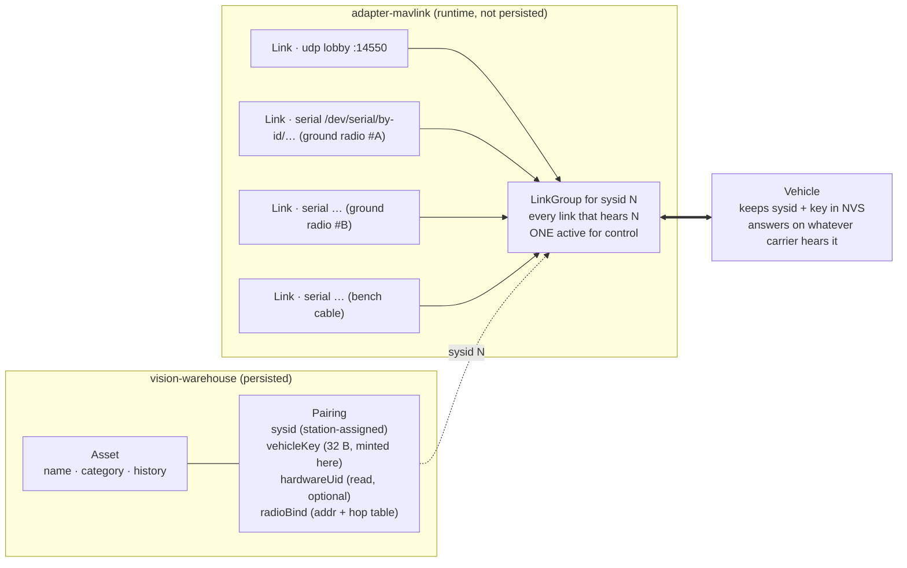
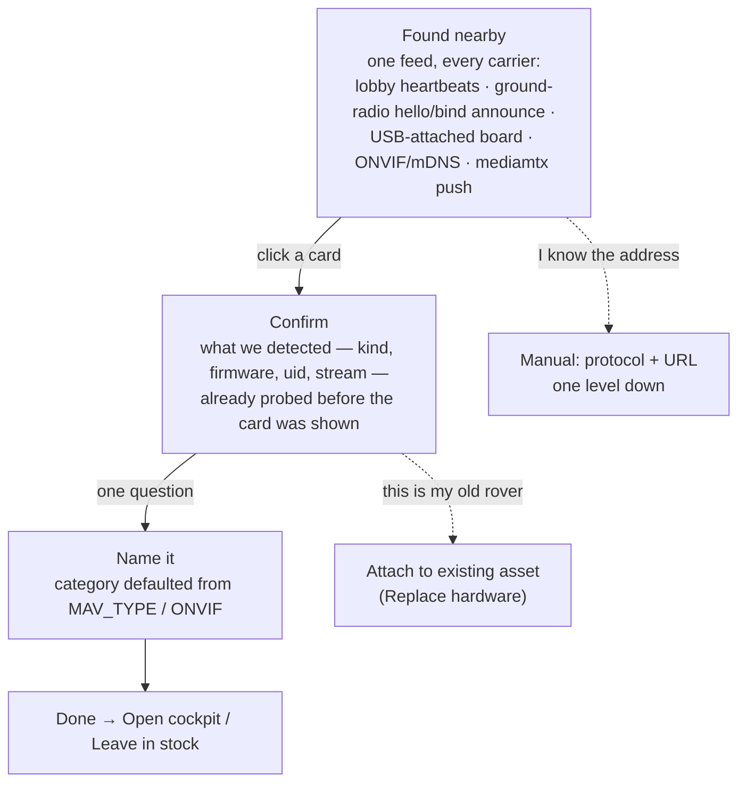

# Link & pairing — one way to reach an asset, over any carrier, from any transmitter

**Status: PROPOSED 2026-09-17 — research done, nothing built.** Owner's ask, verbatim intent: *adding
a device must be the easiest thing, one step at a time, auto-configured; losing an ESP32 or moving to
another Wi-Fi must not mean reconfiguring every board and route; Wi-Fi is just one carrier and the main
one is radio (nRF24 + Arduino transmitters); one asset binds to many transmitters and one computer
drives many transmitters.*

Research corpus (six Sonnet reports, code-grounded where the subject is our code):
[`docs/conclusions/link-research/`](../../conclusions/link-research/) — `01` add-device flow audit ·
`02` platform + firmware link-layer audit · `03` binding patterns (ELRS, SiK, Meshtastic, Matter…) ·
`04` nRF24 as a ground radio · `05` multi-link arbitration (ArduPilot, QGC, mavlink-router, ELRS Gemini) ·
`06` adoption UX (UniFi, Home Assistant, ESPHome, QGC…). This document is the synthesis; the reports hold
the citations.

| § | Section |
|---|---|
| 1 | Verdict |
| 2 | What the audits found — the five facts that decide the design |
| 3 | The model: Pairing · Carrier · Link |
| 4 | The pairing ceremony, four scenarios |
| 5 | Carriers — the ground radio contract, the air protocol, Wi-Fi demoted |
| 6 | Many links, one vehicle — election and what the vehicle does |
| 7 | The adopt flow — what the operator sees |
| 8 | Where it lands — modules and seams |
| 9 | Waves, gates, order |
| 10 | What I would not do |
| 11 | Open questions for the owner |

---

## 1. Verdict

The platform already has two thirds of what the ask needs, and the missing third is smaller than the
complaint suggests:

- **The station side is nearly carrier-agnostic already.** `drone-link/mavlink-core`'s `MavlinkLink`
  is "bytes in, bytes out" with a stream-vs-datagram hinge, `TcpClientLink` proves the non-UDP shape,
  and `MavlinkSession.addLink` already accepts several links per session. The blocker is one adapter:
  `adapter-mavlink` hardcodes `UdpListenLink`, accepts only `udp://` descriptors, and types the peer as
  `InetSocketAddress` (report 02 §A5). **No serial transport exists anywhere in Java** and no link
  quality (`RADIO_STATUS`, RSSI) is read.
- **Identity is the real defect, not the wizard.** Nothing in `contexts/` or `core/` is a link,
  carrier or pairing. A `Device` is `(protocol, uri, options)` — an address. Both dedup checks
  (`DiscoveryCandidate.identityKeyFor`, `DefaultAssetService.matchDevice`) compare addresses, so a
  camera with a new DHCP lease forks into a second device and a replaced ESP32 is a stranger
  (report 01 §3, defects 3/6). MAVLink is the one robust case — the lobby claims by sysid — and even
  there the wizard's "Add a real drone" helper bakes the station's *current* LAN IP into the config
  block the operator pastes onto the board (report 01 defect 1). That block is, literally, "reconfigure
  all the ESPs".
- **The wizard is wide because it exposes mechanism.** Four fork tiles plus a provisioning tile, a
  "test source" tile on every row of every fork, an eight-protocol dropdown on every row, ~7–10 clicks
  on the happy path (report 01 §1). Every winning product shows one *found* list and asks one question
  (report 06 principles 1–3, 5).

So the design is three separable pieces, each with a precedent that already works at scale:

1. **Pairing** — the vehicle's identity is a key the station mints and the vehicle keeps, plus a
   station-assigned sysid; never an address. (ELRS bind phrase, Matter fabric, MAVLink 2 signing.)
2. **Carrier** — every way bytes move is a `MavlinkLink`; a USB ground radio presents itself as a
   SiK-shaped transparent MAVLink serial bridge with `RADIO_STATUS`, so **one new link class covers
   nRF24 dongles, SiK, ELRS-backpack serial and a bench cable.** (SiK / RFD900.)
3. **Link election** — per asset, every live link receives, exactly one transmits control; radio
   preferred, Wi-Fi second, bench serial only when pinned. (QGroundControl `VehicleLinkManager`,
   mavlink-router `Group`.)

The adopt flow then falls out: one "Found nearby" feed fed by every carrier, a confirm screen, a name,
done — with "Replace hardware" and "Fix address" as small recovery flows that keep the asset's history.

---

## 2. What the audits found — the five facts that decide the design

| # | Fact | Where | Consequence |
|---|---|---|---|
| F1 | Inbound identity is one line: `DefaultPeerDirectory.recordFrame` builds `PeerId(sysid, compid)`; the address is stored beside it only for replies | 02 §A1 | Adding a carrier touches no context — identity is already not the address at the wire layer |
| F2 | Outbound has one chokepoint: `RoutingFrameSink.send(payload, PeerId)` → `FrameWriter.sendTo` | 02 §A2 | Election = choosing which link the sink writes to; no caller picks a socket |
| F3 | "Vehicle gone" is inferred from silence; the only real signal is reader-thread I/O failure; `link-failure-grace` is bound and read by nothing | 02 §A3 | Per-link liveness and `RADIO_STATUS` are new, not a refactor |
| F4 | `AUTOPILOT_VERSION.uid/uid2` is decoded by the wire library and never extracted or stored | 02 §A6 | A hardware identity is free to read; today nothing proves "same board" |
| F5 | The firmware already splits protocol (`ICommandLink`) from carrier (`INetworkLink`), but `MavlinkUdpLink` holds `WiFiUDP`/`IPAddress` directly and the command gate is "first IP wins" | 02 §B | A second carrier is a split inside one class plus a gate rewrite; the seam exists |

Two more that shape the UX rather than the wire: the "Links" tab in Inventory is the Devices table
under another name (01 §4) — there is nothing to migrate from; and no deployment flag hides simulation —
only a per-browser toggle on the `/fly` picker (01 §5).

---

## 3. The model: Pairing · Carrier · Link

**Three words, kept apart on purpose** (report 03 principle 1 and its "do not copy" last item —
Crossfire had to retrofit Multibind because it conflated the two ceremonies):

| Word | What it is | Who owns it | Persisted? |
|---|---|---|---|
| **Pairing** | *Who* the vehicle is: sysid the station assigned, a 32-byte key the station minted, the hardware uid it read back, the radio bind record | `vision-warehouse` (inventory fact, beside `Identity`/`Custody`) | yes |
| **Carrier** | *How* bytes move: `udp` (the standing lobby), `serial` (ground radios, cables), later `ble`/`espnow` | `adapter-mavlink` — one `MavlinkLink` each, enumerated by the station, never registered by the user | no — discovered on hotplug / at boot |
| **Link** | one carrier currently hearing one vehicle, with liveness + quality | `adapter-mavlink`, surfaced to `vision-flight` through a port as a read model + SSE topic | no |

What changes in the existing model: a `Device` of protocol `mavlink` stops carrying `udp://0.0.0.0:14550`
as its address and carries the pairing's sysid instead (`mavlink://sysid/N`, or an options key — frozen
in the wave). Cameras keep their address (a pull URL *is* their carrier) but gain a stable identity for
dedup — ONVIF device uuid / mediamtx path — so an address change is a reconfigure, not a fork.

**Why the key is a MAVLink 2 signing key and not something bespoke.** Signing is one shared secret per
vehicle, valid across every link (link-id is per-channel replay bookkeeping only), already implemented by
ArduPilot, QGC and Mission Planner (report 05 §2). That is exactly "any transmitter holding the key may
command" — except that in this design the *station* holds the key and signs, and transmitters are modems.
So "many TX" never touches the key. The firmware enforces it when it can; until then it enforces the
station-assigned sysid (ArduPilot's `SYSID_MYGCS` shape). Mint the key at pairing regardless, so wave S
(§9) changes enforcement, not the data.

---

## 4. The pairing ceremony, four scenarios

Principles applied: *discover in-band, authorize out-of-band* (a USB cable or a bounded announce window
stands in for a printed code a 3D-printed rover does not have); *the station adopts, the device
announces*; *recovery is a smaller flow than first-add, never a re-add* (report 03 §7–8, 06 principle 7).

| Scenario | Operator does | Station does | Vehicle does | Running link |
|---|---|---|---|---|
| **First pairing** (new ESP32, or a factory-reset one) | plugs it in by USB *or* powers it near a ground radio, clicks the card in "Found nearby", types a name | assigns a free sysid, mints the key, reads `AUTOPILOT_VERSION.uid`, writes `Pairing`; pushes sysid + key (+ radio bind, + Wi-Fi creds via Improv if a cable is present) | is in *announce mode* (bind address on radio / broadcast heartbeats on Wi-Fi) until paired; stores sysid + key in NVS; leaves announce mode | none yet |
| **Replace lost hardware** | opens the asset → *Replace hardware* → plugs the new board in | re-pushes the **same** pairing to the new board; retires nothing automatically; marks the old uid as replaced (history stays on the asset) | as first pairing | none |
| **Add a second transmitter** | plugs another ground radio into the PC | hotplug enumerates it, reads its radio id from its hello, pushes every radio bind it needs; the link group gains a link | nothing — it cannot tell how many transmitters exist | uninterrupted; election may move control to the better link |
| **Move to another Wi-Fi** | nothing on the station side; for the vehicle, either plugs it in (Improv over USB) or — if a radio link is up — enters the new credentials in the asset page | station IP is never stored anywhere (lobby binds `0.0.0.0`, the config-copy block loses its IP line); pushes Wi-Fi creds over USB (Improv) **or over the radio** (a `PARAM_SET`-shaped private message) | reconnects Wi-Fi; radio link never noticed | radio stays active throughout |

The last row is the payoff the owner asked for: **the radio is the out-of-band channel for Wi-Fi.** Once a
vehicle is paired over radio, Wi-Fi becomes a carrier it can be told about, not a prerequisite.

Improv stays exactly what it is — the *network* ceremony — and is never the identity ceremony
(report 03 §8, last paragraph). Today `/provision-wifi` has no server-side link to the `Device` that later
appears (01 §2); in this design it is step 0 of first pairing over USB, on the same screen.

---

## 5. Carriers — the ground radio contract, the air protocol, Wi-Fi demoted

### 5.1 The ground radio, as the station sees it

A USB ground radio (Arduino + nRF24 today; a SiK modem or an ELRS backpack tomorrow) is a **SiK-shaped
transparent MAVLink serial bridge**: MAVLink 2 bytes in both directions on USB CDC, plus, from the radio
itself under `MAV_COMP_ID_TELEMETRY_RADIO` (68):

- `RADIO_STATUS` (#109) at ~1 Hz — rssi / remrssi / noise / txbuf / rxerrors / fixed — the link-quality
  input election needs and the UI shows;
- a **hello** on connect (radio id persisted in EEPROM, firmware version, which binds it holds) — needed
  because CH340 clones ship without USB serial numbers, so `/dev/serial/by-id` alone cannot tell two
  dongles apart (report 04 §5). MAVLink already reserves `MAV_COMP_ID_RADIO`/`RADIO2`/`RADIO3`
  (110–112) beside 68, so up to four dongles can be told apart by component id alone before the hello
  is even needed;
- **radio control** (bind record push, hop table, channel, stats) as `PARAM_SET`/`PARAM_VALUE` on
  component 68, the same parameter protocol the platform already speaks — a COBS side channel only if a
  parameter shape proves insufficient.

The platform therefore needs **one** new link class, `SerialLink` (jSerialComm, `preservesMessageBoundaries
= false`, modelled on `TcpClientLink`), plus a hotplug enumerator, plus `RADIO_STATUS` → `LinkHealth`.
Everything else in `mavlink-core` is reused unchanged (report 02, minimum seam items 1–4).

### 5.2 The air protocol — a bench-gated decision, not a paper one

Report 04 recommends a compact Bayang-style native control frame on the air with MAVLink only for
occasional parameter traffic, because no finished, measured MAVLink-over-nRF24 bridge exists. I weigh it
differently and want the bench to decide:

| | MAVLink 2 over the air, 1-byte fragment header | Compact native control + MAVLink fragments |
|---|---|---|
| Protocols end to end | **one** — the rover firmware already speaks full MAVLink; the dongle is a dumb fragmenter | two — the dongle translates `RC_CHANNELS_OVERRIDE` ⇄ 32-byte frame and synthesizes telemetry MAVLink |
| Control frame | 8-channel v2 override with payload truncation ≈ 30 B → **one packet** | ≈ 15 B → one packet |
| Telemetry >32 B (`ATTITUDE` 40 B, `GLOBAL_POSITION_INT` 40 B) | 2 packets each, on the ack-payload return path | same frames still need fragmenting if carried as MAVLink; otherwise a third custom format |
| Estimated loop | ~20–40 Hz, 10–40 ms typical, 60 ms retry ceiling under interference (04 §3, computed) | same physics; slightly more headroom |
| Converges with ArduPilot vehicles | yes — same bytes on every carrier | no — the translation is rover-specific |

**Gate A0** (§9): measure the sustained 8-channel loop rate and jitter at 250 kbps under a neighbouring
Wi-Fi load, with genuine-silicon modules and the PA+LNA power fix. If MAVLink-over-air holds ≥ 20 Hz
with < 60 ms p95, it wins on simplicity; if not, compact-native is the fallback and the dongle grows a
translator. Either way the USB side (§5.1) and the station are unchanged — that is the point of the seam.

Radio topology (04 §1, §6): the **vehicle is the PRX** listening on up to six pipes (MultiCeiver), each
ground radio a PTX — so "many transmitters, one vehicle" is native; a single dongle time-slices several
vehicles by switching address per packet. Bind = Bayang's scheme: a fixed bind address the firmware
knows, a random operating address + hop table pushed at pairing, persisted both sides. Telemetry rides the
ack payload, which means it is naturally rate-limited by the control poll — and naturally drops the
oldest when saturated, which is rule 7 of CLAUDE.md for free.

### 5.3 The other carriers

- **Wi-Fi/UDP** — the lobby stays as built (ZERO-CONFIG Z2); it is one link among the group, second in
  priority. The only deletion: the station IP line in the wizard's config-copy block.
- **Bench serial** (a cable to the ESP32's UART/USB) — the same `SerialLink`; never elected
  automatically, only pinned by the operator; also the pairing carrier of first resort.
- **ESP-NOW** (an ESP32 dongle instead of an Arduino+nRF24) — $0 extra, 250-byte frames, ~220 m open
  (04 §7). Not v1, but the second carrier that proves the abstraction is real; the dongle contract in
  §5.1 is identical.
- **ExpressLRS MAVLink mode / SiK** — the answer for ArduPilot airframes; both already arrive as
  MAVLink-over-serial and need no work beyond `SerialLink`.

---

## 6. Many links, one vehicle — election and what the vehicle does

Reference model: QGroundControl — one priority-chosen primary link transmits, every other link is
receive-only, the vehicle is "lost" only when all links lose heartbeat; mavlink-router's `Group` for
"several endpoints, one system table" (report 05 §1, §5). Full state machine with hysteresis and
operator override: report 05 §3.

**Station rules**

1. A `LinkGroup` per paired sysid: every link that has heard it, each with heartbeat age + quality.
2. Exactly one link is *active* for control; priority radio > Wi-Fi > pinned serial; a recovering
   higher-priority link needs a dwell window before reclaiming (no flapping on a noisy RSSI dip).
3. Receive from all links at all times — "newest telemetry wins" (CLAUDE.md rule 7) across carriers.
4. Failover is a named, timestamped event on the existing event plane ("radio → wifi, heartbeat age 2.4 s").
5. Operator can pin any link and release to AUTO; a pinned bench link shows a hard warning.
6. Targeted replies go back down the link the request arrived on — ArduPilot's own routing rule.

**Vehicle rules** (the ESP32 firmware today, ArduPilot's parameters tomorrow — report 05 §4)

1. Authorize by pairing (station sysid, then the key), not by the first IP that spoke.
2. Per-carrier liveness clocks, not one global one.
3. Latest setpoint wins; no dedup for continuous control. Replay protection only for one-shots
   (arm, mode) — which signing's timestamp gives for free.
4. Two-tier failsafe: control stream lost on the active carrier → hold within ~1 s; no heartbeat from
   the station on *any* carrier → the slower, less drastic reaction. Today these are one clock.
5. **No election on the vehicle.** It answers whoever is authorized on whichever carrier; the station
   decides who transmits.

**What the operator sees**: every bound link with kind and health; which one is ACTIVE versus
receiving; AUTO versus pinned; the failover history; and a distinct "vehicle is in its own failsafe"
state, because the vehicle can act on a timeline the station did not observe (05 §6).

---

## 7. The adopt flow — what the operator sees

Principles: announce, don't ask · one list, not a taxonomy of tiles · one question per screen · confirm,
don't configure · a stable id, not an IP · recovery smaller than first-add · simulations off the discovery
surface (report 06 §2). The existing wizard's steps collapse into a **feed → confirm → name** flow;
the manual "I know the address" ladder survives one level down.

**Three scripts** (each screen asks one thing; report 06 §3 has the long form):

- *Fresh ESP32 rover, nRF24 dongle in the PC.* Dongle hotplugs → "Ground radio #A ready". Power the
  rover → its bind announce shows a card *"New rover heard on radio A"*. Click → confirm (firmware,
  uid) → name → done. Wi-Fi is offered afterwards on the asset page, pushed over the radio. Zero typed
  addresses.
- *IP camera on the LAN.* ONVIF sweep shows a card with the model and a probed stream URL → click →
  confirm (credentials are the one typed field, only if the probe was refused) → name → done.
  Later IP change: the card reappears as *"Known camera, new address — update?"* because the identity
  is the ONVIF uuid, not the URL.
- *ArduPilot drone over a USB telemetry radio.* Plug the SiK/ELRS dongle → heartbeats arrive on
  `SerialLink` → card → confirm → name → done. Same screens as the rover.

**Simulations** go behind a deployment flag `vision.simulation.enabled` (root config, rule 1) and, when
on, live on a *Playground* page that creates simulated assets — never as a tile beside real finders.
The `Simulated` badge (already shipped, `device.origin`) remains the second safeguard. The "test source"
tile disappears from the wizard.

**Recovery flows on the asset page** (not in the wizard): *Replace hardware* (§4), *Fix address* (exposes
the existing `PATCH /api/devices/{id}`, which today has no UI — 01 defect 2), *Forget pairing*.

---

## 8. Where it lands — modules and seams

| Piece | Module | Layer | Notes |
|---|---|---|---|
| `Pairing` record + `PairingService` (assign sysid, mint key, replace hardware, forget) | `contexts/vision-warehouse` | domain + application | beside `Identity`/`Custody`; Flyway table; key stored encrypted at rest — a deployment secret rule, not a domain concern |
| identity-first dedup (`identityKeyFor`, `matchDevice`) | `contexts/vision-warehouse` | application | uid / ONVIF uuid / path before address; address becomes a *reconfigure* signal |
| `SerialLink`, hotplug enumerator, radio hello + `RADIO_STATUS` → `LinkHealth` | `drone-link/mavlink-core` (link) + `drone-link/mavlink` (enumeration, wiring) | lib + adapter | framework-free in core; jSerialComm dependency in the adapter |
| `MavlinkGateway` with N links; `LinkPeer` replaces `InetSocketAddress` in `CommandTarget`/`VehicleClaimPolicy` | `drone-link/mavlink` | adapter | 02 minimum seam items 2 and 4 |
| `LinkGroup` + election + failover events | `drone-link/mavlink` behind a `vision-flight` port (`LinkStatePort`) | adapter → context | flight owns "who controls"; warehouse owns "who it is" |
| `links` SSE topic + `GET /api/assets/{id}/links` + pin/release | `station/vision-api` | driving adapter | joins the app-wide SSE plane (LIVE-POLL-RETIREMENT rule) |
| MAVLink 2 signing (sign outbound, verify inbound, `SETUP_SIGNING`) | `drone-link/mavlink-core` | lib | new; no signing exists today |
| Found-nearby feed, confirm/name screens, asset Links panel, Playground, recovery flows | `station/vision-web` | UI | feature folders `onboarding/`, `asset/`, `playground/` |
| `vision.simulation.enabled` | root `application.properties` + `vision-app` | config | hides simulation producers from discovery and the wizard |
| firmware: carrier split (`IByteLink`), announce mode, pairing in NVS, per-carrier liveness, two-tier failsafe, signing | `~/Arduino/ardupoilot-start` (outside repo; host harness in `infra/rover-sim/`) | firmware | 02 minimum seam items 7–10 |
| ground-radio sketch (SiK-shaped USB, nRF24 air, bind table from station) | new sketch; recipe in `infra/edge/ground-radio.md` | firmware | OQ3 asks whether it lives in-repo |

Hexagonal check: nothing new enters `vision-kernel`; warehouse stays the leaf (pairing is inventory);
flight reads link state through a port; adapters do not depend on each other (the serial link is in
mavlink-core, the lib both may use); Spring stays in app/api/adapters.

---

## 9. Waves, gates, order

| Wave | Scope | Size | Depends on | Gate |
|---|---|---|---|---|
| **A0 bench** | genuine-silicon auto-ack across every module pair · 8-ch loop rate + jitter at 250 kbps under Wi-Fi load · PA+LNA range on the chosen channels (04 "three things to measure") | owner, hardware | — | decides §5.2 |
| **L1 carrier seam** | `SerialLink` + hotplug + `RADIO_STATUS`→`LinkHealth` · gateway with N links · `LinkPeer` in claim/command · a fake SiK on a pty for tests | M | — | scoped build green; a pty-fed heartbeat claims a sysid with no UDP socket open |
| **L2 pairing** | `Pairing` + service + Flyway · sysid assignment · uid read from `AUTOPILOT_VERSION` · identity-first dedup · `mavlink://sysid/N` descriptor · `PATCH` address exposed · station IP removed from config-copy | M | — | a device re-heard from a new address updates, never forks |
| **L3 election** | `LinkGroup`, election with dwell, pin/release, failover events, `links` SSE + endpoint | M | L1 | SITL on udp + the same SITL via a pty: control moves on link kill, telemetry never gaps |
| **L4 adopt UX** | Found-nearby feed · confirm/name · asset Links panel · Playground · `vision.simulation.enabled` · recovery flows | M–L | L2 (contract), L3 (panel) | the three §7 scripts walk in ≤ 4 clicks each with zero typed addresses |
| **F1 firmware** | `IByteLink` split · nRF24 carrier · announce mode · pairing in NVS · per-carrier liveness · two-tier failsafe | M, outside repo | A0 | host harness green; first-peer gate replaced by pairing gate |
| **R1 ground radio** | Arduino sketch: USB SiK-shape + hello + param-protocol binds · nRF24 air per A0 · `infra/edge/ground-radio.md` | M, outside repo | A0, L1 | `RADIO_STATUS` visible in the asset Links panel from a real dongle |
| **S signing** | sign/verify in mavlink-core · `SETUP_SIGNING` push at pairing · firmware verify · ArduPilot `MAV_x` signing config | M | L2, F1 | a frame without the key is refused by the rover; with it, accepted on every carrier |

Order: **A0 ∥ L1 ∥ L2** → L3 → L4 (UI starts as soon as L2's contract is frozen) → F1 ∥ R1 → live
walk (the owner's rover over radio + Wi-Fi, one dongle then two) → S. One task per branch; L1/L2 are
disjoint by module; F1/R1 are outside the repo and owner-gated hardware, like every firmware wave before.

What the live walk must prove, in the owner's words: unplug the Wi-Fi and the rover keeps driving on
radio; plug a second dongle and nothing stutters; swap the ESP32 and *Replace hardware* is the whole
procedure; change the router and no board is touched.

---

## 10. What I would not do

- **No `Link` entity in the warehouse.** Links are runtime; persisting them re-creates the address-as-
  identity defect one table over. Persist pairing and radio binds only.
- **No secret typed into three firmwares by hand** — the ELRS failure that Volatile Bind exists to
  paper over. The station is the registrar; dongles are stateless modems.
- **No election on the vehicle**, and no control transmitted redundantly on every link — ArduPilot's
  documented two-GCS override hazard, and wasted airtime on a 32-byte radio.
- **No mesh stack** (RF24Network/Mesh) for a point-to-point control link; no RF24Gateway on the PC
  (it has no SPI bus — the dongle already is the bridge).
- **No default bind key** in any demo path — ZigBee's `ZigBeeAlliance09` lesson; announce mode plus a
  physical-presence window is the demo path.
- **No new context.** Pairing is inventory; link state is flight; the wire is an adapter.

---

## 11. Open questions for the owner

| # | Question | Default if unanswered |
|---|---|---|
| OQ1 | Air protocol — MAVLink-over-nRF24 with a fragment header, or compact native control? | A0 decides; MAVLink if it holds ≥ 20 Hz, p95 < 60 ms |
| OQ2 | Signing in the first cycle, or after the radio is driving? | after — wave S last; the key is minted from L2 regardless |
| OQ3 | Does the ground-radio sketch live in-repo (`infra/ground-radio/`, host-compiled like `rover-sim`) or beside the rover in the Arduino sketchbook? | in-repo — the station and the dongle share a wire contract worth versioning together |
| OQ4 | Is ESP-NOW (an ESP32 dongle, no nRF24) worth a spike as carrier #2 right after R1, to prove the seam with zero new hardware? | yes, one week, after the live walk |
| OQ5 | Do simulations stay reachable in production builds at all (`vision.simulation.enabled=false` by default), or only in dev profiles? | default false; dev compose sets true |
