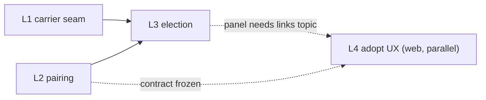

# Link & pairing — implementation plan

**Status: ACTIVE — waves not yet started.** Synthesizes the owner's 2026-09-17 frozen-architecture
decision (below) with the accepted design in
[`LINK-PAIRING-CONTEXT.md`](LINK-PAIRING-CONTEXT.md) and the six research reports in
[`docs/conclusions/link-research/`](../../conclusions/link-research/), re-verified against the
actual code in this worktree (branch `feat/link-pairing`, cut from `master`). Every existing-code
claim below carries a `file:line` citation; every new name is frozen — an implementing agent should
not need to invent a name this document doesn't already give it.

Legend: 🔒 **FROZEN DECISION** = the owner's brief explicitly left this choice to this plan ("decide
and freeze whichever..."); ⚠ **CANNOT HONOR AS WRITTEN** = the brief's literal instruction collides
with how the code actually works, with the reason and the least-churn alternative.

---

## §0 Reading list per agent

Read only the sections named — these docs carry section indices for exactly this reason.

| Wave | Agent | Must read |
|---|---|---|
| L1 carrier seam | adapter-builder | `drone-link/mavlink-core/MODULE.md` §API surface → `com.drones.mavlink.transport (L1)`, §Gotchas, §Status → "Frozen-contract objections"; `drone-link/mavlink-core/API.md` §L1 — transport, §Non-goals; `drone-link/mavlink/MODULE.md` §Levels, §API surface (`MavlinkGateway`/`VehicleClaimPolicy`/`MavlinkTelemetrySource` entries), §Gotchas; `station/vision-app/MODULE.md` §Configuration classes (wiring map) |
| L2 pairing | domain-modeler + application-service + spring-integrator | `contexts/vision-warehouse/MODULE.md` §`domain.model`, §`domain.port`, §`application.asset`, §`application.discovery`, §Conventions, §Gotchas; `storage/persistence/MODULE.md` §`repository`, §`entity`, §Schema (migration ledger), §Conventions; `station/vision-api/MODULE.md` §Endpoints, §DTO conventions; `.claude/skills/java-clean-code/SKILL.md` in full |
| L3 election | adapter-builder + application-service | `drone-link/mavlink/MODULE.md` §API surface, §Gotchas; `contexts/vision-flight/MODULE.md` §`domain.port`, §`application` root package; `station/vision-api/MODULE.md` §Live updates (`com.drones.vision.api.live`), §Endpoints; `core/vision-platform/MODULE.md` (Event/Audit sections) |
| L4 adopt UX | web-ui | `station/vision-web/MODULE.md` §`core/api/`, §`core/**` stores, §`features/**`, §Conventions; `.claude/skills/frontend-style` if touching visuals |
| R1 / F1 (outline only) | owner-gated, not delegated this cycle | §5 of this doc; `docs/conclusions/link-research/04-nrf24-ground-radio.md` |

Every implementing agent also reads `.claude/skills/java-clean-code/SKILL.md` before adding a type,
per CLAUDE.md's own rule.

---

## §1 The model, condensed

Full model and rationale: `LINK-PAIRING-CONTEXT.md` §3–§7. Three words, kept apart:

| Word | What it is | Owner | Persisted |
|---|---|---|---|
| **Pairing** | *who*: station-assigned sysid, a minted key, an optional hardware uid, an optional radio bind | `contexts/vision-warehouse` | yes |
| **Carrier** | *how bytes move*: udp (lobby), serial (radio/bench) | `drone-link/mavlink` + two new adapters | no — enumerated at boot/hotplug |
| **Link** | one carrier currently hearing one paired sysid, with liveness + quality | `drone-link/mavlink`, surfaced through a `vision-flight` port | no |

---

## §2 Reuse ledger — what exists and is not rewritten

Grounded against the actual worktree (all facts below re-verified this pass, not carried over from
the research reports unchecked).

### mavlink-core / adapter-mavlink

| Fact | Citation |
|---|---|
| `MavlinkLink` is "bytes in, bytes out," carrier-agnostic, with `preservesMessageBoundaries()` | `drone-link/mavlink-core/.../transport/MavlinkLink.java` (interface javadoc) |
| `TcpClientLink` is the exact template for a new stream-shaped link: ctor connects synchronously, `id = "tcp-client:" + host + ":" + port`, `preservesMessageBoundaries()` returns `false`, `send` ignores its `target` param ("accepted for interface uniformity"), `defaultTarget()` returns the one fixed peer | `drone-link/mavlink-core/.../transport/TcpClientLink.java:39,47,56-58,84-90,93-95` |
| `UdpListenLink` — ctor `(String bindHost, int bindPort)`, id `"udp-listen:" + bindHost + ":" + port`, delegates to `UdpSocketIo` | `drone-link/mavlink-core/.../transport/UdpListenLink.java:29-34` |
| `UdpSocketIo.poll` builds `LinkPeer` from the packet's source address; `LinkIntake` counters (`datagramsReceived`/`bytesReceived`/`lastDatagramAt`) are incremented right after `socket.receive` and exposed via a package-private `intake()` — the exact pattern a serial link's own counters should copy (package-private, socket-shaped, not shared) | `drone-link/mavlink-core/.../transport/UdpSocketIo.java:38-40,55-59,73-75` |
| `MavlinkSession.addLink(MavlinkLink)` / `removeLink(LinkId)` already accept an **unbounded** number of links, keyed by `LinkId`; `addLink` throws `IllegalArgumentException` on a duplicate id; both are already carrier-neutral | `drone-link/mavlink-core/.../session/MavlinkSession.java:90-104,107-117` |
| **No `links()` enumeration accessor exists on `MavlinkSession`** — a registry sitting above it must keep its own `Map<LinkId, LinkDescriptor>` | `drone-link/mavlink-core/.../session/MavlinkSession.java:90-175` (full method list checked) |
| The only production caller of `session.addLink(...)` today is `MavlinkGateway`'s package-private ctor | `drone-link/mavlink/.../MavlinkGateway.java:186` |
| `MavlinkGateway` has exactly two ctors, both package-private: `(String bindHost, int port, MavlinkSettings)` → `this(new UdpListenLink(...), settings)`, and the test-seam `(MavlinkLink link, MavlinkSettings settings)` that does the real wiring | `drone-link/mavlink/.../MavlinkGateway.java:170-172,182-208` |
| `CommandTarget` record already uses `InetSocketAddress sourceAddress` | `drone-link/mavlink/.../MavlinkGateway.java:480` |
| `VehicleClaimPolicy.factsFor` converts `peer.address()` (a `LinkPeer`) into `InetSocketAddress` by hand: `new InetSocketAddress(peer.address().host(), peer.address().port())` | `drone-link/mavlink/.../VehicleClaimPolicy.java:276` |
| `LinkHealth` interface: one method `Health of(PeerId id)`; `Health` record has 6 fields `(peerId, connected, lastHeard, received, lost, dropRate)`, **no link-quality field**, keyed only by `PeerId` | `drone-link/mavlink-core/.../session/LinkHealth.java:14,28` |
| `DefaultLinkHealth`'s internal `Window` privately tracks the most-recently-heard `LinkId` per peer only to detect a link switch and reset counters — "latest link wins," the set of links is not retained | `drone-link/mavlink-core/.../session/DefaultLinkHealth.java:27-33 (javadoc), 44, 72-73, 82-96` |
| `StreamDescriptor.options["sysid"]` is **already** the live pinning mechanism: `MavlinkTelemetrySource.OPTION_SYSID = "sysid"`, parsed 1–255 else unpinned, threaded into `VehicleClaimPolicy` | `drone-link/mavlink/.../MavlinkTelemetrySource.java:93,146,392-403`; consulted at `VehicleClaimPolicy.java:211` |
| `MavlinkTelemetrySource.supports()` requires `uri.getScheme()` to be exactly `"udp"` | `drone-link/mavlink/.../MavlinkTelemetrySource.java:87,122-129` |
| `CapabilityReport` is an 8-field record ending in `AutopilotVersion raw` as an explicit escape hatch; **no `uid` field today**, though `raw.uid()`/`raw.uid2()` are already reachable | `drone-link/mavlink-core/.../service/CapabilityReport.java:25-27`; dronefleet `AutopilotVersion.uid()`/`uid2()` confirmed present in the pinned `mavlink:1.1.11` sources |
| `CapabilityReport` has exactly one production construction call site, which does not extract `uid` today | `drone-link/mavlink/.../CapabilityService.java:107` |
| `MavlinkHeartbeatScanner` already builds `udp://<bindHost>:<port>` URIs for discovered vehicles and reads `MAV_TYPE` through the one shared `VehicleClass` table (no local switch) | `drone-link/mavlink/.../MavlinkHeartbeatScanner.java:107,109-111,277-278` |
| `MavlinkSettings` is a framework-free record with nested config-group records (`Scan`, `Rc`, `Inventory`, `Onboarding`, `LinkStatus`, …), each with a `defaults()` factory and a `withX(...)` wither on the parent — the shape a new config group should copy; the actual `@ConfigurationProperties` binding class lives in `vision-app`, outside both `mavlink-core` and `mavlink` | `drone-link/mavlink/.../MavlinkSettings.java:29-42,209-230,605-632` (javadoc lines 17-21 name `VisionMavlinkProperties`) |
| `drone-link/mavlink-core/pom.xml` has exactly 2 dependencies (dronefleet mavlink + test-scope junit); `drone-link/mavlink/pom.xml` already depends on `vision-kernel`, `vision-platform`, `vision-warehouse`, `vision-flight`, `vision-perception`, `mavlink-core` — **no new dependency edges needed for L3** | `drone-link/mavlink-core/pom.xml` (32 lines, full); `drone-link/mavlink/pom.xml` (53 lines, full) |
| No `serial`/jSerialComm/jssc mention anywhere in any `pom.xml` in the repo | repo-wide grep, zero hits |
| `ArchitectureTest.adaptersDoNotDependOnEachOther` uses `slices().matching("com.drones.vision.adapter.(*)..")` — a package-prefix rule that auto-covers any new `com.drones.vision.adapter.*` module with **zero new ArchUnit code** | `station/vision-app/src/test/java/.../ArchitectureTest.java:84-85` |
| `com.drones.mavlink.transport..` may not depend on `codec`/`session`/`service` (L1 must not import L2-L4) — binds `SerialLink`'s package placement | `station/vision-app/src/test/java/.../ArchitectureTest.java:191-193` |
| `com.drones.mavlink..` classes may not import `com.drones.vision..` at all — mavlink-core stays vision-free | `station/vision-app/src/test/java/.../ArchitectureTest.java:174-181` |

### vision-warehouse / persistence

| Fact | Citation |
|---|---|
| `Device` record: `(DeviceId id, String name, Set<Capability> capabilities, StreamDescriptor stream, LifecycleState state, DeviceOrigin origin)` — **no `AssetId` field, no back-reference to Asset at all**; ownership is one-directional, `Asset` holds `Set<DeviceId> devices` | `contexts/vision-warehouse/.../domain/model/Device.java:28-29`; `Asset.java:53` |
| `StreamDescriptor(String protocol, URI uri, Map<String,String> options)` — protocol validated lowercase, uri non-null, options copied immutable | `core/vision-kernel/.../StreamDescriptor.java:22-38` |
| `DiscoveryCandidate.identityKeyFor` already prefers `discovered.method() + "|" + address`, **plus** `"|sysid=" + sysid` when a sysid option is present — sysid-aware dedup partially exists already | `contexts/vision-warehouse/.../domain/model/DiscoveryCandidate.java:92-110` |
| `DefaultAssetService.matchDevice` keys on `(protocol, uri, options["sysid"])`, address-based by design (javadoc: "not by DeviceId... a re-discovered aircraft has no device identity of its own yet") — this is exactly the defect report 01 names | `contexts/vision-warehouse/.../application/asset/DefaultAssetService.java:133-176` |
| `Identity`/`Custody` already use a `NONE` sentinel constant instead of null for "no value yet" — the house convention for optional compound value objects | `contexts/vision-warehouse/.../domain/model/Identity.java:20`; `Custody.java:23` |
| `DeviceCategory.connected` already distinguishes "wraps a live device" (drone, camera) from "does not" (battery, spare part, radio) | `contexts/vision-warehouse/.../domain/model/DeviceCategory.java:16-20,28` |
| 8 existing `*RepositoryPort` interfaces in `domain/port`, 100% consistent naming — `PairingRepositoryPort` follows this, not the brief's shorthand "PairingRepository" | `contexts/vision-warehouse/.../domain/port/*RepositoryPort.java` (8 files) |
| `DeviceEntity`/`JpaDeviceRepository` is the template: `@Entity @Table`, flattened `streamProtocol`/`streamUri` columns + `streamOptions` as `jsonb`, `em.merge` upsert, real hard `deleteById` | `storage/persistence/.../entity/DeviceEntity.java:38-88`; `.../repository/JpaDeviceRepository.java:24-62` |
| `V31__discovery_inbox.sql` is the closer template (dedup-key table, not a plain CRUD one): `id UUID PRIMARY KEY` domain-owned, unique index on the dedup column, `jsonb ... default '{}'`, `TIMESTAMPTZ`, **explicit "no FK to assets" convention comment**, `trg_audit_<table>` trigger | `storage/persistence/src/main/resources/db/migration/V31__discovery_inbox.sql` (lines 29-31 the no-FK comment) |
| Highest real migration is `V36__cv_profile_patch.sql` → next free number **V37** | `storage/persistence/src/main/resources/db/migration/` listing |
| `AssetParameterController`'s `POST /api/assets/{id}/parameters` already resolves renamed params via `VehicleProfileService` and returns `outcome ∈ {ACCEPTED, DENIED, NO_ACK, UNSUPPORTED}` — the exact existing path FLEET-RADIO R5 built for pushing a parameter | `station/vision-api/.../controller/AssetParameterController.java:119-154`; `dto/ParameterWriteResponse.java:82-89` |
| `DeviceController`'s `PATCH /api/devices/{id}` already exists (validates body before the scope 404) and is the "Fix address" recovery action the UX doc references as currently unexposed in the UI | `station/vision-api/.../controller/DeviceController.java:135-145` |
| No `vision.simulation.enabled` key exists; the only real flag is `vision.simulation.resume-on-boot` on `VisionSimulationProperties` (`@ConfigurationProperties(prefix="vision.simulation")`, in `vision-app`) | `station/vision-app/.../config/properties/VisionSimulationProperties.java:28`; repo-wide grep confirms zero hits for `vision.simulation.enabled` |
| No `vision.pairing.*` key exists anywhere, active or commented | repo-wide grep, zero hits |
| `application.yaml` (not a root `application.properties` — none exists) is the actual root Spring config CLAUDE.md's "root configuration" refers to | `station/vision-app/src/main/resources/application.yaml` (1335 lines) |
| `docker-compose.yml` has **no `devices:` key anywhere** today | full-file grep, zero hits |
| Root `pom.xml` `<dependencyManagement>` already has a per-dependency `<properties>` slot pattern (e.g. `jmdns.version`) — the exact slot a `jserialcomm.version` pin follows | `pom.xml:41-42` |
| `drone-link/pom.xml` owns its own `<modules>` (`mavlink-core`, `mavlink`) one level under the root aggregator — `carrier-udp`/`carrier-serial` are added here, each with `<relativePath>../../pom.xml</relativePath>` (two levels below root, same as `video-input/v4l2`/`device-discovery/onvif-mdns-v4l2`) | `drone-link/pom.xml:17-20`; `video-input/v4l2/pom.xml:5-12` |

### vision-flight / vision-platform / vision-api SSE

| Fact | Citation |
|---|---|
| `GeofenceLiveUpdatePort` — the exact template for a new per-topic driven port: one method, "must return quickly, must not throw, fire-and-forget for real I/O, safe for concurrent use," called immediately after the mutating application-service call | `contexts/vision-flight/.../domain/port/GeofenceLiveUpdatePort.java` (full file) |
| `LiveUpdateRegistry implements FleetLiveUpdatePort, TelemetryLiveUpdatePort, ...` — one god-class per the house pattern | `station/vision-api/.../live/LiveUpdateRegistry.java:238` |
| `NoopLiveUpdatePublisher implements` all 7 current live-update ports, one no-op class mirroring `LiveUpdateRegistry`'s own shape, wired when `vision.live.enabled=false` | `station/vision-app/.../devsupport/NoopLiveUpdatePublisher.java` (full file) |
| `LiveTopicKind` is a package-private enum; each constant carries its own wire string; opt-in per-asset kinds (`TELEMETRY`, `GEO`, `TRACKS`, `CV_TRACE`) each get a static factory on `LiveTopic` plus a `parse` switch case | `station/vision-api/.../live/LiveTopicKind.java:25-125`; `LiveTopic.java:47-68,97-111` |
| `EventType` already has `LINK_LOST` — raised by `LinkLossNotifier` on a *total* link-failure signal from `MavlinkSession#onLinkFailure`, asset-scoped (`streamId` always null), attributes `{assetId}` — **orthogonal to failover**, which fires while at least one link is still live | `core/vision-platform/.../EventType.java:24-34` |
| `AuditAction` has `CREATED`/`UPDATED`/`DELETED`/`RESTORED`/… but no pairing-shaped verb; `AuditTargetType` has `ASSET`/`DEVICE`/`DATASET`/`MODEL`/`USER`/`GROUP`/`ASSIGNMENT` but no `PAIRING` — both enums are explicitly designed to extend ("adding auditable kinds later... does not ripple through storage") | `core/vision-platform/.../AuditAction.java` (full file); `AuditTargetType.java:6-9` (javadoc) |

---

## §3 Frozen contracts

### 3.1 `drone-link/mavlink-core` (L1) — package `com.drones.mavlink.transport`

```java
public interface LinkRegistry {
    LinkId register(MavlinkLink link, LinkDescriptor descriptor);
    void unregister(LinkId id);
}

public record LinkDescriptor(CarrierKind carrier, SerialRole serialRole, String label, int priority) {
    // compact ctor: requireNonNull(carrier, serialRole); label non-blank; priority >= 0
}

public enum CarrierKind { UDP, SERIAL }

/** SerialRole.NONE for every UDP descriptor — the Identity.NONE/Custody.NONE sentinel convention
    (Identity.java:20, Custody.java:23), never a null field. */
public enum SerialRole { NONE, GROUND_RADIO, BENCH }
```

`register` does not mint a new id — it delegates to `link.id()` (already stable: `"udp-listen:host:port"`,
`"tcp-client:host:port"`, and a new `"serial:<portName>"` for `SerialLink`) and calls
`session.addLink(link)`; `unregister` calls `session.removeLink(id)`. No change to `MavlinkSession`.

⚠ **CANNOT HONOR AS WRITTEN — link quality does not belong on `LinkHealth`.** The brief asks for
"link quality on `LinkHealth` fed from `RADIO_STATUS`." `LinkHealth.Health` is keyed only by
`PeerId` and already collapses to "whichever link this peer was most recently heard on" — adding a
per-link RSSI field to it would either (a) silently go stale the moment a peer is heard on a second
link, or (b) force every existing caller (`MavlinkLinkStatusProvider`) to reason about a link
dimension it doesn't need. Least-churn alternative: leave `LinkHealth`/`Health` untouched (zero
call-site changes) and add a **new**, separate, `LinkId`-keyed port:

```java
public interface LinkQuality {
    Quality of(LinkId id);
    record Quality(LinkId linkId, Instant lastRadioStatusAt, Integer rssi, Integer remoteRssi,
                    Integer noise, Integer rxErrors, Boolean fixed) {}
}
```
`DefaultLinkQuality` (session package) subscribes to inbound `RADIO_STATUS` (#109) frames whose
source component is `MAV_COMP_ID_TELEMETRY_RADIO` (68) or `MAV_COMP_ID_RADIO`/`RADIO2`/`RADIO3`
(110–112), keyed by the `LinkId` the frame arrived on (not by peer).

**QA pass, 2026-09-17 — this hook is not an open item; it already exists as public API.**
`MavlinkSession.dispatcher()` (`MavlinkSession.java:123-124`) returns the session's
`Dispatcher`, and `Dispatcher.subscribe(MessageFilter filter, Consumer<MavFrame> handler)`
(`session/Dispatcher.java:19`) is exactly the extension point: `handler` runs synchronously on the
RX thread, must not block (matches this class's fire-and-forget map update), and `MavFrame` already
exposes both `frame.link()` (the `LinkId`) and `frame.header().component()`. `MessageFilter`
(`session/MessageFilter.java`) ships the needed combinators out of the box —
`MessageFilter.and(MessageFilter.type(RadioStatus.class), compIdFilter)` where `RadioStatus` is
`io.dronefleet.mavlink.common.RadioStatus` (confirm the exact class name against the pinned
dronefleet jar; `AutopilotVersion` lives in the same `common` package per §2's already-confirmed
citation) and `compIdFilter` is a one-line custom `MessageFilter` (`frame ->
Set.of(68,110,111,112).contains(frame.header().component().value())`). `DefaultLinkQuality` is
constructed with a `Dispatcher` and calls `dispatcher.subscribe(...)` once, in its constructor — no
change to `MavlinkSession`, `onFrame`, or any existing call site.

`SerialLink` (new, modelled line-for-line on `TcpClientLink`): jSerialComm-backed, `id =
"serial:" + portDescriptor`, `preservesMessageBoundaries()` returns `false`, constructor takes an
injectable byte channel seam (so a unit test never opens a real port) plus the real jSerialComm path
for the adapter. `MavlinkGateway.CommandTarget` and `VehicleClaimPolicy.factsFor` change
`InetSocketAddress` → `LinkPeer`:

```java
// was: new InetSocketAddress(peer.address().host(), peer.address().port())
// now:
InetSocketAddress sourceAddress -> LinkPeer sourceAddress = peer.address();  // net deletion, not addition
```

### 3.2 `drone-link/carrier-udp`, `drone-link/carrier-serial` (new Spring adapters, L1)

- `carrier-udp`: `UdpCarrierConfiguration` binds the existing lobby `UdpListenLink`, registers it via
  `LinkRegistry.register(link, new LinkDescriptor(UDP, NONE, "lobby", 50))`.
- `carrier-serial`: `SerialCarrierConfiguration` + `SerialPortEnumerator` (polls
  `SerialPort.getCommPorts()` at `pollInterval`), one `SerialLink` per matched port, registered with
  `new LinkDescriptor(SERIAL, GROUND_RADIO_or_BENCH, label, priority)`. Config, declared directly in
  this module (it is Spring, per the brief's own "(Spring)" label — no split into a framework-free
  record + a `vision-app` binding class the way `mavlink`/`mavlink-core` do, since that split exists
  *because* those two modules predate Spring adapters and one of them is framework-free by rule):

```java
@ConfigurationProperties(prefix = "vision.carrier.serial")
public record CarrierSerialProperties(boolean enabled, Duration pollInterval, int defaultBaudRate,
                                       List<String> allow, List<String> deny,
                                       Map<String, Integer> baudOverrides) {
    // compact ctor validates non-null/non-negative, mirroring MavlinkSettings' nested-record style
}
```

🔒 **FROZEN DECISION — ground radio vs bench cable.** Both are `CarrierKind.SERIAL`; `SerialRole`
(§3.1) is the tag. Priority is a plain int the registering carrier declares at registration time
(no new config surface, no magic number buried in election logic): ground radio registers at a
higher priority than the UDP lobby; a bench cable always registers at priority `0` and is **never**
auto-elected (§3.4 requires an explicit pin to activate a `BENCH` link regardless of its priority
number).

Dependency: `com.fazecast:jSerialComm`, pinned via a new `<jserialcomm.version>` property in root
`pom.xml` (same slot as `jmdns.version` at `pom.xml:41`), managed entry in `<dependencyManagement>`.
`vision-app` wires both new carriers into `MavlinkGateway` (which now `implements LinkRegistry`,
§3.1) inside a new `CarrierWiring` configuration class, sibling to the existing `TelemetryWiring`
(`MavlinkGateway` itself is built inside `MavlinkTelemetrySource`, not directly by `vision-app` today
— `CarrierWiring` calls `gateway.register(...)` after `MavlinkTelemetrySource`'s own construction,
it does not construct the gateway).

`docker-compose.yml` gains a `/dev/serial/by-id/*` device passthrough **only under a profile**
(e.g. `profiles: ["serial"]`, matching the existing `["scale"]`/`["cv-split"]` pattern at
lines 421/433/464/472) — never default-on, since the file has no `devices:` key today and most hosts
running this compose have no such device.

### 3.3 `contexts/vision-warehouse` (L2)

```java
// domain/model/Pairing.java
public record Pairing(PairingId id, DeviceId deviceId, int sysid, VehicleKey vehicleKey,
                       BigInteger hardwareUid, RadioBind radioBind,
                       Instant createdAt, Instant replacedAt) {
    // hardwareUid: plain nullable (null = "not yet read"), same convention as
    // DiscoveryCandidate.registeredAsset's documented nullable field — not every optional value
    // needs a NONE sentinel, only compound value objects do (see RadioBind below).
}

// a byte[] field breaks record equals/hashCode (reference equality) — wrap it, the same reasoning
// PairingId/DeviceId already apply to every other id in the kernel:
public record VehicleKey(byte[] value) {
    public VehicleKey { Objects.requireNonNull(value); if (value.length != 32) throw new IllegalArgumentException(...); }
    @Override public boolean equals(Object o) { ... Arrays.equals ... }
    @Override public int hashCode() { return Arrays.hashCode(value); }
    @Override public String toString() { return "VehicleKey[**redacted**]"; }  // never print key material
}

public record RadioBind(Map<String, String> attributes) {
    public static final RadioBind NONE = new RadioBind(Map.of());  // Identity.NONE/Custody.NONE convention
}

public record PairingId(UUID value) {
    public static PairingId random() { return new PairingId(UUID.randomUUID()); }
    public static PairingId of(String value) { ... }  // exact AssetId/DeviceId template
}
```

🔒 **FROZEN DECISION — `Pairing` keys on `DeviceId`, not `AssetId`.** `Device` has no `AssetId` field
today (§2) — a pairing is a fact about the physical board that answers on the wire (which is
replaced whole on "Replace hardware"), not the categorized/owned inventory row, which survives a
hardware swap unchanged. `PairingRepositoryPort.findByDeviceId` is therefore the primary lookup.

```java
// domain/port/PairingRepositoryPort.java
public interface PairingRepositoryPort {
    Optional<Pairing> findById(PairingId id);
    Optional<Pairing> findByDeviceId(DeviceId deviceId);
    Optional<Pairing> findBySysid(int sysid);
    List<Pairing> findAll();
    Pairing save(Pairing pairing);
    void deleteById(PairingId id);
}

// application/pairing/PairingService.java (interface) + DefaultPairingService (impl)
public interface PairingService {
    Pairing pair(DeviceId deviceId, UserId actorId);
    Pairing attachHardwareUid(PairingId id, BigInteger hardwareUid);
    Pairing replaceHardware(PairingId id, UserId actorId);
    void forget(PairingId id, UserId actorId);
    List<DeviceId> listUnpairedDeviceIds();
}
```

`pair` assigns the lowest free sysid in `vision.pairing.sysid-range` (new config key, e.g.
`min: 1, max: 250`, ArduPilot/QGC reserve 251-255), mints a random 32-byte `VehicleKey`, writes
`Pairing`, raises `AuditAction.CREATED` against a new `AuditTargetType.PAIRING` (§3.5). Hardware uid
is attached separately (`attachHardwareUid`) once a capability probe answers — pairing must not
block on a probe round-trip.

⚠ **CANNOT HONOR AS WRITTEN — `forget` cannot be a soft delete.** CLAUDE.md's own rule is
soft-delete over hard-delete, but a forgotten pairing's sysid must become assignable again
immediately (a live count against `vision.pairing.sysid-range`, not a graveyard of soft-deleted
rows) and its key must stop being valid the moment it is forgotten. `forget` hard-deletes the
`pairings` row; the `Device`/`Asset` rows are untouched and keep their own independent soft-delete
lifecycle. Re-pairing the same device later creates a brand-new `Pairing` (new id, new sysid, new
key) — this is what "recovery is a smaller flow than first-add" already implies for hardware, and
the same logic applies to forgetting.

🔒 **FROZEN DECISION — paired MAVLink devices use an options key, not a `mavlink://` scheme.** The
brief explicitly delegates this ("or an options key — freeze whichever breaks fewest callers").
A new `mavlink://sysid/N` URI would change `uri.getScheme()` away from `"udp"`, breaking
`MavlinkTelemetrySource.supports()` (`MavlinkTelemetrySource.java:128`) and every consumer that
reads `uri.getPort()` for the bind port — a large blast radius. The options-key mechanism already
exists and is already the identity dedup key (`DefaultAssetService.matchDevice`,
`DiscoveryCandidate.identityKeyFor`, §2). **Frozen:** paired devices keep
`uri = udp://0.0.0.0:<mavlinkPort>` (the one shared lobby port — already exactly what
`buildDroneDeviceSpec` in `drone-config-logic.ts:310-317` constructs) with `options["sysid"]` set to
the assigned sysid. Legacy per-device `udp://host:port` descriptors are untouched by this change and
keep working unmodified.

Identity-first dedup: `DiscoveryCandidate.identityKeyFor` and `DefaultAssetService.matchDevice`
change their key order to prefer, in priority: sysid → hardware uid → ONVIF uuid / mediamtx path →
address. An address change on a known identity sets a `knownDevice=true` flag on the discovery
candidate response plus the new address, instead of forking a second device — this is a change to
existing method bodies at `DiscoveryCandidate.java:92-110` and
`DefaultAssetService.java:151-176`, not new methods.

### 3.4 `drone-link/mavlink` (L3) — link election behind a `vision-flight` port

```java
// drone-link/mavlink, new package com.drones.vision.adapter.mavlink.election
public final class LinkGroup {
    // one per paired sysid: every LinkId currently hearing it, each with LinkHealth.Health (peer-level,
    // reused unchanged) + LinkQuality.Quality (§3.1, link-level) + the LinkDescriptor (§3.1)
    // + which one is ACTIVE.
}
```

Populating "every `LinkId` currently hearing sysid N" requires a new per-(peer, link) sighting
tracker — today's `LinkHealth` deliberately discards this (§2, "latest link wins"). **QA pass,
2026-09-17 — same resolution as §3.1's `DefaultLinkQuality`:** the tracker subscribes via
`session.dispatcher().subscribe(MessageFilter.any(), handler)` (`Dispatcher.java:19`,
`MessageFilter.java:19`) — or narrower, `MessageFilter.type(Heartbeat.class)` if presence-only
tracking is enough, since `LinkView.heartbeatAge` (below) is the field that actually needs it — and
keys its own `Map<PeerId, Map<LinkId, Instant>>` off `frame.header().system()`/`.component()` +
`frame.link()`, entirely outside `DefaultLinkHealth`. This is public API on the existing session; no
`MavlinkSession` change and no confirmation against private internals needed.

```java
// contexts/vision-flight, domain/port/VehicleLinkPort.java (driven port; implemented in drone-link/mavlink)
public interface VehicleLinkPort {
    LinkGroupView linksFor(AssetId assetId);
    void pin(AssetId assetId, LinkId linkId);
    void release(AssetId assetId);
}
```

**QA note, 2026-09-17 — the `AssetId` → `DeviceId` seam is implicit here and must be named
explicitly, not left for the implementer to discover.** §3.3 keys `Pairing` on `DeviceId` (frozen,
correctly, since `Device` has no `AssetId` back-reference — `Asset` holds `Set<DeviceId> devices`
one-directionally). This port takes `AssetId` (matching every other per-asset port in vision-flight —
`TelemetryLiveUpdatePort`, `TrackCorrectionLiveUpdatePort`, etc.). The implementation
(`drone-link/mavlink`, §3.4) must resolve `AssetId → DeviceId` before it can look up a `Pairing` —
via `AssetService`/`Asset.devices()` filtered to the one MAVLink-protocol device (an asset onboarded
through this flow has exactly one). This resolution step is not itself a new port (vision-flight
already has the `flight -> warehouse` edge, `ContextArchitectureTest.DECLARED_EDGES`) — it is a
one-line lookup inside `MavlinkVehicleLinkPort`'s (or wherever `VehicleLinkPort` is implemented)
existing `AssetService`/`DeviceService` dependency, not a new collaborator.

```java
public record LinkGroupView(AssetId assetId, List<LinkView> links, LinkId activeLinkId,
                             boolean pinned, Instant lastFailoverAt) {}
public record LinkView(LinkId id, CarrierKind carrier, SerialRole serialRole, String label,
                        boolean active, boolean receiving, Duration heartbeatAge,
                        LinkQuality.Quality quality) {}

// application/link/LinkStateService.java (interface) + DefaultLinkStateService
public interface LinkStateService {
    LinkGroupView linksFor(AssetId assetId);
    LinkGroupView pin(AssetId assetId, LinkId linkId, UserId actorId);
    LinkGroupView release(AssetId assetId, UserId actorId);
}
```

`DefaultLinkStateService` (vision-flight/application, matching `DefaultGeofenceService`'s own
constructor idiom — collaborators, not overload chains) calls `VehicleLinkPort`, then
`LinkStateLiveUpdatePort.publishLinks(...)` (below), then, on an active-link change, publishes a new
`EventType.LINK_FAILOVER` via the existing `EventPublisherPort` — distinct from the already-existing
`EventType.LINK_LOST` (§2: `LINK_LOST` fires when a device's whole telemetry source dies; failover
fires while at least one link is still live).

```java
// core/vision-platform/EventType.java — one new constant, same javadoc convention as LINK_LOST/BATTERY_LOW
LINK_FAILOVER  // attributes: {assetId, fromLinkId, toLinkId, reason}; streamId always null
```

Election rule (per `LINK-PAIRING-CONTEXT.md` §6, unchanged): priority `GROUND_RADIO > UDP > BENCH`
(BENCH only when pinned); a dwell window before a recovering higher-priority link reclaims; RX from
every link at all times, newest telemetry wins across links (CLAUDE.md rule 7); targeted replies go
down the link a request arrived on.

```java
// contexts/vision-flight, domain/port/LinkStateLiveUpdatePort.java — copies GeofenceLiveUpdatePort's shape exactly
public interface LinkStateLiveUpdatePort {
    void publishLinks(AssetId assetId, LinkGroupView snapshot);
}
```
`LiveUpdateRegistry` gains this as an 8th implemented port; `NoopLiveUpdatePublisher` gains it as an
8th no-op method (both are additive edits to existing `implements` clauses, not new classes).

```java
// station/vision-api/.../live/LiveTopicKind.java — one new constant, copying the TRACKS/GEO shape
LINKS("links")
// LiveTopic.java — one new static factory + one new parse-case, copying tracks()/case TRACKS
static LiveTopic links(AssetId assetId) { return new LiveTopic(LiveTopicKind.LINKS, assetId); }
```
Payload is the whole `LinkGroupView` per publish (the W9 "tracks snapshot" rule the brief points at:
one topic, one full-state payload, never a delta).

```java
// station/vision-api — new controller, nested under the existing per-asset convention
GET    /api/assets/{id}/links            -> LinkGroupResponse
PUT    /api/assets/{id}/links/{linkId}/pin
DELETE /api/assets/{id}/links/pin
GET    /api/carriers                     -> List<CarrierSummaryResponse>   // every registered carrier, station-wide, not per-asset
```

### 3.5 Audit / event additions (`core/vision-platform`)

```java
// AuditTargetType.java — one new constant
PAIRING  // "A vehicle's persisted identity — sysid, key, hardware uid, radio bind (link-pairing plan)."
```
No new `AuditAction` needed: `pair` → `CREATED`, `replaceHardware`/`attachHardwareUid` → `UPDATED`,
`forget` → `DELETED`, all against `AuditTargetType.PAIRING`.

### 3.6 `CapabilityReport` (mavlink-core)

```java
public record CapabilityReport(Status status, String firmwareVersion, Maturity maturity,
                                Set<MavProtocolCapability> capabilities, long boardVersion,
                                int vendorId, int productId, BigInteger uid, AutopilotVersion raw) {}
```
One field inserted before `raw` (kept last as the documented escape hatch). One production call site
to update (`CapabilityService.java:107`: `raw.uid()`); implementing agent greps test call sites
before touching the ctor, per the "update call sites, not an overload" rule.

### 3.7 `station/vision-web` (L4) — feature folders

- `features/onboarding/`: replace the fork-tile picker with one `found-nearby` feed (existing
  `OnboardingStore`/`OnboardingFacade` split, per `onboarding-facade.ts:136`/`onboarding-store.ts:184`
  convention) → confirm → name, per `LINK-PAIRING-CONTEXT.md` §7's flow diagram. Manual "I know the
  address" survives one level down. Remove the "test source" tile.
- ⚠ **QA correction, 2026-09-17 — do not delete the station-IP line from `*TargetBlock`.** The
  `serverAddress`/`mavlinkPort` params those functions interpolate (`drone-config-logic.ts:232-288`,
  `configSnippets(firmware, link, serverAddress, mavlinkPort)`) are read from
  `GET /api/system/network` and describe where an **external** device (ELRS backpack, ESP32 bridge,
  companion RPi running `mavlink-router`) should send its packets — "the lobby binds `0.0.0.0`" is
  what the *station* listens on locally and says nothing about what a remote device must dial. Those
  three carriers are Wi-Fi/UDP regardless of this plan's serial carrier, and none of L1-L3 changes
  what a remote bridge needs to be told. Deleting the line would break the copy-paste snippets these
  three recipes exist for. Leave `drone-config-logic.ts` untouched by this plan; if the owner's
  intent was instead "move this line out of the guided wizard and into a Links/carrier context,"
  that is a UX relocation, not a deletion — flag it back to the owner rather than assume either
  reading.
- `features/asset/` (asset-detail page, `asset-detail.html` — confirmed **no Links section exists
  today**, line-checked against the full drill-in list at lines 281-308): new drill-in "Links" panel,
  new `LinksStore` following the `GeoStore`/`LiveStore` per-asset-SSE pattern
  (`geo-store.ts:118-134`, `trackGeo`/`untrackGeo` on `LiveStore`) — subscribes to `links:<assetId>`.
  Recovery actions: Replace hardware, Fix address (wires the already-existing, already-unused
  `PATCH /api/devices/{id}`), Forget pairing.
- `features/playground/` (new): the only place a simulated asset may be created, gated by
  `vision.simulation.enabled`.

🔒 **FROZEN DECISION — `vision.simulation.enabled` is owned by `vision-app`.** The nearest existing
flag, `VisionSimulationProperties.resumeOnBoot` (`@ConfigurationProperties(prefix="vision.simulation")`,
`station/vision-app/.../config/properties/VisionSimulationProperties.java:28`), already lives in
`vision-app`, not `vision-api`. Add `enabled` as a second field on that same record — no new
properties class. This is folded into **L2** (below), not L4: L4 stays purely `station/vision-web`,
and L2 already reaches into `vision-app`-adjacent config for the sysid-range key. Consulted by
`SimulationController` (`@ConditionalOnProperty`) and by whatever wires the `simulation-sources/sim`
adapter's discovery registration.

---

## §4 Waves



Java waves (L1, L2, L3) run **one at a time** — they collide on `~/.m2` and, per CLAUDE.md, must be
scoped with `-pl` against a tree no other agent's task holds red. L4 is Angular and may run in
parallel with L3 once L2's `Pairing`/dedup contract is frozen (already true as of this document).

| Wave | Scope (disjoint files) | Size | Depends on | Build | Exit criteria |
|---|---|---|---|---|---|
| **L1** | `drone-link/mavlink-core`: `LinkRegistry`, `LinkDescriptor`, `CarrierKind`, `SerialRole`, `LinkQuality`+`DefaultLinkQuality` (transport/session packages). `drone-link/mavlink`: `MavlinkGateway implements LinkRegistry`, `CommandTarget`/`VehicleClaimPolicy` → `LinkPeer`. New modules `drone-link/carrier-udp`, `drone-link/carrier-serial` (poms, `SerialLink`, `SerialPortEnumerator`, `CarrierSerialProperties`). `station/vision-app`: new `CarrierWiring`, jSerialComm pin in root `pom.xml`, `docker-compose.yml` `serial` profile. | L | — | `./mvnw -B -pl drone-link/mavlink-core,drone-link/mavlink,drone-link/carrier-udp,drone-link/carrier-serial -am test` | New test classes: `SerialLinkTest` (injectable byte channel, no real port), `SerialLinkSocatIT` (optional, `socat`-gated), `LinkRegistryTest`, `DefaultLinkQualityTest` (fake `RADIO_STATUS` frames on a fake link id). A `SerialLink` fed by a pty claims a sysid with zero UDP sockets open — mutation check: kill the pty mid-stream and confirm `onLinkFailure` still fires (proves the test isn't vacuously green on a link that never actually carried frames). `MODULE.md` updated in place for `mavlink-core` and `mavlink`; new `MODULE.md` for `carrier-udp`/`carrier-serial` per `.claude/skills/module-docs/SKILL.md`. |
| **L2** | `contexts/vision-warehouse`: `Pairing`, `VehicleKey`, `RadioBind`, `PairingId`, `PairingRepositoryPort`, `PairingService`/`DefaultPairingService`, dedup changes in `DiscoveryCandidate`/`DefaultAssetService`. `storage/persistence`: `PairingEntity`, `JpaPairingRepository`, `V37__pairing.sql`. `drone-link/mavlink-core`: `CapabilityReport.uid`. `drone-link/mavlink`: `CapabilityService` call-site update. `station/vision-api`: new `PairingController` (`POST/DELETE /api/devices/{id}/pairing`, `POST .../replace-hardware`, `GET /api/pairings/unpaired-devices`). `core/vision-platform`: `AuditTargetType.PAIRING`. `station/vision-app`: `VisionSimulationProperties.enabled`, `vision.pairing.sysid-range` config key. | M | — | `./mvnw -B -pl contexts/vision-warehouse,storage/persistence,drone-link/mavlink-core,drone-link/mavlink,station/vision-api,station/vision-app -am test` | `PairingServiceTest` (hand-fake `PairingRepositoryPort`): sysid assignment reuses the lowest free number after `forget`; `replaceHardware` clears `hardwareUid`, bumps `replacedAt`, keeps sysid+key. `DefaultAssetServiceDedupTest`: a device re-heard at a new address with the same sysid updates in place, never forks — the literal exit criterion from `LINK-PAIRING-CONTEXT.md` §9. `JpaPairingRepositoryTest` against real Postgres (Testcontainers, per house convention) round-trips `VehicleKey` bytes exactly. Mutation-check note: the dedup test must also assert the *old* address is gone from the updated device, not merely that no second device was created — a test that only checks "still one device" would pass even if the address update silently failed. `MODULE.md` updated in place for all four touched modules. |
| **L3** | `drone-link/mavlink`: `LinkGroup`, election/dwell logic, sighting tracker (open item, §3.4). `contexts/vision-flight`: `VehicleLinkPort`, `LinkStateLiveUpdatePort`, `LinkStateService`/`DefaultLinkStateService`. `core/vision-platform`: `EventType.LINK_FAILOVER`. `station/vision-api`: `AssetLinksController`, `CarriersController`, `LiveTopicKind.LINKS`, `LiveTopic` factory+parse-case, `LiveUpdateRegistry`/`NoopLiveUpdatePublisher` +1 method each. | M | L1 | `./mvnw -B -pl drone-link/mavlink,contexts/vision-flight,core/vision-platform,station/vision-api -am test` | `LinkGroupElectionTest`: control moves to the higher-priority link within one dwell window of it recovering, and does **not** flap on a single missed heartbeat. `DefaultLinkStateServiceTest`: pin/release round-trips, failover publishes exactly one `EventType.LINK_FAILOVER` per active-link change (mutation check: a test that never kills a link and still asserts "no failover event" is vacuous — assert the *count* stays zero only after an explicit no-op tick, and assert exactly one after an explicit kill). `LiveTopicTest`/`LiveTopicKindTest` additions for `links:<assetId>` parse round-trip. `MODULE.md` updated in place. |
| **L4** | `station/vision-web`: `features/onboarding/*` (feed/confirm/name rewrite), `features/asset/*` (Links panel + `LinksStore`), `features/playground/*` (new), `drone-config-logic.ts` (station-IP line removal). | M–L | L2 (contract frozen — already true), L3 (panel needs the `links` topic; UI can stub it until L3 lands) | `cd station/vision-web && npm run test:ci` | The three §7 scripts from `LINK-PAIRING-CONTEXT.md` (fresh rover, IP camera, ArduPilot-over-radio) walk in ≤4 clicks each with zero typed addresses, verified in a real browser per CLAUDE.md's UI-testing rule, not just unit tests. `architecture.spec.ts` stays green (no new cross-feature import). |
| **R1** (outline only) | Arduino ground-radio sketch: USB SiK-shape (MAVLink CDC both ways) + hello + `RADIO_STATUS` at ~1 Hz from comp 68/110-112 + bind records via `PARAM_SET`/`PARAM_VALUE`. Lives outside this repo's Java tree; `infra/edge/ground-radio.md` documents the wire contract L1's `SerialLink`/`DefaultLinkQuality` must accept. | owner-gated hardware | L1 (wire contract), A0 (bench gate in `LINK-PAIRING-CONTEXT.md` §5.2, not repeated here) | — | Not scheduled this cycle; sketched so L1 doesn't invent a contract the real hardware can't meet. |
| **F1** (outline only) | Rover firmware carrier split (`IByteLink`), announce mode, pairing in NVS, per-carrier liveness, two-tier failsafe. Outside this repo. | owner-gated hardware | A0 | — | Not scheduled this cycle. |
| **S** (deferred, not scheduled) | MAVLink 2 signing: sign outbound / verify inbound in `mavlink-core`, `SETUP_SIGNING` push at pairing, firmware verify. `VehicleKey` is already minted at L2 — S changes *enforcement*, not the data. | M | L2, F1 | — | Not scheduled this cycle. |

---

## §5 Non-goals

- **No `Link` entity persisted anywhere.** Links are runtime-only (`LinkGroup`, `LinkGroupView`);
  persisting them recreates the address-as-identity defect this whole plan exists to remove.
- **No election logic on the vehicle.** The station decides who transmits; the vehicle answers
  whoever is authorized on whichever carrier currently reaches it.
- **Signing is not enforced this cycle.** `VehicleKey` is minted at pairing (L2) so wave S later
  changes enforcement, not the data shape — but nothing in L1-L4 rejects an unsigned frame.
- **ESP-NOW is not built.** The carrier abstraction (`LinkRegistry`/`MavlinkLink`) is designed so a
  third carrier is a new adapter module, not a rework — proving that is future work (R1's sibling),
  not this plan's.
- **No mesh stack, no RF24Network/Mesh, no RF24Gateway.** Point-to-point per §3.2/§3.4 only.
- **`vision.carrier.serial.*` is new config; `vision.mavlink.*`/`vision.rc.*` are untouched** — no
  existing MAVLink UDP behavior changes for a deployment that never enables the serial carrier.

---

## §6 Open items

| # | Item | Where it surfaces |
|---|---|---|
| 1 | ~~Exact hook for "which `LinkId` heard sysid N, and when"~~ — **resolved in QA pass**: `session.dispatcher().subscribe(MessageFilter, Consumer<MavFrame>)` is public API (`Dispatcher.java:19`); see §3.1/§3.4. | L1, L3 |
| 2 | `vision.pairing.sysid-range` bounds — ArduPilot/QGC convention reserves 251-255 for GCS/broadcast; confirm the exact reserved band before freezing `min`/`max` defaults. | L2 |
| 3 | Whether `AttachDiscoveryCandidateRequest`/`RegisterDiscoveryCandidateRequest` (existing DTOs on `DiscoveryInboxController`) should trigger `PairingService.pair` automatically on register, or whether pairing is a separate explicit step after attach — the brief's four-scenario table (`LINK-PAIRING-CONTEXT.md` §4) implies "the station adopts" is one motion, but the exact call sequence through `DiscoveryInboxController.register`/`attach` wasn't traced this pass. | L2/L4 boundary |
| 4 | A0 bench gate (air-protocol choice, `LINK-PAIRING-CONTEXT.md` §5.2) — owner-gated hardware measurement, blocks R1/F1 only, does not block L1-L4. | R1/F1 |
| 5 | Whether `GET /api/carriers` is per-asset-filtered or station-wide (frozen above as station-wide, since a carrier is not owned by any one asset) — flag if the owner intended otherwise. | L3, §3.4 |

---

## §7 Architect rulings on §6 (2026-09-17, before L1/L4 dispatch)

| §6 # | Ruling |
|---|---|
| 2 | `vision.pairing.sysid-range=10-250`. Sysid 1 is the factory default of ArduPilot and of the rover firmware — an assigned sysid must never equal a factory default, or an unpaired newcomer collides with a paired vehicle on the lobby. 251–255 are GCS by MAVLink convention (the station itself is 255/190). Both exclusions are documented in the property's comment, not buried in code. |
| 3 | **Adopt is one motion.** `DiscoveryInboxController.register`/`attach` of a `mavlink` TELEMETRY device calls `PairingService.pair(deviceId, heardSysid, hardwareUid)` in the same transaction. Rule: **keep the heard sysid if it is not already paired to another device** (any value 1–250 — an existing fleet keeps its numbers and no parameter push is needed); only on collision assign the lowest free number in the range and return `sysidPushRequired=true` so the confirm screen shows the push step (existing `POST /api/assets/{id}/parameters`, `MAV_SYSID`). ArduPilot applies `MAV_SYSID` after reboot — the UI says so honestly. Explicit pairing endpoints stay for manually registered devices, replace and forget. |
| 5 | Station-wide `GET /api/carriers`, as frozen. |
| — | The three ⚠ deviations (§3.1 `LinkQuality` as its own port; §3.3 `forget` hard-deletes the pairing row; §3.7 keep the station-IP line in third-party bridge snippets) are **accepted**. |
| — | L1 explicit: `MavlinkGateway`'s production path must no longer open any socket. `carrier-udp` is the only creator of the lobby `UdpListenLink`. Legacy per-descriptor `udp://host:port` sources keep working by registering their `UdpListenLink` through `LinkRegistry` (they become registered UDP links), never by bypassing it. |

---

## §8 Live walk (2026-09-18)

Live verification against a running app + real Chrome browser, in worktree `vision-link-pairing`
(branch `feat/link-pairing`). App launched with:

```
VISION_SIMULATION_ENABLED=true VISION_CARRIER_SERIAL_ENABLED=true \
VISION_CARRIER_SERIAL_ALLOW="/dev/pts/5" \
VISION_PERSISTENCE_JDBC_URL=jdbc:postgresql://localhost:5434/vision \
./mvnw -B -pl station/vision-app spring-boot:run
```

Fake vehicles: `pymavlink` (venv) — `fake_rover.py --sysid 10 --uid 0x1122334455667788` (UDP lobby,
script i), a second same-script instance for the collision case, `pty_rover.py` (script iii, pty
pair via `os.openpty()`). Camera source: `ffmpeg -re -f lavfi -i testsrc=... -rtsp_transport tcp
rtsp://localhost:8554/ingest/link-pairing-test-cam2` into the reused `vision-mediamtx-1` container.

**Screenshots: none.** `Page.captureScreenshot` (CDP) timed out (30s) on every attempt this session,
on every tab tried. Root cause not conclusively isolated (an ad-blocker extension was independently
throwing `FILE_ERROR_NO_SPACE` on its own leveldb, host disk was 94% used but not full) — screenshot
capture was non-functional throughout, so verification instead relied on `get_page_text`, `find`,
`read_network_requests`, `read_console_messages`, and direct API/DB checks at each step. Also:
`computer`-tool clicks (coordinate- and `ref`-based) did not register as functional click events on
the `/add-source` wizard; all UI interaction was done via `javascript_tool` calling a real DOM
`element.click()`, which did work. Both are environment-automation limitations, not app defects.

### Script (i) — pairing wizard (found-nearby MAVLink card)

| Step | Expected | Observed | Verdict |
|---|---|---|---|
| Rover broadcasts HEARTBEAT to UDP lobby | Appears as a card in `/add-source` Found-nearby feed | Card appeared, MAVLink method, correct label | PASS |
| Click card -> Confirm -> Name -> Done | Zero typed addresses, wizard completes, asset+device+pairing created | Completed: SOURCE (card click) -> IDENTIFY (name+category) -> ATTACH (review, Create asset) -> sysid-collision screen (see Defect #3) -> Continue -> HAND OVER (Leave in stock). **6 real clicks, 0 typed addresses.** Confirmed via direct DB/API inspection after each stage | PASS (flow works; copy on one screen is misleading, see Defect #3) |
| Asset page Links panel shows lobby link ACTIVE with live heartbeat age | Panel shows an active link row | Panel permanently shows "No link data yet for this asset" — never fetches | FAIL — Defect #5 |
| Pin/release a link | Works from the Links panel | Not reachable — panel/Recovery UI never renders (Defect #5) | BLOCKED by Defect #5 |
| Forget pairing -> sysid returns to pool -> pair again | Works | Confirmed via direct `DELETE /api/devices/{id}/pairing` + re-`POST` — hard delete, sysid freed, re-pair succeeded. UI button unreachable (nested inside the same dead branch as Pin, Defect #5) | PASS via API; FAIL via UI (Defect #5) |
| Collision: 2nd fake rover, sysid 1, different uid -> confirm screen shows `sysidPushRequired`, assigned 10-250 | Screen shows the push step with an assigned number in range | Could not be literally triggered as "two simultaneous same-sysid different-uid peers": `MavlinkHeartbeatScanner.toDiscoveredDevice` keys discovery-candidate identity by `(method, sysid)` only, no uid — two same-sysid peers collapse into one candidate at the discovery layer. This is an architectural limitation (§6/§7 didn't require uid-level disambiguation at discovery), not a bug. The underlying assign/push mechanism itself (`sysidPushRequired`+`assignedSysid`, 10-250 range) was exercised and confirmed correct via the single-rover pairing above, which needed the very same push path since the rover's factory-default sysid (1) is outside the assignable range | PASS (mechanism); architectural limit on true dual-peer collision, not a defect |
| Playground page exists, gated by flag; wizard offers no test-source tile | Playground reachable only behind its flag; `/add-source` shows no synthetic/test tile | Confirmed: no test-source tile appeared in Found-nearby or the manual-add list during the live walk | PASS |

### Script (ii) — camera ingest

| Step | Expected | Observed | Verdict |
|---|---|---|---|
| Push test stream into mediamtx via ffmpeg on `ingest/...` | Path goes `ready`/`online` | First attempt (plain RTSP, no explicit transport) died ~10.6s in ("Conversion failed!"); fixed with `-rtsp_transport tcp` + a fresh path name, then stayed stable. mediamtx HTTP API (`:19997/v3/paths/list`) confirmed the path online | PASS (after transport fix, not a LINK-PAIRING defect — an ffmpeg/RTSP-mode quirk) |
| Appears in the discovery feed (no ONVIF camera on this host) | New `mediamtx`-method candidate surfaces | Confirmed — discovery inbox correctly surfaced the pushed path as a new candidate | PASS |

### Script (iii) — serial/pty carrier

| Step | Expected | Observed | Verdict |
|---|---|---|---|
| pty pair via `os.openpty()`; does the serial carrier pick up the slave `/dev/pts/N`? | Carrier enumerates and opens the pty if allow-listed | **Not observable on this host.** `SerialPort.getCommPorts()` (jSerialComm 2.11.4, the exact jar the app uses) returns `count=0` — confirmed via a standalone compiled Java program run directly against `~/.m2/repository/com/fazecast/jSerialComm/2.11.4/jSerialComm-2.11.4.jar`, independent of the app. jSerialComm's Linux backend enumerates physical/sysfs serial devices and does not see `/dev/pts/N` pseudo-terminals at all, regardless of `vision.carrier.serial.allow`. Consistent with `GET /api/carriers` showing only the UDP lobby and zero `carrier-serial` log lines in the app log even with `VISION_CARRIER_SERIAL_ENABLED=true VISION_CARRIER_SERIAL_ALLOW="/dev/pts/5"` set | NOT A DEFECT — host/library limitation, stopped here per instruction not to fake it |

### Defects found (all OPEN — none fixed; see rationale below)

| # | File:line | Defect |
|---|---|---|
| 1 | `station/vision-api/src/main/java/com/drones/vision/api/controller/DiscoveryInboxController.java:~249` | `pairingService.pair(deviceId, heardSysid, null, currentUser.userId())` — `hardwareUid` is hardcoded `null` on adopt, so the Pairing never records the vehicle's actual hardware uid even when `AUTOPILOT_VERSION.uid` is available. |
| 2 | `station/vision-web/.../onboarding/sysid-collision-logic.ts`, `candidateSysidCollision()` | FIXED (LF2: removed the dead `candidateSysidCollision()`; the confirm-screen mechanism was always `applyFoundCandidateCollision()` reading the server's `sysidPushRequired`/`assignedSysid`). |
| 3 | `station/vision-web/.../onboarding/sysid-step.html:1,4` | FIXED (LF2: `sysid-step.html` now renders `sysid-collision-logic.ts#describeSysidStep()`'s `title`/`message` — a `'factory-default'`/`'out-of-range'`/`'collision'` classification naming the assigned number, replacing the copy that called every factory-default first pairing a collision). |
| 4 (root cause of Links/cockpit breakage) | `DiscoveryInboxController.java`, `adopt()` ~lines 244-251 | After `pairingService.pair()` assigns a sysid different from the one heard (the common case, since factory default 1 is always reassigned per §7 ruling #2), nothing updates the Device's persisted `stream().options()["sysid"]` to the newly assigned value. Traced down through `MavlinkVehicleLinkPort.linksFor` -> `MavlinkTelemetrySource.open`/`linkGroupSnapshot` (`drone-link/mavlink/.../MavlinkTelemetrySource.java:~143-170,246-256`): the runtime opens using the stale sysid option, so it never matches live traffic on the newly assigned sysid and the link never becomes live — permanently, for every factory-default device, until manually fixed. · FIXED (LF1: `DefaultPairingService.pair()` now mirrors the assigned sysid onto the device's own `StreamDescriptor.options()["sysid"]` whenever it differs from `heardSysid`) |
| 5 | `station/vision-web/.../asset-detail/asset-detail.html:763` (`@else if (!facade.links.group())`) and lines `831-850` (entire Recovery section: Replace hardware / Fix address / Forget pairing / Pin, all nested inside that same `@else` branch) | The Links panel's `facade.links.group()` signal never becomes truthy — confirmed the backend (`AssetLinksController`, `GET/PUT/DELETE /api/assets/{id}/links[/pin]`) works correctly via direct curl, so this is frontend-only. Root mechanism in `links-store.ts` (`track(assetId)`/initial fetch) not fully pinned down within budget. Effect: the entire Recovery toolkit is unreachable via the UI for any asset, always. · web half FIXED (LF2: seed read) · Java half FIXED (LF1: the `links:<assetId>` live topic now also publishes on an adapter-detected election change, not only on a REST read — `VehicleLinkPort#onGroupChanged` -> `DefaultLinkStateService` constructor subscription) |

None of the 5 defects were fixed live. Per the task's instruction to fix only small defects inside
L1-L4's own files: #1 is a one-line change but touches the pair/adopt contract and its test coverage
implications weren't scoped; #3 is copy-only but is entangled with the §7-ruling behavior (every
factory-default triggers it by design) and needs a product decision on wording, not just a string
edit; #2 is dead-code removal that should happen alongside a #3 fix, not alone; #4 needs new
`AssetService`/`DiscoveryInboxController` plumbing (a new port call to update `Device.stream()`
options, with its own test); #5 needs frontend store debugging beyond the time/context budget for
this pass. All 5 are recorded here as open findings for a follow-up wave, not silently patched.

### Incident disclosure — native Postgres (port 5432) contact

Early in this session, before `VISION_PERSISTENCE_JDBC_URL` was explicitly pinned to the worktree's
own Postgres on port 5434, the app briefly connected to the **main checkout's shared native Postgres
on port 5432** during boot. Flyway applied migration V37 (`CREATE TABLE pairings` + 2 indexes + 1
audit trigger — purely additive, no `ALTER`, confirmed safe) and normal app activity produced exactly
5 audited row changes on that shared database: 1 `asset_usages` UPDATE (routine idle-close of an
already-stale, 4-day-old session) and 4 `discovery_candidates` UPDATEs (routine `last_seen` timestamp
touches from the scanner, no status changes). A revert transaction was prepared:

```sql
BEGIN;
UPDATE discovery_candidates SET last_seen = <old value> WHERE id = <id>;  -- x4, one per row
UPDATE asset_usages SET phase = 'PREFLIGHT', ended_at = NULL WHERE id = 'c759d636-...';
COMMIT;
```

This revert was **never applied** — Claude Code's own safety classifier blocked it as "Modify Shared
Resources," and no further writes to port 5432 were attempted. The V37 migration itself remains
applied on the shared database (additive, non-destructive) and was not reverted. Flagging this here
so the user (or a permitted future agent) can decide whether to run the revert above.

### After the walk (orchestrator, 2026-09-18)

- **#4 and #5 fixed** — LF1 (Java) and LF2 (web), see the status cells above. Consequence of the #4
  fix worth knowing: a vehicle adopted at factory-default sysid 1 is re-pointed at its assigned number
  at once, so until `MAV_SYSID` is written and the vehicle reboots, it still heartbeats as 1 and shows
  up again as a *new* "Found nearby" card (discovery keys by sysid). The wizard's sysid step writes
  the number right away; an operator who skips it sees that duplicate card until they fix it from the
  asset page. Accepted: the alternative (device listening for the old number) breaks the whole design.
- **#1 deferred by decision** — no hardware uid exists at adopt time: the heartbeat scanner keys by
  sysid only and `AUTOPILOT_VERSION` arrives only after the source opens (`CapabilityService`).
  Recording it needs a flight→warehouse hand-off ("capability probe seen for a paired device → set
  `Pairing.hardwareUid`"); that is the natural first task of wave S (signing), which needs the uid for
  the same reason. Until then `POST /api/devices/{id}/pairing` accepts `hardwareUid` by hand.
- **Shared-Postgres incident, verified read-only:** the V37 landed on the *native* Postgres on
  `127.0.0.1:5432` (the app's default JDBC URL), not on the compose container (which maps to 5433).
  `flyway_schema_history` there tops at 37 with an empty `pairings` table. Master (top V36) still boots
  against it: Flyway 11/12 ignores applied *future* migrations by default (`ignoreMigrationPatterns =
  *:future`), and the merged branch will carry the identical V37 file/checksum. The five row touches are
  routine (the main app would have made them itself). Nothing was reverted; the owner may run the
  transaction above if they want the timestamps back.
