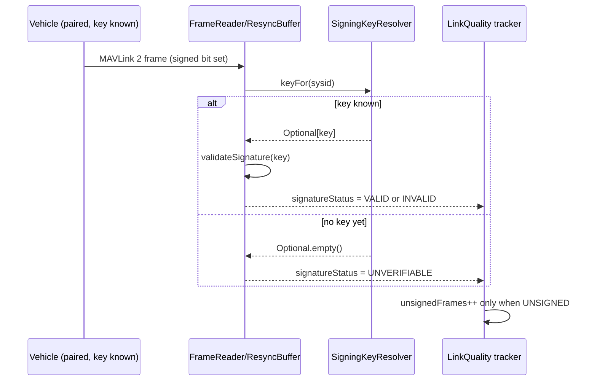

# LINK-SIGNING — MAVLink 2 message signing + hardware-identity hand-off

Wave **S** of `docs/plans/active/LINK-PAIRING-PLAN.md` (§4 row S), plus the hardware-uid defect the
2026-09-18 live walk left open (§8 defect #1). L1–L4 are built and live-tested on `feat/link-pairing`;
this plan does not touch that file — it is the freestanding spec for what ships next, split into S0
(hand-off, standalone bugfix) and S1–S3 (signing itself).

## §0 Reading list

| Agent | Read before touching anything |
|---|---|
| S0 (warehouse + mavlink adapter) | LINK-PAIRING-PLAN.md §3.3/§3.6/§8 defect #1; `contexts/vision-warehouse/MODULE.md` §domain.model/§application.pairing; `drone-link/mavlink/MODULE.md` (`MavlinkStreamNegotiator`, `VehicleClaimPolicy`, the `onGroupChanged` chain); this doc §2/§3.1 |
| S1 (mavlink-core + mavlink adapter) | `drone-link/mavlink-core/MODULE.md` (codec layering rule, `FrameWriter`/`FrameReader` javadoc); `drone-link/mavlink/MODULE.md` (`LinkGroupTracker`, `MavlinkVehicleLinkPort`); `contexts/vision-flight/MODULE.md` §domain.model (`LinkView`/`LinkQuality` mirror types); this doc §3.2 |
| S2 (warehouse + mavlink adapter) | S0/S1 output; `infra/edge/ground-radio.md` §5; this doc §3.3 |
| S3 (vision-api + vision-web) | `station/vision-api/MODULE.md` (PairingController rows + DTO section ~line 620); `station/vision-web/MODULE.md` (`core/pairing/state/**`, `LinksFacade`, `features/asset-detail` Links panel); this doc §3.4 |
| all | `.claude/skills/java-clean-code/SKILL.md` §1/§3 (interface/constructor discipline — cited throughout) |

## §1 Model — current state vs gap

| Area | Exists today (verified) | Gap this plan closes |
|---|---|---|
| Signing key | `VehicleKey` (32 bytes, `SecureRandom`, minted at first `pair()` call) — `contexts/vision-warehouse/.../domain/model/VehicleKey.java` | Never used for anything; MAVLink 2 signing needs exactly a 32-byte key (VERIFIED, mavlink.io) |
| Hardware uid | `Pairing.hardwareUid` (nullable `BigInteger`), `PairDeviceRequest`/`PairingResponse`/`PairingEntity`/`PairingMapper` all wired end-to-end | Nothing ever *writes* it after the initial manual pair call — the capability probe that reads `AUTOPILOT_VERSION.uid` (`CapabilityReport.uid`) is never connected to `PairingService` (§8 defect #1) |
| Capability probe | Two production call sites (grep-verified, not three): `MavlinkStreamNegotiator.probeCapabilities` (fires on every claim/re-claim, `drone-link/mavlink/.../MavlinkStreamNegotiator.java:166`) and `MavlinkVehicleConfigurator.requestCapabilities` (fires from a standalone `probe()`, address-only, no `DeviceId` yet) | Both discard the `CapabilityReport` on purpose (documented scope boundary in the MODULE.md) |
| Wire-level signed bit | `MavHeader.signed` (boolean, set from `Mavlink2Message.isSigned()` in `FrameReader.toFrame`, `drone-link/mavlink-core/.../codec/FrameReader.java:110`) | Only "the signed bit was set," never cryptographically checked — no key is reachable at the codec layer today |
| Outbound send | `FrameWriter.LinkConnection.send` calls the 3-arg `connection.send2(ourSystem, ourComponent, payload)` (`FrameWriter.java:169`) | dronefleet's signing overload `send2(sysid, compid, payload, linkId, timestamp, secretKey)` (VERIFIED, sources jar) is never called |
| Policy | None | `SigningMode` per pairing, default that keeps today's unsigned ESP32 rover working |
| API/UI | `PairingController`/`PairingResponse` carry no signing fields; Links panel has no signed/unsigned indicator | New endpoints + DTO fields + UI badge/action |

## §2 Reuse ledger (cheaper-than-it-looks)

- **The signing key already exists and needs no new minting path** — `VehicleKey` is exactly 32 random bytes, exactly what MAVLink 2 signing's secret key is (VERIFIED: mavlink.io message_signing spec, "32 bytes of binary data"). S1 spends zero effort on key generation.
- **The claim-driven probe already fires on every claim, not just the first** — `MavlinkStreamNegotiator.negotiate(int sysid)` is invoked from `VehicleClaimPolicy`'s `onClaimed` hook (`MavlinkGateway.java:206-209`) on *both* an initial claim and a silence-window re-election. S0 gets "compare later, not just record once" for free by hooking this one call site — no new trigger needs inventing.
- **The exact fan-out precedent already exists and is copy-shaped** — `LinkGroupTracker.onChanged(IntConsumer)` (package-private, post-construction setter) → `MavlinkGateway.onGroupChanged(IntConsumer)` → `MavlinkTelemetrySource.onGatewayGroupChanged` (resolves sysid→`DeviceId` by scanning `runtimes`) → public `onGroupChanged(Consumer<DeviceId>)` (`CopyOnWriteArrayList`, try/catch-wrapped) is the *exact* shape S0's hardware-uid fan-out needs, field-for-field. See `drone-link/mavlink/.../MavlinkTelemetrySource.java:300-347` and `LinkGroupTracker.java:49-76`.
- **`DefaultPairingService`'s audit helper and `SYSTEM_ACTOR` sentinel already exist** — `audit(actor, action, pairing, summary)` (`DefaultPairingService.java:173-176`); `SYSTEM_ACTOR = new UserId(new UUID(0,0))` is an established convention (`DefaultAssetService.java:77`), reused verbatim for the probe-attributed audit entry (no human actor exists at probe time).
- **No new `AuditAction` value is needed** — the enum (`core/vision-platform/.../AuditAction.java`) has no pairing-specific values today; `pair`/`replaceHardware`/`forget` already reuse the generic `CREATED`/`UPDATED`/`DELETED`. First-time hardware-uid recording is a genuine field update → reuse `UPDATED`. A *mismatch* is not a field update (§3.1 below) and gets no audit entry at all — it is operational telemetry, which is exactly what `EventPublisherPort`/`EventType` is for (see `EventType.java`'s own javadoc: audit = "who altered the fleet," events = everything else). One new `EventType` value is needed, following the `LINK_FAILOVER` doc-comment convention exactly (`EventType.java:37-49`).
- **`EventPublisherPort` is already a plain platform port every context can take** — `contexts/vision-flight/.../DefaultLinkStateService` already depends on it and constructs `Event` the same way S0 needs to (`DefaultLinkStateService.java:126`, `new Event(UUID.randomUUID().toString(), null, Instant.now(), EventType.X, message, attributes)`). `DefaultPairingService`'s constructor is at 4 params today (`PairingRepositoryPort, DeviceService, AuditTrailPort, PairingSettings`) — adding `EventPublisherPort` reaches the 5-param ceiling exactly (`java-clean-code` §3), not past it.
- **`drone-link/mavlink` already depends on vision-warehouse concretely** — `MavlinkVehicleLinkPort(MavlinkTelemetrySource, AssetService, AssetDirectoryService)` is precedent that this adapter module may hold a direct constructor dependency on a warehouse application service. S0's new sync class does the same, into `PairingService` instead — no new *adapter→adapter* edge, just one more adapter→context edge of a kind that already exists.
- **Ground-radio's own contract already states wave S's boundary** — `infra/edge/ground-radio.md` §5, frozen: *"No secrets on the dongle. Authorization (wave S, MAVLink 2 signing) is done by the station; the dongle carries only radio binds."* S2 changes nothing there; it is confirmed, not extended.
- **The web's operator-consent pattern for a security-relevant pairing action already exists** — "Forget pairing" is gated by a `vision-confirm-dialog` behind the `dialogs` `UiStore` group's `'forget-pairing'` id (`station/vision-api/MODULE.md` PairingController row; `station/vision-web/MODULE.md` `features/asset-detail` Links-panel paragraph). S3's "Secure this vehicle" push reuses the identical mechanism under a new `'secure-vehicle'` id.
- **The reference NgRx slice to copy is `core/pairing/state/**` + `LinksFacade`** — `byHostId`-keyed, component-provided, 5s-poll/SSE dual transport (`station/vision-web/MODULE.md`, `core/**` stores table, `pairing` row). S3's new signing fields ride the same `GET /api/assets/{id}/links`-adjacent read, not a new slice.

## §3 Frozen contracts

### §3.1 S0 — hardware-identity hand-off

**Seam decision.** Hook `MavlinkStreamNegotiator.probeCapabilities` only — not `MavlinkVehicleConfigurator.requestCapabilities`. The configurator's `probe()` addresses a bare `host:port` before any `Device`/`Pairing` exists (onboarding candidate probing); there is no `DeviceId` to attach a uid to at that point. The stream negotiator fires only for a sysid this station has actually *claimed* (a real, already-open `Device`), which is exactly when a `Pairing` can exist. This is a narrower scope than the task brief's "three call sites" — grep found two; the configurator's is explicitly out of scope for S0 (§6).

**New collaborator wiring (mirrors `onGroupChanged` exactly):**

```
MavlinkStreamNegotiator
  + package-private void onCapabilityObserved(BiConsumer<Integer, CapabilityReport> listener)   // set once, post-construction
  probeCapabilities(...): on report.ok(), also notify the listener with (sysid, report)          // logging path unchanged

MavlinkGateway
  + private volatile BiConsumer<Integer, CapabilityReport> capabilityListener
  + void onCapabilityObserved(BiConsumer<Integer, CapabilityReport> listener)                     // wired in constructor, right after
                                                                                                     // `streamNegotiator.onCapabilityObserved(this::notifyCapabilityListener)`,
                                                                                                     // before `streamNegotiator::negotiate` is handed to VehicleClaimPolicy
  private void notifyCapabilityListener(int sysid, CapabilityReport report)

MavlinkTelemetrySource
  + public void onHardwareUidObserved(BiConsumer<DeviceId, BigInteger> listener)                  // CopyOnWriteArrayList, try/catch-wrapped, identical shape to onGroupChanged
  private void onGatewayCapabilityObserved(MavlinkGateway gateway, int sysid, CapabilityReport report)
      // scans `runtimes`, resolves DeviceId via gateway.commandTarget(deviceId).sysid() == sysid — identical
      // loop shape to onGatewayGroupChanged (MavlinkTelemetrySource.java:325-336) — then, if report.uid() != null,
      // notifies onHardwareUidObserved listeners
  newBareGateway(): also calls gateway.onCapabilityObserved((sysid, report) -> onGatewayCapabilityObserved(gateway, sysid, report))
```

**New adapter class** `com.drones.vision.adapter.mavlink.PairingHardwareUidSync` — constructor
`(MavlinkTelemetrySource, PairingService)`, subscribes via `source.onHardwareUidObserved(this::onObserved)`
in its own constructor, `onObserved(DeviceId id, BigInteger uid) { pairingService.observeHardwareUid(id, uid); }`.
A dedicated class rather than folding into `MavlinkVehicleLinkPort` — that class's one job is the
`VehicleLinkPort`/`CarrierDirectoryPort` bridge into vision-flight; hardware-uid sync targets a
different context (vision-warehouse's `PairingService`) entirely, and mixing two unrelated contexts'
sync logic into one class is exactly the kind of thing `java-clean-code` §1 warns against ("one
interface earns its place" — the corollary is one class earns one job). Wired by `vision-app` as one
more construction call beside wherever `MavlinkVehicleLinkPort` is already built.

**`PairingService` addition — one method, no overloads:**

```java
/**
 * Records or verifies a hardware uid observed from a live capability probe (AUTOPILOT_VERSION.uid)
 * against deviceId's pairing. No-op if the device has no pairing. First observation for a pairing
 * with hardwareUid()==null records it (audited UPDATED, actor SYSTEM_ACTOR). A later observation
 * that disagrees with the stored value is never silently accepted -- only replaceHardware() may
 * clear it -- and instead raises EventType.HARDWARE_UID_MISMATCH; the vehicle keeps flying. A
 * later observation that matches is a silent no-op (called on every claim, not just the first).
 */
void observeHardwareUid(DeviceId deviceId, BigInteger hardwareUid);
```

**`Pairing` gains one field**, `Instant hardwareUidMismatchDetectedAt` (nullable) — set only on a
disagreeing observation, cleared by `replaceHardware()` alongside its existing `hardwareUid = null`
reset. Ripples through `PairingEntity`/`PairingMapper` (new nullable column, one Flyway migration) —
the exact round trip `hardwareUid` itself already established.

**`DefaultPairingService` gains one constructor parameter**, `EventPublisherPort` (5th, at the
ceiling) — no overload, the one call site (`vision-app` wiring) is updated.

**New `EventType.HARDWARE_UID_MISMATCH`**, doc-commented in the exact style of `LINK_FAILOVER`:
`streamId` always `null` (device-scoped — `PairingService` has no asset lookup of its own, unlike
the asset-scoped precedents); attributes carry `{deviceId, pairingId, recordedUid, observedUid}`.

### §3.2 S1 — codec: sign outbound, verify inbound

**Where signing lives, and why not in `mavlink-core` alone.** `mavlink-core` is framework-free and
may not import `com.drones.vision..` (ArchUnit) — it cannot know *which key* belongs to a sysid,
because that mapping is `Pairing`/`VehicleKey`, a vision-warehouse concept. So `mavlink-core` hosts
only the **crypto primitive** (verify/sign against a given key, no vehicle-identity knowledge);
`drone-link/mavlink` (the adapter, which already depends on vision-warehouse — §2) supplies the
sysid→key **lookup**. This is the same split `FrameWriter.send2` already has with `ourSystem`/
`ourComponent` vs. whatever key a caller happens to pass — nothing here is a new pattern.

**Naming collision, called out explicitly:** MAVLink's own signing `link_id` (1 byte, wire field,
scoped to "one MAVLink communication channel," VERIFIED mavlink.io) is a *completely different*
thing from this codebase's `com.drones.mavlink.transport.LinkId` (a carrier/session identity, e.g.
`"udp-listen:0.0.0.0:14550"`). Every signature in this plan calls the wire byte `signingLinkId` to
keep them apart in code and prose.

**New functional collaborator, `mavlink-core` (`codec` package):**

```java
public interface SigningKeyResolver {
    Optional<byte[]> keyFor(int sysid);
    SigningKeyResolver NONE = sysid -> Optional.empty();   // no-op constant, not a null parameter (java-clean-code §3)
}
```

`FrameReader`'s constructor gains this as a parameter (defaulted to `NONE` in the existing
convenience constructor `FrameReader(MavlinkLink link)`), threaded into `ResyncBuffer` alongside the
existing `dialectsBySystem` map. `MavHeader` gains one new component:

```java
public enum SignatureStatus { UNSIGNED, VALID, INVALID, UNVERIFIABLE }   // UNVERIFIABLE = signed bit set, no key known yet
```
`MavHeader(..., boolean signed, SignatureStatus signatureStatus)` — `signed` (the raw wire bit) is
kept as-is for existing readers; `signatureStatus` is the new cryptographic-validity dimension,
computed in `FrameReader.toFrame`: if `signed` and the resolver returns a key, call the already-
verified dronefleet primitive `((Mavlink2Message<?>) message).validateSignature(key)` (VERIFIED,
sources jar) and set `VALID`/`INVALID`; if `signed` and no key resolves yet, `UNVERIFIABLE`;
otherwise `UNSIGNED`.

**Outbound signing — `FrameWriter`:**
- Each `LinkConnection` gets one auto-incrementing `signingLinkId` (0–255, wraps) assigned at
  construction — mirrors pymavlink's own verified convention ("if link_id is None: auto-increment …
  capped at 255," VERIFIED, pymavlink `mavutil.setup_signing`). One physical link, one signing
  identity, satisfies the spec's monotonicity scope ("per `(sysid, compid, linkID)`," VERIFIED).
- `FrameWriter`'s constructor gains the same `SigningKeyResolver` (defaulted `NONE`) plus a new
  small framework-free class `SigningClock` (below). `LinkConnection.send` becomes: if the resolver
  has a key for `target.system()`, call the 6-arg `connection.send2(ourSystem, ourComponent, payload,
  signingLinkId, clock.next(), key)`; otherwise the existing 3-arg call, unchanged. No new public
  method, no overload — the existing `send`/`sendTo`/`broadcast` entry points are unaffected; only
  the private `LinkConnection.send` body branches.

**`SigningClock` (new, `mavlink-core`, framework-free) — the 48-bit timestamp, persisted:**
Per the spec (VERIFIED, mavlink.io): 10 µs units since 2015-01-01T00:00:00Z, must monotonically
increase per link, incremented by 1 per message sent, and *"stored in persistent storage, ideally at
least once a minute; the timestamp used on startup should be the maximum of the timestamp implied by
the system clock and the stored timestamp."* `SigningClock` implements exactly that rule with two
collaborators, both plain functional interfaces (no warehouse dependency):
`LongSupplier loadPersisted` (returns the last-saved value, or 0), `LongConsumer persist` (called at
most once per minute — an internal rate limit, not a caller contract). **Decision: warehouse-persisted
per-pairing, not a station-wide clock file** — Postgres is this project's only store (CLAUDE.md /
memory: postgres-only), there is no station-clock-file mechanism anywhere in the codebase to extend,
and a per-pairing timestamp is the one that actually needs isolation (two vehicles must never share a
monotonic counter). `Pairing` carries it (§3.3's `SigningState.timestamp`); the adapter's `save`
callback is `PairingRepositoryPort.save`, reached through `PairingService`, exactly the round trip
`hardwareUid` already uses.

**`LinkQuality`/`LinkView` additions** — `LinkQuality` (session interface, `mavlink-core`) gains
`boolean signedRecently(LinkId id)` / `long unsignedFrames(LinkId id)`, tracked by a new, independent
`Dispatcher` subscription (mirrors `messageInventory`/`linkGroupTracker`'s own "a bug in one must
never affect the other" isolation, `MavlinkGateway.java:210-229`) that watches `signatureStatus` on
every frame. `LinkGroupTracker.snapshot` already re-annotates each `LinkSnapshot` with quality
(`linkQuality.of(s.id())`, `LinkGroupTracker.java:119`) — extend that one line to also carry
`linkQuality.signedRecently(s.id())`/`unsignedFrames(s.id())`. `contexts/vision-flight`'s local-mirror
`LinkView` gains matching `signed: boolean` / `unsignedFrames: long` fields, translated by
`MavlinkVehicleLinkPort` exactly where it already translates every other `LinkSnapshot` field today.



### §3.3 S2 — policy per pairing

```java
enum SigningMode { OFF, PREFER, REQUIRED }   // default PREFER (PairingSettings#defaultSigningMode)
```
- **`PREFER`** (default — keeps today's unsigned ESP32 rover flying unchanged): outbound signed
  whenever a key is known (always true — `VehicleKey` exists from first `pair()`); inbound
  `UNSIGNED`/`UNVERIFIABLE` frames are **accepted**, counted in `unsignedFrames`, never dropped.
  `INVALID` (a real signature that fails to verify — wrong key, replay, tamper) is **dropped**
  regardless of mode; a bad signature is never "prefer to accept anyway."
- **`REQUIRED`** (explicit opt-in, once firmware verifies): inbound `UNSIGNED` is **dropped** too.
  Never the default — flipping it before the ESP32 firmware verifies would silently blackhole the
  only live vehicle this plan has to test against.
- **`OFF`**: no outbound signing attempted (resolver returns empty for this sysid regardless of key
  presence), every inbound frame accepted regardless of `signatureStatus`.

`Pairing` gains one more compound field (mirrors `RadioBind`'s own "compound value needs a NONE-style
default, not a nullable field" precedent, `Pairing.java` javadoc):
```java
record SigningState(SigningMode mode, long timestamp, Instant signedSince) {
    static SigningState initial(SigningMode defaultMode) { return new SigningState(defaultMode, 0, null); }
}
```
`signedSince` is set the first time an inbound frame from this vehicle reaches `VALID` (never reset
except by `replaceHardware`/`forget`) — the wire's own honest answer to "has this vehicle ever proven
it can sign," independent of whatever `mode` is configured right now.

**`SETUP_SIGNING` push — explicit operator act, not automatic.** Per spec (VERIFIED, mavlink.io):
*"should only ever be sent over a secure link… as a direct message… should never be broadcast… must
never be automatically forwarded"* and *"omit SETUP_SIGNING messages from logs (or replace the secret
with 32 0xFF bytes)"*. `DefaultPairingService` gains no new method for this — the push is a
**mavlink-adapter-side command**, not a warehouse decision: a new `MavlinkSigningPushService`
(`drone-link/mavlink`, mirrors `CommandService`'s existing shape) sends `SETUP_SIGNING` (#256)
targeted at the claimed sysid's autopilot component, `secret_key = pairing.vehicleKey().value()`,
`initial_timestamp = pairing.signing().timestamp()`. Never logged whole — the adapter's own send-path
logging (already message-type-keyed, per `MavlinkStreamNegotiator`'s logging convention) must special-
case `#256` to redact the key, matching the spec's own redaction guidance. Triggered by the web's
"Secure this vehicle" action (§3.4), gated the same way "Forget pairing" already is (§2) — a
`vision-confirm-dialog`, never automatic on pair or on claim.

**Key rotation.** `forget()` already hard-deletes the whole `Pairing` row (key included) — no change
needed. `replaceHardware()` gains one more reset: alongside `hardwareUid=null`/
`hardwareUidMismatchDetectedAt=null`, also mint a **fresh** `VehicleKey` and reset `SigningState` to
`initial(settings.defaultSigningMode())` — a swapped board must never inherit the old board's key.

**Ground-radio.** No change to `infra/edge/ground-radio.md` — §5 already states the rule this wave
implements (§2). Confirmed, not touched.

```mermaid
sequenceDiagram
  actor Op as Operator
  participant Web as vision-web (Links panel)
  participant API as PairingController
  participant Push as MavlinkSigningPushService
  participant V as Vehicle
  Op->>Web: "Secure this vehicle"
  Web->>Web: vision-confirm-dialog ('secure-vehicle')
  Op->>Web: confirm
  Web->>API: POST /api/devices/{id}/pairing/signing/push
  API->>Push: send SETUP_SIGNING(#256) targeted, unicast
  Push->>V: SETUP_SIGNING (key + initial_timestamp) -- never broadcast, never logged whole
  API-->>Web: 202 (fire-and-forget; no ack exists on this message)
```

### §3.4 S3 — API + web

**`PairingResponse` gains three fields**, all derived read-only, no new column beyond §3.1/§3.3's:
```
signingMode: "OFF" | "PREFER" | "REQUIRED"
signedSince: string (ISO Instant) | absent            // @JsonInclude(NON_NULL), matches this DTO's existing convention
hardwareUidMatch: boolean | absent                     // absent if hardwareUid==null; true if mismatchDetectedAt==null; false otherwise
```
The key itself (`VehicleKey`) never reaches this or any DTO — same redaction line `PairingResponse`
already draws for `vehicleKey()` today (`station/vision-api/MODULE.md` ~line 623).

**Two new endpoints, `PairingController`:**
```
PUT  /api/devices/{id}/pairing/signing        body {"mode": "OFF"|"PREFER"|"REQUIRED"} -> 200 PairingResponse
POST /api/devices/{id}/pairing/signing/push   body {} -> 202 (fire-and-forget, no ack exists for SETUP_SIGNING)
```
Both device-keyed (`StreamAccess#requireVisible`), matching every existing `PairingController` row.
`PUT .../signing` with `REQUIRED` on a pairing whose `signedSince` is still absent is **not** refused
(honest degrade, not a block) — the response's `hardwareUidMatch`/`signedSince` already tell the
operator whether that is a safe choice; refusing it would be the "block instead of surface" behavior
§0 of the task explicitly rejects for the *hardware*-mismatch case, and the same doctrine applies here.

**Web — extend the existing `core/pairing/state/**` slice, do not create a new one.** `LinksFacade`
(byHostId-keyed, component-provided, `station/vision-web/MODULE.md` `pairing` row) already re-fetches
`GET /api/assets/{id}/links` on the same poll/SSE cadence the Links panel uses; `signingMode`/
`signedSince`/`hardwareUidMatch` ride the *pairing* read (`GET /api/devices/{id}/pairing`, via
`AssetDetailFacade#pairingDevice`, already resolved per the panel's own documented Recovery-actions
flow), not a new slice. Panel additions: a signed/unsigned badge per link row (from `LinkView.signed`,
§3.2) and one new Recovery action, "Secure this vehicle" (`POST … /signing/push`), gated by the same
`vision-confirm-dialog` mechanism as "Forget pairing" under a new `dialogs` group id `'secure-vehicle'`
— no new `UiStore` group, one more id in the existing one (§2).

### §3.5 F-side note (owner-gated, outside this repo)

The ESP32 rover firmware must, to reach `REQUIRED`: (1) accept and persist a `SETUP_SIGNING` message
on its autopilot component — key to flash/EEPROM, `initial_timestamp` seeded into its own monotonic
counter per the same startup rule (`max(system clock, stored)`); (2) sign every outbound frame with
that key, incrementing the 48-bit timestamp per message; (3) verify every inbound frame's signature
before acting on it once a key is set, rejecting a stale/non-increasing timestamp and (per spec,
VERIFIED) anything more than one minute behind its own clock; (4) never accept a *second*
`SETUP_SIGNING` over an unsecured (radio) link — the spec's own "secure link only" rule is a firmware
obligation, not just a station-side courtesy. No code is proposed here; this is scope for whoever next
touches the out-of-repo sketch (`docs/plans/active/LINK-PAIRING-CONTEXT.md`'s existing "rover firmware
lives outside the repo" note).

## §4 Waves

| Wave | Scope (files) | Depends on | Size | Verify |
|---|---|---|---|---|
| **S0** | `contexts/vision-warehouse` (`Pairing`, `PairingService`, `DefaultPairingService`, `PairingEntity`/`PairingMapper`/Flyway migration); `core/vision-platform` (`EventType`); `drone-link/mavlink` (`MavlinkStreamNegotiator`, `MavlinkGateway`, `MavlinkTelemetrySource`, new `PairingHardwareUidSync`); `vision-app` (one wiring call) | L2 (existing) | M | `./mvnw -B -pl core/vision-platform,contexts/vision-warehouse,drone-link/mavlink-core,drone-link/mavlink,storage/persistence,station/vision-app -am test` |
| **S1** | `drone-link/mavlink-core` (`SigningKeyResolver`, `MavHeader`, `FrameReader`/`ResyncBuffer`, `FrameWriter`, `SigningClock`, `LinkQuality`); `drone-link/mavlink` (`LinkGroupTracker`/`LinkSnapshot`, `MavlinkVehicleLinkPort`, key-resolver wiring into `PairingService`); `contexts/vision-flight` (`LinkView`/`LinkGroupView` mirror fields) | S0 (needs `Pairing.vehicleKey`/`SigningState` reachable) | L | `./mvnw -B -pl drone-link/mavlink-core,drone-link/mavlink,contexts/vision-flight -am test` — plus a live-walk script (below) |
| **S2** | `contexts/vision-warehouse` (`PairingSettings`, `Pairing.SigningState`, `replaceHardware` reset); `drone-link/mavlink` (new `MavlinkSigningPushService`) | S1 | M | `./mvnw -B -pl contexts/vision-warehouse,drone-link/mavlink -am test` |
| **S3** | `station/vision-api` (`PairingController`, `PairingResponse`, request DTO); `station/vision-web` (`core/pairing/state/**`, Links panel, `AssetDetailPage` Recovery actions) — Java and web are file-disjoint, run in parallel | S2 | M | `./mvnw -B -pl station/vision-api,station/vision-app -am test` **and** `cd station/vision-web && npm run test:ci` |

Sequencing: S0 → S1 → S2 → S3 strictly (each freezes fields the next reads); within S3, API and web
agents run in parallel once §3.4's contract is frozen (it already is, above). Every wave ends with its
scoped build green and the touched modules' `MODULE.md` updated in place (never a new
wave/status section — `CLAUDE.md`'s own module-docs rule).

**Live-walk script (S1, pymavlink rover, VERIFIED API):**
```python
conn = mavutil.mavlink_connection('udpout:127.0.0.1:14550', source_system=1)
conn.setup_signing(secret_key=32_byte_key, sign_outgoing=True,
                    allow_unsigned_callback=lambda mav, msgId: True)  # PREFER-equivalent on the rover side
```
Walk: (1) unsigned rover, `PREFER` — confirm frames still flow, `unsignedFrames` climbs, `signedSince`
stays absent; (2) `setup_signing` on the rover with the pairing's real key, still `PREFER` — confirm
`signedSince` gets set once `VALID` is first seen, badge flips; (3) flip to `REQUIRED`, kill signing on
the rover — confirm frames now drop and the operator sees why (not just silence); (4) feed one frame
with a *wrong* key (INVALID, not UNSIGNED) — confirm it drops under `PREFER` too, distinguishing "no
signature" from "bad signature."

**QA defect list (name these explicitly, do not rediscover them live):**
1. **Timestamp rollover** — 48 bits at 10µs resolution wraps in ~89,000 years; not a real risk, but a
   *stored* timestamp from a clock that jumped backward (VM snapshot restore, NTP step) could exceed a
   legitimate future value and permanently lock out real traffic (spec's own "no non-increasing" rule)
   — verify `SigningClock`'s `max(system, stored)` rule actually protects against a backward station
   clock, not just a backward vehicle clock.
2. **Clock skew, station vs. vehicle** — the spec's ">1 minute behind = reject" rule (VERIFIED) means a
   station with a wrong wall clock can lock out a *correctly* signing vehicle; confirm the failure
   surfaces as "signature timestamp rejected," not a silent drop indistinguishable from "no key."
3. **The 10µs unit** — a naive implementation using milliseconds or microseconds-since-Unix-epoch
   instead of 10µs-since-2015-01-01 fails every verification silently (looks like a valid-shaped
   6-byte value, just wrong) — assert the conversion against a known vector, not just "compiles."
4. **`signingLinkId` per carrier vs. per session** — confirm it is assigned once per registered
   `LinkId` (one nRF24 dongle, one SiK radio, one UDP lobby) and never reused across two links live at
   once (would violate the spec's own per-link monotonicity scope and could look like a replay).
5. **Key exposure** — grep every log line and DTO touched by S1–S3 for the raw key; `VehicleKey`'s own
   `toString()` already redacts, but a `SETUP_SIGNING` send-path log (§3.3) or a debug dump of the raw
   `send2` arguments is a fresh place to leak it that redaction elsewhere does not cover.

## §5 Non-goals

- **`MavlinkVehicleConfigurator.requestCapabilities`'s standalone probe path stays disconnected** from
  `PairingService` — it addresses candidates with no `Pairing` yet; wiring it is a separate,
  smaller follow-up if onboarding ever needs pre-pair hardware-uid capture.
- **No signature-based authentication of the *station itself*** — S2's `SETUP_SIGNING` push assumes
  whoever is logged into vision-web is already authorized (existing `manageOrg`/device-scope checks);
  this plan adds no new operator-identity concept.
- **No multi-GCS key distribution** — the spec notes mavgen's C/Python libraries support one key per
  link (VERIFIED); this plan does not attempt to support two simultaneous vision instances signing to
  the same vehicle with different keys.
- **REQUIRED is never the shipped default** — flipping the fleet-wide default is an explicit future
  decision once real firmware verifies in the field, not part of this plan.
- **No signature-based replay protection beyond MAVLink's own timestamp rule** — no separate nonce or
  session concept is introduced; the spec's own monotonic-timestamp mechanism is the entire defense.

## §6 Open items (owner to confirm before dispatch)

1. **S0's "three call sites" vs. two, confirmed by grep.** The task brief's framing assumed three;
   only `MavlinkStreamNegotiator` and `MavlinkVehicleConfigurator` construct a `CapabilityReport` in
   production. This plan wires only the former (§3.1) and leaves the latter as a named non-goal (§5)
   — confirm that scoping is acceptable, or name the third site if one exists that grep missed.
2. **ArduPilot's actual runtime behavior on `SETUP_SIGNING`/unsigned-after-signed could not be
   verified live** — `ardupilot.org`'s signing doc pages 404'd from this environment; the mavlink.io
   spec (VERIFIED) and pymavlink's `allow_unsigned_callback` shape (VERIFIED) are solid, but ArduPilot-
   firmware-specific behavior (does it drop unsigned traffic the instant a key is set, or only once
   `REQUIRED`-equivalent is separately configured?) is INFERRED from the reference C library's
   documented pattern, not confirmed against real ArduPilot source. The live-walk script's step 3
   is exactly the check that resolves this — do not skip it.
3. **`Pairing` gains two new fields this cycle** (`hardwareUidMismatchDetectedAt`, `SigningState`) on
   top of the eight it already has. Confirm growing this one record further (vs. splitting pairing
   security-state into its own child table/aggregate) is acceptable, or ask S2's implementer to split
   it — the frozen contract above works either way, since `SigningState` is already a nested compound
   value, not flattened scalars.
4. **`hardwareUidMatch=false` never self-clears except via `replaceHardware`.** Confirm this is the
   wanted operator UX (a mismatch, once flagged, stays visibly flagged until an explicit "yes, this
   was an intentional swap" action) rather than auto-clearing once a subsequent probe agrees with the
   *originally recorded* uid again (e.g., a transient misread).

---

## §7 Architect rulings on §6 (2026-09-19, before S0 dispatch)

1. **Two call sites, not three — accepted.** Only the claim-driven `MavlinkStreamNegotiator` probe is
   wired; the configurator's address-only probe stays a non-goal (§5).
2. **ArduPilot specifics stay INFERRED and nothing depends on them.** The owner's vehicle is the ESP32
   sketch (out of repo); `PREFER` is the default precisely so no firmware behaviour is assumed. The
   S1 live walk step 3 with pymavlink is the check; an ArduPilot rover, when one exists, is re-walked.
3. **`Pairing` keeps growing as one record.** `SigningState` is a compound value like `RadioBind`; a
   child table buys nothing until a third compound arrives. One Flyway migration per wave (S0, S2).
4. **`hardwareUidMatch=false` is sticky until "Replace hardware".** A 64-bit uid misread is not a
   thing; a swap is a physical act the operator acknowledges. S3 surfaces the mismatch through the
   existing pre-flight readiness triage as a blocker-level item (one attention verdict — no new
   channel, no toast).
5. **Key lookup on the frame path is cached, never a repository hit per frame.** The adapter-side
   `SigningKeyResolver` holds an in-memory `sysid → key` map refreshed from `PairingService` on a TTL
   (`vision.pairing.key-cache-ttl`, default `2s`, in `PairingSettings`). LINK-PAIRING-PLAN §3.3's
   "key stops being valid at once" on forget becomes "within the cache TTL" — documented there by S1.
6. **`SigningClock` persists through a single-column write**, `PairingRepositoryPort.updateSigningTimestamp(PairingId, long)`,
   not a whole-row `save` — a once-a-minute clock tick must never race a concurrent pairing edit.
7. **`REQUIRED` with `signedSince` absent: the web confirms, the server does not refuse.** The
   `vision-confirm-dialog` copy says the vehicle has never signed and will go dark on this station.
8. **Redaction covers every frame sink, not only the send log.** `#256 SETUP_SIGNING` must be
   redacted (32 × `0xFF`) or omitted in: the adapter's message inventory, the fly debug rail's
   request/response console (merged 2026-09-18, `fly-debug-redesign`), any replay/trace capture in
   `vision-events`, and `LiveUpdateRegistry`'s cv-trace/telemetry envelopes if raw frames ever pass
   through them. Add this to the S2 QA list as item 6; an S2 test greps a captured log for the key bytes.
9. **Sequencing stays S0 → S1 → S2 → S3, Java one wave at a time**, in a worktree cut from master
   (`feat/link-signing`), never in the shared tree; no Java build runs while a live-walk app is
   serving from `~/.m2` jars (a replaced jar under a running JVM breaks lazy class loading).
