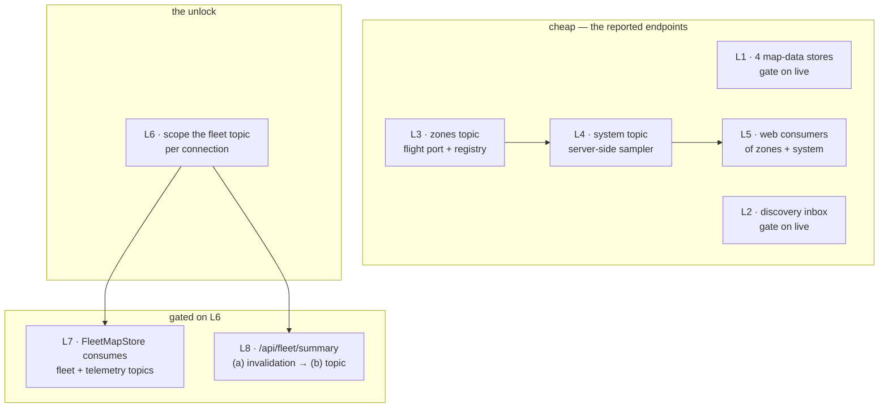
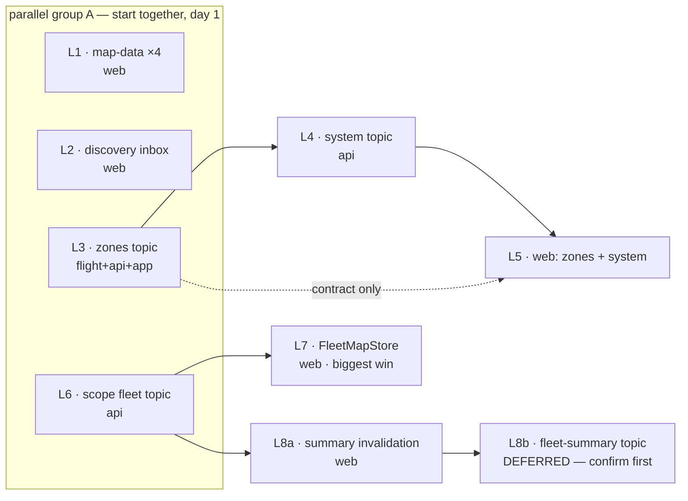

# LIVE-POLL-RETIREMENT — the SSE plane already carries it; stop asking for it again

Status: **SPEC, 2026-09-06.** Branch `feat/live-poll-retirement`.
Diagnosis and verification: [`LIVE-POLL-RETIREMENT-CONTEXT.md`](LIVE-POLL-RETIREMENT-CONTEXT.md) — read it first;
this plan does not restate it.
Absorbs [`ALWAYS-ON-FLOW-PLAN.md`](ALWAYS-ON-FLOW-PLAN.md) §4 **B1** in full.

Owner ask, in one line: *too many GET requests instead of stream — stream would be so much better.*

---

## 1. The shape of the problem, and the one thing that changed while writing this plan

Nine SSE topics already exist and are healthy. Five stores already retire their poll while live is
open. Five more do not, despite riding a topic. Two endpoints have no topic at all. That is the
context doc's finding and it stands.

**What the survey added is a harder finding that reframes the biggest waves:**

> The `fleet` topic is built from the **unscoped** `AssetService#assets()` and broadcast to every
> connection unconditionally. `GET /api/assets` and `GET /api/fleet/summary` are both **scoped** via
> `currentUser.scope()`. So the two largest polls on `/command` cannot be retired onto the `fleet`
> topic as it stands — doing so would put out-of-scope assets on a scoped operator's map.

`LiveUpdateRegistry:1037` `freshFleetEnvelope()` calls `assetService.getObject().assets()` — the
no-arg, unscoped overload — and `broadcast` documents that *"the second condition only ever excludes
anything on the `map` topic; every other topic's payload passes unconditionally."*

This is not a blocker to be worked around, and it is **not latent**. Three components already read
`LiveStore.fleet()`, and one of them *renders* it: `features/fly/drone-picker-facade.ts:152` assigns
the SSE snapshot straight onto `pickerAssets`, the signal feeding `groups` (line 96) and therefore
the Fly drone picker's visible list — overwriting the correctly-scoped list the same facade fetched
from `GET /api/assets` at line 200. The other two readers are `shared/ui/notification-bell.ts:319`
and `features/fly/cockpit-facade.ts:937`.

So today, on the Fly page, **any authenticated user's drone picker lists every asset in the
deployment** the moment the `fleet` snapshot lands, regardless of their visibility scope. This is a
live user-visible scope violation that contradicts OPS-UX's authority-vs-visibility work, not a
future hazard. It is also the single unlock for ~24 req/min of the ~38.

**L6 is therefore a defect fix that should ship on its own, ahead of and independent of the polling
work.** The rest of this plan is an optimization; L6 is not.



---

## 2. Baseline — derived from cadence, not measured

**The live browser measurement attempted on 2026-09-06 is void and must not be cited** (the backend
503'd mid-window, which correctly *resumed* `FleetStore`/`EventsStore` polling and inflated the
count; the tab was also Chrome-throttled). The numbers below are **arithmetic over the code's own
interval constants**, and are labelled as such everywhere they appear.

`/command`, SSE healthy, tab genuinely foregrounded:

| Source | File | Cadence | req/min |
|---|---|---|---|
| fleet summary | `features/command/command-facade.ts:33,415` | 5 s | 12 |
| asset list | `core/map/map-store.ts:15,110` (`FleetMapStore`) | 5 s | 12 |
| system status | `core/system-status/system-status-store.ts` | 15 s | 4 |
| marks + layers + drawings | `core/map-data/*-store.ts` | 30 s each | 6 |
| geofence zones | `core/geofence/geofence-store.ts` | 30 s | 2 |
| tracks | `core/map-data/tracks-store.ts` | 30 s | **0** — not activated on `/command` |
| **Total** | | | **~36–38** |
| *per streaming asset, additionally* | `core/map/map-store.ts:18,166` | 2 s | **+30 × N** |

`FleetStore` and `EventsStore` contribute **0** while live is open — they already gate correctly.

Two corrections to the context doc's table, both verified: the `/api/assets` 5 s poll belongs to
**`FleetMapStore`**, not `CommandFacade` (it matters — different file, different wave); and
`TracksStore` is activated only by `features/asset-detail/asset-detail-facade.ts:328`, so it costs
nothing on `/command` and 2 req/min on `/asset/:id`.

The per-streaming-asset **2 s telemetry poll is the largest single number in the app** and is absent
from the context doc's table entirely. With three assets streaming, `/command` is at ~126 req/min,
not ~38. L7 addresses it.

**A clean re-measurement is an output of this work, not an input** — see §7.

---

## 3. Three decisions, with the reasoning

### D1 — The web gate is two orthogonal axes, and they compose in one method

ALWAYS-ON-FLOW C3 gave the five stores `activate()`/`release()` ref-counting. This plan adds the
live gate. They are independent, and the composition is not "either" — it is:

> **Poll runs ⟺ `activeConsumers > 0` AND live is not open.**

Frozen state table. Every one of the five stores implements exactly this, in a method named
`applyTransport`, matching `core/events/events-store.ts:152`'s existing shape:

| `activeConsumers` | `isLiveAvailable(connectionState())` | previous mode | Action |
|---|---|---|---|
| `0` | any | any | stop poll; **no** refresh |
| `> 0` | `true` | poll | stop poll; **refresh once** (the reconcile) |
| `> 0` | `true` | live | nothing |
| `> 0` | `false` | live | refresh once, then start poll |
| `> 0` | `false` | poll | nothing (already polling) |

"previous mode" is a private `liveGated: boolean` field on the store — **not** a new signal on
`LiveStore`. There is no reconnect-epoch counter in the app today and this plan does not add one:
Angular signals do not re-notify on an equal write, and a genuine drop→reopen always passes through
`'connecting'`/`'closed'` first, so an `effect` over `connectionState()` fires exactly once per real
transition. The local boolean only exists to suppress the redundant boot-time double-fetch
(`'connecting'` → activate → `'open'`).

**Deliberately not extracted to a shared helper.** `FleetStore.applyTransport`,
`EventsStore.applyTransport` and `features/fly/drone-picker-facade.ts:176` are already byte-for-byte
the same shape; a sixth through tenth copy follows the house precedent and — decisively — keeps all
five waves' file scopes **disjoint**, which a shared file would not. No wave in L1/L2 may touch
`core/live/live-store.ts`.

### D2 — Zones get their own port and topic; they must not ride `map`

Confirmed against the enforcement, not inferred: `station/vision-app/src/test/java/com/drones/vision/app/ContextArchitectureTest.java`
lines 49–84 declare the legal context edges, and **`map -> flight` is not among them**. Adding a
`ZONE` entity to `MapEvent.EntityType` would need `vision-map` to import
`com.drones.vision.flight.domain.model.GeofenceZone` and fail that test.

The established idiom is one `*LiveUpdatePort` per publishing context, all implemented by the single
`LiveUpdateRegistry`. Zones follow it exactly. `DefaultGeofenceService` today holds two
collaborators and already has three clean seams (`create`/`update`/`delete` each call
`geofenceMonitor.refresh()`); a third collaborator is well inside the five-parameter ceiling.

**`zones` needs no per-connection filtering.** `GeofenceController#list` is annotated
`@OpenByDesign` with the reason *"hiding a no-fly zone from any role would itself be the safety hole"* —
every zone is visible to every caller, so a broadcast topic is exactly as scoped as the REST read it
replaces. This also finally makes `GeofenceStore`'s own documented objection moot: that store's class
doc says it is *"deliberately not gated on `isLiveAvailable()`"* because *"`LiveEnvelope` has no zone
topic to project… Adding a zones topic to the live stream is the fix that would make gating this
correct."* L3 is that fix, named by the code itself.

### D3 — `system` is a sampler, and the sampler must not be able to trigger itself

`SystemStatusController.status()` *pulls* every `SubsystemStatusPort` on demand; nothing notifies on
health change. So the topic is a server-side sample, broadcast only on change — one sample in the
server instead of one per tab per page forever.

**The self-feedback hazard is real and specific.** `LiveUpdateStatusProvider` reports on the very
registry the sampler broadcasts through: its `detail` embeds `registry.connectionCount()`, and its
health flips to `DEGRADED` on `registry.anyBufferEverDropped()`. Without care, the sampler broadcasts
→ a buffer collapses → `everDropped` flips → the status changes → broadcast again; and every tab
opening or closing would change `detail` and fan a broadcast out to every other tab.

**Frozen mitigation:** change detection compares `overall` plus each subsystem's
`(id, health, detail, hint)`, **ignoring `checkedAt` entirely and ignoring the `live-updates`
subsystem entirely.** Its value still rides in the payload so the diagnostics page shows it; it
simply never *triggers* a broadcast. One rule, directly testable, and it removes the loop at its
source rather than damping it.

There is no deadlock risk: the sampler runs on its own thread and calls one `publish*` method, which
(like every other) does `scheduler.execute(...)` and returns immediately.

**Inversion that keeps the registry's constructor at its ceiling:** the sampler owns the schedule and
calls the registry, not the reverse. `LiveUpdateRegistry` gains one public method and one buffer, and
**no new constructor collaborator** — the ceiling that its own javadoc invokes six times stays intact.

> **Defect found while specifying D3, out of scope, recorded so it is not lost.**
> `LiveRingBuffer#everDropped` is set by *"a collapse-to-latest replacement of a real prior entry"*.
> `fleetBuffer` is `new LiveRingBuffer(1, true)`. Therefore **`live-updates` already reports
> `DEGRADED` in every deployment from the second fleet change onward**, with the detail *"a slow
> consumer has missed at least one update"* — which is false. Latest-only collapse is not a drop.
> Not fixed here (it would change `/api/system/status` output and is unrelated to poll retirement);
> filed for its own task.

---

## 4. Frozen wire contract

Two new topics. Both are **additive** — a client that ignores them is unaffected, so no new feature
flag is introduced; both are gated by the existing `vision.live.enabled` exactly like the other nine.

### 4.1 `zones`

| Aspect | Frozen value |
|---|---|
| Topic string | `zones` — always-on, added in `connect()` alongside `FLEET`/`EVENT`/`DEVICES`/`DETECTION_EVENTS`/`MAP`/`DISCOVERY` |
| Envelope `type` | `"zones"` |
| `assetId` on envelope | absent (`null`) |
| Per-connection filtering | **none** — see D2 |
| Ring buffer | `new LiveRingBuffer(eventBufferCapacity, false)` — FIFO, delta-only; shares `eventBuffer` capacity for the same reason `discoveryBuffer` does (a zone edit is as rare as a domain event; a second knob would only duplicate the first) |
| `seedIfEmpty` | **no case** — falls through `default`, like `MAP`/`DISCOVERY`. The client's own `GET /api/geofences` on `activate()` is the snapshot |
| Java payload DTO | `com.drones.vision.api.dto.GeofenceZoneEventPayload(String action, GeofenceZoneResponse zone)` — mirrors `DiscoveryEventPayload` field-for-field |
| `action` values | `"CREATED"` \| `"UPDATED"` \| `"DELETED"` |
| `zone` on `DELETED` | the **last-known** zone, in full — the client removes by id, and `GeofenceStore`'s existing 10 s Undo needs the body to re-`POST` |
| Domain event record | `com.drones.vision.flight.domain.model.GeofenceZoneEvent(Action action, GeofenceZone zone)`, `enum Action { CREATED, UPDATED, DELETED }` |
| Domain port | `com.drones.vision.flight.domain.port.GeofenceLiveUpdatePort` — one method, `void publishZoneEvent(GeofenceZoneEvent event)` |

TypeScript, in `core/api/models.ts`:

```
GeofenceZoneEventPayload { action: 'CREATED' | 'UPDATED' | 'DELETED'; zone: GeofenceZone }
```

plus one new member on the `LiveEnvelope` union (`models.ts:2093–2101`):
`{ seq: number; assetId?: undefined; type: 'zones'; payload: GeofenceZoneEventPayload }`.

`GeofenceZoneResponse` and the TS `GeofenceZone` are **unchanged** — the delta reuses the exact shape
`GET /api/geofences` already returns per element, so the client needs no new mapping code.

### 4.2 `system`

| Aspect | Frozen value |
|---|---|
| Topic string | `system` — always-on |
| Envelope `type` | `"system"` |
| `assetId` on envelope | absent (`null`) |
| Per-connection filtering | **none** — `GET /api/system/status` carries no `managerOnly` restriction and is readable by any authenticated user (its own javadoc calls this a deliberate call), so a broadcast is exactly as scoped as the read |
| Ring buffer | `new LiveRingBuffer(1, true)` — latest-only. Health is a current-state fact; an older snapshot has no value once a newer lands (CLAUDE.md rule 9) — `fleet`/`detections`' own treatment |
| `seedIfEmpty` | **no case needed** — the sampler's first tick runs at startup + 0, so the buffer is populated before any connection can arrive. This is why the sampler must fire immediately, not after one interval |
| Java payload DTO | **`SystemStatusResponse`, verbatim and unchanged** — the same body `GET /api/system/status` returns |
| Change detection | `overall` + per-subsystem `(id, health, detail, hint)`; **ignore `checkedAt`; ignore the `live-updates` subsystem entirely** — see D3 |
| New property | `vision.api.live.system-sample`, a `Duration`, **default 5 s**, a ninth component on `VisionApiProperties.Live` (a settings bundle, not a collaborator — the ceiling does not apply) |
| New registry method | `public void publishSystemStatus(SystemStatusResponse status)` — appends + broadcasts, same body shape as `publishDevicesSnapshot()` |

TypeScript: one new `LiveEnvelope` union member,
`{ seq: number; assetId?: undefined; type: 'system'; payload: SystemStatus }`.
The existing `SystemStatus`/`SubsystemStatus`/`OverallHealth` interfaces (`models.ts:3102–3137`) are
**unchanged and reused as-is**.

### 4.3 `fleet` — scoped, wire unchanged

L6 changes **membership only**, never shape. `type` stays `"fleet"`, payload stays
`AssetSummary[]`. No TS change, no DTO change. The narrowing happens per connection at broadcast and
at replay, using the connection's existing visibility.

---

## 5. Waves

Each wave is one branch, one agent, a disjoint file scope, its own scoped build, and its own
`MODULE.md` update. **No two waves in the same parallel group share a file.**

### Acceptance criterion every poll-retiring wave must satisfy (frozen wording)

> **A poll that stops must still reconcile on reconnect.** With the store active and live open,
> driving the stubbed `connectionState` through `open → closed → open` issues **exactly one** REST
> refresh on entering `open`, and **zero** REST requests for as long as `open` persists.

Asserted in the store's own `.spec.ts` by driving a writable `connectionState` signal on the
`LiveStore` stub and counting calls on the `VisionApi` stub. This is the whole correctness argument
of the plan — a wave without this test has traded request noise for silent staleness and is not done.

---

### L1 — the four `core/map-data` stores gate on live

*Domain: `vision-web`.* **Effort: M.** **Parallel group A.**

| Owns | |
|---|---|
| `station/vision-web/src/app/core/map-data/marks-store.ts` + `marks-store.spec.ts` | |
| `station/vision-web/src/app/core/map-data/layers-store.ts` + `layers-store.spec.ts` | |
| `station/vision-web/src/app/core/map-data/drawings-store.ts` + `drawings-store.spec.ts` | |
| `station/vision-web/src/app/core/map-data/tracks-store.ts` + `tracks-store.spec.ts` | |
| `station/vision-web/src/app/core/map-data/layers-logic.ts` + `layers-logic.spec.ts` | (L1c only) |

| # | Change |
|---|---|
| **L1a** | All four gain `applyTransport(liveAvailable)` per D1's state table, a `liveGated` field, and an `effect` over `isLiveAvailable(this.live.connectionState())`. `activate()` routes through `applyTransport` rather than scheduling directly; `release()` is unchanged |
| **L1b** | Each spec's `stubLiveStore()` gains a **writable** `connectionState` signal, seeded `'closed'`. Seeding `'closed'` reproduces today's behaviour byte-for-byte, so every existing assertion in all four spec files stays green untouched — that is this wave's guardrail, in lieu of a flag |
| **L1c** | **`LayersStore`'s grants caveat — the hard part of this wave.** `LayerResponse.forEvent` strips grants from every live `LAYER` event; `applyLayerEvents` (`layers-logic.ts:146–153`) compensates by preserving the previously-known grants for a known id. That is correct for *any* change except a **grant revocation**, which the fold cannot represent and only the poll ever repaired. Retiring the poll without addressing this would make a revoked grant invisible until the next reconnect. **Required fix:** a `LAYER`-entity event additionally schedules a single debounced (≈1 s) `refresh()`. Net effect is strictly better than today — grants converge in ~1 s instead of up to 30 s — and costs nothing when no layer changes |

**Build:** `cd station/vision-web && npm run test:ci`  — never a bare `npx vitest run`, which fakes ~536 failures.
**MODULE.md:** `station/vision-web/MODULE.md`.
**Cadence-derived reduction:** `/command` −6 req/min (36–38 → 30–32); `/asset/:id` −8.

---

### L2 — the discovery inbox gates on live, and gets its first spec

*Domain: `vision-web`.* **Effort: S.** **Parallel group A.**

| Owns | |
|---|---|
| `station/vision-web/src/app/core/discovery/discovery-inbox-store.ts` | |
| `station/vision-web/src/app/core/discovery/discovery-inbox-store.spec.ts` | **new file — this store has no spec today** |

| # | Change |
|---|---|
| **L2a** | Same D1 gate. Note this store's `activate()` uses an `=== 1` guard and a field named `stopPollingFn`, unlike the four map stores' `> 1` / `stopPollFn` — leave the naming as found rather than churning it |
| **L2b** | **`sources` is the catch.** `refresh()` populates *both* `candidatesSignal` and `sourcesSignal`; the `discovery` topic carries **only** candidates, never sources (the store's own class doc says `refresh()` is *"still the only thing that ever populates `sources`"*). So the reconcile-on-reconnect is not a nicety here — it is the only thing that keeps `sources` alive at all once the poll stops. Assert it explicitly |
| **L2c** | Write the store's first spec: construction, activate/release ref-counting, the live fold, and the frozen reconnect criterion |

**Build:** `cd station/vision-web && npm run test:ci`.
**MODULE.md:** `station/vision-web/MODULE.md` — coordinate the edit with L1 (same file, different
sections; land L1 first or rebase).
**Cadence-derived reduction:** 0 on `/command`; −2 req/min on `/inventory` and the onboarding wizard.

---

### L3 — the `zones` topic

*Domain: `vision-flight`, `vision-api`, `vision-app`.* **Effort: M.** **Parallel group A** (backend;
shares no file with L1/L2).

| Owns | |
|---|---|
| `contexts/vision-flight/.../flight/domain/model/GeofenceZoneEvent.java` | new |
| `contexts/vision-flight/.../flight/domain/port/GeofenceLiveUpdatePort.java` | new |
| `contexts/vision-flight/.../flight/application/geofence/DefaultGeofenceService.java` | +1 collaborator, 3 call sites |
| `station/vision-api/.../api/dto/GeofenceZoneEventPayload.java` | new |
| `station/vision-api/.../api/live/LiveTopicKind.java` · `LiveTopic.java` · `LiveUpdateRegistry.java` | |
| `station/vision-app/.../app/config/wiring/ApplicationServiceWiring.java` | 7th selector |
| `station/vision-app/.../app/devsupport/NoopLiveUpdatePublisher.java` | 7th port |

| # | Change |
|---|---|
| **L3a** | `GeofenceZoneEvent` + `GeofenceLiveUpdatePort` in `vision-flight`, following `MapEvent`/`MapLiveUpdatePort`'s idiom (one record parameter, not `(action, zone)` — CLAUDE.md rule 10) minus the entity dimension |
| **L3b** | `DefaultGeofenceService` publishes on `create`/`update`/`delete`, immediately after the existing `geofenceMonitor.refresh()`. `delete` must capture `require(id)`'s return (today discarded) to carry the last-known zone |
| **L3c** | `LiveTopicKind.ZONES("zones")` + `LiveTopic.ZONES` + `parse`'s switch arm; `zonesBuffer`; `bufferFor`; `connect()`'s always-on set; `anyBufferEverDropped()`; `LiveUpdateRegistry implements … GeofenceLiveUpdatePort` |
| **L3d** | `ApplicationServiceWiring#geofenceLiveUpdatePort` — a seventh selector, **byte-identical in shape to the six above it**, including the `@Qualifier("liveUpdateRegistry") ObjectProvider<LiveUpdateRegistry>` (load-bearing, not decorative — see that method's own javadoc) and the `NoopLiveUpdatePublisher` fallback when `vision.live.enabled=false` |

**Build:** `./mvnw -B -pl contexts/vision-flight,station/vision-api,station/vision-app -am -DskipWeb test`
(`-am` deliberately — `-pl` alone resolves stale `~/.m2` jars for a changed upstream module; `vision-app`
tests require a running `docker`).
**MODULE.md:** `contexts/vision-flight/MODULE.md`, `station/vision-api/MODULE.md`, `station/vision-app/MODULE.md`.
**Reduction:** none by itself — L5 collects it.

---

### L4 — the `system` topic

*Domain: `vision-api`.* **Effort: M.** **Sequential after L3** — both edit `LiveTopicKind.java`,
`LiveTopic.java` and `LiveUpdateRegistry.java`. Do not run in parallel.

| Owns | |
|---|---|
| `station/vision-api/.../api/live/SystemStatusSampler.java` | new |
| `station/vision-api/.../api/support/SystemStatusReader.java` | new — the rollup extracted |
| `station/vision-api/.../api/controller/SystemStatusController.java` | delegates to the reader |
| `station/vision-api/.../api/live/LiveTopicKind.java` · `LiveTopic.java` · `LiveUpdateRegistry.java` | |
| `station/vision-api/.../api/support/VisionApiProperties.java` | +`systemSample` |

| # | Change |
|---|---|
| **L4a** | Extract `safeStatus` + `overall` out of `SystemStatusController` into `SystemStatusReader` (`List<SubsystemStatusPort>` in, `SystemStatusResponse` out). The controller becomes a two-line delegation. **Its wire output must not change** — its existing tests are the guardrail |
| **L4b** | `SystemStatusSampler`: `@Component`, `@ConditionalOnProperty(prefix="vision.live", name="enabled", matchIfMissing=true)` (matching `LiveUpdateStatusProvider`'s own repeated-condition idiom, and **not** `@ConditionalOnBean` — avoided repo-wide for bean-order sensitivity). Its own daemon scheduler, **first tick at delay 0** so the buffer is seeded before any connection arrives; thereafter every `vision.api.live.system-sample` (default 5 s). Holds the last broadcast value and calls `registry.publishSystemStatus(...)` only on a change per §4.2's comparison rule |
| **L4c** | `LiveTopicKind.SYSTEM("system")` + `LiveTopic.SYSTEM` + `parse` arm + `systemBuffer` (`(1, true)`) + `bufferFor` + `connect()`'s always-on set + `publishSystemStatus`. **No new constructor collaborator on the registry** — the ceiling stays where its javadoc puts it |
| **L4d** | Tests: (1) an unchanged status samples N times and broadcasts **once**; (2) a `live-updates`-only change — connection count, or `everDropped` flipping — broadcasts **zero** times; (3) a real subsystem health change broadcasts once |

**Build:** `./mvnw -B -pl station/vision-api test`.
**MODULE.md:** `station/vision-api/MODULE.md`.
**Reduction:** none by itself — L5 collects it.

---

### L5 — the web side of `zones` + `system`

*Domain: `vision-web`.* **Effort: S–M.** **After L3 + L4** land (it can be *written* against §4's
frozen contract in parallel, but not verified until they do).

| Owns | |
|---|---|
| `station/vision-web/src/app/core/api/models.ts` | +2 payload types, +2 `LiveEnvelope` members |
| `station/vision-web/src/app/core/live/live-store.ts` | +2 signals, +2 `applyEnvelope` arms |
| `station/vision-web/src/app/core/geofence/geofence-store.ts` + a new `.spec.ts` if absent | |
| `station/vision-web/src/app/core/system-status/system-status-store.ts` + `.spec.ts` | |

| # | Change |
|---|---|
| **L5a** | `LiveStore` gains `zoneEvents` (FIFO-capped delta log, `MAX_LIVE_ZONE_EVENTS = 200`, mirroring `discoveryEvents`) and `systemStatus` (a single latest-value signal, mirroring `devices`) |
| **L5b** | `GeofenceStore` folds `zoneEvents` and gains the D1 gate. **Delete its class-doc paragraph beginning "Deliberately not gated on `isLiveAvailable()`"** — that objection is now answered by the topic it asked for; leaving it would be a lie in the doc |
| **L5c** | `SystemStatusStore` prefers `live.systemStatus()` and gates its 15 s poll. This store has **no** `activate()`/`release()` and polls unconditionally from its constructor for the shell health dot — so its gate is the live axis only (`activeConsumers` is not a term). Do not add ref-counting here: the dot genuinely is needed on every page |
| **L5d** | Both stores satisfy the frozen reconnect criterion |

**Build:** `cd station/vision-web && npm run test:ci`.
**MODULE.md:** `station/vision-web/MODULE.md`.
**Cadence-derived reduction:** `/command` −6 req/min (zones 2 + system 4) → **~24–26 after L1+L5**.
System status is `providedIn: 'root'` on *every* page, so the −4 applies app-wide, not just here.

---

### L6 — scope the `fleet` topic per connection · **the unlock**

*Domain: `vision-api`.* **Effort: M.** **Blocks L7 and L8. Nothing blocks it — it can start immediately.**

| Owns | |
|---|---|
| `station/vision-api/.../api/live/LiveConnection.java` | element projection |
| `station/vision-api/.../api/live/LiveUpdateRegistry.java` | broadcast + replay path |
| `station/vision-api/.../api/live/LiveAssetAccess.java` | possibly — see L6b |

| # | Change |
|---|---|
| **L6a** | `LiveConnection` gains a **projection** step alongside its existing accept/reject `mayReceive`: for a `fleet` envelope, filter the `AssetSummaryResponse[]` payload down to elements this connection may see. The buffered envelope stays unfiltered so a later viewer re-filters correctly on replay — exactly the `map` topic's own documented arrangement, one level deeper |
| **L6b** | **The one genuinely open implementation choice.** The predicate already on the connection is `LiveAssetAccess#deliveryPredicate`, built on `StreamAccess#visibleAsset(assetId, scope)`. `GET /api/assets` and `GET /api/fleet/summary` instead scope through `AssetService#assets(scope, includeArchived)`. **These are two different policies and must be proven equivalent for every role before reuse.** *Noted default if they diverge:* add a scope-derived asset filter to `LiveAssetAccess` that delegates to `AssetService#assets(scope, …)` and use that for `fleet`, rather than bending `StreamAccess` to fit — a live-topic convenience must not quietly redefine what a REST endpoint means by "visible" |
| **L6c** | Ships **on** by default and needs no flag — but **not** for the reason originally written here. The `fleet` topic *is* consumed (see §1), so narrowing it **will** visibly change a client: the Fly drone picker will stop listing out-of-scope assets. That is the correction, not a regression, and it must not sit behind a flag that lets the leak persist. Expect the picker's list to shrink for scoped users, and verify that is what happens rather than treating it as a defect |
| **L6d** | Acceptance: a viewer scoped to one group, connected to `/api/live`, receives **no** out-of-scope asset in a `fleet` envelope — asserted on a live broadcast **and** on a `Last-Event-ID` replay |

**Build:** `./mvnw -B -pl station/vision-api test`.
**MODULE.md:** `station/vision-api/MODULE.md`.
**Reduction:** none by itself. It is what makes L7's −42 and L8's −12 legal.

---

### L7 — `FleetMapStore` consumes `fleet` + `telemetry:<assetId>` · **the largest win**

*Domain: `vision-web`.* **Effort: M.** **After L6.**

| Owns | |
|---|---|
| `station/vision-web/src/app/core/map/map-store.ts` + `map-store.spec.ts` | |
| `station/vision-web/src/app/core/map/map-logic.ts` + `map-logic.spec.ts` | if the fold needs it |

| # | Change |
|---|---|
| **L7a** | Retire the 5 s `GET /api/assets` in favour of `LiveStore.fleet()` — the payload is *already* `AssetSummary[]`, the exact shape `listAssets()` returns, and is published on every connection. Note it is **already read** by `drone-picker-facade`/`cockpit-facade`/`notification-bell` (§1), so this wave joins existing consumers rather than being the first; it is therefore hard-blocked on L6 having landed. Gate per D1; the REST call stays as the not-open fallback |
| **L7b** | Retire the **2 s per-streaming-asset** `GET /api/usages/{id}/telemetry` in favour of `trackTelemetry(assetId)` / `telemetryFor(assetId)`, which already exist and are already ref-counted. `reconcileTrackers` becomes subscribe/unsubscribe instead of schedule/cancel |
| **L7c** | **The topic has no snapshot-on-connect** (the registry's own javadoc: *"a viewer connecting for the first time … sees nothing until the next sample arrives"*), and this store needs a 200-sample trail. So: **one REST backfill on subscribe, then live deltas** — precisely `TelemetryStore`'s existing "always one backfill fetch" precedent. Reuse it; do not invent a second shape |
| **L7d** | The 1 s `CLOCK_TICK_MS` timer stays. It is local and costs no requests |

**Build:** `cd station/vision-web && npm run test:ci`.
**MODULE.md:** `station/vision-web/MODULE.md`.
**Cadence-derived reduction:** `/command` **−12 req/min** plus **−30 × N** for N streaming assets.
At N=3 that is −102 req/min — larger than every other wave in this plan combined.

---

### L8 — `/api/fleet/summary` (ALWAYS-ON-FLOW B1)

*Domain: `vision-web` (L8a); `vision-api` + `vision-web` (L8b).* **Effort: L8a S · L8b L.** **After L6.**

**The question was: is `FleetSummary` derivable client-side from the `fleet` topic's
`AssetSummary[]`? The answer is no, and not marginally.**

`FleetSummaryResponse` has three fields. `categories` (all 12 counts) and `totalAssets` **are** a pure
fold over `AssetSummary[]` — the server computes them that way, with zero port reads. But of
`AssetAttentionResponse`'s 13 fields, **7 are not derivable at all**:

| Field | Missing because |
|---|---|
| `streamId` | needs `Asset.devices()` ∩ `activeStreamsByDevice()`. `AssetSummaryResponse` carries **no device ids**, and the `devices` topic's `ActiveStreamResponse`/`DeviceResponse` carry **no assetId** — so even joining `fleet` + `devices` cannot bridge it |
| `batteryPercent`, `telemetryAgeMs`, `flightMode`, `armed`, `failsafe` | all from `AssetLiveStatePort#latestTelemetry(assetId)`, on no broadcast topic |
| `openEventCount` | `AssetLiveStatePort#openDetectionEventCounts(2000)` — a 2000-row scan; the `detection-events` ring buffer is a different and smaller window |

And two cross-cutting differences hold even for the derivable fields: `/api/fleet/summary` is
**visibility-scoped** while the `fleet` topic is not (§1 — L6's whole reason for existing), and the
endpoint honours `includeArchived` while the topic is hardcoded to `includeDeleted=false`, so
`deleted` could only ever be `0`.

**So option (a), client-side derivation, is dead.** Not "shape mismatch" — a scope regression plus
seven absent facts. **B1 is expensive, and that is the headline.** It is scheduled last and split:

| # | Change | Effort |
|---|---|---|
| **L8a** | **Retire the timer, keep the endpoint.** `CommandFacade` and `WallFacade` refetch on *invalidation* — a `fleet` arrival, a `devices` arrival, or a `detection-events` arrival naming a listed asset — debounced to at most one request per 2 s, plus a **10 s floor** for the telemetry-derived fields. Strictly better than today on structural freshness (a stream starting shows in ~2 s, not up to 5 s); modestly worse on battery freshness (10 s vs 5 s), which is the trade to confirm | S |
| **L8b** | **A `fleet-summary` topic**, opt-in per connection like `telemetry:<assetId>`, computed **per connection** by a `FleetSummarySampler` in `vision-api/live` holding `FleetSummaryService` + `ScopeResolver` + `UserRepositoryPort` — reusing exactly the mechanism `LiveAssetAccess` already proves for re-deriving a connection's scope off the request thread, including its TTL cache. Emits per connection only on change | L |

**L8a is a strict prefix of L8b, not a detour.** Its invalidation triggers are what L8b's consumer
needs to accept a push; its floor timer becomes L8b's not-open fallback. Nothing is thrown away.

**Two preconditions L8b must resolve before it is scheduled, named now so they are not discovered
mid-wave:** `telemetryAgeMs` is a *derived clock* — change-gating on it would freeze the staleness
indicator, the one field an operator most needs when a drone goes silent, so the topic payload must
carry an absolute `telemetryAt` and let the client own the clock (an additive `@JsonInclude(NON_NULL)`
field on `AssetAttentionResponse`; `telemetryAgeMs` stays for the REST reader). And `includeArchived`
is a per-client toggle a broadcast cannot express — the topic serves `false` only, and the toggle
falls back to a one-shot REST read.

**Recommendation to the caller: ship L8a; schedule L8b explicitly as its own task rather than folding
it into this plan's close-out.** L8a delivers roughly half the value for perhaps a tenth of the
effort, and L8b's per-connection aggregate is a genuinely new mechanism in a registry whose javadoc
declines new collaborators six times over.

**Build:** `cd station/vision-web && npm run test:ci` (L8a); adds `./mvnw -B -pl station/vision-api test` (L8b).
**MODULE.md:** `station/vision-web/MODULE.md`; + `station/vision-api/MODULE.md` for L8b.
**Cadence-derived reduction:** L8a `/command` −6 and `/wall` −6; L8b the remaining −6 each.

---

## 6. Sequencing



| Group | Waves | Why |
|---|---|---|
| **A (parallel)** | L1 · L2 · L3 · L6 | Four disjoint file scopes. L1/L2 are `vision-web` in different folders; L3 is backend; L6 is backend in `live/` but touches only `LiveConnection`/`LiveUpdateRegistry` — **L3 also touches `LiveUpdateRegistry`, so L3 and L6 must land in a chosen order, not concurrently.** Prefer **L6 first** (smaller diff, and it unblocks the two biggest waves) |
| **B** | L4 | After L3 — shares `LiveTopicKind`/`LiveTopic`/`LiveUpdateRegistry` |
| **C** | L5 · L7 · L8a | Mutually disjoint (`geofence`+`system-status` vs `map` vs `command`+`wall` facades) and may run together once their backends land. All three edit `station/vision-web/MODULE.md` — land sequentially or rebase |
| **D** | L8b | Deferred pending owner confirmation |

**Two files are contention points and are named so no agent is surprised:**
`station/vision-api/.../live/LiveUpdateRegistry.java` (L3, L4, L6) and
`station/vision-web/MODULE.md` (L1, L2, L5, L7, L8a). Sequence, do not merge-resolve.

**Cumulative, cadence-derived, `/command` with 3 streaming assets:**

| After | req/min |
|---|---|
| today | ~126 (38 + 30×3) |
| L1 + L5 | ~114 |
| + L7 | ~12 |
| + L8a | ~6 |
| + L8b | ~0 |

L7 is where the reported complaint actually lives.

---

## 7. Acceptance for the plan as a whole

1. **Every poll-retiring wave carries the §5 reconnect criterion as a passing test.** No exceptions.
   This is the correctness argument; without it the plan trades noise for staleness.
2. **A clean re-measurement, as the close-out of the last shipped wave** — app confirmed up for the
   entire window, tab genuinely foregrounded so `PollScheduler`'s `document.hidden` pause does not
   throttle it, `/api/live` confirmed `open` throughout. Recorded in the context doc alongside the
   void 2026-09-06 attempt, and compared against §2's cadence arithmetic. **An output of the work,
   never an input to it.**
3. **`vision.live.enabled=false` still boots and still works.** L3's seventh selector must fall back
   to `NoopLiveUpdatePublisher` and L4's sampler must not register at all; every gated store must
   degrade to today's poll, because `connectionState` never reaches `'open'`.
4. **No new context edge.** `./mvnw -B -pl station/vision-app -am -DskipWeb test` green, including
   `ContextArchitectureTest`.

---

## 8. Non-goals — named, not silently dropped

- **The `everDropped`-on-collapse defect** (§D3). Real, pre-existing, mislabels `live-updates` as
  `DEGRADED` in every deployment. **Correction after L4 shipped:** the §D3 wording "from the second
  fleet change onward" now under-describes it. `LiveRingBuffer#append` sets `everDropped` on the
  second append to *any* collapse-to-latest buffer, and L4 added a second one (`systemBuffer =
  new LiveRingBuffer(1, true)`), so there are now two independent triggers. The observable outcome is
  unchanged — `fleetBuffer` already latched it permanently — and D3's fingerprint correctly excludes
  the `live-updates` subsystem, so this cannot cause a broadcast storm. It is still a false
  `DEGRADED`. Its own task — fixing it here would change `/api/system/status`
  output mid-plan and confuse L4's guardrail.
- **`GET /api/events` history backfill.** ALWAYS-ON-FLOW B3 shipped the endpoint; nothing consumes
  it, so the bell still starts empty on every reload. Adjacent, genuinely useful, and not this plan.
- **A reconnect-epoch signal on `LiveStore`.** Considered and declined (§D1) — a local boolean per
  store is enough and keeps the waves disjoint. If a fourth or fifth consumer ever needs
  exactly-once-per-open semantics beyond `applyTransport`, revisit then.
- **Snapshot-on-connect for `map`/`discovery`/`zones`.** Each stays honestly delta-only; the client's
  own scoped REST read on `activate()` is the snapshot. The registry's javadoc explains at length why
  seeding `map` would need collaborators it cannot take and a per-recipient re-scope a shared buffer
  cannot express — that reasoning applies unchanged to `zones`.
- **`includeArchived` over SSE.** Never; §4.3 and L8b. The toggle stays a REST read.
- **Any change to what a topic *means*.** This plan adds two topics, narrows one, and teaches ten
  stores when not to ask. It changes no existing payload shape and no existing endpoint's output.

---

## 9. Build record — what actually shipped (2026-09-07)

All nine waves are built and green. **L8b is the one deliberate exclusion**, per §5 L8's own
recommendation: it is a genuinely new per-connection aggregate mechanism, and it belongs to its own
task rather than this plan's close-out.

| Wave | Landed as | Verification |
|---|---|---|
| L1 · four `map-data` stores | `5544d319` | web suite green |
| L2 · discovery inbox | `5544d319` | web suite green |
| L6 · scope the `fleet` topic | `21c445f5` | `LiveFleetScopingTest`, MockMvc end-to-end through the real access chain |
| L3 · `zones` topic | `03d0273a` | `vision-api` + full `vision-app` reactor green |
| L4 · `system` topic | `03d0273a` | `SystemStatusSamplerTest`; D3 self-feedback closed |
| L5 · web side of `zones`+`system` | `1db1df00` | 193 files / 3858 tests |
| L7 · `FleetMapStore` | `f78656ec` | 193 files / 3853 tests |
| L8a · fleet-summary invalidation | `8b10a23f` | 194 files / 3876 tests |
| L7 fix · telemetry fallback re-gated | close-out | `map-store.spec.ts` +5, `poll-rate.spec.ts` |

### Findings the waves produced that the plan did not predict

1. **L1's `applyTransport` had a hole the plan's own acceptance criterion did not cover.** The
   zero-consumer branch stopped the poll but left `liveGated` set. A live outage that begins *and
   ends* while every consumer is released delivers no deltas and leaves no trace, so the next
   `activate()` took the `>0 | true | live → nothing` row and skipped its reconcile. Proven by
   running the new test against the unfixed code (`expected 1 call, got 0`), fixed across all five
   stores, and now pinned in `MarksStore` and `GeofenceStore` alike.

2. **L6b's "one genuinely open choice" was not open.** `StreamAccess#visibleAsset` and
   `AssetService#assets(scope, …)` both reduce to `scope.includes(id, ownership)` and differ only for
   a nonexistent asset. The two policies are the same policy, which made the fix far smaller than
   the plan budgeted: reuse the connection's existing `assetVisibility` predicate — no new
   collaborator, no extra query, no DTO change.

3. **The plan claimed the `fleet` topic had no consumers.** It has three
   (`drone-picker-facade.ts:152`, `cockpit-facade.ts:937`, `notification-bell.ts:319`). §1, L6c and
   L7a were corrected before implementation; L6 is a visible behaviour change, not a latent fix.

4. **L3/L4 did not repeat L6's leak, for two different reasons.** Checked deliberately, since an
   unscoped topic that means more than its REST counterpart is exactly what L6 existed to fix.
   `zones` is unscoped and so is `GeofenceController#list`, which is marked `@OpenByDesign` — zones
   are deployment-wide reference data. `system` is unscoped and `GET /api/system/status` carries no
   `@PreAuthorize` and no path rule in `SecurityConfig`, so both sit behind the same default
   authenticated gate. Each topic means exactly what its endpoint means.

5. **L8a had a coupling the plan did not mention.** Both facades' `nowSignal` — the rail's age text
   and the pipeline-error decay window — piggybacked `refreshSummary()`'s 5s poll. Making the fetch
   event-driven with a 10s floor would have silently halved that refresh rate. Both facades now own
   a dedicated 5s clock.

6. **L6's projection covers all three delivery paths**, verified rather than assumed:
   connect-time replay (which is also the seeded-snapshot path), the PATCH-topics add path, and
   broadcast. The buffer stays unfiltered; every viewer re-filters on read.

7. **This plan's own L7b row contradicted D1, and the acceptance measurement is what caught it.**
   L7a says *"gate per D1; the REST call stays as the not-open fallback"*. L7b, one row below, says
   only *"retire the 2s per-streaming-asset `GET /api/usages/{id}/telemetry`"* — no gate clause, no
   fallback. The wave implemented L7b exactly as written, which deleted the poll outright and left
   `FleetMapStore` the only store in this plan with no fallback for its data. **Consequence, shown
   empirically before it was fixed:** with SSE down, a streaming asset's marker froze at whatever
   position its one-time backfill captured and went on reporting `live: true`, while the 5s asset
   poll delivered fresher `lastKnownPosition` values that `markers` then outranked with the stale
   trail. D1 is the frozen rule and wins; the poll is back, gated on the live axis, and pinned by
   five tests in `map-store.spec.ts`. **The general lesson: a "retire X" instruction is not the same
   instruction as "gate X", and a plan that says both in adjacent rows will get the one it wrote.**

### §7 acceptance — status

| # | Criterion | Status |
|---|---|---|
| 1 | Every poll-retiring wave carries the §5 reconnect criterion as a passing test | **met** — incl. the L1 hole above |
| 2 | A clean re-measurement, compared against §2 | **met** — see below |
| 3 | `vision.live.enabled=false` still boots and still works | **met** — `LiveDisabledWiringTest` 5/5 |
| 4 | `./mvnw -B -pl station/vision-app -am -DskipWeb test` green, incl. `ContextArchitectureTest` | **met** — BUILD SUCCESS, 0 failures |

### The re-measurement (criterion 2)

**It is a test, not a browser session:** `station/vision-web/src/app/core/live/poll-rate.spec.ts`.
The 2026-09-06 browser attempt was voided by a backend death mid-window and a Chrome-throttled tab,
and a second attempt hit both hazards again — the automated tab reported
`document.visibilityState === "hidden"`, and `PollScheduler` pauses every task while hidden, so a
background tab measures a flattering **zero regardless of the code**. The harness is immune to both
by construction: the transport is an *input* (`connectionState`), and `measure()` asserts
`document.hidden === false` before it counts anything. It also measures what a browser cannot — the
counterfactual, i.e. today's behaviour on the same commit, rather than a number recovered from a
different build.

Requests made by `/command`'s store set over one minute of steady state, counted per endpoint:

| Source | poll (live unavailable) | **live open** |
|---|---|---|
| `GET /api/map/marks` | 2 | **0** |
| `GET /api/map/layers` | 2 | **0** |
| `GET /api/map/drawings` | 2 | **0** |
| `GET /api/geofences` | 2 | **0** |
| `GET /api/system/status` | 4 | **0** |
| `GET /api/assets` | 12 | **0** |
| **subtotal** | **24** | **0** |
| *per streaming asset:* `GET /api/usages/{id}/telemetry` | 30 | **0** |
| `GET /api/fleet/summary` — *arithmetic, not measured; see below* | 12 | 0 idle, ≤6 under sustained invalidation |

The poll column reproduces §2's cadence arithmetic **exactly**, which is what makes the harness
credible: §2's own numbers are the control. With live open the whole set costs **one request per
endpoint at startup and nothing thereafter** — `/command` at N=3 streaming assets goes from
**~126 req/min to ~0**, the fleet-summary row aside.

**The one row that is still arithmetic** is `/api/fleet/summary`: `CommandFacade` has no TestBed
harness in this repo (only `command-logic.spec.ts`, a pure-logic file), and standing one up would
mean faking `Router`/`ActivatedRoute`/`AuthStore`/`WeatherStore`/`RouteStore` for a single number.
Its retirement is pinned by `features/fleet/summary-refresh-logic.spec.ts` instead, and its bound
comes from `SUMMARY_FLOOR_INTERVAL_MS = 10_000` — at most 6 req/min, and only while invalidations
keep arriving; an idle dashboard pays nothing.

### Still open

- **L8b**, by recommendation, not by omission.
- **The `everDropped` false `DEGRADED`**, §8, with the correction noted there.
