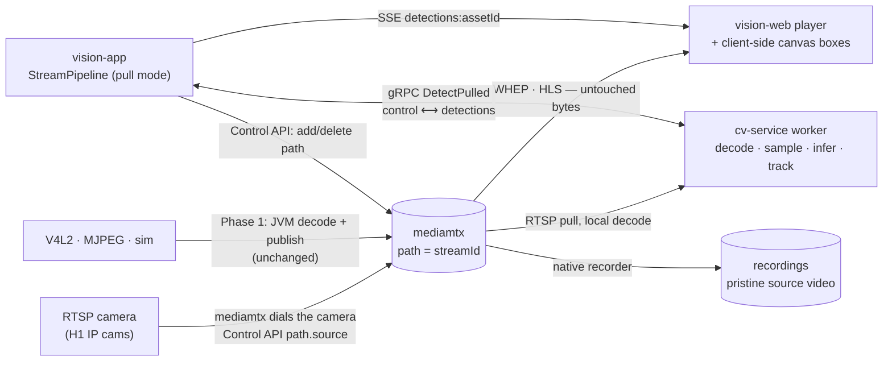

# MEDIA-SOT-PLAN — mediamtx as the video source of truth

**Status:** approved architecture decision (2026-08-12). M0 measured and returned **GO** —
[CV-PULL-SPIKE.md](../../conclusions/CV-PULL-SPIKE.md) is the measurement record and its three
corrections are folded into §5.3, §5.5 and §6 below. Waves M1, M2, M8 built. Owner: perception.
**Decides:** `docs/plans/active/CV-SCALE-PLAN.md` §S5 ("DECISION REQUIRED") — the answer is **GO**, and this
plan owns its execution. §S5 is superseded by this file (amendment text in §10).
**Reads with:** [ARCHITECTURE.md](../../../ARCHITECTURE.md) · [CV-SCALE-PLAN.md](CV-SCALE-PLAN.md) (S1–S4,
which this composes with) · [CV-RATE-CONTROL-PLAN.md](CV-RATE-CONTROL-PLAN.md) and
[CV-RATE-BUDGET.md](../../conclusions/CV-RATE-BUDGET.md) (whose §5 gap 9 — *"tracker runs across the
network — open, architectural, separate programme"* — is this programme) · `DOMAIN-SEPARATION-PLAN.md`
(on branch `feat/domain-separation`, §4 **perception** context and §6's frame-path arrows, both of which
this plan redraws).

> **The one-line goal.** The camera's own bytes reach the viewer and reach the detector, and the JVM
> touches neither. mediamtx holds the video; two independent subscribers read the *same* path.

---

## 1. Why — five things this buys, none of them "cleaner code"

| # | Gain | Grounded in |
|---|---|---|
| a | **The last un-audited multi-frame buffer leaves the viewing path.** Every viewed frame is today decoded, drawn on, and re-encoded by `H264RecorderFactory`'s x264 (`crf=21`, `maxrate=6 Mbps`, `bufsize=12 Mbit` — a VBV buffer we have never measured the occupancy of). Per-stream JVM encode cost drops to **zero**. | `adapters/adapter-publish-hls/.../H264RecorderFactory.java` |
| b | **Video survives a vision-app restart.** The pipeline stops being the publisher; mediamtx holds the camera connection, so a redeploy is a gap in *boxes*, not in *video*. | `MediamtxStreamPublisher` is the only publisher today |
| c | **N CV workers can subscribe to one path.** This is the enabling move for CV-SCALE §S4 and for the `perception`/worker role in the domain-separation plan — a second reader is a second RTSP client, not a second copy of the frame path. | CV-SCALE §S4, DOMAIN-SEPARATION §4–5 |
| d | **~4 Mbps of H.264 beats 691 KB/frame of BGR24 to a remote worker.** R4 measured the raw wire at exactly `3 × 640 × 360 = 691,200 B`/frame for a ~3 ms median gain and a **worse tail** (max 46.4 → 102.6 ms). At 1080p unscaled that is ~6.2 MB/frame. Pulling compressed video is what makes cv-service deployable on a Raspberry Pi (hw decode) *and* on the GB4005 Intel/OpenVINO box at `192.168.0.106`. | CV-RATE-BUDGET §3 "BGR24 vs JPEG" |
| e | **Recordings become pristine source video.** `MTX_PATHDEFAULTS_RECORD=yes` records whatever is published — today that is the *overlaid* stream, so every recording, every replay clip, and every training sample captured from replay carries burned-in boxes. Under this plan the recording is the camera. | `docker-compose.yml`, `MediamtxReplayFrameExtractor` |

**Not a goal: burning boxes in Python.** The repo-root `Latency.md` (an external analysis, not a repo
decision) recommends `results.plot()` on the GPU and shipping annotated frames back. That reinstates a
re-encode in the viewing path and re-couples video latency to inference latency — exactly the two
couplings this plan removes. Boxes render **client-side**, where they already do (§4).

---

## 2. Current state (honest)

| Concern | Today | Gap for this plan |
|---|---|---|
| Viewing path | camera → JVM FFmpeg decode → `StreamPipeline#onNext` → `overlayIfNeeded` (Java2D) → x264 re-encode → RTSP push → mediamtx → browser | Four JVM stages the viewer does not need. `StreamPipeline.java:710-728` publishes **every** frame |
| CV frame path | JVM pushes downscaled BGR24/JPEG over `DetectStream` bidi; `DetectionStreamSession` correlates on `FrameRequest.sequence` | Decode cost is O(active streams) **on the backend** — CV-SCALE's named scale ceiling |
| RTSP cameras | every camera is dialled and decoded in-JVM by `FfmpegVideoSource`; grep confirms **no** mediamtx-proxy support anywhere in `adapter-rtsp` | mediamtx must become the RTSP client |
| mediamtx path name | exactly `streamId.value()` (a per-start random UUID), used identically by `viewUrl`/`whepUrl`/`playbackUrl` and by mediamtx's recorder | **No gap** — see D3, this is the alignment that makes the REST contract survive untouched |
| mediamtx Control API | **not enabled.** `docker-compose.yml` sets `MTX_WEBRTCADDITIONALHOSTS`, `MTX_HLS*`, `MTX_PATHDEFAULTS_RECORD*`, `MTX_PLAYBACK*` — no `MTX_API`, no port 9997 | Dynamic path creation needs it |
| Client-side boxes | **already built.** `shared/player/player.ts` canvas overlay + `detection-overlay-logic.ts` sync matcher, track hues, trails, click-to-follow, letterbox-correct scaling | Default is `'burned'`; `'burned'`/`'off'` both merely suppress the canvas — the module's own doc admits *"there is no way to make the video itself show zero boxes"* |
| WHEP viewing | **already built and preferred.** WHEP-first with ICE-restart recovery, HLS fallback, persisted DTLS cert | `behindLive` is hard-pinned to `0` for WebRTC, so boxes will **lead** the picture by the real ~0.2–0.5 s |
| Burn-in switch | `PipelineConfig.overlayBurnIn` (default `true`), settable at stream start only — deliberately **not** PATCH-able, and **absent from the TypeScript `StartStreamRequest`** | The web client cannot turn it off at all today |
| `OverlayPort` | exactly **one** call site in the whole tree: `StreamPipeline.java:772` | Removing it from the live path leaves the port with zero live consumers |
| Detection demand | manual `detectionEnabled` flag only; no refcount from `LiveUpdateRegistry` | CV-SCALE §S2 proper is unbuilt. Not re-planned here — §9 shows the seam |
| Pull spike | **none.** `cv-service/spikes/` and `cv-service/demo/` are untracked *visual-geolocation* residue — `.pyc` files, tile caches and eval results with no surviving `.py` | The spike is new work (wave M0) |
| cv-service decode deps | `opencv-python>=5.0,<6` present (via `[cv]`); **no PyAV, no ffmpeg-python**; nothing calls `cv2.VideoCapture` anywhere | Constrained by **invariant P1** (`pyproject.toml`): nothing x86-only or CUDA-only may enter `[cv]` |
| cv-service capture clock | `_handle_request` uses `time.monotonic()`, with an explicit comment distrusting remote capture timestamps | That comment **inverts** under pull — capture time becomes local |

---

## 3. Target architecture

Two **independent** subscribers of one mediamtx path. Nothing crosses between them.



**Two orthogonal switches**, each independently flagged, because they ship in different waves:

| | **A — who publishes video into mediamtx** | **B — how frames reach CV** |
|---|---|---|
| default (today) | JVM pipeline (`MediamtxStreamPublisher`) | JVM push (`DetectStream`) |
| new | mediamtx proxies the camera (`MediamtxProxyPublisher`) — **RTSP only** | worker pull (`DetectPulled`) |
| flag | `vision.publish.source-proxy.enabled` (default `false`) | `vision.cv.frame-transport` (default `push`) |

Legal combinations — **`A=proxy, B=push` is rejected at wiring time with a startup failure**, because the
JVM would then hold no frames to push:

| A | B | Who it is for |
|---|---|---|
| JVM | push | today; unchanged; every existing test stays green |
| JVM | pull | V4L2 / MJPEG / sim under the new CV path (Phase 1's non-RTSP answer) |
| proxy | pull | **the target** for RTSP cameras — zero JVM video |
| proxy | push | invalid — fail fast |

---

## 4. Decisions (pinned)

| # | Decision | Rationale |
|---|---|---|
| **D1** | **Both new paths ship behind flags whose defaults reproduce today's behaviour exactly.** `frame-transport: push`, `source-proxy.enabled: false`. | Every existing test stays green without being touched, and a bad measurement is a config rollback, not a revert |
| **D2** | **The mediamtx path name stays `streamId.value()`**, whoever publishes it. | `viewUrl`/`whepUrl`/`playbackUrl`, the recorder key, the playback `?path=`, and every REST DTO then need **no change at all**. CV-SCALE §S5 listed "path-name ↔ StreamId mapping" as a prerequisite; keeping the existing convention *is* the mapping |
| **D3** | **Proxy mode is a `StreamPublisherPort` implementation**, not an application-layer concept. `streamStarted` creates the mediamtx path pointing at the camera; `publish` is a no-op; `streamEnded` deletes the path; the three URL methods delegate to the existing `MediamtxUrls`. | The whole of `vision-api` (5 call sites, 3 DTOs) resolves URLs through this port already. Zero controller change |
| **D4** | **The application layer learns exactly one new fact**: `StreamPublisherPort#proxiesSource(Device)` (a `default` returning `false`). When true, `DefaultStreamService` does not open a `VideoSourcePort` at all. | One default method beats a new port, a mode enum, or a second service |
| **D5** | **Pull detection is a new driven port, not an overload of `DetectionPort`.** `DetectionPort#detect` is request→`CompletionStage`; pull is a subscription with no request. The new port mirrors `VideoSourcePort` exactly: `open(...) → Flow.Publisher<DetectionResult>` / `close(StreamId)`. | It makes the existing generic `SupervisedPublisher<T>` (already used for video sources, with reopen backoff) reusable **verbatim** as `SupervisedPublisher<DetectionResult>`. Free failover |
| **D6** | **Detections re-enter the existing result path unchanged.** `DetectionResultResponse`, the `detections:<assetId>` SSE topic, storage, events, replay: untouched. | Only the transport of *frames* changes; the transport of *results* does not (CV-SCALE §S5's own stance) |
| **D7** | **The decoder is chosen by measurement, not preference.** Default recommendation: `cv2.VideoCapture(url, cv2.CAP_FFMPEG)` — zero new dependency, honours invariant P1. PyAV / an ffmpeg subprocess are the named fallbacks if M0's drift or cost budget fails. Whatever wins sits behind a `PullSource` protocol so a Pi's `v4l2m2m` / the GB4005's VAAPI hw decoder is a later swap, not a rewrite. | Invariant P1 is the thing that keeps one package deployable to laptop, GB4005 and airframe. It is free to hold and expensive to recover |
| **D8** | **Failsafe (CLAUDE.md rule 9): the worker's decode loop always takes the newest frame and drops the backlog.** `LatestOnlyMailbox` already does exactly this on the inference side; the decode side gets the same discipline, and the drops are **counted on the wire** (`dropped_frames`), never silent | An uncounted drop is how `effectiveFps` sat at 7.58 against a configured 10 for a whole release |
| **D9** | **`adapter-overlay` is parked, not deleted.** It keeps its single call site, alive only for push mode / `overlayBurnIn=true`. It is **not** repurposed for recording — there is no `RecordingPort` implementation in the tree (mediamtx records), so "burn for recording" would be new work, and it would re-poison training capture | No fake capability, no dead-code deletion in a wave that is already changing the frame path |
| **D10** | **`sourceOnDemand: false`** for proxied paths by default (mediamtx dials the camera when the path is created), exposed as `vision.publish.source-proxy.on-demand`. | `MTX_PATHDEFAULTS_RECORD=yes` records every path; on-demand would make recording depend on somebody watching. Deployments that do not record can flip it and get video-layer demand gating for free |
| **D12** | **The worker's six diagnostic fields ride on `DetectionResult` as a nullable `PullTelemetry` component, null in push mode** — added in M5, not M2. `DetectionResult` already carries `inferenceLatency` and a nullable `TrackingTelemetry`, so this is the module's existing idiom, not a new one. Raised by M4: the adapter could decode fields 16–21 and had nowhere in the domain to put four of them. | §7 promised "`DetectionRate`'s shape is unchanged; only who counts changes", and that holds — `sourceFps`, `submittedFps`, `droppedInFlight` and `missedDeadlines` already exist on it. What was missing was the **carrier** from adapter to application. A second port method for stats would have added a polling seam; the wire already restates these per response, so the domain mirrors the wire. `capture_skew_millis` has no read-model home this wave — it is logged, and §5.4 stays frozen |
| **D11** | **gRPC stays for both control and results.** Re-affirms CV-SCALE's WebSockets verdict; this plan is the pull-vs-push change that verdict said was the real lever | No second protocol, no hand-rolled framing |

---

## 5. Frozen wire contract

Everything in this section is pinned so the cv-service, backend and UI waves parallelize without drift.

### 5.1 proto — `proto/vision/v1/cv.proto`

One new RPC on the existing `Inference` service. **No existing field number moves; no message is
re-shaped.** Next free numbers were verified: `DetectionResponse` → 16, `FrameRequest` → 13.

```protobuf
service Inference {
  rpc DetectStream(stream FrameRequest) returns (stream DetectionResponse);   // unchanged
  rpc DetectPulled(stream PullControl)  returns (stream DetectionResponse);   // NEW
}

// Declarative per-pull desired state, restated on EVERY message — same doctrine as
// TrackingConfig, and for the same reason: a one-shot control message can be lost with
// no error and no retry, a restated desired state is self-healing.
message PullControl {
  string stream_id            = 1;   // vision StreamId; ALSO the mediamtx path name (D2)
  string source_url           = 2;   // rtsp://{host}:8554/{stream_id} — read from the FIRST message only
  string rtsp_transport       = 3;   // "tcp" | "udp" | "" = server default; first message only
  string model_id             = 4;   // hot
  string model_version        = 5;   // hot
  float  confidence_threshold = 6;   // hot
  float  target_fps           = 7;   // hot; <=0 = server default. The Java rate controller's output
  int32  detect_width         = 8;   // hot; <=0 = server default. Worker downscales locally
  TrackingConfig tracking     = 9;   // hot; reused verbatim, including TargetLock/lock_seq semantics
  CameraPose camera_pose      = 10;  // hot; arrives at telemetry rate, decoupled from frames
  bool   stop                 = 11;  // true = drain and half-close cleanly
}

message DetectionResponse {
  // ... fields 1–15 unchanged ...
  // Pull mode only (DetectPulled). All zero in push mode. Together these are the complete,
  // honest accounting of a loop that now runs on another machine.
  int64 decode_millis       = 16;  // local decode cost for the frame this response describes
  float source_fps          = 17;  // measured rate of the pulled stream
  float achieved_fps        = 18;  // measured rate at which this loop actually infers
  int64 dropped_frames      = 19;  // cumulative frames the latest-wins decode loop discarded (D8)
  int64 missed_deadlines    = 20;  // cumulative sampler deadlines no frame arrived to serve
  int64 capture_skew_millis = 21;  // worker's estimate of (local receipt − capture); 0 = unknown
}
```

**Call semantics, frozen:**

| Rule | Behaviour |
|---|---|
| Identity | `stream_id` identical on every message of a call; a mismatch is `INVALID_ARGUMENT` |
| Ordering | The first message must carry `source_url`; later messages' `source_url`/`rtsp_transport` are ignored |
| Idempotence | Restating identical hot fields is a no-op. `TargetLock.lock_seq`'s strictly-greater rule applies unchanged |
| Correlation | **None.** Unlike `DetectStream`, responses are unsolicited; `sequence` is minted by the worker, per pull, monotonic. Nothing keys a `CompletableFuture` on it |
| Capture time | `DetectionResponse.timestamp_millis` is the **capture instant of the analysed frame**, derived from the pulled stream (§6). Same field, same meaning, same units as push mode |
| Failure | Source unopenable, or stalled past `CV_PULL_STALL_TIMEOUT_MILLIS`, ends the call with `UNAVAILABLE` + a message. The Java side re-dials on `SupervisedPublisher`'s existing backoff |
| Teardown | `stop=true`, or the client half-closing, releases the `SessionRegistry` entry on the existing grace window |

### 5.2 Java ports — `vision-domain`

```java
public interface PulledDetectionPort {                       // mirrors VideoSourcePort's shape
    Flow.Publisher<DetectionResult> open(StreamId id, URI sourceUrl, PipelineConfig config);
    void reconfigure(StreamId id, PipelineConfig config);    // hot: model / fps / confidence / tracking
    void attitude(StreamId id, CameraAttitude attitude);     // camera_pose at telemetry rate
    void close(StreamId id);
}
```

```java
public interface StreamPublisherPort {
    // ... existing methods unchanged ...
    /** True when mediamtx itself dials this device's source, so no JVM VideoSourcePort is opened. */
    default boolean proxiesSource(Device device) { return false; }
}
```

### 5.3 mediamtx Control API (v3) — used by `MediamtxProxyPublisher`

Container port `9997`, host-mapped **`19997:9997`** (same collision-avoidance convention as
`18888`/`18889`/`19996`). M0 verified every row below against 1.19.3 by `curl`; the transcript is
`cv-service/spikes/pull/results/mediamtx_api_transcript.txt`.

> **`MTX_API: "yes"` alone does not make this API callable — corrected from M0's measurement.**
> mediamtx's baked-in `authInternalUsers` grants unauthenticated `api` access **only to a caller at
> `127.0.0.1`/`::1`**. A docker-published port does not preserve that view, so `vision-app` calling from a
> sibling container gets `401 authentication error` on all three operations. Publish/read/playback carry no
> such restriction, which is why this never surfaced. **`MTX_AUTHINTERNALUSERS` as an env override was tried
> and does not work** — M7 must mount a `mediamtx.yml` widening the `api` user's `ips`, or configure explicit
> API credentials. This is blocking for M7, not cosmetic.

| Operation | Call | Handling |
|---|---|---|
| create path | `POST {api-base}/v3/config/paths/add/{streamId}` · `{"source":"<camera rtsp uri>","sourceOnDemand":false,"rtspTransport":"automatic"}` | **verified**: `{"status":"ok"}`; on a duplicate, HTTP 400 `path already exists` → fall through to patch (idempotent start) |
| patch path | `PATCH {api-base}/v3/config/paths/patch/{streamId}`, same body | **verified** `{"status":"ok"}` on an existing path. Spelled out because M0 found §5.3 only implied it |
| readiness | `GET {api-base}/v3/paths/get/{streamId}` → `{"ready":bool,...}` — **verified**; HTTP 404 `path not found` when absent | polled up to `vision.publish.source-proxy.ready-timeout` before the start call returns |
| delete path | `DELETE {api-base}/v3/config/paths/delete/{streamId}` | **verified**: 404 for both a just-deleted and a never-existing path → treat as success (idempotent stop) |

### 5.4 REST / SSE — three additive fields, nothing removed

| DTO | Change | Why |
|---|---|---|
| `DetectionResultResponse`, `BoundingBoxResponse`, `DetectionResponse` (api dto), the `detections:<assetId>` SSE payload | **none** | D6. The whole UI detection path is untouched |
| `StartStreamResponse`, `ActiveStreamResponse` | `+ boolean burnedIn` | The client currently *claims* a `'burned'` mode that may render nothing. This field is what lets it stop lying (§7) |
| `DetectionRateResponse` (nested in `GET /api/streams/{id}/tracks`) | `+ String transport` (`"push"`\|`"pull"`), `+ double decodeMillisP50` (0 in push) | Every other component of `DetectionRate` keeps its meaning and is populated from the worker's reported figures — this pair says which machine measured them |

`PATCH /api/streams/{streamId}/config` is unchanged and keeps working in pull mode: its fields travel on
the next `PullControl` instead of the next `FrameRequest`.

### 5.5 Configuration — no magic numbers

| Property | Default | Notes |
|---|---|---|
| `vision.publish.source-proxy.enabled` | `false` | switch A |
| `vision.publish.source-proxy.on-demand` | `false` | D10 |
| `vision.publish.source-proxy.rtsp-transport` | `automatic` | passed to mediamtx |
| `vision.publish.source-proxy.ready-timeout` | `10s` | readiness poll budget |
| `vision.publish.mediamtx.api-base` | `http://localhost:19997` | joins the `hls-base`/`whep-base`/`playback-base` family |
| `vision.cv.frame-transport` | `push` | switch B — `push` \| `pull` |
| `vision.cv.pull.rtsp-base` | `rtsp://localhost:8554` | **the address the *worker* dials**, deliberately separate from `vision.publish.mediamtx.rtsp-base`: a remote GB4005 worker needs the host's LAN address, not `localhost` |
| `vision.cv.pull.reconnect-backoff` | `500ms` … `10s` | mirrors `vision.publish.resilience.*` |
| `CV_PULL_DECODER` | **`opencv`** — chosen by M0 | Fastest on both boxes (2.3/4.1 ms laptop, 1.9/4.3 ms GB4005) and no new dependency. `pyav` stays the fallback (aarch64 wheel verified by download); measured ~33 ms, so it is not the default |
| `CV_PULL_RTSP_TRANSPORT` | `tcp` | |
| `CV_PULL_TARGET_FPS` | `10.0` | floor when `PullControl.target_fps <= 0` |
| `CV_PULL_MAX_WIDTH` | `640` | matches `MAX_DETECT_WIDTH` |
| `CV_PULL_OPEN_TIMEOUT_MILLIS` / `CV_PULL_STALL_TIMEOUT_MILLIS` | `5000` / `5000` | |
| `CV_PULL_CLOCK_MODE` | **`anchor`** — chosen by M0 | ±15 ms over 10 min, inside the 100 ms gate. `arrival` remains selectable; `ffmpeg_wallclock` was dropped (§6) |

---

## 6. Capture time and box↔video alignment — what we promise, and what we do not

`DetectionResult.capturedAt` is load-bearing: `DetectionExtrapolator` uses it server-side and
`selectDetectionResult` uses it client-side. Under pull, the worker mints it.

**How.** The pulled stream gives presentation timestamps, not wallclock. RTCP sender reports carry the
absolute anchor when the camera sends them; `cv2.VideoCapture` does **not** expose them. So:

> `capturedAt = anchorWallclock + (pts − anchorPts)`, with the anchor taken at open and re-anchored
> whenever measured skew exceeds a threshold. The worker reports its own error bar as
> `capture_skew_millis` on every response.

**M0 measured this and chose `anchor`** (±15 ms over 10 minutes, worst spike ~80 ms — inside the 100 ms
gate, so PyAV's fallback trigger was not tripped). `arrival` (receipt wallclock, biased by the jitter
buffer) remains selectable.

> **The third candidate does not exist — corrected from M0.** `-use_wallclock_as_timestamps 1` is a
> **no-op against RTSP sources** (verified by A/B `showinfo`), so `ffmpeg_wallclock` never meant what its
> name implied. It is dropped; an ffmpeg-subprocess decoder gives `arrival`, not wallclock capture time.

**The gate M0 could not exercise:** the spike's synthetic source has no independent camera oscillator, so
±15 ms is a drift *floor*, not a real-camera ceiling. Re-run the 10-minute drift measurement against a real
H1 camera before treating the 100 ms budget as settled; PyAV (aarch64 wheel already verified) is the
pre-agreed answer if a real camera's clock drifts past it.

**Alignment is best-effort and asymmetric — say so in the UI, do not hide it:**

| Transport | Glass-to-glass | Consequence |
|---|---|---|
| WHEP | ~0.2–0.5 s | Today `behindLive` is pinned to `0` for WebRTC, so boxes **lead** the picture by that much. Fixed in M8 by feeding the already-measured `whepLatencySeconds` into `selectDetectionResult` |
| HLS (LL-HLS, 1 s segments / 200 ms parts) | seconds | Boxes will lead the video by several seconds and there is no fix short of buffering the box feed. **Accepted and documented**; HLS is the reachability fallback, not the operating transport |

**Clock sync is an assumption, not a guarantee.** `capturedAt` (worker clock) is compared against the app's
clock server-side and the browser's clock client-side. NTP on both hosts is the mitigation;
`capture_skew_millis` plus M0's measured app↔worker offset is the instrument that makes a violation
visible instead of silently shifting every box.

---

## 7. Fate of the `feat/cv-rate-control` work

Checked against the code on that branch, not against the plan text.

| Piece | Fate |
|---|---|
| **`DetectionRateController`** (demand from smallest-box association budget + fastest track velocity + yaw ego-motion; raise-only; `NEGLIGIBLE_DEMAND_FPS` snap) | **Survives in Java, unchanged.** It needs the `TrackBook` and MAVLink attitude, both of which live in the JVM. Its output `targetFps` now travels on `PullControl.target_fps` instead of driving a local sampler |
| **Deadline sampler** (`sampleDue`/`armScheduleAt`, the load-bearing `max(now, …)` clamp, the one-clock-read-per-frame discipline) | **Ported to Python**, into the worker's decode loop. The Java copy stays for push mode. The one-read rule and the debt clamp are the two things a port most easily loses — call them out in the wave |
| **The three drop counters** (`missedDeadlines`, `droppedInFlight`, `droppedOutage`) | **Move worker-side and come back on the wire** (fields 19–20 + `InferenceGate` saturation). `DetectionRate`'s shape is unchanged; only who counts changes |
| **BGR24 wire** (`WireFormat`, `DetectionFrameCodec`'s raw branch, `vision.cv.{wire-format,detect-width,jpeg-quality}`) | **Becomes the legacy/fallback push path.** Not deleted — it is still the path for V4L2/MJPEG/sim and for any `frame-transport: push` deployment. R4's own finding (≈3 ms of median for 691 KB/frame and a doubled tail) is precisely the argument for pulling compressed video to a *remote* worker |
| **gRPC** | **Stays**, as control plane (config, model, demand, camera pose) and as the detections return path — CV-SCALE's verdict, now load-bearing rather than theoretical |
| **`recordRoundTrip`** (EWMA feeding the capacity ceiling) | **Loses its input in pull mode** — there is no Java→Python frame round trip. In pull mode the ceiling term is fed from the worker's reported `inference_millis + decode_millis` |
| **`PipelineLatency.roundTripMillis*`** | **Redefined in pull mode** to `receivedAt − capturedAt` — box age at arrival, which is what CV-RATE-BUDGET §3 argued was the number an operator actually experiences (208 ms, against a self-reported 29 ms). `DetectionRateResponse.transport` tells a reader which definition is in force |
| **R2's unverified live effect** (CV-RATE-BUDGET §5 gap 1: *"built, live effect unverified"*) | **Unchanged and still open.** This plan does not close it; wave M9's footage run is the first realistic chance to |

---

## 8. Waves

Disjoint file scopes. Each wave ends with **its scoped build green** and **its MODULE.md updated**.
Read the module's MODULE.md and its direct dependencies' before touching anything.

### M0 — Spike: one worker, one path, end to end · **gates everything else**
*Scope:* `cv-service/spikes/pull/` (new; the existing `spikes/geo` residue is unrelated — see §11 hygiene).
Nothing else. No product code.

Open `rtsp://localhost:8554/{path}` against the running compose mediamtx, decode, run `yolo26n.pt`, and
**report numbers, not opinions**:
- decode ms p50/p95/max, per 720p and 1080p source; RSS; CPU% — on this laptop **and** on the GB4005 box
- achieved fps against a requested 10, with the ported deadline sampler; `dropped_frames` under an
  artificially stalled detector (proves D8)
- `capturedAt` drift for all three clock candidates over 10 minutes, plus the app↔worker clock offset (§6)
- `curl` transcripts confirming §5.3's three Control API calls against `bluenviron/mediamtx:1.19.3`

*Build:* `cd /home/vladte/IdeaProjects/vision/cv-service && ./scripts/test.sh` (spike itself is not unit-tested).
*Done when:* the measurements are written into `docs/conclusions/` and the decoder + clock mode are chosen
**by number**. A NO-GO is a legitimate outcome and stops M3/M5/M6.

### M1 — Freeze the wire · *parallel with M0*
*Scope:* `proto/vision/v1/cv.proto`, `vision-proto/MODULE.md`.
Add exactly §5.1. Verify both codegens (`./mvnw -B -pl vision-proto test`, `cv-service/scripts/gen_proto.sh`).
*Done when:* generated push-path code is byte-identical in behaviour; no field number moved.

### M2 — Domain seam · *parallel with M0/M1*
*Scope:* `vision-domain/**` only — `PulledDetectionPort` (new), `StreamPublisherPort#proxiesSource` (default
method), unit tests, `vision-domain/MODULE.md`.
*Build:* `./mvnw -B -pl vision-domain test`.
*Done when:* the framework-free rule holds and `NoopStreamPublisher` needs no edit.

### M3 — cv-service pull worker · *after M0 + M1*
*Scope:* `cv-service/cv_service/pull/` (new: `source.py` — the `PullSource` protocol + the M0-chosen backend;
`clock.py` — capture-time anchoring; `loop.py` — the ported deadline sampler + latest-wins decode),
`cv_service/grpc/servicers.py` (`DetectPulled` only), `cv_service/config.py` (`CV_PULL_*`), `tests/pull/`,
`cv-service/MODULE.md`, and `pyproject.toml` **only if** M0 chose PyAV (aarch64 wheel verified by download).

Reuse, do not re-implement: `SessionRegistry`/`StreamTrackingSession` (keyed on `stream_id`, already
survives a disconnect), `InferenceGate`, `ModelRegistry` (composite ids work unchanged), `_tracked_response`.
Note the inverted comment: `_handle_request`'s `time.monotonic()` distrust of remote capture timestamps no
longer applies — under pull the capture clock is local.
*Build:* `cd cv-service && ./scripts/test.sh`.
*Done when:* a test that stalls inference shows `dropped_frames` climbing while `capturedAt` stays fresh;
all six diagnostic fields are populated; `stop=true` and a mid-call model swap both work.

### M4 — Java pull port · *after M1 + M2, parallel with M3*
*Scope:* `adapters/adapter-cv-grpc/**` — `GrpcPulledDetectionPort` + `PulledDetectionSession` (new),
`GrpcCvSettings` (+ pull fields), tests, `MODULE.md`.
The session is a bidi call with **no correlation map** — this is the structural difference from
`DetectionStreamSession`, and the reason it is a sibling class rather than a mode flag on it.
*Build:* `./mvnw -B -pl adapters/adapter-cv-grpc test`.

### M5 — Pull-mode pipeline · *after M2 + M4*
*Scope:* `vision-application/pipeline/StreamPipeline.java` (a detection-driver seam: push driver = today's
sampler + in-flight bound; pull driver = subscribe and forward — both feed the existing
`onDetectionResult` unchanged), `DetectionRate`/`DetectionRateWindow` (+`transport`, +`decodeMillisP50`),
`PipelineLatency` (pull-mode redefinition, §7), `stream/DefaultStreamService.java` (honour
`proxiesSource` — open no `VideoSourcePort`; wrap the detection publisher in the **existing generic**
`SupervisedPublisher<DetectionResult>`), `vision-api/dto/DetectionRateResponse.java`,
both `MODULE.md`s.
*Build:* `./mvnw -B -pl vision-application,vision-api test`.
*Done when:* push mode is behaviourally unchanged (existing pipeline tests untouched and green) and a
hand-faked `PulledDetectionPort` drives storage, SSE, events and the rate read-model identically.

### M6 — mediamtx proxy publisher + live frame grab · *after M2, parallel with M5*
*Scope:* `adapters/adapter-publish-hls/**` — `MediamtxControlApi` (§5.3), `MediamtxProxyPublisher`
(D3), `PublisherRouter` (per-device choice: RTSP descriptor + flag → proxy, else `MediamtxStreamPublisher`),
and **`MediamtxLiveFrameGrabber`** — required, not optional: in proxy mode the JVM holds no frames, so
`latestFrame()` (the snapshot endpoint) and `latestRawFrame()` (training capture) would otherwise return
nothing. It grabs one frame from the live path on demand, reusing the machinery
`MediamtxReplayFrameExtractor` already uses against the playback server. Plus `MODULE.md`.
*Build:* `./mvnw -B -pl adapters/adapter-publish-hls test` (docker-gated ITs run if docker is present).
*Done when:* start → path appears in mediamtx with the camera as source → browser plays it → stop → path
gone; snapshot and training capture still return a real, **un-annotated** frame.

### M7 — Wiring, flags, deployment · *after M5 + M6*
*Scope:* `vision-app/**` only (`VisionPublishProperties`, `VisionCvProperties`, `PublishWiring`, `CvWiring`,
`application.yaml`, ArchUnit), `docker-compose.yml` (`MTX_API: "yes"` **plus a mounted `mediamtx.yml` or API
credentials — §5.3's auth correction, without which every Control API call 401s**, `19997:9997`, and the worker's
`VISION_CV_PULL_RTSP_BASE`), `.env.example`, `vision-app/MODULE.md`.
Reject `A=proxy, B=push` at startup with a clear message.
*Build:* `./mvnw -B -pl vision-app test`.
*Done when:* defaults produce byte-identical behaviour to today, and `docker compose config` is clean.

### M8 — UI: stop lying about burn-in, and stop leading the picture · *parallel from M1 onward*
*Scope:* `vision-web/**` only. The overlay already exists — this wave closes gaps, it does not build it.
- consume `burnedIn` from `ActiveStream`/`StartStreamResult`; when `false`, **remove `'burned'` from the
  `BoxesMode` cycle** and default to `'overlay'` (`cv-control-panel.html`, `fly-logic.ts#cycleBoxesMode`,
  `wall-tile.ts`, `live.html`)
- feed the already-measured `whepLatencySeconds` (+ jitter buffer) into `selectDetectionResult` instead of
  the hard-pinned `0`, so WHEP boxes stop leading (§6)
- device-pixel-ratio scaling on the overlay canvas (today it rasterizes at 1× on HiDPI, which quietly
  undercuts the "crisp at any bitrate" claim the client overlay exists for)
- redraw on `requestVideoFrameCallback` where available instead of the 200 ms interval; add a resize observer
*Build:* `./mvnw -B -pl vision-web clean install` (production build + the full Vitest run).

### M9 — Measure, then write down what it actually did · *after M7 + M8*
*Scope:* `docs/conclusions/` (a new measurement record), `docs/plans/active/CV-SCALE-PLAN.md` (§10's
amendment), `docs/README.md` (a row for this plan), this file's status header.
Run the real path against a real camera and record: glass-to-glass with and without the JVM in the path;
JVM CPU and RSS per stream, before/after; box age; worker decode cost on the GB4005 versus this laptop;
and whether a `vision-app` restart interrupts video (claim b).
*Done when:* the numbers are written down **including the ones that disappoint** — the standing lesson of
CV-RATE-BUDGET §5 is that green tests are not an outcome.

**Sequencing summary.** M0 ∥ M1 ∥ M2 ∥ M8 start together. M3 and M4 follow. M5 ∥ M6. Then M7, then M9.

---

## 9. Seams left open on purpose (do not build them here)

- **CV-SCALE §S2 demand gating.** When the `detections:<assetId>` refcount reaches zero, the pull is
  torn down (`stop=true`) and re-opened on demand — the pull *is* the subscription, so the gate is
  `close(streamId)`. One call, no new concept. Not built here.
- **CV-SCALE §S4 worker pool.** `PulledDetectionPort` is what a `PooledPulledDetectionPort` decorates;
  stream→worker affinity is already the natural shape because one pull belongs to one worker.
- **Domain separation `worker` role.** This plan is the prerequisite that makes `perception` horizontally
  scalable at all; it does not implement the role, the lease table, or NATS.

## 10. Amendment to apply to `CV-SCALE-PLAN.md` (M9's scope, not applied by this document)

Replace §S5's heading and opening sentence with:

> ### S5 — Pull-based frames (the real scale ceiling, biggest change) — **DECIDED: GO**
> The decision was taken on 2026-08-12 and its execution is owned by
> [MEDIA-SOT-PLAN.md](MEDIA-SOT-PLAN.md), which widens it from "the worker pulls frames" to "mediamtx is
> the video source of truth for viewing *and* CV". The body below stands as the original statement of the
> problem; the frozen contract, the phasing and the waves live in that plan.

Add to §"Sequencing & waves", Wave 4: *"executed as MEDIA-SOT-PLAN waves M0–M9; the spike this wave asked
for is M0."*

## 11. Non-goals and deliberate deferrals

Named, not silently dropped.

1. **Externalizing non-RTSP ingest.** V4L2, MJPEG and sim keep the JVM decode-and-publish path in Phase 1.
   Replacing it with per-source ffmpeg sidecars publishing straight into mediamtx is a **later phase, not
   scope**. RTSP-first matches the hardware direction — TWO-TARGETS H1 buys IP cameras.
2. **Deleting `adapter-overlay`.** D9: parked, one call site, alive for push mode. Nothing is repurposed
   for recording, because no `RecordingPort` implementation exists to repurpose it into.
3. **Frame-accurate WHEP sync** via `RTCRtpReceiver.getSynchronizationSources()` /
   `estimatedPlayoutTimestamp`. Best-effort wallclock alignment ships (§6); frame-accuracy is a later,
   separate piece of work.
4. **HLS box alignment.** Boxes lead HLS video by seconds. Documented, not fixed.
5. **Multi-worker pool and automatic demand gating** — CV-SCALE §S2/§S4, §9 above.
6. **Closing CV-RATE-BUDGET gap 1** (adaptive rate's unverified live effect). M9 is the first realistic
   opportunity, not a commitment.
7. **Hygiene, not scope:** `cv-service/spikes/` and `cv-service/demo/` are ~2,700 satellite tiles, 37
   orphaned `.pyc` files and 47 eval-result directories left by the parked `feat/visual-geo` programme.
   They should be deleted or gitignored — in their own commit, by whoever owns that branch.

## 12. Risks, and the instrument that would falsify each

| Risk | Instrument |
|---|---|
| Decode on the GB4005 (2 Intel cores, no CUDA) cannot keep up with 1080p H.264 | M0 measures decode ms and CPU% on that exact box before any product code is written |
| `capturedAt` drifts, and boxes silently land on the wrong frame | `capture_skew_millis` on every response + M0's 10-minute drift run; PyAV is the pre-agreed fallback |
| mediamtx's Control API differs from §5.3 | M0's `curl` transcripts against the pinned 1.19.3 image, before M6 |
| mediamtx becomes a hard runtime dependency for CV, not just for viewing | Already true for viewing and recording; §10 of the domain-separation plan's degradation map is extended in M9 — cv-service down still means "video, no boxes", and mediamtx down now means "no video **and** no boxes", which is a real widening and must be written down, not glossed |
| A proxied path silently fails to dial the camera and the operator sees a black player | The readiness poll (§5.3) gates the start response; a not-ready path fails the start call rather than returning a URL that plays nothing |
| The pull loop drops frames invisibly, repeating the 7.58-vs-10 failure | D8 + fields 19–20; M3's stalled-detector test asserts the counters climb |
