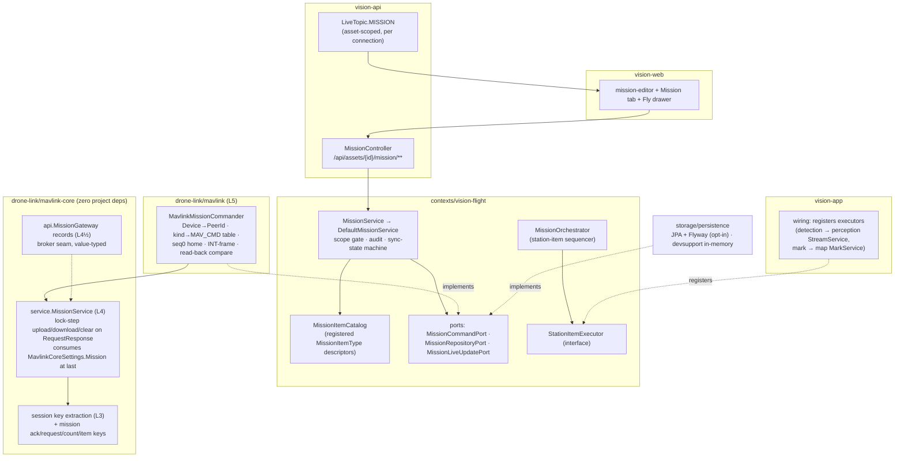

# MISSIONS-PLAN — from the tactical map to the aircraft, honestly

**Status:** plan (2026-08-16, branch `feat/missions`). Architecture only — no code in this task.
**DECIDED 2026-09-01 (ASSET-FLOWS D1): tasking-only.** Full waypoint execution (M1–M8) is retired; this doc remains reference for the tasking subset (`goto`, small verb set, `.plan` import/export). See `docs/plans/active/asset-flows/P-PROPOSAL.md` §Decided.

**Context:** [MISSIONS-CONTEXT.md](MISSIONS-CONTEXT.md) — what exists, the gap, constraints C1–C9. Not re-derived here.
**Answers:** [MAVLINK-CORE-PLAN.md](MAVLINK-CORE-PLAN.md) §9 open question 2 (*"Mission upload priority — W6 or sooner?"*) — sooner, as this plan's M1/M3.
**Reads with:** `drone-link/mavlink-core/MODULE.md` (the built L1–L4½ surface), `contexts/vision-flight/MODULE.md` (the command-gate idiom every wave here copies), `contexts/vision-map/MODULE.md` (§3's integration surface), `docs/conclusions/MAP-UX-RESEARCH.md` (the UI method §1 applies, and the Fly-rail constraint §1.4 obeys).

Ordering below is the operator's own stated order: UI needs first, then the extensibility model, then map integration, then placement/waves.

---

## 0. Goal and current state

**Goal:** an operator draws a route on the map, attaches per-item commands (both flight-controller-native and station-side), uploads it to the aircraft, *knows* what is actually on the aircraft, watches it execute against the plan, and can stop it — with visibility and authority resolved by the models this platform already has.

| What | Exists today | Gap |
|---|---|---|
| Route drawing UI | `station/vision-web/src/app/shared/map/flight-plan-logic.ts` + `shared/map/fleet-plan-dialog/flight-plan-dialog.{ts,html,css}` — pure, unit-tested (22 specs), reused by two pages | feeds `POST /api/simulations` only; no mission semantics (per-item commands, altitude required, end behavior) |
| Route domain model | `vision-simulation`'s `Waypoint`/`TelemetryPlan`/`RouteMode` | simulator input types; no upload lifecycle, no vehicle-side state |
| Command TX to a vehicle | `FlightCommandPort` 4 verbs + `DefaultFlightCommandService`'s scope-gate/audit idiom (`contexts/vision-flight`) | nothing positional, nothing sequenced |
| MAVLink machinery | `drone-link/mavlink-core` W1–W4: `RequestResponse`, `CommandService.sendInt`, `MavlinkCoreSettings.Mission(1500ms, 250ms/item, 5 retries)` **modelled but unconsumed** | no `MissionService`; `DefaultCorrelator.extractKey` recognizes only `CommandAck` (id 77) |
| Map | layers/grants/marks/drawings, scoped SSE (`LiveTopic.MAP` + `MapVisibility` in `vision-api/.../live/`) | no notion of a mission (its own MODULE.md says so deliberately) |
| Test drone | `telemetryTransport=MAVLINK` registers a real `"mavlink"`-protocol device; `MavlinkFeedTransmitter` flies a route and transmits | **TX-only — it never reads a byte**, so a test drone advertises itself as commandable and silently `NO_ACK`s every command (§4.5). No vehicle can accept a mission without docker+SITL |
| Mission concept | — | **nothing**: 33 controllers, none named Mission |

---

## 1. UI need-to-have features

Method as in `MAP-UX-RESEARCH.md` §1 / `CV-UX-RESEARCH.md`: first the questions the operator must be able to answer **at rest**, then the honesty defects a naive mission UI ships with, then what is reused vs new, then the deliberate exclusions.

### 1.1 The seven questions the UI must answer at rest

| # | Question | Answered by | Why it is need-to-have |
|---|---|---|---|
| Q1 | *What is planned?* | route polyline + numbered items on the tactical map; item list with per-item command chips | the baseline |
| Q2 | *What is actually on the vehicle?* | the **read-back**: after every upload the station downloads the vehicle's mission and compares. Only a byte-compare pass may render "on vehicle" | ArduPilot's upload is **not atomic** (MAVLINK-CORE-PLAN §2.2): a failed upload leaves mixed state. Send-side bookkeeping cannot answer this question, ever |
| Q3 | *Are plan and vehicle the same?* | one sync-state chip, always visible wherever the mission is shown: `DRAFT / UPLOADING i/N / ON VEHICLE / DIVERGED / UNKNOWN` (§4.4 pins the vocabulary) | CLAUDE.md rule 9: a stale plan shown as current is the same defect class as the frozen detection boxes CV-DEMAND just fixed |
| Q4 | *Where is it in the mission right now?* | current-leg highlight + reached-item ticks (from `MISSION_CURRENT`/`MISSION_ITEM_REACHED`), and planned track vs flown track (§3.3) | "is it doing what I told it" is the whole point of watching |
| Q5 | *What happens at the end?* | end behavior is an explicit, mandatory field — `RTL / LOITER / LAND` — rendered as the route's terminal glyph, never implied | an aircraft that silently loiters at the last waypoint until battery exhaustion is an incident, not a default |
| Q6 | *Can I stop it, right now?* | an always-visible **Abort** during execution: one tap → mode change out of AUTO (configurable abort mode, default LOITER; `Bring home` stays beside it). Both ride the existing `FlightCommandPort.setMode`/`returnToHome` verbs — the abort path mostly exists already | need-to-have, not polish. A mission UI without a stop is a weapon without a safety |
| Q7 | *Which parts of this plan die with the link?* | station-side items (§2) carry a distinct badge ("station" glyph) in the list and on the map; the plan summary states "N of M items require a live link" | the failsafe asymmetry (§2.4) must be visible at plan time, not discovered at link loss |

### 1.2 The honesty defects a naive mission UI would ship with

1. **"Uploaded ✓" from the send side.** The defect Q2/Q3 exist to kill. Rule: the UI never renders `ON VEHICLE` from having *sent* items — only from having *read them back* and compared. `UPLOADING` shows progress `i/N` from the vehicle's own `MISSION_REQUEST_INT` lock-step, so a stall is visible mid-upload, not after a timeout.
2. **Off-by-one item numbering.** ArduPilot's seq 0 is home; the wire's indices are not the operator's. The UI shows operator indices 1..N everywhere; the seq mapping lives in exactly one adapter function (§4.2) and never leaks to a screen or a DTO.
3. **Station items drawn like native ones.** Implies FC autonomy they do not have — Q7's badge is the fix.
4. **"Mission complete" inferred from proximity to the last waypoint.** Completion comes from the vehicle's own state (mode leaving AUTO / last item reached), never from geometry.
5. **Editing the draft silently un-truths the chip.** Any edit to a mission whose sync state is `ON VEHICLE` flips it to `DIVERGED` immediately, client- and server-side — divergence the station itself caused is still divergence.
6. **A default altitude quietly applied to a real aircraft.** The simulator dialog's nullable altitude is fine for synthetic telemetry; a mission item's altitude is **required, explicit input** (prefilled from the previous item, never silently defaulted by the server).

### 1.3 Where it lives — reuse vs new

Planning is a calm-hands task; execution is a seconds-matter task. Two surfaces, per `MAP-UX-RESEARCH.md` §3's Fly/Command split:

| Surface | What | Reused | New |
|---|---|---|---|
| **Command** (plan) | asset panel gains a **Mission** 4th tab (beside Status/Telemetry/Video, `features/command/asset-panel.html:10-20`); "Plan mission…" opens the mission editor | `flight-plan-logic.ts`'s pure waypoint ops (add/move/remove/parse) and the flight-plan-dialog's proven click-to-add / drag-on-`dragend` Leaflet technique; the shared `leaflet-loader.ts` bootstrap; `tactical-map` rendering | `shared/map/mission-editor/**` — a **new** dialog. Not an overload of `flight-plan-dialog`: that dialog's speed + `RouteMode LOOP/BOUNCE/ONCE` are simulator semantics with no mission meaning, and its nullable altitude violates §1.2(6). The simulator dialog stays untouched |
| **Fly** (execute) | mission status + Abort fold into the existing `flight` drawer; planned route + current leg render on the map inset | tool rail **unchanged at 7 buttons** — MAP-UX §1.2's safety-of-flight "no overflow, no new rail button" rule is binding here | drawer content: sync chip, item ticks, Abort; map overlay: planned polyline + leg highlight + flown track |

Text sketch — Command's Mission tab, at rest, mission on vehicle and running:

```
┌─ Mission — Recon east ────────────────────────────┐
│  [ON VEHICLE ✓ 14:02]      [Start] [Abort] [Edit] │
│  1 ● Waypoint 120m                                │
│  2 ● Waypoint 120m · hold 10s                     │
│  3 ○ Loiter 30s                     ← current leg │
│  ⚑ 3½ station · detection ON (needs link)         │
│  4 ○ Waypoint 90m                                 │
│  ⌂ End: Return to launch                          │
└───────────────────────────────────────────────────┘
```

The sync chip's `DIVERGED` state renders with the item-level diff available one click away (which items differ / are missing) — the read-back already has the data; hiding it would waste the one honest signal we paid for.

### 1.4 Deliberately excluded from v1 (named, not dropped)

- **Mid-flight plan editing / partial re-upload** (`MISSION_WRITE_PARTIAL_LIST`) — ArduPilot support is uneven; v1 re-uploads whole plans while disarmed or aborted. Named as the first v2 candidate.
- **Fence/rally upload via the mission protocol** (`mission_type FENCE/RALLY`) — geofencing already has its own station-side model (`GeofenceZone`); pushing zones into the FC is a separate, real feature.
- **Multi-vehicle / swarm missions** — one asset, one mission.
- **A mission library/history** — one current mission per asset, newest wins (C5). History is what `vision-events` is for, later.
- **A `station.recording` item** — there is no per-stream recording toggle service today (recording is mediamtx configuration; `ReplayFrameExtractionPort` reads what mediamtx recorded). Shipping the item would be fake capability. Deferred until a real recording-control seam exists.
- **Terrain-following / AMSL altitude modes** — v1 pins one frame (§2.3); GEO-POSE already taught this codebase what an altitude-frame confusion costs.

---

## 2. Custom commands / plan parts — the extensibility model

### 2.1 The shape: one record, kinds as data, a registry of descriptors

Follow the codebase's own discriminated-record precedent — `Drawing(DrawKind kind, points…)` with kind-dependent invariants, and `MapDrawingsController`'s kind-plus-payload wire shape — not a sealed hierarchy with one Java type per item kind (which would make every new kind a domain edit, a DTO edit, and a mapper edit: exactly the five-layer spread this section exists to prevent).

```
MissionItem(String kind, GeoPosition position?, Double altitudeMeters?,
            Map<String,String> params, StationAnchor anchor?)     — vision-flight domain record

MissionItemType(String kind, Family family,            — a descriptor, registered not hardcoded
                Set<String> requiredParams,
                boolean positional,                     — positional ⇒ position+altitude required
                Validator validate)                     — per-kind compact-invariant hook

enum Family { NATIVE, STATION }
StationAnchor(int afterItem)                            — STATION only: fires when native item
                                                          `afterItem` is reached (operator index)
```

`MissionItemCatalog` (flight application layer) holds the registered `MissionItemType`s and is the single validation gate — `Mission`'s compact constructor delegates per-item validation to it. Kinds are namespaced strings (`nav.waypoint`, `station.detection`), so a third-party kind never edits an enum.

### 2.2 The two families, and the split that matters

| | **NATIVE** (`nav.*`, `do.*`) | **STATION** (`station.*`) |
|---|---|---|
| Executed by | the flight controller, from its own stored mission | this platform, when the vehicle reports reaching the anchor item |
| Uploaded to vehicle | yes — translated to `MISSION_ITEM_INT` | **never** — lives only in the station's mission document, anchored to a native item |
| Survives link loss | **yes** — the FC flies on | **no** — needs a live link *and* a live station |
| Adding a kind costs | one `MissionItemType` descriptor + one row in the adapter's kind→`MAV_CMD` translation table (§4.2) | one `MissionItemType` descriptor + one executor class registered in `vision-app` wiring |
| v1 catalogue | `nav.waypoint` (→`NAV_WAYPOINT` 16, `holdSeconds`→param1), `nav.loiter` (→`NAV_LOITER_TIME` 19, `seconds`→param1), `do.change-speed` (→`DO_CHANGE_SPEED` 178, `speedMps`), end behaviors `nav.rtl` (20) / `nav.land` (21) | `station.detection` (`enabled`: flips the stream's `detectionEnabled` via perception's `StreamService.updateConfig` + `PipelineConfigPatch` — a real, existing seam, CV-CONTROL/CV-DEMAND), `station.mark` (drops a mark via map's `MarkService.geolocate` — the existing cockpit "Mark target" seam) |

**The failsafe asymmetry, stated plainly:** a native item is a promise the *aircraft* keeps; a station item is a promise *we* keep, and only while we can hear the vehicle and are running. On link loss the FC continues its native mission unchanged; every un-fired station item is marked `SKIPPED (link lost)` in the mission's progress record and surfaced in the UI — never silently pretended-executed, never retro-fired on reconnect without the operator's re-arm (a mark dropped 90 seconds late at the wrong position is worse than no mark). This asymmetry is why the split is two families in the model and two badges in the UI (Q7), not an implementation detail.

### 2.3 The station-side sequencer, and why it lives behind a functional seam

`MissionOrchestrator` (flight application layer) watches mission progress (§4.2) and, on each newly-reached native item, fires the station items anchored to it — **through a registered executor interface, not through imports of other contexts**:

```
interface StationItemExecutor {              — declared in vision-flight
    String kind();                           — e.g. "station.detection"
    void execute(AssetId asset, MissionItem item);   — must not throw into the sequencer
}
```

`vision-app` wiring registers the implementations (one calls perception's `StreamService`, one calls map's `MarkService`) — the exact pattern `GeofenceMonitor` already established when `vision-app` wired `geofenceMonitor::evaluate` into perception's `BiConsumer` seam to break the flight↔perception coupling (flight MODULE.md Gotchas). Flight never gains a dependency edge on map or perception; the DAG (C1) is untouched. Execution outcomes (`FIRED / FAILED:<reason> / SKIPPED`) are recorded per item and audited.

**Correctness traps carried into the model (non-negotiable, from MAVLINK-CORE-PLAN §2.2):**
- Every positional item translates to `MISSION_ITEM_INT` with **`MAV_FRAME_GLOBAL_RELATIVE_ALT_INT`** — the one frame v1 supports. Non-INT global frames silently corrupt lat/lon by rounding into int32 fields; the frame constant appears in exactly one adapter function and is asserted by a golden-bytes test.
- **seq 0 = home**: the adapter writes a home placeholder at seq 0; operator items map to seq 1..N in one function; no other layer ever sees wire seqs.
- Upload is **not atomic** on ArduPilot: the read-back-and-compare (§1.1 Q2) is a mandatory pipeline step, not an optional verify button (though a manual re-verify endpoint exists too, §4.4).

### 2.4 Worked walkthrough — a future/third-party item type

*"When the drone reaches item 4, switch the active CV model to `thermal-v2`."*

1. **Data:** register `MissionItemType("station.cv-model", STATION, requiredParams={"modelId"}, positional=false, validate=modelId-non-blank)` — one registration line in `vision-app` wiring config.
2. **One class:** `CvModelExecutor implements StationItemExecutor` — calls perception's existing `StreamService.updateConfig(streamId, patch(modelId))`. Lives in `vision-app` wiring (or an adapter if it needs I/O of its own). Registered beside the other executors.
3. **Nothing else changes.** The domain record, `MissionItemCatalog`'s gate, the REST DTO (kind+params passthrough, §4.4), persistence (items stored as kind+params), upload translation (STATION items are never uploaded), and the UI item list (renders unknown `station.*` kinds as a labeled chip from a small label map, falling back to the raw kind string) all handle the new kind without edits.

Honest cost accounting: a **NATIVE** kind is two edits, not one — the descriptor (data) plus one row in the adapter's translation table, because C6 forbids the domain from knowing `MAV_CMD` numbers and forbids mavlink-core from knowing our kinds. Still zero controller/DTO/persistence/UI-structure edits. The UI label map is a third, optional, cosmetic edit.

---

## 3. Missions × map integration

### 3.1 The gating call: a mission is **asset-scoped flight data that renders beside layers** — not a layer entity

Context §2.4 / open question 3. Decision: **(c) renders beside**, with the mark→item promotion as the real integration point. Reasoning:

| Option | What it buys | What it costs |
|---|---|---|
| (a) mission *is* a layer entity (a `Drawing` cousin) | free rendering + grants | a mission is an instruction with an upload lifecycle; `Drawing`'s patch semantics (anyone with CONTRIBUTE edits geometry) would let a teammate silently mutate a plan that is `ON VEHICLE`. Category error |
| (b) mission *projects onto* a layer (carries a `LayerId`, inherits `LayerGrant` visibility) | the "who sees whose plan" model for free | needs a `flight → map` context edge (or relocating `LayerId` out of map) — a new arrow in the measured DAG for one field; **and** it creates the incoherent state where a viewer can see the aircraft (asset-scoped telemetry) but not its route, or the route of an aircraft they cannot see |
| **(c) mission is asset-scoped** | one authorization story: whoever may see the asset (its telemetry, its position — `VisibilityScope`, the model that already governs everything else about an aircraft) sees its mission; whoever may *command* the asset (403-and-audit gate, C3) may upload/start/abort. Authority ≠ visibility stays clean — the OPS-UX theme | the map's layer-grant model is not reused for missions. Accepted: a mission is not shared *annotation*, it is *state of an asset*, and pretending otherwise is what (a)/(b) get wrong |

The layer-shaped need that remains real — "brief the team on a planned route on a shared layer" — is served later by an explicit **"snapshot to layer"** action: project the planned route as an ordinary `LINE` `Drawing` onto a TEAM/COP layer (a one-way, dated annotation, clearly not the live mission). Deferred, named in §7.

### 3.2 Editing a route on the tactical map

The mission editor (§1.3) is the flight-plan-dialog interaction transplanted: click to append, drag-end to move, numbered markers, dashed preview — plus a per-item command popover (kind, params, insert-station-item-after). Reuses `flight-plan-logic.ts`'s pure array ops and the shared Leaflet bootstrap; new component, simulator dialog untouched.

### 3.3 Planned track vs flown track

The tactical map renders three distinct strokes, visually distinct in both themes (and via dash pattern, not color alone, per the map's own color-drift lessons in MAP-UX §4): **planned** (dashed, from the mission document), **flown** (solid, the existing telemetry trail), **current leg** (emphasized planned segment from `MISSION_CURRENT`). Divergence between planned and flown is shown, never judged — the map states facts; the operator decides.

### 3.4 Promoting a verified `Mark` into a mission item

The integration the COP work was for: in the mission editor, "Add from marks" lists marks the viewer can see (their `MapAccessPolicy` visibility, unchanged); selecting one appends a `nav.waypoint` at the mark's position. **UI-level composition only** — vision-web reads marks (existing endpoint) and writes a waypoint (mission endpoint); no backend edge between flight and map is created. The item remembers `params["sourceMarkId"]` for provenance display; the mission does not track the mark afterwards (a mark drag after promotion does not silently move an uploaded route — that would violate Q3's truthfulness; the editor shows a "mark moved since" hint instead).

### 3.5 Live mission progress over SSE

A new `LiveTopic.MISSION` in `vision-api`'s existing `LiveUpdateRegistry`, **scoped per connection by asset visibility** (`VisibilityScope.includes(asset)`) — mirroring the per-connection scoping machinery `LiveTopic.MAP`/`MapVisibility` already proved, rather than the broadcast-unconditionally posture of the other topics, because a plan is exactly the kind of thing an unscoped broadcast would leak. Payload: the `MissionResponse` of §4.4 (full document, newest-wins — no delta protocol in v1). Port: `MissionLiveUpdatePort` in flight, the per-context live-port pattern from W1.6b.

---

## 4. Module placement and the seam map

### 4.1 Who owns `Mission`: `contexts/vision-flight`

- **Flight**, because a mission *is* command TX writ large — the deliberate RX-only break (C2) already lives there; the scope-gate/audit/403-vs-404 idiom (C3) is `DefaultFlightCommandService`'s, reused verbatim; asset→device resolution via warehouse's `AssetService#details` is flight's existing pattern; abort/start ride `FlightCommandPort` verbs flight already owns. Package: `flight.domain.model` + `flight.application.mission` (the map's `application.mark` subpackage precedent — flight now has more than one feature).
- **Not map** — map's own MODULE.md header excludes "any notion of a flight/mission plan" deliberately; a mission is instruction, not annotation (§3.1).
- **Not warehouse** — the pure inventory leaf; a mission is behavior, not stock.
- **Not simulation** — its `Waypoint`/`TelemetryPlan` are inputs to a synthetic telemetry generator and **stay untouched** (context §2.2's recommendation, confirmed: the overlap is the shape of a route, not its meaning).
- **Not a ninth context** — every collaborator a mission service needs (warehouse resolution, platform audit/scope, `FlightCommandPort`) is already flight's dependency set; a new context would add a module for zero new edges.

### 4.2 The seam map



Placement rules honored: Spring only in app/api/adapters (C1); **mavlink-core never learns what a `Device` or `Asset` is** (C6) — `MavlinkMissionCommander` resolves `Device` → gateway/`PeerId` exactly the way `MavlinkFlightCommander` does today (via `MavlinkTelemetrySource`'s gateway accessor), and owns the kind→`MAV_CMD` table, the seq-0 insertion, the frame constant, and the read-back comparison. The five frozen port-class constructors (C7) are untouched — `MavlinkMissionCommander` is a **new** class beside them.

### 4.3 What lands inside mavlink-core (the L3 cost, settled)

`service.MissionService` (L4) is built **on `RequestResponse`**, not beside it — its MODULE.md warns in writing about the two `CompletableFuture` races already found and fixed there; re-deriving them is forbidden. Upload is the server-driven lock-step (send `MISSION_COUNT`, answer each `MISSION_REQUEST_INT(seq)` with `MISSION_ITEM_INT(seq)`, re-answer re-requests, drop out-of-order, terminal `MISSION_ACK`); download is the mirror; per-item timeout/total timeout/retries come from **`MavlinkCoreSettings.Mission` — consumed at last, not re-specified** (they exist, defaults 1500 ms / 250 ms / 5, byte-identical to API.md).

The `DefaultCorrelator.extractKey` question (context §2.3 cost 1) is hereby settled: the documented "revisit when W6 adds a second case" moment has arrived, and it arrives with **four** new correlated types at once (`MISSION_ACK` 47, `MISSION_REQUEST` 40, `MISSION_REQUEST_INT` 51, `MISSION_COUNT` 44), so a fifth `instanceof` chain is the wrong shape. **Decision D6:** refactor `extractKey` into one package-local, compiled-in table (message class → `MatchKey` function) inside `session` — `DefaultCorrelator` becomes closed for modification, the `Correlator` public seam (API.md-frozen `await`/`cancel`) is byte-identical, and no runtime plugin registry is invented (nothing needs one). `MatchKey.discriminator` carries the mission seq where the protocol matches on it. `MISSION_CURRENT` (42) and `MISSION_ITEM_REACHED` (46) are *streams*, not replies — they go through `Dispatcher`, never the correlator.

`api.MissionGateway` + value records (L4½) land thin, mirroring `CommandGateway`'s shape (D9: caller-supplied correlation ids, no live references) so the NATS wave later is a translation. The in-process adapter consumes `service.MissionService` directly, exactly as `MavlinkFlightCommander` consumes `CommandService` directly today.

### 4.4 Frozen wire contract

Pinned here so backend (M2–M4) and UI (M5–M6) waves parallelize without drift. Property names exact; `kind`/`params` pass through uninterpreted by the DTO layer.

```
GET    /api/assets/{id}/mission          200 MissionResponse · 404 none/out-of-scope (read: 404, C3)
PUT    /api/assets/{id}/mission          200 MissionResponse (upsert the draft; body MissionRequest)
DELETE /api/assets/{id}/mission          204 (draft only; does not touch the vehicle)
POST   /api/assets/{id}/mission/upload   200 MissionResponse · 403+audit out-of-scope · 409 no commandable device
POST   /api/assets/{id}/mission/verify   200 MissionResponse (on-demand read-back & compare)
POST   /api/assets/{id}/mission/start    200 {"result":"ACCEPTED"|"NO_ACK"} (MAV_CMD_MISSION_START + AUTO)
POST   /api/assets/{id}/mission/abort    200 {"result":"ACCEPTED"|"NO_ACK"} (mode → configured abort mode)
SSE    topic "missions"                  MissionResponse, scoped per connection by asset visibility
```

Every `POST` above is a *command*: out-of-scope → **403 and audited**; `PUT`/`DELETE`/`GET` are writes-to-draft/reads → 404-shaped scoping, mirroring `DefaultFlightCommandService`'s deliberate asymmetry (C3).

```jsonc
// MissionRequest (PUT body)
{
  "name": "Recon east",
  "endBehavior": "RTL",                    // "RTL" | "LOITER" | "LAND" — required
  "items": [
    { "kind": "nav.waypoint", "latitude": 50.1, "longitude": 30.2,
      "altitudeMeters": 120.0, "params": { "holdSeconds": "10" } },
    { "kind": "do.change-speed", "params": { "speedMps": "12" } },
    { "kind": "station.detection", "anchor": { "afterItem": 2 },
      "params": { "enabled": "true" } }
  ]
}

// MissionResponse
{
  "assetId": "…", "name": "…", "endBehavior": "RTL",
  "items": [ /* as above, plus per-item "index" (1-based operator index) */ ],
  "sync": {
    "state": "DRAFT" | "UPLOADING" | "ON_VEHICLE" | "DIVERGED" | "UNKNOWN",
    "uploadedAt": "…" | null,              // last verified upload
    "progressUploaded": 3, "progressTotal": 7,   // non-null only while UPLOADING
    "detail": "…" | null                   // human reason: partial upload, edited since upload, link lost…
  },
  "progress": {                            // null until the vehicle has reported anything
    "currentIndex": 3, "reachedIndexes": [1, 2],
    "stationOutcomes": [ { "afterItem": 2, "kind": "station.detection",
                           "outcome": "FIRED" | "FAILED" | "SKIPPED", "detail": "…" } ],
    "at": "…"
  },
  "updatedAt": "…", "updatedBy": "…"
}
```

Sync-state machine (server-owned, the UI renders it and never invents transitions):
`DRAFT` —upload→ `UPLOADING` —ack+read-back match→ `ON_VEHICLE`; read-back mismatch or any edit while `ON_VEHICLE` → `DIVERGED`; read-back impossible (link lost / no ack) → `UNKNOWN`. `verify` may move `DIVERGED`/`UNKNOWN` → `ON_VEHICLE` if the vehicle turns out to match.

Config (rule 1 / C4): mission protocol numbers come from `MavlinkCoreSettings.Mission` (existing). New properties, all with defaults leaving existing behavior untouched: `vision.mission.abort-mode` (default `LOITER`), `vision.mission.progress-poll-interval` (default 2s, the detection-demand-poll precedent). No feature flag is needed — every surface is additive; nothing existing changes behavior.


### 4.5 The synthetic MAVLink vehicle — `simulation-sources/mavlink-vehicle`

A test drone that **receives and processes** MAVLink, so a mission can be planned, uploaded, started and
watched with no docker and no aircraft. Operator's call: module home `simulation-sources/mavlink-vehicle`
(responsibility grouping, per MODULE-LAYOUT), sequenced **after M3**.

**The live defect it closes.** `MavlinkFlightCommander#supports` delegates to `telemetrySource.supports`,
which matches on the `"mavlink"` protocol — and `wireMavlinkTelemetryDevice` registers exactly such a
device for a `telemetryTransport=MAVLINK` simulation, whose transmitter heartbeats so the gateway learns
it as a real peer. But `MavlinkFeedTransmitter` is **strictly TX** — one transmit thread, no reader.
So a test drone today *advertises itself as commandable* and silently `NO_ACK`s every arm/RTL/set-mode.
Same defect class as the CV toggle CV-DEMAND fixed: the control exists, looks live, does nothing.
(Established by code reading, not by a live run — confirm before M8 asserts it as a fixed bug.)

**Two halves already exist, on opposite sides of the test/main line** — M8 is mostly fusion, not new code:

| Half | Where | Has |
|---|---|---|
| TX | `MavlinkFeedTransmitter` + `SimulatedVehicleMessages` + `MavlinkRoute` (adapter-mavlink, **main**) | route following, heartbeat/GPS/position/sys-status, battery drain, failsafe→RTL |
| RX | `FakeVehicle` (mavlink-core, **test**, already `public`, already on L1/L2) | continuous 5 Hz heartbeat, `COMMAND_LONG` decode, `replyAck`/`replyAckInProgress`, `relocate()` |

M8 adds what neither has: a **state machine** (armed/mode/mission store), the **mission-protocol server
side** (`MISSION_COUNT` → answer each `MISSION_REQUEST_INT(seq)` → `MISSION_ACK`; download mirror — the
mirror of M1's client), a **flier** (walk the stored items, emit `MISSION_CURRENT`/`MISSION_ITEM_REACHED`),
and a **fault-injection surface**.

#### 4.5.1 Its real job is fault injection, not cheap SITL

SITL is faithful but **not steerable** — you cannot readily make real ArduPilot fail on item 3, ack an
upload then report back something else, or go silent mid-mission. §1's entire honesty apparatus
(`DIVERGED`, partial-upload `detail`, `SKIPPED` station items) is therefore **untestable against SITL
alone**. A mock can be *told* to misbehave, which makes it the only practical way to prove those paths
work. Restated as roles:

- **SITL = the fidelity gate.** Is the wire format right? Non-negotiable, stays C9.
- **mavlink-vehicle = fault injector + demo fleet.** Does the UI tell the truth when things go wrong?
  Plus N vehicles on a laptop — each MAVLINK simulation already gets its own exclusive loopback port,
  which SITL cannot match.

**The trap, pinned as a rule: a hand-written mock is correct exactly where we implemented it.** On this
plan's own three traps it would be *actively misleading* unless built deliberately — it decodes
`MISSION_ITEM_INT` fields directly, so it would store the **right** lat/lon even from a **wrong** frame
that real ArduPilot silently corrupts; it would be atomic unless made non-atomic; seq-0-is-home only
reproduces if coded in. Hence **D14: anything the mock asserts must also be asserted by SITL at least
once. The mock may test *more* (failure paths), never *instead*.**

#### 4.5.2 "Replaceable with `simulation-sources/sim`" — what that can and cannot mean

Two different substitution levels, and the distinction is load-bearing:

| | **Port-level** (what `sim` does) | **Peer-level** (what `mavlink-vehicle` does) |
|---|---|---|
| Shape | `SimulatedTelemetrySource implements TelemetrySourcePort` — fabricates `Telemetry` in-process | a real MAVLink peer on a UDP port; the platform's **real** `MavlinkTelemetrySource` receives it |
| Exercises | the platform above the port | the platform above the port **plus the entire adapter, codec and session stack** |

`mavlink-vehicle` must **not** implement `TelemetrySourcePort` — doing so would bypass exactly the code
path it exists to exercise. So substitutability is **not** port-swap; it is **capability parity behind
the seam `SimulationSpec` already has**: `telemetryTransport ∈ {SIM, MAVLINK}`. The requirement is that
choosing `MAVLINK` loses nothing.

**Parity contract (M8's acceptance criterion).** `MAVLINK` must match `SIM` on: configurable sample rate;
route following with speed and loop/bounce/once; synthetic `FlightState` (armed, satellites, hdop, rssi,
startup-disarmed ticks); battery drain; **and determinism per device id** (`sim`'s tests assert exact
step distances and tick-indexed sequences — `RoutePlan`'s tick math is a function of tick *count*, not
wall clock). Beyond parity it adds command/mission processing, which `SIM` can never have.

**Video is not in scope and does not need to be.** `SimulationSpec` models video (`transport`:
DIRECT/RTSP/MJPEG) and telemetry (`telemetryTransport`: SIM/MAVLINK) as **orthogonal** axes — documented
as such in vision-simulation's MODULE.md. A MAVLINK-telemetry drone keeps using `sim` video. The two
modules **compose**; they compete only on telemetry.

**Sharing the pure engines — the one real structural cost.** `RoutePlan` and `SyntheticFlightState` are
exactly what M8 wants, and they are **package-private inside `simulation-sources/sim`**. `mavlink-vehicle`
cannot simply depend on that module: `ArchitectureTest#adaptersDoNotDependOnEachOther`
(`station/vision-app/src/test/java/com/drones/vision/app/ArchitectureTest.java:84`) forbids it, and the
rule is **package-based** (`..adapter..`) — which is precisely why `mavlink-core` is legal, its root being
`com.drones.mavlink`. **D13** therefore extracts both engines into a small framework-free library outside
`..adapter..`, the `mavlink-core` precedent applied a second time; both adapters consume it. Copying them
instead would guarantee drift between two drones that must behave identically.

That extraction touches `sim`, whose MODULE.md warns the original `SyntheticFlightState` split was "a pure
code-structure and config-extraction split, not a behavior change" and that its seeded `Random` is drawn
in a fixed order (satellites → hdop → rssi) that determinism tests depend on. **The move must preserve
that byte-for-byte**; `sim`'s existing suite unweakened is the gate.

**"Overwrite and extend" — the retirement path, not taken now.** If parity holds and `MAVLINK` proves
itself, `TelemetryTransport.SIM` could later become the fallback and `MAVLINK` the default for test
drones, since MAVLINK strictly dominates on telemetry (parity + commandability). That is a **separate,
later decision** with its own risk (every demo and test that assumes in-process telemetry timing would
move onto a real socket). M8 changes no default: `SIM` stays the default, `MAVLINK` becomes genuinely
useful for the first time.

---

## 5. Waves

Disjoint file scopes; every wave ends with its scoped `-pl`/`npm` build green ×3 and MODULE.md updated. One branch `feat/missions`, sub-branch per wave.

| Wave | Agent | Scope (disjoint) | Size | Exit criteria |
|---|---|---|---|---|
| **M1** | **Opus** | `drone-link/mavlink-core/**` only: L4 `MissionService` (upload/download/clear, lock-step, re-request, out-of-order drop), the D6 key-extraction table refactor (L3), thin `api.MissionGateway` records, `API.md` amendment | **L** | `-pl drone-link/mavlink-core test` green ×3, ≥ the **102** existing tests all unweakened (measured 2026-08-16, `BUILD SUCCESS`; MAVLINK-CORE-PLAN's "101" predates W4's dialect fix); new `FakeVehicle` mission suite covering: happy upload; a re-requested seq answered without a duplicate-key race; a vehicle that stalls mid-upload → honest partial outcome; download round-trip; INT-frame golden bytes; `MavlinkCoreSettings.Mission` values observed on the wire (timings/retry counts) |
| **M2** | Sonnet (domain-modeler + application-service) | `contexts/vision-flight/**` only: `Mission`/`MissionItem`/`MissionItemType`/`StationAnchor`/sync-state model, `MissionItemCatalog` with the v1 kinds, ports (`MissionCommandPort`/`MissionRepositoryPort`/`MissionLiveUpdatePort`), `DefaultMissionService` (scope gate/audit/state machine, copying `DefaultFlightCommandService`'s idiom), `MissionOrchestrator` + `StationItemExecutor` seam | **M–L** | `-pl contexts/vision-flight test` green ×3; hand-fake tests incl.: 403+audit on out-of-scope upload; edit-while-ON_VEHICLE → DIVERGED; link-lost station item → SKIPPED never retro-fired; every existing flight test untouched |
| **M3** | **Opus** | `drone-link/mavlink/**` only: `MavlinkMissionCommander implements MissionCommandPort` (new class; frozen constructors untouched, C7) — Device→gateway resolution, kind→`MAV_CMD` table, seq-0 home, `MAV_FRAME_GLOBAL_RELATIVE_ALT_INT`, read-back compare, `MISSION_CURRENT`/`ITEM_REACHED` Dispatcher subscription surfaced as `MissionProgress` | **M** | `-pl drone-link/mavlink test` green ×3, all **155** existing tests unweakened (135 pre-W4 + 20 from GEO-POSE V2 — MAVLINK-CORE-PLAN's "135" is the pre-W4 figure and is no longer the baseline); **docker-gated SITL suite extended and run un-skipped (C9)**: upload a 4-item mission to real ArduPilot, read back and verify item-for-item, `MISSION_START`, observe `MISSION_CURRENT` advance, abort via mode change. A skipped SITL run fails the wave |
| **M4** | Sonnet (spring-integrator) | `station/vision-api/**` (controller/DTOs/`LiveTopic.MISSION` + asset-scoped delivery), `station/vision-app/**` (wiring; register the two v1 executors; properties), `storage/persistence/**` (JPA entity + Flyway, opt-in flag as ever) + devsupport in-memory repo | **M** | scoped builds green; wire contract byte-matches §4.4; SSE topic scoped (a viewer without the asset in scope receives nothing — tested); ArchUnit untouched-green |
| **M5** | Sonnet (web-ui) | `station/vision-web/**` — planning slice: Mission tab in Command's asset panel, `shared/map/mission-editor/**` (reusing `flight-plan-logic` ops + Leaflet technique), planned-route rendering, mark→item promotion (§3.4), sync chip with the §1.2 honesty rules | **L** | `npm test` + `tsc --noEmit` + prod build green; simulator dialog untouched; MODULE.md updated |
| **M6** | Sonnet (web-ui) | `station/vision-web/**` — execution slice (disjoint files from M5 where possible; sequence after M5): Fly `flight` drawer content (sync chip, ticks, Abort), map-inset overlay (planned/flown/current leg), station-item badges + outcomes | **M** | as M5; **rail stays at 7 buttons** (MAP-UX §1.2) |
| **M7** | Sonnet (impl) after **operator go on OQ2** | `contexts/vision-flight` (orchestrator activation) + `vision-app` (executor registration goes live) — the station-side sequencer actually firing `station.detection`/`station.mark` | **S–M** | scoped green; SITL end-to-end: a mission with one station item fires it on reach; link-kill mid-mission yields `SKIPPED`, audited |
| **M8** | Sonnet (adapter-builder) — **needs M3** | **new** `simulation-sources/mavlink-vehicle/**` (the bidirectional synthetic vehicle: state machine, mission-protocol server, flier, fault injection) · **new** shared pure-engine library (D13) · `simulation-sources/sim/**` (extract `RoutePlan`/`SyntheticFlightState`, no behavior change) · `contexts/vision-simulation` + `vision-app` wiring so `telemetryTransport=MAVLINK` spawns it instead of the TX-only feed | **M** | scoped builds green ×3; **`sim`'s existing suite unweakened** (determinism tests are the gate for the D13 extraction); **parity contract of §4.5.2 met** — rate, route, `FlightState`, drain, per-device-id determinism; a test drone accepts arm/RTL/set-mode with a **real ack** (closing the NO_ACK defect); a mission uploads, reads back, starts, and reports progress against it; **fault injection proves the honesty paths**: forced partial upload → `DIVERGED` with item diff, link-kill mid-mission → station items `SKIPPED`. **Not** an acceptance gate for protocol fidelity (D14) |

**Sequencing.** M1 ∥ M2 immediately (this document is their shared contract). M3 needs M1+M2. M4 needs M2 (∥ M3). M5 needs M4. M6 needs M4+M3. M7 needs M2+M3+M4. **M8 needs M3** and runs parallel to M4 — landing it before M5/M6 gives the UI waves a steerable target to build against, which is the point of it (§4.5.1). **First demonstrable result: M1+M2+M3 = "a route drawn as data uploads to SITL, reads back verified, starts, and progresses"** — the answer to open question 1's "plan-and-simulate first" in working-code form, before any UI ships. M5 alone then makes it an operator feature.

**Tier reasoning** (MAVLINK-CORE §6's own logic): M1 touches L3 of a proven library — the shared correlation path *every* live command flows through — and implements the one protocol the spec itself calls out for lock-step subtlety: Opus. M3 modifies the adapter carrying working flight paths and owns the three correctness traps: Opus. M2/M4/M5/M6/M7 build additively against frozen contracts with the idioms already written down: Sonnet.

**Gated waves:** M3 against a *real aircraft* (beyond SITL) needs C2's explicit operator go — the wave itself ends at SITL. M7 is gated on OQ2's answer. No wave is gated on OQ3/OQ4 (the plan's defaults there are reversible at the named cost, §7).

---

## 6. Decisions (pinned)

| # | Decision | Rationale |
|---|---|---|
| D1 | `Mission` lives in `contexts/vision-flight` (`application.mission` subpackage); simulation's route types untouched | §4.1 — command TX, scope/audit, and device resolution are already flight's; the overlap with simulation is shape, not meaning |
| D2 | One `MissionItem` record + kinds-as-data descriptors in a `MissionItemCatalog`; no sealed per-kind hierarchy | §2.1 — the `Drawing`/`DrawKind` and kind+payload precedents; a new kind must never be a five-layer edit |
| D3 | Two item families, NATIVE vs STATION; STATION items are never uploaded, anchor to a native index, and are `SKIPPED`-with-audit on link loss — never retro-fired | §2.2/§2.3 — the failsafe asymmetry made structural and visible (Q7) |
| D4 | Station execution via `StationItemExecutor` registered in `vision-app`; flight gains no edge on map/perception | §2.3 — the `GeofenceMonitor` functional-seam precedent; C1's DAG stays as-is |
| D5 | Mission visibility is **asset-scoped** (`VisibilityScope`), commands 403+audited; missions are not layer entities and carry no `LayerId` | §3.1 — one authorization story per aircraft; authority ≠ visibility; no new context edge. OQ3 surfaces the override path |
| D6 | `extractKey` becomes a compiled-in class→`MatchKey` table in `session`; `Correlator`'s frozen public seam unchanged; no runtime registry | §4.3 — four new correlated types is the documented "second case" threshold; closed-for-modification without inventing plugin machinery |
| D7 | All positional items ship as `MISSION_ITEM_INT` + `MAV_FRAME_GLOBAL_RELATIVE_ALT_INT`, seq 0 home inserted in one adapter function; operator indices 1..N everywhere above it | MAVLINK-CORE §2.2's silent-corruption trap; §1.2(2) |
| D8 | `ON_VEHICLE` is only ever the product of a read-back byte-compare; the sync-state machine of §4.4 is server-owned | ArduPilot non-atomicity + rule 9; the UI never invents a state |
| D9 | Mission protocol numbers come from the existing `MavlinkCoreSettings.Mission` — consumed, not re-declared; new knobs (`abort-mode`, progress poll) are properties with behavior-preserving defaults | C4/rule 1; the config record has been waiting since W1 |
| D10 | Progress transport v1 is the adapter's `Dispatcher` subscription surfaced through `MissionCommandPort` and polled into SSE on a settings interval; no push pipeline yet | cheap, honest, newest-wins; the detection-demand-poll precedent. Push refinement is a v2 concern with a measured need |
| D11 | Editor UI is a new `mission-editor` sharing `flight-plan-logic`'s pure ops; the simulator dialog is not overloaded | §1.3 — simulator semantics (speed/`RouteMode`, nullable altitude) must not leak into aircraft commands (§1.2(6)) |
| D12 | A synthetic **bidirectional** MAVLink vehicle lands in **`simulation-sources/mavlink-vehicle`** (new module, depends on `mavlink-core`, not on any adapter), sequenced after M3 | §4.5 — operator's call; adapter→library is the shape `adapter-mavlink` already has, so `adaptersDoNotDependOnEachOther` holds |
| D13 | `RoutePlan`/`SyntheticFlightState` are extracted from `simulation-sources/sim` into a framework-free library **outside `..adapter..`**; both synthetic drones consume it | §4.5.2 — the ArchUnit rule is package-based, so this is the only non-duplicating option; copying would drift two drones that must behave identically |
| D14 | **The mock is never an acceptance gate for protocol fidelity.** Anything it asserts must also be asserted by SITL at least once; it may test *more* (failure paths), never *instead* | §4.5.1 — a hand-written mock is correct exactly where we implemented it, and would show green on a wrong-frame `MISSION_ITEM_INT` that a real aircraft silently corrupts |
| D15 | `mavlink-vehicle` **does not** implement `TelemetrySourcePort`; substitution is capability parity behind `SimulationSpec#telemetryTransport`, not a port swap. `SIM` remains the default | §4.5.2 — implementing the port would bypass the adapter/codec/session stack this vehicle exists to exercise |

---

## 7. Risks and open questions

| Risk | Mitigation |
|---|---|
| M1's L3 table refactor regresses `CommandService` ack matching for live commands | the existing 102-test suite (incl. every real-loopback command test) is the gate, unweakened, ×3 runs; the refactor changes shape, not keys — `CommandAck`'s extracted key stays byte-identical |
| The lock-step re-derives the `RequestResponse` races its MODULE.md warns about | M1's brief forbids re-registering keys outside `RequestResponse`; the fake-`Correlator` unit-test idiom (which caught both original bugs pre-socket) is mandatory alongside loopback tests |
| Partial-upload states confuse operators more than they inform | the state vocabulary is five words with one honest meaning each (§4.4), and `DIVERGED` always carries a `detail` + item diff — tested as UI copy in M5, not left to the chip alone |
| Station-item timing is late (poll-quantized) relative to the vehicle reaching the anchor | stated honestly in the UI ("fires within ~poll interval of reach"); D10 names push as the v2 fix if a measured need appears |
| M5/M6 scope creep into the map-chrome rework | MAP-UX's waves M1–M6 are a separate plan; this plan adds content *inside* existing drawers/panels only and must not touch the rail or the layer manager |
| M8's mission server and M1's mission client share one author's reading of the spec, agree with each other, and are both wrong | exactly what SITL catches — M8 is sequenced **after** M3's un-skipped SITL gate for this reason (operator's call, and the safer of the two orderings considered). D14 keeps the mock permanently subordinate to SITL rather than beside it |
| The D13 extraction silently changes `sim`'s synthetic sequences | `sim`'s determinism tests (exact step distances, tick-indexed sequences, the seeded-`Random` draw order satellites→hdop→rssi) are M8's gate, unweakened — the same posture that made the original `SyntheticFlightState` split safe |
| A steerable mock becomes the default demo vehicle and real-hardware regressions go unnoticed | D14 plus: `SIM` stays the default (D15), and M3's SITL suite runs un-skipped on every wave that touches the adapter |
| SITL image availability breaks M3's gate | same posture as MAVLINK-CORE W4: build/verify the SITL image first; a skipped run fails the wave by definition (C9) |

**Open questions for the operator** (from context §5 — surfaced, not silently answered; the plan's default is stated with its cost):

1. **Real upload, or plan-and-simulate first?** Default taken: SITL is the M3 gate and the first demo; nothing touches a real aircraft without C2's explicit go. Cost of the default: none — it is the strictly-safer subset.
2. **How far does the station-side sequencer go?** M7 is gated on this answer. Default proposed: ship the two v1 executors (`station.detection`, `station.mark`) whose backing seams verifiably exist; everything else (recording, model swap) waits for a real seam or a named need. Tradeoff: station items are the platform's differentiator but strictly less failsafe (D3) — going further multiplies the link-loss surface.
3. **Should missions inherit map-layer visibility after all?** Default taken: no (D5, asset-scoped). If overridden: the cost is a `flight → LayerId` coupling (edge or id relocation), a per-connection layer check on the missions SSE topic, and re-answering "can see aircraft but not its route". The "brief the team" need is served by the deferred snapshot-to-layer drawing instead.
4. **Kafka vs NATS for mission lifecycle events.** Still unresolved repo-wide; this plan deliberately decides nothing — `api.MissionGateway`'s value-record seam (D9 of MAVLINK-CORE) is broker-agnostic by construction, and mission SSE rides the in-process live registry. Missions must not be where this gets decided by accident.
