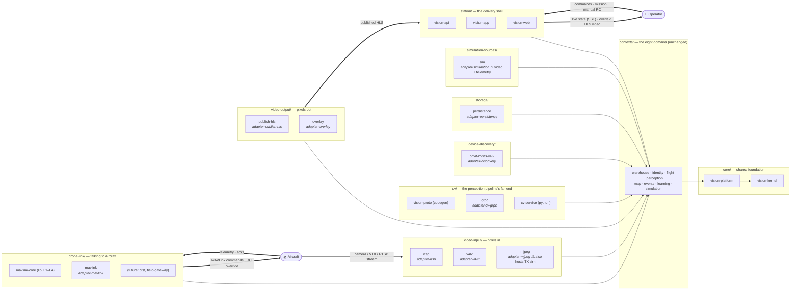

# MODULE-LAYOUT — responsibility-grouped module tree (proposal, not yet executed)

**Status:** APPROVED 2026-08-15 — executing on branch `chore/module-layout`. The W4 gate is
lifted: MAVLINK-CORE merged to master (`7e80746`), root `pom.xml` is free.
**Date:** 2026-08-15.
**Driver:** navigation. Today all driven adapters sit flat under `adapters/`, so finding "everything
that touches video input" means knowing the protocol names. The tree should answer *what is this
for* before *how does it do it*.

## 1. Naming rules

1. **Top-level folders are responsibilities, not patterns.** No folder is named `adapters/`,
   `libs/`, or `domain/` — the word "adapter" says how a module is built, not what it is for.
2. **Folder path carries the group; module folder carries the specifics.** `video-input/rtsp`,
   not `video-input/adapter-video-input-rtsp`.
3. **Maven artifactIds do NOT change in this move.** `adapter-rtsp` stays `adapter-rtsp` in every
   pom, ArchUnit rule, CI script, and MODULE.md. Folder moves are a `<modules>`-path edit only.
   Renaming artifactIds is an optional Phase 2 with real cost (root pom, every dependent pom,
   ArchUnit, docker-compose, docs) — decide it separately.
4. **Grouping is physical navigation only.** The dependency law is unchanged and stays enforced by
   ArchUnit on *packages*: kernel ← platform ← contexts ← adapters ← app; adapters never depend on
   each other; Spring never in a context module. Two modules sharing a folder gain no new right to
   call each other.
5. **`contexts/` already follows the rule** (folders named by domain) — it stays as is.

## 2. Target tree

Two loops close through this tree: the **human loop** — operator → station → contexts →
drone-link → aircraft, with state and video coming back to the operator's screen — and the
**machine loop** — aircraft camera → video-input → cv → video-output, re-entering the human loop
as overlaid video. Every group exists to carry a leg of one of these loops.



Thin arrows are compile-time dependencies (unchanged by this proposal); **bold arrows are the two
runtime loops** the platform exists for. Note what the loop arrows make visible: `drone-link/` and
`video-input/` are the only groups touching the aircraft, `station/` is the only group touching the
human, and everything between them meets in `contexts/`.

Flat view of the resulting repo root:

```
core/                 vision-kernel, vision-platform
contexts/             (unchanged — 8 domain modules)
video-input/          rtsp, v4l2, mjpeg
video-output/         publish-hls, overlay
drone-link/           mavlink-core, mavlink            ← future: crsf, field-gateway
cv/                   vision-proto, grpc, cv-service
device-discovery/     onvif-mdns-v4l2
storage/              persistence
simulation-sources/   sim
station/              vision-api, vision-app, vision-web
```

## 3. Group table — what each folder answers

| Group | Question it answers | Members (artifactId unchanged) | Serves context |
|---|---|---|---|
| `core/` | what does everyone share | vision-kernel, vision-platform | all |
| `contexts/` | what does the business do | 8 context modules | — |
| `video-input/` | how do pixels get in | adapter-rtsp, adapter-v4l2, adapter-mjpeg | perception |
| `video-output/` | how do pixels get out | adapter-publish-hls, adapter-overlay | perception |
| `drone-link/` | how do we talk to aircraft — commands out, telemetry/acks/RC in; one module per radio protocol, never per data type | mavlink-core, adapter-mavlink | flight |
| `cv/` | how do frames become detections | vision-proto, adapter-cv-grpc, cv-service | perception, learning |
| `device-discovery/` | how do devices get found | adapter-discovery | warehouse |
| `storage/` | how does state survive restart | adapter-persistence | all |
| `simulation-sources/` | how do we fake the world | adapter-simulation | perception, flight |
| `station/` | how does an operator reach it | vision-api, vision-app, vision-web | all |

## 4. The three modules that don't slice cleanly

| Module | Problem | Proposal |
|---|---|---|
| `adapter-simulation` | emits **both** synthetic video and synthetic telemetry — belongs to video-input and drone-link at once | keep whole in `simulation-sources/` now; splitting into `video-input/sim` + `drone-link/sim` is a real module split (code + poms), out of scope for a folder move |
| `adapter-mjpeg` | hosts MJPEG **RX ingest** and the **TX simulator** in one module | goes to `video-input/` (ingest is its primary job); the TX sim is a known wart, noted for a later split |
| `vision-proto` | shared gRPC codegen, not an adapter | lives in `cv/` — its only consumer chain is cv-grpc ↔ cv-service; if a second proto family ever appears, revisit |

Note: `adapter-geo-grpc` and `adapter-tiles` exist only on the unmerged `feat/visual-geo`
branch (their folders here are ignored build residue). When that branch lands it must rebase onto
this layout — geo-grpc belongs in `cv/`, tiles in `station/` or `video-output/`; decide at merge.

`drone-link/` is also the designated home for everything in the FLEET-MIGRATION backlog that speaks
radio: `adapter-crsf`, the field-gateway role assembly, mLRS tooling. That's the strongest argument
for this group existing — it will grow.

## 5. Migration mechanics (when approved + unblocked)

Ordered so the build is green after every step; the whole move is one branch (`chore/module-layout`).

1. **Wait for MAVLINK-CORE W4 merge** — root `pom.xml` and `adapters/adapter-mavlink/**` are the
   running agent's until then. This is the only hard gate.
2. `git mv` the module folders into the new groups (history survives; `git log --follow` works).
3. Edit `<modules>` paths in the root pom; fix `<relativePath>` in moved child poms if present.
4. Scripted sweep of path references — CLAUDE.md module index, MODULE.md cross-links,
   docker-compose build contexts, any CI path filters. (Same rule as docs moves: scripted, not
   hand-edited.)
5. `./mvnw -B verify` once, full reactor — a pure-move change is the one case a reactor-wide build
   is the honest acceptance test.
6. ArchUnit needs **no change** (rules key on packages), unless a rule matches on the physical
   `adapters/..` path — verify in step 4.

**Not in scope:** artifactId renames, package renames, splitting adapter-simulation/adapter-mjpeg,
touching context internals. Each of those is its own decision with its own cost.

## 6. Cost & risk

| Item | Cost |
|---|---|
| Folder move + pom paths | ~1 h, mechanical |
| Docs/compose path sweep | ~1 h, scripted |
| Risk: stale IDE/module caches | reimport; zero code risk |
| Risk: forgotten path reference | full-reactor verify + grep for `adapters/` catches it |
| Phase 2 (optional) artifactId renames, e.g. `adapter-rtsp` → `video-input-rtsp` | separate branch; touches every dependent pom + ArchUnit + compose; do only if the mixed naming (old ids in new folders) proves annoying in practice |
