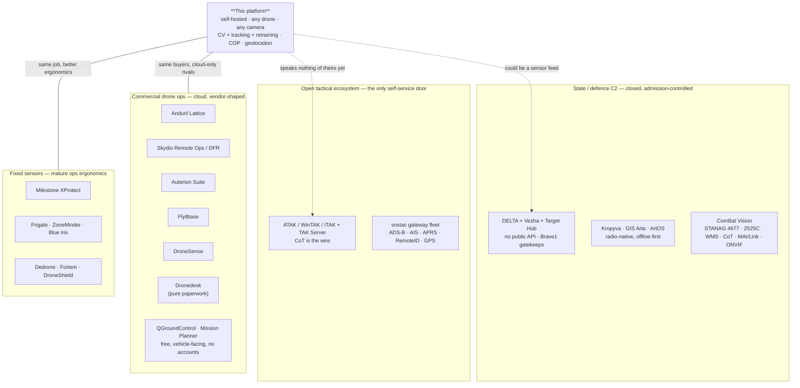
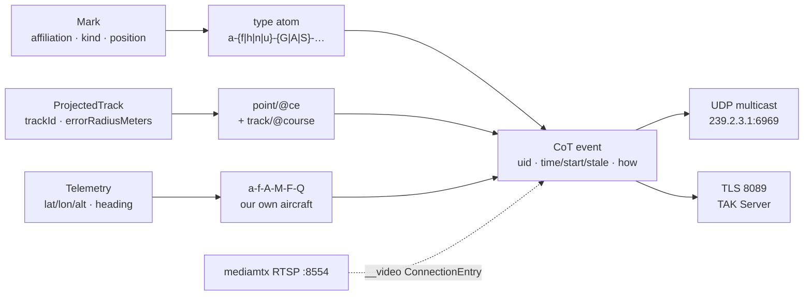

# PLATFORM-AUDIT-ANALOGS — lane D: what the field ships that we do not

**Status:** research report, 2026-08-21 · lane D of `PLATFORM-AUDIT-CONTEXT.md` · **read-only, no product code changed.**
**Answers:** the owner's question *"check the analogs on the internet and say how to make the application more useful."*
**Companions:** `docs/conclusions/MOAT.md` (why we are different), `docs/conclusions/ANY-DRONE-PLAN.md` (the funnel),
`docs/main/MASTER-MATRIX.md` (the row-level backlog). This document deliberately does **not** repeat MASTER-MATRIX.
Its unique contribution is the four lanes that matrix never surveyed: **interoperability formats**, **the VMS event/retention/evidence model**,
**counter-UAS track presentation**, and **the Ukrainian C2 integration surface**.

---

## 0. Method, and how much to trust each claim

Six parallel research passes, primary sources preferred (vendor developer docs, official repos, standards bodies, government announcements).
Every external claim below carries a URL in §7.

**Confidence markers used throughout:** unmarked = primary source · *marketing* = vendor prose with no verifiable mechanism ·
**UNVERIFIED** = could not be confirmed and is therefore not asserted.

Three honest limits on this report:

| Limit | Consequence |
|---|---|
| The session's web-search budget (200 calls) was exhausted mid-sweep | Late gaps were probed by direct HTTP/DNS instead. Aaronia, Genetec Security Center, AgentDVR and Shinobi went uncovered |
| `tak.gov` blocks automated access entirely (HTTP 421, US-IP-only) | Every TAK fact here reached us via GitHub, app stores or secondary docs — not from the authoritative site |
| Dedrone, Fortem and DroneShield publish **no** operator manual, data dictionary or API reference | Their UI claims are from release-note blog posts and trade press. That opacity is itself a finding: nobody's C-UAS UI is copyable and nobody's integration surface is verifiable from outside |
| Whether Parrot, Auterion, ModalAI or Sentera ship an ATAK plugin was never resolved | Treat as **open**, not as a "no". It changes only how crowded the CoT lane looks, not whether move 6 is worth doing |

**Three naming corrections to the brief this audit was given**, so they do not propagate:
**Nettle *is* Kropyva** (English calque of «Кропива», not a separate vendor) ·
**ComBat Vision is not Ukrspecsystems** ·
**"Mantis" and "Sich" are not Ukrainian C2 software** (a Rheinmetall gun system and an EO satellite line respectively).

---

## 1. The field, mapped

The products people compare us to sit in four lanes that barely talk to each other. Our platform is the only thing
in the diagram standing in the middle — which is both the opportunity and the reason we look incomplete from every side.

**The single most useful structural fact found in the whole sweep:** the open-source CoT gateway fleet
(`pytak`, `adsbcot`, `aiscot`, `aprscot`, `dronecot` — Apache-2.0, all pushed August 2026) has a production gateway for
ADS-B, AIS, APRS, Remote ID, GPS and even Tesla. **It has none for video detections.** A scan of 131 `atak-plugin`
repositories found no plugin that turns video detections into CoT; the nearest is a 5-star multi-stream viewer with no
detection at all. Meanwhile five separate people independently rebuilt "camera → YOLO → geolocate → CoT" from scratch
during 2026 with zero code reuse between them. That is a vacant slot with demonstrated demand, and it is the slot our
codebase already fills internally.

---

## 2. Capability matrix

Rows were built from **what the analogs ship**, not from what we happen to have — which is why so many rows are empty on our side.

**Legend** · `●` ships it · `◐` partial / one narrow case · `○` absent · `—` not applicable to that product · `?` unverified

### 2A — Command, coordination and interoperability

| Operator capability | **Us** | DELTA/Vezha | ATAK+TAK Srv | Lattice | Skydio | DroneSense | FlytBase | Auterion | QGC/MP |
|---|:--:|:--:|:--:|:--:|:--:|:--:|:--:|:--:|:--:|
| Shared map, layers, per-layer visibility grants | ● | ● | ● | ● | ◐ | ● | ◐ | ○ | ○ |
| **Target/task as an object with a lifecycle** (create→assign→who is already working it) | ○ | ● | ◐ | ● | ◐ | ◐ | ○ | ○ | ○ |
| **Co-watch one live feed, many analysts, joint annotation** | ○ | ● | ◐ | ? | ◐ | ● | ◐ | ○ | ○ |
| **Push-to-talk voice inside the video pane** | ○ | ● | ● | ? | ○ | ● | ○ | ○ | ○ |
| **Share a live view with someone who has no account** | ○ | ◐ | ○ | ○ | ● | ● | ● | ○ | ○ |
| **Operator control claim / explicit handoff** | ○ | ● | — | ● | ● | ● | ● | ○ | ○ |
| Many vehicles, one operator, deconfliction | ○ | ● | ◐ | ● | ● | ● | ● | ◐ | ○ |
| **Invite another unit/agency into the picture** | ○ | ● | ● | ● | ◐ | ● | ◐ | ○ | ○ |
| Blue-force position reports with a **rate policy** (PTT / timed / on-move) | ○ | ● | ● | ● | ○ | ◐ | ○ | ○ | ○ |
| Mission library, author once, reuse org-wide | ○ | ● | ● | ? | ● | ○ | ● | ● | ◐ |
| **Scheduled / recurring missions** | ○ | ◐ | — | ? | ● | ○ | ● | ○ | ○ |
| Mission upload to aircraft (waypoint/fence/rally) | ○ | ● | ○ | — | ● | ● | ● | ● | ● |
| Full FC parameter editor | ○ | ○ | ○ | — | ○ | ○ | ○ | ◐ | ● |
| Flight-log download + automatic analysis | ○ | ? | ○ | — | ● | ● | ● | ● | ● |
| Fleet registry with durable per-tail identity | ● | ● | ○ | ● | ● | ● | ● | ● | ○ |
| Battery / component hours + cycles | ○ | ? | ○ | — | ● | ● | ◐ | ● | ○ |
| Maintenance schedule + due-by-hours alerts | ○ | ? | ○ | — | ● | ● | ◐ | ● | ○ |
| Pilot certification / currency records | ○ | ● | ○ | — | ● | ● | ○ | ● | ○ |
| Recorded pre-flight checklist attached to the flight | ◐ | ● | ○ | — | ● | ● | ● | ● | ○ |
| Airspace / NOTAM / weather bound to the plan | ◐ | ● | ◐ | — | ● | ● | ● | ◐ | ◐ |
| **Compliance export** (RAMS/job pack PDF, NOTAM filing, SORA/OSO evidence) | ○ | ◐ | ○ | — | ◐ | ● | ○ | ● | ○ |
| After-action evidence package | ● | ● | ◐ | ? | ● | ● | ◐ | ● | ◐ |
| **Documented public REST API + webhooks + tokens** | ○ | ○ | ● | ● | ● | ◐ | ◐ | ● | ○ |
| **CoT / TAK interop** | ○ | ◐ | ● | ○ | ○ | ◐ | ○ | ○ | ○ |
| KML/KMZ exchange | ○ | ● | ● | ? | ◐ | ● | ● | ● | ● |
| **Offline / air-gapped operation** | ◐ | ◐ | ● | ● | ○ | ○ | ○ | ◐ | ● |
| Self-hosted / on-prem | ● | ○ | ● | ● | ○ | ○ | ○ | ○ | ● |
| **Detection → geolocated track on the shared map** | ● | ● | ◐ | ● | ◐ | ○ | ○ | ○ | ○ |
| **Operator-in-the-loop model retraining** | ● | ◐ | ○ | ? | ○ | ○ | ○ | ○ | ○ |
| Remote ID reception + display | ○ | ● | ● | ● | ◐ | ○ | ○ | ○ | ◐ |
| ADS-B / traffic overlay | ○ | ● | ● | ● | ◐ | ● | ● | ○ | ● |
| MIL-STD-2525 / APP-6 symbology | ○ | ● | ● | ● | ○ | ● | ○ | ○ | ○ |

*Our `◐` on offline: the SPA has an opportunistic IndexedDB tile cache, but every basemap URL is a live internet host
(OSM, Carto, Esri). An air-gapped deployment renders a grey grid. Our `◐` on pre-flight checklist: a working checklist
component exists in the Fly cockpit but is not captured into the flight record. Our `◐` on airspace: a weather go/no-go chip only.*

### 2B — Sensor, video, evidence and alerting ergonomics

| Operator capability | **Us** | Milestone | Frigate | ZoneMinder | Blue Iris | Dedrone | Fortem | DroneShield |
|---|:--:|:--:|:--:|:--:|:--:|:--:|:--:|:--:|
| **Composable rule engine** (event → condition → ordered actions) | ○ | ● | ◐ | ● | ◐ | ◐ | ● | ○ |
| **Mandatory stop-actions** for any effect with a duration | ○ | ● | ○ | ○ | ◐ | ○ | ○ | ○ |
| Named, reusable **time profiles** (incl. sunrise/sunset by lat/lon) | ○ | ● | ○ | ◐ | ◐ | ◐ | ? | ? |
| Zones with **dwell / inertia / required-zone** semantics | ◐ | ● | ● | ● | ◐ | ◐ | ● | ? |
| **Two-tier confidence** (discard threshold vs promotion threshold over score history) | ◐ | ○ | ● | ● | ● | ? | ? | ? |
| **Alarm as a stateful, assignable case** (owner, status, priority, result code, work instructions) | ○ | ● | ○ | ○ | ○ | ◐ | ◐ | ○ |
| Acknowledge / triage state on an alert | ○ | ● | ● | ● | ● | ● | ● | ● |
| Alert **consolidation** into groups/incidents | ○ | ● | ● | ○ | ○ | ● | ○ | ○ |
| **Per-device, per-class retention** with a stated conflict rule | ○ | ● | ● | ● | ● | ? | ? | ◐ |
| **Multi-stage archiving / grooming** to cheaper storage | ○ | ● | ○ | ● | ● | ○ | ○ | ◐ |
| **Retention shortfall as an event** + days-remaining projection | ○ | ● | ◐ | ● | ◐ | ○ | ○ | ○ |
| **Evidence lock** — retention override scoped to an interval | ○ | ● | ○ | ◐ | ○ | ○ | ○ | ○ |
| **Tamper-evident signed export** | ○ | ● | ○ | ○ | ○ | ○ | ○ | ○ |
| **Storyboard export** — many intervals, many cameras, one artifact | ○ | ● | ○ | ○ | ○ | ○ | ○ | ○ |
| Synchronized multi-camera timeline + per-tile independent playback | ◐ | ● | ● | ◐ | ● | ● | ● | ? |
| Timeline bands that encode **why** a segment exists | ○ | ● | ● | ◐ | ● | ? | ? | ? |
| **Region-of-interest retrospective search** (unmask an area, set sensitivity) | ○ | ● | ◐ | ○ | ● | ○ | ○ | ○ |
| Bookmarks as searchable objects, creatable **by a rule** | ○ | ● | ○ | ○ | ● | ○ | ○ | ○ |
| Saved views, carousels, hotspot tiles, view groups per role | ◐ | ● | ◐ | ◐ | ● | ? | ? | ? |
| Map with per-camera **FOV cones** + zoom clustering | ◐ | ● | ○ | ○ | ○ | ● | ● | ● |
| Health dashboard whose thresholds **feed the rule engine** | ◐ | ● | ○ | ◐ | ◐ | ○ | ○ | ◐ |
| **Slew-to-cue** — a detection drives a PTZ camera | ○ | ● | ◐ | ○ | ● | ● | ● | ● |
| **Track provenance** — which sensors contributed to this track | ○ | ○ | — | — | — | ● | ◐ | ◐ |
| Multi-sensor fusion into one deduped track | ○ | ◐ | ○ | ○ | ○ | ● | ● | ● |
| Notification channels (email / SMS / webhook / MQTT / SNMP) | **○** | ● | ● | ● | ● | ● | ● | ● |
| In-product labeling that retrains the model | ● | ○ | ● | ○ | ○ | ○ | ○ | ● |

*Our `◐` on saved views: the Wall has a density control and an events rail, no saved/typed tiles. Our `◐` on two-tier
confidence: the CV pipeline has `labelFilter`/`labelDenyFilter` and a confidence threshold, but no promotion-over-history rule.*

### The biggest gaps, stated as one list

1. **No notification channel exists at all** — no webhook, no MQTT, no email, no SNMP. Every single analog in 2B has at least two. This is the only row in the matrix where we are alone at `○`.
2. **No rule engine and no acknowledge.** The alerts page's own code comment admits it: *"Saved threshold rules + acknowledge are still not built."*
3. **Retention is one global 1-hour knob** (`MTX_PATHDEFAULTS_RECORDDELETEAFTER=1h`, applied to every path). Mature VMS express retention per device and per event class, and raise an event when storage is about to eat evidence.
4. **The evidence package is neither hashed nor signed, and cannot be locked.** `AFTER-ACTION-PLAN.md` §7 names this as deliberately deferred. Milestone treats a signed, verifiable export as the point of the product.
5. **No account-free share link.** Skydio, DroneSense and FlytBase all ship one; DroneSense's *redacts* telemetry and pilot identity. For a command point this is the difference between "I can show the commander" and "the commander needs an account."
6. **No control claim / handoff** — two pilots can command the same aircraft concurrently today. `CREW-CONTROL-PLAN.md` has a frozen design and nothing is built.
7. **No interoperability format whatsoever.** We speak GeoJSON in exactly one export file and nothing else — no CoT, no KML, no MIL-STD-2525, no MQTT. Every serious peer speaks at least one.
8. **Air-gapped is a claim the basemap contradicts.** All three basemap layers are live internet hosts.
9. **No target/task lifecycle.** DELTA's Target Hub exists specifically so two units do not engage the same target twice; we have marks, which are annotations, not work items.
10. **No published API contract.** `ARCHITECTURE.md` §2 references `station/vision-api/openapi.yaml`; that file does not exist, and there is no springdoc dependency. 122 endpoints, zero machine-readable description, and no API tokens for a machine client.
11. **No ONVIF media pull.** We discover ONVIF cameras and then make the user type the RTSP URL by hand — the scanner's own javadoc says `GetStreamUri` is deliberately not called.
12. **No fleet-ops records** — battery cycles, component hours, maintenance due, pilot currency. Five to eight of eight commercial products ship all four; this is the cheap, boring half of the gap list.

---

## 3. The top 12 moves, ranked by value ÷ effort

Effort uses this repo's own scale from `MASTER-MATRIX.md` §0: **S ≤ 16 h · M ≤ 80 h · L ≤ 240 h**.
"Moat" refers to `MOAT.md` §1: **① vision-derived geolocation · ② CV that compounds · ③ one verified picture from
heterogeneous sensors · ④ any drone, no lock-in, offline**.

Every module named below is from the `CLAUDE.md` module index.

| # | Move | Operator pain removed | Which analog proves demand | Effort | Owner module | Moat |
|---|---|---|---|:--:|---|:--:|
| 1 | **Webhook + MQTT v5 event egress** | "The platform saw it and told nobody." Today an event reaches a browser tab or nothing | Frigate's *entire* integration story is MQTT topics; every VMS and every C-UAS ships email+webhook; ONVIF Profile M specifies MQTT event delivery | **S** | new `interop/webhook`, `interop/mqtt` adapters + `station/vision-app` wiring | ③ |
| 2 | **KML/KMZ + GeoJSON + GPX in and out** for marks, drawings, layers, tracks | "Can I open this in Google Earth / hand it to the artillery guys?" — today: no | Kropyva's only public exchange format is KML; QGC/MP, UgCS, FlytBase, DroneSense all read/write it; GeoJSON is the web-GIS lingua franca | **S** | `contexts/vision-map` + `station/vision-api` | ③④ |
| 3 | **Hash, sign and lock the evidence package** | "How do I prove this file wasn't edited?" — an unsigned zip is not evidence | Milestone's XProtect export carries a digital signature verified by a bundled player, and Evidence Lock is a retention override an operator sets | **S** | `station/vision-api` (afteraction) + `contexts/vision-events` | ③ + the honest-instruments culture |
| 4 | **Publish an OpenAPI contract + machine API tokens** | An integrator cannot call us without reading Java | Skydio publishes a best-in-class reference; Auterion meters one; FlytBase gates theirs; DroneSense *sells* API access; Dronedesk has none — publishing one is a differentiator, not just parity | **S** | `station/vision-api` (springdoc) + `contexts/vision-identity` (tokens) | ④ |
| 5 | **Serve our own basemap tiles (PMTiles/MBTiles)** | An air-gapped field server renders a grey grid | ATAK data packages, Kropyva's pre-loaded rasters, NGA's Releasable Basemap Tiles work, OGC GeoPackage — every offline-first tactical tool solves this | **S–M** | new `map-tiles` adapter (or extend `cv/tiles`) + `station/vision-web` leaflet loader | ④ |
| 6 | **Speak CoT — egress first — with MIL-STD-2525/APP-6 affiliation frames designed jointly** | "Our marks live in a system nobody else can see" | The TAK gateway fleet has ADS-B, AIS, APRS and Remote-ID gateways and **no video-detection gateway**; five people rebuilt this chain solo in 2026; DroneShield ships an ATAK plugin; ComBat Vision wins Ukrainian deals precisely by rendering other people's pictures | **M** | new `interop/cot` adapter + `contexts/vision-map` (type mapping) + `station/vision-web` (symbols) | ③④ |
| 7 | **ONVIF Profile S: `GetProfiles`/`GetStreamUri` + PTZ control** | Discovery finds a camera, then the user hand-types an RTSP URL and guesses credentials | Every VMS on earth; it is also the precondition for move 12 | **M** | `device-discovery/onvif-mdns-v4l2` | ④ |
| 8 | **Alert rules + acknowledge** — label × zone × dwell × confidence → action, with an ack state | Alert fatigue. Today every detection is equal and nothing can be dismissed | Milestone's rule engine with mandatory stop-actions; Frigate's `required_zones`/`loitering_time`/`inertia` and its alerts-vs-detections severity split; ZoneMinder's six zone types; Fortem's enter/leave/approach triggers | **M** (v1) / **L** (with "would have fired 47×" backtest) | new rules service in `contexts/vision-perception`, zones from `contexts/vision-flight`, UI in `vision-web/features/alerts` | ②③ |
| 9 | **Retention policy per asset and per event class + disk budget + shortfall event** | "How long is my footage kept?" — currently one hour, globally, and nobody is told | Frigate's `record.alerts.retain` vs `record.continuous` with "largest matching value wins"; Milestone's per-device storage definitions, hourly archiving, and *event on premature deletion due to insufficient storage* | **M** | `video-output/publish-hls` (mediamtx control API is already wired on :9997) + `contexts/vision-events` | ③ |
| 10 | **Account-free, expiring, redacting share link** | "Show the commander" currently means "create the commander an account" | Skydio **ReadyLink** (one tap), DroneSense **Magic Video Link** (strips map telemetry, pilot identity and other drones — the cleanest privacy-aware share primitive found anywhere), FlytBase Guest Sharing | **M** | `station/vision-api` + `contexts/vision-identity` (scoped token) + `video-output/publish-hls` | ③ |
| 11 | **Control claim + crew handoff** — build `CREW-CONTROL-PLAN.md` | Two assigned pilots can command the same aircraft at once; `?watch=1` is a URL costume, not a posture | Skydio hand-control-between-operators, FlytBase "Take Control", DroneSense multi-pilot, DELTA's authenticated broadcaster identity; 4/8 in our own earlier survey | **M** (design already frozen) | `contexts/vision-identity` + `contexts/vision-flight` + `station/vision-api` | ③ |
| 12 | **Slew-to-cue — a tracked object drives a PTZ camera** | An operator manually chases a moving object with a joystick | Fortem's headline feature; Dedrone ships PTZ target-locking and autotuning; Blue Iris and Milestone both do it. Ours would be **geolocation-driven, not pixel-driven** — which nobody else in the fixed-camera world can do | **M** (after #7) | `device-discovery/onvif-mdns-v4l2` (PTZ port) + `contexts/vision-map` (`ProjectedTrack`) | ①③ |

### Why this order

Moves 1–5 are all **S** and together cost roughly one working week. They convert the platform from "a closed system with
a nice UI" into "a system other systems can use", and four of the twelve biggest gaps close in that week.
Move 6 is the strategic one and should be scheduled the moment the `feat/track-identity` work lands, because it has a
hard prerequisite (below). Moves 8–9 are where a mature VMS beats us today and are the rows an evaluator will notice first.

### The CoT verdict, in detail

**Yes — emitting CoT is the cheapest genuine interoperability win available to this codebase, and by a wide margin.**
Five reasons, all specific to this repo:

1. **The domain model already is CoT.** `Affiliation { FRIENDLY, HOSTILE, NEUTRAL, UNKNOWN }` is 1:1 with CoT's
   affiliation letters `f / h / n / u`. `MarkKind { UNIT, EQUIPMENT, HAZARD, POI }` maps onto type atoms.
   `ProjectedTrack.errorRadiusMeters` maps straight onto `point/@ce` — most implementations have to invent that value.
   `GeoPosition` is `@lat/@lon/@hae`. `Telemetry.headingDegrees` is `<track course>`.
2. **Four out-ports already exist, and one of them is already a decorator chain.** `EventPublisherPort`
   (`core/vision-platform`) is documented as *"the platform's integration seam"* and `vision-app` already composes
   three decorators over it; alongside it sit `MapLiveUpdatePort` (vision-map), `TelemetryLiveUpdatePort`
   (vision-flight) and `DetectionLiveUpdatePort` (vision-perception) — all verified present. A CoT emitter is a
   **second implementation** of ports that already exist, in a new driven adapter, with **no domain change at all**.
   That is the same shape as moves 1 and 2, which is why these three should be built by one agent in one wave.
3. **The video half is nearly free.** ATAK plays a feed given a URL; our mediamtx already serves RTSP on 8554 and
   LL-HLS. A `__video` detail on the aircraft's own CoT event is a URL string, not a pipeline.
4. **XML first, protobuf never (initially).** TAK Protocol v1 protobuf is client-elected and negotiated; XML remains
   universally accepted. Skip it until someone measures a bandwidth problem.
5. **It is the only self-service door in the entire defence lane.** DELTA has no public API (§4). Kropyva has no public
   API. GIS Arta has no public API. Lattice's SDK is a revocable, export-controlled, no-derivative-works licence.
   CoT is the one wire format a small self-hosted product can simply *speak*.

**Scope of a minimal but genuinely useful CoT integration:** our own assets as `a-f-A-*` events with `<track>` course/speed
and a `__video` alias · marks as their affiliation-correct atoms with `<contact callsign>` and `<remarks>` ·
geolocated tracks as machine-derived events with honest `ce` from `errorRadiusMeters` · correct
`how` codes (`m-g` GPS-derived, `m-f` fused, `m-p` predicted for a coasting track) · UDP multicast for mesh, TLS for a server.

**The named traps, in order of how badly they bite:**

| Trap | Why it bites |
|---|---|
| **`uid` instability** | A track id that flaps mints a new ghost marker on *every* operator's map. This is exactly what `feat/track-identity` L1–L4 just fixed (110 label flips → 7). **CoT egress must not ship before that branch merges and passes a live smoke test.** |
| **Stale-time dishonesty** | `time` is generation; `start`/`stale` bound validity. Emitting `stale = time` or `stale = +10 years` is the tell of a fake implementation. Rule of thumb: `stale = time + 2–5×` the update period |
| **Type-atom correctness** | `a-f-G-U-C` is not decoration; it drives which 2525 symbol appears on someone else's screen. Get the affiliation letter wrong and you have painted a friendly as hostile |
| **Plain TCP will not reach a stock server** | A default TAK Server ships **8089 TLS only** — 8087/8088 are commented out in `CoreConfig.example.xml`. Plain-XML-over-TCP is a local-dev path against `taky`/FreeTAKServer, not a production one |
| **Certificate enrolment** | TLS to a real TAK Server means client certs and an enrolment flow — this is why ingest and TLS belong in a *later* wave than egress |
| **Stale flooding** | Re-emitting every mark every second is how you get thrown off a federated server. Emit on change plus a slow keepalive inside the stale window |
| **Licensing** | ATAK-CIV is **dual public-domain / GPL-3.0** — relevant if anyone ever proposes writing a plugin. Emitting CoT from our own process carries no such obligation |

---

## 4. Three things NOT to build

### Trap 1 — Mission execution (waypoint upload and autonomous flight)

`docs/plans/active/MISSIONS-PLAN.md` is 464 lines of excellent, frozen design for uploading missions to an aircraft
(waves M1–M8, a new `MissionService`, a synthetic bidirectional MAVLink vehicle, a SITL gate). It directly contradicts
`MOAT.md` §6 ("stop considering mission/waypoint planning") and `MASTER-MATRIX.md` rows B9/M3, both of which mark it **NO**.

**Why it is a trap for us specifically:** 8/8 commercial products have it, QGroundControl and Mission Planner do it
better *and free* — QGC ships survey/corridor/structure-scan patterns, terrain altitude frames, geofence polygons, rally
points and mission stats, released 2026-08-20 and maintained by the ecosystem. UgCS charges $790/yr for the survey-grade
version. You would spend a multi-cycle XL effort to arrive at parity with a free tool, in a safety-critical code path,
defending nothing.

**Build instead, at a fraction of the cost:** (a) **mission *tasking*** — objective, AOI, assignment, time window,
evidence, after-action (MASTER-MATRIX M1, ~80 h) which is the ISR lifecycle nobody free provides; (b) **`.plan` and
`.waypoints` import/export** so an operator plans in QGC and we *see* the plan — roughly a week, and it makes us the
layer above the GCS rather than a worse one.

### Trap 2 — Emitting MISB ST 0601 KLV / STANAG 4609 metadata in video

This is the item people fake, and the sweep found a hard blocker before any of the standards work would even matter:
**our egress cannot carry it.** mediamtx's KLV pull request was closed unmerged in October 2024 for incomplete
RTP/KLV fragmentation and missing-PTS handling; a 2026 issue confirms that KLV published over SRT survives an SRT read
but **is silently dropped on RTSP read**; another open issue shows the RTSP path misspells the SDP encoding name as
`smtpe336m` and collides the KLV track on payload type 96. FFmpeg's own muxer writes KLV packets at the start rather
than interleaved, because they carry NOPTS — so FFmpeg alone will not produce standards-clean synchronous ST 0604 KLV either.

So the true cost is not "a month of KLV work"; it is **a month of KLV work plus re-architecting video egress**, for a
capability whose verified consumers are QGIS FMV, ArcGIS Image Analyst and the Fraunhofer validator (ATAK, VLC and
Milestone rendering it are all **UNVERIFIED**). And the revision number is not publicly confirmable — the MISB registry
is CAPTCHA-walled; implementers cite ST 0601.8, .15 and .17 inconsistently. Claiming a revision you have not read is how
a defence buyer catches you.

**Consume KLV if a customer brings FMV** (jmisb, MIT, is genuinely good and even implements MISB ST 0805.1 KLV→CoT).
**Never promise emission.**

### Trap 3 — Becoming a VMS (ONVIF Profile M device, or chasing Milestone feature-for-feature)

Being an ONVIF **client** (move 7) is a week and unlocks every IP camera. Being an ONVIF **Profile M device** — so a VMS
can consume our analytics — means implementing device management, media2, analytics, events and a metadata RTP track,
and formal conformance needs ONVIF membership plus the Client/Device Test Tool. Specialist work, a month minimum.

More importantly, the whole *direction* is a trap. §2B is a long list of things Milestone does better after twenty
years — synchronized timelines, storyboard export, region-of-interest search, multi-stage grooming. Copying that list
is a race we lose while abandoning the four rows in §2A where we are alone: geolocated detection tracks, operator-in-the-loop
retraining, self-hosting, and any-drone ingest. Take the *primitives* from VMS (moves 8, 9, 3) because they are cheap and
they close honesty gaps. Do not take the *scope*.

**Two smaller traps, named for completeness:** **drone-in-a-box / docking** (FlytBase and Skydio's home turf, €1000+ of
hardware, wrong persona) and **cloud multi-site sync** (5/8 competitors have it and it flatly contradicts offline-first
until someone reconciles the two).

---

## 5. Standards and formats checklist

"Do we speak it" is grep-verified against the tree on 2026-08-21. Effort uses the same S/M/L scale.

| Format | Do we speak it? | Does it matter? | Effort to add | Verdict |
|---|---|---|:--:|---|
| **Cursor-on-Target (XML)** | **No** — zero occurrences | **Yes, most of all.** The one self-service door into the defence lane | M | **Build (move 6).** Generate JAXB from the public XSD; no canonical Java library exists |
| TAK Protocol v1 (protobuf) | No | Only at scale; client-elected and negotiable | S after CoT | Defer |
| **KML / KMZ** | **No** | Yes — Kropyva's only public exchange format, and "open it in Google Earth" is a universal ask | S | **Build (move 2).** Watch `altitudeMode` (absolute = MSL/EGM96, not our ellipsoid/AGL — the same class of bug as the geo-pose fix) and lon,lat ordering |
| **GeoJSON (RFC 7946)** | **Export only, one file** — `marks.geojson` in the after-action zip, hand-written to RFC 7946 | Yes — the web-map lingua franca | S | **Extend (move 2)**: import too, and for layers/drawings/tracks, with simplestyle keys |
| GPX 1.1 | No | Mildly — consumer GPS tooling | S | Cheap, do it with move 2 |
| **PMTiles / MBTiles / GeoPackage** | **No** — browser IndexedDB cache only; all three basemaps are internet hosts | **Yes.** Our offline claim currently fails on the map | S–M | **Build (move 5).** PMTiles over range requests is the fewest moving parts |
| **MISB ST 0601 KLV / STANAG 4609** | No | Only in a defence-ISR lane, and our egress cannot carry it | L / specialist | **Consume, never emit** — see Trap 2 |
| **ONVIF WS-Discovery** | **Yes** — hand-rolled UDP probe to 239.255.255.250:3702 | Yes | — | Have it |
| **ONVIF Profile S media + PTZ** | **No** — `GetStreamUri` deliberately not called ("needs device credentials the discovery flow lacks") | Yes — it is the difference between finding a camera and using one | M | **Build (move 7)** |
| ONVIF Profile M (as a device) | No | Door-opener to VMS buyers, big cost | L | **Skip** — see Trap 3 |
| **MAVLink telemetry** | **Yes** — `drone-link/mavlink` + `mavlink-core`, 15+ message types, ArduPilot extras, RC override, `COMMAND_ACK` | Yes | — | Have it |
| **MAVLink mission / fence / rally** | **No** — no `MISSION_ITEM_INT` anywhere | Yes, but as **import/export**, not execution | M | **Import/export only** — see Trap 1 |
| **QGC `.plan` / MP `.waypoints`** | No | Yes — an operator plans in QGC and wants us to see it | S | **Build.** Preserve `MAV_FRAME` exactly; silent frame conversion is *the* mission-import bug |
| **RTSP** | **Yes** (ingest + mediamtx serve on 8554) | Yes | — | Have it |
| **SRT** | **Yes, ingest** — `srt://` caller/listener in `video-input/rtsp` | Yes — the right protocol for a lossy field link, and the only mediamtx path that preserves KLV | S (egress) | Have the half that matters |
| **WebRTC / WHEP** | **Yes** — `whepUrl()`, signalling :18889, ICE :8189, browser player | Yes (WHIP is now RFC 9725; WHEP still a draft) | — | Have it |
| **HLS / LL-HLS** | **Yes** — 1 s segments, 200 ms parts | Yes, as fallback and replay | — | Have it |
| RTMP | No (mediamtx could) | Only for legacy encoders — **and note Ochi issued RTMP/SRT links for OBS**, so it is the Ukrainian field-crew default | S | Enable if asked |
| **MQTT v5** | **No** — named in three javadoc comments as a future swap, implemented nowhere | **Yes.** C-UAS alerting, VMS integration, ONVIF Profile M events, Frigate's whole integration surface | S | **Build (move 1)** |
| Sparkplug B | No | Industrial SCADA only | M | **Skip** |
| **Webhooks** | **No** — zero occurrences | **Yes.** The universal integration primitive; FlytBase's entire alarm ingest is one inbound webhook | S | **Build (move 1)** |
| **Remote ID (ASTM F3411 / EN 4709-002)** | No | Growing — airspace awareness and a cheap C-UAS story. Neither the FAA nor the EU rule obliges a *ground platform* to receive | M (ingest) / L (RF) | Buy the receiver, own the display |
| ADS-B | No | Yes — 3/8 peers, and QGC has it free | S–M | Worth doing; a feed client and a layer |
| **MIL-STD-2525E / APP-6(D)** | **No** | **Yes** — the single biggest perceived-credibility item on a tactical map | M | **Build jointly with CoT (move 6)** — they share the affiliation/dimension taxonomy, so doing them separately is the same work twice |
| **OpenAPI** | **No** — `ARCHITECTURE.md` §2 cites `station/vision-api/openapi.yaml`; the file does not exist and there is no springdoc dependency | Yes — table stakes for any integrator | S | **Build (move 4).** Also fix the stale doc reference |
| OGC API - Features | No | Nice — cheapest OGC badge available, mostly a URL shape over GeoJSON we already serve | S | Opportunistic |
| WMS / WMTS / XYZ | **Consume XYZ** (three basemaps) | Yes, consume | S | Have the important half |
| CAP 1.2 | No | Niche — civil-protection integrations | S | Opportunistic |
| STANAG 4586 | No | NATO programme RFPs only; needs a Vehicle-Specific Module per airframe | L | **Skip** |
| ASTERIX CAT048/062 | No | Only with a real radar on the table | L | **Skip until a radar exists** |
| ROS 2 bridge | No | Only for robot/rover ingest | M | Skip for now |

---

## 6. What this research changes about the moat

Three findings that should be folded back into `MOAT.md` rather than left in a research file.

**① Pillar 2 (CV that compounds) is *partially* novel, not novel.** Frigate+ ships the generic loop for **$50/year**:
submit a snapshot from the UI, label it in a web app, request a model, download and run it locally on Coral / OpenVINO /
TensorRT / Hailo / RKNN. DroneShield's DroneSentry-C2 v8 added in-product video labeling that feeds AI retraining.
The remainder that survives contact with the market is narrower and sharper than MOAT.md claims: training **on the
customer's own hardware**, **minutes not a batch cycle**, correcting a **track identity** rather than a per-frame box,
and a **moving platform with telemetry**. That last one nobody else has.

**② Pillar 3 (one verified picture from sensors we don't own) should be restated.** The transport and the entity schema
are commoditized — Lattice publishes a clean entity/task API, CoT is free and open. But the *middle of the chain is empty*:

> Detection stacks have no geo. Geo stacks have no detection. The one open bridge that had both closed its source in
> September 2025 — and never had automatic detection anyway. The best open project that does the whole chain, QGISFMV
> (GPL-3.0, v4.0 released 2026-07-31), ships it as a **single-operator desktop QGIS plugin**: one video at a time,
> no server, no multi-camera fusion, no track continuity across sources, no auth, no API, no CoT egress.

So the defensible artifact is not "a COP". It is a **server-side fuser**: live video + live pose/gimbal telemetry + DEM →
**stable georeferenced tracks** → CoT egress and a shared map, multi-camera, multi-tenant, with an operator verification
step. That specific thing has no open-source competitor and no commercial one at commodity-hardware price.

**③ Pillars 2 and 3 are one pillar, not two.** The operator action that promotes a track to "verified" on the common
picture is the same action that mints a training label. Pitch one moat, not two — and note that `Mark.verification` and
`MarkStatus` already exist in `vision-map`, so the mechanism is half-built.

**On DELTA, plainly:** there is **no public API**. The open wiki is three pages; the Terms of Use grant a revocable,
non-commercial licence and explicitly forbid reverse-engineering, derivative works and automated collection. Integration
runs through a Matrix contact handle and the Brave1 cluster as gatekeeper, contingent on a military unit vouching for
actual need. "Integrate with DELTA" is therefore an admissions process, not an engineering task.

**But there is one concrete, cheap path we already satisfy.** DELTA's video module Vezha ingests by **client-side RTSP
pull**, not by a server ingest URL: the crew points Vezha Pilot at a local RTSP address (the published third-party guide
uses `rtsp://127.0.0.1:8554/live/0`), with HDMI→capture-card→OBS as the documented fallback. Ochi, the closest analogue
to our multi-source aggregation, issued plain RTMP/RTMPS/SRT links for OBS. **We already serve RTSP on 8554.** Being the
thing a broadcaster app pulls from is a documentation and authentication task, not a build.

⚠ **Which surfaces a security finding for lane B:** this repo's `mediamtx.yml` grants `user: any` with an empty password
and every permission (publish, read, playback, api, metrics, pprof). RTSP, HLS, WHEP, the playback API and the control
API are all unauthenticated as shipped. Any share-link or external-pull story has to fix that first.

---

## 7. Sources

**Ukrainian / defence C2** — [DELTA open wiki](https://delta.mil.gov.ua/open-wiki/en/) · [DELTA Terms of Use](https://delta.mil.gov.ua/open-wiki/en/license/) · [DELTA registration](https://delta.mil.gov.ua/open-wiki/en/registration/) · [MoD: 6,600 targets/day](https://mod.gov.ua/en/news/the-delta-combat-system-records-more-than-6-600-enemy-targets-hit-every-day) · [MoD: Target Hub](https://mod.gov.ua/en/news/kateryna-chernohorenko-delta-has-introduced-a-module-that-facilitates-the-coordination-of-fire-missions-for-military-units) · [MoD: Mission Control](https://mod.gov.ua/en/news/kateryna-chernohorenko-the-mission-control-module-is-now-accessible-to-all-delta-users) · [MoD: Vezha in DELTA](https://mod.gov.ua/en/news/kateryna-chernohorenko-the-battlefield-video-analysis-platform-known-as-vezha-is-now-accessible-within-the-delta-combat-system) · [DOU: DELTA architect interview](https://dou.ua/lenta/interviews/delta-challenges-and-plans/) · [CSIS: CJADC2](https://www.csis.org/analysis/does-ukraine-already-have-functional-cjadc2-technology) · [CSIS: AI-enabled warfare](https://www.csis.org/analysis/ukraines-future-vision-and-current-capabilities-waging-ai-enabled-autonomous-warfare) · [Euromaidan: DELTA mandate](https://euromaidanpress.com/2025/08/07/ukraines-delta-battlefield-management-system/) · [Brave1](https://brave1.gov.ua/en/) · [rd0.club: Vezha RTSP setup](https://www.rd0.club/knowledgebase/articles/%D1%82%D1%80%D0%B0%D0%BD%D1%81%D0%BB%D1%8F%D1%86%D1%96%D1%8F-%D1%87%D0%B5%D1%80%D0%B5%D0%B7-%D0%BC%D1%96%D1%82-%D0%B2%D0%B5%D0%B6%D1%83) · [RBC: Ochi vs Vezha](https://styler.rbc.ua/rus/faces-of-war/ochi-proti-vezhi-zmi-z-yasuvali-shcho-stoyit-1729278901.html) · [dev.ua/Reuters: Ochi scale](https://dev.ua/en/news/ukrainska-systema-zboru-danykh-za-dopomohoiu-droniv-ochi-zibrala-2-mln-hod-abo-228-rokiv-video-boiovykh-dii-z-bezpilotnykiv-1734682646) · [Army SOS: Kropyva](https://armysos.com.ua/uk/kropyva/) · [Defense Express: Kropyva 2026](https://defence-ua.com/weapon_and_tech/12_rokiv_poruch_iz_silami_bezpeki_i_oboroni_ukrajini_jak_kropiva_stala_simvolom_ukrajinskoji_vijskovoji_tsifrovizatsiji-23659.html) · [sprotyvg7: Kropyva geodesy lesson](https://sprotyvg7.com.ua/lesson/5-2-vikoristannya-pryamoi-geodezichnoi-zadachi-pgz-ta-obernenoi-geodezichnoi-zadachi-ogz-u-programnomu-zabezpecheni-kropiva) · [ComBat Vision](https://combat.vision/) · [Militarnyi: ComBat Vision on UGVs](https://militarnyi.com/en/news/combat-vision-integrates-situational-awareness-system-into-ratel-and-tencore-ugvs/) · [Ukraine's Arms Monitor: combat software](https://ukrainesarmsmonitor.substack.com/p/combat-software-in-the-service-of) · [GIS Arta](https://gisarta.org/en/index.html) · [corvusintell: Delta interop formats (advisory, not documentation)](https://corvusintell.com/blog/interoperability/delta-format-ukraine-military/)

**TAK / CoT** — [ATAK-CIV repository](https://github.com/deptofdefense/AndroidTacticalAssaultKit-CIV) · [CoT Base-Event Schema XSD (public release)](https://github.com/deptofdefense/AndroidTacticalAssaultKit-CIV/blob/main/takcot/mitre/CoT%20Base-Event%20Schema%20%20(PUBLIC%20RELEASE).xsd) · [MITRE CoT router guide](https://www.mitre.org/sites/default/files/pdf/09_4937.pdf) · [TAK Protocol v1 protocol.txt](https://github.com/deptofdefense/AndroidTacticalAssaultKit-CIV/blob/main/commoncommo/core/impl/protobuf/protocol.txt) · [takproto](https://takproto.readthedocs.io/en/latest/tak_protocols/) · [pytak](https://github.com/snstac/pytak) · [adsbcot](https://github.com/snstac/adsbcot) · [aiscot](https://github.com/snstac/aiscot) · [dronecot](https://github.com/snstac/dronecot) · [NERVsystems/cotlib (type-atom catalogue)](https://github.com/NERVsystems/cotlib) · [TakVideoWall](https://github.com/RyanR3/TakVideoWall) · [WarDragon CoT↔Lattice bridge (third-party)](https://github.com/alphafox02/WarDragon/blob/main/docs/integration/tak-integration.md)

**Commercial drone C2** — [Anduril developer docs](https://developer.anduril.com/reference/overview/overview) · [Lattice entities](https://developer.anduril.com/guides/entities/overview) · [Lattice tasks](https://developer.anduril.com/guides/tasks/overview) · [Lattice SDK licence](https://developer.anduril.com/license.md) · [Skydio Cloud API](https://apidocs.skydio.com/reference/introduction) · [Skydio Remote Ops](https://www.skydio.com/software/remote-ops) · [Skydio DFR Command](https://www.skydio.com/software/dfr-command) · [Skydio developer tools/ICDs](https://www.skydio.com/developer-tools) · [Auterion Suite + pricing](https://auterion.com/product/suite/) · [Auterion Suite pricing PDF (Apr 2024)](https://auterion.com/wp-content/uploads/2024/08/Auterion-Suite-Pricing-08.2024-1.pdf) · [Auterion Mission Control docs](https://docs.auterion.com/vehicle-operation/auterion-mission-control) · [MAVSDK](https://github.com/Auterion/MAVSDK) · [FlytBase docs index](https://docs.flytbase.com/llms.txt) · [FlytBase Flows: alarms](https://docs.flytbase.com/flinks-and-flows/flows/flows-alarms.md) · [FlytBase supported hardware (DJI only)](https://flytbase.com/supported-hardware) · [FlytBase Pro $99/mo launch](https://www.unmannedairspace.info/latest-news-and-information/flytbase-launches-subscription-plan-for-scalable-drone-operations/) · [DroneSense OpsHub](https://www.dronesense.com/opshub) · [DroneSense AirBase](https://www.dronesense.com/airbase) · [DroneSense joins Versaterm](https://blog.dronesense.com/dronesense-joins-versaterm-to-advance-public-safety-drone-response) · [Skydio↔DroneSense webhook integration](https://support.skydio.com/hc/en-us/articles/8803785293723-How-to-Integrate-Skydio-Cloud-with-DroneSense) · [Dronedesk features](https://dronedesk.io/features) · [Dronedesk pricing](https://dronedesk.io/pricing) · [Altitude Angel × Dronedesk case study](https://www.altitudeangel.com/resources/case-studies-dronedesk) · [UgCS](https://www.sphengineering.com/ugcs) · [UgCS pricing](https://shop.sphengineering.com/collections/ugcs-subscriptions) · [UgCS VSM C++ SDK](https://ugcs.github.io/vsm-cpp-sdk/) · [QGroundControl user guide v5.1](https://docs.qgroundcontrol.com/Stable_V5.1/en/qgc-user-guide/index.html) · [QGC v5.1 stable, 2026-08-20](https://discuss.ardupilot.org/t/qgroundcontrol-v5-1-stable-is-available/145227) · [Mission Planner docs](https://ardupilot.org/planner/)

**Counter-UAS** — [Dedrone drone-detection software](https://www.dedrone.com/products/drone-detection-software) · [DedroneTracker.AI 6.0 release](https://www.dedrone.com/blog/the-release-of-dedronetracker-ai-6-0) · [DedroneTracker 5.1 release](https://www.dedrone.com/blog/the-release-of-dedronetracker-5-1) · [Dedrone: data into action](https://www.dedrone.com/blog/turning-drone-detection-data-into-action-with-dedronetracker) · [Fortem SkyDome Manager](https://fortemtech.com/products/skydome-manager/) · [DroneShield software & analytics](https://www.droneshield.com/products-software) · [DroneSentry-C2 Enterprise launch](https://www.droneshield.com/media/press-releases/droneshield-launches-dronesentry-c2-enterprise) · [DroneSentry-C2 v8.0.0 coverage](https://www.unmannedairspace.info/counter-uas-systems-and-policies/droneshield-releases-latest-v8-0-0-version-of-dronesentry-c2-detection-command-and-control-system/) · [Robin Radar IRIS](https://www.robinradar.com/iris-counter-drone-radar) · [multi-sensor fusion / slew-to-cue explainer](https://drone-warfare.com/counter-uas/multi-sensor-fusion/)

**VMS / CCTV** — [Milestone rules and events](https://doc.milestonesys.com/2020r1/en-US/standard_features/sf_mc/sf_mcnodes/sf_5rulesandevents/mc_rulesandevents.htm) · [Milestone time profiles](https://doc.milestonesys.com/latest/en-US/standard_features/sf_mc/sf_mcnodes/sf_5rulesandevents/mc_timeprofile_rulesandevents.htm) · [Milestone exporting evidence](https://doc.milestonesys.com/2020R3/en-US/standard_features/sf_sc/sf_common/sc_exportingevidence.htm) · [Smart Client 2025 R2 manual (PDF)](https://doc.milestonesys.com/sc/pdf/2025r2/en-US/MilestoneXProtectSmartClient_UserManual_en-US.pdf) · [XProtect product comparison chart (PDF)](https://doc.milestonesys.com/sysarch/pdf/latest/en-US/MilestoneXProtectComparisonChart.pdf) · [Frigate review model](https://docs.frigate.video/configuration/review/) · [Frigate zones](https://docs.frigate.video/configuration/zones/) · [Frigate object filters](https://docs.frigate.video/configuration/object_filters/) · [Frigate record retention](https://docs.frigate.video/configuration/record/) · [Frigate MQTT](https://docs.frigate.video/integrations/mqtt/) · [Frigate Home Assistant integration](https://docs.frigate.video/integrations/home-assistant/) · [Frigate+ pricing](https://frigate.video/plus/) · [ZoneMinder zones](https://zoneminder.readthedocs.io/en/stable/userguide/definezone.html) · [ZoneMinder filters](https://zoneminder.readthedocs.io/en/stable/userguide/filterevents.html) · [Blue Iris pricing](https://www.softwareadvice.com/physical-security/blue-iris-profile/)

**Standards** — [RFC 7946 GeoJSON](https://www.rfc-editor.org/rfc/rfc7946) · [simplestyle-spec](https://github.com/mapbox/simplestyle-spec) · [OGC KML 2.3](https://www.ogc.org/announcement/ogc-adopts-updated-kml-earth-browser-standard-kml-23/) · [Java API for KML](https://mvnrepository.com/artifact/de.micromata.jak/JavaAPIforKml/2.2.0) · [fastkml](https://github.com/cleder/fastkml) · [GeoPackage](https://www.geopackage.org/) · [NGA Releasable Basemap Tiles ER](https://docs.ogc.org/per/24-010.html) · [MBTiles vs PMTiles](https://corvusintell.com/blog/field-apps/mbtiles-pmtiles-offline-maps/) · [MISB ST 0601 (older revision PDF)](https://upload.wikimedia.org/wikipedia/commons/1/19/MISB_Standard_0601.pdf) · [jmisb (MIT)](https://github.com/WestRidgeSystems/jmisb) · [klvdata](https://github.com/paretech/klvdata) · [QGISFMV](https://github.com/All4Gis/QGISFMV) · [QGIS FMV plugin page](https://plugins.qgis.org/plugins/QGIS_FMV/) · [Fraunhofer STANAG 4609 validator](https://www.iosb.fraunhofer.de/en/projects-and-products/stanag-4609-validator.html) · [NATO STO note on STANAG 4586/4609](https://publications.sto.nato.int/publications/STO%20Educational%20Notes/STO-EN-SCI-271/EN-SCI-271-03.pdf) · [mediamtx](https://github.com/bluenviron/mediamtx) · [mediamtx PR #3688 (KLV, closed unmerged)](https://github.com/bluenviron/mediamtx/pull/3688) · [mediamtx issue #5612 (KLV lost on RTSP)](https://github.com/bluenviron/mediamtx/issues/5612) · [mediamtx issue #4848 (SDP `smtpe336m`, PT collision)](https://github.com/bluenviron/mediamtx/issues/4848) · [FFmpeg KLV NOPTS thread](https://ffmpeg.org/pipermail/libav-user/2017-August/010549.html) · [ONVIF profiles](https://www.onvif.org/profiles/) · [ONVIF Profile M](https://www.onvif.org/profiles/profile-m/) · [onvifjava](https://github.com/D2Edev/onvifjava) · [python-onvif-zeep](https://github.com/FalkTannhaeuser/python-onvif-zeep) · [MAVLink mission protocol](https://mavlink.io/en/services/mission.html) · [MAVLink file formats](https://mavlink.io/en/file_formats/) · [QGC `.plan` format](https://docs.qgroundcontrol.com/master/en/qgc-dev-guide/file_formats/plan.html) · [RFC 9725 WHIP](https://datatracker.ietf.org/doc/rfc9725/) · [Haivision SRT](https://github.com/Haivision/srt) · [MQTT 5.0 (OASIS)](https://docs.oasis-open.org/mqtt/mqtt/v5.0/mqtt-v5.0.html) · [Eclipse Paho Java](https://github.com/eclipse-paho/paho.mqtt.java) · [Sparkplug 3.0](https://sparkplug.eclipse.org/specification/version/3.0/) · [ASTM F3411-22a](https://store.astm.org/f3411-22a.html) · [MAVLink Open Drone ID](https://mavlink.io/en/services/opendroneid.html) · [opendroneid-core-c](https://github.com/opendroneid/opendroneid-core-c) · [Esri joint military symbology XML (2525D/APP-6D)](https://github.com/Esri/joint-military-symbology-xml) · [OASIS CAP 1.2](https://www.oasis-open.org/standard/cap/) · [OGC API - Features](https://ogcapi.ogc.org/features/) · [EUROCONTROL ASTERIX CAT062](https://www.eurocontrol.int/publication/cat062-eurocontrol-specification-surveillance-data-exchange-asterix-part-9-category-062) · [Theta DroneModels (Apache-2.0 camera intrinsics DB)](https://github.com/Theta-Limited/DroneModels)

---

## 8. What lane D recommends to the synthesis

1. **Take moves 1–5 as one batch.** All `S`, roughly a week together, and they close four of the twelve biggest gaps.
2. **Schedule move 6 (CoT) immediately after `feat/track-identity` merges and passes its live smoke test** — `uid`
   stability is its hard prerequisite, and that branch is exactly the fix.
3. **Reconcile `MISSIONS-PLAN.md` against `MOAT.md` §6 and `MASTER-MATRIX` B9/M3 before anyone starts it.** Right now
   the repo holds a frozen XL spec for a capability two other authoritative documents mark `NO`. Someone has to decide
   in writing which is correct; this report's recommendation is tasking + `.plan` import/export, not execution.
4. **Fold §6 back into `MOAT.md`** — Pillar 2 is partially commoditized by Frigate+, Pillar 3's defensible artifact is
   the server-side fuser, and the two collapse into one claim.
5. **Hand the mediamtx open-auth finding to lane B** (scope enforcement). It gates any share-link or external-pull work.
