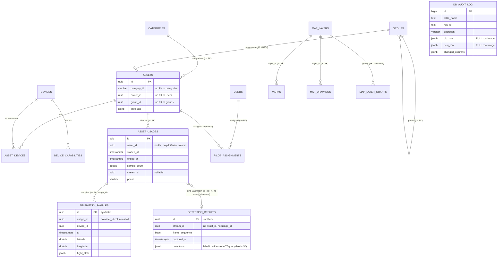

# PLATFORM AUDIT — Database (Lane C)

**Read-only audit, no product code touched.** Grounded in the 23 Flyway migrations
(`storage/persistence/src/main/resources/db/migration/V1`–`V23`), the JPA entities/repositories in
`storage/persistence`, `application.yaml`, and a live `docker exec` inspection of `vision-postgres-1`
(read-only `\dt+`, `count(*)`, `pg_relation_size`). The full build was never run. Docker was up
throughout; the live database had only run migrations through **V16** (a dev container from an
earlier branch state) — real row counts/sizes below are measured from it and are explicitly labeled
"measured"; everything about V17–V23 is read from the migration files and code, not observed live.
`df -h /` showed **95% full, 8.6 GB free** on a 159 GB disk at the start of this audit — a live,
present-tense constraint the growth arithmetic in §2 should be read against, not just a future one.

---

## 1. The schema as it actually is

28 tables (+ `flyway_schema_history`), one flat `public` schema, **zero cross-entity foreign keys**
by deliberate, repeatedly-stated convention (except three: `categories.parent_id` self-reference,
`device_capabilities.device_id → devices.id ON DELETE CASCADE`, `asset_devices.asset_id → assets.id
ON DELETE CASCADE`, and `map_layer_grants.layer_id → map_layers.id ON DELETE CASCADE`). The
no-FK convention exists to preserve write-parity with the now-**deleted** `InMemory*` reference
repositories (`docs/plans/done/POSTGRES-ONLY-CONTEXT.md` §OQ1 already flags this as stale and
unresolved — see Defect 5).

| Table | Context | Growth class | Migration | Retention/cap |
|---|---|---|---|---|
| `categories` | warehouse | fixed (7 seed rows) | V1, seeded V2 | n/a |
| `devices` | warehouse | linear-with-fleet | V1 | none |
| `device_capabilities` | warehouse | linear-with-fleet (join) | V1 | cascades with device |
| `assets` | warehouse | linear-with-fleet | V1 | none |
| `asset_devices` | warehouse | linear-with-fleet (join) | V1 | cascades with asset only |
| `asset_usages` | warehouse | linear-with-time (1 row/flight) **but UPDATEd ~1 Hz while open** | V3, +V4, +V19 | none — **NO retention story** |
| `asset_images` | warehouse | fixed (≤1/asset) | V5 | n/a (upsert) |
| `telemetry_samples` | perception | **unbounded firehose** | V3, +V6 | 100k rows/**usage** only — no cross-usage/time cap |
| `detection_results` | perception | **unbounded firehose** | V3 | 100k rows/**stream** only — no cross-stream/time cap |
| `detection_events` | perception | bounded-ish (debounced upsert) | V15 | 100k rows/stream, upsert not append |
| `groups` | identity | fixed/linear-with-fleet | V8, +V13, +V16 | n/a |
| `users` | identity | linear-with-fleet | V8 | none |
| `pilot_assignments` | identity | linear-with-fleet (roster, **not history**) | V9 | none (small by nature) |
| `geofence_zones` | flight | fixed (global reference) | V7 | n/a |
| `vehicle_profiles` | flight | linear-with-time (append-only per probe/phase) | V17, +V20 | **NO retention story** |
| `feature_requirements` | flight | fixed (seed-only, read-only) | V18 | n/a |
| `track_corrections` | flight | **unbounded firehose when `vision.geo.visual.enabled=true`** (off by default) | V23 | app-level: `PT12H` + 20,000/usage, runner-pruned |
| `marks` | map | linear-with-time (human-authored COP) | V10, +V12 | **NO retention story** |
| `map_layers` | map | fixed/linear-with-fleet | V12 | n/a |
| `map_layer_grants` | map | linear-with-fleet (join) | V12 | cascades with layer |
| `map_drawings` | map | linear-with-time (human-authored) | V12 | **NO retention story** |
| `camera_poses` | map | fixed (1/asset) | V22 | n/a (upsert) |
| `projected_track_points` | map | **unbounded firehose when `vision.geo.fixed-camera.enabled=true`** (off by default) | V22 | app-level: `PT30M` + 600/track, runner-pruned |
| `datasets` | learning | linear-with-fleet | V11 | **NO retention story** (feature off by default) |
| `training_samples` | learning | linear-with-time | V11 | **NO retention story** |
| `sample_images` | learning | linear-with-time, BYTEA | V11 | **NO retention story** |
| `audit_entries` | platform (cross-cutting) | **unbounded firehose — no retention, deliberately** | V14 | **none, by design** |
| `db_audit_log` | platform (cross-cutting, trigger-driven) | **unbounded firehose — no retention, deliberately, PLUS an unplanned write-amplification path** | V21 | **none, by design** |

### ER diagram — core entities

The diagram's `"no FK"` annotations are not decoration — they are the actual, current state, confirmed
by reading every migration: **no table below `public.categories`' self-reference has a foreign key to
anything owning it.** `detection_results` doesn't even have a column to join on except `stream_id`
(no `asset_id`, no `usage_id`) — see Defect 8 and §6.

---

## 2. The scalability verdict, quantified

### Rates used (measured/documented, not guessed)

- **Telemetry: ~1 Hz** — `TelemetryBatchSettings` javadoc states it directly: "a typical ~1Hz
  telemetry rate is what fires" the batch window (`storage/persistence/.../TelemetryBatchSettings.java:18-20`);
  `JpaTelemetryRepository`'s own retention-cap comment: "generous (at 1Hz, ...)".
- **Detection: 10 Hz** — `docs/conclusions/CV-RATE-BUDGET.md` states the ASSOCIATE default is
  `inferenceFps=10`, measured effective **9.998 fps** in a real run (its own §"effective fps" table).
  This only accrues when `vision.cv.enabled=true` (default **false** — CV is off out of the box,
  `application.yaml:271`) and, per `[[cv-demand]]`, only while a viewer has the stream open — the
  numbers below assume an operator flying with the cockpit view open, the product's actual purpose,
  not a pathological case.
- **`asset_usages` UPDATE rate while flying: ~1 Hz** — `UsageTracker#applySample`/`#flushUsageSummary`
  (`contexts/vision-perception/.../UsageTracker.java:740,761,787`) writes the usage-summary row on
  every `UsageSummaryBatchSettings` flush (default window 200 ms, same doc); since telemetry arrives
  slower than that window, in practice one summary write fires per telemetry sample — i.e. the same
  ~1 Hz. `asset_usages` **is** in `db_audit_log`'s audited-table list (`V21`), so this is also
  `db_audit_log`'s write rate for that table — see Defect 1.
- **Measured live row sizes** (from the actual `vision-postgres-1` container, `pg_relation_size`):
  `telemetry_samples` = **503 B/row total** (375 B table + 128 B index, 3,406 real rows);
  `detection_results` = **844 B/row total** (732 B table + 112 B index, 9,086 real rows). Used
  directly below instead of guessing.
- **`db_audit_log` row size: estimated, not measured** (the live container hasn't run V21). Each
  UPDATE row stores **two full JSON row-images** (`to_jsonb(OLD)` and `to_jsonb(NEW)`, every column,
  not just changed ones — see the trigger body, `V21__db_audit_log.sql`) plus `changed_columns` and
  bookkeeping columns. For `asset_usages`' 15 columns, ~550 B per row-image is a reasonable estimate
  → **~1.25 KB/row**, flagged explicitly as inferred arithmetic, shown so it can be checked.

### Three tiers, one year, 2 h/day flying

| Table | 10 assets | 100 assets (SCALE-100 target) | 1,000 assets |
|---|---|---|---|
| `telemetry_samples` (1 Hz × 7,200 s/day × 365) | 26.28M rows / **13.2 GB** | 262.8M rows / **132 GB** | 2.628B rows / **1.32 TB** |
| `detection_results` (10 Hz, CV on, × 7,200 s/day × 365) | 262.8M rows / **222 GB** | 2.628B rows / **2.22 TB** | 26.28B rows / **22.2 TB** |
| `db_audit_log` (via `asset_usages` amplification alone, ~1 Hz) | 26.28M rows / **~33 GB** (est.) | 262.8M rows / **~329 GB** (est.) | 2.628B rows / **~3.3 TB** (est.) |

Arithmetic shown: rows/asset/year = rate(Hz) × 7,200 s/day × 365 days. Bytes = rows × measured
(or estimated) bytes/row. E.g. telemetry: `1 × 7,200 × 365 = 2,628,000` rows/asset/year ×
`503 B` = `1.322 GB`/asset/year; × 10/100/1,000 assets as tabulated.

### Verdict

**`detection_results` dies first, and it dies at the 10-asset tier, inside year one** — 222 GB/year
against a disk that had **8.6 GB free** at audit time. Even ignoring `db_audit_log` and `telemetry_samples`
entirely, ten assets flying with CV on for two hours a day would exhaust the currently-observed free
disk in **under two weeks** (`8.6 GB ÷ (222 GB/365 days) ≈ 14 days`). At the SCALE-100 target
(100 assets) this table alone wants 2.2 TB in its first year. What breaks is disk, first — there is no
query-shape collapse before the disk fills, because (per §3) the hot-path writes are all indexed
correctly; the failure mode is pure volume, not a slow query, until §3's Defect 8 is also hit (a
fleet-wide unbounded read against this same table, which gets *slower*, not just bigger, as it grows).

**The more surprising number is `db_audit_log`.** It was designed and documented (`V21`'s own header)
to exclude "the high-volume append-only event tables" and include `asset_usages` on the explicit
stated belief that it is "a flight session record, not a per-sample event stream." SCALE-100's S4
telemetry-batching wave (which post-dates that belief) made `asset_usages` update at telemetry rate
while a usage is open. The audit table built to catch a DBA typing SQL by hand now silently absorbs a
second, heavier copy of every flight's write traffic — see Defect 1.

---

## 3. Indexes and query shapes

Cross-checked every `CREATE INDEX` (Vn migrations) against every `createQuery`/native query in
`storage/persistence/src/main/java/.../repository/*.java`.

**(a) Time-range + entity-id reads with no supporting index / unbounded fetch — the worst finding:**

`JpaDetectionRepository#query` (`storage/persistence/.../repository/JpaDetectionRepository.java:86-115`)
builds `select d from DetectionResultEntity d where 1=1 [and streamId=?] [and capturedAt>=?] [and
capturedAt<=?] order by capturedAt desc` and **calls `getResultList()` with no `setMaxResults` at
all** — `query.limit()` is applied in a Java `.stream().limit(...)` *after* the full result set is
already in the JVM heap (`:114-118`). The only index (`idx_detection_results_stream_id_captured_at`,
`(stream_id, captured_at)`) requires `stream_id` as its leading column; `DetectionQuery` allows
`streamId == null` with only `from`/`to` set — the exact "every detection of class X in a time
window, fleet-wide" shape the audit brief calls out — which becomes a full sequential scan **and**
fetches the entire matching set into memory before the label filter and limit ever run. On the
biggest table in the schema, this is the single most dangerous line in the module.

**(b) Missing supporting index for a frequently-hit list query:**

`JpaAssetUsageRepository#findRecent` (`:80-89`, the fleet-wide "replay library" list) and
`#findRecentByAsset` (`:66-77`) both `order by u.startedAt desc` with `setMaxResults` (bounded fetch,
good) — but **no index on `started_at` exists at all** (`V3__history.sql` only declares
`idx_asset_usages_asset_id (asset_id)`). Every call sorts the *entire* `asset_usages` table. Small
today (asset_usages only grows one row per flight), but at the 1,000-asset tier with realistic flight
cadence this is a seq-scan-and-sort that gets measurably worse every month with no index to fall back
to. `findRecentByAsset`'s own filter would also benefit from a composite `(asset_id, started_at)`
rather than sorting post-filter on an unindexed column.

**(c) Declared indexes nothing queries — three of them, same root cause:**

`JpaMarkRepository` has exactly four methods: `save`, `findById`, `findAll`, `deleteById`
(`storage/persistence/.../repository/JpaMarkRepository.java`, full file) — `findAll` is
`select m from MarkEntity m` with **no predicate whatsoever**. `idx_marks_group_id` and
`idx_marks_status` (`V10__marks.sql`) and `idx_marks_layer` (`V12__map_layers.sql`) are therefore
**never used by any query in this module** — all group/status/layer scoping happens in Java after a
full-table fetch, one layer up. `JpaDrawingRepository` has the identical shape (`findAll` only,
`storage/persistence/.../repository/JpaDrawingRepository.java:42-45`), so `idx_map_drawings_layer`
(`V12`) is equally unused. This isn't wrong today (both tables are small), but it means the COP's
whole per-layer/per-status filtering scales by fetching every mark and every drawing in the
deployment on every map load, and three indexes are pure write overhead with zero read benefit.

**(d) `findAll()` on an unbounded table: none found.** Good news — no firehose table (`telemetry_samples`,
`detection_results`, `detection_events`, `audit_entries`, `db_audit_log`) is ever fetched via a bare
`findAll()`. Every read against those five tables is bounded by `setMaxResults` or a real `WHERE`
except Defect (a) above.

**(e) Offset-based pagination over a growing table: none found in `storage/persistence`.** No
`setFirstResult` call exists anywhere in the module (confirmed by grep) — every list read is
"most-recent-N", never "page K of a growing set". This is a genuine strength, worth stating plainly
rather than only listing defects.

**(f) Well-indexed, worth naming so it isn't mistaken for a gap:** `telemetry_samples`
(`idx_telemetry_samples_usage_id_at`), `detection_events` (`stream_id, last_seen` and `last_seen`
alone), `audit_entries` (three composite indexes, each with `occurred_at` trailing to serve its own
`ORDER BY`), `db_audit_log` (`occurred_at`; `table_name, row_id, occurred_at`), `training_samples`
(`dataset_id, status`) — all match their repositories' actual predicates exactly.

---

## 4. Data-lifecycle gaps

**Nothing is ever deleted or rolled up except by a per-usage/per-stream row-count cap.**
`telemetry_samples`/`detection_results` prune the *oldest rows within one usage/stream* once it
passes 100,000 — a cap sized for "generous, ~1 day of continuous data for one flight/stream", never
triggered by realistic 2h/day flights. **There is no cross-usage, cross-stream, or wall-clock
retention for either table.** Every flight ever flown accumulates forever. `audit_entries` and
`db_audit_log` state this as a deliberate, explicit design choice in their own migration headers
("deliberately not addressed... a purge/rollup job is a known open item, not built here") — honest,
but still a gap with no owner or date. `marks`, `map_drawings`, `vehicle_profiles`, `training_samples`,
`sample_images` have **no retention story at all**, not even a documented deferral.

The two feature-gated geo-projection tables (`projected_track_points`, `track_corrections`) are the
schema's only tables with a **built-in, app-level retention loop** (time horizon + per-track/usage
row cap, pruned by their own runners) — proving the pattern is known and used elsewhere; it was
simply never applied to the two tables that actually accumulate the fastest by default
(`telemetry_samples`, `detection_results`) or to the audit tables.

**"What did this asset do last month?"** is answerable only by application-side stitching, not one
query: `telemetry_samples` carries **no `asset_id` column at all** (only `usage_id`, `device_id`), so
a month's telemetry for one asset requires first listing that asset's usages
(`findRecentByAsset`, capped at 10,000 by `DefaultAssetStatsService.STATS_FETCH_LIMIT`, itself
already self-documented as "under-reports... until this port grows a real server-side aggregate
query" — an honestly-flagged, pre-existing limitation, not something this audit is the first to
notice) and then one `findByUsage` call per usage (each capped at 20,000 samples by
`DefaultReplayService`). There is no monthly rollup, no materialized view, no single indexed query
that answers the question directly.

`asset_images`/`sample_images` hold raw photo bytes as Postgres `BYTEA` — already an open question
in `docs/plans/active/DOMAIN-SEPARATION-PLAN.md` §13 OQ3 ("Sample images at scale — Postgres bytea
today; an S3-compatible object store becomes attractive"). This audit corroborates that flag rather
than raising a new one: at the training-data volumes the CV-training loop implies, these two tables
are the same shape of problem `detection_results` is, one row insert away from mattering.

---

## 5. Correctness/modelling smells

- **FK convention is now stale, not just permissive** (Defect 5, ranked below): the "no FK" rule was
  justified by parity with `InMemory*` repositories that `POSTGRES-ONLY-CONTEXT.md` W2b deleted
  entirely. The plan's own §OQ1 already names this as unresolved. Concretely: deleting an `Asset`
  leaves `asset_usages`, `telemetry_samples` (via orphaned `usage_id`), `marks.owner_id`,
  `pilot_assignments.asset_id`, `map_layers.owner_user_id` all pointing at a dead id, forever, with
  no cascade and no way to detect it in SQL.
- **FK asymmetry inside one migration**: `V1__baseline.sql` gives `asset_devices.asset_id` a real
  `REFERENCES assets(id) ON DELETE CASCADE` but leaves `asset_devices.device_id` with **no** FK to
  `devices.id` at all — deleting a device leaves a dangling `asset_devices` row that deleting an
  asset would have cleaned up from the other side.
- **`assets.category_id`** references `categories.id` in spirit only — no FK — so an asset can carry
  a category slug that was later deleted from `categories`, and nothing surfaces that.
- **No pilot/actor on `asset_usages`** — `AssetUsage` (the domain record,
  `contexts/vision-warehouse/.../AssetUsage.java`) has no field naming who flew it. Combined with
  `pilot_assignments` being a *current roster*, not a history, "who flew this asset" cannot be
  reconstructed after the fact from any table in this schema — see §6.
- **Enums, timestamps, ids: all clean.** Every `@Enumerated` field in the module is
  `EnumType.STRING` (verified by grep across all 25 entities — none default to ordinal). Every
  timestamp column is `TIMESTAMPTZ`, never naive. Every id is a native Postgres `uuid` column
  matching a `java.util.UUID` field (verified in `AssetEntity`/`TelemetrySampleEntity`/
  `DbAuditLogEntity`) — no `varchar`-as-UUID anywhere. Positions/battery are `DOUBLE PRECISION`, not
  `REAL` — correct for GPS-grade precision, not a smell.
- **JSONB hides queryable fields** — `detection_results.detections` (label, confidence, box) and
  `telemetry_samples.extra`/`flight_state` are all read-back-whole jsonb with no first-class,
  indexable columns. For `detection_results` this directly causes Defect (a) above: label filtering
  happens in Java after a full fetch because there is no SQL-queryable label column. `detection_events`
  got this right (`label VARCHAR(255) NOT NULL`, a real column) — the asymmetry between the two
  tables is itself worth noting: the newer, smaller table is better modeled for querying than the
  older, bigger one.
- **"Newest data wins" (CLAUDE.md §9) is expressible almost everywhere** — every firehose table
  carries a monotonic timestamp (`at`, `captured_at`, `occurred_at`, `last_seen`) and repositories
  consistently sort `desc` on it. The one place it is *not* expressible: `db_audit_log` rows for the
  same transaction can share `occurred_at` down to column precision, which the repository already
  handles by tie-breaking on `id desc` (`JpaDbAuditLogRepository`) — correctly, not a gap.

---

## 6. Usefulness — questions the schema cannot answer today

1. **"Which pilot flew which asset the most (last quarter)?"** — impossible. No table records who
   was piloting during a given `asset_usage`; `pilot_assignments` is a current-roster join, not a
   flight-by-flight log. This is the single biggest product gap in the schema for an operations tool
   whose whole premise is accountable fleet operation.
2. **"Show every detection of class X near point Y in the last week."** — impossible for the common
   case (a normal flying camera). `detection_results.detections` carries no geo position at all
   (only pixel-space label/box) — only the two off-by-default geo-projection features
   (`projected_track_points`, `track_corrections`) carry lat/lon, and even then the query in Defect
   (a) would need to scan the whole table since there is no index once `stream_id` is dropped.
3. **"What changed on this asset, and who did it?"** — partially answerable, two different ways,
   that don't agree: `audit_entries` (application-intent, only wherever a service remembered to call
   `AuditTrailPort#record`) and `db_audit_log` (every column, every table, mechanically) tell two
   different stories with no join key connecting an `audit_entries` row to the `db_audit_log` rows
   its own write produced.
4. **"What did this asset do last month?"** — answerable only via N sequential queries (list usages,
   then fetch each usage's telemetry), never one query, and silently capped
   (`STATS_FETCH_LIMIT`/`TELEMETRY_FETCH_LIMIT`) rather than aggregated — see §4.
5. **"How much has this fleet flown, fleet-wide, this month?"** — no aggregate/rollup query exists
   anywhere in the repository layer; every stats path is fetch-then-aggregate in Java over a bounded
   list, which is honest today (see §4's `DefaultAssetStatsService` javadoc) but has no growth path
   built for it.

---

## 7. Ranked defect list

| # | Severity | Where | What breaks, and when | Smallest fix |
|---|---|---|---|---|
| 1 | **Critical** | `contexts/vision-perception/.../UsageTracker.java:740,761,787` write pattern + `V21__db_audit_log.sql`'s inclusion of `asset_usages` in the audited-table list | `db_audit_log` silently absorbs ~1 row/sec/flying-asset (matching telemetry rate) at ~2-3x the byte cost of the real telemetry row, because the table it's triggered on was designed assuming rare writes and now gets one every summary flush. No retention on `db_audit_log` either — see Defect 2. | Either exclude `asset_usages` from the audit trigger (its summary counters aren't the "who changed config" fact this table exists for) and audit only the *closing* of a usage, or add a `WHEN (OLD.sample_count IS DISTINCT FROM NEW.sample_count) IS NOT TRUE` trigger condition so counter churn stops being audited while real field edits still are. |
| 2 | **Critical** | `storage/persistence/.../repository/JpaDetectionRepository.java:86-115` | `query()` fetches the *entire* matching result set into JVM heap with no `setMaxResults`, and allows `streamId == null` with only a time range — the one predicate combination with no supporting index (`idx_detection_results_stream_id_captured_at` requires `stream_id` leading). On the largest table in the schema (222 GB/year at only 10 assets, §2), this is an OOM-and-seq-scan waiting for one fleet-wide "show me class X this week" call. | Add `setMaxResults(query.limit())` before `getResultList()` (bounds the memory problem immediately) and a second index `(captured_at)` alone, or a partial/functional index on the jsonb label, for the `streamId == null` path. |
| 3 | **High** | `telemetry_samples`/`detection_results`, `V3__history.sql`; retention only in `JpaTelemetryRepository`/`JpaDetectionRepository` | No cross-usage/cross-stream/wall-clock retention at all — every flight ever flown, every detection ever run, accumulates forever. At the SCALE-100 target (100 assets) this is 132 GB/year (telemetry) + 2.2 TB/year (detection, CV-on) with no purge mechanism, against a box already at 95% disk. | Borrow the pattern `V22`/`V23` already use for `projected_track_points`/`track_corrections`: a scheduled runner pruning rows older than a configured horizon, gated by a `vision.persistence.retention.*` property (opt-in guardrail: default = current unbounded behavior, so no default-config test changes). |
| 4 | **High** | `AssetUsage` domain record (`contexts/vision-warehouse/.../AssetUsage.java`), `pilot_assignments` (`V9__pilot_assignments.sql`) | "Which pilot flew this asset" is unrecoverable after the fact — no column anywhere records the acting pilot per flight. This is a product-level usefulness gap, not just a query-shape one (§6.1). | Add a nullable `pilot_id` column to `asset_usages`, stamped by `UsageTracker` from `CurrentUser` at usage-open time — same "record once at open, never changed" shape `streamId` already has. |
| 5 | **Medium** | Every migration's "no cross-entity foreign keys" convention, most explicitly `V1__baseline.sql` (asset/device tables) | Deleting an asset/device/user leaves orphaned rows in `asset_usages`, `telemetry_samples` (via `usage_id`), `marks`, `pilot_assignments`, `map_layers` forever, undetectable in SQL. The stated justification (in-memory parity) no longer exists — `POSTGRES-ONLY-CONTEXT.md` §OQ1 already flags this as open and unresolved. | A follow-up migration adding `ON DELETE SET NULL`/`ON DELETE CASCADE` per table, scoped as its own reviewed change (blast radius, not a one-line fix) — already correctly identified as out-of-scope-here by the plan that raised it. |
| 6 | **Medium** | `V1__baseline.sql`: `asset_devices.asset_id` has `ON DELETE CASCADE`, `asset_devices.device_id` does not | Deleting a device (not an asset) leaves a dangling `asset_devices` row referencing it — asymmetric within the *same table*, not just "no FK anywhere". | Add the missing `REFERENCES devices(id) ON DELETE CASCADE` to `asset_devices.device_id` in a follow-up migration. |
| 7 | **Medium** | `JpaMarkRepository`/`JpaDrawingRepository` (`findAll()`, no predicate) vs. `idx_marks_group_id`/`idx_marks_status`/`idx_marks_layer`/`idx_map_drawings_layer` (`V10`, `V12`) | Three-plus declared indexes are pure write overhead with zero read benefit today; more importantly, the COP fetches *every* mark and *every* drawing in the deployment on every read, with all scoping done in Java afterward — this is a "linear-with-time, not literally bounded" table being read as if it were `findAll`-safe. | Either add `findByLayer`/`findByGroup`/`findByStatus` query methods that actually use the declared indexes (letting the app layer stop filtering post-fetch), or drop the unused indexes and accept `findAll` — pick one, the current state has the cost of both. |
| 8 | **Medium** | `JpaAssetUsageRepository#findRecent`/`#findRecentByAsset` (`:66-89`) vs. `V3__history.sql` (`idx_asset_usages_asset_id` only, no `started_at` index) | Every "recent flights" list call sorts the whole `asset_usages` table (or the whole per-asset slice) with no index backing `ORDER BY started_at DESC` — cheap today, a real seq-scan-and-sort at the 1,000-asset tier. | Add `idx_asset_usages_started_at (started_at)` for `findRecent`, and widen `idx_asset_usages_asset_id` to `(asset_id, started_at)` for `findRecentByAsset`. |
| 9 | **Low** | `audit_entries`/`db_audit_log` migration headers, both explicit | Both tables state "no retention, deliberately" with "a purge/rollup job is a known open item, not built here" — honest, but genuinely open, and now compounded by Defect 1's amplification. | Same runner pattern as Defect 3, on its own horizon (audit data usually wants a longer retention than telemetry, e.g. compliance-driven, not the same knob). |

---

## 8. What's already right (do not "fix" these)

- No offset-based pagination anywhere in the module — every list read is bounded, newest-first.
- No firehose table is ever `findAll()`'d.
- Every timestamp is timezone-aware, every enum is string-mapped, every id is a native `uuid` column
  — no lurking ordinal/varchar/naive-timestamp bugs to chase.
- `telemetry_samples`, `detection_events`, `audit_entries`, `db_audit_log`, `training_samples` all
  have indexes that exactly match their repositories' real query predicates.
- The two off-by-default geo-projection tables already demonstrate the retention pattern (time
  horizon + per-key row cap, runner-pruned) the two biggest firehoses (`telemetry_samples`,
  `detection_results`) and both audit tables still lack.
