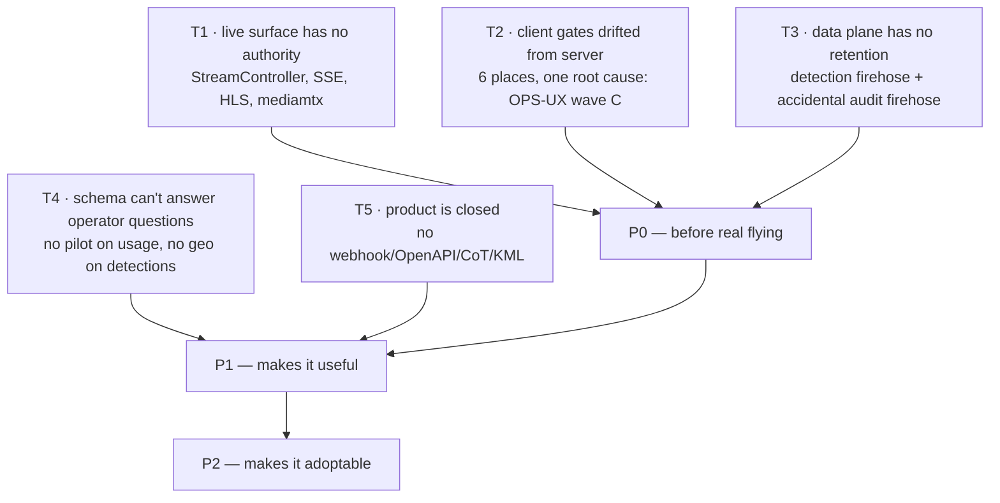

# PLATFORM AUDIT — findings and ranked action list

**Date** 2026-08-21 · four read-only lanes (UI / scope / DB / analogs) · lane reports:
[UI](PLATFORM-AUDIT-UI.md) · [SCOPE](PLATFORM-AUDIT-SCOPE.md) · [DB](PLATFORM-AUDIT-DB.md) · [ANALOGS](PLATFORM-AUDIT-ANALOGS.md)

## The one-paragraph answer

The **management plane is well built** — 80 of 124 endpoints are properly scope-checked, the SPA has no
orphan pages and no dead stubs, `asset-detail` is a real single home, MANAGER-scoped people management
works server-side. The **live-operations plane was never given the same treatment**: streaming, SSE and
HLS carry no authority at all, so the scopes an operator trusts stop at the edge of the cockpit. The
**data plane is not yet real** — it is empty today, and the first serious flying will fill it at ~222 GB/
year/10 assets with no retention anywhere. And the product is **closed** — no webhook, no API contract,
no interop format — which is the cheapest thing to fix and the one that decides adoption.

## Five themes (findings collapse into these, not into 30 separate bugs)

### T1 — the live-operations surface has no authority *(the headline)*

Every finding below is one campaign, not four:

| Hole | Evidence | What it means |
|---|---|---|
| `StreamController` — all 8 endpoints | no `VisibilityScope` reference in the file (verified) | a PILOT lists/snapshots/reconfigures **any** asset's stream |
| SSE `/api/live` per-asset topics | predicate is `MapVisibility` only — filters marks/layers, not `telemetry:`/`detections:` | any authenticated caller subscribes to any asset by guessing an id |
| `PATCH /api/live/{connectionId}/topics` | no check the caller owns the connection | *found during verification, not in the lane report* |
| `/hls/{streamId}/**` | `HlsProxyController` — no auth | any stream's live video |
| Device + geofence CRUD | no check in controller **or** service | no-fly zones are safety-relevant |
| `mediamtx.yml` `user: any`, empty pass | grants `publish` + `read` + `playback` on 0.0.0.0 ports | **video injection**, not only viewing. Control API (9997) *is* loopback-bound — that part is fine |

There are **zero** Spring Security role annotations in the codebase; the chain only asserts
`.authenticated()`. Where the hand-written check is missing there is no fallback.

### T2 — the client promises authority the server refuses

OPS-UX wave C tightened the server (`canManageOrg()`→`canAdminister()`); the SPA gates were never
updated. Verified: `DefaultModelRegistryService.promote` requires ADMIN, `models-facade.ts:71` gates on
`canManageOrg()` = ADMIN **or MANAGER** (`org-logic.ts:23-25`). Six locations, all failing in the
dangerous direction — enabled control, refusal after the user commits.

### T3 — the data plane will not survive first contact

Rates from the code (telemetry 1 Hz, detections 10 Hz), row sizes measured live (503 B / 844 B):

| Tier (2 h/day, 1 yr) | `detection_results` | `telemetry_samples` | `db_audit_log` (accidental) |
|---|---|---|---|
| 10 assets | **~222 GB** | ~13 GB | ~33 GB |
| 100 assets (SCALE-100 target) | **~2.2 TB** | ~132 GB | ~329 GB |
| 1000 assets | ~22 TB | ~1.3 TB | ~3.3 TB |

Nothing is ever deleted or rolled up. The only retention loops in the schema are on the two
**off-by-default** geo tables. `db_audit_log` was designed in V21 as low-frequency and later had
`asset_usages` routed through it by SCALE-100's batching wave — ~1 row/sec/flying asset nobody intended.
**Mitigating:** detection is default-off *and* demand-gated, and the tables are empty today — so these
migrations are free right now and expensive after the first month of flying.

### T4 — the questions the schema cannot answer

`AssetUsage` has no pilot column → "who flew this" is unrecoverable. Ordinary detections have no geo
column → "every detection of class X near point Y" is unaskable despite both geolocation stacks
shipping. Two audit mechanisms with no join key → "what changed and who did it" needs stitching. No
aggregate anywhere → "fleet flight-hours this month" does not exist.

### T5 — nothing can integrate with it

Alone at *missing* against all 8 analogs: **no notification channel of any kind** (no webhook, MQTT,
email). Also absent: rule engine + acknowledge, per-path retention, signed/lockable evidence,
account-free share link, any interop format, ONVIF media pull, fleet-ops records (battery cycles,
component hours, maintenance due, pilot currency). `ARCHITECTURE.md` §2 cites an
`openapi.yaml` that **does not exist** — 124 endpoints undescribed, no machine tokens.

## Ranked action list

| # | Action | Effort | Theme | Why this rank |
|---|---|---|---|---|
| 1 | Scope the live surface: `StreamController`, SSE topics + connection ownership, HLS proxy | **M** | T1 | The scopes are decorative until this lands |
| 2 | mediamtx credentials + drop `publish` from public ports | **S** | T1 | Video injection is worse than video leakage |
| 3 | Re-align the 6 client gates to server authority | **S** | T2 | Pure honesty; users currently get refused after committing |
| 4 | Device + geofence CRUD authority | **S** | T1 | No-fly zones are safety-relevant |
| 5 | Retention + partitioning on the two firehoses; unwire `db_audit_log` amplification | **M** | T3 | Free now, a maintenance window later |
| 6 | `AssetUsage.pilot` + detection geo column | **S** | T4 | Two columns unlock accountability + spatial search |
| 7 | OpenAPI contract + machine API tokens | **S** | T5 | Prerequisite for every integration below |
| 8 | Webhook + MQTT v5 egress | **S** | T5 | The only row where we're alone against all analogs |
| 9 | KML/KMZ + GeoJSON + GPX import/export | **S** | T5 | Operators already live in these formats |
| 10 | Crew: build `CREW-CONTROL-PLAN` (`AssignmentRole{PIC,OBSERVER}` + TTL control claim) | **M** | T1/T5 | Today two pilots can command one aircraft |
| 11 | CoT egress + 2525/APP-6 symbols (**gated on `feat/track-identity` merging**) | **M** | T5 | The only self-service door into the defence lane |
| 12 | Alert rules + acknowledge; per-asset retention; self-hosted basemap | **M** | T5 | Closes the VMS-maturity gap |

## Do NOT build

1. **Mission execution / waypoint upload** — `MISSIONS-PLAN.md` (active, 464 lines, XL) contradicts
   MOAT §6 and MASTER-MATRIX B9/M3, both marked NO. QGC does it free. Build mission *tasking* +
   `.plan` import/export instead. **Reconcile this in writing before anyone starts it.**
2. **Emitting MISB KLV / STANAG 4609** — mediamtx drops KLV on RTSP read (upstream #5612), KLV PR
   closed unmerged. Consume KLV; never promise emission.
3. **Becoming a VMS / ONVIF Profile M device** — client ONVIF is a week; being a conformant device is
   membership + tooling, and chasing Milestone abandons the rows where we're alone.

## Strategy note (for MOAT.md)

Pillar 2 is partly commoditized (Frigate+ ships correction→retrain at $50/yr). Pillar 3's defensible
artifact is not "a COP" — transports and entity schemas are commodity — it is the **server-side fuser**:
video + pose/gimbal + DEM → stable georeferenced tracks → CoT egress, multi-camera, multi-tenant.
Detection stacks have no geo; geo stacks have no detection. Pillars 2 and 3 are one pillar — the act
that verifies a track is the act that mints a label, and `Mark.verification`/`MarkStatus` already exist.

## Naming corrections found during research

**Nettle IS Kropyva** (English calque, not a separate system) · **ComBat Vision is not Ukrspecsystems** ·
**Mantis and Sich are not Ukrainian C2 software**. `tak.gov` blocks automated access (HTTP 421), so all
TAK facts came via GitHub/app stores; unconfirmed items are marked UNVERIFIED in the lane report.
